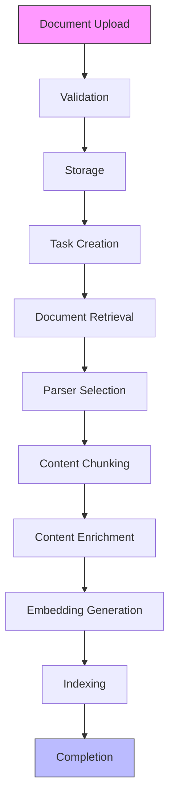
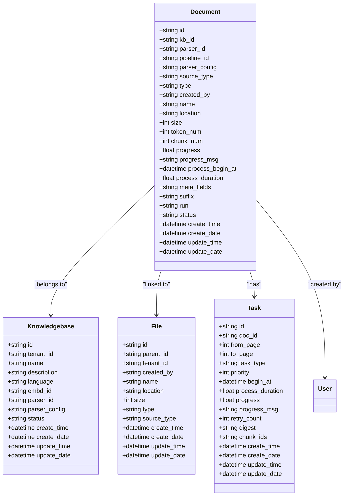
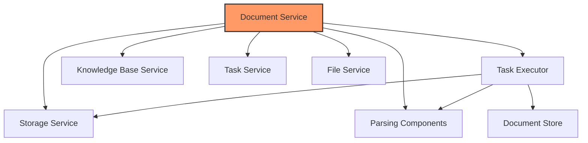

# Document Service

<cite>
**Referenced Files in This Document**   
- [document_service.py](file://api/db/services/document_service.py)
- [document_app.py](file://api/apps/document_app.py)
- [task_executor.py](file://rag/svr/task_executor.py)
- [file_service.py](file://api/db/services/file_service.py)
- [db_models.py](file://api/db/db_models.py)
- [task_service.py](file://api/db/services/task_service.py)
</cite>

## Table of Contents
1. [Introduction](#introduction)
2. [Document Lifecycle Management](#document-lifecycle-management)
3. [Document Parsing Workflows](#document-parsing-workflows)
4. [Metadata Handling](#metadata-handling)
5. [Service Interfaces](#service-interfaces)
6. [Domain Model](#domain-model)
7. [Usage Patterns in RAG Pipeline](#usage-patterns-in-rag-pipeline)
8. [Relationships with Other Components](#relationships-with-other-components)
9. [Common Issues and Solutions](#common-issues-and-solutions)
10. [Conclusion](#conclusion)

## Introduction
The Document Service is a core component of the RAGFlow system, responsible for managing the complete lifecycle of documents within knowledge bases. This service handles document creation, processing, metadata management, and integration with the RAG pipeline. It serves as the central hub for document operations, coordinating with various components such as the task executor, storage services, and parsing engines to ensure documents are properly processed and made available for retrieval and analysis.

The Document Service provides a comprehensive API for document management, supporting operations like upload, parsing, metadata extraction, and status tracking. It implements a robust state management system that tracks document processing progress from upload through parsing and indexing. The service is designed to handle various document types including PDFs, spreadsheets, presentations, and images, applying appropriate parsing strategies based on document type and configuration.

This documentation provides a detailed analysis of the Document Service implementation, covering its architecture, key components, workflows, and integration points within the RAG pipeline.

**Section sources**
- [document_service.py](file://api/db/services/document_service.py#L1-L1031)

## Document Lifecycle Management
The Document Service implements a comprehensive document lifecycle management system that tracks documents from creation through processing to final availability in the knowledge base. The lifecycle consists of several distinct states, each representing a phase in the document's processing journey.

When a document is first uploaded, it enters the "NEW" state with a progress value of 0. The service validates the document against size and naming constraints before storing it in the configured storage backend (typically MinIO). At this stage, the document record is created in the database with basic metadata including name, size, type, and location within the storage system.

Once validated, the document transitions to the "QUEUED" state, where it awaits processing by the task executor. The Document Service coordinates this transition by creating appropriate tasks in the task queue. The service maintains a progress tracking system that monitors the document's processing status, updating the progress field from 0 to 1 as processing advances. Special states include "RUNNING" (progress between 0 and 1), "DONE" (progress = 1), and "FAILED" (progress = -1).

The service also supports document state transitions through user-initiated actions. Documents can be canceled during processing, which sets their status to "CANCEL" and halts further processing. Documents can also be deleted, which triggers cleanup operations including removal from the document store and deletion of associated chunks and metadata.

The Document Service implements a sophisticated progress synchronization mechanism that aggregates progress from multiple processing tasks. For complex documents that require multiple processing stages (such as parsing, chunking, and embedding), the service combines progress reports from individual tasks to provide a unified progress indicator. This ensures users receive accurate feedback on the overall processing status.

**Section sources**
- [document_service.py](file://api/db/services/document_service.py#L627-L739)
- [document_service.py](file://api/db/services/document_service.py#L740-L773)

## Document Parsing Workflows
The Document Service orchestrates complex document parsing workflows that transform raw documents into structured, searchable content. These workflows are implemented through a coordinated interaction between the Document Service, Task Service, and Task Executor components.

When a document requires parsing, the Document Service initiates the process by creating appropriate tasks in the task queue. For PDF documents, the service analyzes the document structure and may create multiple parsing tasks for different page ranges, enabling parallel processing. The task creation logic considers document type, parser configuration, and system load to optimize processing efficiency.

The parsing workflow begins with document retrieval from storage. The Task Executor fetches the document binary from the storage backend (MinIO) and passes it to the appropriate parser based on the document type. The system supports various parsers including:
- PDF parser with layout recognition capabilities
- Spreadsheet parser for Excel files
- Presentation parser for PowerPoint documents
- Document parser for Word files
- Image parser with OCR capabilities

Each parser implements a chunking strategy that divides the document content into manageable segments. The chunking process considers document structure, content type, and user configuration to create semantically meaningful chunks. For example, the PDF parser respects document sections and headings when creating chunks, while the spreadsheet parser may create chunks based on worksheet structure.

After chunking, the workflow proceeds to content enrichment, where additional metadata is extracted from the chunks. This includes keyword extraction, question generation, and semantic tagging. The Document Service coordinates these enrichment tasks, ensuring they are executed in the proper sequence and their results are properly integrated.

The final stage of the parsing workflow is indexing, where processed chunks are stored in the document store (typically Elasticsearch or Infinity). The Document Service updates the document's token and chunk counts and marks the processing as complete when all chunks are successfully indexed.

**Diagram sources**
- [document_service.py](file://api/db/services/document_service.py#L627-L739)
- [task_executor.py](file://rag/svr/task_executor.py#L225-L384)
- [file_service.py](file://api/db/services/file_service.py#L430-L488)

## Metadata Handling
The Document Service implements a flexible metadata handling system that supports both system-generated and user-defined metadata. This system enables rich document classification, filtering, and search capabilities within knowledge bases.

System metadata is automatically generated during document processing and includes essential information such as:
- Document name and location
- File size and type
- Creation and modification timestamps
- Processing status and progress
- Token and chunk counts
- Parser configuration
- Thumbnail reference

In addition to system metadata, the service supports custom user-defined metadata through the meta_fields property. Users can attach arbitrary key-value pairs to documents, with values restricted to strings, integers, or floats. This metadata is stored as a JSON object in the database and can be used for advanced filtering and organization of documents within knowledge bases.

The service provides API endpoints for metadata management, allowing users to set, update, and retrieve document metadata. When metadata is updated, the service validates the input to ensure it conforms to the supported types and updates the document record atomically. The metadata system also supports bulk operations, enabling efficient metadata updates across multiple documents.

Metadata plays a crucial role in the RAG pipeline, as it enables content filtering and relevance ranking during retrieval. Documents with specific metadata values can be prioritized or excluded from search results based on user requirements. The service also supports metadata-based access control, where document visibility can be controlled based on metadata values.

The metadata handling system is integrated with the document filtering interface, allowing users to filter documents by metadata values. This enables powerful organizational capabilities, such as grouping documents by project, department, or content type. The service maintains metadata statistics for knowledge bases, providing insights into the distribution of metadata values across documents.

**Section sources**
- [document_service.py](file://api/db/services/document_service.py#L640-L662)
- [document_app.py](file://api/apps/document_app.py#L679-L709)

## Service Interfaces
The Document Service exposes a comprehensive set of interfaces for document management operations. These interfaces are implemented as REST API endpoints in the document_app.py module and provide both synchronous and asynchronous operations for document manipulation.

The primary interfaces include:

**Document Creation and Upload**
- POST /upload: Upload one or more documents to a knowledge base
- POST /create: Create a virtual document (placeholder) in a knowledge base
- POST /web_crawl: Create a document from a web page URL

**Document Management**
- POST /list: Retrieve a list of documents in a knowledge base with filtering and pagination
- POST /filter: Get document filtering statistics for a knowledge base
- POST /rm: Remove documents from a knowledge base
- POST /rename: Rename a document
- POST /change_status: Change document status (enable/disable)
- POST /change_parser: Change the parser configuration for a document

**Document Processing**
- POST /run: Start, stop, or restart document processing
- POST /parse: Parse document content without storing it
- POST /upload_and_parse: Upload and parse a document in a single operation

**Document Retrieval**
- GET /get/<doc_id>: Retrieve the raw document content
- GET /image/<image_id>: Retrieve document thumbnails
- POST /thumbnails: Retrieve thumbnails for multiple documents
- POST /infos: Retrieve detailed information about multiple documents

The service interfaces follow a consistent pattern with standardized error handling and response formats. All endpoints require authentication and enforce access control based on user permissions. The interfaces support various filtering options, including by document name, type, suffix, and processing status.

The API is designed to be idempotent where possible, ensuring consistent behavior when operations are retried. For example, attempting to upload a document with a name that already exists in the knowledge base will result in an error rather than creating a duplicate.

The service also implements rate limiting and validation to prevent abuse and ensure data integrity. Document names are validated for length and encoding, and file sizes are checked against system limits before upload.

**Section sources**
- [document_app.py](file://api/apps/document_app.py#L50-L719)

## Domain Model
The Document Service is built around a well-defined domain model that represents documents and their relationships within the system. The core entity is the Document, which is persisted in the database and serves as the foundation for all document operations.

The Document entity includes the following key attributes:

**Identification and Relationships**
- id: Unique identifier for the document
- kb_id: Reference to the knowledge base containing the document
- created_by: User who created the document
- pipeline_id: Reference to the data processing pipeline

**Document Properties**
- name: Document name
- type: Document type (PDF, spreadsheet, presentation, etc.)
- suffix: File extension
- size: Document size in bytes
- location: Path within the storage system
- thumbnail: Reference to document thumbnail

**Processing State**
- run: Processing status (RUNNING, DONE, CANCEL, etc.)
- progress: Processing progress (0.0 to 1.0, or -1 for error)
- progress_msg: Processing status message
- process_begin_at: Timestamp when processing started
- process_duration: Duration of processing in seconds

**Content and Structure**
- parser_id: Identifier of the parser used for processing
- parser_config: Configuration for the parser
- token_num: Number of tokens in the processed document
- chunk_num: Number of chunks created from the document
- meta_fields: Custom metadata key-value pairs

The Document entity is related to other entities through several associations:
- Knowledgebase: Each document belongs to exactly one knowledge base
- File: Documents are linked to file records for storage management
- Task: Documents have associated processing tasks
- User: Documents are created by specific users

The domain model supports inheritance through the parser configuration, where different document types may have specialized configuration options. For example, PDF documents may have layout recognition settings, while spreadsheet documents may have table extraction configurations.

The model is designed to be extensible, allowing new attributes to be added without requiring database schema changes. Custom metadata is stored in the meta_fields JSON field, enabling flexible document annotation without schema modifications.

**Diagram sources**
- [db_models.py](file://api/db/db_models.py#L800-L822)
- [db_models.py](file://api/db/db_models.py#L700-L732)

## Usage Patterns in RAG Pipeline
The Document Service plays a central role in the RAG (Retrieval-Augmented Generation) pipeline, serving as the entry point for document content and managing its transformation into a format suitable for retrieval and generation.

The typical usage pattern begins with document ingestion, where documents are uploaded to a knowledge base through the Document Service. Once uploaded, documents are processed according to their type and configuration, with the Document Service coordinating the parsing workflow. This processing transforms raw documents into structured chunks that can be effectively searched and retrieved.

In the retrieval phase, the Document Service provides metadata and filtering capabilities that enable precise document selection. When a query is received, the system can filter documents based on metadata, type, or processing status before performing semantic search on the content. This two-stage approach improves retrieval efficiency and relevance.

The service also supports advanced RAG patterns such as:
- **Incremental indexing**: New documents can be added to a knowledge base without reprocessing existing content
- **Selective processing**: Documents can be processed with different parsers or configurations based on their content or metadata
- **Metadata-aware retrieval**: Search results can be filtered or ranked based on document metadata
- **Document versioning**: Multiple versions of a document can be maintained and retrieved as needed

The Document Service integrates with the task execution system to support asynchronous processing, allowing documents to be ingested and made available for retrieval without blocking user interactions. This enables real-time document management while background processing handles the computationally intensive parsing tasks.

For large documents or document collections, the service supports batch operations that can process multiple documents efficiently. This is particularly useful for initial knowledge base population or bulk updates.

The service also provides progress tracking and monitoring capabilities that are essential for managing the RAG pipeline. Users can monitor document processing status and receive notifications when documents are ready for use, ensuring timely availability of content for retrieval and generation.

**Section sources**
- [document_service.py](file://api/db/services/document_service.py#L627-L739)
- [task_executor.py](file://rag/svr/task_executor.py#L225-L384)

## Relationships with Other Components
The Document Service maintains critical relationships with several other components in the RAGFlow system, forming an integrated document processing pipeline.

**Task Executor**
The Document Service works closely with the Task Executor to manage document processing. When a document requires parsing, the Document Service creates tasks in the queue that are consumed by the Task Executor. The Task Executor processes these tasks, performs the actual parsing and chunking, and updates progress through the Document Service API. This separation of concerns allows the Document Service to focus on document management while the Task Executor handles the computationally intensive processing tasks.

**Storage Services**
The Document Service interfaces with storage services (typically MinIO) to persist document binaries and thumbnails. It manages the storage lifecycle, including upload, retrieval, and deletion of document content. The service maintains references to storage locations in the document metadata, enabling efficient access to document content when needed.

**Knowledge Base Service**
The Document Service is tightly integrated with the Knowledge Base Service, as documents are always associated with a specific knowledge base. The service enforces knowledge base constraints such as document limits and access permissions. It also updates knowledge base statistics (token count, document count) when documents are added or removed.

**Task Service**
The Document Service relies on the Task Service to manage the processing tasks associated with documents. It creates tasks for document parsing and monitors their progress. The Task Service provides the queuing and execution framework that enables asynchronous document processing.

**File Service**
The Document Service works with the File Service to manage the file system representation of documents. The File Service handles folder structure and file organization, while the Document Service manages the document processing aspects. This separation allows for flexible document organization independent of processing status.

**Parsing Components**
The Document Service coordinates with various parsing components (PDF parser, spreadsheet parser, etc.) to extract content from documents. It selects the appropriate parser based on document type and configuration, passes the document content to the parser, and processes the resulting chunks.

These relationships form a cohesive document processing pipeline where the Document Service acts as the orchestrator, coordinating the activities of specialized components to deliver a seamless document management experience.

**Diagram sources**
- [document_service.py](file://api/db/services/document_service.py#L28-L38)
- [task_executor.py](file://rag/svr/task_executor.py#L54-L58)
- [file_service.py](file://api/db/services/file_service.py#L30-L38)

## Common Issues and Solutions
The Document Service addresses several common issues that arise in document processing systems, providing robust solutions to ensure reliable operation.

**Document Processing Failures**
One common issue is document processing failures due to corrupted files, unsupported formats, or system errors. The Document Service handles these by setting the document progress to -1 and recording detailed error messages in the progress_msg field. Users can then review the error and take corrective action, such as uploading a corrected version of the document.

**Large Document Processing**
Large documents can cause memory issues or timeout errors during processing. The service mitigates this by implementing chunked processing for large documents, particularly PDFs, where the document is processed in smaller page ranges. This approach reduces memory usage and allows for more granular progress tracking.

**Duplicate Document Handling**
When attempting to upload a document with a name that already exists in a knowledge base, the service prevents duplicates by validating document names before upload. If a duplicate name is detected, the service returns an appropriate error message, prompting the user to choose a different name.

**Storage Issues**
Problems with the underlying storage system (MinIO) can affect document availability. The Document Service includes retry logic and error handling for storage operations, with detailed logging to help diagnose storage-related issues. It also validates document existence in storage before processing to prevent errors from missing files.

**Parser Compatibility Issues**
Some documents may not parse correctly with the default parser settings. The service addresses this by allowing users to configure parser settings for each document type, including layout recognition, language settings, and chunking parameters. This flexibility enables optimization of parsing for specific document types or content.

**Progress Tracking Inaccuracies**
In distributed processing environments, progress tracking can become inconsistent. The Document Service implements a robust progress synchronization mechanism that aggregates progress from multiple processing tasks and handles edge cases such as task cancellation or failure. This ensures accurate progress reporting to users.

**Resource Limitations**
System resource limitations can affect document processing performance. The service includes configuration options for processing limits, such as maximum concurrent tasks and batch sizes, allowing administrators to tune performance based on available resources.

By addressing these common issues, the Document Service provides a reliable and user-friendly document management experience, minimizing disruptions and ensuring consistent processing results.

**Section sources**
- [document_service.py](file://api/db/services/document_service.py#L114-L121)
- [task_executor.py](file://rag/svr/task_executor.py#L224-L248)

## Conclusion
The Document Service is a comprehensive and robust component that forms the foundation of document management in the RAGFlow system. It provides a complete solution for handling the entire document lifecycle, from upload and processing to retrieval and analysis.

Through its well-designed architecture and integration with other system components, the Document Service enables efficient and reliable document processing at scale. Its support for various document types, flexible metadata handling, and sophisticated parsing workflows make it well-suited for complex RAG applications.

The service's API design prioritizes usability and consistency, providing developers with clear interfaces for document management operations. Its error handling and progress tracking capabilities ensure a smooth user experience, even when processing large or complex documents.

As the central hub for document operations, the Document Service plays a critical role in the overall RAG pipeline, ensuring that documents are properly processed and made available for retrieval and generation. Its design balances performance, reliability, and flexibility, making it a key enabler of effective knowledge management and AI-powered applications.