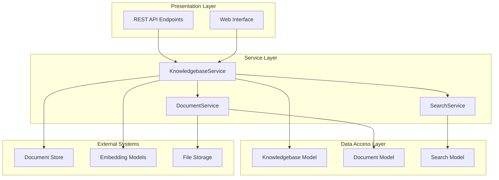
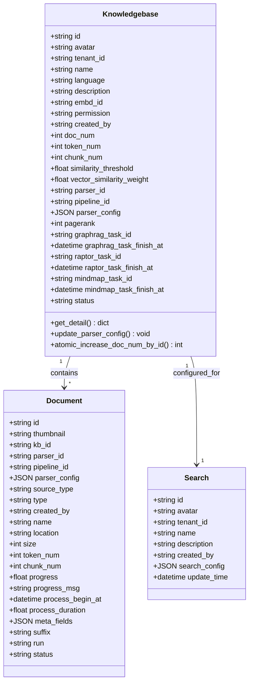
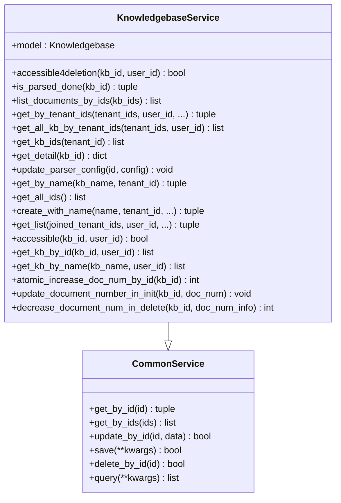
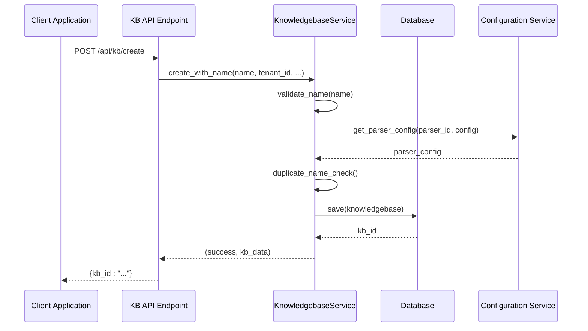
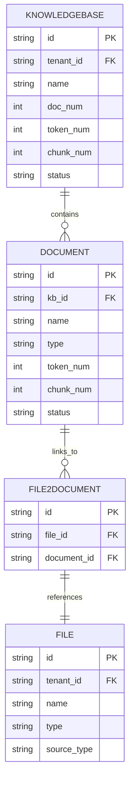
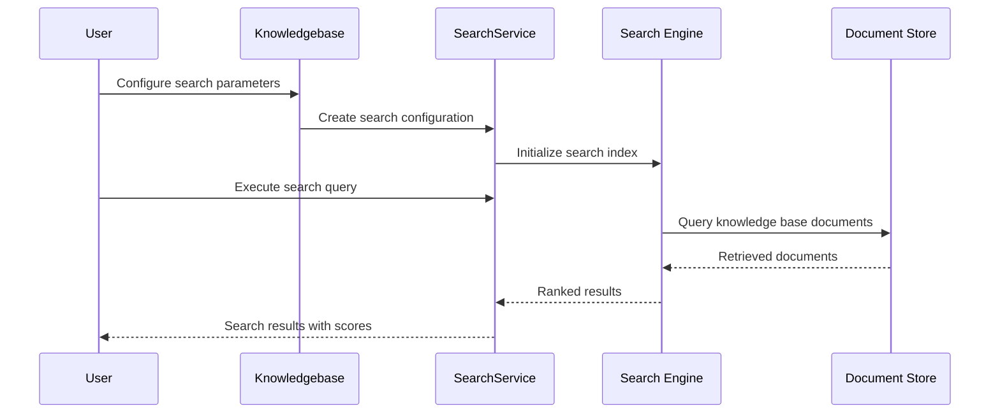
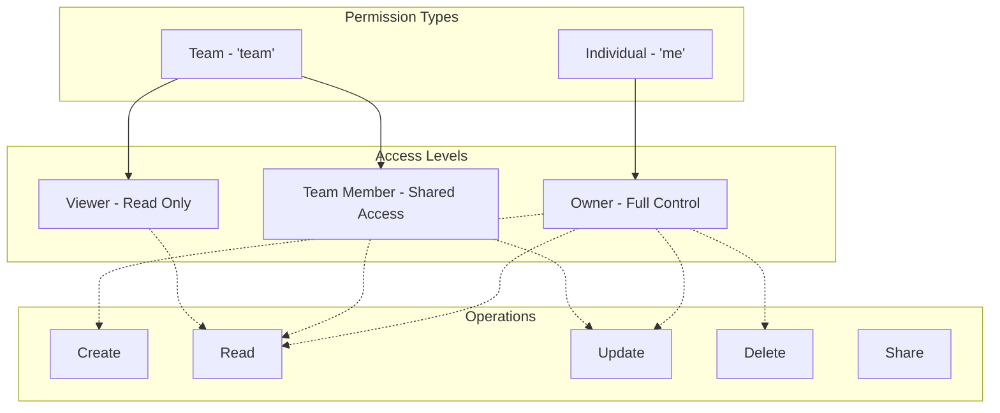
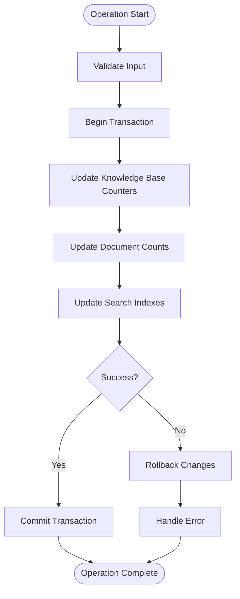

# Knowledge Base Service

<cite>
**Referenced Files in This Document**
- [knowledgebase_service.py](file://api/db/services/knowledgebase_service.py)
- [kb_app.py](file://api/apps/kb_app.py)
- [db_models.py](file://api/db/db_models.py)
- [search_service.py](file://api/db/services/search_service.py)
- [document_service.py](file://api/db/services/document_service.py)
- [search.py](file://rag/nlp/search.py)
- [retrieval.py](file://agent/tools/retrieval.py)
- [task_executor.py](file://rag/svr/task_executor.py)
- [common-item.tsx](file://web/src/pages/dataset/dataset-setting/configuration/common-item.tsx)
- [dataset-creating-dialog.tsx](file://web/src/pages/datasets/dataset-creating-dialog.tsx)
</cite>

## Table of Contents
1. [Introduction](#introduction)
2. [Architecture Overview](#architecture-overview)
3. [Domain Model](#domain-model)
4. [Service Implementation](#service-implementation)
5. [Knowledge Base Creation and Configuration](#knowledge-base-creation-and-configuration)
6. [Document Association Management](#document-association-management)
7. [Search and Retrieval Integration](#search-and-retrieval-integration)
8. [Access Control and Permissions](#access-control-and-permissions)
9. [Knowledge Base Consistency Management](#knowledge-base-consistency-management)
10. [Usage Patterns and Examples](#usage-patterns-and-examples)
11. [Common Issues and Solutions](#common-issues-and-solutions)
12. [Best Practices](#best-practices)

## Introduction

The Knowledge Base Service is a core component of the RAGFlow system that manages knowledge bases - collections of documents and their associated metadata, embeddings, and configuration settings. This service provides comprehensive functionality for creating, configuring, querying, and managing knowledge bases within the search and retrieval system.

Knowledge bases serve as the fundamental organizational units for storing and organizing documents, enabling efficient content retrieval through various search and AI-powered mechanisms. The service implements robust access control, consistency management, and integrates seamlessly with the broader RAGFlow ecosystem including document processing, embedding generation, and search capabilities.

## Architecture Overview

The Knowledge Base Service follows a layered architecture pattern with clear separation of concerns:



**Diagram sources**
- [knowledgebase_service.py](file://api/db/services/knowledgebase_service.py#L32-L50)
- [kb_app.py](file://api/apps/kb_app.py#L1-L50)
- [db_models.py](file://api/db/db_models.py#L733-L768)

## Domain Model

The Knowledge Base domain model defines the core entities and relationships within the system:



**Diagram sources**
- [db_models.py](file://api/db/db_models.py#L733-L768)
- [db_models.py](file://api/db/db_models.py#L771-L797)
- [db_models.py](file://api/db/db_models.py#L842-L874)

**Section sources**
- [db_models.py](file://api/db/db_models.py#L733-L768)

## Service Implementation

The KnowledgebaseService class extends CommonService and provides specialized functionality for knowledge base management:

### Core Service Methods

The service implements comprehensive CRUD operations and specialized methods for knowledge base management:



**Diagram sources**
- [knowledgebase_service.py](file://api/db/services/knowledgebase_service.py#L32-L50)

### Key Implementation Details

The service provides several critical functionalities:

1. **Access Control Verification**: Methods like `accessible4deletion()` and `accessible()` ensure proper authorization
2. **Document Parsing Status Tracking**: The `is_parsed_done()` method verifies document processing completion
3. **Configuration Management**: Parser configuration updates and field mapping operations
4. **Tenant-Based Organization**: Multi-tenant support with team and individual knowledge base permissions

**Section sources**
- [knowledgebase_service.py](file://api/db/services/knowledgebase_service.py#L52-L566)

## Knowledge Base Creation and Configuration

### Creation Process

Knowledge bases are created through the `create_with_name()` method, which handles validation, deduplication, and initialization:



**Diagram sources**
- [knowledgebase_service.py](file://api/db/services/knowledgebase_service.py#L374-L429)
- [kb_app.py](file://api/apps/kb_app.py#L47-L67)

### Configuration Management

Knowledge bases support extensive configuration options:

| Configuration Parameter | Type | Description | Default Value |
|------------------------|------|-------------|---------------|
| `name` | string | Knowledge base display name | Required |
| `description` | string | Brief description | null |
| `language` | string | Content language | "English"/"Chinese" |
| `embd_id` | string | Embedding model ID | Required |
| `parser_id` | string | Document parser type | "naive" |
| `parser_config` | JSON | Parser-specific configuration | Default settings |
| `permission` | string | Access permission level | "me" |
| `similarity_threshold` | float | Search similarity cutoff | 0.2 |
| `vector_similarity_weight` | float | Vector search weight | 0.3 |

**Section sources**
- [knowledgebase_service.py](file://api/db/services/knowledgebase_service.py#L295-L322)
- [dataset-creating-dialog.tsx](file://web/src/pages/datasets/dataset-creating-dialog.tsx#L37-L67)

## Document Association Management

### Document-Knowledge Base Relationships

Documents are associated with knowledge bases through a many-to-many relationship managed by the DocumentService:



**Diagram sources**
- [db_models.py](file://api/db/db_models.py#L733-L768)
- [db_models.py](file://api/db/db_models.py#L771-L797)
- [db_models.py](file://api/db/db_models.py#L815-L821)

### Document Lifecycle Management

The DocumentService manages the complete lifecycle of documents within knowledge bases:

1. **Creation**: Documents are created and associated with knowledge bases
2. **Processing**: Documents undergo parsing, chunking, and embedding generation
3. **Indexing**: Processed documents are indexed in the document store
4. **Updates**: Document metadata and content can be updated
5. **Deletion**: Documents can be removed with cascading cleanup

**Section sources**
- [document_service.py](file://api/db/services/document_service.py#L45-L200)

## Search and Retrieval Integration

### Search Service Integration

Knowledge bases integrate with the search service to enable powerful retrieval capabilities:



**Diagram sources**
- [search_service.py](file://api/db/services/search_service.py#L26-L119)
- [search.py](file://rag/nlp/search.py#L94-L121)

### Retrieval Tools

The system provides specialized retrieval tools for knowledge base queries:

| Tool Parameter | Type | Description | Default |
|---------------|------|-------------|---------|
| `kb_ids` | array | Target knowledge base IDs | [] |
| `similarity_threshold` | float | Minimum similarity score | 0.2 |
| `keywords_similarity_weight` | float | Keyword vs vector weight | 0.5 |
| `top_n` | int | Maximum results | 8 |
| `top_k` | int | Candidates before ranking | 1024 |
| `use_kg` | boolean | Knowledge graph enhancement | false |
| `cross_languages` | array | Language support | [] |

**Section sources**
- [retrieval.py](file://agent/tools/retrieval.py#L32-L68)

## Access Control and Permissions

### Permission Model

The Knowledge Base Service implements a flexible permission model:



**Diagram sources**
- [knowledgebase_service.py](file://api/db/services/knowledgebase_service.py#L52-L83)

### Access Control Methods

The service provides several access control methods:

1. **Deletion Access**: `accessible4deletion()` - Checks if user can delete knowledge base
2. **General Access**: `accessible()` - Checks general knowledge base access
3. **Tenant Membership**: Validates user membership in knowledge base tenant

**Section sources**
- [knowledgebase_service.py](file://api/db/services/knowledgebase_service.py#L52-L83)
- [kb_app.py](file://api/apps/kb_app.py#L184-L217)

## Knowledge Base Consistency Management

### Atomic Operations

The service ensures data consistency through atomic operations:



**Diagram sources**
- [knowledgebase_service.py](file://api/db/services/knowledgebase_service.py#L517-L566)

### Counter Synchronization

The service maintains accurate counters for:
- Document counts (`doc_num`)
- Token counts (`token_num`)  
- Chunk counts (`chunk_num`)
- Timestamp synchronization

**Section sources**
- [knowledgebase_service.py](file://api/db/services/knowledgebase_service.py#L517-L566)

## Usage Patterns and Examples

### Basic Knowledge Base Operations

Here are common usage patterns for the Knowledge Base Service:

#### Creating a Knowledge Base
```python
# Create a new knowledge base
result, kb_data = KnowledgebaseService.create_with_name(
    name="Customer Support Knowledge",
    tenant_id="tenant_123",
    description="Support articles and FAQs",
    embd_id="text-embedding-ada-002",
    parser_id="pdf_parser"
)
```

#### Managing Document Associations
```python
# Get knowledge base details
kb_details = KnowledgebaseService.get_detail(kb_id)

# List associated documents
documents = DocumentService.get_by_kb_id(
    kb_id=kb_id,
    page_number=1,
    items_per_page=10,
    orderby="create_time",
    desc=True
)
```

#### Configuration Updates
```python
# Update parser configuration
KnowledgebaseService.update_parser_config(
    kb_id=kb_id,
    config={
        "pages": [[1, 100]],
        "table_context_size": 2,
        "image_context_size": 1
    }
)
```

**Section sources**
- [kb_app.py](file://api/apps/kb_app.py#L47-L169)
- [knowledgebase_service.py](file://api/db/services/knowledgebase_service.py#L374-L429)

### Advanced Search Integration

Knowledge bases integrate with advanced search capabilities:

```python
# Configure search parameters
search_config = {
    "similarity_threshold": 0.3,
    "keywords_similarity_weight": 0.7,
    "top_n": 10,
    "use_kg": True,
    "cross_languages": ["en", "zh"]
}

# Execute search across knowledge base
results = search_service.search(
    kb_ids=[kb_id],
    query="customer service issue",
    search_config=search_config
)
```

**Section sources**
- [search.py](file://rag/nlp/search.py#L94-L121)

## Common Issues and Solutions

### Knowledge Base Creation Issues

| Issue | Cause | Solution |
|-------|-------|----------|
| Duplicate name | Same name in tenant | Use `duplicate_name()` function for automatic renaming |
| Invalid tenant | Non-existent tenant ID | Verify tenant existence before creation |
| Missing embedding model | Invalid embd_id | Ensure embedding model is configured |
| Permission denied | Insufficient privileges | Check user tenant membership |

### Document Processing Issues

| Issue | Cause | Solution |
|-------|-------|----------|
| Parsing timeout | Large documents | Adjust parser configuration limits |
| Memory errors | Insufficient resources | Reduce batch sizes or increase memory |
| Encoding issues | Unsupported character sets | Use appropriate parser for document type |

### Search Performance Issues

| Issue | Cause | Solution |
|-------|-------|----------|
| Slow queries | Large knowledge bases | Implement pagination and indexing |
| Low recall | Poor similarity thresholds | Tune similarity parameters |
| High latency | Network or storage issues | Optimize infrastructure configuration |

**Section sources**
- [knowledgebase_service.py](file://api/db/services/knowledgebase_service.py#L374-L429)
- [task_executor.py](file://rag/svr/task_executor.py#L817-L851)

## Best Practices

### Design Principles

1. **Single Responsibility**: Each knowledge base serves a specific domain or purpose
2. **Consistent Naming**: Use clear, descriptive names with proper naming conventions
3. **Appropriate Permissions**: Set permissions based on intended audience and use case
4. **Regular Maintenance**: Monitor and clean up unused knowledge bases

### Performance Optimization

1. **Batch Operations**: Use batch methods for bulk operations
2. **Indexing Strategy**: Properly configure search indexes for query performance
3. **Resource Management**: Monitor memory and storage usage
4. **Caching**: Implement caching for frequently accessed knowledge base metadata

### Security Considerations

1. **Access Control**: Implement proper permission checks for all operations
2. **Data Isolation**: Ensure tenant data isolation
3. **Audit Logging**: Log all knowledge base modifications
4. **Backup Strategy**: Implement regular backup procedures

### Monitoring and Maintenance

1. **Health Checks**: Regularly verify knowledge base integrity
2. **Performance Metrics**: Track query response times and resource usage
3. **Capacity Planning**: Monitor growth trends and plan capacity accordingly
4. **Error Handling**: Implement robust error handling and recovery mechanisms

**Section sources**
- [knowledgebase_service.py](file://api/db/services/knowledgebase_service.py#L32-L50)
- [common-item.tsx](file://web/src/pages/dataset/dataset-setting/configuration/common-item.tsx#L68-L143)