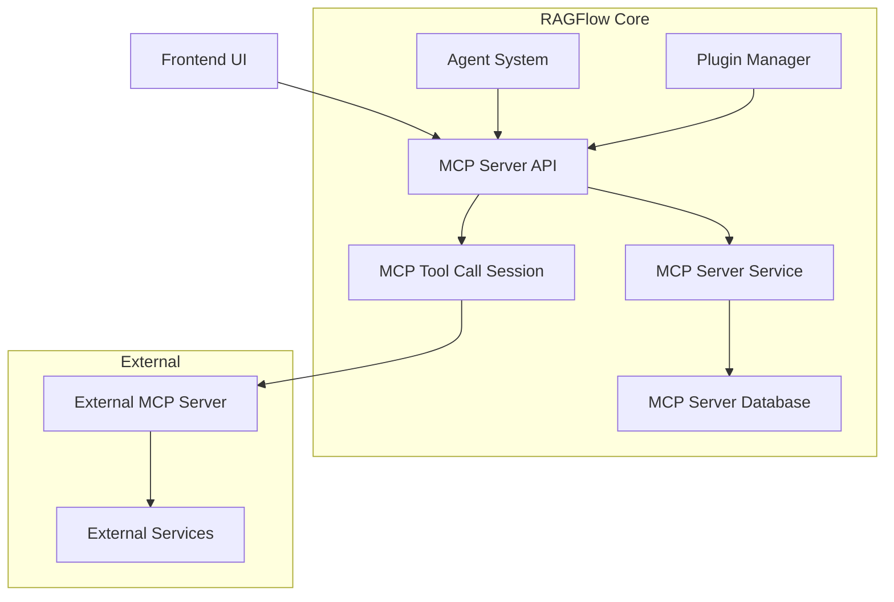
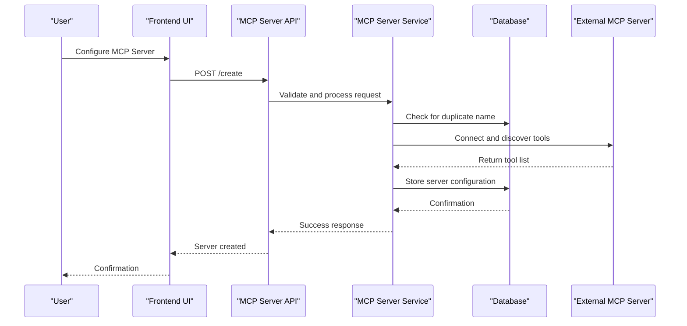
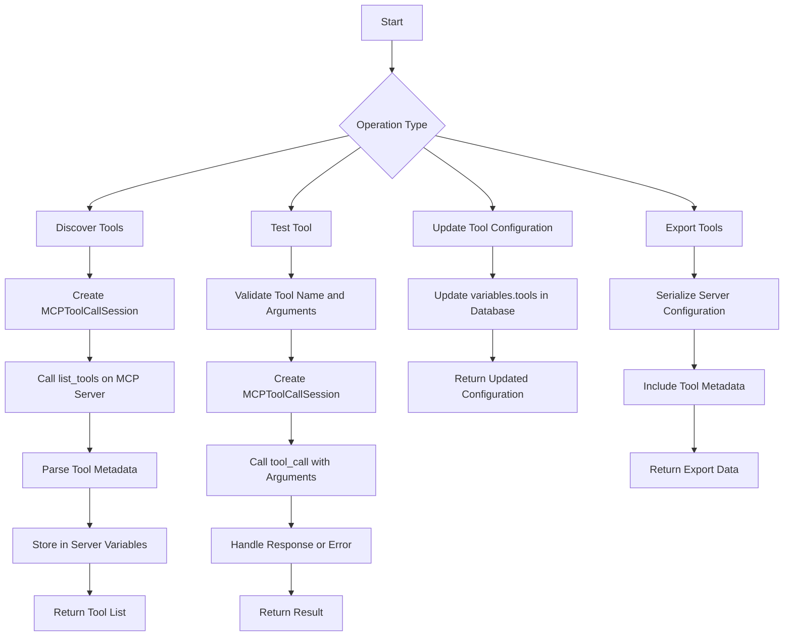
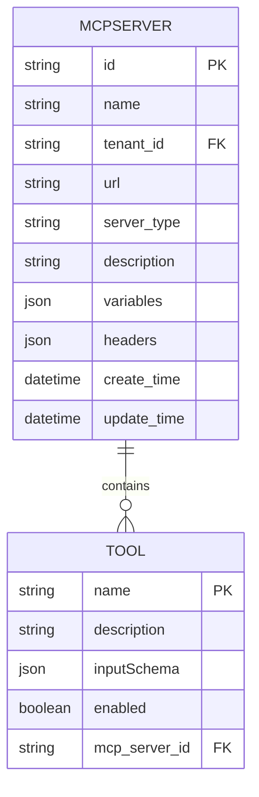

# MCP Server Service

<cite>
**Referenced Files in This Document**   
- [mcp_server_app.py](file://api/apps/mcp_server_app.py)
- [mcp_server_service.py](file://api/db/services/mcp_server_service.py)
- [mcp_tool_call_conn.py](file://common/mcp_tool_call_conn.py)
- [server.py](file://mcp/server/server.py)
- [mcp-server.ts](file://web/src/interfaces/database/mcp-server.ts)
- [mcp.ts](file://web/src/interfaces/database/mcp.ts)
- [constants.py](file://common/constants.py)
- [api_utils.py](file://api/utils/api_utils.py)
</cite>

## Table of Contents
1. [Introduction](#introduction)
2. [Architecture Overview](#architecture-overview)
3. [Core Components](#core-components)
4. [MCP Server Registration](#mcp-server-registration)
5. [Tool Management](#tool-management)
6. [Endpoint Configuration](#endpoint-configuration)
7. [Service Interfaces](#service-interfaces)
8. [Domain Model](#domain-model)
9. [Usage Patterns](#usage-patterns)
10. [Integration with Agent System](#integration-with-agent-system)
11. [Common Issues and Solutions](#common-issues-and-solutions)
12. [Conclusion](#conclusion)

## Introduction

The MCP Server Service in RAGFlow provides a comprehensive framework for integrating external tools and services through the Model Context Protocol (MCP). This service enables users to register MCP servers, manage available tools, and configure endpoints for seamless integration with the agent system. The MCP Server Service acts as a bridge between RAGFlow's agent system and external capabilities, allowing for dynamic tool discovery and execution.

The service supports two transport protocols: Server-Sent Events (SSE) and Streamable HTTP, providing flexibility in how MCP servers connect to the system. It handles authentication, tool discovery, and secure execution of tool calls while maintaining tenant isolation. The implementation follows a layered architecture with clear separation between API endpoints, service logic, and database operations.

**Section sources**
- [mcp_server_app.py](file://api/apps/mcp_server_app.py#L1-L443)
- [mcp_server_service.py](file://api/db/services/mcp_server_service.py#L1-L93)

## Architecture Overview

The MCP Server Service follows a three-tier architecture with distinct layers for API handling, business logic, and data persistence. The service integrates with the agent system through well-defined interfaces, enabling agents to leverage external tools via MCP servers.

**Diagram sources**
- [mcp_server_app.py](file://api/apps/mcp_server_app.py#L1-L443)
- [mcp_server_service.py](file://api/db/services/mcp_server_service.py#L1-L93)
- [mcp_tool_call_conn.py](file://common/mcp_tool_call_conn.py#L1-L326)

## Core Components

The MCP Server Service consists of several core components that work together to provide MCP functionality. The API layer handles HTTP requests from the frontend and other services, validating inputs and routing requests to the appropriate service methods. The service layer contains the business logic for MCP server management, including creation, update, deletion, and tool discovery operations.

The MCPToolCallSession component manages the connection to external MCP servers, handling the protocol-specific communication for both SSE and Streamable HTTP transports. This component is responsible for initializing sessions, discovering available tools, and executing tool calls with proper error handling and timeouts.

The database layer uses Peewee ORM to persist MCP server configurations, including server URLs, authentication details, and discovered tool metadata. The MCPServer model stores all necessary information to connect to and use MCP servers, with tenant isolation ensuring that users can only access their own registered servers.

**Section sources**
- [mcp_server_app.py](file://api/apps/mcp_server_app.py#L1-L443)
- [mcp_server_service.py](file://api/db/services/mcp_server_service.py#L1-L93)
- [mcp_tool_call_conn.py](file://common/mcp_tool_call_conn.py#L1-L326)

## MCP Server Registration

MCP server registration allows users to connect external MCP servers to the RAGFlow system. The registration process begins with a POST request to the `/create` endpoint, which validates the server configuration before storing it in the database. Each MCP server must have a unique name within the tenant's scope and specify a valid server type (SSE or Streamable HTTP).

During registration, the system automatically discovers available tools by connecting to the MCP server and retrieving its tool list. This process involves creating a temporary MCPToolCallSession, calling the `list_tools` method on the remote server, and storing the discovered tool metadata in the server's variables. The tool discovery process includes validation of tool schemas and handles authentication errors gracefully.

The registration API requires the following parameters:
- `name`: Unique identifier for the MCP server (max 255 bytes)
- `url`: Base URL of the MCP server endpoint
- `server_type`: Transport protocol (sse or streamable-http)
- `headers`: Optional HTTP headers for authentication
- `variables`: Additional configuration variables

**Diagram sources**
- [mcp_server_app.py](file://api/apps/mcp_server_app.py#L71-L123)
- [mcp_tool_call_conn.py](file://common/mcp_tool_call_conn.py#L42-L249)

## Tool Management

Tool management in the MCP Server Service provides comprehensive functionality for discovering, testing, and configuring tools available on registered MCP servers. The service automatically discovers tools during server registration and caches their metadata for efficient access. Users can refresh tool lists at any time using the `list_tools` endpoint, which reconnects to the MCP server and retrieves the current tool configuration.

The service supports testing individual tools through the `test_tool` endpoint, allowing users to verify tool functionality with specific arguments before using them in agents. This testing capability is crucial for debugging tool configurations and ensuring proper integration. The tool testing process creates a temporary session, executes the tool call with the provided arguments, and returns the result or error message.

Tools are represented as structured objects with the following properties:
- `name`: Unique identifier for the tool
- `description`: Human-readable description of the tool's purpose
- `inputSchema`: JSON Schema defining the tool's input parameters
- `enabled`: Boolean flag indicating whether the tool is active

The service also provides bulk operations for tool management, including importing and exporting server configurations with their associated tools. This facilitates sharing configurations between environments and backing up tool setups.

**Diagram sources**
- [mcp_server_app.py](file://api/apps/mcp_server_app.py#L299-L401)
- [mcp_tool_call_conn.py](file://common/mcp_tool_call_conn.py#L42-L249)

## Endpoint Configuration

Endpoint configuration for MCP servers involves setting up the communication parameters between RAGFlow and external MCP servers. The configuration includes the server URL, transport protocol, authentication headers, and additional variables that may be needed for tool execution. The service supports both SSE and Streamable HTTP transport protocols, each with its own endpoint structure.

For SSE transport, the endpoint follows the pattern `/sse` for initial connection and `/messages/{session_id}` for message exchange. The Streamable HTTP transport uses the `/mcp` endpoint for all communications. The configuration process validates the endpoint URL and tests connectivity before saving the configuration.

Authentication is handled through HTTP headers, with support for Bearer tokens and API keys. The service securely stores authentication credentials in the server's variables, using template substitution to inject credentials into request headers. This approach allows for dynamic credential management without hardcoding sensitive information.

The endpoint configuration also supports timeout settings for tool discovery and execution, with default values that can be overridden per server. These timeouts prevent hanging requests and ensure responsive user interfaces. The service implements connection pooling and session management to optimize performance when multiple tools are called in sequence.

**Section sources**
- [mcp_server_app.py](file://api/apps/mcp_server_app.py#L403-L442)
- [mcp_tool_call_conn.py](file://common/mcp_tool_call_conn.py#L59-L114)
- [server.py](file://mcp/server/server.py#L496-L582)

## Service Interfaces

The MCP Server Service exposes a comprehensive REST API for managing MCP servers and their tools. The API follows standard HTTP methods and status codes, with JSON request and response bodies. All endpoints require authentication and enforce tenant isolation, ensuring that users can only access their own MCP servers.

Key API endpoints include:
- `POST /list`: Retrieve a paginated list of registered MCP servers
- `POST /create`: Register a new MCP server with tool discovery
- `POST /update`: Update an existing MCP server configuration
- `POST /rm`: Delete one or more MCP servers
- `POST /import`: Import multiple MCP servers from a configuration
- `POST /export`: Export MCP server configurations
- `POST /list_tools`: Retrieve tools from one or more MCP servers
- `POST /test_tool`: Test a specific tool with provided arguments
- `POST /cache_tools`: Update the cached tool configuration
- `POST /test_mcp`: Test MCP server connectivity without registration

The API uses request validation to ensure all required parameters are present and correctly formatted. Error responses include descriptive messages and appropriate HTTP status codes, making it easier to debug integration issues. The service also supports batch operations for improved efficiency when managing multiple servers.

**Section sources**
- [mcp_server_app.py](file://api/apps/mcp_server_app.py#L30-L443)

## Domain Model

The domain model for the MCP Server Service consists of several key entities that represent the core concepts of the system. The MCPServer entity is the central model, storing configuration details for registered MCP servers. It includes fields for the server's unique identifier, name, URL, transport protocol, and additional configuration data.

The MCPServer model has the following attributes:
- `id`: Primary key (32-character string)
- `name`: Display name (255-character limit)
- `tenant_id`: Tenant identifier for isolation
- `url`: Base URL of the MCP server
- `server_type`: Transport protocol (sse or streamable-http)
- `description`: Optional description
- `variables`: JSON field storing tool metadata and configuration
- `headers`: JSON field storing HTTP headers for authentication

Tool metadata is stored within the `variables` JSON field, specifically in the `tools` property. Each tool is represented as a JSON object with its schema, description, and configuration. This denormalized storage approach allows for efficient retrieval of tool information without additional database queries.

The service also maintains a weak reference to all active MCPToolCallSession instances, enabling graceful shutdown of all sessions when the application terminates. This prevents resource leaks and ensures clean connection closure.

**Diagram sources**
- [db_models.py](file://api/db/db_models.py#L960-L972)
- [mcp_server_service.py](file://api/db/services/mcp_server_service.py#L22-L33)

## Usage Patterns

The MCP Server Service supports several common usage patterns for integrating external tools into RAGFlow agents. The most common pattern is tool discovery and registration, where users add new MCP servers to access additional capabilities. This process typically begins with launching an external MCP server, then registering it through the RAGFlow UI or API.

Another common pattern is tool testing and validation, where users verify that registered tools work correctly before incorporating them into agents. This involves using the test tool functionality to execute sample calls and inspect the results. The service provides detailed error messages to help diagnose connectivity or authentication issues.

For production use, the typical pattern involves creating agents that reference registered MCP servers and their tools. Agents can be configured to use specific tools from one or more MCP servers, enabling complex workflows that combine multiple external services. The service handles the underlying communication, allowing agents to focus on high-level task orchestration.

Advanced usage patterns include:
- Sharing MCP server configurations between team members
- Backing up and restoring tool configurations
- Dynamically enabling or disabling specific tools
- Monitoring tool usage and performance
- Integrating with custom MCP servers for specialized functionality

**Section sources**
- [mcp_server_app.py](file://api/apps/mcp_server_app.py#L1-L443)
- [mcp_tool_call_conn.py](file://common/mcp_tool_call_conn.py#L1-L326)

## Integration with Agent System

The MCP Server Service integrates closely with the agent system, providing external tool capabilities that agents can leverage in their workflows. Agents reference registered MCP servers and their tools through configuration, allowing them to extend their functionality beyond built-in capabilities. This integration enables agents to perform tasks such as web search, data retrieval, and external API calls.

When an agent executes a task that requires an external tool, the system looks up the corresponding MCP server configuration and establishes a connection to execute the tool call. The MCP Server Service handles the protocol-specific communication, translating between the agent's request format and the MCP server's expected format. Results are returned to the agent in a standardized format, regardless of the underlying transport protocol.

The integration supports both synchronous and asynchronous tool execution, depending on the agent's requirements. For long-running operations, the service can return intermediate results through streaming, allowing agents to provide progress updates to users. Error handling is standardized across all tools, with consistent error messages and retry mechanisms.

The agent system also uses the MCP Server Service for tool discovery during agent configuration. When users are building agents, they can browse available tools from registered MCP servers and select which ones to include in their agent's capabilities. This dynamic tool selection enables flexible agent design without requiring code changes.

**Section sources**
- [mcp_server_app.py](file://api/apps/mcp_server_app.py#L299-L344)
- [mcp_tool_call_conn.py](file://common/mcp_tool_call_conn.py#L42-L249)

## Common Issues and Solutions

Several common issues may arise when working with the MCP Server Service, along with their corresponding solutions. Connectivity problems are among the most frequent issues, typically caused by incorrect URLs, network restrictions, or firewall settings. The solution involves verifying the MCP server URL, checking network connectivity, and ensuring any required ports are open.

Authentication errors commonly occur when API keys or Bearer tokens are incorrect or have expired. The service provides specific error messages for authentication failures, helping users identify and resolve these issues. Users should verify their credentials and ensure they have the necessary permissions to access the MCP server.

Timeout issues may occur during tool discovery or execution, especially with slow external services. The service allows configuring timeout values, and users can increase these values for services that require more time to respond. Implementing proper error handling in agents can also mitigate the impact of timeout issues.

Tool schema mismatches can cause execution failures when the arguments provided by an agent don't match the tool's expected input schema. The solution involves carefully reviewing the tool's inputSchema definition and ensuring the agent provides correctly formatted arguments. The test tool functionality is invaluable for debugging these issues.

Resource leaks may occur if MCPToolCallSession instances are not properly closed, potentially leading to memory issues over time. The service implements automatic session cleanup and provides a shutdown hook to close all active sessions when the application terminates.

**Section sources**
- [mcp_server_app.py](file://api/apps/mcp_server_app.py#L109-L111)
- [mcp_tool_call_conn.py](file://common/mcp_tool_call_conn.py#L86-L88)
- [mcp_tool_call_conn.py](file://common/mcp_tool_call_conn.py#L197-L200)

## Conclusion

The MCP Server Service in RAGFlow provides a robust and flexible framework for integrating external tools and services through the Model Context Protocol. By supporting both SSE and Streamable HTTP transport protocols, the service accommodates a wide range of MCP server implementations. The comprehensive API and user-friendly interfaces make it easy to register servers, discover tools, and configure endpoints for seamless integration with agents.

The service's architecture follows best practices with clear separation of concerns between API, service, and data layers. Security is prioritized through tenant isolation, secure credential storage, and proper error handling. The implementation demonstrates attention to performance with connection pooling, session management, and efficient data retrieval.

For developers, the service provides extensive documentation and examples to facilitate integration. The modular design allows for easy extension and customization, while maintaining compatibility with the broader RAGFlow ecosystem. As the Model Context Protocol evolves, the MCP Server Service is well-positioned to support new features and capabilities, further enhancing the power and flexibility of RAGFlow agents.