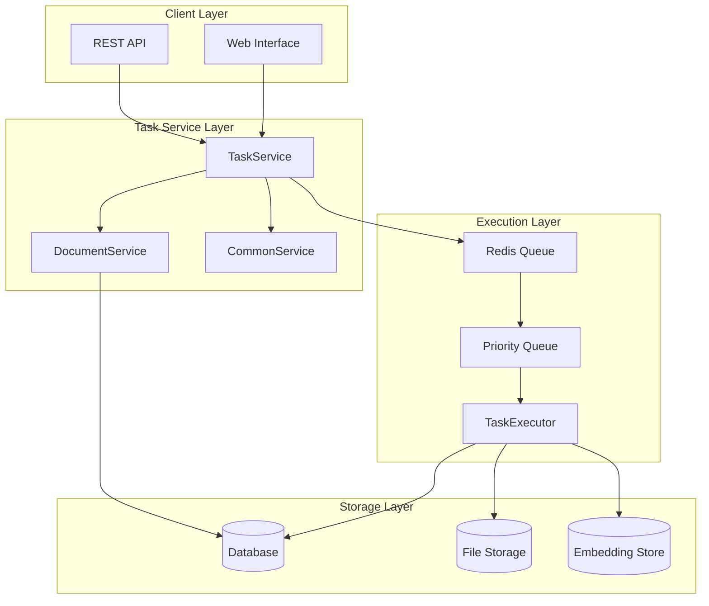
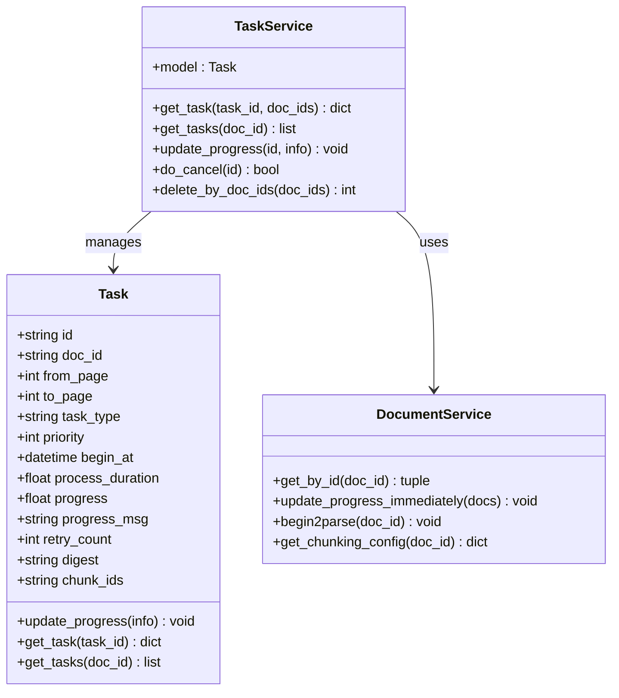
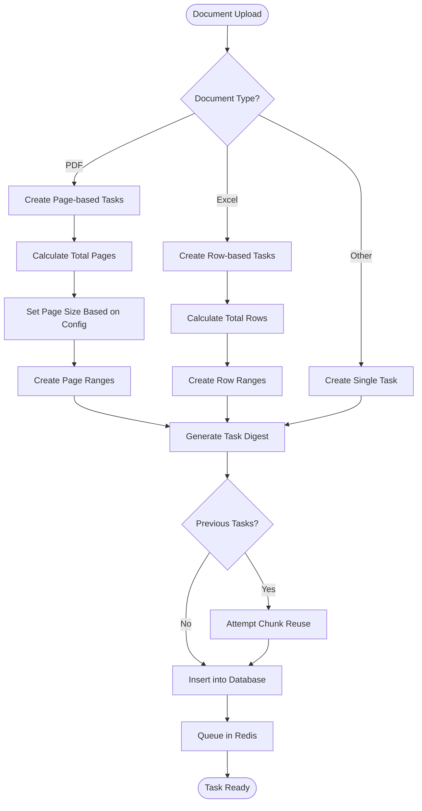
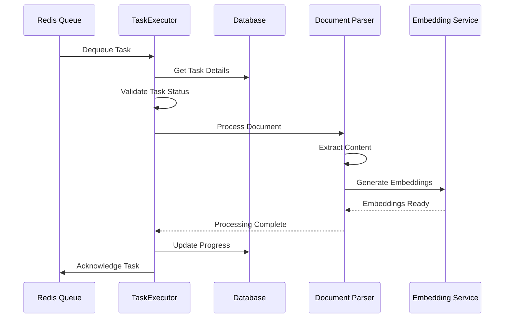
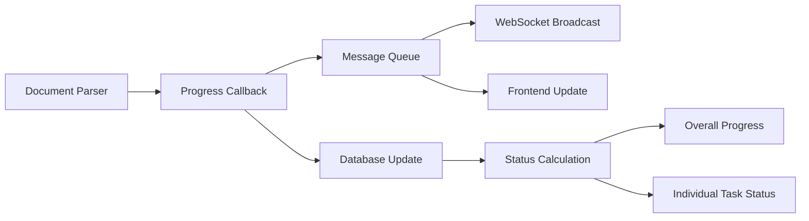
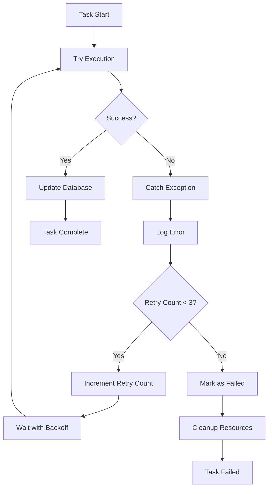
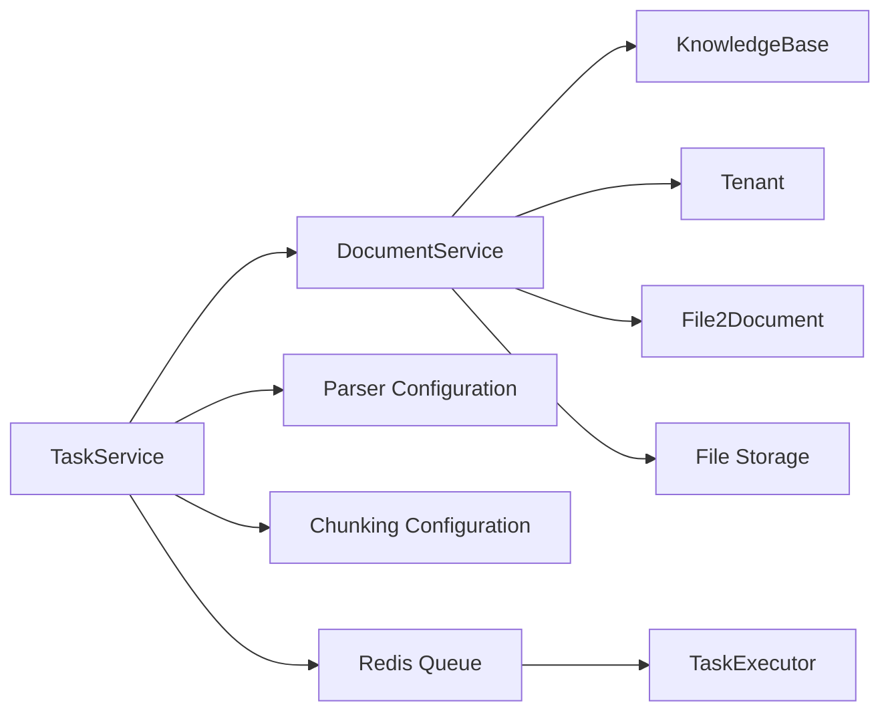

# Task Service

<cite>
**Referenced Files in This Document**
- [task_service.py](file://api/db/services/task_service.py)
- [task_executor.py](file://rag/svr/task_executor.py)
- [db_models.py](file://api/db/db_models.py)
- [document_service.py](file://api/db/services/document_service.py)
- [common_service.py](file://api/db/services/common_service.py)
- [redis_conn.py](file://rag/utils/redis_conn.py)
- [settings.py](file://common/settings.py)
- [launch_backend_service.sh](file://docker/launch_backend_service.sh)
- [pipeline.py](file://rag/flow/pipeline.py)
</cite>

## Table of Contents
1. [Introduction](#introduction)
2. [Architecture Overview](#architecture-overview)
3. [Core Components](#core-components)
4. [Task Creation and Queuing](#task-creation-and-queuing)
5. [Task Execution and Processing](#task-execution-and-processing)
6. [Progress Tracking and Status Management](#progress-tracking-and-status-management)
7. [Error Handling and Retry Mechanisms](#error-handling-and-retry-mechanisms)
8. [Integration with Other Components](#integration-with-other-components)
9. [Common Issues and Solutions](#common-issues-and-solutions)
10. [Best Practices](#best-practices)

## Introduction

The Task Service is a critical component of the RAGFlow system responsible for managing asynchronous document processing tasks. It provides a robust framework for creating, queuing, executing, and monitoring tasks across the entire document processing pipeline. The service handles various document types (PDF, Excel, Word, etc.) and implements sophisticated progress tracking, error handling, and retry mechanisms.

The Task Service operates within a distributed architecture that separates task management from execution, allowing for scalable and reliable document processing. It integrates closely with Redis for task queuing, databases for persistent storage, and various parsers for document processing.

## Architecture Overview

The Task Service follows a layered architecture with clear separation of concerns:

**Diagram sources**
- [task_service.py](file://api/db/services/task_service.py#L57-L71)
- [task_executor.py](file://rag/svr/task_executor.py#L1-L50)
- [redis_conn.py](file://rag/utils/redis_conn.py#L245-L256)

## Core Components

### Task Model

The Task model defines the core data structure for task management:

**Diagram sources**
- [db_models.py](file://api/db/db_models.py#L823-L838)
- [task_service.py](file://api/db/services/task_service.py#L57-L71)
- [document_service.py](file://api/db/services/document_service.py#L45-L47)

**Section sources**
- [db_models.py](file://api/db/db_models.py#L823-L838)
- [task_service.py](file://api/db/services/task_service.py#L57-L71)

### Task Service Class

The TaskService class extends CommonService and provides specialized functionality for task management:

- **Task Retrieval**: Get individual tasks or all tasks for a document
- **Progress Updates**: Real-time progress tracking with message logging
- **Cancellation Handling**: Graceful task cancellation based on document status
- **Chunk Management**: Association of processed chunks with tasks
- **Retry Logic**: Built-in retry mechanisms for failed tasks

**Section sources**
- [task_service.py](file://api/db/services/task_service.py#L57-L322)

## Task Creation and Queuing

### Task Creation Process

The task creation process varies based on document type and configuration:

**Diagram sources**
- [task_service.py](file://api/db/services/task_service.py#L326-L431)

### Queue Management

The system uses Redis streams for task queuing with priority support:

- **Priority Queues**: Multiple priority levels (0=default, 1=high priority)
- **Consumer Groups**: Redis consumer groups for load balancing
- **Message Persistence**: Tasks remain in queue until successful processing
- **Dead Letter Handling**: Failed tasks can be retried or moved to dead letter queues

**Section sources**
- [task_service.py](file://api/db/services/task_service.py#L326-L431)
- [redis_conn.py](file://rag/utils/redis_conn.py#L245-L256)
- [settings.py](file://common/settings.py#L122-L128)

## Task Execution and Processing

### Task Executor Architecture

The TaskExecutor handles actual task processing with sophisticated concurrency control:

**Diagram sources**
- [task_executor.py](file://rag/svr/task_executor.py#L164-L200)
- [task_executor.py](file://rag/svr/task_executor.py#L982-L1017)

### Concurrency Control

The TaskExecutor implements several concurrency control mechanisms:

- **Semaphore-based Limits**: Configurable limits for concurrent tasks
- **Resource Limiters**: Separate limits for embedding generation, chunk building, and I/O operations
- **Heartbeat Monitoring**: Regular heartbeat reporting for task executor health
- **Graceful Shutdown**: Proper cleanup during system shutdown

**Section sources**
- [task_executor.py](file://rag/svr/task_executor.py#L1030-L1074)
- [task_executor.py](file://rag/svr/task_executor.py#L112-L122)

## Progress Tracking and Status Management

### Progress Update Mechanisms

The system provides real-time progress tracking with multiple update channels:

**Diagram sources**
- [task_executor.py](file://rag/svr/task_executor.py#L132-L162)
- [task_service.py](file://api/db/services/task_service.py#L263-L322)

### Status States

Tasks progress through several states:

| Status | Value | Description |
|--------|-------|-------------|
| PENDING | 0 | Task queued but not started |
| RUNNING | 1 | Task actively processing |
| PAUSED | 2 | Task paused by user |
| CANCEL | 3 | Task cancelled |
| DONE | 4 | Task completed successfully |
| FAIL | 5 | Task failed |

**Section sources**
- [task_service.py](file://api/db/services/task_service.py#L244-L261)
- [task_service.py](file://api/db/services/task_service.py#L263-L322)

## Error Handling and Retry Mechanisms

### Multi-layered Error Handling

The system implements comprehensive error handling at multiple levels:

**Diagram sources**
- [task_executor.py](file://rag/svr/task_executor.py#L990-L1008)
- [launch_backend_service.sh](file://docker/launch_backend_service.sh#L70-L92)

### Retry Strategies

The system employs multiple retry strategies:

- **Database Operations**: Automatic retry with exponential backoff for transient failures
- **Task Execution**: Manual retry with configurable limits (default: 3 attempts)
- **Network Operations**: Configurable retry for external service calls
- **Resource Contention**: Backoff strategies for resource conflicts

**Section sources**
- [common_service.py](file://api/db/services/common_service.py#L25-L35)
- [task_service.py](file://api/db/services/task_service.py#L129-L140)
- [launch_backend_service.sh](file://docker/launch_backend_service.sh#L70-L92)

## Integration with Other Components

### Document Service Integration

The Task Service works closely with the Document Service for comprehensive document lifecycle management:

**Diagram sources**
- [task_service.py](file://api/db/services/task_service.py#L89-L142)
- [document_service.py](file://api/db/services/document_service.py#L45-L47)

### Pipeline Integration

For complex workflows, tasks integrate with the pipeline system:

- **Pipeline Tasks**: Specialized tasks for graphRAG, RAPTOR, and mindmap generation
- **Component Coordination**: Tasks coordinate between different pipeline components
- **Progress Synchronization**: Pipeline progress reflects individual task completion

**Section sources**
- [task_service.py](file://api/db/services/task_service.py#L497-L524)
- [pipeline.py](file://rag/flow/pipeline.py#L62-L91)

## Common Issues and Solutions

### Task Failures

Common task failure scenarios and their solutions:

| Issue | Symptoms | Solution |
|-------|----------|----------|
| Memory Exhaustion | OutOfMemoryError, slow processing | Reduce batch sizes, increase memory limits |
| Network Timeouts | Connection timeouts, dropped connections | Increase timeout values, implement retry logic |
| Parser Errors | Document parsing failures | Validate document format, use fallback parsers |
| Database Locks | Deadlock errors, slow queries | Optimize queries, reduce transaction scope |
| Redis Connectivity | Queue access failures | Check Redis configuration, monitor connectivity |

### Performance Optimization

- **Batch Processing**: Process multiple documents in batches to reduce overhead
- **Parallel Execution**: Utilize multiple task executors for concurrent processing
- **Resource Monitoring**: Monitor CPU, memory, and I/O usage patterns
- **Queue Tuning**: Adjust queue sizes and priority levels based on workload

### Debugging and Monitoring

The system provides comprehensive monitoring capabilities:

- **Task Metrics**: Track task completion rates, processing times, and failure rates
- **Resource Usage**: Monitor memory, CPU, and I/O utilization
- **Queue Health**: Monitor queue lengths and processing lag
- **Error Tracking**: Detailed error logs with stack traces and context

**Section sources**
- [task_executor.py](file://rag/svr/task_executor.py#L1030-L1074)
- [task_service.py](file://api/db/services/task_service.py#L263-L322)

## Best Practices

### Task Design Guidelines

1. **Granular Tasks**: Break large documents into smaller, manageable tasks
2. **Idempotent Operations**: Ensure tasks can be safely retried without side effects
3. **Progress Reporting**: Implement frequent progress updates for long-running tasks
4. **Resource Cleanup**: Always clean up resources in finally blocks or cleanup handlers

### Configuration Recommendations

- **Concurrent Tasks**: Start with 5-10 concurrent tasks, adjust based on system capacity
- **Batch Sizes**: Use batch sizes appropriate for your document types and system resources
- **Timeout Values**: Set reasonable timeouts for network operations and external service calls
- **Retry Limits**: Configure retry limits based on task criticality and expected failure rates

### Monitoring and Maintenance

- **Regular Health Checks**: Monitor task queues, executor health, and system resources
- **Performance Baselines**: Establish performance baselines for different document types
- **Capacity Planning**: Plan for peak loads and scale resources accordingly
- **Error Analysis**: Regularly analyze error patterns and implement fixes

The Task Service provides a robust foundation for asynchronous document processing in RAGFlow, with comprehensive features for task management, progress tracking, and error handling. Its modular design and extensive integration capabilities make it suitable for a wide range of document processing scenarios.