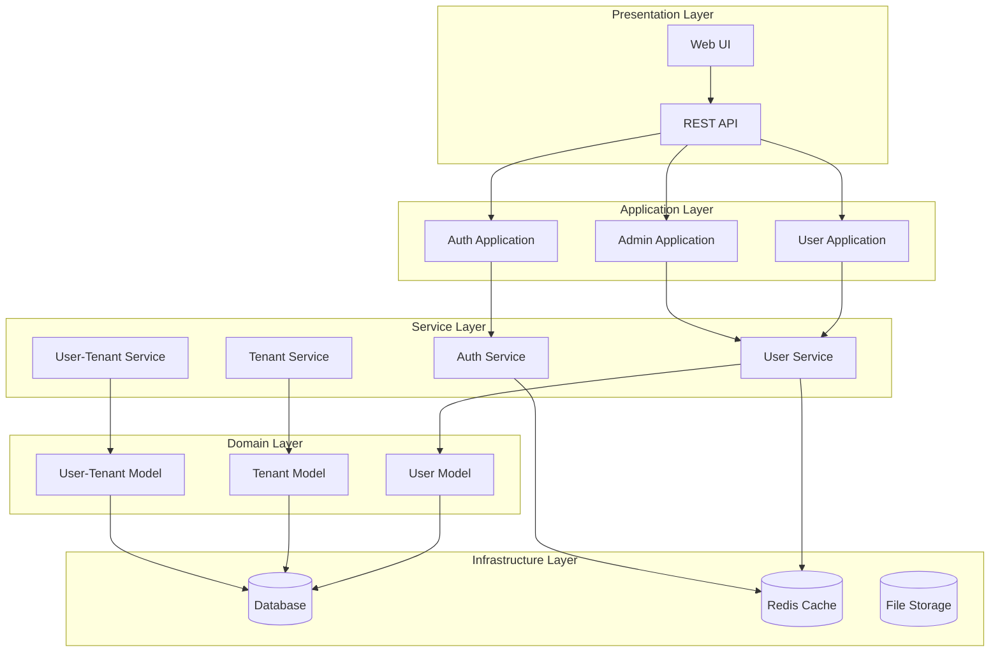
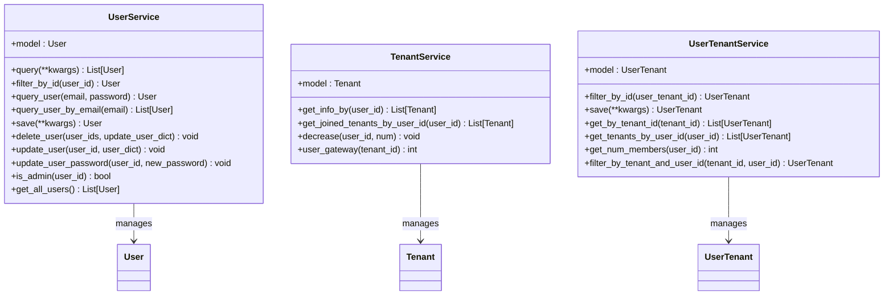
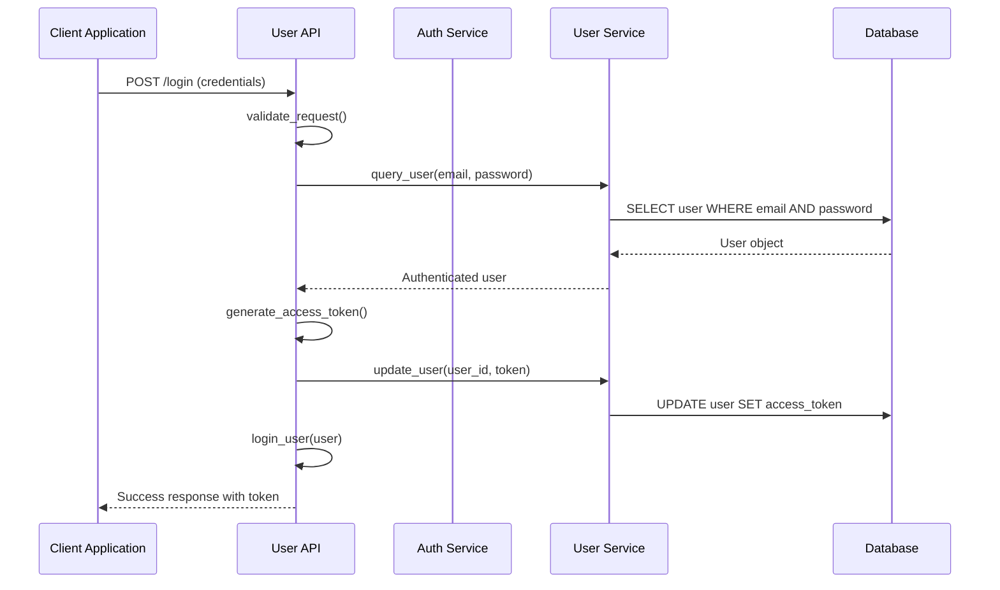
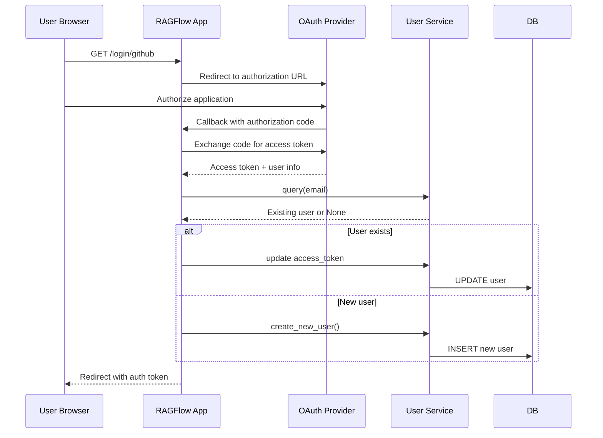
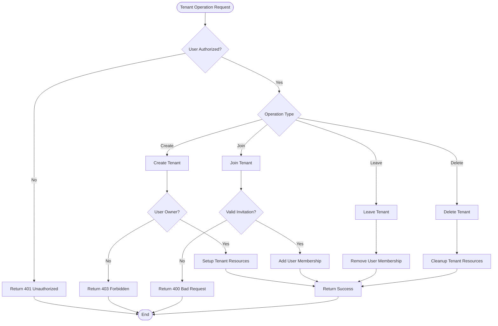
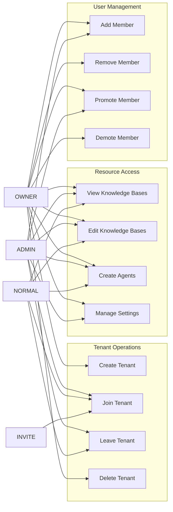
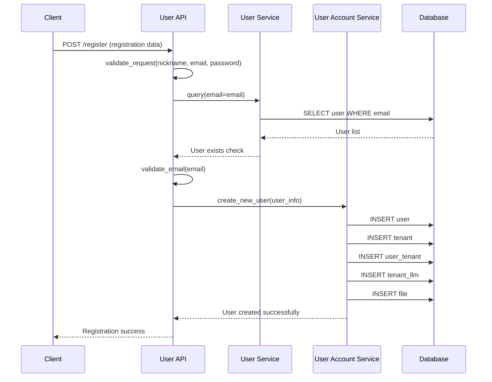
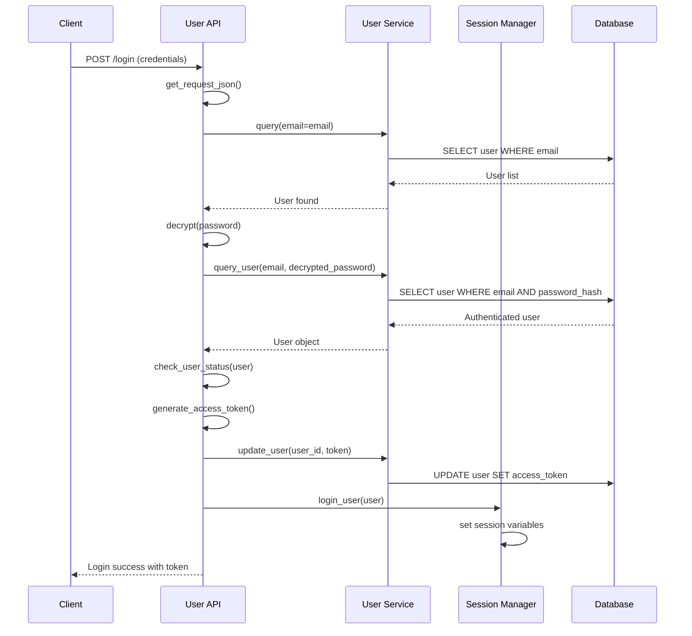
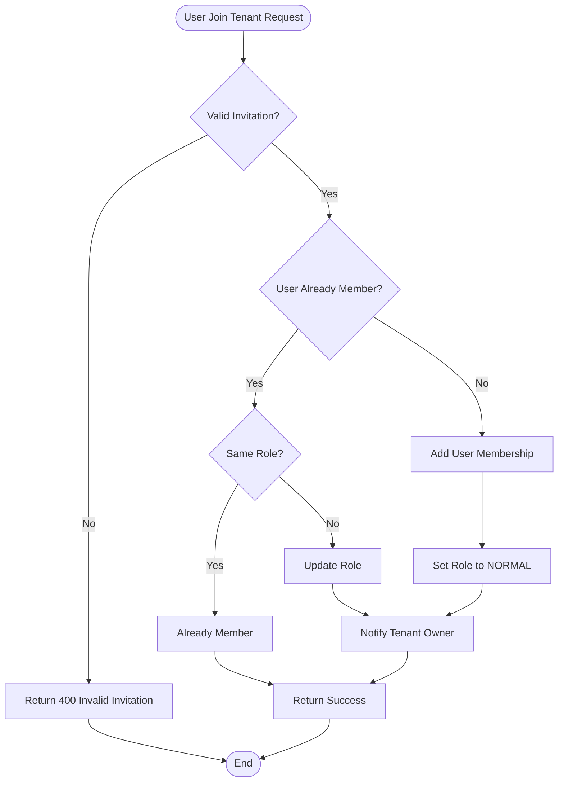

# User Service

<cite>
**Referenced Files in This Document**
- [user_service.py](file://api/db/services/user_service.py)
- [user_app.py](file://api/apps/user_app.py)
- [services.py](file://admin/server/services.py)
- [db_models.py](file://api/db/db_models.py)
- [user_account_service.py](file://api/db/joint_services/user_account_service.py)
- [__init__.py](file://api/db/__init__.py)
- [auth.py](file://api/apps/auth.py)
- [tenant_app.py](file://api/apps/tenant_app.py)
- [web_utils.py](file://api/utils/web_utils.py)
- [user-service.ts](file://web/src/services/user-service.ts)
- [use-login-request.ts](file://web/src/hooks/use-login-request.ts)
</cite>

## Table of Contents
1. [Introduction](#introduction)
2. [System Architecture](#system-architecture)
3. [Core Components](#core-components)
4. [User Domain Model](#user-domain-model)
5. [Authentication System](#authentication-system)
6. [Tenant Management](#tenant-management)
7. [Role-Based Access Control](#role-based-access-control)
8. [Service Interfaces](#service-interfaces)
9. [Usage Patterns](#usage-patterns)
10. [Common Issues and Solutions](#common-issues-and-solutions)
11. [Best Practices](#best-practices)
12. [Conclusion](#conclusion)

## Introduction

The User Service is a comprehensive component within the RAGFlow system that manages user lifecycle operations, authentication, profile management, and tenant relationships. It provides a robust foundation for user management with support for multiple authentication channels, role-based access control, and seamless tenant integration.

This service handles everything from user registration and login to profile updates, password management, and multi-tenant user relationships. It integrates with various authentication providers including OAuth2, OIDC, and traditional password-based authentication.

## System Architecture

The User Service follows a layered architecture with clear separation of concerns:

**Diagram sources**
- [user_service.py](file://api/db/services/user_service.py#L32-L320)
- [user_app.py](file://api/apps/user_app.py#L1-L800)
- [services.py](file://admin/server/services.py#L32-L228)

## Core Components

The User Service consists of several interconnected components that work together to provide comprehensive user management capabilities:

### User Service Layer

The core service layer provides fundamental user operations:

**Diagram sources**
- [user_service.py](file://api/db/services/user_service.py#L32-L320)
- [db_models.py](file://api/db/db_models.py#L597-L700)

**Section sources**
- [user_service.py](file://api/db/services/user_service.py#L32-L320)
- [services.py](file://admin/server/services.py#L32-L228)

## User Domain Model

The User domain model defines the core entities and their relationships:

### User Entity

The User entity represents individual users in the system:

| Field | Type | Description | Constraints |
|-------|------|-------------|-------------|
| id | String(32) | Unique user identifier | Primary Key |
| access_token | String(255) | Authentication token | Index |
| nickname | String(100) | User display name | Not Null, Index |
| password | String(255) | Hashed password | Index |
| email | String(255) | User email address | Not Null, Index |
| avatar | Text | Avatar image (base64) | Nullable |
| language | String(32) | Preferred language | Default: Chinese/English |
| color_schema | String(32) | UI theme preference | Default: Bright |
| timezone | String(64) | Timezone setting | Default: UTC+8 |
| last_login_time | DateTime | Last login timestamp | Nullable, Index |
| is_authenticated | String(1) | Authentication status | Default: 1 (true) |
| is_active | String(1) | Account activation status | Default: 1 (active) |
| is_anonymous | String(1) | Anonymous flag | Default: 0 (false) |
| login_channel | String | Authentication channel | Nullable, Index |
| status | String(1) | Record status | Default: 1 (valid) |
| is_superuser | Boolean | Superuser flag | Default: false |

### Tenant Entity

The Tenant entity represents organizational units:

| Field | Type | Description | Constraints |
|-------|------|-------------|-------------|
| id | String(32) | Unique tenant identifier | Primary Key |
| name | String(100) | Tenant display name | Nullable, Index |
| public_key | String(255) | Tenant public key | Nullable, Index |
| llm_id | String(128) | Default LLM model ID | Not Null, Index |
| embd_id | String(128) | Default embedding model ID | Not Null, Index |
| asr_id | String(128) | Default ASR model ID | Not Null, Index |
| img2txt_id | String(128) | Default image-to-text model ID | Not Null, Index |
| rerank_id | String(128) | Default reranking model ID | Not Null, Index |
| tts_id | String(256) | Default TTS model ID | Nullable, Index |
| parser_ids | String(256) | Document processor IDs | Not Null, Index |
| credit | Integer | Tenant credit balance | Default: 512, Index |
| status | String(1) | Record status | Default: 1 (valid) |

### UserTenant Relationship

The UserTenant entity manages the many-to-many relationship between users and tenants:

| Field | Type | Description | Constraints |
|-------|------|-------------|-------------|
| id | String(32) | Unique relationship identifier | Primary Key |
| user_id | String(32) | Associated user ID | Not Null, Index |
| tenant_id | String(32) | Associated tenant ID | Not Null, Index |
| role | String(32) | User role in tenant | Not Null, Index |
| invited_by | String(32) | Inviting user ID | Not Null, Index |
| status | String(1) | Relationship status | Default: 1 (valid) |

**Section sources**
- [db_models.py](file://api/db/db_models.py#L597-L700)
- [__init__.py](file://api/db/__init.py#L21-L26)

## Authentication System

The authentication system supports multiple authentication channels and provides secure user authentication:

### Supported Authentication Channels

The system supports various authentication methods:

1. **Password Authentication**: Traditional email/password login
2. **OAuth2 Authentication**: Third-party OAuth2 providers
3. **OIDC Authentication**: OpenID Connect protocol support
4. **GitHub Authentication**: Direct GitHub OAuth integration

### Authentication Flow

**Diagram sources**
- [user_app.py](file://api/apps/user_app.py#L64-L137)
- [user_service.py](file://api/db/services/user_service.py#L86-L102)

### OAuth/OIDC Integration

The system provides flexible OAuth2 and OIDC integration:

**Diagram sources**
- [user_app.py](file://api/apps/user_app.py#L161-L266)
- [auth.py](file://api/apps/auth.py#L1-L40)

**Section sources**
- [user_app.py](file://api/apps/user_app.py#L64-L266)
- [auth.py](file://api/apps/auth.py#L1-L40)

## Tenant Management

The tenant management system enables multi-tenant architecture with user membership management:

### Tenant Operations

The TenantService provides comprehensive tenant management capabilities:

**Diagram sources**
- [tenant_app.py](file://api/apps/tenant_app.py#L31-L139)
- [user_service.py](file://api/db/services/user_service.py#L168-L226)

### User-Tenant Relationships

The UserTenantService manages user membership in tenants:

| Operation | Description | Permissions Required |
|-----------|-------------|---------------------|
| Join Tenant | User joins an existing tenant | Invitation or admin approval |
| Leave Tenant | User leaves a tenant | Self-service or admin removal |
| Promote Member | Change user role to admin | Tenant owner/admin |
| Remove Member | Remove user from tenant | Tenant owner/admin |
| Transfer Ownership | Transfer tenant ownership | Current owner |

**Section sources**
- [tenant_app.py](file://api/apps/tenant_app.py#L31-L139)
- [user_service.py](file://api/db/services/user_service.py#L227-L319)

## Role-Based Access Control

The system implements a comprehensive role-based access control (RBAC) system:

### User Roles

The UserTenantRole enum defines the available roles:

| Role | Description | Permissions |
|------|-------------|-------------|
| OWNER | Tenant owner | Full administrative rights, can delete tenant |
| ADMIN | Tenant administrator | Manage members, configure settings |
| NORMAL | Regular member | Access tenant resources, collaborate |
| INVITE | Pending invitation | Can accept/reject invitations |

### Permission Matrix

**Diagram sources**
- [__init__.py](file://api/db/__init__.py#L21-L26)
- [tenant_app.py](file://api/apps/tenant_app.py#L48-L139)

**Section sources**
- [__init__.py](file://api/db/__init__.py#L21-L26)
- [tenant_app.py](file://api/apps/tenant_app.py#L48-L139)

## Service Interfaces

The User Service exposes multiple interfaces for different use cases:

### REST API Endpoints

| Endpoint | Method | Description | Authentication |
|----------|--------|-------------|----------------|
| `/login` | POST | User login | None |
| `/logout` | GET | User logout | Required |
| `/register` | POST | User registration | None |
| `/user/info` | GET | Get user profile | Required |
| `/user/setting` | POST | Update user settings | Required |
| `/tenant_info` | GET | Get tenant information | Required |
| `/tenant/list` | GET | List user tenants | Required |
| `/tenant/{tenant_id}/user` | POST | Add tenant member | Required |
| `/tenant/{tenant_id}/user` | DELETE | Remove tenant member | Required |

### Service Methods

The UserService provides the following key methods:

| Method | Purpose | Parameters | Return Type |
|--------|---------|------------|-------------|
| `query()` | Query users by criteria | **kwargs | List[User] |
| `filter_by_id()` | Get user by ID | user_id | User |
| `query_user()` | Authenticate user | email, password | User |
| `save()` | Create new user | **kwargs | User |
| `update_user()` | Update user profile | user_id, user_dict | void |
| `update_user_password()` | Change password | user_id, new_password | void |
| `delete_user()` | Soft delete user | user_ids, update_user_dict | void |
| `is_admin()` | Check admin status | user_id | bool |

**Section sources**
- [user_app.py](file://api/apps/user_app.py#L64-L800)
- [user_service.py](file://api/db/services/user_service.py#L44-L166)

## Usage Patterns

### User Registration Pattern

**Diagram sources**
- [user_app.py](file://api/apps/user_app.py#L667-L758)
- [user_account_service.py](file://api/db/joint_services/user_account_service.py#L41-L104)

### User Login Pattern

**Diagram sources**
- [user_app.py](file://api/apps/user_app.py#L64-L137)
- [user_service.py](file://api/db/services/user_service.py#L86-L102)

### Tenant Membership Pattern

**Diagram sources**
- [tenant_app.py](file://api/apps/tenant_app.py#L48-L139)
- [user_service.py](file://api/db/services/user_service.py#L256-L319)

**Section sources**
- [user_app.py](file://api/apps/user_app.py#L667-L758)
- [tenant_app.py](file://api/apps/tenant_app.py#L48-L139)

## Common Issues and Solutions

### Authentication Issues

**Problem**: Users cannot log in with valid credentials
**Solution**: Check password hashing and token validation
- Verify password is properly hashed using Werkzeug's `generate_password_hash`
- Ensure access tokens are properly generated and stored
- Check for expired or invalid tokens

**Problem**: OAuth authentication fails
**Solution**: Debug OAuth flow and provider configuration
- Verify OAuth client credentials
- Check redirect URI configuration
- Validate token exchange process

### Tenant Management Issues

**Problem**: Users cannot join tenants
**Solution**: Review invitation and membership logic
- Ensure proper authorization checks
- Verify tenant existence and status
- Check user permissions and roles

**Problem**: Tenant deletion fails
**Solution**: Implement proper cleanup procedures
- Verify tenant ownership
- Check for dependent resources
- Implement cascade deletion

### User Synchronization Issues

**Problem**: User data inconsistencies
**Solution**: Implement proper synchronization mechanisms
- Use atomic transactions for related operations
- Implement proper error handling and rollback
- Add data validation and constraints

**Section sources**
- [user_service.py](file://api/db/services/user_service.py#L44-L66)
- [user_account_service.py](file://api/db/joint_services/user_account_service.py#L135-L327)

## Best Practices

### Security Best Practices

1. **Password Management**
   - Always hash passwords using Werkzeug's secure hashing
   - Implement strong password policies
   - Use HTTPS for all authentication endpoints

2. **Token Security**
   - Generate cryptographically secure access tokens
   - Implement token expiration and refresh mechanisms
   - Store tokens securely in session or cookies

3. **Access Control**
   - Implement proper authorization checks for all operations
   - Use role-based access control consistently
   - Log all access control decisions

### Performance Best Practices

1. **Database Optimization**
   - Use appropriate indexes on frequently queried fields
   - Implement connection pooling for database operations
   - Use pagination for large result sets

2. **Caching Strategies**
   - Cache user profiles and tenant information
   - Implement Redis caching for session data
   - Use appropriate cache expiration policies

3. **Error Handling**
   - Implement comprehensive error logging
   - Provide meaningful error messages
   - Handle edge cases gracefully

### Development Best Practices

1. **Code Organization**
   - Separate concerns between services and applications
   - Use dependency injection for services
   - Implement proper interface contracts

2. **Testing**
   - Write unit tests for all service methods
   - Implement integration tests for authentication flows
   - Test error conditions and edge cases

3. **Documentation**
   - Document all service interfaces
   - Provide usage examples for common patterns
   - Maintain API documentation

## Conclusion

The User Service in RAGFlow provides a comprehensive and robust foundation for user management in a multi-tenant environment. It successfully integrates multiple authentication channels, implements role-based access control, and provides seamless tenant management capabilities.

Key strengths of the system include:

- **Flexible Authentication**: Support for multiple authentication methods including OAuth2, OIDC, and traditional password authentication
- **Robust Multi-Tenancy**: Comprehensive tenant management with user membership and role management
- **Security Focus**: Proper password hashing, token management, and access control implementation
- **Scalable Architecture**: Well-organized service layer with clear separation of concerns
- **Extensible Design**: Modular design that allows for easy extension and customization

The service demonstrates best practices in modern web application development, including proper error handling, security considerations, and performance optimization. Its comprehensive API and well-defined interfaces make it suitable for both internal system use and external integrations.

Future enhancements could include:
- Enhanced audit logging and compliance features
- Advanced user profile management capabilities
- Integration with additional authentication providers
- Improved tenant resource management and quotas