# Task Processing System

<cite>
**Referenced Files in This Document**
- [task_executor.py](file://rag/svr/task_executor.py)
- [task_service.py](file://api/db/services/task_service.py)
- [redis_conn.py](file://rag/utils/redis_conn.py)
- [document_app.py](file://api/apps/document_app.py)
- [health_utils.py](file://api/utils/health_utils.py)
- [system_app.py](file://api/apps/system_app.py)
- [pipeline.py](file://rag/flow/pipeline.py)
- [pipeline_operation_log_service.py](file://api/db/services/pipeline_operation_log_service.py)
- [main.py](file://sandbox/executor_manager/main.py)
- [container.py](file://sandbox/executor_manager/core/container.py)
- [docker-compose.yml](file://sandbox/docker-compose.yml)
- [service_conf.yaml](file://conf/service_conf.yaml)
- [launch_backend_service.sh](file://docker/launch_backend_service.sh)
- [entrypoint.sh](file://docker/entrypoint.sh)
</cite>

## Table of Contents
1. [Introduction](#introduction)
2. [System Architecture](#system-architecture)
3. [Event-Driven Architecture with Redis](#event-driven-architecture-with-redis)
4. [Task Lifecycle Management](#task-lifecycle-management)
5. [API Layer Interaction](#api-layer-interaction)
6. [Sandbox Environment Execution](#sandbox-environment-execution)
7. [Task Types and Processing Patterns](#task-types-and-processing-patterns)
8. [Task Prioritization and Queue Management](#task-prioritization-and-queue-management)
9. [Error Handling and Retry Mechanisms](#error-handling-and-retry-mechanisms)
10. [Monitoring and Health Checks](#monitoring-and-health-checks)
11. [Scalability and Performance Optimization](#scalability-and-performance-optimization)
12. [Configuration and Deployment](#configuration-and-deployment)

## Introduction

RAGFlow's task processing system is a sophisticated, event-driven architecture designed to handle asynchronous document processing tasks at scale. The system leverages Redis as a message queue to orchestrate task execution across multiple worker nodes, providing fault tolerance, scalability, and real-time monitoring capabilities.

The system supports various document processing tasks including parsing, chunking, embedding generation, and advanced AI-powered transformations like RAPTOR (Recursive Abstractive Processing for Tree Organized Retrieval) and GraphRAG (Graph-based Retrieval-Augmented Generation). Each task type follows a standardized lifecycle with comprehensive progress tracking, error handling, and cancellation mechanisms.

## System Architecture

The task processing system follows a microservices architecture with clear separation of concerns between the API layer, task queue management, and execution workers.

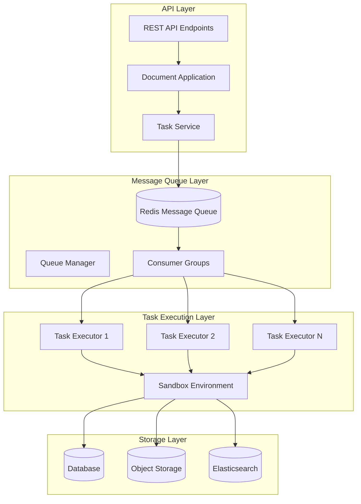

**Diagram sources**
- [task_executor.py](file://rag/svr/task_executor.py#L103-L122)
- [redis_conn.py](file://rag/utils/redis_conn.py#L59-L80)
- [document_app.py](file://api/apps/document_app.py#L50-L84)

**Section sources**
- [task_executor.py](file://rag/svr/task_executor.py#L103-L122)
- [redis_conn.py](file://rag/utils/redis_conn.py#L59-L80)

## Event-Driven Architecture with Redis

RAGFlow implements a sophisticated event-driven architecture using Redis Streams as the primary message queue mechanism. This design enables horizontal scaling, fault tolerance, and real-time task coordination.

### Redis Stream Configuration

The system utilizes Redis Streams with consumer groups for reliable message delivery and load balancing:

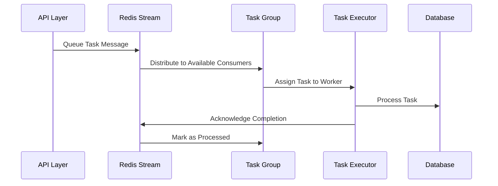

**Diagram sources**
- [redis_conn.py](file://rag/utils/redis_conn.py#L245-L256)
- [task_executor.py](file://rag/svr/task_executor.py#L164-L209)

### Message Structure and Routing

Tasks are structured as JSON messages with routing information for efficient queue management:

| Field | Description | Example |
|-------|-------------|---------|
| `id` | Unique task identifier | `"task_12345"` |
| `doc_id` | Associated document ID | `"doc_67890"` |
| `task_type` | Type of processing required | `"dataflow"`, `"raptor"`, `"graphrag"` |
| `priority` | Task priority level | `0` (highest) to `9` (lowest) |
| `tenant_id` | Multi-tenancy identifier | `"tenant_a"` |
| `kb_id` | Knowledge base identifier | `"kb_xyz"` |

**Section sources**
- [task_service.py](file://api/db/services/task_service.py#L347-L356)
- [redis_conn.py](file://rag/utils/redis_conn.py#L245-L256)

## Task Lifecycle Management

The task lifecycle encompasses creation, queuing, execution, monitoring, and completion phases with comprehensive state tracking and progress reporting.

### Task Creation and Queuing

Task creation involves document analysis, configuration validation, and queue insertion:

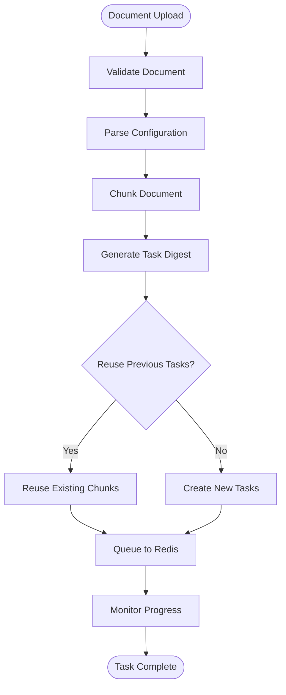

**Diagram sources**
- [task_service.py](file://api/db/services/task_service.py#L326-L431)

### Progress Tracking and Status Updates

The system maintains detailed progress information with real-time updates:

| Progress Stage | Percentage Range | Description |
|----------------|------------------|-------------|
| Initialization | 0.0 - 0.1 | Task setup and validation |
| Parsing | 0.1 - 0.3 | Document extraction and parsing |
| Chunking | 0.3 - 0.5 | Content segmentation |
| Embedding | 0.5 - 0.8 | Vector generation |
| Indexing | 0.8 - 0.95 | Storage and indexing |
| Completion | 0.95 - 1.0 | Finalization and cleanup |

**Section sources**
- [task_service.py](file://api/db/services/task_service.py#L263-L318)
- [task_executor.py](file://rag/svr/task_executor.py#L132-L162)

## API Layer Interaction

The API layer provides REST endpoints for task management, document processing initiation, and real-time monitoring.

### Document Processing Endpoints

Key API endpoints for task management:

| Endpoint | Method | Purpose | Request Body |
|----------|--------|---------|--------------|
| `/upload` | POST | Upload and process documents | `kb_id`, `file[]` |
| `/create` | POST | Create virtual document | `name`, `kb_id` |
| `/web_crawl` | POST | Crawl web content | `kb_id`, `name`, `url` |
| `/tasks/{id}` | GET | Get task status | - |
| `/tasks/{id}/cancel` | POST | Cancel task | - |

### Task Monitoring Interface

Real-time task monitoring through WebSocket connections and polling:

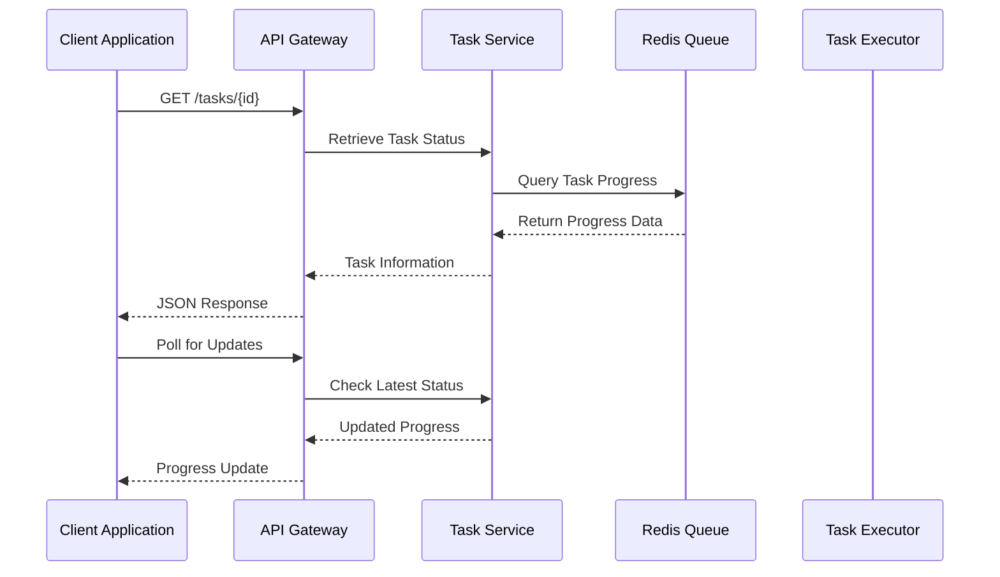

**Diagram sources**
- [document_app.py](file://api/apps/document_app.py#L50-L84)
- [task_service.py](file://api/db/services/task_service.py#L74-L142)

**Section sources**
- [document_app.py](file://api/apps/document_app.py#L50-L84)
- [task_service.py](file://api/db/services/task_service.py#L74-L142)

## Sandbox Environment Execution

The sandbox environment provides secure, isolated execution contexts for code-based tasks and custom processing logic.

### Sandbox Architecture

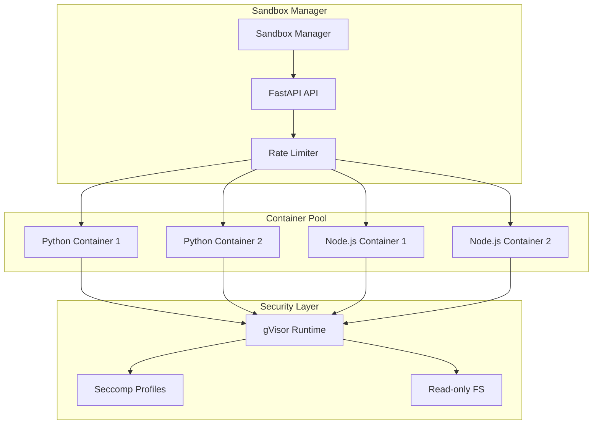

**Diagram sources**
- [main.py](file://sandbox/executor_manager/main.py#L16-L26)
- [container.py](file://sandbox/executor_manager/core/container.py#L35-L130)

### Container Management

The sandbox automatically manages container pools with dynamic scaling:

| Configuration | Default Value | Description |
|---------------|---------------|-------------|
| `POOL_SIZE` | 5 | Number of containers per language |
| `MAX_MEMORY` | 256MB | Memory limit per container |
| `TIMEOUT` | 10s | Execution timeout |
| `ENABLE_SECCOMP` | false | Enable syscall filtering |

**Section sources**
- [container.py](file://sandbox/executor_manager/core/container.py#L35-L130)
- [docker-compose.yml](file://sandbox/docker-compose.yml#L1-L32)

## Task Types and Processing Patterns

RAGFlow supports multiple task types, each with specialized processing patterns and execution requirements.

### Document Processing Tasks

| Task Type | Description | Processing Pattern | Resource Requirements |
|-----------|-------------|-------------------|----------------------|
| `dataflow` | Custom pipeline processing | Sequential stages | CPU, Memory |
| `raptor` | Hierarchical summarization | Recursive clustering | CPU, GPU |
| `graphrag` | Knowledge graph extraction | Parallel processing | CPU, Memory |
| `naive` | Basic chunking | Linear processing | CPU, Memory |

### Processing Pipeline Stages

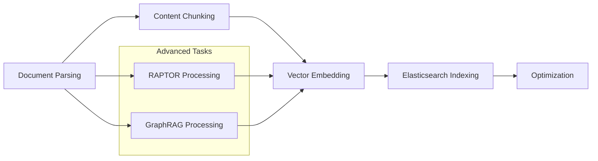

**Diagram sources**
- [task_executor.py](file://rag/svr/task_executor.py#L827-L972)
- [pipeline.py](file://rag/flow/pipeline.py#L62-L91)

**Section sources**
- [task_executor.py](file://rag/svr/task_executor.py#L827-L972)
- [pipeline.py](file://rag/flow/pipeline.py#L62-L91)

## Task Prioritization and Queue Management

The system implements a multi-level priority queue with configurable priorities and intelligent load balancing.

### Priority Configuration

Tasks are assigned priorities based on configuration and urgency:

| Priority Level | Range | Use Case | Queue Assignment |
|----------------|-------|----------|------------------|
| Critical | 0-2 | User-initiated tasks | Queue 0 |
| High | 3-5 | Batch processing | Queue 1 |
| Medium | 6-7 | Background tasks | Queue 2 |
| Low | 8-9 | Maintenance tasks | Queue 3 |

### Load Balancing Strategy

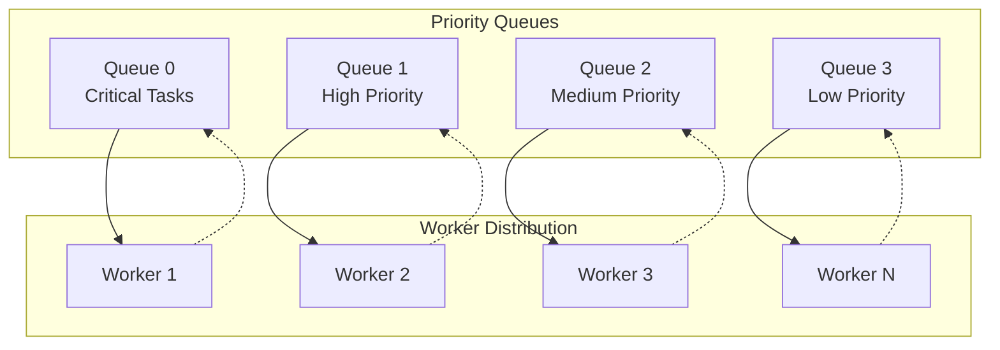

**Diagram sources**
- [task_service.py](file://api/db/services/task_service.py#L326-L431)

**Section sources**
- [task_service.py](file://api/db/services/task_service.py#L326-L431)

## Error Handling and Retry Mechanisms

The system implements comprehensive error handling with automatic retry logic and graceful degradation.

### Error Classification and Recovery

| Error Type | Detection Method | Recovery Strategy | Retry Policy |
|------------|------------------|-------------------|--------------|
| Network Timeout | Connection failures | Exponential backoff | 3 attempts |
| Resource Exhaustion | Memory/CPU limits | Backpressure | Immediate fail |
| Processing Error | Task exceptions | Log and continue | 1 attempt |
| Configuration Error | Validation failures | Fail fast | No retry |

### Cancellation Mechanism

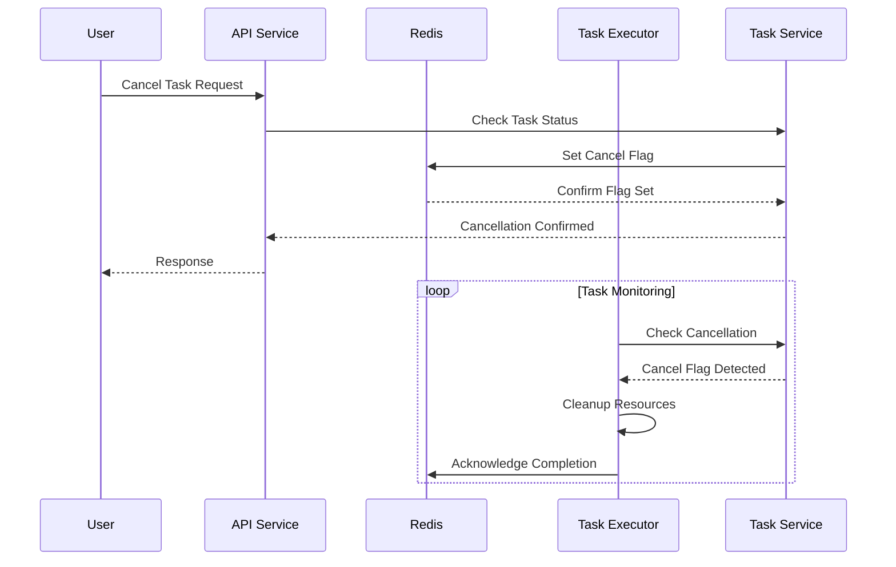

**Diagram sources**
- [task_service.py](file://api/db/services/task_service.py#L480-L494)
- [task_executor.py](file://rag/svr/task_executor.py#L809-L812)

**Section sources**
- [task_service.py](file://api/db/services/task_service.py#L480-L494)
- [task_executor.py](file://rag/svr/task_executor.py#L809-L812)

## Monitoring and Health Checks

Real-time monitoring and health checking ensure system reliability and performance visibility.

### Health Check Architecture

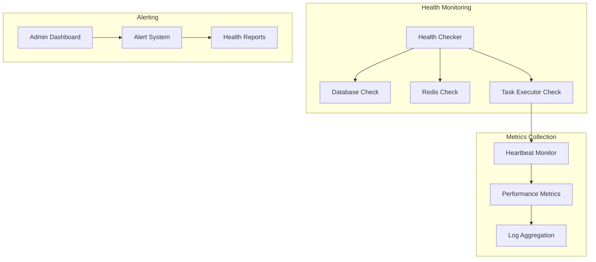

**Diagram sources**
- [health_utils.py](file://api/utils/health_utils.py#L159-L198)
- [system_app.py](file://api/apps/system_app.py#L126-L166)

### Performance Metrics

Key performance indicators tracked in real-time:

| Metric | Description | Threshold | Action |
|--------|-------------|-----------|--------|
| Pending Tasks | Tasks awaiting execution | > 1000 | Scale workers |
| Failed Tasks | Task execution failures | > 5% | Investigate errors |
| Queue Lag | Message processing delay | > 30s | Check bottlenecks |
| Worker Utilization | Active worker percentage | > 80% | Add capacity |

**Section sources**
- [health_utils.py](file://api/utils/health_utils.py#L159-L198)
- [system_app.py](file://api/apps/system_app.py#L126-L166)

## Scalability and Performance Optimization

The system is designed for horizontal scaling with performance optimization at multiple levels.

### Horizontal Scaling Strategies

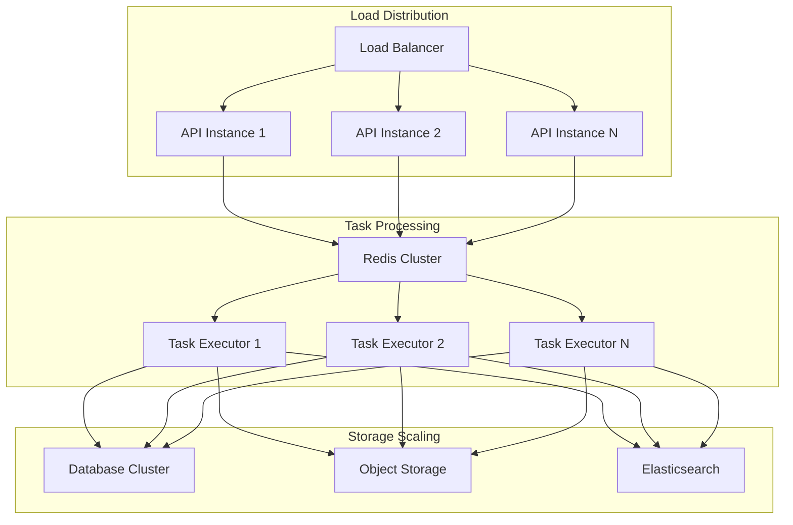

**Diagram sources**
- [launch_backend_service.sh](file://docker/launch_backend_service.sh#L53-L92)
- [entrypoint.sh](file://docker/entrypoint.sh#L170-L296)

### Performance Optimization Techniques

| Technique | Implementation | Benefit | Trade-off |
|-----------|----------------|---------|-----------|
| Connection Pooling | Database connection pooling | Reduced latency | Memory overhead |
| Batch Processing | Bulk operations | Improved throughput | Higher memory usage |
| Async Processing | Trio async framework | Better concurrency | Complexity |
| Caching | LRU caches | Faster access | Memory consumption |

**Section sources**
- [task_executor.py](file://rag/svr/task_executor.py#L113-L122)
- [launch_backend_service.sh](file://docker/launch_backend_service.sh#L53-L92)

## Configuration and Deployment

Comprehensive configuration management supports various deployment scenarios and environments.

### Environment Configuration

Key configuration parameters for task processing:

| Parameter | Default | Description | Environment Variable |
|-----------|---------|-------------|---------------------|
| `MAX_CONCURRENT_TASKS` | 5 | Maximum simultaneous tasks | `MAX_CONCURRENT_TASKS` |
| `WORKER_HEARTBEAT_TIMEOUT` | 120s | Worker timeout threshold | `WORKER_HEARTBEAT_TIMEOUT` |
| `EMBEDDING_BATCH_SIZE` | 64 | Embedding batch size | `EMBEDDING_BATCH_SIZE` |
| `DOC_BULK_SIZE` | 1000 | Document bulk insert size | `DOC_BULK_SIZE` |

### Deployment Architecture

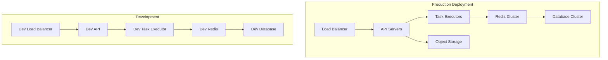

**Diagram sources**
- [service_conf.yaml](file://conf/service_conf.yaml#L1-L151)
- [entrypoint.sh](file://docker/entrypoint.sh#L170-L296)

**Section sources**
- [service_conf.yaml](file://conf/service_conf.yaml#L1-L151)
- [entrypoint.sh](file://docker/entrypoint.sh#L170-L296)