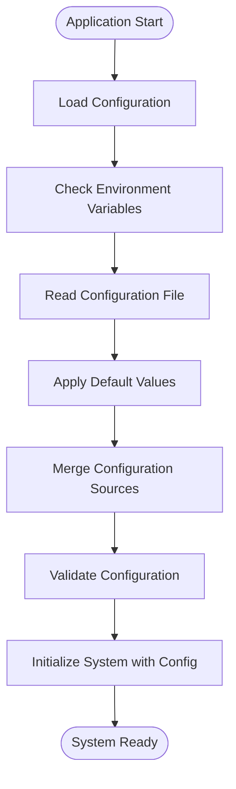
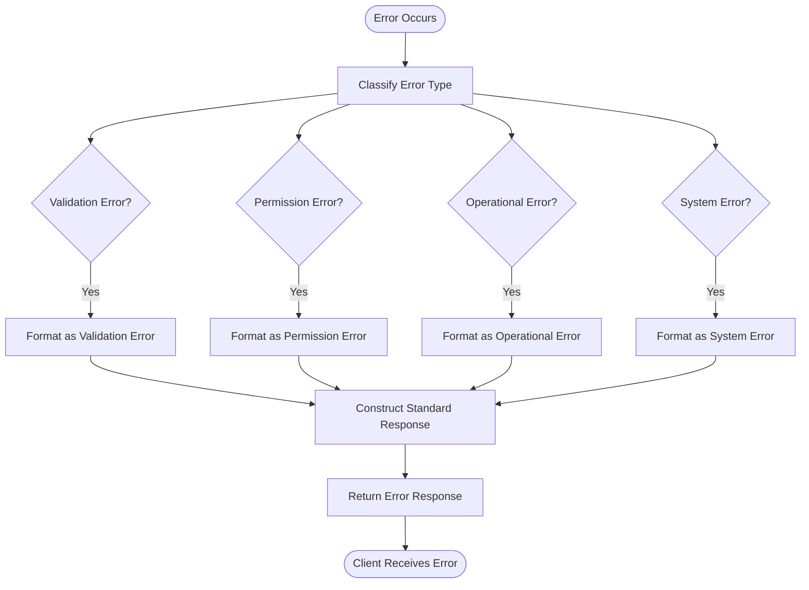
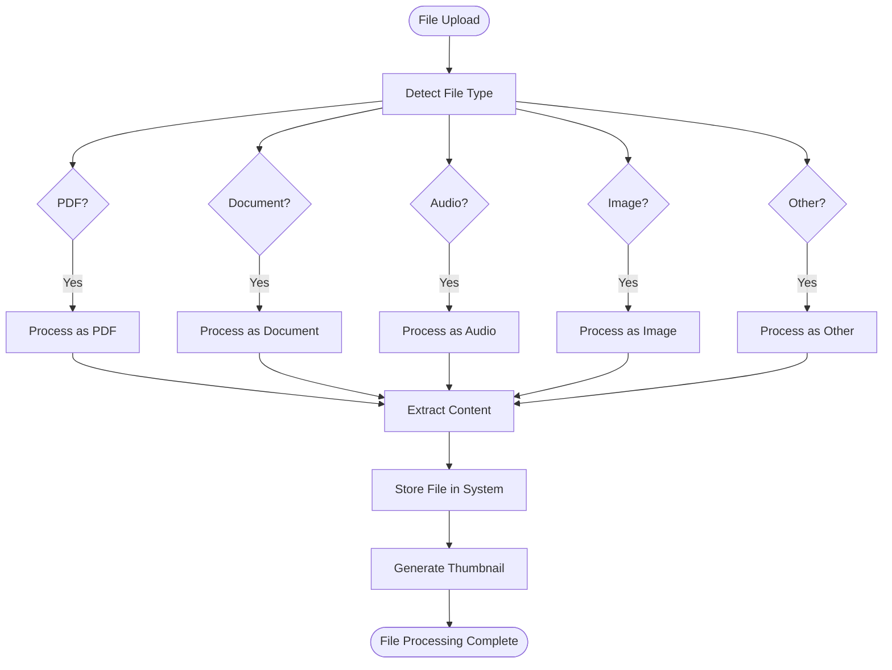
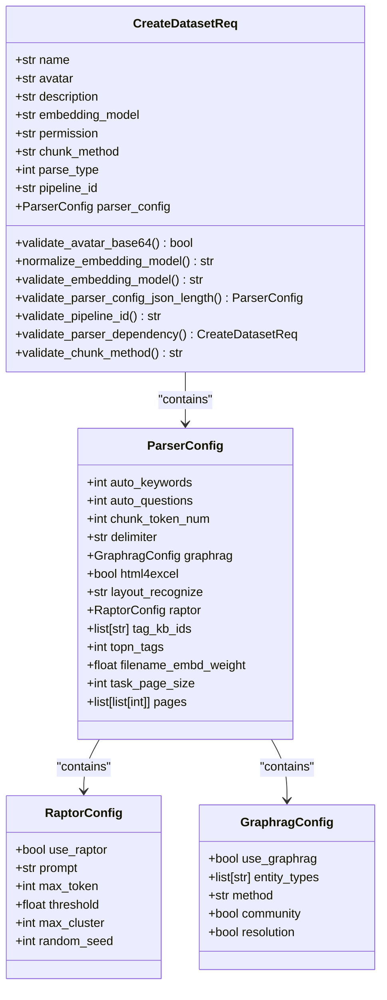
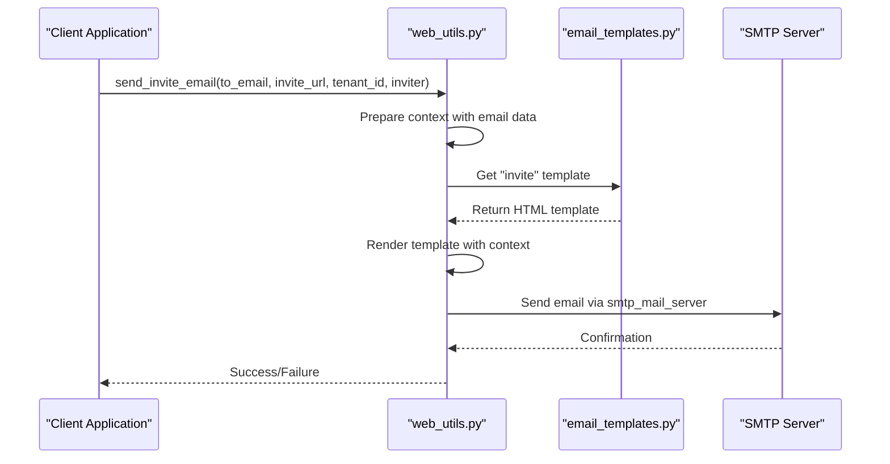

# Utility Modules

<cite>
**Referenced Files in This Document**   
- [api/utils/common.py](file://api/utils/common.py)
- [api/utils/configs.py](file://api/utils/configs.py)
- [api/utils/crypt.py](file://api/utils/crypt.py)
- [api/utils/email_templates.py](file://api/utils/email_templates.py)
- [api/utils/file_utils.py](file://api/utils/file_utils.py)
- [api/utils/validation_utils.py](file://api/utils/validation_utils.py)
- [api/utils/health_utils.py](file://api/utils/health_utils.py)
- [api/utils/web_utils.py](file://api/utils/web_utils.py)
- [api/utils/api_utils.py](file://api/utils/api_utils.py)
- [api/utils/json_encode.py](file://api/utils/json_encode.py)
- [api/utils/commands.py](file://api/utils/commands.py)
- [common/config_utils.py](file://common/config_utils.py)
- [common/exceptions.py](file://common/exceptions.py)
- [common/file_utils.py](file://common/file_utils.py)
- [common/log_utils.py](file://common/log_utils.py)
- [common/string_utils.py](file://common/string_utils.py)
- [common/time_utils.py](file://common/time_utils.py)
- [common/token_utils.py](file://common/token_utils.py)
</cite>

## Table of Contents
1. [Introduction](#introduction)
2. [Core Utility Packages](#core-utility-packages)
3. [Configuration System](#configuration-system)
4. [Exception Hierarchy and Error Handling](#exception-hierarchy-and-error-handling)
5. [API Response Utilities](#api-response-utilities)
6. [File Handling and Processing](#file-handling-and-processing)
7. [Validation Framework](#validation-framework)
8. [Cryptographic Operations](#cryptographic-operations)
9. [Email Templating System](#email-templating-system)
10. [Health Check and Monitoring](#health-check-and-monitoring)
11. [Web Utilities](#web-utilities)
12. [Design Principles and Guidelines](#design-principles-and-guidelines)
13. [Conclusion](#conclusion)

## Introduction

RAGFlow's utility modules provide a comprehensive set of shared functionality that supports the entire backend system. These utilities are organized into two main packages: `api/utils` which contains application-specific utilities for the API layer, and `common` which contains cross-cutting concerns and shared functionality used throughout the application.

The utility modules are designed to promote code reuse, maintain consistency across the application, and provide robust implementations of common patterns. They handle critical aspects such as configuration management, error handling, data validation, cryptographic operations, file processing, and system monitoring.

This documentation provides a comprehensive overview of these utility modules, explaining their functionality, design principles, and usage patterns. The utilities are essential for maintaining the reliability, security, and performance of the RAGFlow system, and understanding them is crucial for developers working on any part of the application.

## Core Utility Packages

The RAGFlow utility system is organized into two primary packages: `api/utils` and `common`. The `api/utils` package contains modules specifically designed for the API layer, including request validation, response formatting, authentication utilities, and health checks. The `common` package contains more general-purpose utilities that can be used across different components of the application, including file operations, string manipulation, time utilities, and logging.

The design follows a layered approach where the `common` utilities provide foundational functionality that can be leveraged by the more specialized `api/utils` modules. This separation ensures that core utilities remain lightweight and focused, while API-specific utilities can build upon them to provide higher-level abstractions tailored to the needs of the web interface.

The utility modules are designed with reusability and maintainability in mind, following Python best practices for modularity and code organization. Each module has a clear responsibility and provides a well-defined interface, making it easy for developers to understand and use the provided functionality without needing to understand the internal implementation details.

**Section sources**
- [api/utils/common.py](file://api/utils/common.py)
- [common/file_utils.py](file://common/file_utils.py)
- [common/string_utils.py](file://common/string_utils.py)
- [common/time_utils.py](file://common/time_utils.py)

## Configuration System

### Configuration Loading and Management

RAGFlow implements a robust configuration system that allows settings to be managed across different environments. The configuration system is built around the `common/config_utils.py` module, which provides functions for loading base configuration and managing environment-specific settings. The system supports loading configuration from multiple sources, including environment variables, configuration files, and default values.

The configuration system is designed to be flexible and extensible, allowing new configuration options to be added without requiring changes to the core infrastructure. Configuration values can be overridden at different levels, with more specific sources taking precedence over more general ones. This allows for fine-grained control over application behavior in different deployment scenarios.

Environment-specific configuration is managed through a combination of environment variables and configuration files. The system can detect the current environment (development, staging, production) and load the appropriate configuration settings. This enables seamless deployment across different environments without requiring code changes.

**Diagram sources **
- [common/config_utils.py](file://common/config_utils.py)
- [api/utils/configs.py](file://api/utils/configs.py)

### Configuration Serialization and Security

The configuration system includes specialized utilities for secure serialization and deserialization of configuration data. The `api/utils/configs.py` module provides functions for serializing objects to base64-encoded pickle format and deserializing them safely. This is particularly important for handling configuration data that may be stored or transmitted between different components of the system.

A key security feature is the `RestrictedUnpickler` class, which limits deserialization to only trusted modules (`numpy` and `rag_flow`). This prevents potential security vulnerabilities that could arise from deserializing untrusted data. The `use_deserialize_safe_module` configuration option controls whether this restricted deserialization is used, providing an additional layer of security for sensitive environments.

The serialization utilities also handle encoding conversions between strings and bytes, ensuring that configuration data is properly formatted regardless of the input or output format. This makes the system more robust when dealing with configuration data from different sources or in different formats.

**Section sources**
- [api/utils/configs.py](file://api/utils/configs.py)
- [common/config_utils.py](file://common/config_utils.py)

## Exception Hierarchy and Error Handling

### Exception Classification

RAGFlow implements a comprehensive exception hierarchy that categorizes errors based on their nature and origin. The system distinguishes between different types of errors, including validation errors, operational errors, permission errors, and system exceptions. This classification allows for appropriate handling of different error types and provides meaningful feedback to users and administrators.

The exception system is built on Python's standard exception hierarchy but extends it with application-specific exception types. This allows for fine-grained error handling while maintaining compatibility with standard Python exception handling patterns. The system uses exception codes to identify specific error conditions, making it easier to diagnose issues and implement automated recovery procedures.

The error handling strategy emphasizes clarity and security. Error messages are designed to be informative enough to help users resolve issues without revealing sensitive system information. For security-sensitive operations, generic error messages are used to prevent information leakage that could be exploited by attackers.

### Error Response Formatting

The utility modules provide standardized functions for creating error responses that follow a consistent format across the API. The `api/utils/api_utils.py` module contains several functions for generating error responses with appropriate HTTP status codes and structured JSON payloads. These functions ensure that error responses are consistent, machine-readable, and provide sufficient information for clients to handle errors appropriately.

The error response format includes a code, message, and optional data field. The code provides a machine-readable identifier for the error type, while the message provides a human-readable description. The data field can include additional context or diagnostic information when appropriate. This structure allows clients to handle errors programmatically while still providing meaningful feedback to end users.

**Diagram sources **
- [api/utils/api_utils.py](file://api/utils/api_utils.py)
- [common/exceptions.py](file://common/exceptions.py)

**Section sources**
- [api/utils/api_utils.py](file://api/utils/api_utils.py)
- [common/exceptions.py](file://common/exceptions.py)

## API Response Utilities

### Response Formatting and Standardization

The API response utilities provide a consistent way to format responses across all endpoints. The `api/utils/api_utils.py` module contains several functions for creating standardized JSON responses, including `get_json_result`, `construct_json_result`, and `get_result`. These functions ensure that all API responses follow the same structure, making it easier for clients to parse and handle responses.

The response format includes a code field that indicates the success or failure of the operation, a message field that provides additional information, and an optional data field that contains the actual response data. For successful operations, the data field contains the requested information, while for errors, it may contain additional diagnostic information.

The utilities also support pagination through the `total` parameter in the `get_result` function, which allows endpoints to indicate the total number of items available when returning a subset of results. This is particularly useful for list endpoints that support pagination.

### Response Validation and Error Handling

In addition to formatting responses, the API utilities provide functions for validating requests and handling errors. The `validate_request` decorator can be used to ensure that required parameters are present and have valid values before a handler function is executed. This reduces boilerplate code in handler functions and ensures consistent validation across endpoints.

The error handling utilities include functions for creating specific types of error responses, such as `get_error_argument_result` for invalid arguments, `get_error_permission_result` for permission errors, and `get_error_operating_result` for operational errors. These functions make it easy to return appropriate error responses with the correct status codes and error codes.

The system also includes a `server_error_response` function that handles uncaught exceptions, logging the error and returning a standardized error response. This ensures that even unexpected errors are handled gracefully and don't expose sensitive information to clients.

**Section sources**
- [api/utils/api_utils.py](file://api/utils/api_utils.py)

## File Handling and Processing

### File Type Detection and Management

The file handling utilities provide comprehensive functionality for working with different types of files. The `api/utils/file_utils.py` module includes the `filename_type` function, which determines the type of a file based on its extension. This function categorizes files into types such as PDF, document, audio, visual, or other, which is used to determine how the file should be processed.

The system supports a wide range of file types, including common document formats (PDF, DOCX, XLSX), images (PNG, JPEG, GIF), audio files (MP3, WAV), and various text-based formats (CSV, JSON, TXT). The file type detection is implemented using regular expressions that match file extensions, making it easy to extend with additional file types if needed.

**Diagram sources **
- [api/utils/file_utils.py](file://api/utils/file_utils.py)

### Thumbnail Generation and File Repair

The file utilities include functionality for generating thumbnails for different file types, which are used in the user interface to provide visual previews of files. The `thumbnail_img` function supports generating thumbnails for PDFs, images, and PowerPoint presentations. For PDFs, it uses the pdfplumber library to extract the first page and convert it to a PNG image. For images, it uses PIL to create a scaled-down version. For PowerPoint files, it uses the aspose.slides library to generate a thumbnail of the first slide.

The system also includes functionality for repairing potentially corrupted PDF files using Ghostscript. The `repair_pdf_with_ghostscript` function uses the `gs` command-line tool to process the PDF and attempt to fix any corruption. This is particularly useful when dealing with user-uploaded files that may be damaged or incomplete.

The `read_potential_broken_pdf` function combines both approaches, first attempting to open the PDF directly, and if that fails, trying to repair it with Ghostscript before opening. This ensures that as many PDF files as possible can be processed successfully, even if they have minor corruption issues.

**Section sources**
- [api/utils/file_utils.py](file://api/utils/file_utils.py)
- [common/file_utils.py](file://common/file_utils.py)

## Validation Framework

### Request Validation and Parsing

The validation framework provides robust tools for validating and parsing incoming requests. The `api/utils/validation_utils.py` module contains functions for validating JSON requests and query parameters against Pydantic models. The `validate_and_parse_json_request` function performs a multi-stage validation process, checking the Content-Type header, parsing the JSON syntax, verifying the payload structure, and validating against the specified Pydantic model.

The validation process returns a tuple containing the validated data and an error message. If validation is successful, the data is returned with a None error message. If validation fails, None is returned for the data along with a descriptive error message. This pattern makes it easy to handle validation results in handler functions.

The framework also includes a `format_validation_error_message` function that converts Pydantic validation errors into a standardized string format. This function extracts the field location, error message, and input value from each validation error and formats them into a consistent message that can be returned to clients.

### Data Normalization and Field Validation

The validation utilities include functions for normalizing and validating individual data fields. The `normalize_str` function trims whitespace and converts strings to lowercase, which is useful for standardizing user input. The `validate_uuid1_hex` function validates that a value is a valid UUID version 1 and returns its hexadecimal representation.

The system uses Pydantic models with custom validators to enforce complex validation rules. For example, the `CreateDatasetReq` model includes validators for the avatar field (checking Base64 format and MIME type), the embedding_model field (ensuring it follows the <model_name>@<provider> format), and the pipeline_id field (validating it's a 32-character hexadecimal string).

The validation framework also includes mixed conditional validation through model validators. For example, the `validate_parser_dependency` method on the `CreateDatasetReq` model enforces complex rules about the relationship between the chunk_method, parse_type, and pipeline_id fields, ensuring that they are used in a consistent and valid combination.

**Diagram sources **
- [api/utils/validation_utils.py](file://api/utils/validation_utils.py)

**Section sources**
- [api/utils/validation_utils.py](file://api/utils/validation_utils.py)

## Cryptographic Operations

### Password Encryption and Decryption

The cryptographic utilities provide secure methods for encrypting and decrypting sensitive data, particularly passwords. The `api/utils/crypt.py` module contains functions for encrypting passwords using RSA encryption with a public key and decrypting them with a private key. The keys are stored in the `conf` directory as `public.pem` and `private.pem` files.

The `crypt` function encrypts a password by first base64-encoding it and then encrypting it with the public key using PKCS1_v1_5 padding. The encrypted password is then base64-encoded again for safe transmission. This double encoding ensures that the encrypted data can be safely included in JSON payloads and other text-based formats.

The `decrypt` function reverses this process, decoding the base64-encoded encrypted password, decrypting it with the private key, and then base64-decoding the result to obtain the original password. The system also includes a `decrypt2` function that handles a slightly different encryption format, providing backward compatibility with older encrypted passwords.

### Key Management and Security

The cryptographic system uses a fixed password ("Welcome") for accessing the private key, which is specified in the `RSA.importKey` calls. This approach simplifies key management but should be considered when evaluating the overall security posture of the system. The private key is stored in the configuration directory, which should be protected with appropriate file system permissions.

The encryption functions are designed to be used in conjunction with the web interface, where passwords are encrypted before being sent to the server and decrypted when needed for authentication. This ensures that passwords are not transmitted or stored in plaintext, providing an additional layer of security.

The system could be enhanced with additional security features such as key rotation, passphrase-based key protection, or integration with hardware security modules for improved key management.

**Section sources**
- [api/utils/crypt.py](file://api/utils/crypt.py)
- [conf/private.pem](file://conf/private.pem)
- [conf/public.pem](file://conf/public.pem)

## Email Templating System

### Template Management and Reuse

The email templating system provides a reusable framework for sending HTML emails with consistent formatting. The `api/utils/email_templates.py` module defines a set of reusable HTML email templates and a registry for accessing them. Currently, the system includes templates for user invitations and password reset codes.

The templates are defined as string constants with placeholders for dynamic content, using the `{{variable}}` syntax. For example, the invitation email template includes placeholders for the recipient's email address, the inviter's name, the team ID, and the invitation URL. This allows the same template to be used for multiple invitations with different content.

The templates are registered in the `EMAIL_TEMPLATES` dictionary, which maps template keys to their corresponding HTML content. This registry pattern makes it easy to add new templates and ensures that template access is consistent across the application.

### Email Sending Functionality

The email utilities include functions for sending HTML emails using the configured SMTP server. The `send_email_html` function in `api/utils/web_utils.py` is a generic email sender that takes a subject, recipient email, template key, and context variables. It looks up the specified template, renders it with the provided context, and sends it as an HTML email.

The `send_invite_email` function is a specialized wrapper that uses the generic email sender to send invitation emails. It provides a simpler interface with parameters specific to the invitation use case, such as the invitation URL, tenant ID, and inviter name.

The email system is integrated with the Flask-Mail extension, which handles the actual SMTP communication. The SMTP server configuration is managed through the application settings, allowing it to be easily configured for different environments.

**Diagram sources **
- [api/utils/email_templates.py](file://api/utils/email_templates.py)
- [api/utils/web_utils.py](file://api/utils/web_utils.py)

**Section sources**
- [api/utils/email_templates.py](file://api/utils/email_templates.py)
- [api/utils/web_utils.py](file://api/utils/web_utils.py)

## Health Check and Monitoring

### System Health Checks

The health check utilities provide comprehensive monitoring of the system's various components. The `api/utils/health_utils.py` module contains functions for checking the status of the database, Redis cache, document engine, and storage system. These functions are used to implement the system's health check endpoint, which provides a quick way to verify that all components are functioning correctly.

The `run_health_checks` function orchestrates the individual health checks, calling each one and aggregating the results. It returns a dictionary with the status of each component and a final status that indicates whether the entire system is healthy. If any component is not healthy, additional diagnostic information is included in the response.

The health check functions are designed to be lightweight and fast, using simple queries or operations to verify that each component is responsive. For example, the database health check executes a simple `SELECT 1` query, while the Redis health check calls the `health` method on the Redis connection.

### Component-Specific Monitoring

In addition to the basic health checks, the system provides more detailed monitoring functions for specific components. These include `get_es_cluster_stats` for Elasticsearch, `get_infinity_status` for Infinity, `get_mysql_status` for MySQL, `get_redis_info` for Redis, and `check_minio_alive` for MinIO. These functions provide more detailed information about the status and performance of each component.

The monitoring system also includes functions for checking the status of specific services, such as the RAGFlow server itself (`check_ragflow_server_alive`) and the task executors (`check_task_executor_alive`). These functions use HTTP requests and Redis queries to verify that these services are running and responsive.

The health check results can be used for automated monitoring and alerting, as well as for troubleshooting issues in the system. The detailed diagnostic information provided by the monitoring functions can help identify the root cause of problems and guide remediation efforts.

**Section sources**
- [api/utils/health_utils.py](file://api/utils/health_utils.py)

## Web Utilities

### URL and Content Validation

The web utilities provide functions for validating URLs and other web-related content. The `is_valid_url` function in `api/utils/web_utils.py` checks whether a given string is a valid URL by verifying its format and ensuring that it doesn't point to a private IP address. This is important for security, as it prevents the system from accessing internal resources that should not be exposed.

The validation process first checks the URL format using a regular expression, then parses the URL to extract the hostname, and finally resolves the hostname to an IP address to check if it's a private IP. This multi-step process ensures that both the format and the destination of the URL are valid and safe.

The module also includes the `is_private_ip` function, which uses the `ipaddress` module to determine whether a given IP address is in a private range. This function is used by the URL validation to prevent access to internal network resources.

### HTML to PDF Conversion

The web utilities include functionality for converting HTML content to PDF format using headless Chrome. The `html2pdf` function uses Selenium to render HTML content in a Chrome browser and then generate a PDF from it. This is useful for creating printable versions of content or for generating documents from web-based templates.

The conversion process uses Chrome's print-to-PDF functionality, which provides high-fidelity rendering of HTML and CSS. The function supports custom print options, allowing control over aspects such as page orientation, margins, and background graphics.

The HTML to PDF conversion is implemented with proper error handling and resource management, ensuring that the Chrome driver is properly cleaned up after use. The function also includes a timeout parameter to prevent the conversion from hanging indefinitely if there are issues with the HTML content or the rendering process.

**Section sources**
- [api/utils/web_utils.py](file://api/utils/web_utils.py)

## Design Principles and Guidelines

### Modularity and Reusability

The utility modules in RAGFlow are designed with strong principles of modularity and reusability. Each utility module has a clear, focused responsibility and provides a well-defined interface. This makes it easy to understand what each module does and how to use it without needing to understand its internal implementation.

The modules are organized in a way that promotes code reuse and minimizes dependencies. The `common` package contains utilities that are likely to be used across different parts of the application, while the `api/utils` package contains utilities specific to the API layer. This separation ensures that core utilities remain lightweight and focused.

The functions within each module are designed to be as generic as possible while still providing useful functionality. They use clear, descriptive names and follow consistent patterns for parameters and return values. This makes the utilities easy to learn and use, even for developers who are new to the codebase.

### Error Handling and Robustness

The utility modules prioritize robustness and graceful error handling. Functions include appropriate error checking and validation of inputs, and they handle exceptions in a way that prevents them from propagating unexpectedly. When errors do occur, they are logged appropriately and returned to callers in a consistent format.

The error handling strategy emphasizes providing meaningful feedback without exposing sensitive information. Error messages are designed to be helpful for debugging while avoiding the disclosure of system internals that could be exploited by attackers.

The utilities also include defensive programming practices, such as checking for None values, validating input types, and using try-except blocks to handle potential exceptions from external dependencies. This makes the system more resilient to unexpected conditions and reduces the likelihood of cascading failures.

### Security Considerations

Security is a key consideration in the design of the utility modules. The cryptographic utilities use established algorithms and libraries for encryption and decryption, and they follow best practices for key management. The deserialization utilities include safeguards against potential security vulnerabilities, such as the restricted unpickler that limits deserialization to trusted modules.

The input validation utilities help prevent common security issues such as injection attacks by properly validating and sanitizing user input. The URL validation prevents access to internal network resources, reducing the attack surface of the system.

The utilities also follow the principle of least privilege, only doing what is necessary to accomplish their task and avoiding unnecessary access to system resources. This reduces the potential impact of any security vulnerabilities that might be discovered in the utility code.

## Conclusion

The utility modules in RAGFlow provide a comprehensive foundation for the application, offering shared functionality that supports critical aspects of the system including configuration management, error handling, data validation, cryptographic operations, file processing, and system monitoring.

These utilities are designed with principles of modularity, reusability, and robustness, making them easy to use and maintain. They follow consistent patterns and provide well-defined interfaces, reducing the learning curve for developers and promoting code consistency across the application.

The comprehensive validation framework ensures data integrity and security, while the error handling system provides meaningful feedback and graceful degradation in the face of issues. The cryptographic utilities protect sensitive data, and the file handling capabilities support a wide range of document types with robust processing and thumbnail generation.

The health check and monitoring utilities provide visibility into the system's status, enabling proactive maintenance and rapid troubleshooting. The web utilities extend the system's capabilities with features like HTML to PDF conversion and secure URL validation.

Together, these utility modules form a solid foundation that enables the development of reliable, secure, and maintainable features throughout the RAGFlow application. By leveraging these utilities, developers can focus on implementing business logic rather than reinventing common functionality, leading to faster development and higher quality code.