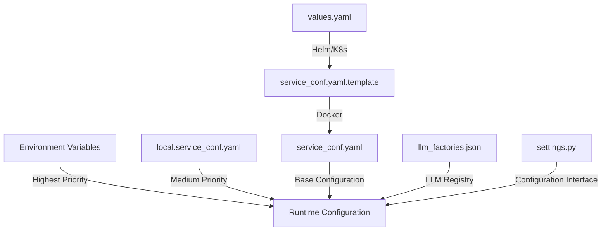
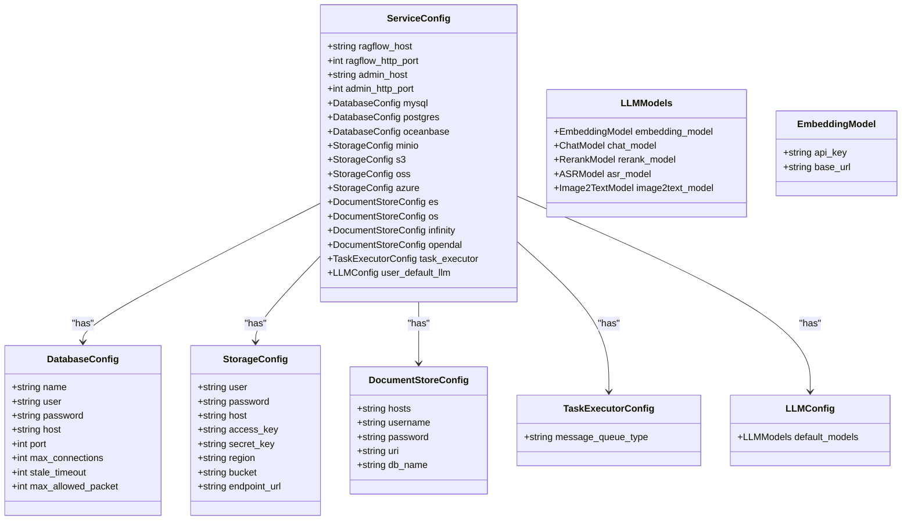
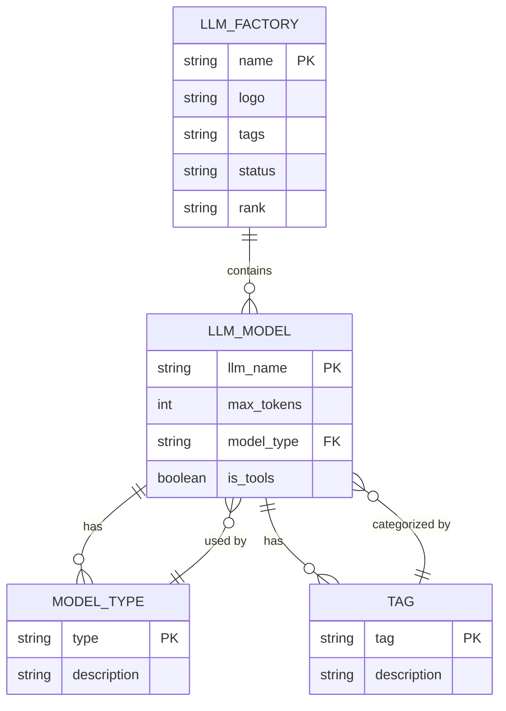
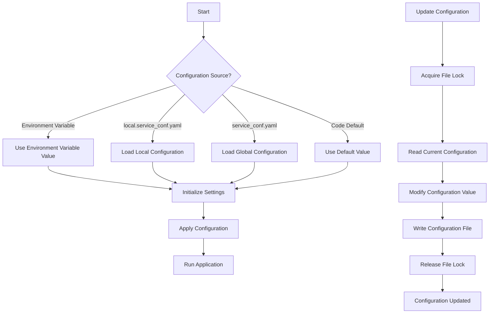
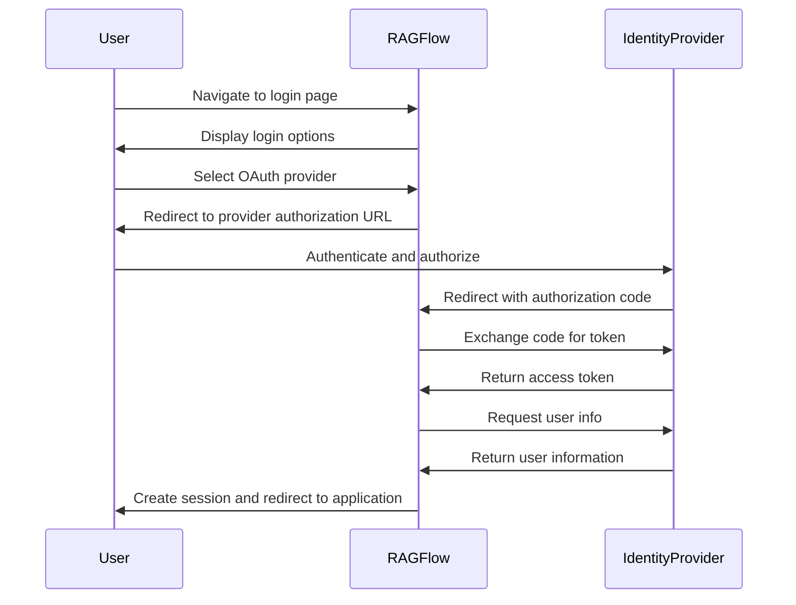
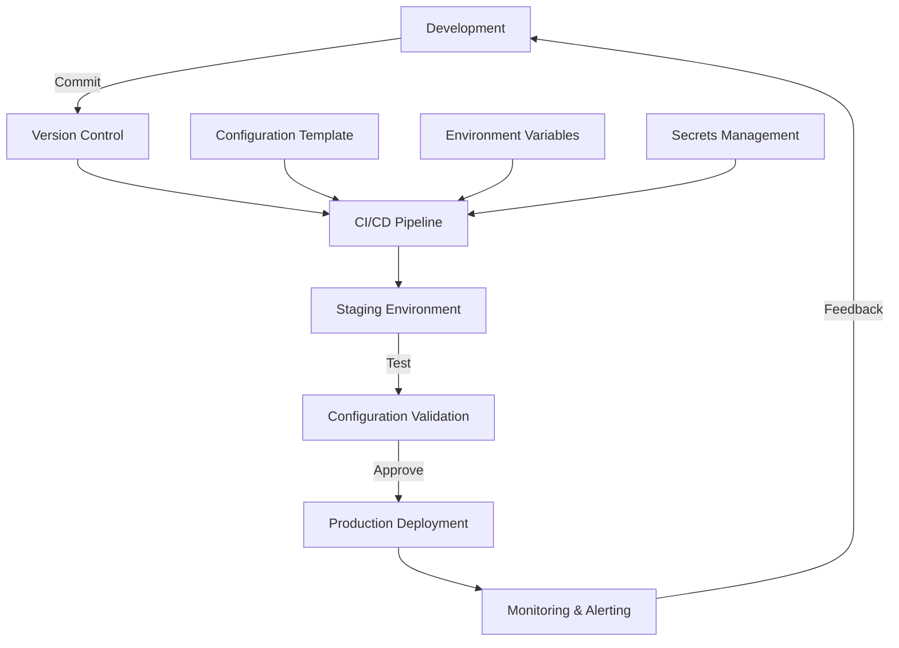
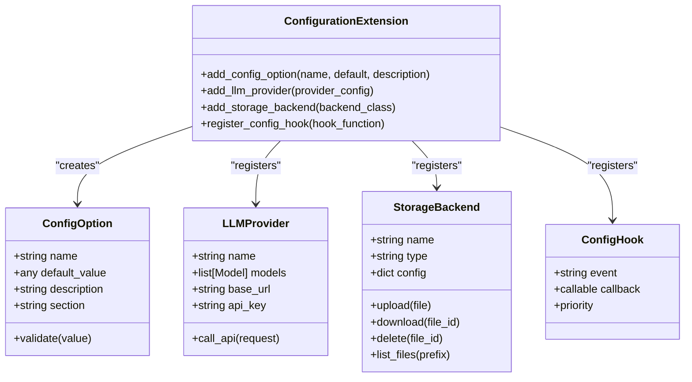

# Configuration Guide

<cite>
**Referenced Files in This Document**   
- [service_conf.yaml](file://conf/service_conf.yaml)
- [llm_factories.json](file://conf/llm_factories.json)
- [settings.py](file://common/settings.py)
- [config_utils.py](file://common/config_utils.py)
- [constants.py](file://common/constants.py)
- [service_conf.yaml.template](file://docker/service_conf.yaml.template)
- [values.yaml](file://helm/values.yaml)
- [ragflow_config.yaml](file://helm/templates/ragflow_config.yaml)
</cite>

## Table of Contents
1. [Introduction](#introduction)
2. [Configuration Files Overview](#configuration-files-overview)
3. [Service Configuration (service_conf.yaml)](#service-configuration-service_confyaml)
4. [LLM Providers Configuration (llm_factories.json)](#llm-providers-configuration-llm_factoriesjson)
5. [System Settings and Environment Variables](#system-settings-and-environment-variables)
6. [Database Configuration](#database-configuration)
7. [Storage Backend Configuration](#storage-backend-configuration)
8. [Authentication and OAuth Configuration](#authentication-and-oauth-configuration)
9. [Email Configuration](#email-configuration)
10. [Configuration Management Best Practices](#configuration-management-best-practices)
11. [Security Considerations](#security-considerations)
12. [Troubleshooting Common Configuration Issues](#troubleshooting-common-configuration-issues)
13. [Extending the Configuration System](#extending-the-configuration-system)

## Introduction

RAGFlow is a comprehensive retrieval-augmented generation (RAG) platform that enables users to build intelligent applications by combining large language models with knowledge retrieval capabilities. The system's behavior and integration with various services are controlled through a set of configuration files that define everything from service endpoints to LLM providers, authentication methods, and storage backends.

This configuration guide provides comprehensive documentation for all configuration options available in the main configuration files: `service_conf.yaml`, `settings.py`, and `llm_factories.json`. The guide explains the purpose and usage of each configuration parameter, provides examples for common scenarios, and covers best practices for configuration management across different deployment environments.

The configuration system in RAGFlow is designed to be flexible and extensible, allowing administrators to customize the platform for various use cases, from development environments to production deployments with high availability requirements. Understanding the configuration options is essential for deploying, maintaining, and optimizing RAGFlow instances.

**Section sources**
- [service_conf.yaml](file://conf/service_conf.yaml)
- [llm_factories.json](file://conf/llm_factories.json)
- [settings.py](file://common/settings.py)

## Configuration Files Overview

RAGFlow's configuration system consists of several key files that work together to define the platform's behavior. These files are organized hierarchically, with different files serving different purposes in the configuration lifecycle.

The primary configuration files are:

1. **service_conf.yaml**: The main configuration file that defines service endpoints, database connections, storage backends, authentication settings, and default LLM configurations. This YAML file serves as the central configuration hub for the RAGFlow platform.

2. **llm_factories.json**: A JSON file that defines the available LLM providers (factories) and their supported models, including chat models, embedding models, reranking models, speech-to-text models, and image-to-text models. This file acts as a registry of available LLM services.

3. **settings.py**: Python modules in various components (common, api, rag, agent) that load and process configuration data from the YAML and JSON files, providing a programmatic interface to configuration values throughout the application.

4. **service_conf.yaml.template**: A template file used in Docker deployments that includes environment variable placeholders (${VAR_NAME}) which are substituted during container startup.

5. **values.yaml**: A Helm chart values file used for Kubernetes deployments that defines environment variables and optional configuration overrides.

The configuration loading process follows a specific hierarchy. The system first loads the base configuration from `service_conf.yaml`, then applies any overrides from `local.service_conf.yaml` if it exists. Environment variables can also override configuration values, with the highest precedence. The `config_utils.py` module provides functions for reading, writing, and managing these configuration files.



**Diagram sources**
- [service_conf.yaml](file://conf/service_conf.yaml)
- [llm_factories.json](file://conf/llm_factories.json)
- [settings.py](file://common/settings.py)
- [config_utils.py](file://common/config_utils.py)
- [service_conf.yaml.template](file://docker/service_conf.yaml.template)
- [values.yaml](file://helm/values.yaml)

**Section sources**
- [service_conf.yaml](file://conf/service_conf.yaml)
- [llm_factories.json](file://conf/llm_factories.json)
- [settings.py](file://common/settings.py)
- [config_utils.py](file://common/config_utils.py)
- [service_conf.yaml.template](file://docker/service_conf.yaml.template)
- [values.yaml](file://helm/values.yaml)

## Service Configuration (service_conf.yaml)

The `service_conf.yaml` file is the primary configuration file for RAGFlow, defining the core services, database connections, storage backends, and system settings. This YAML file uses a hierarchical structure with top-level sections for different components of the system.

### Core Service Configuration

The core services section defines the network endpoints for the main RAGFlow components:

- **ragflow**: Configures the main application server
  - `host`: The network interface to bind to (default: 0.0.0.0)
  - `http_port`: The HTTP port for the main application (default: 9380)

- **admin**: Configures the administrative interface
  - `host`: The network interface to bind to (default: 0.0.0.0)
  - `http_port`: The HTTP port for the admin interface (default: 9381)

These settings determine how the RAGFlow services are exposed to clients and other components. In production environments, it's recommended to bind to specific interfaces rather than 0.0.0.0 for security reasons.

### Database Configuration

RAGFlow supports multiple database backends, with configuration options for different database systems:

- **mysql**: MySQL/MariaDB configuration
  - `name`: Database name (default: 'rag_flow')
  - `user`: Database username (default: 'root')
  - `password`: Database password (default: 'infini_rag_flow')
  - `host`: Database host (default: 'localhost')
  - `port`: Database port (default: 5455)
  - `max_connections`: Maximum database connections (default: 900)
  - `stale_timeout`: Connection timeout in seconds (default: 300)
  - `max_allowed_packet`: Maximum packet size in bytes (default: 1073741824)

- **oceanbase**: OceanBase database configuration
  - `scheme`: Connection scheme (default: 'oceanbase')
  - `config`: Nested configuration with db_name, user, password, host, and port

- **postgres**: PostgreSQL configuration (commented by default)
  - Similar structure to MySQL configuration

The database configuration is used for storing application metadata, user information, and system state. The system uses the `DATABASE_TYPE` environment variable to determine which database backend to use, defaulting to MySQL.

### Storage Backend Configuration

RAGFlow supports multiple object storage backends for storing documents, embeddings, and other binary data:

- **minio**: MinIO object storage configuration
  - `user`: Storage username (default: 'rag_flow')
  - `password`: Storage password (default: 'infini_rag_flow')
  - `host`: Storage host and port (default: 'localhost:9000')

- **s3**: AWS S3 configuration (commented by default)
  - `access_key`: AWS access key
  - `secret_key`: AWS secret key
  - `region`: AWS region
  - `bucket`: S3 bucket name

- **oss**: Alibaba Cloud OSS configuration (commented by default)
  - `access_key`: OSS access key
  - `secret_key`: OSS secret key
  - `endpoint_url`: OSS endpoint URL
  - `region`: OSS region
  - `bucket`: OSS bucket name

- **azure**: Azure Blob Storage configuration (commented by default)
  - Two authentication methods: SAS token or Service Principal Name (SPN)
  - Configuration parameters vary based on authentication method

The storage backend is selected using the `STORAGE_IMPL_TYPE` environment variable, which can be set to MINIO, AZURE_SPN, AZURE_SAS, AWS_S3, or OSS.

### Document Storage Engine Configuration

RAGFlow supports multiple document storage engines for indexing and searching content:

- **es**: Elasticsearch configuration
  - `hosts`: Comma-separated list of Elasticsearch hosts (default: 'http://localhost:1200')
  - `username`: Elasticsearch username (default: 'elastic')
  - `password`: Elasticsearch password (default: 'infini_rag_flow')

- **os**: OpenSearch configuration
  - `hosts`: Comma-separated list of OpenSearch hosts (default: 'http://localhost:1201')
  - `username`: OpenSearch username (default: 'admin')
  - `password`: OpenSearch password (default: 'infini_rag_flow_OS_01')

- **infinity**: Infinity vector database configuration
  - `uri`: Infinity server URI (default: 'localhost:23817')
  - `db_name`: Database name (default: 'default_db')

- **opendal**: OpenDAL unified storage interface configuration
  - `scheme`: Storage type (e.g., 'mysql', 's3', 'oss', 'azure')
  - `config`: Nested configuration specific to the storage type

The document storage engine is selected using the `DOC_ENGINE` environment variable, which can be set to 'elasticsearch', 'infinity', 'opensearch', or 'oceanbase'.

### Task Execution Configuration

The task execution system handles background processing and asynchronous operations:

- **task_executor**: Task execution configuration
  - `message_queue_type`: Type of message queue (default: 'redis')

This configuration determines how background tasks are queued and processed within the system.

### Default LLM Configuration

The default LLM configuration section defines the default language models used by the system:

- **user_default_llm**: Default LLM settings
  - `default_models`: Nested configuration for different model types
    - `embedding_model`: Default embedding model configuration
      - `api_key`: API key for the embedding service
      - `base_url`: Base URL for the embedding service API

Additional LLM configuration options can be uncommented for more advanced setups, including factory-level configuration and specific model settings.



**Diagram sources**
- [service_conf.yaml](file://conf/service_conf.yaml)

**Section sources**
- [service_conf.yaml](file://conf/service_conf.yaml)

## LLM Providers Configuration (llm_factories.json)

The `llm_factories.json` file defines the registry of available LLM providers (factories) and their supported models. This JSON file serves as a comprehensive catalog of language models that RAGFlow can utilize for various tasks such as text generation, embedding, reranking, speech-to-text, and image-to-text processing.

### LLM Factory Structure

The file contains a top-level array `factory_llm_infos` with objects representing different LLM providers. Each provider object has the following properties:

- **name**: The name of the LLM provider (e.g., "OpenAI", "xAI", "Tongyi-Qianwen", "ZHIPU-AI")
- **logo**: URL or path to the provider's logo (currently empty in the configuration)
- **tags**: Comma-separated list of capabilities supported by the provider
- **status**: Status indicator ("1" for active)
- **rank**: Priority ranking for the provider
- **llm**: Array of supported models

### Supported LLM Providers

RAGFlow supports multiple LLM providers, each with their own set of models:

#### OpenAI
The OpenAI provider supports a comprehensive range of models:
- Chat models: gpt-5.1, gpt-5, gpt-4.1, gpt-4.5-preview, gpt-4o, gpt-3.5-turbo
- Embedding models: text-embedding-ada-002, text-embedding-3-small, text-embedding-3-large
- Speech-to-text: whisper-1
- Text-to-speech: tts-1

#### xAI
The xAI provider (Grok models) supports:
- Chat models: grok-4, grok-3, grok-3-fast, grok-3-mini
- Vision models: grok-2-vision

#### TokenPony
The TokenPony provider supports various open-source and commercial models:
- Qwen series: qwen3-8b, qwen3-32b, qwen3-coder-480b
- DeepSeek series: deepseek-v3-0324, deepseek-r1-0528
- Kimi: kimi-k2-instruct-0905
- Hunyuan: hunyuan-a13b-instruct

#### Tongyi-Qianwen
The Tongyi-Qianwen provider supports:
- Qwen series: qwen-plus, qwen-max, qwen-turbo, qwen-long
- Vision models: qwen-vl-max, qwen-vl-plus
- Specialized models: qwq-32b, qwq-plus
- Embedding models: text-embedding-v2, text-embedding-v3, text-embedding-v4
- Reranking models: gte-rerank
- Speech-to-text: qwen3-asr-flash

#### ZHIPU-AI
The ZHIPU-AI provider supports:
- GLM series: glm-4.5, glm-4.5-x, glm-4.5-air, glm-4.5-airx, glm-4.5-flash
- Vision models: glm-4.5v
- Plus models: glm-4-plus, glm-4-0520

### Model Configuration

Each model in the `llm` array has the following properties:

- **llm_name**: The name of the model
- **tags**: Comma-separated list of capabilities (e.g., "LLM,CHAT,400k,IMAGE2TEXT")
- **max_tokens**: Maximum token capacity of the model
- **model_type**: Type of model (e.g., "chat", "embedding", "speech2text", "image2text", "rerank", "tts")
- **is_tools**: Boolean indicating whether the model supports function calling/tools

The tags field is particularly important as it categorizes the model's capabilities, allowing the system to select appropriate models for specific tasks. For example, models with "CHAT" in their tags are suitable for conversational tasks, while models with "EMBEDDING" are used for vectorization.

### Model Types and Capabilities

The configuration supports several model types, each serving a specific purpose in the RAG pipeline:

- **Chat models**: Used for generating responses in conversational interfaces
- **Embedding models**: Used for converting text to vectors for similarity search
- **Rerank models**: Used for reordering search results by relevance
- **Speech-to-text models**: Used for transcribing audio content
- **Image-to-text models**: Used for describing image content
- **Text-to-speech models**: Used for generating audio from text

The system uses this registry to present available models in the user interface and to validate model selections in various components.



**Diagram sources**
- [llm_factories.json](file://conf/llm_factories.json)

**Section sources**
- [llm_factories.json](file://conf/llm_factories.json)

## System Settings and Environment Variables

RAGFlow's behavior can be further customized through system settings and environment variables, which provide additional configuration options beyond the main configuration files. These settings are processed by the `settings.py` modules and can override values from configuration files.

### Environment Variables

The system recognizes several environment variables that control various aspects of RAGFlow's operation:

- **DB_TYPE**: Specifies the database backend to use (mysql, postgres, oceanbase)
- **DOC_ENGINE**: Specifies the document storage engine (elasticsearch, infinity, opensearch, oceanbase)
- **STORAGE_IMPL_TYPE**: Specifies the storage backend implementation (MINIO, AZURE_SPN, AZURE_SAS, AWS_S3, OSS)
- **RAGFLOW_SECRET_KEY**: Secret key for cryptographic operations
- **REGISTER_ENABLED**: Controls whether user registration is enabled (1 for enabled, 0 for disabled)
- **SANDBOX_ENABLED**: Controls whether the sandbox executor is enabled
- **SANDBOX_HOST**: Hostname for the sandbox executor service
- **MAX_CONTENT_LENGTH**: Maximum size of uploaded files in bytes
- **DOC_BULK_SIZE**: Number of document chunks processed in a single batch during parsing
- **EMBEDDING_BATCH_SIZE**: Number of text chunks processed in a single batch during embedding

These environment variables provide a way to customize RAGFlow's behavior without modifying configuration files, making them particularly useful in containerized deployments.

### System Settings in settings.py

The `common/settings.py` file contains various system settings that are initialized from configuration files and environment variables:

- **Database settings**: Loaded from the database configuration section
- **Authentication settings**: Loaded from the authentication configuration section
- **Document store settings**: Loaded based on the selected DOC_ENGINE
- **Storage settings**: Loaded based on the selected STORAGE_IMPL_TYPE
- **SMTP settings**: Loaded from the smtp configuration section
- **LLM settings**: Loaded from the user_default_llm configuration section

The `init_settings()` function in `settings.py` orchestrates the loading of these settings, resolving values from multiple sources according to a specific precedence order: environment variables (highest precedence), local configuration files, and global configuration files.

### Configuration Precedence

RAGFlow follows a specific precedence order when resolving configuration values:

1. Environment variables (highest precedence)
2. `local.service_conf.yaml` (if it exists)
3. `service_conf.yaml` (base configuration)
4. Default values in code (lowest precedence)

This hierarchy allows for flexible configuration management across different environments. For example, a development environment might use default values from `service_conf.yaml`, while a production environment could override specific settings through environment variables or a `local.service_conf.yaml` file.

### Dynamic Configuration Updates

The configuration system supports dynamic updates through the `update_config()` function in `config_utils.py`. This function allows runtime modification of configuration values with proper file locking to prevent race conditions. When a configuration value is updated, it is written to the configuration file and becomes persistent across restarts.



**Diagram sources**
- [settings.py](file://common/settings.py)
- [config_utils.py](file://common/config_utils.py)

**Section sources**
- [settings.py](file://common/settings.py)
- [config_utils.py](file://common/config_utils.py)

## Database Configuration

RAGFlow supports multiple database backends for storing application metadata, user information, and system state. The database configuration is a critical component of the system, as it affects performance, reliability, and scalability.

### Supported Database Backends

RAGFlow currently supports the following database backends:

#### MySQL
MySQL is the default database backend with the following configuration options:
- **name**: Database name (default: 'rag_flow')
- **user**: Database username (default: 'root')
- **password**: Database password (default: 'infini_rag_flow')
- **host**: Database host (default: 'localhost')
- **port**: Database port (default: 5455)
- **max_connections**: Maximum number of database connections (default: 900)
- **stale_timeout**: Connection timeout in seconds (default: 300)
- **max_allowed_packet**: Maximum packet size in bytes (default: 1073741824)

#### OceanBase
OceanBase is a distributed relational database with the following configuration:
- **scheme**: Connection scheme (default: 'oceanbase')
- **config**: Nested configuration with db_name, user, password, host, and port

#### PostgreSQL
PostgreSQL is supported as an alternative relational database (commented by default):
- Similar configuration structure to MySQL

The database backend is selected using the `DB_TYPE` environment variable, which defaults to 'mysql' if not specified.

### Database Connection Management

The system uses connection pooling to manage database connections efficiently. The `max_connections` parameter controls the maximum number of connections in the pool, while `stale_timeout` determines how long idle connections remain open before being closed.

For production deployments, it's recommended to:
- Use a dedicated database server rather than co-locating with the application
- Configure appropriate connection limits based on expected load
- Monitor database performance and adjust configuration as needed
- Implement regular backups and disaster recovery procedures

### Database Encryption

RAGFlow supports database password encryption through the following configuration options:
- **encrypt_password**: Boolean flag to enable password encryption
- **encrypt_module**: Python module and function for decryption (e.g., "module#function")
- **private_key**: Private key for decrypting passwords

When enabled, database passwords in the configuration file are encrypted and decrypted at runtime using the specified module and private key. This enhances security by preventing plaintext passwords from being stored in configuration files.

### Configuration Example

Here's an example of a production-ready database configuration:

```yaml
mysql:
  name: 'rag_flow_prod'
  user: 'ragflow_user'
  password: 'strong_password_here'
  host: 'db.prod.example.com'
  port: 3306
  max_connections: 500
  stale_timeout: 600
  max_allowed_packet: 1073741824
```

This configuration connects to a dedicated MySQL server with appropriate connection limits for a production workload.

**Section sources**
- [service_conf.yaml](file://conf/service_conf.yaml)
- [settings.py](file://common/settings.py)

## Storage Backend Configuration

RAGFlow supports multiple object storage backends for storing documents, embeddings, and other binary data. The storage backend configuration determines where and how data is persisted in the system.

### Supported Storage Backends

RAGFlow currently supports the following storage backends:

#### MinIO
MinIO is the default object storage backend with the following configuration:
- **user**: Storage username (default: 'rag_flow')
- **password**: Storage password (default: 'infini_rag_flow')
- **host**: Storage host and port (default: 'localhost:9000')

MinIO provides an S3-compatible API, making it easy to deploy on-premises or in private clouds.

#### AWS S3
Amazon S3 is supported for cloud deployments with the following configuration:
- **access_key**: AWS access key ID
- **secret_key**: AWS secret access key
- **region**: AWS region (e.g., 'us-east-1')
- **bucket**: S3 bucket name
- **prefix_path**: Optional prefix path within the bucket
- **signature_version**: AWS signature version (default: 'v4')
- **addressing_style**: S3 addressing style (default: 'path')

#### Alibaba Cloud OSS
Alibaba Cloud OSS is supported for deployments in China with the following configuration:
- **access_key**: OSS access key ID
- **secret_key**: OSS secret access key
- **endpoint_url**: OSS endpoint URL
- **region**: OSS region
- **bucket**: OSS bucket name
- **prefix_path**: Optional prefix path within the bucket

#### Azure Blob Storage
Azure Blob Storage is supported with two authentication methods:

**SAS Token Authentication:**
- **auth_type**: 'sas'
- **container_url**: Full URL to the container
- **sas_token**: Shared Access Signature token

**Service Principal Name (SPN) Authentication:**
- **auth_type**: 'spn'
- **account_url**: Storage account URL
- **client_id**: Azure AD application client ID
- **secret**: Client secret
- **tenant_id**: Azure AD tenant ID
- **container_name**: Container name

### Storage Backend Selection

The storage backend is selected using the `STORAGE_IMPL_TYPE` environment variable, which can be set to:
- MINIO (default)
- AZURE_SPN
- AZURE_SAS
- AWS_S3
- OSS

The system uses a factory pattern implemented in the `StorageFactory` class to instantiate the appropriate storage implementation based on the selected type.

### Configuration Examples

Here are examples of configuration for different storage backends:

**MinIO (default):**
```yaml
minio:
  user: 'rag_flow'
  password: 'infini_rag_flow'
  host: 'minio.example.com:9000'
```

**AWS S3:**
```yaml
s3:
  access_key: 'AKIAEXAMPLEKEY'
  secret_key: 'secret_key_here'
  region: 'us-west-2'
  bucket: 'ragflow-production'
  prefix_path: 'documents/'
```

**Azure Blob Storage (SPN):**
```yaml
azure:
  auth_type: 'spn'
  account_url: 'https://mystorageaccount.blob.core.windows.net'
  client_id: 'client_id_here'
  secret: 'client_secret_here'
  tenant_id: 'tenant_id_here'
  container_name: 'ragflow-container'
```

### Best Practices

When configuring storage backends, consider the following best practices:
- Use dedicated storage accounts/buckets for production environments
- Implement appropriate access controls and permissions
- Enable versioning and lifecycle policies for data protection
- Monitor storage usage and performance
- Implement backup and disaster recovery procedures
- Use secure connections (HTTPS) for all storage operations

**Section sources**
- [service_conf.yaml](file://conf/service_conf.yaml)
- [settings.py](file://common/settings.py)

## Authentication and OAuth Configuration

RAGFlow provides flexible authentication options to secure access to the platform and integrate with existing identity providers. The authentication configuration supports both built-in authentication and external OAuth providers.

### Client Authentication

The client authentication system controls access to the RAGFlow API and web interface:

- **authentication.client.switch**: Boolean flag to enable client authentication (default: false)
- **authentication.client.http_app_key**: HTTP application key for API access
- **authentication.client.http_secret_key**: HTTP secret key for API access

When enabled, client authentication requires API requests to include appropriate authentication credentials, typically in the form of API keys or tokens.

### OAuth Configuration

RAGFlow supports OAuth 2.0 and OpenID Connect (OIDC) for federated authentication with external identity providers. The OAuth configuration is organized by provider type:

#### OAuth2 Generic
Generic OAuth2 configuration for any OAuth2-compliant provider:
- **display_name**: Display name for the provider
- **client_id**: OAuth2 client ID
- **client_secret**: OAuth2 client secret
- **authorization_url**: Authorization endpoint URL
- **token_url**: Token endpoint URL
- **userinfo_url**: User info endpoint URL
- **redirect_uri**: Redirect URI after authentication

#### OIDC (OpenID Connect)
OpenID Connect configuration for identity providers that support OIDC:
- **display_name**: Display name for the provider
- **client_id**: OIDC client ID
- **client_secret**: OIDC client secret
- **issuer**: OIDC issuer URL
- **scope**: OAuth scopes to request
- **redirect_uri**: Redirect URI after authentication

#### GitHub
Pre-configured integration with GitHub authentication:
- **type**: 'github'
- **icon**: Icon identifier
- **display_name**: Display name (e.g., "Github")
- **client_id**: GitHub OAuth application client ID
- **client_secret**: GitHub OAuth application client secret
- **redirect_uri**: Redirect URI after GitHub authentication

Additional OAuth providers can be added by extending the configuration with the appropriate endpoints and credentials.

### Configuration Example

Here's an example of a complete OAuth configuration:

```yaml
oauth:
  oauth2:
    display_name: "Corporate SSO"
    client_id: "your_client_id"
    client_secret: "your_client_secret"
    authorization_url: "https://sso.example.com/oauth/authorize"
    token_url: "https://sso.example.com/oauth/token"
    userinfo_url: "https://sso.example.com/oauth/userinfo"
    redirect_uri: "https://ragflow.example.com/v1/user/oauth/callback/oauth2"
  oidc:
    display_name: "Identity Provider"
    client_id: "your_client_id"
    client_secret: "your_client_secret"
    issuer: "https://idp.example.com/oidc"
    scope: "openid email profile"
    redirect_uri: "https://ragflow.example.com/v1/user/oauth/callback/oidc"
  github:
    type: "github"
    icon: "github"
    display_name: "Github"
    client_id: "your_client_id"
    client_secret: "your_client_secret"
    redirect_uri: "https://ragflow.example.com/v1/user/oauth/callback/github"
```

### Security Considerations

When configuring authentication, consider the following security best practices:
- Store client secrets securely and never commit them to version control
- Use HTTPS for all authentication endpoints
- Implement appropriate token expiration and refresh mechanisms
- Validate redirect URIs to prevent open redirect vulnerabilities
- Monitor authentication logs for suspicious activity
- Implement multi-factor authentication where possible



**Diagram sources**
- [service_conf.yaml](file://conf/service_conf.yaml)

**Section sources**
- [service_conf.yaml](file://conf/service_conf.yaml)

## Email Configuration

RAGFlow includes email functionality for user registration, password reset, and system notifications. The email configuration is defined in the `smtp` section of the configuration file.

### SMTP Configuration Options

The email configuration includes the following parameters:

- **mail_server**: SMTP server hostname or IP address
- **mail_port**: SMTP server port (default: 465)
- **mail_use_ssl**: Boolean flag to use SSL encryption (default: true)
- **mail_use_tls**: Boolean flag to use TLS encryption (default: false)
- **mail_username**: SMTP authentication username
- **mail_password**: SMTP authentication password
- **mail_default_sender**: Sender information as a list with two elements:
  - Display name (e.g., "RAGFlow")
  - Sender email address
- **mail_frontend_url**: Frontend URL for email links

### Configuration Example

Here's an example of a complete email configuration:

```yaml
smtp:
  mail_server: "smtp.gmail.com"
  mail_port: 465
  mail_use_ssl: true
  mail_use_tls: false
  mail_username: "your-email@gmail.com"
  mail_password: "your-app-password"
  mail_default_sender:
    - "RAGFlow"
    - "your-email@gmail.com"
  mail_frontend_url: "https://ragflow.example.com"
```

### Email Service Providers

The configuration supports various email service providers:

#### Gmail
- **mail_server**: smtp.gmail.com
- **mail_port**: 465
- **mail_use_ssl**: true
- **mail_use_tls**: false
- Note: Use an App Password instead of your regular password for 2FA accounts

#### Outlook/Hotmail
- **mail_server**: smtp-mail.outlook.com
- **mail_port**: 587
- **mail_use_ssl**: false
- **mail_use_tls**: true

#### Custom SMTP Server
- Configure with your organization's SMTP server details
- Ensure proper authentication and encryption settings

### Best Practices

When configuring email services, consider the following best practices:
- Use dedicated email accounts for system notifications
- Implement proper error handling for failed email deliveries
- Monitor email sending rates to avoid being flagged as spam
- Use DKIM, SPF, and DMARC records to improve email deliverability
- Test email configuration thoroughly before deploying to production
- Store email credentials securely and rotate them periodically

### Troubleshooting

Common email configuration issues and solutions:
- **Connection timeout**: Verify network connectivity to the SMTP server
- **Authentication failed**: Check username and password, ensure app passwords are used for 2FA accounts
- **Certificate errors**: Verify SSL/TLS settings match the server requirements
- **Port blocked**: Check firewall rules and ensure the SMTP port is open
- **Email not delivered**: Check spam folder, verify sender domain configuration

**Section sources**
- [service_conf.yaml](file://conf/service_conf.yaml)

## Configuration Management Best Practices

Effective configuration management is essential for maintaining reliable and secure RAGFlow deployments across different environments. This section outlines best practices for managing RAGFlow configurations.

### Environment-Specific Configuration

RAGFlow supports different configuration strategies for various deployment environments:

#### Development Environment
- Use default configuration values where possible
- Enable debug mode for easier troubleshooting
- Use local services (localhost) for databases and storage
- Disable authentication for easier testing
- Set lower resource limits to conserve system resources

#### Staging Environment
- Mirror production configuration as closely as possible
- Use separate database and storage instances from production
- Enable monitoring and logging
- Test configuration changes before deploying to production
- Implement backup procedures

#### Production Environment
- Use dedicated infrastructure for databases and storage
- Implement high availability and redundancy
- Enable security features (authentication, encryption)
- Set appropriate resource limits based on expected load
- Implement monitoring, alerting, and logging
- Establish backup and disaster recovery procedures

### Configuration Hierarchy and Precedence

RAGFlow follows a specific configuration hierarchy with the following precedence order (highest to lowest):

1. Environment variables
2. `local.service_conf.yaml`
3. `service_conf.yaml`
4. Default values in code

This hierarchy allows for flexible configuration management:
- Use `service_conf.yaml` for base configuration shared across environments
- Use `local.service_conf.yaml` for environment-specific overrides
- Use environment variables for sensitive information and dynamic configuration

### Configuration Templates

For containerized deployments, RAGFlow provides configuration templates:

- **service_conf.yaml.template**: Template file with environment variable placeholders (${VAR_NAME})
- **values.yaml**: Helm chart values file for Kubernetes deployments

These templates allow for automated configuration during deployment, with environment variables being substituted at runtime.

### Version Control

When managing RAGFlow configurations, follow these version control best practices:
- Commit `service_conf.yaml` to version control (without sensitive information)
- Add `local.service_conf.yaml` and environment files to .gitignore
- Use configuration management tools to manage environment-specific settings
- Document configuration changes and their rationale
- Implement code reviews for configuration changes

### Configuration Validation

Before deploying configuration changes:
- Validate YAML syntax using a YAML validator
- Test configuration in a staging environment
- Verify connectivity to all services (database, storage, etc.)
- Check that all required parameters are set
- Validate that sensitive information is properly protected

### Automation

Automate configuration management using:
- Infrastructure as Code (IaC) tools like Terraform or Ansible
- CI/CD pipelines for automated deployment
- Configuration management tools like Ansible, Puppet, or Chef
- Container orchestration platforms like Kubernetes



**Diagram sources**
- [service_conf.yaml](file://conf/service_conf.yaml)
- [service_conf.yaml.template](file://docker/service_conf.yaml.template)
- [values.yaml](file://helm/values.yaml)

**Section sources**
- [service_conf.yaml](file://conf/service_conf.yaml)
- [service_conf.yaml.template](file://docker/service_conf.yaml.template)
- [values.yaml](file://helm/values.yaml)

## Security Considerations

Proper security configuration is critical when deploying RAGFlow in production environments. This section covers key security considerations for configuration management.

### Sensitive Configuration Data

Certain configuration parameters contain sensitive information that must be protected:

- Database passwords
- Storage access keys and secrets
- OAuth client secrets
- Email passwords
- API keys
- Private keys

Best practices for handling sensitive data:
- Never commit sensitive information to version control
- Use environment variables for sensitive configuration
- Implement secrets management (e.g., Hashicorp Vault, AWS Secrets Manager)
- Rotate credentials regularly
- Use the principle of least privilege when configuring access

### Configuration File Permissions

Ensure proper file permissions for configuration files:
- Set restrictive permissions (e.g., 600) on configuration files
- Store configuration files in secure locations
- Restrict access to configuration files to authorized users only
- Regularly audit file permissions

### Encryption

RAGFlow supports configuration encryption for enhanced security:
- Database password encryption using private keys
- Secure transmission of configuration data
- Encrypted storage of sensitive information

When implementing encryption:
- Store private keys securely and separately from configuration
- Use strong encryption algorithms
- Implement proper key management procedures
- Regularly rotate encryption keys

### Network Security

Secure network communication for RAGFlow services:
- Use HTTPS for all external communications
- Configure firewalls to restrict access to services
- Use private networks for internal service communication
- Implement network segmentation
- Regularly update and patch network infrastructure

### Authentication and Authorization

Secure authentication and authorization configuration:
- Enable authentication in production environments
- Use strong passwords and multi-factor authentication
- Implement role-based access control
- Regularly review and audit access permissions
- Monitor authentication logs for suspicious activity

### Regular Security Audits

Conduct regular security audits of RAGFlow configurations:
- Review configuration files for security vulnerabilities
- Verify that security features are properly configured
- Test for common security issues (e.g., open ports, weak passwords)
- Stay updated on security advisories for RAGFlow and dependencies
- Implement a security incident response plan

**Section sources**
- [service_conf.yaml](file://conf/service_conf.yaml)
- [settings.py](file://common/settings.py)

## Troubleshooting Common Configuration Issues

This section addresses common configuration issues encountered when deploying and managing RAGFlow, along with their solutions.

### Service Startup Failures

**Issue**: RAGFlow fails to start with database connection errors
**Solution**: 
- Verify database service is running
- Check database configuration (host, port, credentials)
- Ensure network connectivity between RAGFlow and database
- Verify database user has appropriate permissions

**Issue**: Document storage engine not accessible
**Solution**:
- Verify document storage service (Elasticsearch, Infinity, etc.) is running
- Check host and port configuration
- Verify authentication credentials
- Test connectivity using command-line tools

### Authentication Issues

**Issue**: OAuth login fails with redirect URI errors
**Solution**:
- Verify redirect_uri matches the configured value
- Ensure the frontend URL is correctly configured
- Check that the OAuth provider allows the redirect URI
- Verify SSL/TLS configuration if using HTTPS

**Issue**: Client authentication fails
**Solution**:
- Verify HTTP app key and secret are correctly configured
- Check that client authentication is enabled
- Verify API request includes proper authentication headers

### Storage Backend Issues

**Issue**: File uploads fail with storage connection errors
**Solution**:
- Verify storage service is running
- Check storage configuration (access keys, endpoints)
- Ensure network connectivity to storage service
- Verify bucket/container exists and has proper permissions

**Issue**: Files not accessible after upload
**Solution**:
- Check storage backend configuration
- Verify file paths and prefixes
- Ensure proper read permissions
- Check for network connectivity issues

### LLM Configuration Issues

**Issue**: LLM requests fail with authentication errors
**Solution**:
- Verify API keys are correctly configured
- Check base URL for the LLM service
- Ensure network connectivity to the LLM provider
- Verify rate limits are not exceeded

**Issue**: Default models not available
**Solution**:
- Verify model names in llm_factories.json
- Check that the selected LLM factory is properly configured
- Ensure network connectivity to the LLM service
- Verify API keys have access to the requested models

### Environment Variable Issues

**Issue**: Configuration values not being applied
**Solution**:
- Verify environment variable names match expected values
- Check that environment variables are properly exported
- Restart services after changing environment variables
- Verify the configuration precedence order

### General Troubleshooting Steps

When encountering configuration issues:
1. Check system logs for error messages
2. Verify configuration file syntax (YAML/JSON)
3. Test connectivity to external services
4. Validate that all required parameters are set
5. Compare configuration with working examples
6. Restart services after configuration changes
7. Consult documentation for configuration requirements

**Section sources**
- [service_conf.yaml](file://conf/service_conf.yaml)
- [llm_factories.json](file://conf/llm_factories.json)
- [settings.py](file://common/settings.py)

## Extending the Configuration System

RAGFlow's configuration system is designed to be extensible, allowing administrators and developers to add new configuration options and customize the platform for specific use cases.

### Adding New Configuration Options

To add new configuration options to RAGFlow:

1. **Define the configuration in service_conf.yaml**:
   Add the new option to the appropriate section of the configuration file with appropriate default values and comments.

2. **Update settings.py to process the new option**:
   Modify the `init_settings()` function in `common/settings.py` to read and process the new configuration option.

3. **Add type hints and validation**:
   Include appropriate type hints and validation logic to ensure the configuration value is correct.

4. **Document the new option**:
   Update documentation to describe the purpose, usage, and valid values for the new configuration option.

### Creating Custom LLM Providers

To add support for a new LLM provider:

1. **Add the provider to llm_factories.json**:
   ```json
   {
     "name": "YourProvider",
     "logo": "",
     "tags": "LLM,TEXT EMBEDDING",
     "status": "1",
     "rank": "900",
     "llm": [
       {
         "llm_name": "your-model",
         "tags": "LLM,CHAT,8K",
         "max_tokens": 8192,
         "model_type": "chat",
         "is_tools": false
       }
     ]
   }
   ```

2. **Implement the provider interface**:
   Create a new module that implements the LLM provider interface, handling API calls to the new provider.

3. **Register the provider**:
   Update the LLM factory registration to include the new provider.

### Custom Storage Backends

To add support for a new storage backend:

1. **Create a new storage implementation**:
   Implement a new class that inherits from the storage base class and provides the required methods.

2. **Add the storage type to the Storage enum**:
   Update the `Storage` enum in `constants.py` to include the new storage type.

3. **Register the storage implementation**:
   Add the new storage type to the `storage_mapping` in the `StorageFactory` class.

4. **Add configuration options**:
   Define the necessary configuration parameters in `service_conf.yaml`.

### Configuration Hooks

RAGFlow supports configuration hooks that allow custom code to execute when configuration changes:

1. **Implement a configuration listener**:
   Create a class that listens for configuration changes and performs appropriate actions.

2. **Register the listener**:
   Add the listener to the configuration system so it receives change notifications.

3. **Handle configuration updates**:
   Implement logic to respond to configuration changes, such as reinitializing services or reloading data.

### Best Practices for Extension

When extending the configuration system:
- Follow existing code patterns and conventions
- Write comprehensive documentation for new options
- Implement thorough testing for new configuration features
- Consider backward compatibility
- Use descriptive names for configuration options
- Provide sensible default values
- Validate configuration values to prevent errors



**Diagram sources**
- [service_conf.yaml](file://conf/service_conf.yaml)
- [llm_factories.json](file://conf/llm_factories.json)
- [settings.py](file://common/settings.py)
- [constants.py](file://common/constants.py)

**Section sources**
- [service_conf.yaml](file://conf/service_conf.yaml)
- [llm_factories.json](file://conf/llm_factories.json)
- [settings.py](file://common/settings.py)
- [constants.py](file://common/constants.py)