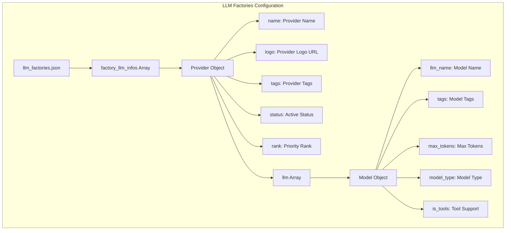
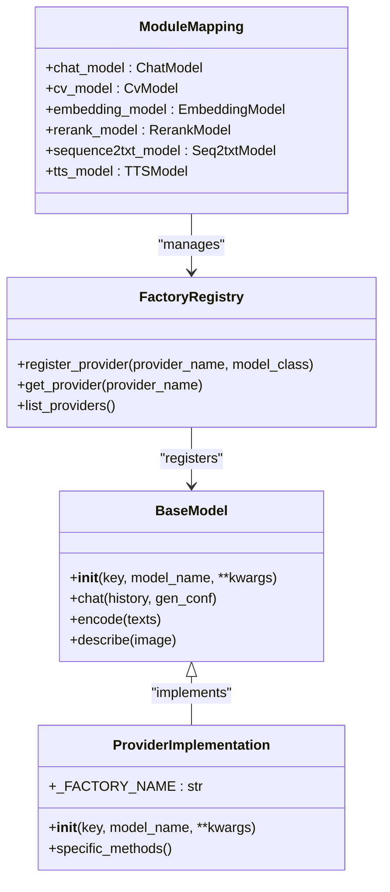
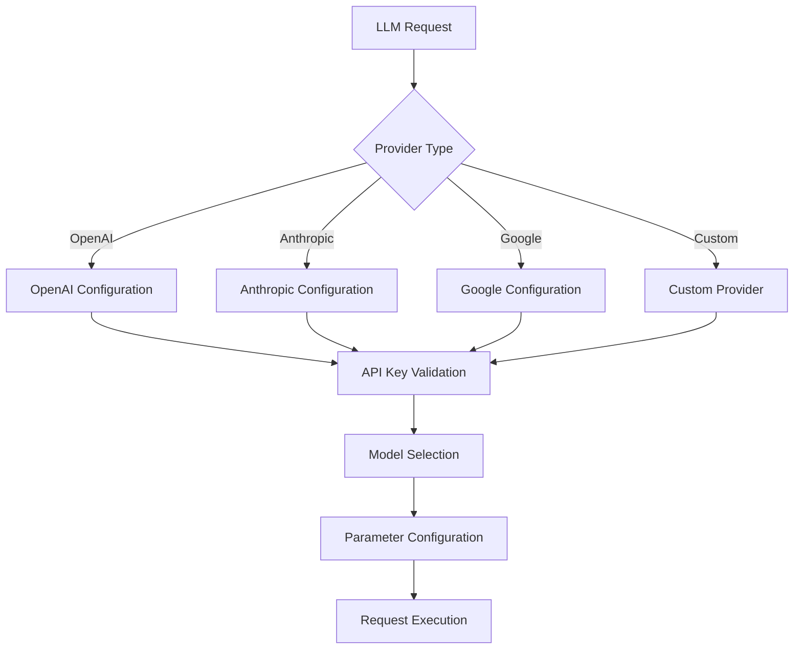
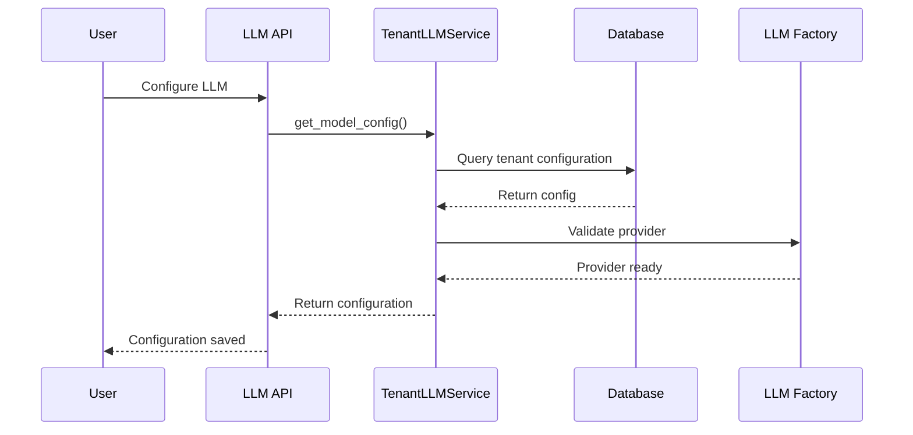
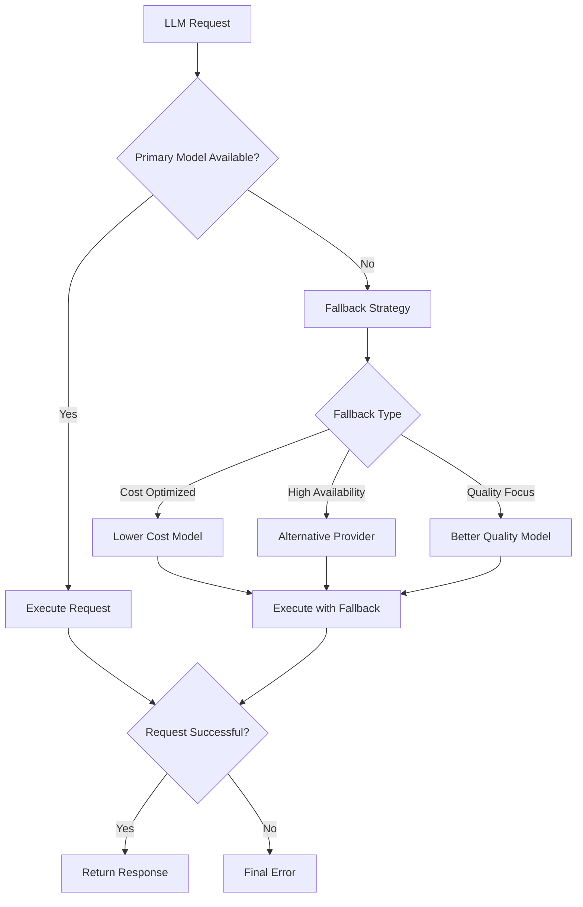
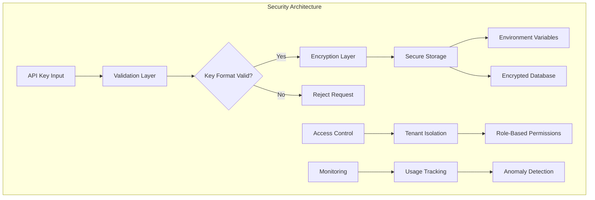
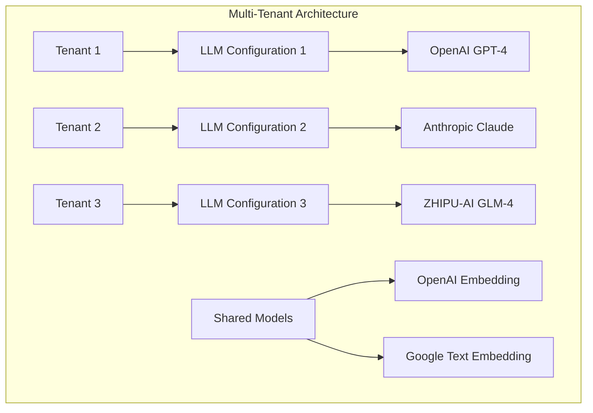

# LLM Configuration

<cite>
**Referenced Files in This Document**
- [conf/llm_factories.json](file://conf/llm_factories.json)
- [common/settings.py](file://common/settings.py)
- [api/db/services/tenant_llm_service.py](file://api/db/services/tenant_llm_service.py)
- [rag/llm/__init__.py](file://rag/llm/__init__.py)
- [rag/llm/chat_model.py](file://rag/llm/chat_model.py)
- [rag/llm/embedding_model.py](file://rag/llm/embedding_model.py)
- [api/db/services/llm_service.py](file://api/db/services/llm_service.py)
- [api/apps/llm_app.py](file://api/apps/llm_app.py)
- [web/src/pages/user-setting/constants.ts](file://web/src/pages/user-setting/constants.ts)
- [web/src/components/llm-select/llm-label.tsx](file://web/src/components/llm-select/llm-label.tsx)
- [agent/component/llm.py](file://agent/component/llm.py)
- [rag/raptor.py](file://rag/raptor.py)
</cite>

## Table of Contents
1. [Introduction](#introduction)
2. [LLM Factories Configuration Structure](#llm-factories-configuration-structure)
3. [Factory Pattern Implementation](#factory-pattern-implementation)
4. [Supported LLM Providers](#supported-llm-providers)
5. [Configuration Management](#configuration-management)
6. [Advanced Features](#advanced-features)
7. [Security Considerations](#security-considerations)
8. [Adding New LLM Providers](#adding-new-llm-providers)
9. [Multi-Tenant Configuration](#multi-tenant-configuration)
10. [Best Practices](#best-practices)

## Introduction

The RAGFlow LLM configuration system provides a comprehensive framework for managing Large Language Model providers through a centralized JSON configuration file (`llm_factories.json`) and a sophisticated factory pattern implementation. This system enables dynamic registration and switching of LLM providers while maintaining security, performance, and flexibility across multi-tenant deployments.

The configuration system supports over 50+ LLM providers including OpenAI, Anthropic, Google, Baidu, and many others, with advanced features like model routing, fallback strategies, rate limiting, and cost optimization.

## LLM Factories Configuration Structure

The core of the LLM configuration system is the `llm_factories.json` file, which defines all supported LLM providers and their available models with detailed metadata.

### Basic Configuration Schema



**Diagram sources**
- [conf/llm_factories.json](file://conf/llm_factories.json#L1-L50)

### Provider Configuration Example

Each LLM provider is configured as an object within the `factory_llm_infos` array:

```json
{
    "name": "OpenAI",
    "logo": "",
    "tags": "LLM,TEXT EMBEDDING,TTS,TEXT RE-RANK,SPEECH2TEXT,MODERATION",
    "status": "1",
    "rank": "999",
    "llm": [
        {
            "llm_name": "gpt-4o",
            "tags": "LLM,CHAT,128K,IMAGE2TEXT",
            "max_tokens": 128000,
            "model_type": "chat",
            "is_tools": true
        },
        {
            "llm_name": "text-embedding-ada-002",
            "tags": "TEXT EMBEDDING,8K",
            "max_tokens": 8191,
            "model_type": "embedding",
            "is_tools": false
        }
    ]
}
```

### Configuration Fields

| Field | Description | Required | Example |
|-------|-------------|----------|---------|
| `name` | Provider identifier | Yes | `"OpenAI"` |
| `logo` | Provider logo URL | No | `""` |
| `tags` | Comma-separated tags | No | `"LLM,TEXT EMBEDDING"` |
| `status` | Active status (0/1) | Yes | `"1"` |
| `rank` | Priority ranking | No | `"999"` |
| `llm_name` | Model identifier | Yes | `"gpt-4o"` |
| `tags` | Model capabilities | No | `"LLM,CHAT,128K"` |
| `max_tokens` | Maximum token limit | Yes | `128000` |
| `model_type` | Model category | Yes | `"chat"` |
| `is_tools` | Tool calling support | Yes | `true` |

**Section sources**
- [conf/llm_factories.json](file://conf/llm_factories.json#L1-L200)

## Factory Pattern Implementation

The LLM configuration system implements a sophisticated factory pattern that enables dynamic provider registration and model instantiation.

### Factory Registration Architecture



**Diagram sources**
- [rag/llm/__init__.py](file://rag/llm/__init__.py#L120-L170)
- [api/db/services/tenant_llm_service.py](file://api/db/services/tenant_llm_service.py#L130-L170)

### Dynamic Provider Loading

The system automatically discovers and registers LLM providers through module inspection:

```python
# Automatic provider registration mechanism
for module_name, mapping_dict in MODULE_MAPPING.items():
    full_module_name = f"{package_name}.{module_name}"
    module = importlib.import_module(full_module_name)
    
    # Register base classes and subclasses
    for name, obj in inspect.getmembers(module):
        if inspect.isclass(obj):
            if name == "Base":
                base_class = obj
            elif name == "LiteLLMBase":
                lite_llm_base_class = obj
                if hasattr(obj, "_FACTORY_NAME"):
                    register_model(obj._FACTORY_NAME, obj)
```

**Section sources**
- [rag/llm/__init__.py](file://rag/llm/__init__.py#L130-L170)

## Supported LLM Providers

The system supports a comprehensive range of LLM providers organized by capability categories.

### Primary LLM Providers

| Provider | Models | Capabilities | Authentication |
|----------|--------|--------------|----------------|
| OpenAI | GPT-4, GPT-4o, GPT-3.5, GPT-5 series | Chat, Embedding, TTS, Image2Text | API Key |
| Anthropic | Claude 3, Claude 4 | Chat, Image2Text | API Key |
| Google | Gemini Pro, Gemini Ultra | Chat, Embedding, Image2Text | API Key |
| ZHIPU-AI | GLM-4, GLM-4.5 | Chat, Embedding, Image2Text | API Key |
| Tongyi-Qianwen | Qwen, Qwen2, Qwen3 | Chat, Embedding, TTS, Image2Text | API Key |
| xAI | Grok, Grok-2, Grok-3 | Chat, Image2Text | API Key |

### Specialized Providers

| Provider | Purpose | Models | Configuration |
|----------|---------|--------|---------------|
| Builtin | Local models | BAAI/bge-m3, Qwen/Qwen3-Embedding | TEI integration |
| LocalAI | Self-hosted | Various local models | Custom endpoint |
| Azure-OpenAI | Enterprise | OpenAI-compatible | API key + endpoint |
| HuggingFace | Open-source | Various HF models | Access token |

### Provider-Specific Configuration



**Diagram sources**
- [api/db/services/tenant_llm_service.py](file://api/db/services/tenant_llm_service.py#L130-L170)
- [api/apps/llm_app.py](file://api/apps/llm_app.py#L64-L112)

**Section sources**
- [conf/llm_factories.json](file://conf/llm_factories.json#L1-L500)
- [web/src/pages/user-setting/constants.ts](file://web/src/pages/user-setting/constants.ts#L87-L128)

## Configuration Management

The LLM configuration system provides comprehensive management capabilities for tenant-specific configurations.

### Tenant Configuration Architecture



**Diagram sources**
- [api/db/services/tenant_llm_service.py](file://api/db/services/tenant_llm_service.py#L88-L122)
- [api/apps/llm_app.py](file://api/apps/llm_app.py#L52-L112)

### Configuration Loading Process

The system loads configurations through a multi-stage process:

1. **Static Configuration**: Load `llm_factories.json` during startup
2. **Dynamic Registration**: Register providers via factory pattern
3. **Tenant Override**: Apply tenant-specific configurations
4. **Validation**: Verify API keys and model availability

```python
# Configuration loading sequence
def load_llm_configuration():
    # Stage 1: Load static factory definitions
    FACTORY_LLM_INFOS = load_factory_definitions()
    
    # Stage 2: Register providers
    register_providers(FACTORY_LLM_INFOS)
    
    # Stage 3: Load tenant configurations
    tenant_configs = load_tenant_configurations()
    
    # Stage 4: Validate and apply
    validate_and_apply_configurations(tenant_configs)
```

**Section sources**
- [common/settings.py](file://common/settings.py#L170-L220)
- [api/db/services/tenant_llm_service.py](file://api/db/services/tenant_llm_service.py#L35-L60)

## Advanced Features

### Model Routing and Fallback Strategies

The system implements intelligent model routing with automatic fallback mechanisms:



**Diagram sources**
- [rag/llm/chat_model.py](file://rag/llm/chat_model.py#L72-L104)
- [api/db/services/tenant_llm_service.py](file://api/db/services/tenant_llm_service.py#L110-L122)

### Rate Limiting and Retry Logic

The system implements sophisticated rate limiting and retry mechanisms:

```python
# Retry configuration
class Base:
    def __init__(self, key, model_name, base_url, **kwargs):
        self.max_retries = kwargs.get("max_retries", 5)
        self.base_delay = kwargs.get("retry_interval", 2.0)
        self.max_rounds = kwargs.get("max_rounds", 5)
    
    def _get_delay(self):
        return self.base_delay * random.uniform(10, 150)
    
    def _classify_error(self, error):
        error_str = str(error).lower()
        error_mapping = [
            (["quota", "capacity"], LLMErrorCode.ERROR_QUOTA),
            (["rate limit", "429"], LLMErrorCode.ERROR_RATE_LIMIT),
            (["auth", "401"], LLMErrorCode.ERROR_AUTHENTICATION),
            # ... additional mappings
        ]
```

### Cost Optimization Settings

The system provides multiple cost optimization strategies:

| Strategy | Description | Implementation |
|----------|-------------|----------------|
| Token Truncation | Automatic text truncation | `truncate()` function |
| Batch Processing | Group requests for efficiency | Batch size configuration |
| Model Selection | Choose optimal model for task | Smart routing logic |
| Caching | Cache expensive operations | LRU cache implementation |

**Section sources**
- [rag/llm/chat_model.py](file://rag/llm/chat_model.py#L72-L1622)
- [api/db/services/llm_service.py](file://api/db/services/llm_service.py#L92-L130)

## Security Considerations

### API Key Management

The LLM configuration system implements robust security measures for API key management:



**Diagram sources**
- [api/apps/llm_app.py](file://api/apps/llm_app.py#L52-L112)
- [api/db/services/tenant_llm_service.py](file://api/db/services/tenant_llm_service.py#L35-L60)

### Security Best Practices

1. **Environment Variables**: Store sensitive credentials in environment variables
2. **Encryption**: Encrypt API keys in database storage
3. **Tenant Isolation**: Separate configurations per tenant
4. **Audit Logging**: Track all LLM access and modifications
5. **Rate Limiting**: Prevent abuse through request throttling

### Multi-Tenant Security Model

```python
# Tenant isolation implementation
class TenantLLMService:
    @classmethod
    @DB.connection_context()
    def get_api_key(cls, tenant_id, model_name):
        # Filter by tenant_id to ensure isolation
        objs = cls.query(tenant_id=tenant_id, llm_name=mdlnm)
        return objs[0] if objs else None
    
    @classmethod
    @DB.connection_context()
    def model_instance(cls, tenant_id, llm_type, llm_name=None, **kwargs):
        # Validate tenant ownership before instantiation
        model_config = cls.get_model_config(tenant_id, llm_type, llm_name)
        return create_model_instance(model_config)
```

**Section sources**
- [api/apps/llm_app.py](file://api/apps/llm_app.py#L52-L112)
- [api/db/services/tenant_llm_service.py](file://api/db/services/tenant_llm_service.py#L35-L170)

## Adding New LLM Providers

### Provider Registration Process

To add a new LLM provider, follow these steps:

1. **Update Configuration File**: Add provider definition to `llm_factories.json`
2. **Implement Provider Class**: Create provider-specific implementation
3. **Register Factory**: Add to factory registry
4. **Configure Models**: Define supported models and capabilities

### Configuration File Updates

Add provider to `llm_factories.json`:

```json
{
    "name": "NewProvider",
    "logo": "https://example.com/logo.png",
    "tags": "LLM,TEXT EMBEDDING",
    "status": "1",
    "rank": "900",
    "llm": [
        {
            "llm_name": "new-model-1",
            "tags": "LLM,CHAT,8K",
            "max_tokens": 8192,
            "model_type": "chat",
            "is_tools": true
        }
    ]
}
```

### Provider Implementation Example

```python
# New provider implementation
class NewProviderChat(Base):
    _FACTORY_NAME = "NewProvider"
    
    def __init__(self, key, model_name, base_url="https://api.newprovider.com/v1"):
        self.client = OpenAI(api_key=key, base_url=base_url)
        self.model_name = model_name
    
    def chat(self, system, history, gen_conf={}):
        # Implementation details
        pass
```

### Factory Registration

```python
# Register new provider
from rag.llm import ChatModel, EmbeddingModel

ChatModel["NewProvider"] = NewProviderChat
EmbeddingModel["NewProvider"] = NewProviderEmbedding
```

**Section sources**
- [rag/llm/__init__.py](file://rag/llm/__init__.py#L130-L170)
- [conf/llm_factories.json](file://conf/llm_factories.json#L1-L50)

## Multi-Tenant Configuration

### Tenant-Specific Model Assignment

The system supports assigning different LLM models to different tenants:



**Diagram sources**
- [api/db/services/tenant_llm_service.py](file://api/db/services/tenant_llm_service.py#L99-L122)
- [api/db/services/llm_service.py](file://api/db/services/llm_service.py#L39-L75)

### Configuration Inheritance

```python
# Tenant configuration inheritance
class LLMBundle(LLM4Tenant):
    def __init__(self, tenant_id, llm_type, llm_name=None, lang="Chinese", **kwargs):
        super().__init__(tenant_id, llm_type, llm_name, lang, **kwargs)
    
    def encode(self, texts: list):
        # Apply tenant-specific token limits
        safe_texts = []
        for text in texts:
            token_size = num_tokens_from_string(text)
            if token_size > self.max_length:
                target_len = int(self.max_length * 0.95)
                safe_texts.append(text[:target_len])
            else:
                safe_texts.append(text)
        
        embeddings, used_tokens = self.mdl.encode(safe_texts)
        return embeddings, used_tokens
```

### Usage Tracking and Billing

```python
# Multi-tenant usage tracking
class TenantLLMService:
    @classmethod
    @DB.connection_context()
    def increase_usage(cls, tenant_id, llm_type, used_tokens, llm_name=None):
        # Track usage per tenant
        num = (
            cls.model.update(used_tokens=cls.model.used_tokens + used_tokens)
            .where(
                cls.model.tenant_id == tenant_id,
                cls.model.llm_name == llm_name,
                cls.model.llm_factory == llm_factory
            )
            .execute()
        )
        return num
```

**Section sources**
- [api/db/services/tenant_llm_service.py](file://api/db/services/tenant_llm_service.py#L175-L210)
- [api/db/services/llm_service.py](file://api/db/services/llm_service.py#L92-L130)

## Best Practices

### Configuration Management

1. **Version Control**: Keep `llm_factories.json` under version control
2. **Environment Separation**: Use different configurations for dev/staging/prod
3. **Backup Strategy**: Regular backups of tenant configurations
4. **Testing**: Validate configurations before production deployment

### Performance Optimization

1. **Model Selection**: Choose appropriate models for specific tasks
2. **Batch Processing**: Group requests when possible
3. **Caching**: Implement caching for repeated operations
4. **Connection Pooling**: Use connection pooling for high-throughput scenarios

### Monitoring and Maintenance

1. **Health Checks**: Regular validation of API keys and model availability
2. **Usage Analytics**: Monitor token usage and costs
3. **Error Tracking**: Log and analyze failures
4. **Capacity Planning**: Monitor usage patterns for scaling decisions

### Security Guidelines

1. **Principle of Least Privilege**: Grant minimal necessary permissions
2. **Regular Audits**: Review configurations periodically
3. **Incident Response**: Have procedures for API key compromise
4. **Documentation**: Maintain up-to-date security documentation

The LLM configuration system provides a robust foundation for managing diverse LLM providers while maintaining security, performance, and flexibility across multi-tenant deployments. Its factory pattern implementation ensures extensibility, while advanced features like rate limiting and cost optimization help maintain efficient operations.