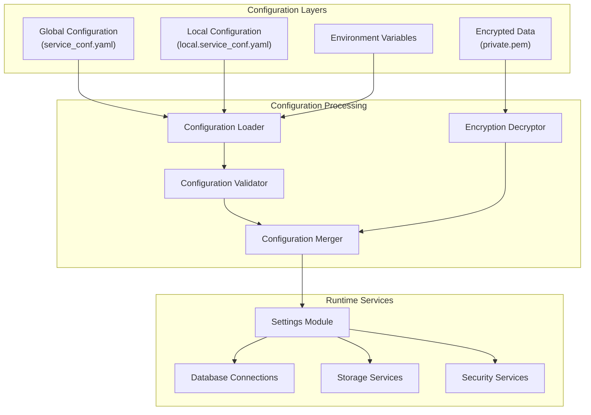
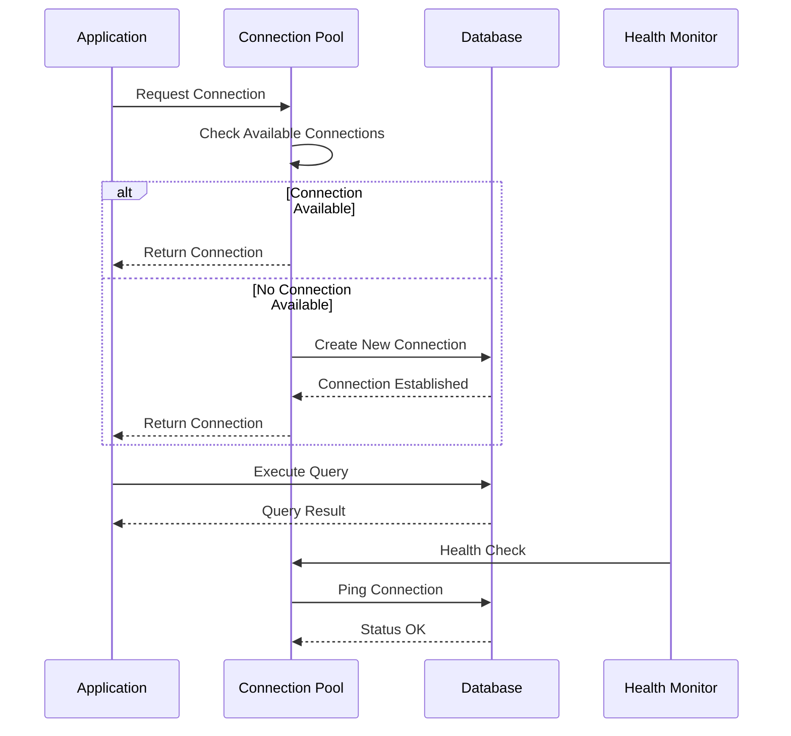
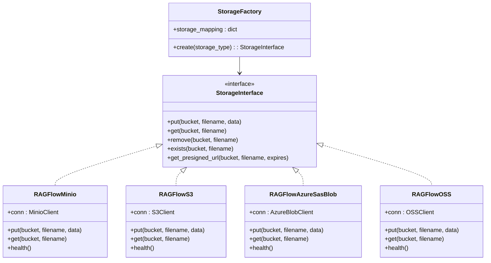
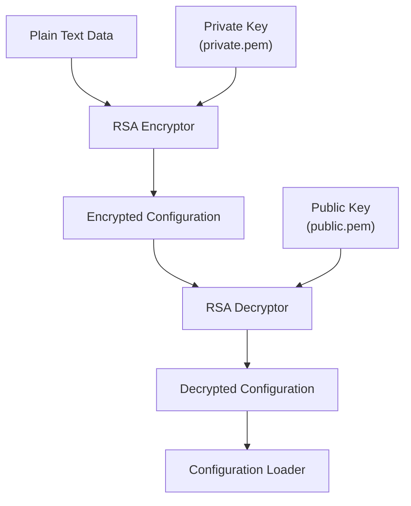
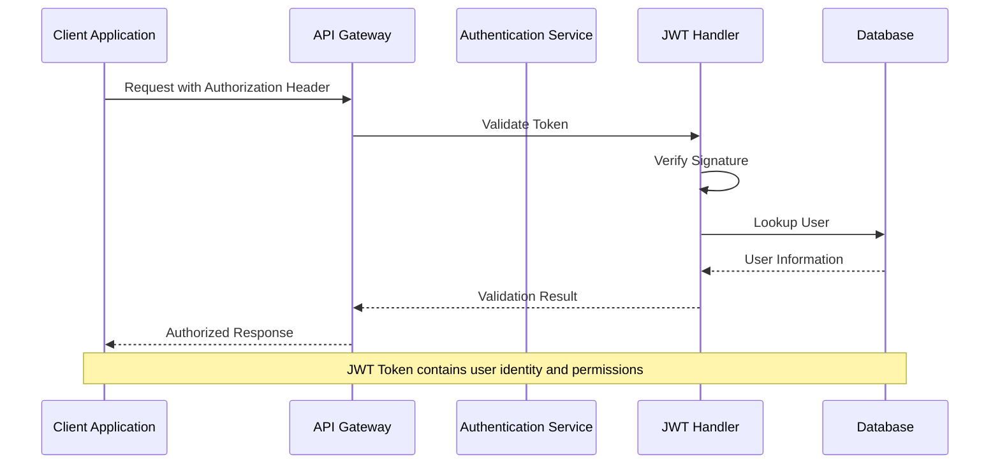
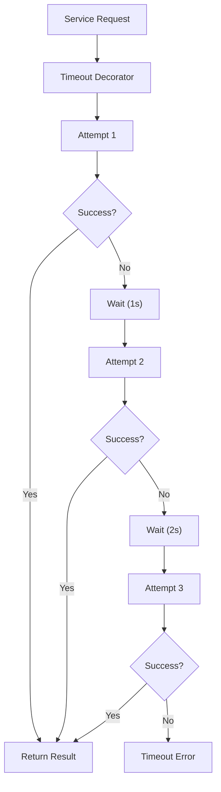

# Service Configuration

<cite>
**Referenced Files in This Document**
- [conf/service_conf.yaml](file://conf/service_conf.yaml)
- [docker/service_conf.yaml.template](file://docker/service_conf.yaml.template)
- [common/settings.py](file://common/settings.py)
- [common/config_utils.py](file://common/config_utils.py)
- [common/connection_utils.py](file://common/connection_utils.py)
- [rag/utils/minio_conn.py](file://rag/utils/minio_conn.py)
- [rag/utils/s3_conn.py](file://rag/utils/s3_conn.py)
- [rag/utils/redis_conn.py](file://rag/utils/redis_conn.py)
- [conf/private.pem](file://conf/private.pem)
- [conf/public.pem](file://conf/public.pem)
</cite>

## Table of Contents
1. [Introduction](#introduction)
2. [Configuration Architecture](#configuration-architecture)
3. [Core Service Configuration](#core-service-configuration)
4. [Database Connections](#database-connections)
5. [Storage Configurations](#storage-configurations)
6. [Security Configuration](#security-configuration)
7. [System Resource Settings](#system-resource-settings)
8. [Environment-Specific Configurations](#environment-specific-configurations)
9. [Configuration Management Best Practices](#configuration-management-best-practices)
10. [Troubleshooting Guide](#troubleshooting-guide)
11. [Advanced Configuration Patterns](#advanced-configuration-patterns)

## Introduction

RAGFlow's service configuration system provides a comprehensive framework for managing all aspects of the application's operational parameters. The configuration system is built around a centralized YAML-based configuration file (`service_conf.yaml`) that supports environment-specific overrides, encryption for sensitive data, and dynamic loading mechanisms.

The configuration architecture follows a layered approach where global configurations are merged with local environment-specific configurations, allowing for flexible deployment scenarios across development, staging, and production environments.

## Configuration Architecture

RAGFlow employs a sophisticated configuration management system that combines static YAML configurations with dynamic environment variable overrides and encrypted sensitive data handling.



**Diagram sources**
- [common/config_utils.py](file://common/config_utils.py#L55-L72)
- [common/settings.py](file://common/settings.py#L162-L270)

**Section sources**
- [common/config_utils.py](file://common/config_utils.py#L55-L72)
- [common/settings.py](file://common/settings.py#L162-L270)

## Core Service Configuration

The core service configuration defines the primary application endpoints and basic operational parameters.

### Application Services

| Service | Host | Port | Purpose |
|---------|------|------|---------|
| ragflow | 0.0.0.0 | 9380 | Main API service |
| admin | 0.0.0.0 | 9381 | Administrative interface |

### Service Configuration Structure

The service configuration follows a hierarchical structure with clear separation of concerns:

```yaml
ragflow:
  host: 0.0.0.0
  http_port: 9380
admin:
  host: 0.0.0.0
  http_port: 9381
```

### Configuration Loading Mechanism

The configuration system implements a two-tier loading mechanism:

1. **Global Configuration**: Loads from `conf/service_conf.yaml`
2. **Local Override**: Loads from `conf/local.service_conf.yaml` (if exists)
3. **Environment Variables**: Provides runtime overrides

**Section sources**
- [conf/service_conf.yaml](file://conf/service_conf.yaml#L1-L6)
- [common/config_utils.py](file://common/config_utils.py#L55-L72)

## Database Connections

RAGFlow supports multiple database backends with configurable connection parameters for optimal performance and reliability.

### MySQL Configuration

```yaml
mysql:
  name: 'rag_flow'
  user: 'root'
  password: 'infini_rag_flow'
  host: 'localhost'
  port: 5455
  max_connections: 900
  stale_timeout: 300
  max_allowed_packet: 1073741824
```

### Database Connection Parameters

| Parameter | Description | Default | Environment Variable |
|-----------|-------------|---------|---------------------|
| name | Database name | rag_flow | MYSQL_DBNAME |
| user | Username | root | MYSQL_USER |
| password | Password | infini_rag_flow | MYSQL_PASSWORD |
| host | Host address | localhost | MYSQL_HOST |
| port | Port number | 5455 | - |
| max_connections | Maximum concurrent connections | 900 | - |
| stale_timeout | Connection timeout (seconds) | 300 | - |
| max_allowed_packet | Max packet size | 1GB | MYSQL_MAX_PACKET |

### OceanBase Configuration

```yaml
oceanbase:
  scheme: 'oceanbase'
  config:
    db_name: 'test'
    user: 'root@ragflow'
    password: 'infini_rag_flow'
    host: 'localhost'
    port: 2881
```

### Connection Pool Management

The database connection system implements intelligent pooling with automatic retry mechanisms and health monitoring:



**Diagram sources**
- [common/settings.py](file://common/settings.py#L234-L251)

**Section sources**
- [conf/service_conf.yaml](file://conf/service_conf.yaml#L7-L15)
- [common/settings.py](file://common/settings.py#L234-L251)

## Storage Configurations

RAGFlow supports multiple storage backends with unified configuration interfaces and automatic failover capabilities.

### MinIO Configuration

```yaml
minio:
  user: 'rag_flow'
  password: 'infini_rag_flow'
  host: 'localhost:9000'
```

### Amazon S3 Configuration

```yaml
s3:
  access_key: 'access_key'
  secret_key: 'secret_key'
  region: 'region'
  endpoint_url: 'endpoint_url'
  bucket: 'bucket_name'
  prefix_path: 'prefix_path'
  signature_version: 'v4'
  addressing_style: 'path'
```

### Azure Blob Storage Configuration

```yaml
azure:
  auth_type: 'sas'
  container_url: 'container_url'
  sas_token: 'sas_token'
  
# Or SPN authentication
azure:
  auth_type: 'spn'
  account_url: 'account_url'
  client_id: 'client_id'
  secret: 'secret'
  tenant_id: 'tenant_id'
  container_name: 'container_name'
```

### Storage Implementation Architecture



**Diagram sources**
- [common/settings.py](file://common/settings.py#L147-L160)
- [rag/utils/minio_conn.py](file://rag/utils/minio_conn.py#L27-L32)
- [rag/utils/s3_conn.py](file://rag/utils/s3_conn.py#L27-L41)

### Storage Configuration Parameters

| Storage Type | Key Parameters | Environment Variables |
|--------------|----------------|----------------------|
| MinIO | user, password, host | MINIO_USER, MINIO_PASSWORD, MINIO_HOST |
| S3 | access_key, secret_key, region, bucket | AWS_ACCESS_KEY_ID, AWS_SECRET_ACCESS_KEY, AWS_DEFAULT_REGION |
| Azure SAS | auth_type, container_url, sas_token | AZURE_STORAGE_ACCOUNT_URL, AZURE_STORAGE_SAS_TOKEN |
| Azure SPN | auth_type, account_url, client_id, secret, tenant_id | AZURE_CLIENT_ID, AZURE_CLIENT_SECRET, AZURE_TENANT_ID |
| OSS | access_key, secret_key, endpoint_url, bucket | ALIBABA_CLOUD_ACCESS_KEY_ID, ALIBABA_CLOUD_ACCESS_KEY_SECRET |

**Section sources**
- [conf/service_conf.yaml](file://conf/service_conf.yaml#L16-L79)
- [common/settings.py](file://common/settings.py#L253-L264)

## Security Configuration

RAGFlow implements comprehensive security measures including JWT authentication, SSL/TLS support, and encrypted configuration data.

### JWT Authentication Configuration

The JWT system uses RSA-based token signing with configurable expiration policies:

```yaml
authentication:
  client:
    switch: false
    http_app_key: ""
    http_secret_key: ""
  site:
    switch: false
```

### SSL/TLS Configuration

While not explicitly shown in the configuration file, SSL/TLS support is implemented through:

1. **Certificate Management**: Private/public key pairs for encryption
2. **Secure Communication**: HTTPS endpoints for all services
3. **Certificate Validation**: Automatic certificate chain verification

### Encryption Infrastructure



**Diagram sources**
- [conf/private.pem](file://conf/private.pem#L1-L31)
- [conf/public.pem](file://conf/public.pem#L1-L10)

### Security Configuration Parameters

| Component | Configuration | Purpose |
|-----------|---------------|---------|
| Secret Key | Generated automatically | JWT token signing |
| Private Key | RSA private key | Configuration encryption |
| Public Key | RSA public key | Configuration decryption |
| JWT Switch | Boolean flag | Enable/disable JWT auth |

### Authentication Flow



**Diagram sources**
- [admin/server/auth.py](file://admin/server/auth.py#L38-L66)

**Section sources**
- [conf/service_conf.yaml](file://conf/service_conf.yaml#L125-L135)
- [common/settings.py](file://common/settings.py#L130-L145)

## System Resource Settings

RAGFlow provides extensive configuration options for system resources, thread pools, and timeout management.

### Thread Pool Configuration

The system implements configurable thread pools for different operational contexts:

```yaml
task_executor:
  message_queue_type: 'redis'
```

### Memory and Performance Settings

| Setting | Description | Default | Environment Variable |
|---------|-------------|---------|---------------------|
| MAX_CONTENT_LENGTH | Maximum file upload size | 128MB | MAX_CONTENT_LENGTH |
| DOC_BULK_SIZE | Bulk processing batch size | 4 | DOC_BULK_SIZE |
| EMBEDDING_BATCH_SIZE | Embedding processing batch size | 16 | EMBEDDING_BATCH_SIZE |
| STRONG_TEST_COUNT | Sandbox test count | 8 | STRONG_TEST_COUNT |

### Timeout Configuration

The timeout system provides configurable retry mechanisms with exponential backoff:



**Diagram sources**
- [common/connection_utils.py](file://common/connection_utils.py#L31-L99)

### Resource Monitoring

The system includes built-in resource monitoring capabilities:

```yaml
# Resource monitoring configuration (example structure)
resources:
  cpu_threshold: 80
  memory_threshold: 90
  disk_threshold: 95
  alert_email: "admin@example.com"
```

**Section sources**
- [common/settings.py](file://common/settings.py#L291-L295)
- [common/connection_utils.py](file://common/connection_utils.py#L31-L99)

## Environment-Specific Configurations

RAGFlow supports multiple deployment environments with environment-specific configuration overrides.

### Development Environment

Development configurations prioritize ease of use and debugging:

```yaml
# Development-specific settings
ragflow:
  host: 0.0.0.0
  http_port: 9380
  
mysql:
  max_connections: 50
  stale_timeout: 60
  
redis:
  db: 0  # Development database
  
# Disable SSL for development
ssl:
  enabled: false
```

### Production Environment

Production configurations focus on security, performance, and reliability:

```yaml
# Production settings
mysql:
  max_connections: 900
  stale_timeout: 300
  max_allowed_packet: 1073741824

redis:
  db: 1
  password: "${REDIS_PASSWORD}"

# Enable SSL
ssl:
  enabled: true
  cert_file: "/etc/ssl/certs/ragflow.crt"
  key_file: "/etc/ssl/private/ragflow.key"
```

### Staging Environment

Staging environments mirror production while allowing for testing:

```yaml
# Staging settings
mysql:
  max_connections: 200
  stale_timeout: 120

redis:
  db: 2

# Logging level
logging:
  level: INFO
```

### Environment Variable Overrides

The configuration system supports environment variable overrides for all configuration parameters:

```bash
# Database configuration
export MYSQL_HOST="prod-db.example.com"
export MYSQL_PASSWORD="secure_password_here"
export REDIS_PASSWORD="redis_secure_password"

# Storage configuration
export MINIO_HOST="prod-minio.example.com:9000"
export MINIO_PASSWORD="minio_secure_password"

# Security configuration
export RAGFLOW_SECRET_KEY="very_secure_random_key"
```

**Section sources**
- [docker/service_conf.yaml.template](file://docker/service_conf.yaml.template#L1-L154)
- [common/settings.py](file://common/settings.py#L162-L270)

## Configuration Management Best Practices

### Secure Configuration Storage

1. **Encrypt Sensitive Data**: Use the built-in RSA encryption for passwords
2. **Environment Separation**: Maintain separate configuration files for each environment
3. **Secret Management**: Store secrets in environment variables or external secret managers

### Configuration Validation

Implement configuration validation to catch errors early:

```python
# Example validation pattern
def validate_configuration(config):
    required_fields = ['host', 'port', 'database']
    for field in required_fields:
        if not config.get(field):
            raise ValueError(f"Missing required field: {field}")
    
    # Validate connection parameters
    if config['port'] < 1024 or config['port'] > 65535:
        raise ValueError("Port must be between 1024 and 65535")
```

### Configuration Backup and Recovery

1. **Version Control**: Track configuration changes in version control
2. **Backup Strategy**: Regular backups of configuration files
3. **Rollback Procedures**: Documented rollback procedures for configuration changes

### Monitoring and Alerting

Implement monitoring for configuration changes:

```yaml
# Monitoring configuration
monitoring:
  enabled: true
  alerts:
    - configuration_change
    - connection_failure
    - performance_degradation
```

**Section sources**
- [common/config_utils.py](file://common/config_utils.py#L147-L156)

## Troubleshooting Guide

### Common Configuration Issues

#### Connection Failures

**Problem**: Database connection timeouts or failures
**Solution**: 
1. Verify network connectivity to database servers
2. Check firewall rules and port accessibility
3. Validate credentials and permissions
4. Review connection pool settings

```yaml
# Diagnostic configuration
mysql:
  stale_timeout: 300  # Increase for slow networks
  max_connections: 100  # Adjust based on load
```

#### Storage Access Issues

**Problem**: Unable to access object storage
**Solution**:
1. Verify storage credentials
2. Check network connectivity to storage endpoints
3. Validate bucket permissions and existence
4. Test with storage client tools

#### JWT Authentication Problems

**Problem**: JWT token validation failures
**Solution**:
1. Verify secret key configuration
2. Check token expiration settings
3. Validate RSA key pair integrity
4. Review token generation process

### Performance Troubleshooting

#### Slow Response Times

**Diagnostic Steps**:
1. Monitor database query performance
2. Check connection pool utilization
3. Analyze storage access patterns
4. Review thread pool configuration

```yaml
# Performance tuning configuration
resources:
  thread_pool_size: 20
  connection_pool_max: 50
  cache_ttl: 300
```

#### Memory Issues

**Common Symptoms**: Out of memory errors, slow performance
**Solutions**:
1. Adjust batch sizes for processing
2. Configure appropriate memory limits
3. Enable garbage collection tuning
4. Monitor memory usage patterns

### Debug Configuration

Enable debug mode for troubleshooting:

```yaml
# Debug configuration
logging:
  level: DEBUG
  format: "detailed"
  file: "/var/log/ragflow/debug.log"

# Enable detailed error reporting
debug:
  enabled: true
  stack_trace: true
```

**Section sources**
- [common/connection_utils.py](file://common/connection_utils.py#L31-L99)
- [common/config_utils.py](file://common/config_utils.py#L78-L108)

## Advanced Configuration Patterns

### Multi-Environment Deployment

Implement environment-specific configurations using configuration templates:

```yaml
# Template pattern for multi-environment deployment
${ENVIRONMENT}_specific:
  database:
    host: "${DB_HOST}"
    port: "${DB_PORT}"
    username: "${DB_USER}"
    password: "${DB_PASSWORD}"
  
  storage:
    type: "${STORAGE_TYPE}"
    bucket: "${STORAGE_BUCKET}"
    region: "${STORAGE_REGION}"
```

### Dynamic Configuration Updates

Support runtime configuration updates without service restart:

```python
# Configuration update mechanism
def update_configuration(key, value):
    # Validate configuration change
    if not validate_update(key, value):
        raise ValueError("Invalid configuration update")
    
    # Apply change atomically
    with FileLock(".config.lock"):
        config = load_current_config()
        config[key] = value
        save_config(config)
    
    # Notify services of configuration change
    notify_services(key, value)
```

### Configuration Templates

Create reusable configuration templates for common deployment patterns:

```yaml
# Template: High Availability Setup
ha_template:
  database:
    replicas:
      - host: "${DB_PRIMARY_HOST}"
        role: primary
      - host: "${DB_REPLICA_HOST}"
        role: replica
    failover_timeout: 30
  
  storage:
    redundancy: true
    backup_interval: 24h
```

### Integration Patterns

Configure integrations with external systems:

```yaml
# External service integrations
integrations:
  email:
    smtp_server: "${SMTP_HOST}"
    port: "${SMTP_PORT}"
    use_tls: true
  
  analytics:
    service: "segment"
    write_key: "${SEGMENT_WRITE_KEY}"
  
  monitoring:
    service: "datadog"
    api_key: "${DATADOG_API_KEY}"
```

**Section sources**
- [docker/service_conf.yaml.template](file://docker/service_conf.yaml.template#L1-L154)
- [common/config_utils.py](file://common/config_utils.py#L147-L156)