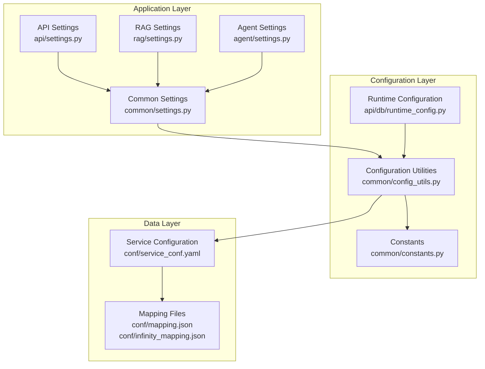
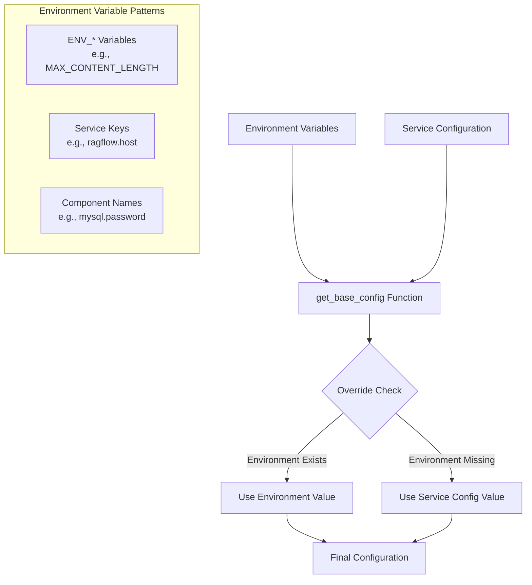
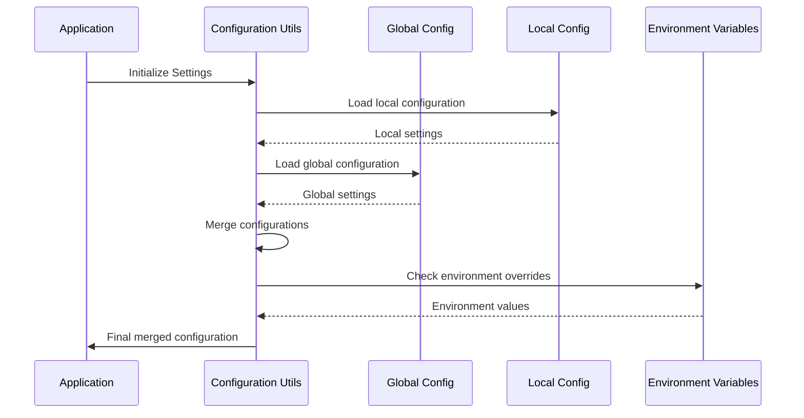
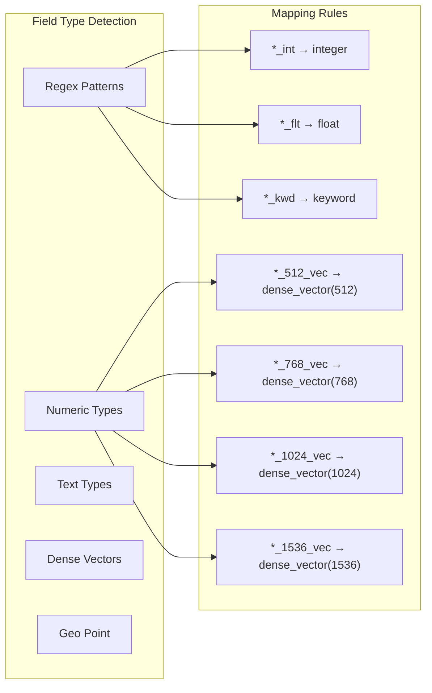
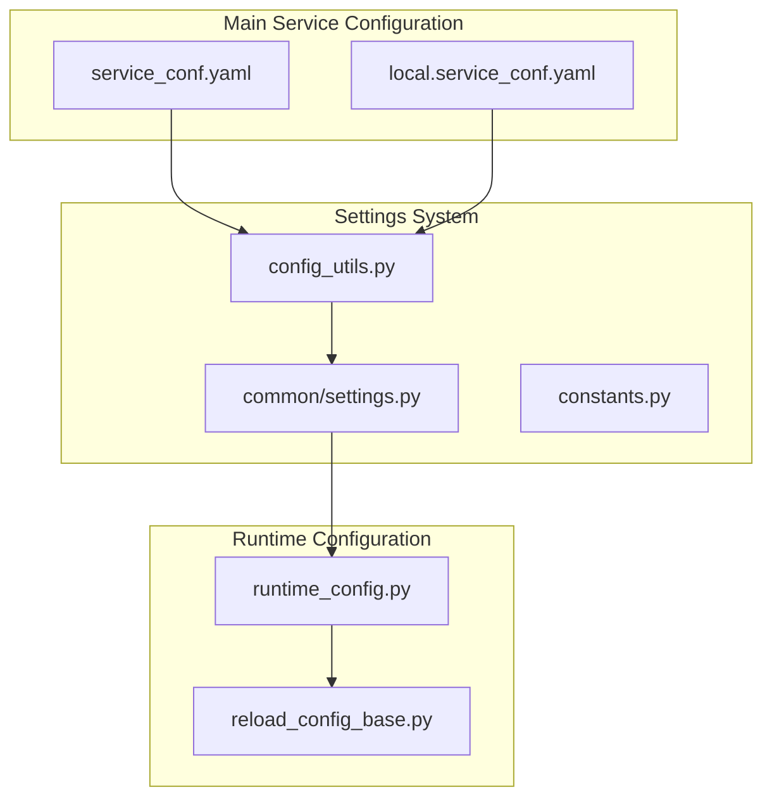

# System Settings

<cite>
**Referenced Files in This Document**
- [common/settings.py](file://common/settings.py)
- [api/settings.py](file://api/settings.py)
- [rag/settings.py](file://rag/settings.py)
- [agent/settings.py](file://agent/settings.py)
- [conf/mapping.json](file://conf/mapping.json)
- [conf/infinity_mapping.json](file://conf/infinity_mapping.json)
- [conf/service_conf.yaml](file://conf/service_conf.yaml)
- [common/config_utils.py](file://common/config_utils.py)
- [common/constants.py](file://common/constants.py)
- [common/log_utils.py](file://common/log_utils.py)
- [api/db/reload_config_base.py](file://api/db/reload_config_base.py)
- [api/db/runtime_config.py](file://api/db/runtime_config.py)
</cite>

## Table of Contents
1. [Introduction](#introduction)
2. [Hierarchical Settings Structure](#hierarchical-settings-structure)
3. [Environment Variable Management](#environment-variable-management)
4. [Configuration Files and Overrides](#configuration-files-and-overrides)
5. [Key System Settings](#key-system-settings)
6. [Data Type Conversions and Schema Mappings](#data-type-conversions-and-schema-mappings)
7. [Practical Configuration Examples](#practical-configuration-examples)
8. [Settings Management Best Practices](#settings-management-best-practices)
9. [Troubleshooting Settings Issues](#troubleshooting-settings-issues)
10. [Integration with Main Service Configuration](#integration-with-main-service-configuration)

## Introduction

RAGFlow employs a sophisticated hierarchical settings system that manages application-level configuration across multiple components. This system provides flexibility for different operational requirements while maintaining consistency and reliability. The settings architecture spans four main directories (`common`, `api`, `rag`, and `agent`) with specialized configuration files and environment variable management.

The system supports various operational scenarios including high-volume document processing, low-latency query responses, and memory-constrained environments. It includes comprehensive logging configuration, error handling policies, file processing limits, and performance tuning parameters.

## Hierarchical Settings Structure

RAGFlow's settings system follows a layered architecture with distinct responsibilities for each component:



**Diagram sources**
- [common/settings.py](file://common/settings.py#L1-L340)
- [api/settings.py](file://api/settings.py#L1-L16)
- [rag/settings.py](file://rag/settings.py#L1-L16)
- [agent/settings.py](file://agent/settings.py#L1-L19)

### Component Responsibilities

**Common Settings Module**: The central hub that initializes and manages global application settings including database connections, LLM configurations, storage implementations, and authentication settings.

**API Settings Module**: Minimal configuration layer that inherits from common settings and provides API-specific initialization points.

**RAG Settings Module**: Specialized settings for Retrieval-Augmented Generation components, extending common settings with RAG-specific parameters.

**Agent Settings Module**: Contains agent-specific constants and configuration values for workflow orchestration.

**Section sources**
- [common/settings.py](file://common/settings.py#L162-L340)
- [api/settings.py](file://api/settings.py#L1-L16)
- [rag/settings.py](file://rag/settings.py#L1-L16)
- [agent/settings.py](file://agent/settings.py#L1-L19)

## Environment Variable Management

RAGFlow implements a robust environment variable management system that provides flexible configuration override capabilities:



**Diagram sources**
- [common/config_utils.py](file://common/config_utils.py#L111-L116)
- [common/constants.py](file://common/constants.py#L152-L196)

### Environment Variable Categories

**System-Level Variables**: Control fundamental system behavior such as logging levels, debug modes, and performance parameters.

**Component-Specific Variables**: Configure individual system components like database connections, storage backends, and LLM providers.

**Feature Flags**: Enable/disable specific features and experimental functionality.

**Security Variables**: Manage authentication credentials, encryption keys, and access controls.

**Section sources**
- [common/constants.py](file://common/constants.py#L152-L196)
- [common/config_utils.py](file://common/config_utils.py#L111-L116)

## Configuration Files and Overrides

RAGFlow uses a two-tier configuration system with global and local configuration files:



**Diagram sources**
- [common/config_utils.py](file://common/config_utils.py#L55-L72)

### Configuration File Structure

**Global Configuration**: Located in `conf/service_conf.yaml` containing default settings for all components.

**Local Configuration**: Located in `conf/local.service_conf.yaml` for environment-specific overrides.

**Mapping Files**: JSON files defining data type conversions and database schema mappings.

**Section sources**
- [conf/service_conf.yaml](file://conf/service_conf.yaml#L1-L151)
- [common/config_utils.py](file://common/config_utils.py#L55-L72)

## Key System Settings

### Logging Configuration

RAGFlow provides comprehensive logging configuration with hierarchical log level management:

| Setting | Description | Default Value | Environment Override |
|---------|-------------|---------------|---------------------|
| `LOG_LEVELS` | Comma-separated package log levels | `""` | `LOG_LEVELS` |
| Log Format | Message format for log entries | `%(asctime)-15s %(levelname)-8s %(process)d %(message)s` | N/A |
| Max File Size | Maximum log file size before rotation | 10MB | N/A |
| Backup Count | Number of rotated log files to keep | 5 | N/A |

### Error Handling Policies

The system implements robust error handling with configurable retry mechanisms:

| Setting | Description | Default Value | Environment Override |
|---------|-------------|---------------|---------------------|
| `LLM_MAX_RETRIES` | Maximum LLM API retry attempts | N/A | `LLM_MAX_RETRIES` |
| `LLM_BASE_DELAY` | Initial delay between retries (seconds) | N/A | `LLM_BASE_DELAY` |
| `LM_TIMEOUT_SECONDS` | LLM operation timeout (seconds) | N/A | `LM_TIMEOUT_SECONDS` |

### File Processing Limits

Critical file processing parameters for system stability:

| Setting | Description | Default Value | Environment Override |
|---------|-------------|---------------|---------------------|
| `MAX_CONTENT_LENGTH` | Maximum file size (bytes) | 128MB | `MAX_CONTENT_LENGTH` |
| `DOC_BULK_SIZE` | Documents processed per batch | 4 | `DOC_BULK_SIZE` |
| `EMBEDDING_BATCH_SIZE` | Embedding batch size | 16 | `EMBEDDING_BATCH_SIZE` |
| `MAX_CONCURRENT_TASKS` | Maximum concurrent processing tasks | N/A | `MAX_CONCURRENT_TASKS` |

### Performance Tuning Parameters

System performance optimization settings:

| Setting | Description | Default Value | Environment Override |
|---------|-------------|---------------|---------------------|
| `MAX_CONCURRENT_CHATS` | Maximum concurrent chat sessions | N/A | `MAX_CONCURRENT_CHATS` |
| `MAX_CONCURRENT_PROCESS_AND_EXTRACT_CHUNK` | Concurrent chunk processing | N/A | `MAX_CONCURRENT_PROCESS_AND_EXTRACT_CHUNK` |
| `MAX_CONCURRENT_MINIO` | Concurrent MinIO operations | N/A | `MAX_CONCURRENT_MINIO` |
| `WORKER_HEARTBEAT_TIMEOUT` | Worker heartbeat timeout (seconds) | N/A | `WORKER_HEARTBEAT_TIMEOUT` |

**Section sources**
- [common/settings.py](file://common/settings.py#L113-L116)
- [common/settings.py](file://common/settings.py#L291-L295)
- [common/log_utils.py](file://common/log_utils.py#L48-L70)

## Data Type Conversions and Schema Mappings

RAGFlow uses specialized mapping files to handle data type conversions and database schema definitions:

### Elasticsearch Mapping Configuration

The `mapping.json` file defines Elasticsearch index mappings with sophisticated field type detection:



**Diagram sources**
- [conf/mapping.json](file://conf/mapping.json#L26-L211)

### Infinity Database Mapping

The `infinity_mapping.json` file provides database schema definitions for the Infinity vector database:

| Field | Type | Default | Analyzer | Description |
|-------|------|---------|----------|-------------|
| `docnm` | varchar | "" | rag-coarse, rag-fine | Document name with weight |
| `content` | varchar | "" | rag-coarse, rag-fine | Content with weight |
| `weight_flt` | float | 0.0 | N/A | Weight factor |
| `pagerank_fea` | integer | 0 | N/A | PageRank feature |
| `entities_kwd` | varchar | "" | whitespace-# | Entity keywords |
| `512_vec` | dense_vector | N/A | cosine | 512-dimensional vectors |

**Section sources**
- [conf/mapping.json](file://conf/mapping.json#L1-L212)
- [conf/infinity_mapping.json](file://conf/infinity_mapping.json#L1-L38)

## Practical Configuration Examples

### High-Volume Document Processing Setup

For systems processing large volumes of documents efficiently:

```yaml
# conf/local.service_conf.yaml
ragflow:
  http_port: 9380
  
mysql:
  max_connections: 1000
  stale_timeout: 600
  
redis:
  db: 1
  password: 'secure_redis_password'

# Environment variables
export MAX_CONTENT_LENGTH=524288000  # 500MB
export DOC_BULK_SIZE=10
export EMBEDDING_BATCH_SIZE=32
export MAX_CONCURRENT_TASKS=50
export MAX_CONCURRENT_PROCESS_AND_EXTRACT_CHUNK=10
```

### Low-Latency Query Response Configuration

Optimized for minimal response times:

```yaml
# conf/local.service_conf.yaml
ragflow:
  http_port: 9380
  
redis:
  db: 1
  password: 'secure_redis_password'

# Environment variables
export MAX_CONCURRENT_CHATS=100
export WORKER_HEARTBEAT_TIMEOUT=30
export LOG_LEVELS="root=INFO,elasticsearch=WARNING"
```

### Memory-Constrained Environment Setup

For systems with limited memory resources:

```yaml
# conf/local.service_conf.yaml
ragflow:
  http_port: 9380

# Environment variables
export MAX_CONTENT_LENGTH=33554432  # 32MB
export DOC_BULK_SIZE=1
export EMBEDDING_BATCH_SIZE=8
export MAX_CONCURRENT_TASKS=5
export MAX_CONCURRENT_PROCESS_AND_EXTRACT_CHUNK=2
export STRONG_TEST_COUNT=4
```

## Settings Management Best Practices

### Configuration Organization

1. **Separation of Concerns**: Keep different types of settings in appropriate files
2. **Environment-Specific Overrides**: Use local configuration files for environment-specific settings
3. **Default Values**: Always provide sensible defaults in configuration files
4. **Documentation**: Document all configuration parameters with their effects

### Security Considerations

1. **Credential Management**: Store sensitive information in environment variables
2. **Encryption**: Use encrypted configuration for production deployments
3. **Access Control**: Restrict access to configuration files
4. **Secret Rotation**: Implement regular secret rotation procedures

### Performance Optimization

1. **Resource Limits**: Set appropriate limits for concurrent operations
2. **Batch Processing**: Optimize batch sizes for your hardware capabilities
3. **Caching**: Configure caching appropriately for your workload
4. **Monitoring**: Monitor system performance and adjust settings accordingly

**Section sources**
- [common/config_utils.py](file://common/config_utils.py#L78-L108)
- [common/settings.py](file://common/settings.py#L130-L145)

## Troubleshooting Settings Issues

### Common Configuration Problems

**Missing Configuration Files**: Ensure all required configuration files exist and are readable

**Environment Variable Conflicts**: Check for conflicting environment variable names

**Permission Issues**: Verify file permissions for configuration files and log directories

**Memory Limitations**: Monitor memory usage and adjust batch sizes accordingly

### Diagnostic Tools

**Configuration Validation**: Use the `show_configs()` function to display current settings

**Log Analysis**: Examine logs for configuration-related errors and warnings

**Environment Inspection**: Verify environment variable values using shell commands

### Resolution Strategies

1. **Incremental Changes**: Make small configuration changes and test thoroughly
2. **Backup Configuration**: Always backup configuration before making changes
3. **Testing**: Test changes in development environments first
4. **Monitoring**: Monitor system behavior after configuration changes

**Section sources**
- [common/config_utils.py](file://common/config_utils.py#L78-L108)
- [common/log_utils.py](file://common/log_utils.py#L34-L84)

## Integration with Main Service Configuration

RAGFlow's settings system integrates seamlessly with the main service configuration through several mechanisms:



**Diagram sources**
- [conf/service_conf.yaml](file://conf/service_conf.yaml#L1-L151)
- [common/config_utils.py](file://common/config_utils.py#L55-L72)
- [api/db/runtime_config.py](file://api/db/runtime_config.py#L20-L54)

### Configuration Loading Process

1. **Initialization**: Settings are loaded during application startup
2. **Validation**: Configuration values are validated for correctness
3. **Integration**: Settings are integrated with runtime configuration
4. **Monitoring**: Configuration changes are monitored for updates

### Runtime Configuration Updates

The system supports dynamic configuration updates through the runtime configuration system, allowing settings to be modified without restarting the application.

**Section sources**
- [api/db/runtime_config.py](file://api/db/runtime_config.py#L20-L54)
- [api/db/reload_config_base.py](file://api/db/reload_config_base.py#L16-L29)