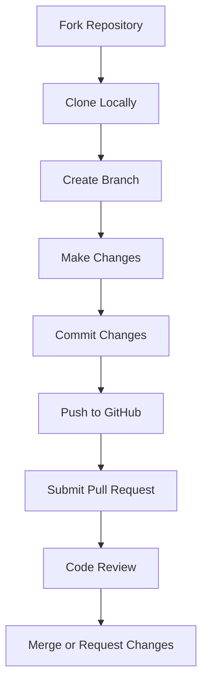

# Contribution Guidelines

<cite>
**Referenced Files in This Document**   
- [README.md](file://README.md)
- [docs/contribution/contributing.md](file://docs/contribution/contributing.md)
- [.github/PULL_REQUEST_TEMPLATE.md](file://.github/PULL_REQUEST_TEMPLATE.md)
- [pyproject.toml](file://pyproject.toml)
- [docker/.env](file://docker/.env)
- [docker/service_conf.yaml.template](file://docker/service_conf.yaml.template)
- [SECURITY.md](file://SECURITY.md)
</cite>

## Table of Contents
1. [Introduction](#introduction)
2. [Ways to Contribute](#ways-to-contribute)
3. [Contribution Workflow](#contribution-workflow)
4. [Code Standards and Requirements](#code-standards-and-requirements)
5. [Testing Requirements](#testing-requirements)
6. [Documentation Conventions](#documentation-conventions)
7. [Pull Request Examples](#pull-request-examples)
8. [Issue Reporting Guidelines](#issue-reporting-guidelines)
9. [Project Governance](#project-governance)
10. [Community Engagement](#community-engagement)
11. [Release Process](#release-process)

## Introduction

RAGFlow is an open-source Retrieval-Augmented Generation (RAG) engine that combines deep document understanding with Agent capabilities to create a superior context layer for Large Language Models (LLMs). The project welcomes contributions from the community to enhance its functionality, improve documentation, fix bugs, and suggest new features. This document outlines the comprehensive contribution guidelines for developers, documentation writers, and other community members who wish to participate in the development of RAGFlow.

The RAGFlow project follows a structured contribution process that ensures code quality, maintainability, and alignment with the project's goals. Contributors are encouraged to review these guidelines before submitting any changes to the codebase or documentation.

**Section sources**
- [README.md](file://README.md#L397-L401)

## Ways to Contribute

Community members can contribute to RAGFlow in several meaningful ways:

### Code Contributions
Developers can contribute by implementing new features, fixing bugs, optimizing performance, or enhancing existing functionality. The codebase is primarily written in Python with a React-based frontend. Key areas for code contributions include:
- Agent components and workflows
- Document parsing and processing
- RAG pipeline improvements
- Integration with external services and data sources
- Security enhancements

### Documentation Improvements
Clear and comprehensive documentation is essential for both users and developers. Contributors can help by:
- Updating existing documentation
- Creating new guides and tutorials
- Improving code comments and annotations
- Translating documentation into different languages
- Enhancing API reference materials

### Bug Reporting
Identifying and reporting bugs is a valuable contribution. When reporting bugs, please provide detailed information about the issue, including:
- Steps to reproduce the problem
- Expected behavior vs. actual behavior
- Environment details (OS, Python version, dependencies)
- Relevant error messages or logs

### Feature Suggestions
The community is encouraged to suggest new features that could enhance RAGFlow's capabilities. Suggestions should include:
- A clear description of the proposed feature
- Use cases and benefits
- Potential implementation approaches
- Any relevant references or examples

**Section sources**
- [docs/contribution/contributing.md](file://docs/contribution/contributing.md#L17-L27)

## Contribution Workflow

The contribution workflow for RAGFlow follows a standardized process to ensure smooth integration of community contributions.

### General Workflow
The standard contribution workflow consists of the following steps:

1. **Fork the Repository**: Create a fork of the main RAGFlow repository on GitHub.
2. **Clone Locally**: Clone your fork to your local development environment.
3. **Create a Branch**: Create a new branch for your changes with a descriptive name.
4. **Make Changes**: Implement your changes following the coding standards.
5. **Commit Changes**: Commit your changes with clear and descriptive commit messages.
6. **Push to GitHub**: Push your changes to your forked repository.
7. **Submit Pull Request**: Create a pull request against the main repository.

**Diagram sources**
- [.github/PULL_REQUEST_TEMPLATE.md](file://.github/PULL_REQUEST_TEMPLATE.md#L1-L13)

**Section sources**
- [docs/contribution/contributing.md](file://docs/contribution/contributing.md#L30-L41)

### Before Filing a Pull Request
Before submitting a pull request, consider the following guidelines:

- **Split Large PRs**: Break down large changes into smaller, focused pull requests to maintain a clear development history.
- **Single Issue Focus**: Ensure each pull request addresses one specific issue or feature.
- **Include Tests**: Add test cases when contributing new features to verify functionality and prevent regressions.
- **Update Documentation**: Update relevant documentation to reflect your changes.

**Section sources**
- [docs/contribution/contributing.md](file://docs/contribution/contributing.md#L43-L47)

### Describing Your Pull Request
When creating a pull request, provide comprehensive information to help reviewers understand your changes:

- **Concise Title**: Use a clear and descriptive title that summarizes the changes.
- **Reference Issues**: Link to relevant GitHub issues when applicable.
- **Design Details**: Include detailed design information for breaking changes or API modifications.
- **Testing Information**: Describe how the changes were tested and any special testing requirements.

**Section sources**
- [docs/contribution/contributing.md](file://docs/contribution/contributing.md#L49-L53)

## Code Standards and Requirements

RAGFlow maintains consistent code quality through established coding standards and requirements.

### Python Code Standards
The project follows Python best practices and conventions:

- **Python Version**: The codebase requires Python 3.10 to 3.12, as specified in the pyproject.toml file.
- **Dependency Management**: Dependencies are managed through pyproject.toml with specific version constraints.
- **Code Formatting**: The project uses Ruff for linting with a line length limit of 200 characters.
- **Type Hints**: Where appropriate, type hints should be used to improve code clarity and maintainability.

### Frontend Code Standards
The frontend is built with React and follows modern web development practices:

- **Component Structure**: Components are organized in the web/src/components directory with clear separation of concerns.
- **State Management**: The application uses appropriate state management patterns for complex UI interactions.
- **Accessibility**: UI components should follow accessibility best practices to ensure usability for all users.

### Security Requirements
Security is a critical aspect of the codebase:

- **Input Validation**: All user inputs should be properly validated and sanitized.
- **Authentication**: Follow established patterns for authentication and authorization.
- **Data Protection**: Sensitive data should be handled securely, with appropriate encryption when necessary.

**Section sources**
- [pyproject.toml](file://pyproject.toml#L8-L158)
- [tool.ruff] section in pyproject.toml

## Testing Requirements

Comprehensive testing is essential to maintain the quality and reliability of RAGFlow.

### Test Structure
The testing framework is organized as follows:

- **Unit Tests**: Located in the test/unit_test directory, focusing on individual functions and classes.
- **Integration Tests**: Located in the test/testcases directory, testing interactions between components.
- **API Tests**: Located in test/testcases/test_http_api, verifying the correctness of API endpoints.
- **SDK Tests**: Located in sdk/python/test, ensuring the Python SDK functions correctly.

### Test Dependencies
Testing dependencies are specified in the pyproject.toml file under the [dependency-groups.test] section:

- **pytest**: The primary testing framework
- **hypothesis**: For property-based testing
- **requests**: For API testing
- **pillow**: For image processing tests
- **python-docx** and **python-pptx**: For document processing tests

### Running Tests
To run tests locally, contributors should:

1. Install test dependencies: `uv sync --group test`
2. Run pytest: `pytest`
3. Check test coverage and ensure all tests pass

**Section sources**
- [pyproject.toml](file://pyproject.toml#L161-L171)
- [test/](file://test/)

## Documentation Conventions

Consistent documentation practices help maintain clarity and usability across the project.

### Documentation Structure
The documentation is organized in the docs directory with the following structure:

- **contribution**: Contribution guidelines and processes
- **develop**: Developer guides and setup instructions
- **guides**: User guides for various features
- **references**: API references and technical specifications

### Documentation Standards
When contributing to documentation:

- **Markdown Format**: Use Markdown for all documentation files.
- **Clear Headings**: Use appropriate heading levels to structure content.
- **Code Examples**: Include relevant code examples with proper syntax highlighting.
- **Cross-References**: Use relative links to connect related documentation pages.
- **Language**: Write in clear, concise English with proper grammar and spelling.

### API Documentation
API endpoints should be documented with:

- **Endpoint URL**: The complete URL path
- **HTTP Method**: GET, POST, PUT, DELETE, etc.
- **Request Parameters**: Query parameters, path parameters, and request body structure
- **Response Format**: Expected response structure and status codes
- **Authentication Requirements**: Any required authentication or authorization

**Section sources**
- [docs/](file://docs/)

## Pull Request Examples

This section provides examples of well-structured pull requests.

### Bug Fix Example
**Title**: Fix memory leak in document processing pipeline

**Description**:
This PR addresses a memory leak in the document processing pipeline that was causing increased memory usage over time.

**Changes**:
- Added proper cleanup of temporary files in the document processor
- Fixed resource handling in the PDF parser
- Updated unit tests to verify memory usage

**Related Issue**: #1234

**Testing**:
- Ran unit tests: `pytest test/document_test.py`
- Verified memory usage with stress test script

### Feature Implementation Example
**Title**: Add support for Confluence data source integration

**Description**:
This PR implements integration with Confluence as a data source for RAGFlow.

**Changes**:
- Added Confluence connector in common/data_source directory
- Implemented authentication and API calls for Confluence
- Added configuration options in service_conf.yaml
- Created documentation in docs/guides/dataset/add_data_source

**Design Details**:
The Confluence integration uses OAuth 2.0 for authentication and the Confluence REST API for data retrieval. Documents are processed through the existing document pipeline.

**Testing**:
- Added unit tests for the Confluence connector
- Tested with multiple Confluence instances
- Verified document processing and indexing

**Section sources**
- [.github/PULL_REQUEST_TEMPLATE.md](file://.github/PULL_REQUEST_TEMPLATE.md#L1-L13)

## Issue Reporting Guidelines

Effective issue reporting helps the development team address problems efficiently.

### Bug Reports
When reporting a bug, include the following information:

- **Environment**: OS, Python version, RAGFlow version
- **Steps to Reproduce**: Clear, step-by-step instructions
- **Expected Behavior**: What you expected to happen
- **Actual Behavior**: What actually happened
- **Error Messages**: Any relevant error messages or stack traces
- **Logs**: Relevant log entries with appropriate context

### Feature Requests
When suggesting a new feature, provide:

- **Feature Description**: Clear explanation of the proposed feature
- **Use Cases**: Specific scenarios where the feature would be beneficial
- **Benefits**: How the feature would improve RAGFlow
- **Implementation Ideas**: Any thoughts on how the feature could be implemented
- **Alternatives**: Other approaches that were considered

**Section sources**
- [docs/contribution/contributing.md](file://docs/contribution/contributing.md#L14-L15)
- [SECURITY.md](file://SECURITY.md)

## Project Governance

RAGFlow follows a transparent governance model to ensure the project's long-term success.

### Decision-Making Process
The project maintains a balance between community input and maintainers' oversight:

- **Community Input**: Feature suggestions and bug reports are welcomed from the community.
- **Maintainer Review**: All contributions are reviewed by project maintainers.
- **Technical Direction**: Core architectural decisions are made by the maintainers in consultation with active contributors.
- **Roadmap**: The project roadmap is publicly available and updated regularly.

### Maintainer Responsibilities
Project maintainers have several key responsibilities:

- **Code Review**: Reviewing pull requests for quality, security, and alignment with project goals.
- **Issue Triage**: Prioritizing and assigning issues based on impact and feasibility.
- **Release Management**: Coordinating releases and ensuring stability.
- **Community Engagement**: Responding to questions and fostering a positive community environment.
- **Documentation Oversight**: Ensuring documentation remains accurate and comprehensive.

**Section sources**
- [README.md](file://README.md#L391-L395)

## Community Engagement

Active community engagement is essential for the growth and success of RAGFlow.

### Communication Channels
The RAGFlow community uses several channels for communication:

- **GitHub Discussions**: For general questions, ideas, and community discussions.
- **Discord**: For real-time chat and collaboration.
- **Twitter**: For announcements and updates.
- **GitHub Issues**: For bug reports and feature requests.

### Code of Conduct
All community members are expected to follow a code of conduct that promotes:

- **Respect**: Treat others with respect and professionalism.
- **Inclusivity**: Welcome contributions from diverse backgrounds.
- **Constructive Feedback**: Provide feedback that is helpful and constructive.
- **Collaboration**: Work together to solve problems and improve the project.

### Community Events
The project may organize various community events:

- **Hackathons**: Events focused on rapid development and innovation.
- **Office Hours**: Regular sessions for Q&A with maintainers.
- **Contributor Spotlights**: Highlighting the work of community members.
- **Webinars**: Educational sessions on RAGFlow features and best practices.

**Section sources**
- [README.md](file://README.md#L391-L395)

## Release Process

The release process ensures that new versions of RAGFlow are stable and well-documented.

### Release Cycle
RAGFlow follows a regular release cycle with:

- **Stable Releases**: Periodic releases with tested and verified features.
- **Nightly Builds**: Development versions for testing new features.
- **Patch Releases**: Bug fixes and security updates for existing versions.

### Release Criteria
A release is prepared when:

- All critical bugs are fixed
- New features are thoroughly tested
- Documentation is updated
- Performance benchmarks meet requirements
- Security reviews are completed

### Release Artifacts
Each release includes:

- **Docker Images**: Pre-built images for easy deployment
- **Source Code**: Complete source code with version tags
- **Documentation**: Updated documentation reflecting new features
- **Release Notes**: Detailed notes on changes, improvements, and known issues

### Incorporating Contributions
Community contributions are incorporated into releases through:

- **Regular Integration**: Pull requests are reviewed and merged on an ongoing basis.
- **Version Planning**: Features are assigned to specific release versions.
- **Testing**: All changes undergo thorough testing before release.
- **Documentation**: Each contribution is documented in the release notes.

**Section sources**
- [README.md](file://README.md#L27-L28)
- [docker/.env](file://docker/.env#L131-L139)