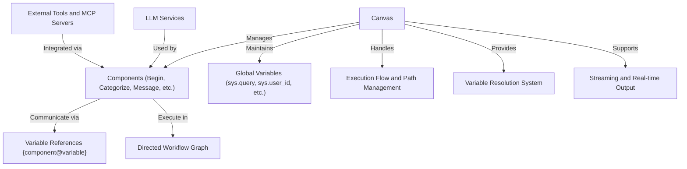
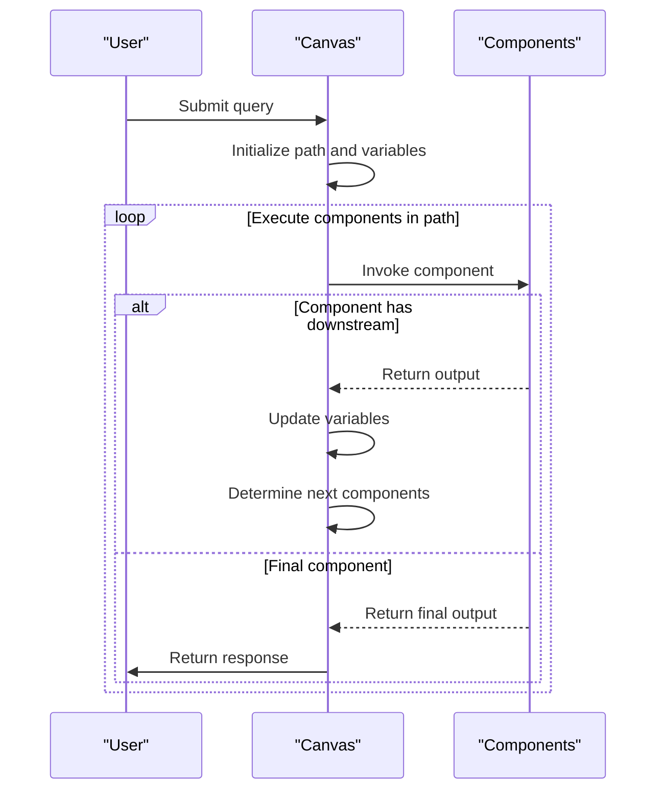
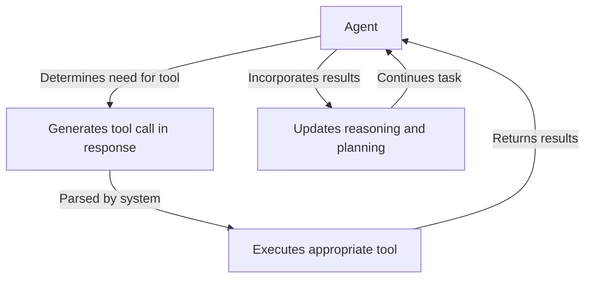

# Agent System

<cite>
**Referenced Files in This Document**   
- [canvas.py](file://agent/canvas.py)
- [base.py](file://agent/component/base.py)
- [begin.py](file://agent/component/begin.py)
- [categorize.py](file://agent/component/categorize.py)
- [iteration.py](file://agent/component/iteration.py)
- [loop.py](file://agent/component/loop.py)
- [message.py](file://agent/component/message.py)
- [switch.py](file://agent/component/switch.py)
- [variable_assigner.py](file://agent/component/variable_assigner.py)
- [agent_with_tools.py](file://agent/component/agent_with_tools.py)
- [customer_service.json](file://agent/templates/customer_service.json)
- [deep_research.json](file://agent/templates/deep_research.json)
- [settings.py](file://agent/settings.py)
</cite>

## Table of Contents
1. [Introduction](#introduction)
2. [Agent System Architecture](#agent-system-architecture)
3. [Core Agent Components](#core-agent-components)
4. [Workflow Orchestration](#workflow-orchestration)
5. [Tools Integration](#tools-integration)
6. [MCP Integration](#mcp-integration)
7. [Configuration and Parameters](#configuration-and-parameters)
8. [Execution Flow and Return Values](#execution-flow-and-return-values)
9. [Common Issues and Solutions](#common-issues-and-solutions)
10. [Conclusion](#conclusion)

## Introduction
The RAGFlow agent system is a sophisticated framework for creating intelligent, multi-step workflows that leverage large language models (LLMs), external tools, and structured reasoning. This system enables the creation of complex agent workflows that can handle diverse tasks through a visual canvas interface. The architecture supports various agent components that work together to process user queries, make decisions, iterate through data, and produce comprehensive responses. The system is designed to be accessible to beginners while providing deep technical capabilities for experienced developers. This documentation provides a comprehensive overview of the agent system, covering its architecture, core components, workflow orchestration, tools integration, MCP (Model Context Protocol) integration, configuration options, execution flow, and common troubleshooting scenarios.

## Agent System Architecture
The RAGFlow agent system is built around a canvas-based architecture that orchestrates the execution of various agent components in a directed graph. The core of this system is the Canvas class, which manages the workflow execution, state management, and component coordination. The canvas loads a DSL (Domain Specific Language) configuration that defines the components, their connections, and execution path. Each component in the workflow is an instance of a specific agent component class that inherits from the base ComponentBase class. The system uses a token-based cancellation mechanism through Redis to allow for graceful termination of long-running workflows. The architecture supports both synchronous and asynchronous execution patterns, with streaming capabilities for real-time response generation. The canvas maintains global variables (prefixed with "sys.") and component-specific variables that can be referenced across the workflow using a variable reference syntax (e.g., `{component_id@variable_name}`).



**Diagram sources**
- [canvas.py](file://agent/canvas.py#L40-L793)
- [base.py](file://agent/component/base.py#L393-L583)

## Core Agent Components
The RAGFlow agent system provides several specialized components that enable complex workflow creation. These components work together to process user input, make decisions, iterate through data, and generate responses.

### Begin Component
The Begin component serves as the entry point for agent workflows. It initializes the conversation and can present a prologue message to the user. The component supports two modes: "conversational" for ongoing dialogues and "task" for single-purpose operations. It handles user input collection and passes it to subsequent components in the workflow.

**Section sources**
- [begin.py](file://agent/component/begin.py#L1-L60)

### Categorize Component
The Categorize component uses an LLM to classify user queries into predefined categories. It takes a user query and matches it against a set of category descriptions and examples, then routes the workflow to the appropriate downstream component based on the classification result. This component is essential for creating multi-path workflows that handle different types of user requests appropriately.

**Section sources**
- [categorize.py](file://agent/component/categorize.py#L1-L149)

### Iteration Component
The Iteration component enables processing of array data by creating a loop that executes a set of components for each item in the array. It works in conjunction with the IterationItem component to process individual items. This component is useful for scenarios where the same operations need to be performed on multiple data points, such as processing multiple documents or analyzing several data entries.

**Section sources**
- [iteration.py](file://agent/component/iteration.py#L1-L72)

### Loop Component
The Loop component provides a more flexible looping mechanism that can execute a block of components repeatedly based on specified conditions. It supports loop variables, termination conditions, and maximum iteration counts. This component is ideal for scenarios requiring iterative refinement or repeated processing until a specific condition is met.

**Section sources**
- [loop.py](file://agent/component/loop.py#L1-L80)

### Message Component
The Message component generates responses to users by formatting content from variables and static text. It supports multiple content options (random selection), streaming output, and content conversion to various formats (Markdown, HTML, PDF, DOCX). The component can reference variables from other components using the variable reference syntax and supports Jinja2 templating for advanced content formatting.

**Section sources**
- [message.py](file://agent/component/message.py#L1-L267)

### Switch Component
The Switch component enables conditional routing in workflows based on variable values and logical conditions. It evaluates a set of conditions with operators (contains, start with, =, >, etc.) and routes the workflow to different paths based on the evaluation results. This component provides fine-grained control over workflow execution and enables complex decision-making processes.

**Section sources**
- [switch.py](file://agent/component/switch.py#L1-L141)

### Variable Assigner Component
The Variable Assigner component allows for dynamic manipulation of variables during workflow execution. It supports various operations including overwriting, appending, extending, mathematical operations (+, -, *, /), and list operations (remove first, remove last). This component is essential for maintaining and modifying state throughout complex workflows.

**Section sources**
- [variable_assigner.py](file://agent/component/variable_assigner.py#L1-L192)

## Workflow Orchestration
The RAGFlow agent system orchestrates complex workflows through a directed graph of connected components. The execution flow is determined by the path array in the canvas DSL, which specifies the order of component execution. The system supports various workflow patterns including linear sequences, branching paths, loops, and parallel execution.

### Execution Flow Management
The canvas manages the execution flow by maintaining a path array that tracks the current execution sequence. Components can modify this path dynamically based on their output, enabling conditional routing and loop control. For example, the Categorize component sets the `_next` output to specify which components should execute next, while loop components manage iteration by returning to their start component.

### State Management
The system maintains state through global variables (accessible to all components) and component-specific outputs. Variables are referenced using the syntax `{component_id@variable_name}` or `{sys.variable_name}` for system variables. The canvas provides methods for getting and setting variable values, enabling data flow between components.

### Error Handling and Recovery
The agent system includes comprehensive error handling mechanisms. Components can define exception handling strategies including default values, alternative execution paths (goto), and error comments. The canvas detects task cancellation through Redis and propagates this information to all components, allowing for graceful termination of long-running processes.



**Diagram sources**
- [canvas.py](file://agent/canvas.py#L363-L631)
- [base.py](file://agent/component/base.py#L434-L447)

## Tools Integration
The RAGFlow agent system supports integration with external tools through the Agent component, which can invoke various tools as part of its reasoning process. Tools are defined in the agent configuration and can include web search, code execution, database queries, and other specialized functions.

### Tool Configuration
Tools are configured within the Agent component's parameters as an array of tool definitions. Each tool specifies its component name, ID, name, and parameters. For example, a Tavily search tool can be configured with parameters for API key, search depth, and result limits.

### Tool Execution Process
When an agent determines that a tool is needed to complete its task, it generates a function call in its response. The system parses this function call, executes the corresponding tool, and provides the results back to the agent. This process enables the agent to gather additional information, perform calculations, or interact with external systems as needed to complete its task.

### Example Tool Integration
In the Deep Research template, the agent integrates with three specialized tools:
1. Web Search Specialist: Uses TavilySearch to discover high-quality sources
2. Content Deep Reader: Uses TavilyExtract to retrieve full content from URLs
3. Research Synthesizer: Processes extracted content into comprehensive reports

These tools work together in a coordinated pipeline to conduct thorough research and generate detailed reports.



**Diagram sources**
- [agent_with_tools.py](file://agent/component/agent_with_tools.py#L1-L437)
- [deep_research.json](file://agent/templates/deep_research.json#L1-L854)

## MCP Integration
The Model Context Protocol (MCP) integration allows RAGFlow agents to connect with external MCP servers, expanding their capabilities beyond locally available tools. MCP servers expose specialized functions that agents can invoke as part of their reasoning process.

### MCP Configuration
MCP integration is configured in the agent parameters with an array of MCP server references. Each MCP entry includes the server ID and a list of tools to use from that server. The system establishes connections to these MCP servers and makes their tools available to the agent.

### MCP Tool Invocation
When an agent needs to use an MCP tool, the process is similar to local tool invocation. The agent generates a function call in its response, which the system routes to the appropriate MCP server. The MCP server executes the tool and returns the results, which are then provided back to the agent for incorporation into its reasoning process.

### Benefits of MCP Integration
MCP integration provides several advantages:
- Access to specialized external services and data sources
- Ability to leverage domain-specific expertise from external systems
- Scalability by distributing tool execution across multiple servers
- Enhanced security through controlled access to external systems

**Section sources**
- [agent_with_tools.py](file://agent/component/agent_with_tools.py#L99-L104)
- [deep_research.json](file://agent/templates/deep_research.json#L1-L854)

## Configuration and Parameters
The RAGFlow agent system provides extensive configuration options for customizing agent behavior, component parameters, and workflow execution.

### Agent Configuration Parameters
Agent components support various parameters that control their behavior:

- **llm_id**: Specifies the LLM to use for the agent
- **max_rounds**: Maximum number of reasoning steps
- **max_retries**: Number of retry attempts for failed operations
- **delay_after_error**: Delay between retry attempts
- **temperature**: Controls randomness of LLM responses
- **tools**: Array of tools available to the agent
- **mcp**: Array of MCP servers to connect to
- **message_history_window_size**: Number of previous messages to include in context

### Component-Specific Parameters
Each component type has its own set of parameters:

**Message Component Parameters:**
- **content**: Array of possible response texts (random selection)
- **stream**: Whether to stream output incrementally
- **output_format**: Format to convert content to (PDF, DOCX, etc.)
- **auto_play**: Whether to generate audio for text responses

**Categorize Component Parameters:**
- **category_description**: Object defining categories with descriptions, examples, and target components
- **query**: Variable reference containing the text to categorize
- **message_history_window_size**: Number of previous messages to consider

**Variable Assigner Parameters:**
- **variables**: Array of variable operations with operator, parameter, and target variable
- **operator**: Operation to perform (+, -, append, extend, etc.)
- **parameter**: Value or variable reference for the operation
- **variable**: Target variable to modify

### Global Configuration
The system also supports global configuration through environment variables and settings files:

- **COMPONENT_EXEC_TIMEOUT**: Maximum execution time for components
- **MAX_CONCURRENT_CHATS**: Maximum number of concurrent chat sessions
- **FLOAT_ZERO**: Small value used for floating-point comparisons
- **PARAM_MAXDEPTH**: Maximum nesting depth for parameter parsing

**Section sources**
- [agent_with_tools.py](file://agent/component/agent_with_tools.py#L77-L79)
- [message.py](file://agent/component/message.py#L39-L49)
- [categorize.py](file://agent/component/categorize.py#L34-L37)
- [variable_assigner.py](file://agent/component/variable_assigner.py#L28)
- [settings.py](file://agent/settings.py#L17-L18)

## Execution Flow and Return Values
The RAGFlow agent system follows a structured execution flow that processes user input through a series of components to generate a response. Understanding this flow and the return values from components is essential for creating effective agent workflows.

### Execution Flow
1. **Initialization**: The canvas loads the DSL configuration and initializes all components
2. **Path Setup**: The execution path is established, typically starting with the Begin component
3. **Component Invocation**: Components are executed in sequence according to the path
4. **Variable Resolution**: Input variables are resolved from other components or global variables
5. **Processing**: Each component performs its specific function (categorization, message generation, etc.)
6. **Output Generation**: Components produce outputs that may include content, routing information, or modified variables
7. **Path Update**: The execution path is updated based on component outputs (conditional routing, loops, etc.)
8. **Completion**: The workflow ends when the path is exhausted, and the final output is returned

### Return Values
Components return structured outputs that include both data and control information:

**Standard Output Structure:**
```json
{
  "content": "Response text",
  "_ERROR": "Error message if applicable",
  "_created_time": "Timestamp of component execution",
  "_elapsed_time": "Execution duration",
  "_next": ["component_id"] // For routing components
}
```

**Component-Specific Outputs:**
- **Begin**: User input values and conversation state
- **Categorize**: `category_name` and `_next` (target components)
- **Message**: `content` (response text) and optionally `attachment` (binary content)
- **Switch**: `next` (selected path) and `_next` (component IDs)
- **VariableAssigner**: Updated variable values
- **Agent**: `content` (LLM response), `use_tools` (tool usage log), or `structured` (parsed JSON output)

### Event Streaming
The system supports event streaming, emitting events at various stages of execution:
- **workflow_started**: When workflow execution begins
- **node_started**: When a component starts processing
- **message**: When partial content is available (for streaming)
- **node_finished**: When a component completes processing
- **workflow_finished**: When the entire workflow completes

**Section sources**
- [canvas.py](file://agent/canvas.py#L408-L631)
- [base.py](file://agent/component/base.py#L452-L455)

## Common Issues and Solutions
The RAGFlow agent system may encounter various issues during operation. Understanding these common problems and their solutions can help ensure reliable workflow execution.

### Agent Execution Failures
**Issue**: Agent workflows fail to complete or produce incorrect results.
**Solutions**:
- Check for proper tool configuration and API keys
- Verify that component connections in the workflow are correctly configured
- Ensure that variable references use the correct syntax (`{component_id@variable}`)
- Increase `max_rounds` parameter for complex tasks requiring more reasoning steps
- Review LLM responses for tool call formatting errors

### Variable Resolution Problems
**Issue**: Variables are not resolved correctly or produce unexpected values.
**Solutions**:
- Verify that component IDs in variable references match actual component IDs
- Check that components producing the referenced variables are executed before they are used
- Use the canvas debugging tools to inspect variable values at different execution points
- Ensure that variable names do not contain special characters that might interfere with parsing

### Tool Integration Issues
**Issue**: External tools fail to execute or return errors.
**Solutions**:
- Verify API keys and authentication credentials for external services
- Check network connectivity to external services
- Review tool parameter configuration for correctness
- Examine error messages from tool execution for specific failure details
- Implement appropriate error handling and fallback strategies in the workflow

### Performance Problems
**Issue**: Workflows execute slowly or time out.
**Solutions**:
- Optimize LLM prompts to reduce response length and complexity
- Use appropriate `message_history_window_size` to limit context length
- Implement streaming responses for long-running operations
- Consider breaking complex workflows into smaller, more focused agents
- Monitor and optimize tool execution times

### MCP Connection Failures
**Issue**: MCP servers cannot be reached or tools are not available.
**Solutions**:
- Verify MCP server URLs and network accessibility
- Check authentication credentials for MCP servers
- Ensure that the requested tools are available on the MCP server
- Implement retry logic with appropriate delays
- Provide fallback options when MCP services are unavailable

**Section sources**
- [canvas.py](file://agent/canvas.py#L403-L407)
- [agent_with_tools.py](file://agent/component/agent_with_tools.py#L207-L213)
- [base.py](file://agent/component/base.py#L434-L432)

## Conclusion
The RAGFlow agent system provides a powerful framework for creating intelligent, multi-step workflows that leverage large language models, external tools, and structured reasoning. Through its canvas-based architecture, the system enables the creation of complex agent workflows that can handle diverse tasks through a visual interface. The core components—Begin, Categorize, Iteration, Loop, Message, Switch, and Variable Assigner—work together to process user input, make decisions, iterate through data, and generate responses. The integration with external tools and MCP servers extends the capabilities of agents beyond what's possible with LLMs alone. The system's comprehensive configuration options, execution flow management, and error handling mechanisms make it suitable for both simple and complex applications. By understanding the architecture, components, and best practices outlined in this documentation, developers can create sophisticated agent systems that deliver value to users while maintaining reliability and performance.