# Agent with Tools

<cite>
**Referenced Files in This Document**
- [agent_with_tools.py](file://agent/component/agent_with_tools.py)
- [base.py](file://agent/tools/base.py)
- [code_exec.py](file://agent/tools/code_exec.py)
- [tavily.py](file://agent/tools/tavily.py)
- [github.py](file://agent/tools/github.py)
- [exesql.py](file://agent/tools/exesql.py)
- [email.py](file://agent/tools/email.py)
- [crawler.py](file://agent/tools/crawler.py)
- [google.py](file://agent/tools/google.py)
- [searxng.py](file://agent/tools/searxng.py)
- [variable_assigner.py](file://agent/component/variable_assigner.py)
- [varaiable_aggregator.py](file://agent/component/varaiable_aggregator.py)
- [mcp_tool_call_conn.py](file://common/mcp_tool_call_conn.py)
- [tavily_and_generate.json](file://agent/test/dsl_examples/tavily_and_generate.json)
- [exesql.json](file://agent/test/dsl_examples/exesql.json)
</cite>

## Table of Contents
1. [Introduction](#introduction)
2. [Architecture Overview](#architecture-overview)
3. [Tool System Foundation](#tool-system-foundation)
4. [Agent with Tools Implementation](#agent-with-tools-implementation)
5. [Tool Registration and Management](#tool-registration-and-management)
6. [Variable Assignment and Aggregation](#variable-assignment-and-aggregation)
7. [External Tool Integrations](#external-tool-integrations)
8. [MCP (Model Context Protocol) Integration](#mcp-model-context-protocol-integration)
9. [Error Handling and Security](#error-handling-and-security)
10. [Configuration and Best Practices](#configuration-and-best-practices)
11. [Common Issues and Troubleshooting](#common-issues-and-troubleshooting)
12. [Conclusion](#conclusion)

## Introduction

RAGFlow's agent with tools system provides a sophisticated framework for integrating external tools and services into AI agent workflows. This system enables agents to perform complex tasks by leveraging specialized tools for code execution, web search, database queries, email operations, and more. The architecture supports both traditional tool plugins and Model Context Protocol (MCP) servers, offering flexibility in tool integration and extensibility.

The agent with tools system operates on a reactive architecture where agents dynamically decide when and how to use available tools based on the current context and task requirements. This approach enables powerful automation scenarios while maintaining security and reliability through comprehensive error handling and rate limiting mechanisms.

## Architecture Overview

The agent with tools system follows a modular architecture that separates concerns between agent orchestration, tool management, and execution. The system consists of several key components working together to provide seamless tool integration.

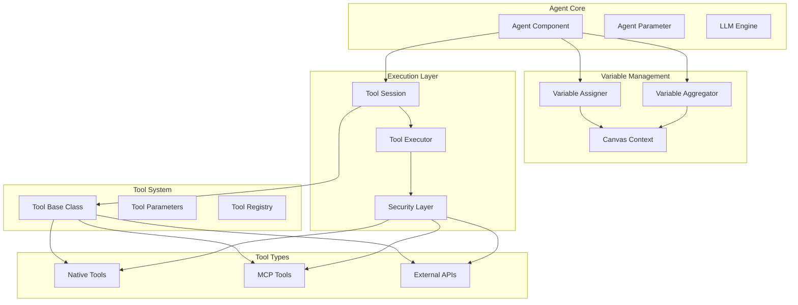
```mermaid
graph TB
subgraph "Agent Core"
Agent[Agent Component]
AgentParam[Agent Parameter]
LLM[LLM Engine]
end
subgraph "Tool System"
ToolBase[Tool Base Class]
ToolParam[Tool Parameters]
ToolRegistry[Tool Registry]
end
subgraph "Tool Types"
NativeTools[Native Tools]
MCPTools[MCP Tools]
ExternalAPIs[External APIs]
end
subgraph "Variable Management"
VarAssigner[Variable Assigner]
VarAggregator[Variable Aggregator]
Canvas[Canvas Context]
end
subgraph "Execution Layer"
ToolSession[Tool Session]
Executor[Tool Executor]
Security[Security Layer]
end
Agent --> ToolSession
ToolSession --> ToolBase
ToolBase --> NativeTools
ToolBase --> MCPTools
ToolBase --> ExternalAPIs
Agent --> VarAssigner
Agent --> VarAggregator
VarAssigner --> Canvas
VarAggregator --> Canvas
ToolSession --> Executor
Executor --> Security
Security --> NativeTools
Security --> MCPTools
Security --> ExternalAPIs
```

**Diagram sources**
- [agent_with_tools.py](file://agent/component/agent_with_tools.py#L81-L106)
- [base.py](file://agent/tools/base.py#L114-L140)

The architecture ensures clear separation of responsibilities while maintaining efficient communication between components. The agent orchestrates tool usage, the tool system manages registrations and executions, and the variable management system handles data flow between components.

**Section sources**
- [agent_with_tools.py](file://agent/component/agent_with_tools.py#L81-L106)
- [base.py](file://agent/tools/base.py#L114-L140)

## Tool System Foundation

The tool system is built on a robust foundation that provides consistent interfaces, parameter validation, and lifecycle management for all tools. The core components establish the framework for tool development and integration.

### Tool Base Classes

The tool system uses two primary base classes that define the interface and behavior for all tools:

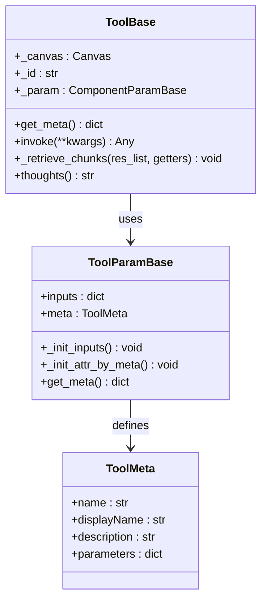
```mermaid
classDiagram
class ToolBase {
+_canvas : Canvas
+_id : str
+_param : ComponentParamBase
+get_meta() dict
+invoke(**kwargs) Any
+_retrieve_chunks(res_list, getters) void
+thoughts() str
}
class ToolParamBase {
+inputs : dict
+meta : ToolMeta
+_init_inputs() void
+_init_attr_by_meta() void
+get_meta() dict
}
class ToolMeta {
+name : str
+displayName : str
+description : str
+parameters : dict
}
ToolBase --> ToolParamBase : uses
ToolParamBase --> ToolMeta : defines
```

**Diagram sources**
- [base.py](file://agent/tools/base.py#L114-L140)
- [base.py](file://agent/tools/base.py#L65-L111)

### Tool Parameter System

The parameter system provides structured validation and configuration for tools. Each tool defines its parameters through a typed dictionary structure that supports validation, defaults, and type checking.

| Parameter Type | Description | Validation | Example |
|----------------|-------------|------------|---------|
| String | Text input with optional formatting | Length limits, pattern matching | `"query": "search terms"` |
| Integer | Numeric input with bounds | Range validation | `"max_results": 10` |
| Array | List of items with type constraints | Item type validation | `"domains": ["example.com"]` |
| Enum | Predefined choices | Value enumeration | `"language": ["python", "javascript"]` |
| Boolean | True/false values | Type enforcement | `"include_images": false` |

### Tool Lifecycle Management

Tools follow a standardized lifecycle that ensures proper initialization, execution, and cleanup:

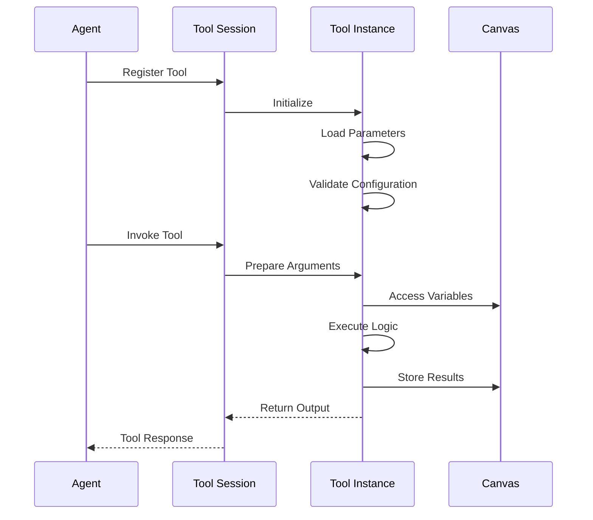
```mermaid
sequenceDiagram
participant Agent as Agent
participant ToolSession as Tool Session
participant Tool as Tool Instance
participant Canvas as Canvas
Agent->>ToolSession : Register Tool
ToolSession->>Tool : Initialize
Tool->>Tool : Load Parameters
Tool->>Tool : Validate Configuration
Agent->>ToolSession : Invoke Tool
ToolSession->>Tool : Prepare Arguments
Tool->>Canvas : Access Variables
Tool->>Tool : Execute Logic
Tool->>Canvas : Store Results
Tool-->>ToolSession : Return Output
ToolSession-->>Agent : Tool Response
```

**Diagram sources**
- [agent_with_tools.py](file://agent/component/agent_with_tools.py#L109-L119)
- [base.py](file://agent/tools/base.py#L126-L140)

**Section sources**
- [base.py](file://agent/tools/base.py#L114-L140)
- [base.py](file://agent/tools/base.py#L65-L111)

## Agent with Tools Implementation

The Agent component serves as the orchestrator for tool usage, combining LLM capabilities with external tool integration. It manages tool registration, invocation patterns, and maintains context throughout the execution lifecycle.

### Agent Configuration and Parameters

The Agent component uses a comprehensive parameter system that extends both LLM and tool parameters:

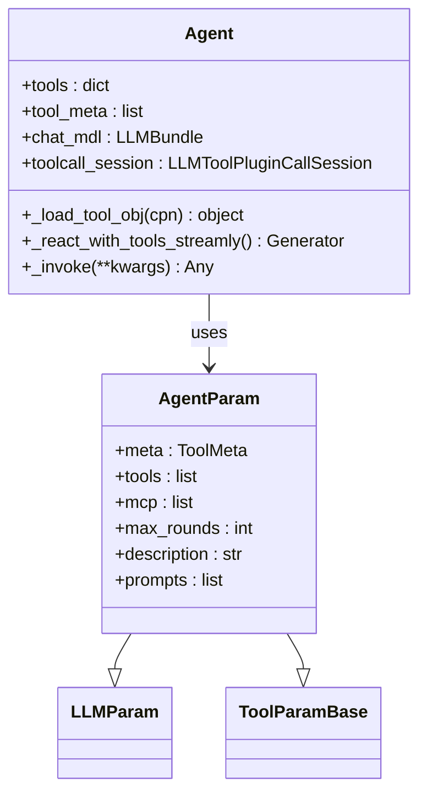
```mermaid
classDiagram
class AgentParam {
+meta : ToolMeta
+tools : list
+mcp : list
+max_rounds : int
+description : str
+prompts : list
}
class Agent {
+tools : dict
+tool_meta : list
+chat_mdl : LLMBundle
+toolcall_session : LLMToolPluginCallSession
+_load_tool_obj(cpn) object
+_react_with_tools_streamly() Generator
+_invoke(**kwargs) Any
}
AgentParam --|> LLMParam
AgentParam --|> ToolParamBase
Agent --> AgentParam : uses
```

**Diagram sources**
- [agent_with_tools.py](file://agent/component/agent_with_tools.py#L38-L80)
- [agent_with_tools.py](file://agent/component/agent_with_tools.py#L81-L106)

### Tool Invocation Patterns

The agent employs sophisticated patterns for tool invocation, including reactive reasoning, parallel execution, and context-aware decision making:

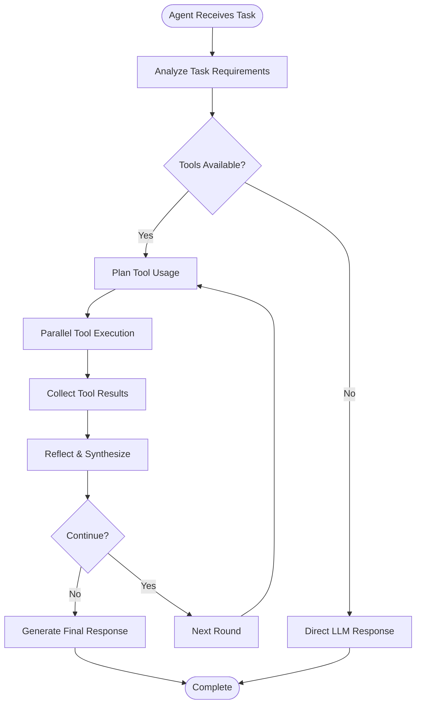
```mermaid
flowchart TD
Start([Agent Receives Task]) --> AnalyzeTask["Analyze Task Requirements"]
AnalyzeTask --> CheckTools{"Tools Available?"}
CheckTools --> |No| DirectLLM["Direct LLM Response"]
CheckTools --> |Yes| PlanTools["Plan Tool Usage"]
PlanTools --> ParallelExec["Parallel Tool Execution"]
ParallelExec --> CollectResults["Collect Tool Results"]
CollectResults --> Reflect["Reflect & Synthesize"]
Reflect --> Decision{"Continue?"}
Decision --> |Yes| NextRound["Next Round"]
Decision --> |No| FinalResponse["Generate Final Response"]
NextRound --> PlanTools
FinalResponse --> End([Complete])
DirectLLM --> End
```

**Diagram sources**
- [agent_with_tools.py](file://agent/component/agent_with_tools.py#L273-L406)

### Streaming and Real-time Processing

The agent supports streaming responses with real-time tool execution, enabling interactive and responsive user experiences:

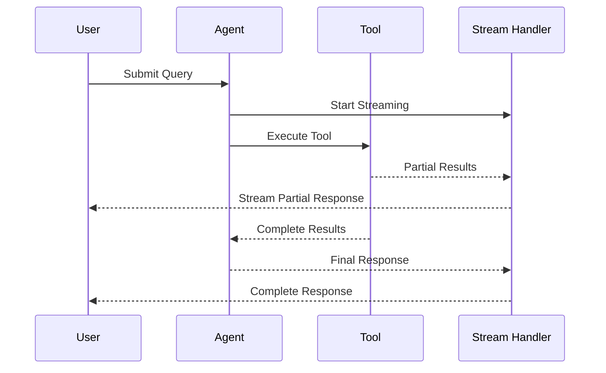
```mermaid
sequenceDiagram
participant User as User
participant Agent as Agent
participant Tool as Tool
participant Stream as Stream Handler
User->>Agent : Submit Query
Agent->>Stream : Start Streaming
Agent->>Tool : Execute Tool
Tool-->>Stream : Partial Results
Stream-->>User : Stream Partial Response
Tool-->>Agent : Complete Results
Agent-->>Stream : Final Response
Stream-->>User : Complete Response
```

**Diagram sources**
- [agent_with_tools.py](file://agent/component/agent_with_tools.py#L242-L262)

**Section sources**
- [agent_with_tools.py](file://agent/component/agent_with_tools.py#L38-L80)
- [agent_with_tools.py](file://agent/component/agent_with_tools.py#L81-L106)

## Tool Registration and Management

The tool registration system provides flexible mechanisms for adding and managing tools within agent workflows. It supports both static registration and dynamic loading of tools.

### Static Tool Registration

Tools can be registered statically through the agent configuration, providing immediate availability for all agent instances:

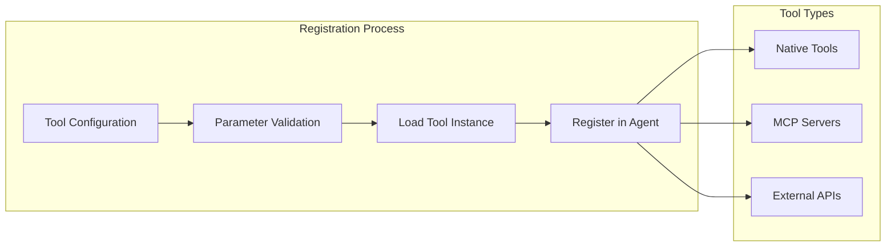
```mermaid
graph LR
subgraph "Registration Process"
Config[Tool Configuration]
Validate[Parameter Validation]
Load[Load Tool Instance]
Register[Register in Agent]
end
subgraph "Tool Types"
Native[Native Tools]
MCP[MCP Servers]
API[External APIs]
end
Config --> Validate
Validate --> Load
Load --> Register
Register --> Native
Register --> MCP
Register --> API
```

**Diagram sources**
- [agent_with_tools.py](file://agent/component/agent_with_tools.py#L86-L106)

### Dynamic Tool Loading

The system supports dynamic loading of tools through the `_load_tool_obj` method, enabling runtime tool discovery and instantiation:

| Loading Method | Use Case | Configuration | Example |
|----------------|----------|---------------|---------|
| Static Registration | Predefined tools | JSON configuration | `{"component_name": "TavilySearch", "params": {...}}` |
| Dynamic Discovery | Runtime tools | Programmatic | `agent.load_tool_obj(config)` |
| Plugin System | Extensible tools | Module loading | `import custom_tool; agent.register(custom_tool)` |

### Tool Metadata and Discovery

Each tool provides comprehensive metadata that enables automatic discovery and integration:

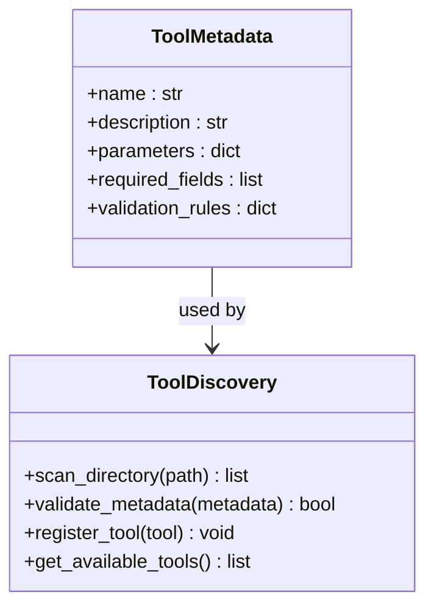
```mermaid
classDiagram
class ToolMetadata {
+name : str
+description : str
+parameters : dict
+required_fields : list
+validation_rules : dict
}
class ToolDiscovery {
+scan_directory(path) list
+validate_metadata(metadata) bool
+register_tool(tool) void
+get_available_tools() list
}
ToolMetadata --> ToolDiscovery : used by
```

**Diagram sources**
- [base.py](file://agent/tools/base.py#L100-L111)

**Section sources**
- [agent_with_tools.py](file://agent/component/agent_with_tools.py#L86-L106)
- [agent_with_tools.py](file://agent/component/agent_with_tools.py#L109-L119)

## Variable Assignment and Aggregation

The variable management system provides sophisticated mechanisms for data flow between tools and components, enabling complex data transformations and aggregation patterns.

### Variable Assigner Component

The Variable Assigner provides fine-grained control over variable manipulation with support for multiple assignment operations:

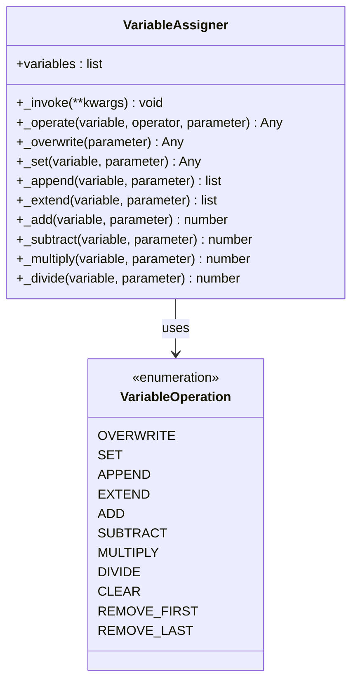
```mermaid
classDiagram
class VariableAssigner {
+variables : list
+_invoke(**kwargs) void
+_operate(variable, operator, parameter) Any
+_overwrite(parameter) Any
+_set(variable, parameter) Any
+_append(variable, parameter) list
+_extend(variable, parameter) list
+_add(variable, parameter) number
+_subtract(variable, parameter) number
+_multiply(variable, parameter) number
+_divide(variable, parameter) number
}
class VariableOperation {
<<enumeration>>
OVERWRITE
SET
APPEND
EXTEND
ADD
SUBTRACT
MULTIPLY
DIVIDE
CLEAR
REMOVE_FIRST
REMOVE_LAST
}
VariableAssigner --> VariableOperation : uses
```

**Diagram sources**
- [variable_assigner.py](file://agent/component/variable_assigner.py#L41-L191)

### Variable Aggregator Component

The Variable Aggregator enables grouping and selection of variables based on availability and precedence:

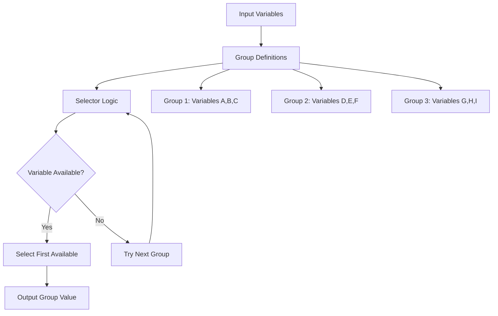
```mermaid
flowchart TD
Input[Input Variables] --> Groups["Group Definitions"]
Groups --> Selector["Selector Logic"]
Selector --> Availability{"Variable Available?"}
Availability --> |Yes| Select["Select First Available"]
Availability --> |No| NextGroup["Try Next Group"]
NextGroup --> Selector
Select --> Output["Output Group Value"]
Groups --> Group1["Group 1: Variables A,B,C"]
Groups --> Group2["Group 2: Variables D,E,F"]
Groups --> Group3["Group 3: Variables G,H,I"]
```

**Diagram sources**
- [varaiable_aggregator.py](file://agent/component/varaiable_aggregator.py#L61-L73)

### Data Flow Patterns

The system supports various data flow patterns that enable complex transformations:

| Pattern | Description | Use Case | Example |
|---------|-------------|----------|---------|
| Pipeline | Sequential processing | Data transformation | `input -> transform -> validate -> output` |
| Parallel | Concurrent processing | Independent operations | `tool1, tool2, tool3 -> merge` |
| Conditional | Branching logic | Decision-based processing | `if condition then tool1 else tool2` |
| Aggregation | Group processing | Collection operations | `list of results -> aggregated summary` |
| Mapping | Element-wise processing | Individual transformations | `each item -> apply function` |

**Section sources**
- [variable_assigner.py](file://agent/component/variable_assigner.py#L41-L191)
- [varaiable_aggregator.py](file://agent/component/varaiable_aggregator.py#L58-L85)

## External Tool Integrations

RAGFlow integrates with numerous external tools and services, each providing specialized capabilities for different use cases. These integrations demonstrate the system's flexibility and extensibility.

### Web Search Tools

Multiple web search providers offer comprehensive search capabilities with different strengths:

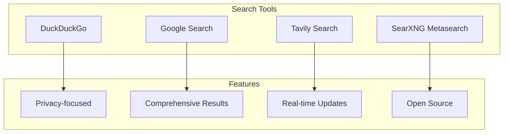
```mermaid
graph TB
subgraph "Search Tools"
Tavily[Tavily Search]
Google[Google Search]
SearXNG[SearXNG Metasearch]
DuckDuckGo[DuckDuckGo]
end
subgraph "Features"
Privacy[Privacy-focused]
Comprehensive[Comprehensive Results]
RealTime[Real-time Updates]
OpenSource[Open Source]
end
Tavily --> RealTime
Google --> Comprehensive
SearXNG --> OpenSource
DuckDuckGo --> Privacy
```

**Diagram sources**
- [tavily.py](file://agent/tools/tavily.py#L101-L146)
- [google.py](file://agent/tools/google.py#L116-L166)
- [searxng.py](file://agent/tools/searxng.py#L77-L163)

### Code Execution Environment

The code execution tool provides a secure sandboxed environment for running code snippets:

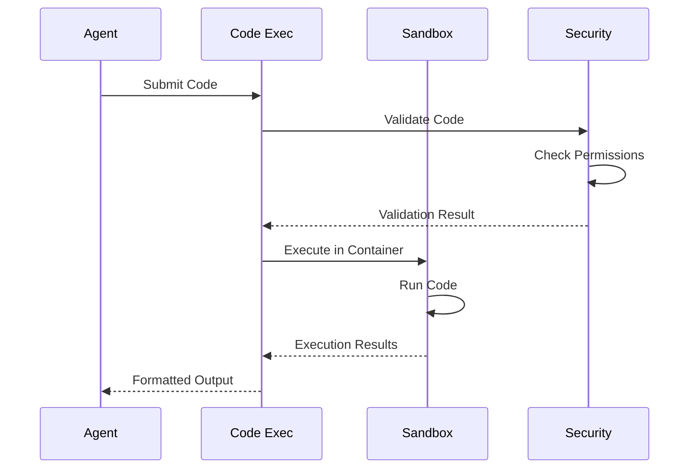
```mermaid
sequenceDiagram
participant Agent as Agent
participant CodeExec as Code Exec
participant Sandbox as Sandbox
participant Security as Security
Agent->>CodeExec : Submit Code
CodeExec->>Security : Validate Code
Security->>Security : Check Permissions
Security-->>CodeExec : Validation Result
CodeExec->>Sandbox : Execute in Container
Sandbox->>Sandbox : Run Code
Sandbox-->>CodeExec : Execution Results
CodeExec-->>Agent : Formatted Output
```

**Diagram sources**
- [code_exec.py](file://agent/tools/code_exec.py#L126-L191)

### Database Query Tools

The SQL execution tool supports multiple database systems with unified interface:

| Database Type | Driver | Authentication | Features |
|---------------|--------|----------------|----------|
| MySQL/MariaDB | pymysql | Username/Password | Full SQL support |
| PostgreSQL | psycopg2 | Username/Password | Advanced types |
| Microsoft SQL | pyodbc | Username/Password | Stored procedures |
| IBM DB2 | ibm_db | Username/Password | Enterprise features |
| Trino | trino | Username/Password | Distributed queries |

### Communication Tools

Email and messaging tools enable automated communication workflows:

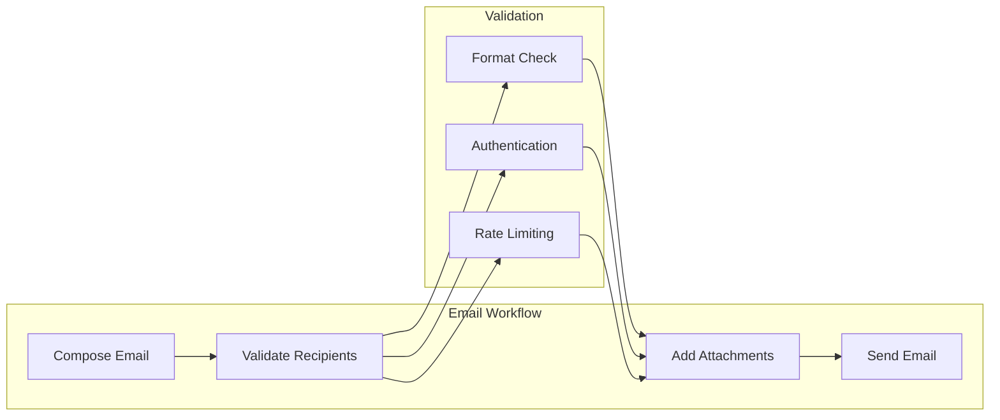
```mermaid
flowchart LR
subgraph "Email Workflow"
Compose[Compose Email]
Validate[Validate Recipients]
Attach[Add Attachments]
Send[Send Email]
end
subgraph "Validation"
Format[Format Check]
Auth[Authentication]
RateLimit[Rate Limiting]
end
Compose --> Validate
Validate --> Format
Validate --> Auth
Validate --> RateLimit
Format --> Attach
Auth --> Attach
RateLimit --> Attach
Attach --> Send
```

**Diagram sources**
- [email.py](file://agent/tools/email.py#L99-L222)

**Section sources**
- [tavily.py](file://agent/tools/tavily.py#L101-L146)
- [code_exec.py](file://agent/tools/code_exec.py#L126-L191)
- [exesql.py](file://agent/tools/exesql.py#L79-L276)
- [email.py](file://agent/tools/email.py#L99-L222)

## MCP (Model Context Protocol) Integration

The Model Context Protocol (MCP) integration provides a standardized way to connect with external tools and services through a protocol-based architecture. This enables seamless integration with a wide range of tools and services.

### MCP Architecture

The MCP system uses a client-server architecture with support for multiple transport protocols:

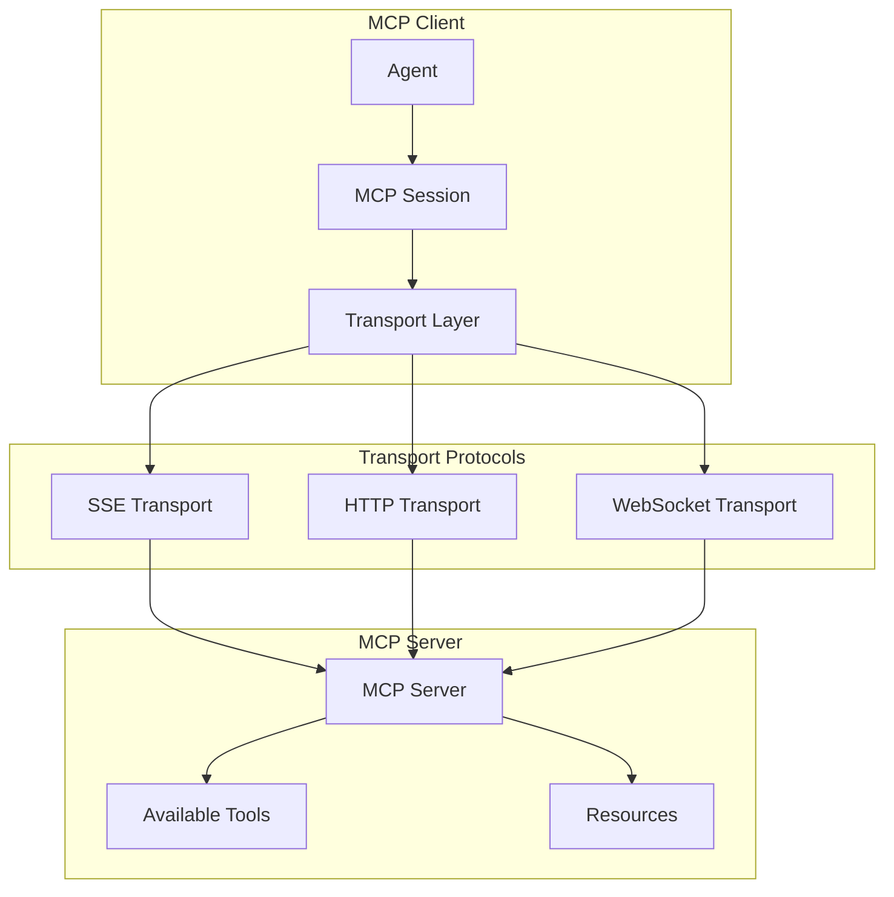
```mermaid
graph TB
subgraph "MCP Client"
Agent[Agent]
Session[MCP Session]
Transport[Transport Layer]
end
subgraph "MCP Server"
Server[MCP Server]
Tools[Available Tools]
Resources[Resources]
end
subgraph "Transport Protocols"
SSE[SSE Transport]
HTTP[HTTP Transport]
WebSocket[WebSocket Transport]
end
Agent --> Session
Session --> Transport
Transport --> SSE
Transport --> HTTP
Transport --> WebSocket
SSE --> Server
HTTP --> Server
WebSocket --> Server
Server --> Tools
Server --> Resources
```

**Diagram sources**
- [mcp_tool_call_conn.py](file://common/mcp_tool_call_conn.py#L42-L113)

### Tool Session Management

The MCP tool session provides sophisticated management of tool connections and execution:

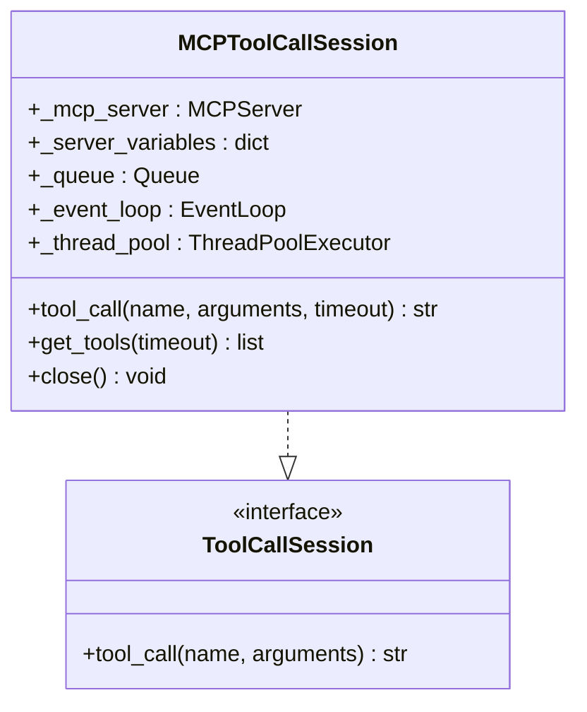
```mermaid
classDiagram
class MCPToolCallSession {
+_mcp_server : MCPServer
+_server_variables : dict
+_queue : Queue
+_event_loop : EventLoop
+_thread_pool : ThreadPoolExecutor
+tool_call(name, arguments, timeout) str
+get_tools(timeout) list
+close() void
}
class ToolCallSession {
<<interface>>
+tool_call(name, arguments) str
}
MCPToolCallSession ..|> ToolCallSession
```

**Diagram sources**
- [mcp_tool_call_conn.py](file://common/mcp_tool_call_conn.py#L42-L218)

### Transport Protocol Support

The MCP system supports multiple transport protocols for different deployment scenarios:

| Protocol | Use Case | Advantages | Limitations |
|----------|----------|------------|-------------|
| SSE (Server-Sent Events) | Real-time streaming | Low latency, bidirectional | Browser support only |
| HTTP (Streamable) | RESTful APIs | Standard, widely supported | Higher latency |
| WebSocket | Interactive applications | Full duplex, low overhead | Complex implementation |

**Section sources**
- [mcp_tool_call_conn.py](file://common/mcp_tool_call_conn.py#L42-L218)

## Error Handling and Security

The tool system implements comprehensive error handling and security measures to ensure reliable and safe operation in production environments.

### Error Handling Strategies

The system employs multiple layers of error handling to manage failures gracefully:

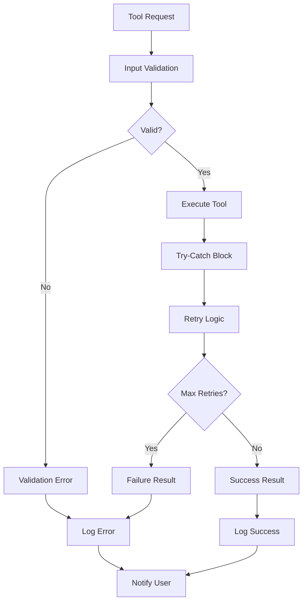
```mermaid
flowchart TD
Request[Tool Request] --> Validate[Input Validation]
Validate --> Success{Valid?}
Success --> |No| ValidationError[Validation Error]
Success --> |Yes| Execute[Execute Tool]
Execute --> TryCatch[Try-Catch Block]
TryCatch --> RetryLogic[Retry Logic]
RetryLogic --> MaxRetries{Max Retries?}
MaxRetries --> |No| SuccessResult[Success Result]
MaxRetries --> |Yes| FailureResult[Failure Result]
ValidationError --> LogError[Log Error]
SuccessResult --> LogSuccess[Log Success]
FailureResult --> LogError
LogError --> UserNotification[Notify User]
LogSuccess --> UserNotification
```

### Security Measures

The tool system implements multiple security layers to protect against various threats:

| Security Layer | Protection | Implementation | Example |
|----------------|------------|----------------|---------|
| Input Validation | Malicious input | Parameter validation | `check_empty()`, `check_valid_value()` |
| Rate Limiting | Abuse prevention | Timeout decorators | `@timeout(12)` seconds |
| Authentication | Access control | API keys, tokens | Tool-specific credentials |
| Sandboxing | Code isolation | Container execution | Code execution sandbox |
| Resource Limits | Resource exhaustion | Memory/time limits | Execution timeouts |

### Authentication and Authorization

Different tools implement various authentication mechanisms:

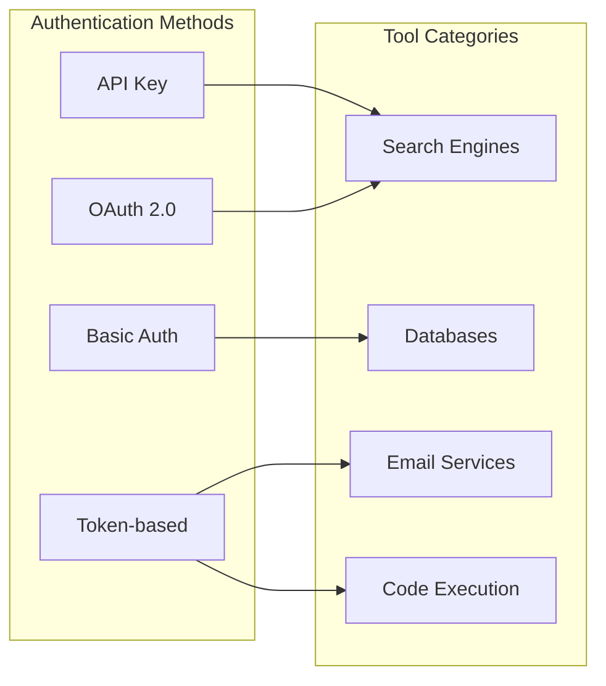
```mermaid
graph LR
subgraph "Authentication Methods"
APIKey[API Key]
OAuth[OAuth 2.0]
BasicAuth[Basic Auth]
Token[Token-based]
end
subgraph "Tool Categories"
Search[Search Engines]
Database[Databases]
Email[Email Services]
Code[Code Execution]
end
APIKey --> Search
OAuth --> Search
BasicAuth --> Database
Token --> Email
Token --> Code
```

**Section sources**
- [agent_with_tools.py](file://agent/component/agent_with_tools.py#L164-L166)
- [code_exec.py](file://agent/tools/code_exec.py#L129-L132)
- [tavily.py](file://agent/tools/tavily.py#L104-L107)

## Configuration and Best Practices

Proper configuration and adherence to best practices ensure optimal performance and reliability of the agent with tools system.

### Configuration Options

The system provides extensive configuration options for customization:

| Configuration Area | Options | Purpose | Example |
|-------------------|---------|---------|---------|
| Tool Selection | Enable/disable tools | Control available functionality | `tools: ["tavily", "github"]` |
| Rate Limiting | Timeout, retries | Prevent abuse | `timeout: 30, max_retries: 3` |
| Security | Authentication, permissions | Protect resources | `api_key: "secret_key"` |
| Performance | Concurrency, caching | Optimize speed | `max_workers: 5` |
| Monitoring | Logging, metrics | Track usage | `verbose_tool_use: true` |

### Best Practices for Tool Integration

Effective tool integration requires following established patterns and practices:

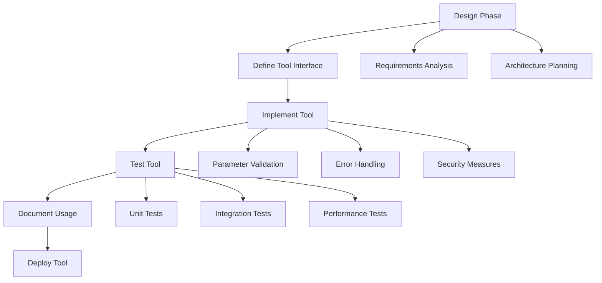
```mermaid
flowchart TD
Design[Design Phase] --> Specification[Define Tool Interface]
Specification --> Implementation[Implement Tool]
Implementation --> Testing[Test Tool]
Testing --> Documentation[Document Usage]
Documentation --> Deployment[Deploy Tool]
Design --> Requirements[Requirements Analysis]
Design --> Architecture[Architecture Planning]
Implementation --> Validation[Parameter Validation]
Implementation --> ErrorHandling[Error Handling]
Implementation --> Security[Security Measures]
Testing --> Unit[Unit Tests]
Testing --> Integration[Integration Tests]
Testing --> Performance[Performance Tests]
```

### Performance Optimization

Several strategies can improve tool performance and reliability:

| Optimization | Technique | Benefit | Implementation |
|--------------|-----------|---------|----------------|
| Caching | Result caching | Reduce API calls | Redis/Memory cache |
| Parallelization | Concurrent execution | Faster processing | Thread pools |
| Connection Pooling | Reuse connections | Lower overhead | Connection managers |
| Lazy Loading | On-demand loading | Faster startup | Dynamic imports |
| Compression | Data compression | Reduced bandwidth | gzip/brotli |

**Section sources**
- [agent_with_tools.py](file://agent/component/agent_with_tools.py#L38-L80)
- [base.py](file://agent/tools/base.py#L65-L111)

## Common Issues and Troubleshooting

Understanding common issues and their solutions helps maintain reliable tool integration in production environments.

### Tool Authentication Failures

Authentication issues are among the most common problems encountered with external tools:

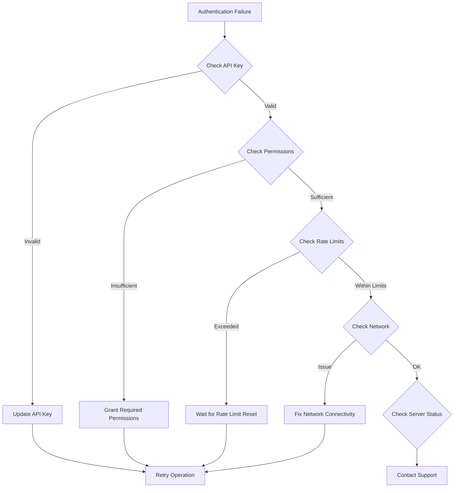
```mermaid
flowchart TD
AuthFail[Authentication Failure] --> CheckKey{Check API Key}
CheckKey --> |Invalid| UpdateKey[Update API Key]
CheckKey --> |Valid| CheckScope{Check Permissions}
CheckScope --> |Insufficient| GrantPermissions[Grant Required Permissions]
CheckScope --> |Sufficient| CheckRate{Check Rate Limits}
CheckRate --> |Exceeded| WaitLimit[Wait for Rate Limit Reset]
CheckRate --> |Within Limits| CheckNetwork{Check Network}
CheckNetwork --> |Issue| FixNetwork[Fix Network Connectivity]
CheckNetwork --> |OK| CheckServer{Check Server Status}
UpdateKey --> Retry[Retry Operation]
GrantPermissions --> Retry
WaitLimit --> Retry
FixNetwork --> Retry
CheckServer --> ContactSupport[Contact Support]
```

### Rate Limiting Issues

Rate limiting can cause intermittent failures and degraded performance:

| Issue Type | Symptoms | Solution | Prevention |
|------------|----------|----------|------------|
| API Quota Exceeded | 429 HTTP errors | Implement exponential backoff | Monitor usage |
| Request Frequency | Slow responses | Reduce request rate | Add delays |
| Daily Limits | Sudden failures | Switch to alternative tools | Distribute load |
| Concurrent Limits | Connection refused | Reduce concurrency | Queue requests |

### Tool Execution Timeouts

Timeout issues often occur with long-running operations:

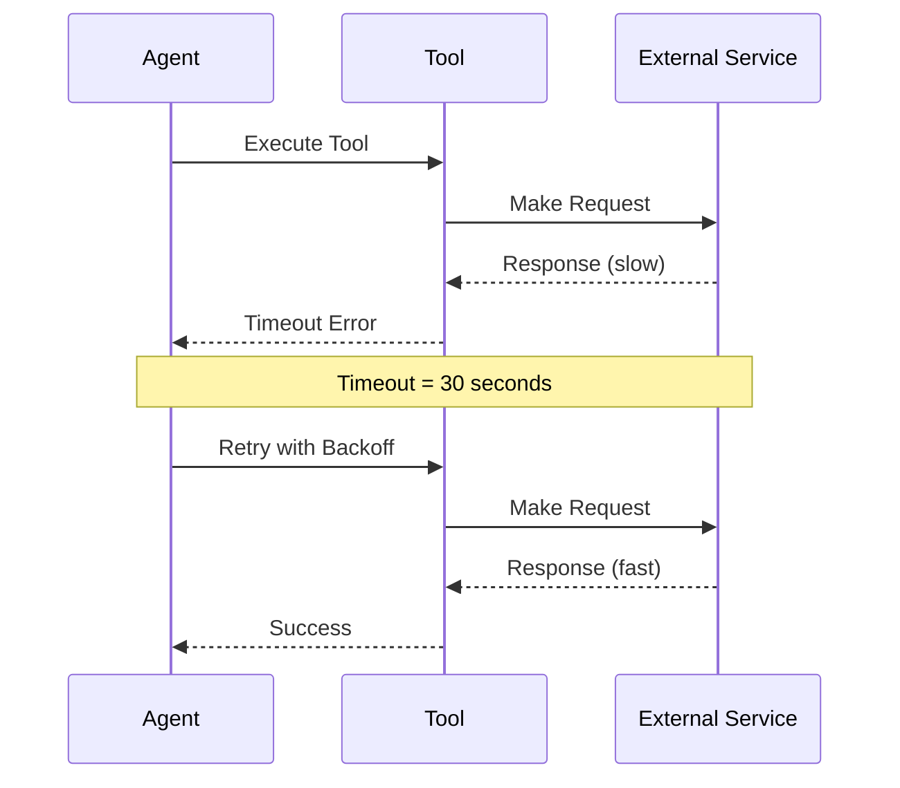
```mermaid
sequenceDiagram
participant Agent as Agent
participant Tool as Tool
participant External as External Service
Agent->>Tool : Execute Tool
Tool->>External : Make Request
External-->>Tool : Response (slow)
Tool-->>Agent : Timeout Error
Note over Agent,External : Timeout = 30 seconds
Agent->>Tool : Retry with Backoff
Tool->>External : Make Request
External-->>Tool : Response (fast)
Tool-->>Agent : Success
```

### Memory and Resource Issues

Resource constraints can cause tool failures and system instability:

| Resource Type | Common Issues | Solutions | Monitoring |
|---------------|---------------|-----------|------------|
| Memory | Out of memory errors | Increase limits, optimize code | Memory profiling |
| CPU | High CPU usage | Optimize algorithms | CPU monitoring |
| Network | Connection timeouts | Increase timeouts | Network monitoring |
| Disk | Storage full | Cleanup old data | Disk usage alerts |

### Debugging and Monitoring

Effective debugging requires comprehensive logging and monitoring:

```mermaid
graph TB
subgraph "Monitoring Stack"
Logs[Application Logs]
Metrics[Performance Metrics]
Traces[Distributed Traces]
Alerts[Alerts & Notifications]
end
subgraph "Debugging Tools"
Profiler[Performance Profiler]
Debugger[Interactive Debugger]
Analyzer[Log Analyzer]
Dashboard[Monitoring Dashboard]
end
Logs --> Analyzer
Metrics --> Dashboard
Traces --> Profiler
Alerts --> Debugger
Analyzer --> Insights[Debugging Insights]
Dashboard --> Insights
Profiler --> Insights
Debugger --> Insights
```

**Section sources**
- [agent_with_tools.py](file://agent/component/agent_with_tools.py#L164-L166)
- [code_exec.py](file://agent/tools/code_exec.py#L129-L132)
- [tavily.py](file://agent/tools/tavily.py#L104-L107)

## Conclusion

RAGFlow's agent with tools system represents a sophisticated and flexible framework for integrating external tools and services into AI agent workflows. The system's modular architecture, comprehensive error handling, and extensive tool support make it suitable for a wide range of automation and intelligence applications.

Key strengths of the system include:

- **Modular Architecture**: Clean separation of concerns enables easy extension and maintenance
- **Flexible Tool Integration**: Support for native tools, MCP servers, and external APIs
- **Robust Error Handling**: Multi-layered error management ensures reliability
- **Security Focus**: Comprehensive security measures protect against various threats
- **Performance Optimization**: Built-in optimizations for speed and scalability

The system's design demonstrates best practices in software architecture while remaining accessible to developers and system administrators. Its ability to integrate diverse tools and services makes it a powerful foundation for building intelligent automation systems.

Future enhancements could include expanded MCP support, additional tool categories, and enhanced monitoring capabilities. The solid foundation provided by the current implementation ensures that such extensions can be added seamlessly while maintaining backward compatibility and system stability.