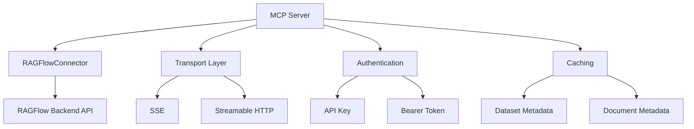
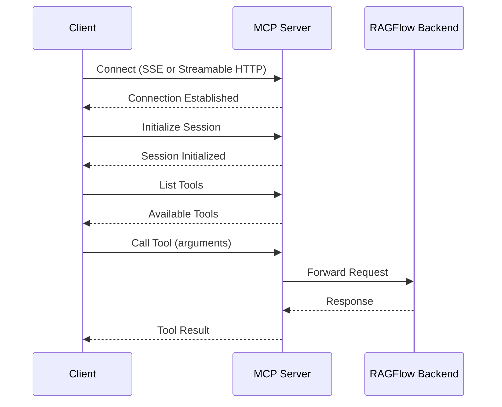
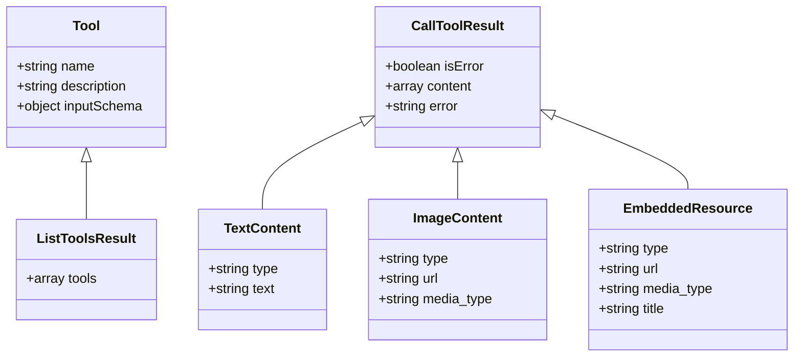
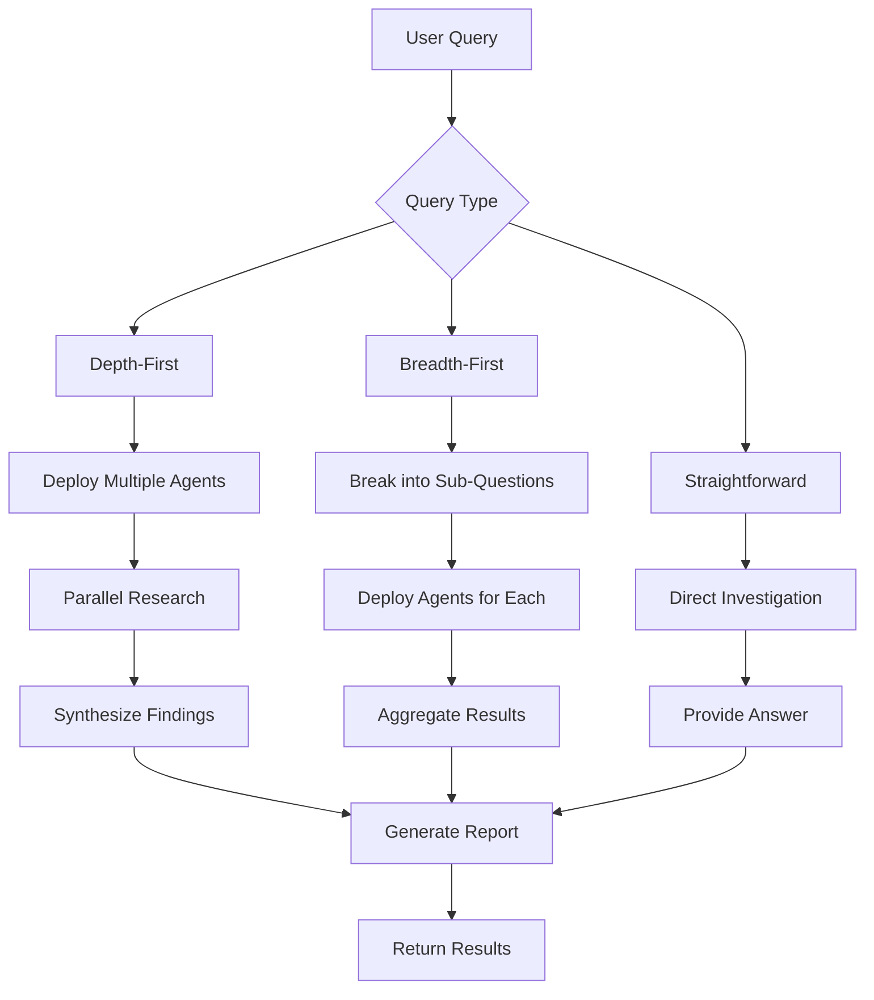
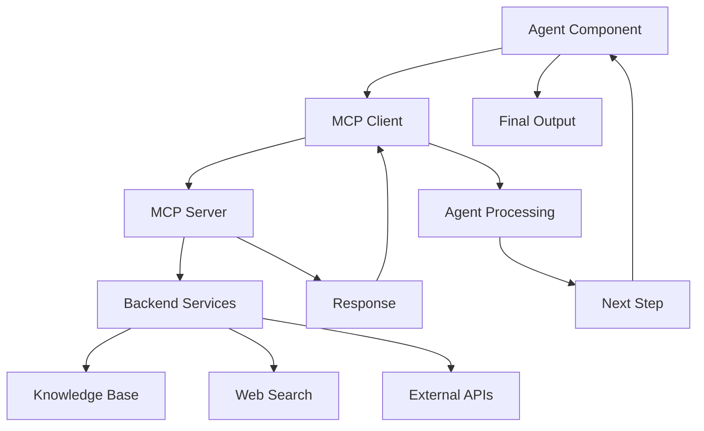
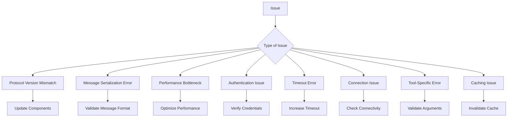
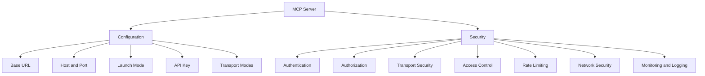

# MCP Integration

<cite>
**Referenced Files in This Document**   
- [server.py](file://mcp/server/server.py)
- [client.py](file://mcp/client/client.py)
- [streamable_http_client.py](file://mcp/client/streamable_http_client.py)
- [mcp_server_app.py](file://api/apps/mcp_server_app.py)
- [mcp_server_service.py](file://api/db/services/mcp_server_service.py)
- [deep_research.py](file://agentic_reasoning/deep_research.py)
- [deep_research.json](file://agent/templates/deep_research.json)
- [mcp_tool_call_conn.py](file://common/mcp_tool_call_conn.py)
- [constants.py](file://common/constants.py)
</cite>

## Table of Contents
1. [Introduction](#introduction)
2. [MCP Server Implementation](#mcp-server-implementation)
3. [MCP Client Integration](#mcp-client-integration)
4. [Message Formats and Protocol Semantics](#message-formats-and-protocol-semantics)
5. [Deep Research Workflows](#deep-research-workflows)
6. [Agent Component Integration](#agent-component-integration)
7. [Common Issues and Troubleshooting](#common-issues-and-troubleshooting)
8. [Configuration and Security](#configuration-and-security)
9. [Conclusion](#conclusion)

## Introduction
The Model Context Protocol (MCP) integration in RAGFlow provides a standardized communication framework between agents and Large Language Models (LLMs), enabling efficient tool calling, context management, and response streaming. This documentation details the implementation of the MCP server and client components, message formats, protocol semantics, and integration with agent workflows. The MCP system facilitates multi-step reasoning and tool orchestration, particularly in advanced scenarios like deep research workflows. The integration supports both SSE (Server-Sent Events) and Streamable HTTP transport modes, allowing for flexible deployment options and efficient communication between components.

## MCP Server Implementation

The MCP server implementation in RAGFlow is designed to facilitate standardized communication between agents and LLMs through a well-defined protocol. The server is implemented in `mcp/server/server.py` and provides a robust foundation for tool calling, context management, and response streaming. The server supports two transport modes: SSE (Server-Sent Events) and Streamable HTTP, allowing for flexible deployment options based on specific requirements.

The server architecture is built around the `Server` class from the MCP library, which handles the core protocol operations. The implementation includes a `RAGFlowConnector` class that serves as the interface between the MCP server and the RAGFlow backend services. This connector manages API calls to the RAGFlow system, including retrieval operations and dataset management. The connector implements caching mechanisms for dataset and document metadata to improve performance and reduce redundant API calls.

The server supports two launch modes: self-host and host. In self-host mode, the server runs for a single tenant with a predefined API key, while host mode supports multi-tenancy where users must provide authorization headers for each request. The server can be configured through command-line options or environment variables, allowing for flexible deployment in different environments.

The implementation includes comprehensive error handling and logging to ensure reliable operation. The server exposes endpoints for tool listing and tool invocation, with proper authentication and authorization mechanisms in place. The server also includes health checks and monitoring capabilities to ensure availability and performance.

**Diagram sources**
- [server.py](file://mcp/server/server.py#L1-L716)

**Section sources**
- [server.py](file://mcp/server/server.py#L1-L716)

## MCP Client Integration

The MCP client integration in RAGFlow enables agents to communicate with the MCP server for tool calling and context management. The client implementation consists of two main components: the basic client in `mcp/client/client.py` and the streamable HTTP client in `mcp/client/streamable_http_client.py`. These clients provide the necessary functionality for establishing connections, sending requests, and receiving responses from the MCP server.

The client implementation uses the `ClientSession` class from the MCP library to manage the communication session with the server. The session handles the initialization process, including protocol negotiation and capability exchange. Once the session is established, clients can list available tools and invoke them with specific arguments.

The basic client demonstrates the use of SSE (Server-Sent Events) for communication with the MCP server. It establishes a connection to the server's SSE endpoint and creates a bidirectional stream for message exchange. The client then initializes the session and can list available tools and call specific tools with arguments. The response from tool calls is handled asynchronously, allowing for efficient processing of results.

The streamable HTTP client provides an alternative transport mechanism using HTTP-based streaming. This approach is particularly useful in environments where SSE may not be supported or when additional HTTP features are required. The client establishes a connection to the server's streamable HTTP endpoint and manages the request-response cycle for tool invocations.

Both client implementations follow a similar pattern: establishing a connection, initializing the session, listing tools, and calling tools. The choice between SSE and streamable HTTP depends on the specific requirements of the deployment environment and the capabilities of the underlying infrastructure.

**Diagram sources**
- [client.py](file://mcp/client/client.py#L1-L48)
- [streamable_http_client.py](file://mcp/client/streamable_http_client.py#L1-L37)

**Section sources**
- [client.py](file://mcp/client/client.py#L1-L48)
- [streamable_http_client.py](file://mcp/client/streamable_http_client.py#L1-L37)

## Message Formats and Protocol Semantics

The Model Context Protocol (MCP) in RAGFlow defines standardized message formats and protocol semantics for communication between agents and LLMs. The protocol is designed to support tool calling, context management, and response streaming in a consistent and reliable manner. The message formats are based on JSON structures that define the schema for tool definitions, tool invocations, and responses.

The protocol defines two primary message types: tool listing and tool invocation. The tool listing message is used to retrieve information about available tools from the MCP server. This message returns a list of `Tool` objects, each containing a name, description, and input schema. The input schema is defined using JSON Schema, which specifies the parameters that the tool accepts, including their types, descriptions, and validation rules.

The tool invocation message is used to call a specific tool with provided arguments. The message includes the tool name and a dictionary of arguments that match the tool's input schema. The MCP server validates the arguments against the schema before processing the request. If the arguments are valid, the server forwards the request to the appropriate backend service and returns the result.

The response format includes a `CallToolResult` object that contains the result of the tool invocation. The result can be either a success or an error. In case of success, the result contains the output of the tool, which can be text content, image content, or embedded resources. In case of an error, the result contains an error message that describes the nature of the failure.

The protocol also supports streaming responses, allowing for real-time updates during long-running operations. This is particularly useful for tools that perform complex operations or retrieve large amounts of data. The streaming capability is implemented using Server-Sent Events (SSE) or Streamable HTTP, depending on the transport mode selected.

The protocol semantics include error handling, authentication, and rate limiting. Error handling is implemented through standardized error codes and messages that provide clear information about the nature of any issues. Authentication is handled through API keys or Bearer tokens, ensuring that only authorized clients can access the MCP server. Rate limiting is implemented to prevent abuse and ensure fair usage of resources.

**Diagram sources**
- [server.py](file://mcp/server/server.py#L365-L444)
- [types.py](file://mcp/types.py)

**Section sources**
- [server.py](file://mcp/server/server.py#L365-L444)

## Deep Research Workflows

The deep research workflows in RAGFlow leverage the MCP integration to perform multi-step reasoning and tool orchestration for complex research tasks. The implementation in `agentic_reasoning/deep_research.py` demonstrates how agents can use MCP to coordinate multiple research steps, retrieve information from various sources, and synthesize findings into comprehensive reports.

The deep research workflow is structured as a multi-agent system where different agents specialize in specific tasks. The workflow begins with a Strategy Research Director agent that orchestrates the overall research process. This agent analyzes the user's query and develops a research plan based on the query type (depth-first, breadth-first, or straightforward).

For depth-first queries, the agent deploys multiple specialized agents to explore different perspectives on the same topic. For example, when researching the factors driving cryptocurrency market volatility, the system might deploy agents to investigate technical/market factors, regulatory/institutional factors, and psychological/social factors. Each agent uses MCP to call appropriate tools and retrieve relevant information.

For breadth-first queries, the agent breaks down the research task into distinct sub-questions and deploys agents to handle each sub-topic independently. For example, when comparing cloud computing providers, the system might deploy agents to analyze AWS, Microsoft Azure, and Google Cloud separately. The findings from each agent are then synthesized into a comprehensive comparison.

The workflow includes several stages: URL discovery, content extraction, and strategic report generation. In the URL discovery stage, a Web Search Specialist agent uses MCP to call search tools and identify premium sources. The agent evaluates source quality based on domain and title, ensuring that only high-quality sources are selected.

In the content extraction stage, a Content Deep Reader agent uses MCP to extract structured information from the identified URLs. The agent processes each URL, extracting key statistics, main findings, expert quotes, and supporting data. The extracted content is organized using a standardized schema to facilitate synthesis.

In the final stage, a Research Synthesizer agent uses MCP to integrate the extracted content and generate a strategic report. The agent applies a specific analysis framework based on the user's requirements, addressing key strategic questions and providing actionable recommendations.

The workflow includes quality gates after each stage to ensure that the required outputs are present and meet quality thresholds. The system also includes adaptive strategies for handling failures, time constraints, and quality issues. For example, if content extraction fails due to paywalls, the system can deploy a backup strategy using metadata analysis and Google Scholar search.

**Diagram sources**
- [deep_research.py](file://agentic_reasoning/deep_research.py#L1-L237)
- [deep_research.json](file://agent/templates/deep_research.json#L1-L854)

**Section sources**
- [deep_research.py](file://agentic_reasoning/deep_research.py#L1-L237)
- [deep_research.json](file://agent/templates/deep_research.json#L1-L854)

## Agent Component Integration

The integration between agent components and the MCP system in RAGFlow enables advanced reasoning scenarios through standardized communication and tool orchestration. The agent components, defined in the `agent` directory, leverage MCP to perform complex tasks that require multiple steps and interactions with external tools and services.

The agent components are designed as modular units that can be combined to create sophisticated workflows. Each agent has a specific role and set of capabilities, which are exposed through MCP tools. For example, the Web Search Specialist agent specializes in discovering high-quality sources using search tools, while the Content Deep Reader agent focuses on extracting structured information from web content.

The integration is facilitated through the MCP tool calling mechanism, which allows agents to invoke specific tools with defined parameters. When an agent needs to perform a task that requires external resources, it calls the appropriate MCP tool with the necessary arguments. The MCP server then processes the request, interacts with the backend services, and returns the results to the agent.

The agent components are configured through JSON templates that define their behavior, parameters, and tool dependencies. These templates specify the LLM to use, the system prompt, the message history window size, and the tools available to the agent. The templates also define the agent's role and responsibilities within the overall workflow.

The integration supports both sequential and parallel execution of agents. In sequential workflows, agents pass information to each other in a pipeline fashion, with each agent building on the results of the previous one. In parallel workflows, multiple agents work on different aspects of the task simultaneously, and their findings are later synthesized.

The agent components also support context management, allowing them to maintain state across multiple interactions. This is particularly important for multi-step reasoning scenarios where the agent needs to remember previous findings and incorporate them into subsequent steps.

The integration includes error handling and recovery mechanisms to ensure robust operation. If an agent fails to complete its task, the system can retry the operation, use alternative tools, or adjust the research strategy based on the nature of the failure.

**Diagram sources**
- [deep_research.json](file://agent/templates/deep_research.json#L1-L854)
- [mcp_tool_call_conn.py](file://common/mcp_tool_call_conn.py#L1-L326)

**Section sources**
- [deep_research.json](file://agent/templates/deep_research.json#L1-L854)
- [mcp_tool_call_conn.py](file://common/mcp_tool_call_conn.py#L1-L326)

## Common Issues and Troubleshooting

The MCP integration in RAGFlow may encounter various issues that require troubleshooting and resolution. Understanding these common issues and their solutions is essential for maintaining reliable operation and optimal performance.

One common issue is protocol version mismatches between the MCP client and server. This can occur when different components are updated at different times, leading to incompatible protocol versions. To resolve this issue, ensure that all components are using compatible versions of the MCP library. Regularly update the MCP client and server components to maintain compatibility.

Message serialization errors can occur when the data being transmitted does not conform to the expected JSON format. This can happen due to malformed JSON, incorrect data types, or missing required fields. To troubleshoot serialization errors, validate the message format against the MCP specification and ensure that all data is properly encoded. Use tools like JSON validators to check the integrity of the messages before transmission.

Performance bottlenecks in MCP communication can arise from various factors, including network latency, server overload, or inefficient tool implementations. To address performance issues, monitor the system's performance metrics and identify the source of the bottleneck. Optimize network connectivity, scale the server infrastructure, or improve the efficiency of tool implementations as needed.

Authentication and authorization issues can prevent clients from accessing the MCP server. These issues may be caused by incorrect API keys, expired tokens, or insufficient permissions. To resolve authentication issues, verify that the correct credentials are being used and that the user has the necessary permissions. Check the server logs for authentication-related errors and adjust the configuration as needed.

Timeout errors can occur when requests take longer to process than the configured timeout period. This can happen with long-running operations or when the server is under heavy load. To address timeout issues, increase the timeout values for specific operations or optimize the performance of the underlying tools. Implement retry mechanisms with exponential backoff to handle transient failures.

Connection issues can prevent clients from establishing a connection to the MCP server. These issues may be caused by network problems, firewall restrictions, or server unavailability. To troubleshoot connection issues, verify network connectivity, check firewall rules, and ensure that the server is running and accessible. Use network diagnostic tools to identify and resolve connectivity problems.

Tool-specific errors can occur when a particular tool fails to execute correctly. These errors may be caused by invalid arguments, missing dependencies, or bugs in the tool implementation. To resolve tool-specific errors, validate the input arguments against the tool's schema, ensure that all dependencies are available, and check the tool's implementation for potential issues.

Caching issues can affect the performance and accuracy of the MCP system. Stale or incorrect cache entries can lead to outdated information being returned. To address caching issues, implement proper cache invalidation mechanisms and monitor cache performance. Adjust cache expiration times based on the volatility of the underlying data.

**Diagram sources**
- [mcp_tool_call_conn.py](file://common/mcp_tool_call_conn.py#L1-L326)
- [server.py](file://mcp/server/server.py#L1-L716)

**Section sources**
- [mcp_tool_call_conn.py](file://common/mcp_tool_call_conn.py#L1-L326)
- [server.py](file://mcp/server/server.py#L1-L716)

## Configuration and Security

The MCP server deployment in RAGFlow requires careful configuration and security considerations to ensure reliable and secure operation. The configuration options allow for flexible deployment in different environments, while the security measures protect against unauthorized access and potential threats.

The MCP server can be configured through command-line options or environment variables. Key configuration parameters include the base URL for the RAGFlow backend, the host and port for the MCP server, the launch mode (self-host or host), and the API key for authentication. The server also supports configuration of transport modes, enabling or disabling SSE and Streamable HTTP as needed.

In self-host mode, the server runs for a single tenant with a predefined API key. This mode is suitable for dedicated deployments where a single organization uses the MCP server. In host mode, the server supports multi-tenancy, requiring users to provide authorization headers for each request. This mode is appropriate for shared environments where multiple tenants access the server.

Security considerations for MCP server deployment include authentication, authorization, and data protection. The server supports both API key-based authentication and Bearer token authentication, allowing for integration with existing authentication systems. Proper configuration of authentication mechanisms is essential to prevent unauthorized access.

The server implements transport security through HTTPS, ensuring that all communication between clients and the server is encrypted. This protects against eavesdropping and man-in-the-middle attacks. The server should be configured with valid SSL certificates from a trusted certificate authority.

Access control is implemented through role-based permissions, ensuring that users can only access resources they are authorized to use. The server logs all access attempts and operations, providing an audit trail for security monitoring and incident response.

Rate limiting is implemented to prevent abuse and ensure fair usage of resources. This protects against denial-of-service attacks and ensures that the server remains available for legitimate users. The rate limiting configuration should be adjusted based on the expected usage patterns and resource constraints.

The server should be deployed in a secure network environment, with appropriate firewall rules and network segmentation. This limits exposure to potential threats and reduces the attack surface. Regular security updates and patches should be applied to address known vulnerabilities.

Monitoring and logging are essential for detecting and responding to security incidents. The server should be configured to generate detailed logs of all operations, which can be analyzed for suspicious activity. Security monitoring tools should be used to detect and alert on potential threats.

**Diagram sources**
- [server.py](file://mcp/server/server.py#L584-L715)
- [constants.py](file://common/constants.py#L1-L201)

**Section sources**
- [server.py](file://mcp/server/server.py#L584-L715)
- [constants.py](file://common/constants.py#L1-L201)

## Conclusion
The MCP integration in RAGFlow provides a robust and flexible framework for standardized communication between agents and LLMs. The implementation of the MCP server and client enables efficient tool calling, context management, and response streaming, supporting complex workflows like deep research. The protocol's message formats and semantics ensure consistent and reliable communication, while the integration with agent components facilitates advanced reasoning scenarios. By addressing common issues and following security best practices, organizations can deploy MCP in production environments with confidence. The MCP system represents a significant advancement in agent-LLM interaction, enabling more sophisticated and effective AI applications.