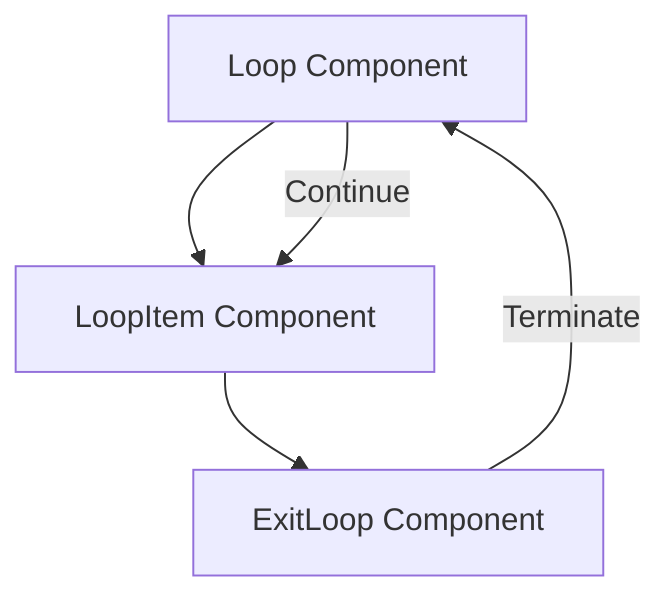
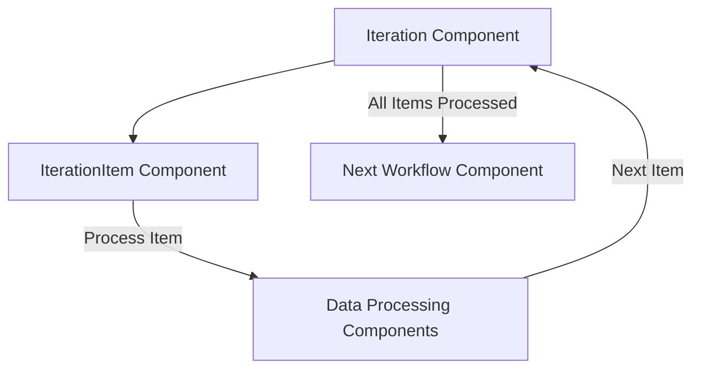
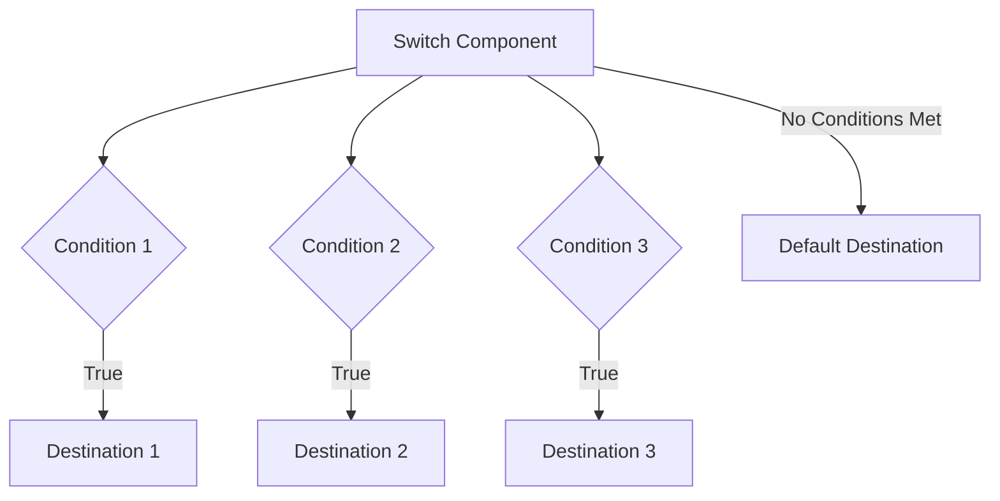
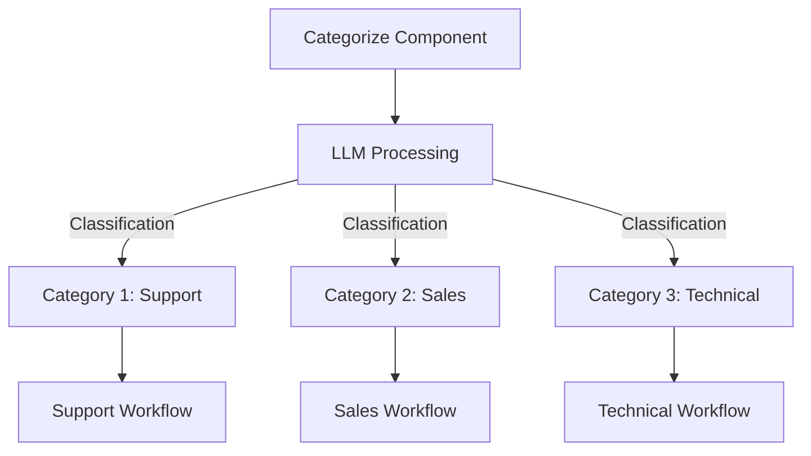
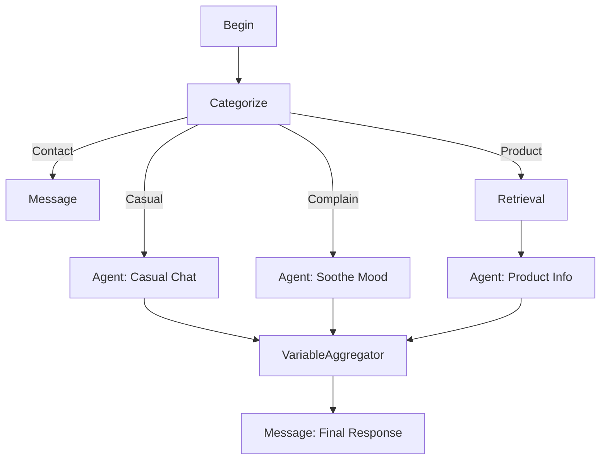
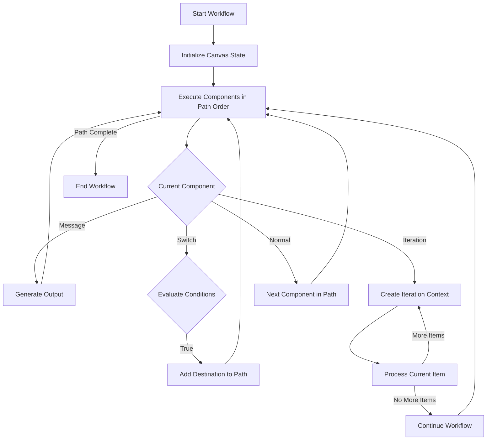
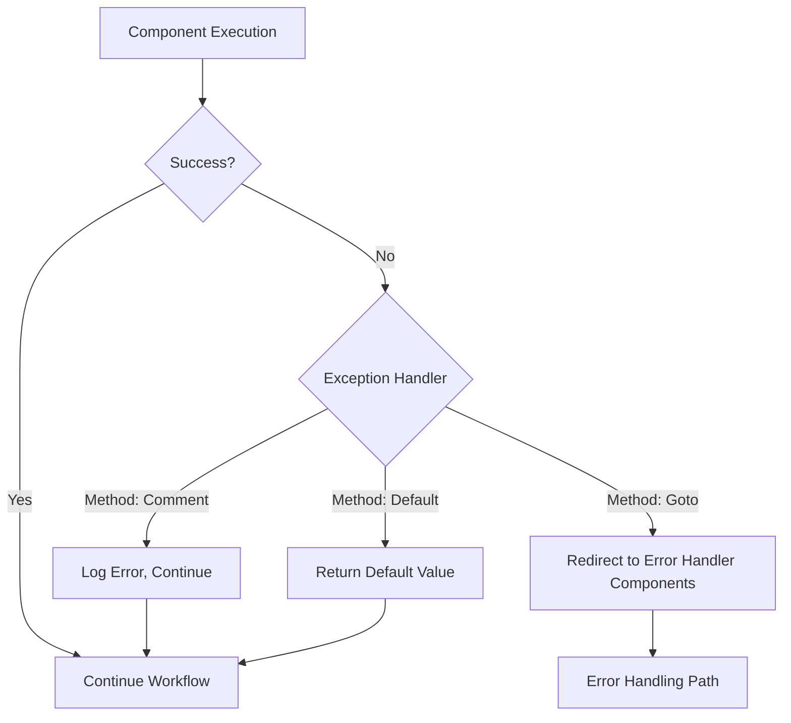

# Workflow Orchestration

<cite>
**Referenced Files in This Document**   
- [base.py](file://agent/component/base.py)
- [begin.py](file://agent/component/begin.py)
- [loop.py](file://agent/component/loop.py)
- [iteration.py](file://agent/component/iteration.py)
- [switch.py](file://agent/component/switch.py)
- [categorize.py](file://agent/component/categorize.py)
- [message.py](file://agent/component/message.py)
- [string_transform.py](file://agent/component/string_transform.py)
- [varaiable_aggregator.py](file://agent/component/varaiable_aggregator.py)
- [variable_assigner.py](file://agent/component/variable_assigner.py)
- [canvas.py](file://agent/canvas.py)
- [customer_service.json](file://agent/templates/customer_service.json)
- [deep_research.json](file://agent/templates/deep_research.json)
</cite>

## Table of Contents
1. [Introduction](#introduction)
2. [Core Workflow Components](#core-workflow-components)
3. [Control Flow Elements](#control-flow-elements)
4. [State Management and Data Flow](#state-management-and-data-flow)
5. [Workflow Templates and Execution](#workflow-templates-and-execution)
6. [Error Handling and Debugging](#error-handling-and-debugging)
7. [Best Practices for Workflow Design](#best-practices-for-workflow-design)
8. [Conclusion](#conclusion)

## Introduction
Workflow orchestration in RAGFlow agents enables the creation of complex, multi-step processes that chain together various agent components to accomplish sophisticated tasks. The system uses a visual canvas approach where components are connected to form workflows, with control flow elements determining the execution path. This document provides a comprehensive analysis of how these workflows are structured, executed, and managed, focusing on the core components that enable conditional branching, iteration, and state management across workflow steps.

The orchestration system is built around a component-based architecture where each component represents a specific operation or processing step. These components are connected in a directed graph that defines the workflow's execution path. The canvas system manages the execution of these workflows, handling state management, data flow between components, and control flow decisions based on component outputs.

**Section sources**
- [canvas.py](file://agent/canvas.py#L40-L793)
- [base.py](file://agent/component/base.py#L1-L583)

## Core Workflow Components

The RAGFlow agent workflow system consists of several core components that serve as building blocks for creating complex workflows. Each component has specific parameters and behaviors that determine its role in the workflow.

The **Begin** component serves as the entry point for workflows, initializing the execution context and handling user input. It sets up the initial state and can present a prologue message to users in conversational mode. The Begin component processes inputs from users, including text queries and file attachments, and passes them to subsequent components in the workflow.

The **Message** component is responsible for generating responses to users. It supports templated content with variable substitution, allowing dynamic message generation based on workflow state. The component can output random selections from multiple message options and supports content transformation to different formats like HTML, PDF, or DOCX through integration with document conversion tools.

The **StringTransform** component provides string manipulation capabilities, including splitting and merging operations. It can split strings based on delimiters or merge multiple values into a single string using templates. This component is essential for data preprocessing and formatting operations within workflows.

The **VariableAssigner** component enables dynamic state management by allowing workflows to modify variables during execution. It supports various operations like overwriting, appending, extending, and arithmetic operations on variables, providing fine-grained control over the workflow's state.

The **VariableAggregator** component collects and groups variables from different parts of the workflow, enabling consolidation of results from parallel processing branches. It can create named groups of variables, making it easier to manage complex state information.

**Section sources**
- [begin.py](file://agent/component/begin.py#L1-L60)
- [message.py](file://agent/component/message.py#L1-L267)
- [string_transform.py](file://agent/component/string_transform.py#L1-L116)
- [variable_assigner.py](file://agent/component/variable_assigner.py#L1-L192)
- [varaiable_aggregator.py](file://agent/component/varaiable_aggregator.py#L1-L85)

## Control Flow Elements

### Loop and Iteration Components

The workflow system provides two primary mechanisms for repetition: **Loop** and **Iteration** components. These components enable workflows to process collections of data or repeat operations until specific conditions are met.

The **Loop** component creates a repeating execution cycle that continues until explicitly terminated. It initializes loop variables and maintains state across iterations. The loop execution is controlled by child components, particularly the **ExitLoop** component, which signals when the loop should terminate. The Loop component establishes a parent-child relationship with its contained components, creating a scoped execution context for the loop body.



**Diagram sources**
- [loop.py](file://agent/component/loop.py#L1-L80)
- [loopitem.py](file://agent/component/loopitem.py)
- [exit_loop.py](file://agent/component/exit_loop.py)

The **Iteration** component is designed for processing collections of items. It references an array variable and creates a separate execution context for each item in the collection. The **IterationItem** component represents the body of the iteration and has access to the current item being processed. This pattern enables parallel processing of collection elements, with each iteration potentially executing independently.



**Diagram sources**
- [iteration.py](file://agent/component/iteration.py#L1-L72)
- [iterationitem.py](file://agent/component/iterationitem.py)

### Conditional Branching with Switch and Categorize

Conditional branching in RAGFlow workflows is implemented through **Switch** and **Categorize** components, which direct the workflow execution path based on runtime conditions.

The **Switch** component evaluates conditions and routes execution to different downstream components based on the results. It supports multiple comparison operators including equality, inequality, string containment, and numerical comparisons. The component processes a series of conditions, each with a logical operator (AND/OR) that determines how individual condition results are combined. When a condition evaluates to true, the workflow continues to the specified destination components.



**Diagram sources**
- [switch.py](file://agent/component/switch.py#L1-L141)

The **Categorize** component uses language models to classify input into predefined categories, enabling AI-driven decision making in workflows. It defines a set of categories with descriptions and examples, then uses an LLM to determine which category best matches the input. The component outputs the selected category name and routes the workflow to the components associated with that category. This enables sophisticated intent classification and routing based on natural language understanding.



**Diagram sources**
- [categorize.py](file://agent/component/categorize.py#L1-L149)

## State Management and Data Flow

### Variable Reference System

RAGFlow workflows use a sophisticated variable reference system to manage data flow between components. Variables are referenced using the syntax `{component_id@variable_name}` where `component_id` identifies the source component and `variable_name` specifies the output variable to access. This system enables components to access data produced by other components earlier in the workflow.

The canvas maintains a global state that includes both component outputs and system variables. System variables prefixed with `sys.` provide access to contextual information like the current user query (`sys.query`), conversation history, and user identity. Environment variables prefixed with `env.` allow access to configuration parameters and external data sources.

```mermaid
graph TD
Begin[Begin Component] --> |sys.query| Categorize[Categorize Component]
Categorize --> |category_name| Switch[Switch Component]
Retrieval[Retrieval Component] --> |formalized_content| Agent[Agent Component]
Agent --> |content| Message[Message Component]
Message --> |{Agent@content}| FinalOutput[Final Response]
```

**Diagram sources**
- [canvas.py](file://agent/canvas.py#L192-L237)
- [base.py](file://agent/component/base.py#L499-L510)

### Data Transformation and Operations

Data transformation in workflows is facilitated by components like **StringTransform** and **VariableAssigner**, which provide various operations for manipulating data during workflow execution.

The **StringTransform** component supports two primary modes: split and merge. In split mode, it divides a string into an array based on specified delimiters. In merge mode, it combines multiple values into a single string using templates with variable substitution. This component is particularly useful for parsing structured text data or formatting output for presentation.

The **VariableAssigner** component enables dynamic state modification through various operations:
- **Overwrite**: Replace a variable's value with another variable's value
- **Clear**: Reset a variable to its default empty state based on type
- **Set**: Assign a new value to a variable
- **Append/Extend**: Add elements to array variables
- **Remove First/Last**: Remove elements from array variables
- **Arithmetic Operations**: Perform addition, subtraction, multiplication, and division on numeric variables

These operations allow workflows to maintain and modify state dynamically, enabling complex processing patterns like counters, accumulators, and data aggregation.

**Section sources**
- [string_transform.py](file://agent/component/string_transform.py#L1-L116)
- [variable_assigner.py](file://agent/component/variable_assigner.py#L1-L192)
- [canvas.py](file://agent/canvas.py#L238-L268)

## Workflow Templates and Execution

### Template Structure and Definition

Workflow templates in RAGFlow are defined in JSON format, specifying the components, their parameters, and the connections between them. The template structure includes several key sections:

- **components**: Defines all components in the workflow with their IDs, parameters, and connections
- **graph**: Contains the visual layout information including node positions and edge connections
- **globals**: Specifies global variables and system settings for the workflow
- **dsl**: Contains the domain-specific language definition of the workflow logic

The customer service workflow template demonstrates a practical application of these concepts, using a **Categorize** component to classify user queries into different types (contact, casual, complain, product related) and routing them to specialized agents for processing. The workflow then aggregates responses from multiple agents using a **VariableAggregator** before delivering the final response.



**Diagram sources**
- [customer_service.json](file://agent/templates/customer_service.json)
- [deep_research.json](file://agent/templates/deep_research.json)

### Execution Engine and Runtime Behavior

The workflow execution engine, implemented in the **Canvas** class, manages the runtime behavior of workflows. It maintains the execution path, handles component invocation, and manages state transitions between components.

The execution process follows these steps:
1. Initialize the workflow with input parameters and global state
2. Start from the **Begin** component or first component in the path
3. Execute components sequentially, following the defined connections
4. Handle control flow decisions based on component outputs
5. Manage parallel execution paths when multiple downstream components exist
6. Aggregate results and produce final output

The engine uses a path-based execution model where the current execution path is maintained as a list of component IDs. As components execute, they may modify this path by adding new components to be executed, enabling dynamic workflow behavior based on runtime conditions.



**Diagram sources**
- [canvas.py](file://agent/canvas.py#L363-L632)

## Error Handling and Debugging

### Exception Management

RAGFlow workflows include comprehensive error handling mechanisms to ensure robust execution. Each component can define exception handling behavior through parameters that specify how to respond when errors occur.

The exception handling system supports three primary strategies:
- **Comment**: Log the error and continue execution
- **Goto**: Redirect execution to specific components when errors occur
- **Default Value**: Return a predefined default value instead of failing

Components can specify a `exception_goto` parameter that defines which components should be executed if an error occurs, enabling recovery workflows and fallback processing paths. The `exception_default_value` parameter allows components to return a safe default value when processing fails, preventing workflow termination due to transient errors.



**Diagram sources**
- [base.py](file://agent/component/base.py#L565-L579)

### Common Issues and Debugging

Several common issues can arise in complex workflows, particularly related to infinite loops, state corruption, and debugging challenges.

**Infinite loops** can occur when loop termination conditions are not properly defined or when the ExitLoop component is not correctly configured. To prevent this, workflows should include maximum iteration counts and timeout mechanisms. The Loop component's `maximum_loop_count` parameter provides a safeguard against infinite execution.

**State corruption** can happen when multiple components simultaneously modify shared variables without proper coordination. To avoid this, workflows should minimize shared mutable state and use immutable data patterns where possible. The VariableAssigner component's operations should be carefully sequenced to prevent race conditions in parallel execution paths.

**Debugging workflows** is facilitated by several features:
- Component inputs and outputs are logged at each step
- The canvas maintains a history of execution steps
- Partial results can be inspected during streaming operations
- Error messages include component context and execution path

The system also provides a `thoughts` method on components that returns a description of the component's intended behavior, helping to understand the expected workflow progression at each step.

**Section sources**
- [loop.py](file://agent/component/loop.py#L29)
- [canvas.py](file://agent/canvas.py#L457-L462)
- [base.py](file://agent/component/base.py#L581-L583)

## Best Practices for Workflow Design

### Design Principles

Effective workflow design in RAGFlow follows several key principles:

**Modularity**: Break complex workflows into smaller, reusable components. This improves maintainability and enables component reuse across different workflows.

**Clear Separation of Concerns**: Each component should have a single, well-defined responsibility. Avoid creating components that perform multiple unrelated operations.

**Explicit State Management**: Make data flow and state changes explicit in the workflow design. Avoid hidden dependencies between components that make the workflow difficult to understand.

**Error Resilience**: Design workflows to handle errors gracefully using appropriate exception handling strategies. Include fallback paths and default values to maintain workflow availability.

**Performance Considerations**: Minimize unnecessary data transformations and avoid redundant operations. Use streaming where possible to reduce memory usage and improve response times.

### Optimization Strategies

Several optimization strategies can improve workflow efficiency and maintainability:

**Parallel Processing**: Use independent processing branches to execute operations concurrently when possible. The workflow engine can execute multiple downstream components in parallel, reducing overall execution time.

**Caching**: Implement caching for expensive operations like LLM calls or external API requests. Store results in variables that can be reused across workflow executions.

**Conditional Execution**: Use conditional branching to avoid executing unnecessary components. Only process data that is relevant to the current workflow path.

**Batch Operations**: When processing collections, consider batch operations instead of individual item processing to reduce overhead.

**Resource Management**: Monitor and limit resource usage, particularly for components that consume significant computational resources like LLM calls or document processing.

**Section sources**
- [canvas.py](file://agent/canvas.py#L411-L444)
- [base.py](file://agent/component/base.py#L393-L446)

## Conclusion

RAGFlow's workflow orchestration system provides a powerful framework for creating complex, intelligent agent workflows. By combining control flow elements like loops, iterations, switches, and categorization with robust state management and data transformation capabilities, the system enables the creation of sophisticated multi-step processes that can handle a wide range of use cases.

The component-based architecture promotes modularity and reusability, while the visual canvas interface makes workflow design accessible. The execution engine efficiently manages workflow execution, handling both sequential and parallel processing patterns with comprehensive error handling and state management.

By following best practices in workflow design and leveraging the full capabilities of the orchestration system, developers can create intelligent agents that effectively solve complex problems through coordinated, multi-step reasoning and processing.