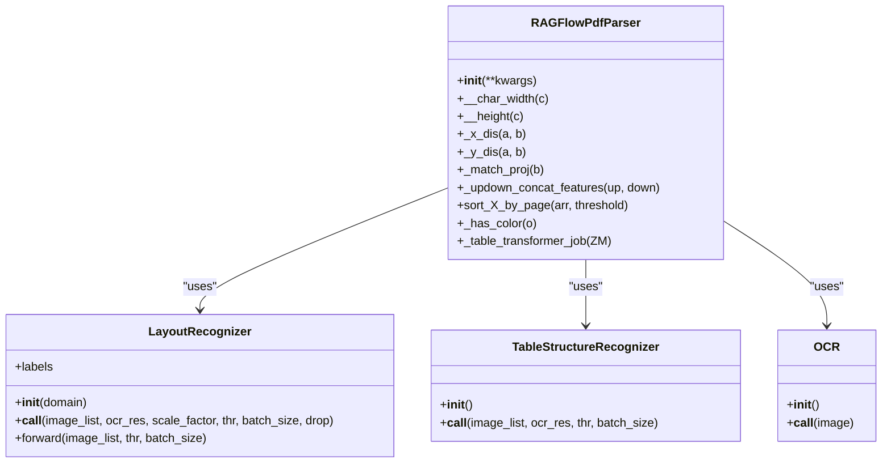
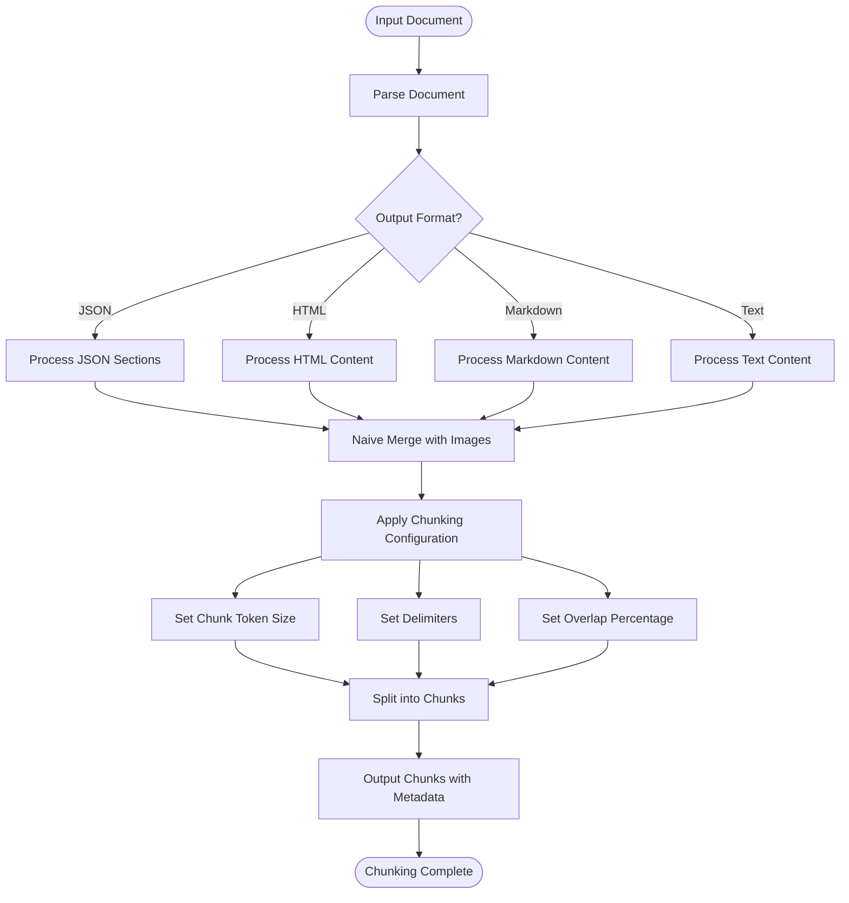
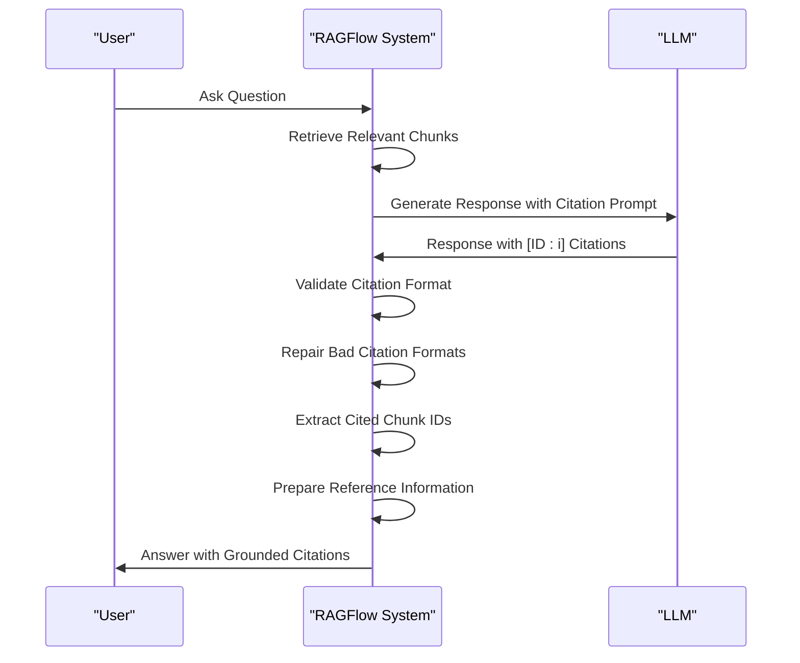
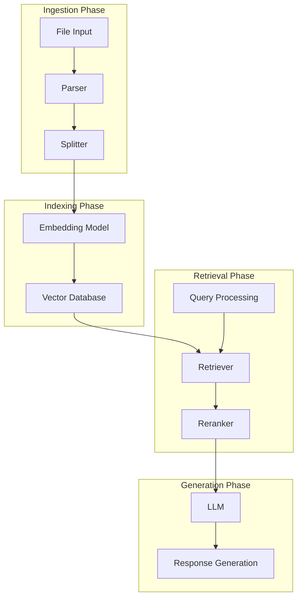
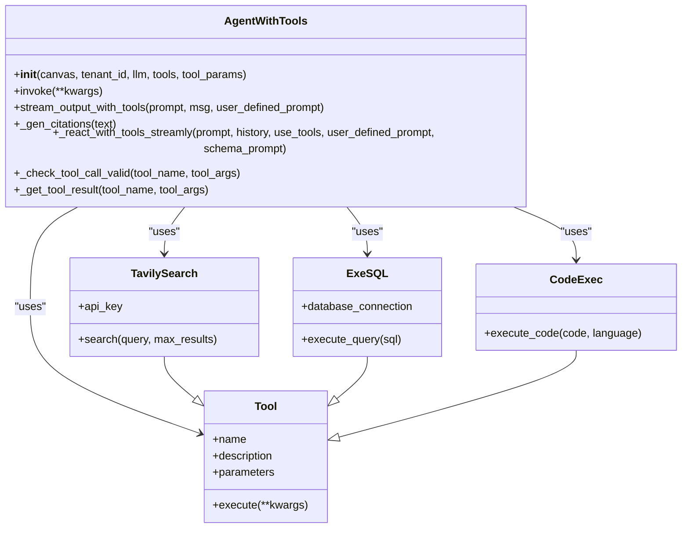
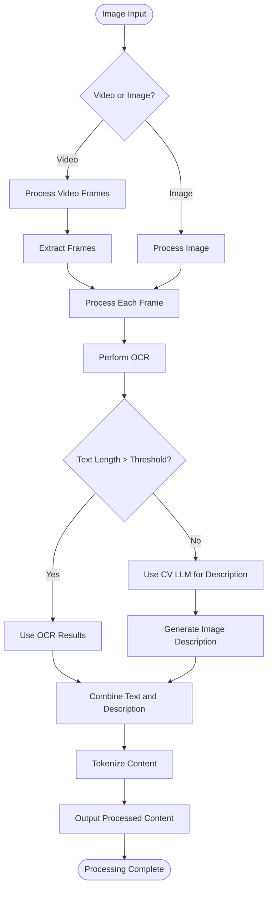
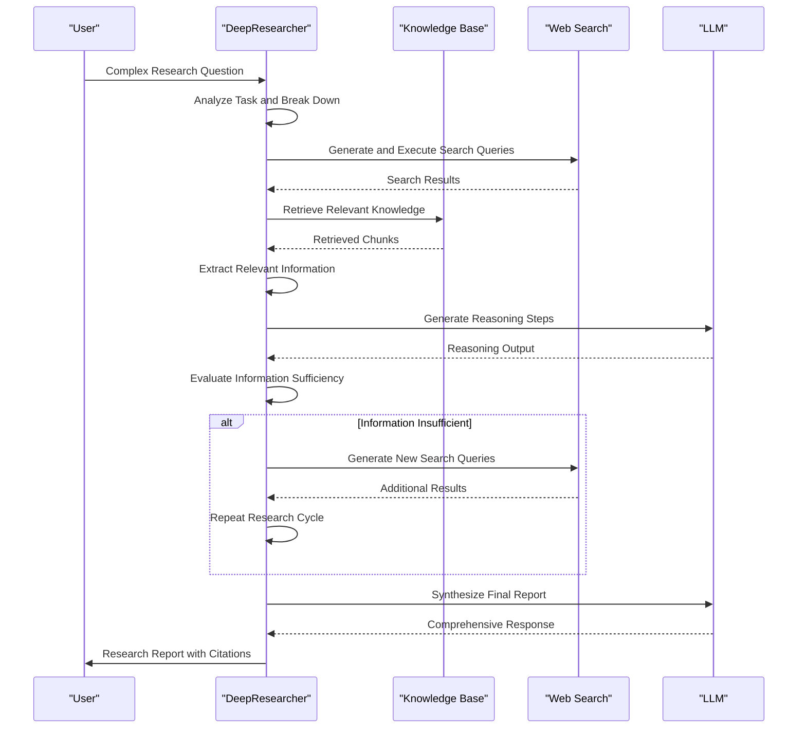

# Core Features

<cite>
**Referenced Files in This Document**   
- [README.md](file://README.md)
- [deepdoc/README.md](file://deepdoc/README.md)
- [rag/flow/tests/dsl_examples/general_pdf_all.json](file://rag/flow/tests/dsl_examples/general_pdf_all.json)
- [deepdoc/parser/pdf_parser.py](file://deepdoc/parser/pdf_parser.py)
- [rag/flow/splitter/splitter.py](file://rag/flow/splitter/splitter.py)
- [rag/nlp/search.py](file://rag/nlp/search.py)
- [rag/prompts/citation_prompt.md](file://rag/prompts/citation_prompt.md)
- [agent/component/agent_with_tools.py](file://agent/component/agent_with_tools.py)
- [rag/flow/pipeline.py](file://rag/flow/pipeline.py)
- [rag/app/picture.py](file://rag/app/picture.py)
- [rag/llm/cv_model.py](file://rag/llm/cv_model.py)
- [agentic_reasoning/deep_research.py](file://agentic_reasoning/deep_research.py)
- [agent/templates/deep_research.json](file://agent/templates/deep_research.json)
- [agent/templates/deep_search_r.json](file://agent/templates/deep_search_r.json)
- [docs/guides/chat/implement_deep_research.md](file://docs/guides/chat/implement_deep_research.md)
- [agent/test/dsl_examples/categorize_and_agent_with_tavily.json](file://agent/test/dsl_examples/categorize_and_agent_with_tavily.json)
- [agent/test/dsl_examples/headhunter_zh.json](file://agent/test/dsl_examples/headhunter_zh.json)
</cite>

## Table of Contents
1. [Introduction](#introduction)
2. [Deep Document Understanding with Specialized Parsers](#deep-document-understanding-with-specialized-parsers)
3. [Template-Based Intelligent Chunking](#template-based-intelligent-chunking)
4. [Grounded Citations with Reduced Hallucinations](#grounded-citations-with-reduced-hallucinations)
5. [Heterogeneous Data Source Compatibility](#heterogeneous-data-source-compatibility)
6. [Automated RAG Workflow Orchestration](#automated-rag-workflow-orchestration)
7. [Agent System with Tool Integration](#agent-system-with-tool-integration)
8. [Multi-Modal Processing Capabilities](#multi-modal-processing-capabilities)
9. [Advanced Reasoning Functions](#advanced-reasoning-functions)
10. [Feature Relationships and System Integration](#feature-relationships-and-system-integration)
11. [Practical Examples and Use Cases](#practical-examples-and-use-cases)
12. [Conclusion](#conclusion)

## Introduction

RAGFlow is an advanced open-source Retrieval-Augmented Generation (RAG) engine that combines cutting-edge RAG capabilities with agent-based functionality to create a superior context layer for Large Language Models (LLMs). The system offers a comprehensive solution for transforming complex, unstructured data into high-fidelity, production-ready AI systems with exceptional efficiency and precision. This document details the core features of RAGFlow, including deep document understanding, template-based chunking, grounded citations, heterogeneous data source compatibility, automated RAG workflow orchestration, and an agent system with tool integration. The documentation also covers multi-modal processing capabilities and advanced reasoning functions, providing both conceptual overviews for beginners and technical details for experienced developers.

**Section sources**
- [README.md](file://README.md#L73-L75)

## Deep Document Understanding with Specialized Parsers

RAGFlow's deep document understanding capability is powered by specialized parsers that extract knowledge from unstructured data with complex formats. The system employs different parsers for various document types, with the PDF parser being the most sophisticated due to the flexibility of the PDF format. The PDF parser outputs text chunks with their positions in the document, tables with cropped images and translated content, and figures with captions and text. The parser uses advanced techniques like layout recognition, optical character recognition (OCR), and table structure recognition to accurately extract content from documents.

The system supports multiple parsing methods including MinerU and Docling, allowing users to choose the most appropriate method for their documents. The parsing configuration is highly customizable, enabling users to specify different parsing methods for different document types. For example, PDFs can be parsed using the "deepdoc" method, while spreadsheets can be converted to HTML format, and Word documents can be processed to JSON output.

**Diagram sources**
- [deepdoc/parser/pdf_parser.py](file://deepdoc/parser/pdf_parser.py#L52-L200)
- [deepdoc/vision/layout_recognizer.py](file://deepdoc/vision/layout_recognizer.py#L33-L200)
- [deepdoc/vision/table_structure_recognizer.py](file://deepdoc/vision/table_structure_recognizer.py#L1-L50)
- [deepdoc/vision/ocr.py](file://deepdoc/vision/ocr.py#L1-L50)

**Section sources**
- [deepdoc/README.md](file://deepdoc/README.md#L107-L115)
- [rag/flow/tests/dsl_examples/general_pdf_all.json](file://rag/flow/tests/dsl_examples/general_pdf_all.json#L16-L47)

## Template-Based Intelligent Chunking

RAGFlow implements template-based intelligent chunking that allows for explainable and customizable text segmentation. The system provides multiple chunking templates to choose from, enabling users to optimize the chunking process for their specific use cases. The chunking process can be configured with various parameters including chunk token size, delimiters, and overlap percentage.

The splitter component in RAGFlow handles the chunking process, supporting different input formats such as markdown, text, HTML, and JSON. For structured content, the system can perform naive merging of text sections while preserving image references and positional information. The chunking process is designed to maintain context and coherence, with options for custom delimiters and hierarchical merging of content.

**Diagram sources**
- [rag/flow/splitter/splitter.py](file://rag/flow/splitter/splitter.py#L46-L152)
- [rag/nlp/__init__.py](file://rag/nlp/__init__.py#L1-L50)

**Section sources**
- [rag/flow/splitter/splitter.py](file://rag/flow/splitter/splitter.py#L29-L45)

## Grounded Citations with Reduced Hallucinations

RAGFlow implements a robust citation system designed to reduce hallucinations and provide grounded, traceable references in generated responses. The system automatically adds citations to responses using a standardized format [ID:i], where citations are placed at the end of sentences before punctuation. The citation system follows strict rules about what must be cited, including quantitative data, temporal claims, causal relationships, comparative statements, technical definitions, direct attributions, predictions/forecasts, and controversial claims.

The citation process is governed by a comprehensive prompt that specifies technical rules and citation requirements. The system ensures that only content from the provided context is cited, preventing the citation of non-existent sources. Citations are limited to a maximum of four per sentence, and the system strictly prohibits non-standard formatting. The citation system also includes functionality to repair improperly formatted citations and handle edge cases in the citation process.

**Diagram sources**
- [rag/prompts/citation_prompt.md](file://rag/prompts/citation_prompt.md#L1-L110)
- [api/db/services/dialog_service.py](file://api/db/services/dialog_service.py#L242-L563)

**Section sources**
- [rag/prompts/citation_prompt.md](file://rag/prompts/citation_prompt.md#L1-L110)

## Heterogeneous Data Source Compatibility

RAGFlow demonstrates extensive compatibility with heterogeneous data sources, supporting a wide range of document formats and data types. The system can process Word documents, slides, Excel files, plain text, images, scanned copies, structured data, web pages, and more. This broad compatibility is achieved through specialized parsers for each document type, allowing RAGFlow to extract meaningful information from diverse sources.

The system's architecture includes specific components for handling different data types, with dedicated parsers for PDF, DOCX, Excel, and PPT files. For web-based data sources, RAGFlow supports integration with platforms like Google Drive, Confluence, Notion, Discord, and S3, enabling seamless data synchronization. The system also supports multi-modal inputs, including video files and images, which are processed using computer vision models to extract textual content.

**Section sources**
- [README.md](file://README.md#L126-L128)
- [common/data_source/](file://common/data_source/#L1-L50)

## Automated RAG Workflow Orchestration

RAGFlow provides automated and effortless RAG workflow orchestration through its pipeline system, which streamlines the entire RAG process from document ingestion to response generation. The system offers configurable LLMs and embedding models, multiple recall methods paired with fused re-ranking, and intuitive APIs for seamless integration with business applications.

The pipeline architecture is implemented as a directed acyclic graph (DAG) where each component represents a processing step in the RAG workflow. Components are connected in a sequence that defines the data flow, with each component processing input from upstream components and passing results to downstream components. The pipeline system supports various RAG patterns including naive retrieval, hierarchical merging, and recursive summarization (RAPTOR).

**Diagram sources**
- [rag/flow/pipeline.py](file://rag/flow/pipeline.py#L28-L175)
- [README.md](file://README.md#L129-L134)

**Section sources**
- [rag/flow/pipeline.py](file://rag/flow/pipeline.py#L28-L175)

## Agent System with Tool Integration

RAGFlow features a sophisticated agent system with comprehensive tool integration capabilities, enabling autonomous agents to perform complex tasks by leveraging external tools and services. The agent system is built around the AgentWithTools component, which allows agents to use various tools such as web search, code execution, database queries, and API calls.

The agent system supports multiple tool types including TavilySearch for web search, ExeSQL for database queries, CodeExec for code execution, and various other tools for specific functions. Agents can be configured with a set of enabled tools, and the system handles tool calling, parameter passing, and result processing. The agent workflow includes steps for analyzing tasks, selecting appropriate tools, executing tool calls, and synthesizing results into coherent responses.

**Diagram sources**
- [agent/component/agent_with_tools.py](file://agent/component/agent_with_tools.py#L232-L349)
- [agent/tools/](file://agent/tools/#L1-L50)

**Section sources**
- [agent/component/agent_with_tools.py](file://agent/component/agent_with_tools.py#L1-L50)
- [agent/tools/](file://agent/tools/#L1-L50)

## Multi-Modal Processing Capabilities

RAGFlow incorporates advanced multi-modal processing capabilities that enable the system to handle and understand content across different modalities, particularly text and images. The system can process images within PDF or DOCX files using multi-modal models to extract meaningful information. For standalone image files, RAGFlow employs computer vision models to describe the visual content and convert it into textual representations.

The multi-modal processing pipeline begins with OCR (Optical Character Recognition) to extract text from images, followed by the use of vision-language models (VLMs) to generate descriptive captions. When the OCR results are concise, the system leverages CV (Computer Vision) LLMs to provide detailed descriptions of the images. The system supports various image formats and can handle both static images and video files, extracting frames and processing them for content understanding.

**Diagram sources**
- [rag/app/picture.py](file://rag/app/picture.py#L35-L90)
- [rag/llm/cv_model.py](file://rag/llm/cv_model.py#L594-L1008)

**Section sources**
- [rag/app/picture.py](file://rag/app/picture.py#L35-L90)

## Advanced Reasoning Functions

RAGFlow implements advanced reasoning functions through its Deep Research capability, which enables multi-step, structured investigations across diverse information sources. The Deep Research system conducts thorough analysis by breaking down complex questions into smaller sub-questions, retrieving relevant information, and synthesizing findings into comprehensive reports with clear citations.

The reasoning process follows a systematic approach that includes analyzing the initial query, generating search queries, retrieving and evaluating information, extracting relevant content, and iteratively refining the understanding. The system can handle multi-hop question answering, where the answer requires combining information from multiple sources or documents. The reasoning workflow is designed to mimic human research processes, with the ability to adjust search strategies based on intermediate findings.

**Diagram sources**
- [agentic_reasoning/deep_research.py](file://agentic_reasoning/deep_research.py#L27-L65)
- [agent/templates/deep_research.json](file://agent/templates/deep_research.json#L1-L727)

**Section sources**
- [agentic_reasoning/deep_research.py](file://agentic_reasoning/deep_research.py#L27-L65)
- [docs/guides/chat/implement_deep_research.md](file://docs/guides/chat/implement_deep_research.md#L16-L28)

## Feature Relationships and System Integration

The core features of RAGFlow work together in a cohesive system architecture where each component enhances the capabilities of others. The deep document understanding and specialized parsers feed into the template-based chunking system, which prepares content for the automated RAG workflow orchestration. The grounded citation system ensures that responses generated by the agent system are traceable and reliable, while the multi-modal processing capabilities expand the range of data sources that can be effectively utilized.

The agent system with tool integration serves as the orchestrator of these capabilities, coordinating the use of different features based on the specific requirements of each task. For example, when handling a complex research question, the agent might initiate deep document understanding to extract information from technical papers, use template-based chunking to organize the content, leverage web search tools for additional information, apply advanced reasoning to synthesize findings, and finally generate a response with grounded citations.

This integrated approach allows RAGFlow to handle complex, real-world scenarios that require multiple capabilities working in concert. The system's modular design enables features to be combined in various ways, creating customized workflows for different use cases while maintaining consistency in output quality and reliability.

**Section sources**
- [README.md](file://README.md#L73-L75)
- [rag/flow/pipeline.py](file://rag/flow/pipeline.py#L28-L175)

## Practical Examples and Use Cases

RAGFlow's features can be applied to various practical scenarios across different domains. For document processing, the system can handle complex documents like resumes, extracting structured data from unstructured text with various layouts. In customer service applications, RAGFlow can analyze customer reviews, categorize feedback, and generate appropriate responses based on company policies and product knowledge.

For agent workflows, the system can be configured to handle multi-step processes such as sales lead qualification, where an agent might first categorize incoming inquiries, then use web search tools to gather information about potential clients, and finally generate personalized outreach messages. In research scenarios, the deep research agent can conduct comprehensive market analysis by searching for industry trends, analyzing financial reports, and synthesizing findings into strategic recommendations.

In search and retrieval applications, RAGFlow can implement RAPTOR (Recursive Abstractive Processing for Tree-Organized Retrieval) to handle multi-hop question answering tasks. This involves clustering chunks by semantic similarity, recursively summarizing them into higher-level chunks, and forming a tree structure that captures both broad understanding and fine details necessary for complex reasoning.

**Section sources**
- [agent/templates/customer_review_analysis.json](file://agent/templates/customer_review_analysis.json#L1-L50)
- [agent/templates/customer_service.json](file://agent/templates/customer_service.json#L1-L50)
- [agent/templates/deep_research.json](file://agent/templates/deep_research.json#L1-L727)
- [docs/guides/dataset/enable_raptor.md](file://docs/guides/dataset/enable_raptor.md#L24-L36)

## Conclusion

RAGFlow represents a comprehensive RAG solution that integrates multiple advanced features into a cohesive system for building production-ready AI applications. The platform's deep document understanding, template-based chunking, grounded citations, heterogeneous data source compatibility, automated workflow orchestration, and agent system with tool integration work together to create a powerful context layer for LLMs. The system's multi-modal processing capabilities and advanced reasoning functions further enhance its ability to handle complex, real-world scenarios.

By combining these features, RAGFlow enables developers to transform complex data into high-fidelity AI systems with exceptional efficiency and precision. The modular architecture allows for flexible configuration and customization, making the platform adaptable to enterprises of any scale. As the system continues to evolve with new features and improvements, it remains at the forefront of RAG technology, providing a robust foundation for building sophisticated AI applications.

**Section sources**
- [README.md](file://README.md#L73-L75)
- [README.md](file://README.md#L108-L134)