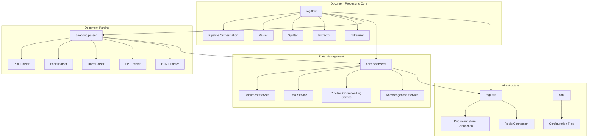
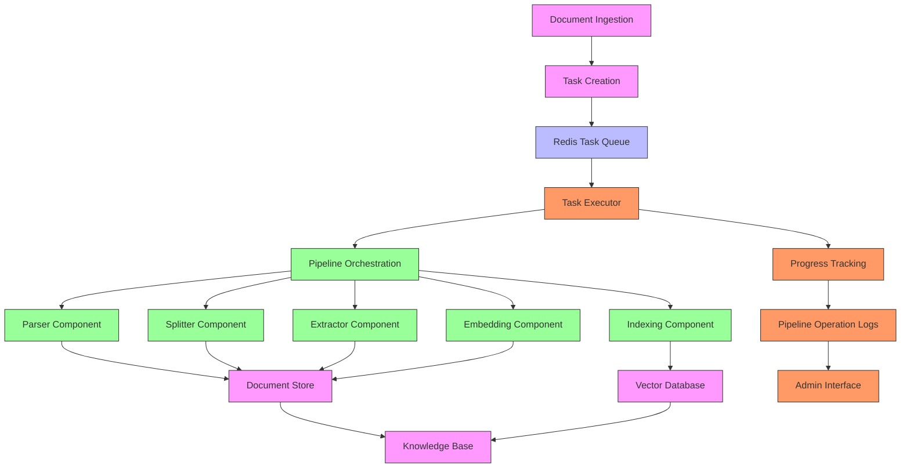
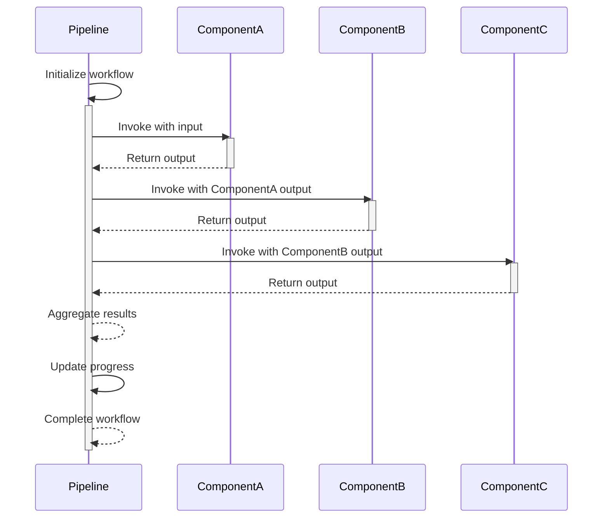
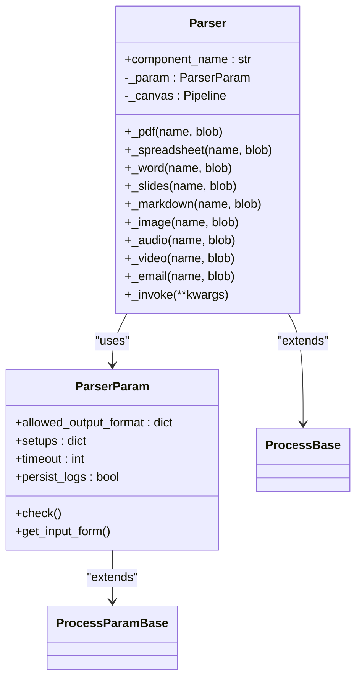
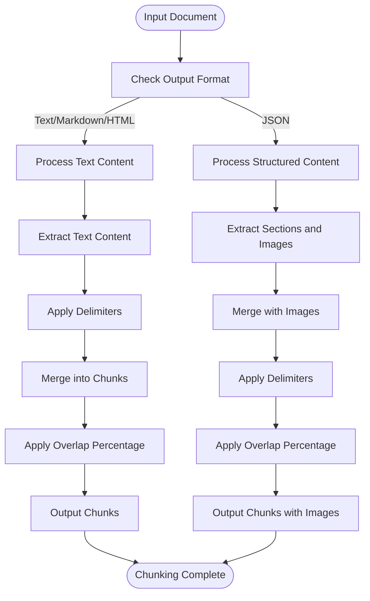
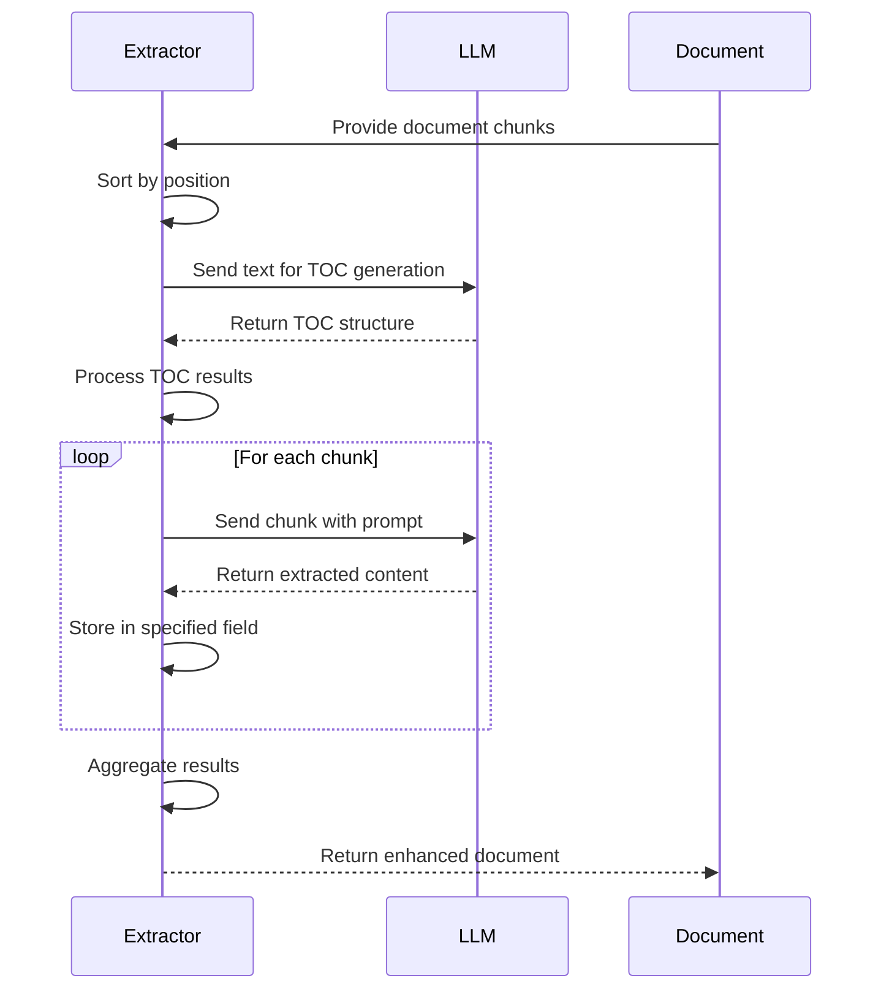
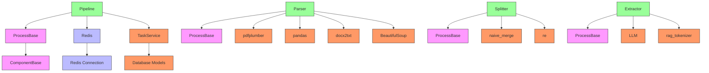

# Automated RAG Workflow

<cite>
**Referenced Files in This Document**   
- [task_executor.py](file://rag\svr\task_executor.py)
- [task_service.py](file://api\db\services\task_service.py)
- [pipeline.py](file://rag\flow\pipeline.py)
- [base.py](file://rag\flow\base.py)
- [parser.py](file://rag\flow\parser\parser.py)
- [splitter.py](file://rag\flow\splitter\splitter.py)
- [extractor.py](file://rag\flow\extractor\extractor.py)
- [pipeline_operation_log_service.py](file://api\db\services\pipeline_operation_log_service.py)
- [pdf_parser.py](file://deepdoc\parser\pdf_parser.py)
- [es_conn.py](file://rag\utils\es_conn.py)
- [opensearch_conn.py](file://rag\utils\opensearch_conn.py)
- [doc_store_conn.py](file://rag\utils\doc_store_conn.py)
</cite>

## Table of Contents
1. [Introduction](#introduction)
2. [Project Structure](#project-structure)
3. [Core Components](#core-components)
4. [Architecture Overview](#architecture-overview)
5. [Detailed Component Analysis](#detailed-component-analysis)
6. [Dependency Analysis](#dependency-analysis)
7. [Performance Considerations](#performance-considerations)
8. [Troubleshooting Guide](#troubleshooting-guide)
9. [Conclusion](#conclusion)

## Introduction
The Automated RAG Workflow in RAGFlow orchestrates the end-to-end document processing pipeline from ingestion to indexing. This system coordinates parsing, chunking, extraction, and embedding operations through a structured workflow that ensures documents are processed efficiently and accurately. The workflow is designed to handle various document types including PDFs, spreadsheets, word processors, presentations, images, audio, video, and emails. It leverages a modular architecture where each processing stage is implemented as a distinct component that can be configured and optimized independently. The system uses Redis as a message broker to manage task queues and coordinate distributed processing, ensuring scalability and fault tolerance. Pipeline execution is monitored through progress tracking and logging mechanisms that provide visibility into the processing status of each document.

## Project Structure
The RAGFlow project is organized into several key directories that reflect its modular architecture. The core document processing functionality resides in the `rag` directory, which contains the `flow` subdirectory for pipeline orchestration components. The `deepdoc` directory houses document parsing implementations, particularly for complex formats like PDFs. The `api` directory contains database services and models that manage document metadata and processing state. External integrations and tools are located in the `agent` and `common` directories. Configuration files in the `conf` directory define system settings and mappings for different document processing scenarios. The `web` directory contains the frontend application that provides a user interface for managing the RAG workflow. This structure enables clear separation of concerns between document processing logic, data management, and user interaction layers.

**Diagram sources**
- [rag\flow\pipeline.py](file://rag\flow\pipeline.py#L28-L37)
- [deepdoc\parser\pdf_parser.py](file://deepdoc\parser\pdf_parser.py#L52-L65)
- [api\db\services\task_service.py](file://api\db\services\task_service.py#L57-L71)
- [rag\utils\doc_store_conn.py](file://rag\utils\doc_store_conn.py#L180-L223)

**Section sources**
- [rag\flow\pipeline.py](file://rag\flow\pipeline.py#L1-L175)
- [deepdoc\parser\pdf_parser.py](file://deepdoc\parser\pdf_parser.py#L1-L200)
- [api\db\services\task_service.py](file://api\db\services\task_service.py#L1-L524)

## Core Components
The Automated RAG Workflow consists of several core components that work together to process documents. The Pipeline component orchestrates the overall workflow, coordinating the execution of various processing stages. The Parser component handles document format-specific parsing, extracting text and metadata from various file types. The Splitter component divides parsed content into appropriately sized chunks according to configurable parameters. The Extractor component performs semantic analysis and information extraction using language models. These components are connected through a directed acyclic graph (DAG) that defines their execution order and data flow. Each component implements a standardized interface that allows for consistent integration within the pipeline. The system also includes specialized components for handling specific document types like PDFs with complex layouts, spreadsheets with tabular data, and multimedia files.

**Section sources**
- [rag\flow\pipeline.py](file://rag\flow\pipeline.py#L28-L37)
- [rag\flow\parser\parser.py](file://rag\flow\parser\parser.py#L229-L777)
- [rag\flow\splitter\splitter.py](file://rag\flow\splitter\splitter.py#L46-L152)
- [rag\flow\extractor\extractor.py](file://rag\flow\extractor\extractor.py#L38-L109)

## Architecture Overview
The Automated RAG Workflow architecture is built around a modular, component-based design that enables flexible document processing pipelines. At the core is the Pipeline class that extends the Graph class from the agent.canvas module, providing a foundation for orchestrating component execution. Each processing stage is implemented as a component that inherits from ProcessBase, which provides common functionality for progress tracking, error handling, and output management. The workflow is configured through JSON-based DSL (Domain Specific Language) definitions that specify the sequence of operations and their parameters. Document processing tasks are managed by the TaskService, which creates and tracks individual processing jobs. The system uses Redis as a distributed task queue to coordinate processing across multiple worker instances. Document storage and retrieval are handled through the STORAGE_IMPL interface, which supports various backend storage systems. The architecture supports both synchronous and asynchronous processing modes, allowing for efficient handling of large document collections.

**Diagram sources**
- [rag\svr\task_executor.py](file://rag\svr\task_executor.py#L164-L200)
- [rag\flow\pipeline.py](file://rag\flow\pipeline.py#L117-L175)
- [api\db\services\task_service.py](file://api\db\services\task_service.py#L326-L425)
- [rag\utils\doc_store_conn.py](file://rag\utils\doc_store_conn.py#L219-L223)

## Detailed Component Analysis

### Pipeline Orchestration
The Pipeline component serves as the central orchestrator of the document processing workflow. It extends the Graph class and implements the run method that executes the sequence of processing components according to the defined workflow. The pipeline maintains execution state through the path attribute, which tracks the current position in the workflow. Progress is reported through the callback method, which updates task progress and logs execution details. The pipeline handles error conditions by catching exceptions and marking the task as failed. It also supports cancellation through integration with the Redis-based task management system. The pipeline's run method uses Trio for asynchronous execution, allowing for efficient concurrency while maintaining clean code structure. Input data flows from one component to the next, with each component's output becoming the input for subsequent components.

**Diagram sources**
- [rag\flow\pipeline.py](file://rag\flow\pipeline.py#L117-L175)
- [rag\flow\base.py](file://rag\flow\base.py#L41-L61)

**Section sources**
- [rag\flow\pipeline.py](file://rag\flow\pipeline.py#L28-L37)

### Document Parsing
The Parser component handles the extraction of text and metadata from various document formats. It supports multiple document types through a configuration-driven approach, with different parsing methods available for each format. For PDF documents, the parser can use different engines including DeepDOC for layout-aware parsing, plain text extraction, or VLM (Vision Language Model) for image-based content analysis. The parser configuration includes settings for output format (JSON, markdown, or HTML), language specification, and table/image context size. The parser integrates with specialized document parsing libraries like pdfplumber for PDFs and pandas for spreadsheets. For complex documents, the parser can preserve structural information including page numbers, coordinates, and layout types. The parser also handles media context attachment, ensuring that tables and images are properly contextualized within the extracted text.

**Diagram sources**
- [rag\flow\parser\parser.py](file://rag\flow\parser\parser.py#L229-L777)
- [rag\flow\parser\parser.py](file://rag\flow\parser\parser.py#L44-L227)

**Section sources**
- [rag\flow\parser\parser.py](file://rag\flow\parser\parser.py#L229-L777)

### Text Chunking
The Splitter component divides parsed document content into appropriately sized chunks for downstream processing. It uses configurable parameters including chunk token size, delimiters, and overlap percentage to control the chunking process. The splitter supports multiple input formats including plain text, markdown, HTML, and structured JSON. For text-based inputs, it applies naive merging algorithms that respect specified delimiters while maintaining chunk size constraints. The splitter also handles image context by preserving references to associated images and their positions within the document. Custom delimiters can be defined for specialized chunking requirements, allowing for domain-specific segmentation rules. The component implements overlap functionality to ensure context continuity between adjacent chunks, which is particularly important for maintaining semantic coherence in downstream tasks like retrieval and generation.

**Diagram sources**
- [rag\flow\splitter\splitter.py](file://rag\flow\splitter\splitter.py#L46-L152)
- [rag\nlp\naive_merge.py](file://rag\nlp\naive_merge.py#L1-L100)

**Section sources**
- [rag\flow\splitter\splitter.py](file://rag\flow\splitter\splitter.py#L46-L152)

### Information Extraction
The Extractor component performs semantic analysis and information extraction using language models. It can generate various types of structured information from document content, including table of contents, keywords, questions, and custom fields. The extractor integrates with LLM (Large Language Model) services through the LLMBundle interface, allowing for flexible model selection and configuration. For table of contents generation, the extractor uses a specialized workflow that sorts document sections by position and applies a language model to identify hierarchical structure. The component supports custom field extraction by applying prompts to document chunks and capturing the results in specified output fields. Error handling is implemented to manage LLM failures and ensure pipeline continuity. The extractor also handles result aggregation, combining outputs from multiple chunks into a cohesive structure.

**Diagram sources**
- [rag\flow\extractor\extractor.py](file://rag\flow\extractor\extractor.py#L38-L109)
- [rag\prompts\generator.py](file://rag\prompts\generator.py#L1-L50)

**Section sources**
- [rag\flow\extractor\extractor.py](file://rag\flow\extractor\extractor.py#L38-L109)

## Dependency Analysis
The Automated RAG Workflow components have well-defined dependencies that enable modular design and flexible configuration. The Pipeline component depends on the ProcessBase class for core functionality and on Redis for task coordination. The Parser component relies on format-specific parsing libraries like pdfplumber for PDFs and openpyxl for Excel files. The Splitter component depends on the naive_merge utility functions for text segmentation. The Extractor component requires LLM services for semantic analysis. All components share dependencies on common utilities for logging, configuration management, and data serialization. The system uses Redis as a central coordination point, with components publishing progress updates and retrieving task information through Redis operations. Document storage is abstracted through the STORAGE_IMPL interface, allowing for different backend implementations. The dependency structure enables independent development and testing of components while ensuring consistent integration through well-defined interfaces.

**Diagram sources**
- [rag\flow\pipeline.py](file://rag\flow\pipeline.py#L28-L37)
- [rag\flow\parser\parser.py](file://rag\flow\parser\parser.py#L229-L777)
- [rag\flow\splitter\splitter.py](file://rag\flow\splitter\splitter.py#L46-L152)
- [rag\flow\extractor\extractor.py](file://rag\flow\extractor\extractor.py#L38-L109)
- [rag\utils\redis_conn.py](file://rag\utils\redis_conn.py#L1-L50)

**Section sources**
- [rag\flow\pipeline.py](file://rag\flow\pipeline.py#L28-L37)
- [rag\flow\parser\parser.py](file://rag\flow\parser\parser.py#L229-L777)
- [rag\flow\splitter\splitter.py](file://rag\flow\splitter\splitter.py#L46-L152)
- [rag\flow\extractor\extractor.py](file://rag\flow\extractor\extractor.py#L38-L109)

## Performance Considerations
The Automated RAG Workflow is designed with performance optimization in mind, particularly for handling large document collections. The system uses asynchronous processing with Trio to maximize throughput while minimizing resource utilization. Task parallelization is controlled through configurable semaphores that limit concurrent operations based on system capacity. The chunking process is optimized to balance chunk size with semantic coherence, avoiding both excessive fragmentation and overly large chunks that may exceed model context limits. Embedding operations are batched to improve efficiency, with configurable batch sizes that can be tuned based on available GPU memory. The system implements caching mechanisms for frequently accessed resources like LLM instances and document parsers. Progress tracking is optimized to minimize database writes while providing sufficient visibility into processing status. The architecture supports horizontal scaling through multiple task executor instances that can process documents in parallel.

## Troubleshooting Guide
Common issues in the Automated RAG Workflow typically relate to configuration errors, resource limitations, or external service connectivity. Pipeline failures can occur due to incorrect component configuration, missing dependencies, or invalid input data. To diagnose such issues, check the pipeline operation logs which provide detailed progress information and error messages. Task processing failures may result from Redis connectivity issues, which can be verified by checking the Redis server status and connection parameters. Document parsing errors often stem from unsupported file formats or corrupted files, so validate input documents before processing. Memory-related issues can occur during embedding operations, which can be mitigated by reducing batch sizes or processing fewer documents concurrently. For LLM integration problems, verify API keys and endpoint configurations. The system provides comprehensive logging that can be used to trace the execution flow and identify the source of failures.

**Section sources**
- [rag\svr\task_executor.py](file://rag\svr\task_executor.py#L132-L162)
- [api\db\services\pipeline_operation_log_service.py](file://api\db\services\pipeline_operation_log_service.py#L95-L194)
- [rag\utils\redis_conn.py](file://rag\utils\redis_conn.py#L1-L50)

## Conclusion
The Automated RAG Workflow in RAGFlow provides a comprehensive solution for end-to-end document processing, from ingestion to indexing. Its modular architecture enables flexible configuration and extension, while its robust error handling and monitoring capabilities ensure reliable operation. The system effectively coordinates parsing, chunking, extraction, and embedding operations through a well-defined pipeline that can be customized for different use cases. By leveraging asynchronous processing and distributed task management, the workflow achieves high throughput and scalability. The integration of multiple document parsing methods and LLM-powered extraction capabilities makes it suitable for processing diverse document collections. With proper configuration and monitoring, the Automated RAG Workflow can serve as a reliable foundation for building sophisticated retrieval-augmented generation applications.