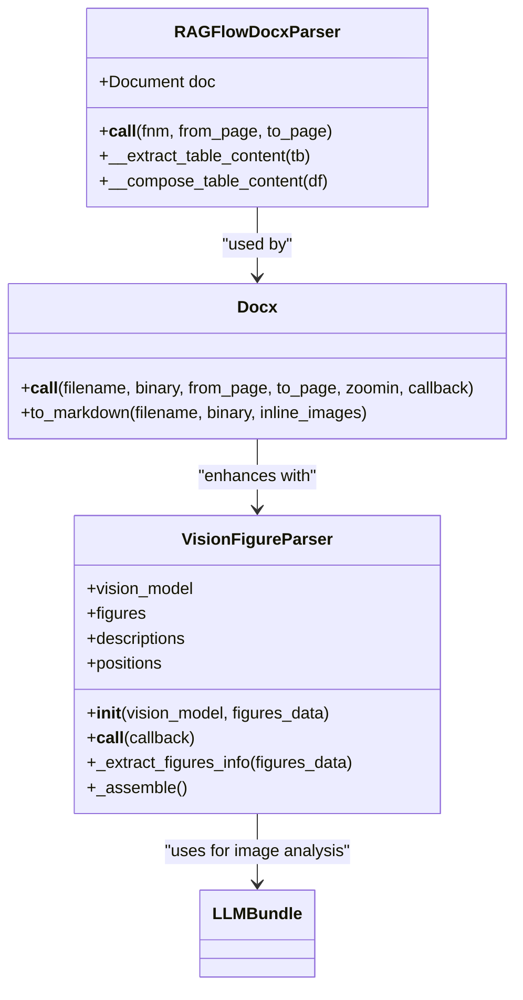
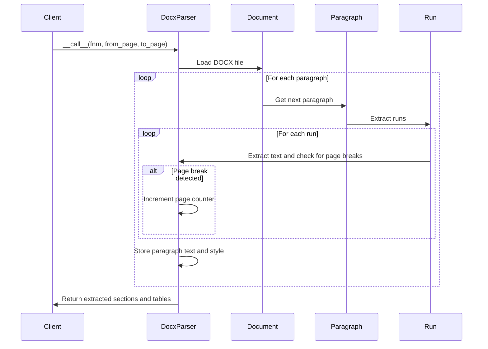
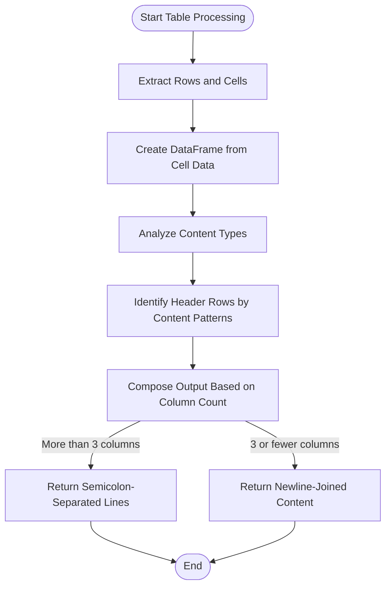
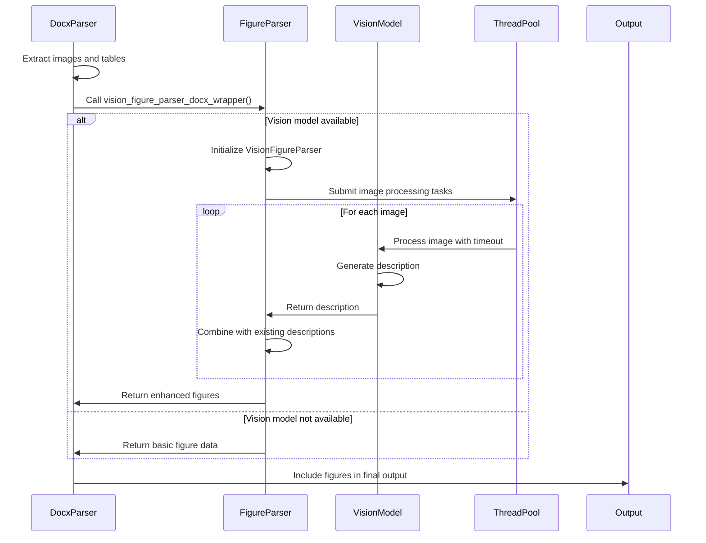
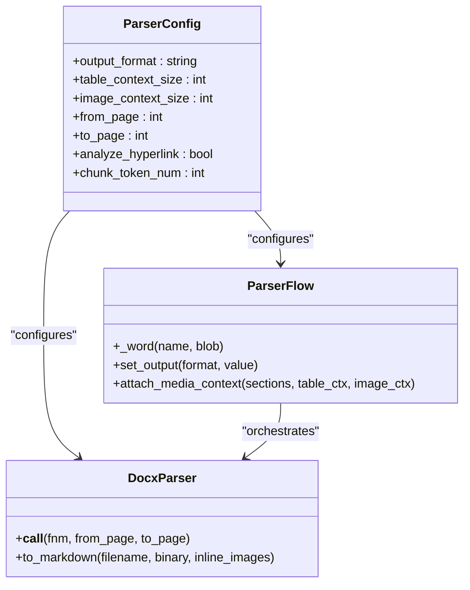
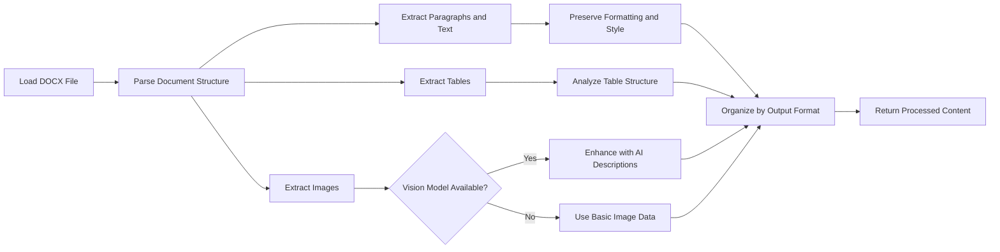

# DOCX Document Parsing

<cite>
**Referenced Files in This Document**   
- [docx_parser.py](file://deepdoc/parser/docx_parser.py)
- [figure_parser.py](file://deepdoc/parser/figure_parser.py)
- [naive.py](file://rag/app/naive.py)
- [parser.py](file://rag/flow/parser/parser.py)
- [utils.py](file://deepdoc/parser/utils.py)
</cite>

## Table of Contents
1. [Introduction](#introduction)
2. [Core Architecture](#core-architecture)
3. [Text Extraction and Structure Preservation](#text-extraction-and-structure-preservation)
4. [Table Processing](#table-processing)
5. [Image and Figure Handling](#image-and-figure-handling)
6. [Configuration Options](#configuration-options)
7. [Handling Complex DOCX Features](#handling-complex-docx-features)
8. [Error Handling and Compatibility](#error-handling-and-compatibility)
9. [Parsing Pipeline](#parsing-pipeline)
10. [Conclusion](#conclusion)

## Introduction

RAGFlow's DOCX document parsing capability provides comprehensive processing of Microsoft Word documents for retrieval-augmented generation applications. The system extracts text content while preserving document structure, formatting elements, and complex components like tables and images. Built on the python-docx library, the parser handles both simple text extraction and sophisticated document analysis with multiple output formats including JSON and Markdown. The architecture supports large documents, password-protected files, and various Word versions while maintaining high fidelity in content extraction.

**Section sources**
- [docx_parser.py](file://deepdoc/parser/docx_parser.py#L1-L140)

## Core Architecture

The DOCX parsing system in RAGFlow follows a modular architecture with specialized components for different document elements. At its core is the `RAGFlowDocxParser` class that orchestrates the parsing process, extracting text, tables, and other elements from DOCX files. The architecture integrates with the broader RAGFlow ecosystem through the `Docx` class in the naive module, which serves as the primary interface for DOCX processing.

The system employs a two-layer approach: low-level parsing using python-docx for direct DOCX file manipulation and high-level processing for content organization and enhancement. For image analysis, the system can integrate with vision models through the `VisionFigureParser` when configured, providing enhanced figure description capabilities. The parsing process is designed to be memory-efficient, handling large documents by processing content incrementally rather than loading everything into memory at once.

**Diagram sources **
- [docx_parser.py](file://deepdoc/parser/docx_parser.py#L25-L140)
- [figure_parser.py](file://deepdoc/parser/figure_parser.py#L81-L148)
- [naive.py](file://rag/app/naive.py#L672-L674)

**Section sources**
- [docx_parser.py](file://deepdoc/parser/docx_parser.py#L25-L140)
- [naive.py](file://rag/app/naive.py#L672-L683)
- [figure_parser.py](file://deepdoc/parser/figure_parser.py#L81-L148)

## Text Extraction and Structure Preservation

The DOCX parser extracts text content while preserving the document's structural hierarchy and formatting. The `__call__` method in `RAGFlowDocxParser` processes paragraphs sequentially, maintaining the original document order. Each paragraph's text is extracted along with its style information, which is captured through the `p.style.name` attribute. This preserves heading levels, emphasis, and other formatting that indicates document structure.

Page boundaries are detected by examining the XML representation of runs within paragraphs, specifically looking for 'lastRenderedPageBreak' markers. This allows the parser to maintain page-level context when processing multi-page documents. The text extraction process handles DOCX files either from file paths or binary data, with the latter enabling processing of documents streamed from external sources without requiring temporary file storage.

For documents with complex layouts, the parser processes content in runs rather than complete paragraphs, preserving formatting changes within paragraphs such as bold, italic, or different fonts. This run-level processing ensures that inline formatting is not lost during extraction, maintaining the semantic meaning conveyed by text styling in the original document.

**Diagram sources **
- [docx_parser.py](file://deepdoc/parser/docx_parser.py#L116-L139)

**Section sources**
- [docx_parser.py](file://deepdoc/parser/docx_parser.py#L116-L139)

## Table Processing

The DOCX parser includes sophisticated table processing capabilities that extract tabular data while preserving its semantic meaning. The `__extract_table_content` method processes each table by iterating through rows and cells, converting the table to a pandas DataFrame for further analysis. The `__compose_table_content` method then analyzes the table structure to identify headers and organize data appropriately.

The table processing algorithm employs a content-type analysis system that categorizes cell content into types such as dates (Dt), numbers (Nu), Chinese text (Ca), English text (En), and others. This classification helps determine the table's structure, particularly in identifying header rows. For tables with multiple header rows, the parser analyzes content patterns across rows to distinguish between header and data rows, even when formatting is inconsistent.

The output format varies based on table complexity: tables with more than three columns are returned as semicolon-separated lines, while narrower tables are joined with newlines. This adaptive approach ensures optimal representation of tabular data in the output, maintaining readability while preserving the relationships between data elements. The parser also handles merged cells and nested tables, though with some limitations based on the underlying python-docx library's capabilities.

**Diagram sources **
- [docx_parser.py](file://deepdoc/parser/docx_parser.py#L27-L114)

**Section sources**
- [docx_parser.py](file://deepdoc/parser/docx_parser.py#L27-L114)

## Image and Figure Handling

RAGFlow's DOCX parser provides comprehensive image and figure handling through a multi-stage processing pipeline. The base parser extracts images embedded in DOCX files, while the optional vision enhancement system can provide detailed descriptions of visual content using AI models. The `vision_figure_parser_docx_wrapper` function serves as the integration point between the DOCX parser and the vision analysis system.

When a vision model is available, the parser can enhance figure extraction by generating descriptive text for images. This process involves extracting image data from the DOCX file, passing it to the vision model through the `VisionFigureParser`, and incorporating the generated descriptions into the output. The system uses a thread pool executor to process multiple images concurrently, improving performance on documents with numerous figures.

The image processing pipeline handles various image formats embedded in DOCX files, including JPEG, PNG, and other common formats. For documents with complex figure layouts, the parser attempts to preserve positional information when available, allowing downstream applications to understand the relationship between figures and surrounding text. The system also handles image metadata and alternative text when present in the original document.

**Diagram sources **
- [figure_parser.py](file://deepdoc/parser/figure_parser.py#L38-L52)
- [figure_parser.py](file://deepdoc/parser/figure_parser.py#L123-L147)

**Section sources**
- [figure_parser.py](file://deepdoc/parser/figure_parser.py#L38-L52)
- [figure_parser.py](file://deepdoc/parser/figure_parser.py#L123-L147)

## Configuration Options

The DOCX parsing system offers several configuration options to control its behavior and output format. These options are accessible through the parser's configuration parameters and can be adjusted based on specific use cases and document characteristics. The primary configuration options include output format selection, table and image context sizing, and page range specification.

The output format can be configured as JSON, Markdown, or HTML, with JSON being the default for structured data extraction and Markdown preferred for preserving document formatting in a human-readable format. For JSON output, the `table_context_size` and `image_context_size` parameters control how much surrounding text context is included with tables and images, helping to maintain the relationship between visual elements and their textual descriptions.

Page range parameters (`from_page` and `to_page`) allow processing of specific document sections rather than the entire document, which is useful for large files or when only certain sections are relevant. The system also supports configuration of the vision model integration, enabling or disabling enhanced figure analysis based on available resources and requirements. These configuration options can be set programmatically or through the RAGFlow API, providing flexibility for different deployment scenarios.

**Diagram sources **
- [parser.py](file://rag/flow/parser/parser.py#L440-L459)
- [naive.py](file://rag/app/naive.py#L364-L402)

**Section sources**
- [parser.py](file://rag/flow/parser/parser.py#L440-L459)
- [naive.py](file://rag/app/naive.py#L364-L402)

## Handling Complex DOCX Features

RAGFlow's DOCX parser addresses several complex features found in real-world Word documents. For password-protected files, the system includes error handling that gracefully manages decryption failures, allowing the application to respond appropriately to protected documents. The parser also handles embedded objects and OLE (Object Linking and Embedding) content through the `extract_embed_file` utility function, which can extract embedded files from DOCX containers.

Hyperlink analysis is supported through the `extract_links_from_docx` function, which parses the DOCX XML structure to identify and extract all hyperlinks in the document. This enables the system to process linked content as part of the document analysis, either by following links during parsing or by including them as metadata in the output. The parser also handles track changes and comments when present in the document structure, though this functionality depends on the underlying python-docx library's capabilities.

For documents with complex layouts, the parser includes fixes for known issues with the python-docx library, such as the "word/NULL" archive entry problem. The system overrides the `load_from_xml` method with a custom implementation that skips invalid NULL references, preventing parsing failures on documents that might otherwise be unreadable. This robust error handling ensures compatibility with a wide range of DOCX files, including those created by different versions of Microsoft Word and other word processors.

**Section sources**
- [naive.py](file://rag/app/naive.py#L670-L672)
- [file_utils.py](file://rag/utils/file_utils.py#L85-L147)
- [naive.py](file://rag/app/naive.py#L658-L669)

## Error Handling and Compatibility

The DOCX parsing system implements comprehensive error handling to ensure robust processing of diverse document types and conditions. The parser is designed to handle corrupted or malformed DOCX files by implementing try-catch blocks around critical operations and providing fallback mechanisms when specific parsing methods fail. This fault-tolerant design allows the system to extract as much content as possible from problematic documents rather than failing completely.

Compatibility with different Word versions is maintained through the use of the python-docx library, which supports DOCX files from Word 2007 onwards. The parser handles variations in DOCX structure across versions by focusing on the core OpenXML elements that remain consistent across releases. For older DOC format files, the system relies on external conversion tools, but the DOCX parser itself is optimized for the modern XML-based format.

Memory management is a key consideration, especially for large documents. The parser processes content incrementally rather than loading the entire document into memory, reducing the risk of out-of-memory errors. The system also includes timeout mechanisms for operations that might hang, such as image analysis with external vision models. These timeouts prevent the parsing process from becoming unresponsive when dealing with problematic content.

**Section sources**
- [naive.py](file://rag/app/naive.py#L670-L672)
- [figure_parser.py](file://deepdoc/parser/figure_parser.py#L49-L52)
- [file_utils.py](file://rag/utils/file_utils.py#L81-L83)

## Parsing Pipeline

The DOCX parsing pipeline in RAGFlow follows a structured sequence of operations that transform raw DOCX files into processed content suitable for retrieval and generation tasks. The pipeline begins with document loading, where the file is opened either from a path or binary data stream. This is followed by structural analysis, where the parser identifies paragraphs, tables, and other document elements.

The core processing phase extracts text content paragraph by paragraph, preserving formatting and style information. Simultaneously, tables are extracted and processed through the table analysis algorithm to preserve their structure and meaning. After text and table extraction, the pipeline handles images and figures, optionally enhancing them with AI-generated descriptions when configured.

The final stage of the pipeline organizes the extracted content according to the specified output format, adding context around tables and images as configured. The completed content is then returned to the calling application, ready for indexing, chunking, or direct use in retrieval-augmented generation workflows. This pipeline design ensures consistent, reliable processing of DOCX documents while maintaining flexibility for different use cases and configuration options.

**Diagram sources **
- [naive.py](file://rag/app/naive.py#L672-L674)
- [parser.py](file://rag/flow/parser/parser.py#L444-L456)
- [figure_parser.py](file://deepdoc/parser/figure_parser.py#L38-L52)

**Section sources**
- [naive.py](file://rag/app/naive.py#L672-L683)
- [parser.py](file://rag/flow/parser/parser.py#L444-L459)

## Conclusion

RAGFlow's DOCX document parsing capability provides a robust, flexible solution for extracting content from Microsoft Word documents in retrieval-augmented generation applications. The system combines reliable text extraction with sophisticated handling of tables, images, and complex document features, making it suitable for processing a wide range of DOCX files encountered in real-world scenarios.

The architecture balances simplicity and power, using the well-established python-docx library as its foundation while extending its capabilities with custom algorithms for table analysis, vision integration, and error handling. The configurable output formats and processing options allow the parser to adapt to different use cases, from simple text extraction to comprehensive document analysis with AI-enhanced figure descriptions.

By addressing common challenges such as corrupted files, password protection, and compatibility across Word versions, the DOCX parser ensures high reliability in production environments. Its integration with the broader RAGFlow ecosystem enables seamless processing of DOCX content alongside other document types, providing a unified interface for document analysis and information retrieval.