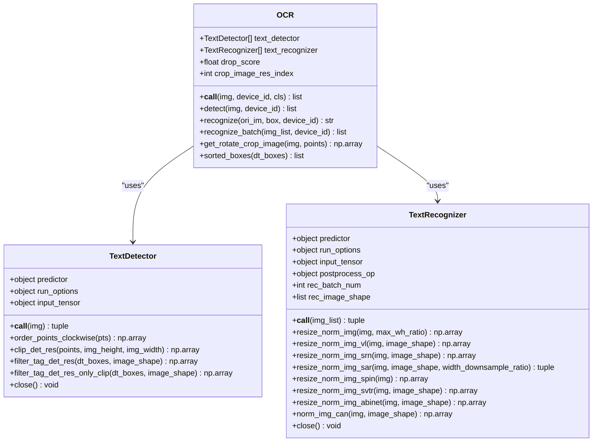
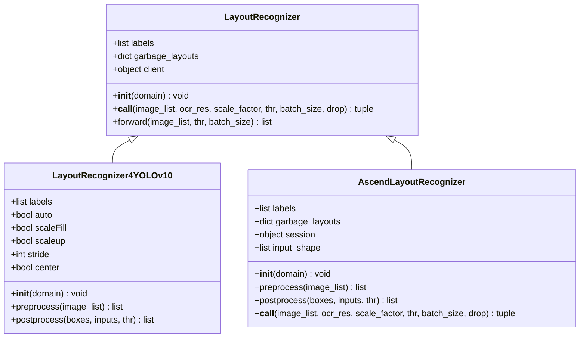
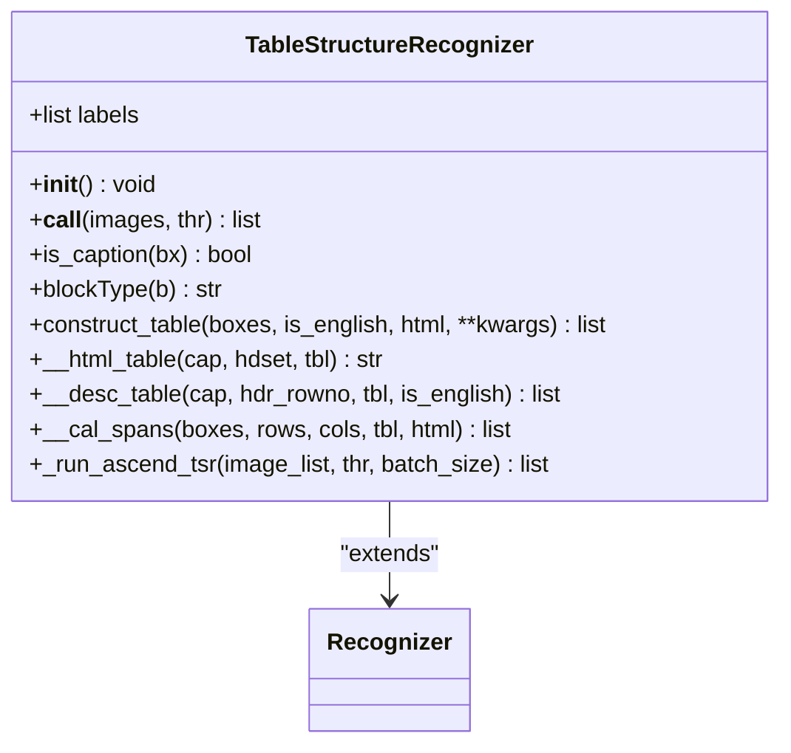
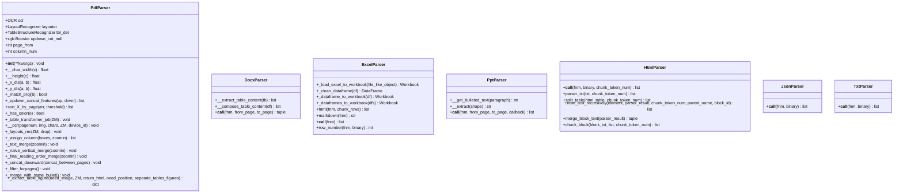
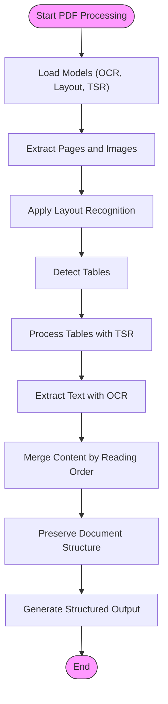
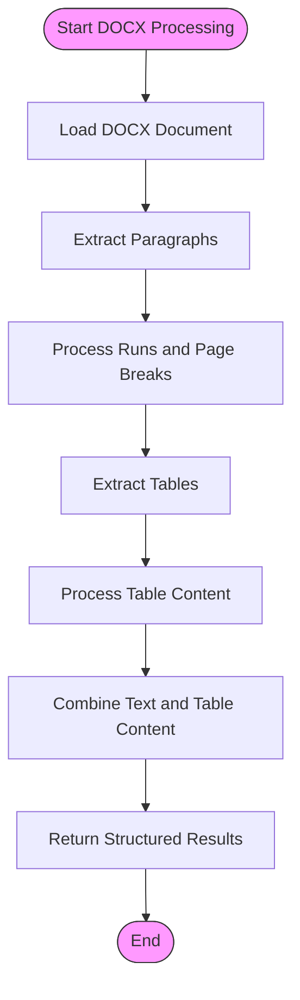
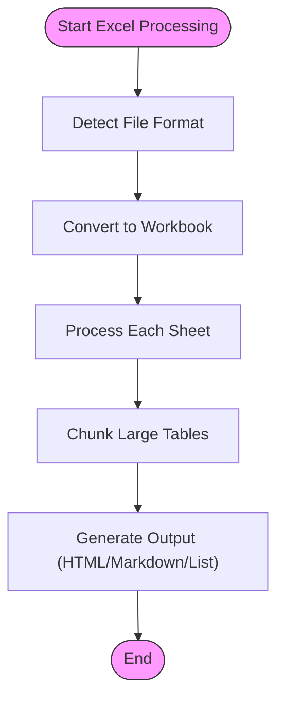
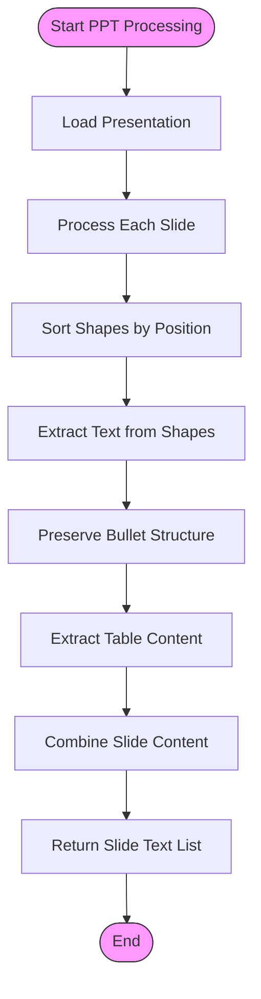
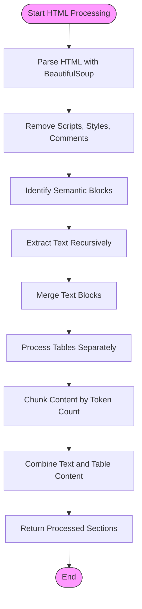
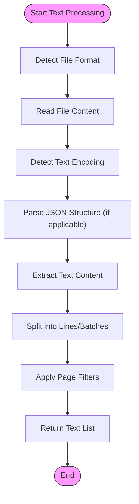

# Deep Document Understanding

<cite>
**Referenced Files in This Document**   
- [pdf_parser.py](file://deepdoc/parser/pdf_parser.py)
- [docx_parser.py](file://deepdoc/parser/docx_parser.py)
- [excel_parser.py](file://deepdoc/parser/excel_parser.py)
- [ppt_parser.py](file://deepdoc/parser/ppt_parser.py)
- [html_parser.py](file://deepdoc/parser/html_parser.py)
- [json_parser.py](file://deepdoc/parser/json_parser.py)
- [txt_parser.py](file://deepdoc/parser/txt_parser.py)
- [ocr.py](file://deepdoc/vision/ocr.py)
- [layout_recognizer.py](file://deepdoc/vision/layout_recognizer.py)
- [table_structure_recognizer.py](file://deepdoc/vision/table_structure_recognizer.py)
- [README.md](file://deepdoc/README.md)
</cite>

## Table of Contents
1. [Introduction](#introduction)
2. [Vision-Based Document Analysis](#vision-based-document-analysis)
3. [Document Format Parsers](#document-format-parsers)
4. [PDF Parser Implementation](#pdf-parser-implementation)
5. [DOCX Parser Implementation](#docx-parser-implementation)
6. [Excel Parser Implementation](#excel-parser-implementation)
7. [PPT Parser Implementation](#ppt-parser-implementation)
8. [HTML Parser Implementation](#html-parser-implementation)
9. [JSON and Plain Text Parsers](#json-and-plain-text-parsers)
10. [Configuration and Parameters](#configuration-and-parameters)
11. [Error Handling and Edge Cases](#error-handling-and-edge-cases)
12. [Conclusion](#conclusion)

## Introduction

RAGFlow's deep document understanding feature provides comprehensive parsing capabilities for various document formats, including PDF, DOCX, PPT, Excel, HTML, JSON, and plain text. The system combines vision-based components for layout recognition, OCR, and table structure recognition with specialized parsers for each document format to preserve document structure during parsing.

The architecture is divided into two main components: vision and parser. The vision component handles OCR, layout recognition, and table structure recognition, while the parser component processes specific document formats and extracts structured content. This dual approach enables accurate analysis of documents with various formats and complex layouts.

**Section sources**
- [README.md](file://deepdoc/README.md#L1-L122)

## Vision-Based Document Analysis

The vision component of RAGFlow's document understanding system provides three key capabilities: OCR, layout recognition, and table structure recognition. These components work together to extract text and preserve the visual structure of documents.

### OCR Implementation

The OCR system is implemented in `deepdoc/vision/ocr.py` and uses ONNX models for text detection and recognition. The system consists of two main components:

1. **TextDetector**: Detects text regions in images using a DB (Differentiable Binarization) model
2. **TextRecognizer**: Recognizes text content within detected regions using a CTC (Connectionist Temporal Classification) model

The OCR system supports multiple devices through parallel processing and can handle various image formats. It includes preprocessing steps to normalize images and postprocessing to filter and sort detected text boxes.



**Diagram sources**
- [ocr.py](file://deepdoc/vision/ocr.py#L536-L752)

### Layout Recognition

Layout recognition identifies different content types within a document, such as text, title, figure, table, header, footer, and reference. The system uses a YOLOv10-based model to detect these layout components.

The layout recognizer classifies document regions into 10 basic components:
- Text
- Title
- Figure
- Figure caption
- Table
- Table caption
- Header
- Footer
- Reference
- Equation



**Diagram sources**
- [layout_recognizer.py](file://deepdoc/vision/layout_recognizer.py#L33-L458)

### Table Structure Recognition

Table structure recognition (TSR) identifies the internal structure of tables, including columns, rows, headers, and spanning cells. The system uses a specialized model to detect table components and reconstruct the table structure.

The TSR component recognizes five labels:
- Column
- Row
- Column header
- Projected row header
- Spanning cell



**Diagram sources**
- [table_structure_recognizer.py](file://deepdoc/vision/table_structure_recognizer.py#L30-L613)

## Document Format Parsers

RAGFlow provides specialized parsers for various document formats, each designed to handle the unique characteristics of its format while preserving document structure and metadata.

### Parser Architecture

The parser system follows a consistent interface across all formats, with each parser implementing a `__call__` method that processes a document and returns structured content. The parsers are organized in the `deepdoc/parser` directory, with each format having its own parser file.



**Diagram sources**
- [pdf_parser.py](file://deepdoc/parser/pdf_parser.py#L52-L800)
- [docx_parser.py](file://deepdoc/parser/docx_parser.py#L25-L140)
- [excel_parser.py](file://deepdoc/parser/excel_parser.py#L28-L224)
- [ppt_parser.py](file://deepdoc/parser/ppt_parser.py#L22-L100)
- [html_parser.py](file://deepdoc/parser/html_parser.py#L39-L214)
- [json_parser.py](file://deepdoc/parser/json_parser.py)
- [txt_parser.py](file://deepdoc/parser/txt_parser.py)

## PDF Parser Implementation

The PDF parser is the most complex of all parsers due to the flexibility of the PDF format. It combines vision-based components with direct PDF parsing to extract text, tables, and figures while preserving their positions and structure.

### Key Features

1. **Multi-modal Processing**: Combines direct PDF text extraction with OCR for image-based content
2. **Layout Analysis**: Uses layout recognition to identify different content types
3. **Table Structure Recognition**: Extracts tables with proper structure and formatting
4. **Reading Order Optimization**: Reconstructs logical reading order from visual layout

### Processing Pipeline

The PDF parser follows a multi-stage processing pipeline:

1. **Initialization**: Loads OCR, layout recognition, and table structure recognition models
2. **Page Processing**: Extracts text and images from each page
3. **Layout Recognition**: Identifies content types (text, table, figure, etc.)
4. **Table Processing**: Applies table structure recognition to extract structured data
5. **Content Merging**: Combines text blocks based on reading order and semantic continuity
6. **Output Generation**: Returns structured content with position information



**Diagram sources**
- [pdf_parser.py](file://deepdoc/parser/pdf_parser.py#L52-L800)

### Configuration Options

The PDF parser supports several configuration options through environment variables and initialization parameters:

- **LAYOUT_RECOGNIZER_TYPE**: Specifies the layout recognizer type ("onnx" or "ascend")
- **PARALLEL_DEVICES**: Number of parallel devices for processing
- **OCR_GPU_MEM_LIMIT_MB**: GPU memory limit for OCR operations
- **OCR_ARENA_EXTEND_STRATEGY**: Memory allocation strategy for OCR

**Section sources**
- [pdf_parser.py](file://deepdoc/parser/pdf_parser.py#L52-L800)

## DOCX Parser Implementation

The DOCX parser handles Microsoft Word documents (.docx format) by extracting text content and tables while preserving document structure.

### Key Features

1. **Text Extraction**: Extracts paragraphs and their formatting
2. **Table Processing**: Converts tables to structured data with header recognition
3. **Page Break Detection**: Identifies page breaks within the document
4. **Style Preservation**: Maintains paragraph styles

### Table Processing

The DOCX parser includes sophisticated table processing that analyzes table content to determine appropriate formatting:

```python
def __compose_table_content(self, df):
    # Analyze cell content types to determine table structure
    pattern = [
        ("^(20|19)[0-9]{2}[年/-][0-9]{1,2}[月/-][0-9]{1,2}日*$", "Dt"),  # Date
        ("^[0-9.,+%/ -]+$", "Nu"),  # Numeric
        (r"^[0-9A-Z/\._~-]+$", "Ca"),  # Code/Abbreviation
        (r"^[A-Z]*[a-z' -]+$", "En"),  # English text
        (r"^[0-9.,+-]+[0-9A-Za-z/$￥%<>（）()' -]+$", "NE"),  # Named entity
    ]
    
    # Determine header rows based on content type distribution
    max_type = Counter([blockType(str(df.iloc[i, j])) for i in range(1, len(df)) for j in range(len(df.iloc[i, :]))])
    max_type = max(max_type.items(), key=lambda x: x[1])[0]
    
    # Construct output with appropriate formatting
    if max_type == "Nu":
        # Numeric table - use header rows
        return self._format_numeric_table(df)
    else:
        # Text table - use simple formatting
        return self._format_text_table(df)
```

### Processing Flow



**Diagram sources**
- [docx_parser.py](file://deepdoc/parser/docx_parser.py#L25-L140)

## Excel Parser Implementation

The Excel parser handles spreadsheet files (XLSX, CSV, etc.) by converting them to structured data that can be easily processed.

### Key Features

1. **Multi-format Support**: Handles XLSX, CSV, and other spreadsheet formats
2. **HTML Output**: Can convert tables to HTML format
3. **Markdown Output**: Supports markdown table generation
4. **Row Counting**: Provides row counting functionality

### Format Detection and Conversion

The Excel parser first detects the file format and converts it to a standard workbook format:

```python
@staticmethod
def _load_excel_to_workbook(file_like_object):
    # Check file header to determine format
    file_head = file_like_object.read(4)
    file_like_object.seek(0)
    
    if not (file_head.startswith(b"PK\x03\x04") or file_head.startswith(b"\xd0\xcf\x11\xe0")):
        # Not a standard Excel file - try CSV
        df = pd.read_csv(file_like_object)
        return RAGFlowExcelParser._dataframe_to_workbook(df)
    
    # Try to load as Excel file
    try:
        return load_workbook(file_like_object, data_only=True)
    except Exception as e:
        # Fallback to pandas
        dfs = pd.read_excel(file_like_object, sheet_name=None)
        return RAGFlowExcelParser._dataframes_to_workbook(dfs)
```

### HTML Generation

The parser can generate HTML representations of tables with configurable chunk sizes:

```python
def html(self, fnm, chunk_rows=256):
    # Convert spreadsheet to HTML tables
    wb = self._load_excel_to_workbook(file_like_object)
    tb_chunks = []
    
    for sheetname in wb.sheetnames:
        ws = wb[sheetname]
        rows = list(ws.rows)
        
        # Split large tables into chunks
        for chunk_i in range((len(rows) - 1) // chunk_rows + 1):
            tb = f"<table><caption>{sheetname}</caption>"
            # Add header row
            tb += "<tr>" + "".join([f"<th>{escape(_fmt(t.value))}</th>" for t in rows[0]]) + "</tr>"
            
            # Add data rows
            for r in rows[1 + chunk_i * chunk_rows : min(1 + (chunk_i + 1) * chunk_rows, len(rows))]:
                tb += "<tr>" + "".join([f"<td>{escape(_fmt(c.value))}</td>" for c in r]) + "</tr>"
            
            tb += "</table>\n"
            tb_chunks.append(tb)
    
    return tb_chunks
```

### Processing Flow



**Diagram sources**
- [excel_parser.py](file://deepdoc/parser/excel_parser.py#L28-L224)

## PPT Parser Implementation

The PPT parser handles PowerPoint presentations by extracting text content from slides while preserving the presentation structure.

### Key Features

1. **Slide Processing**: Processes each slide individually
2. **Shape Extraction**: Extracts text from various shape types
3. **Bulleted Text Handling**: Preserves bullet point structure
4. **Table Extraction**: Converts tables to structured data

### Shape Processing

The parser handles different shape types within slides:

```python
def __extract(self, shape):
    # Extract text from shape
    if hasattr(shape, 'has_text_frame') and shape.has_text_frame:
        texts = []
        for paragraph in shape.text_frame.paragraphs:
            if paragraph.text.strip():
                texts.append(self.__get_bulleted_text(paragraph))
        return "\n".join(texts)
    
    # Handle tables
    if shape.shape_type == 19:  # MSO_SHAPE_TYPE.TABLE
        tb = shape.table
        rows = []
        for i in range(1, len(tb.rows)):
            rows.append("; ".join([tb.cell(0, j).text + ": " + tb.cell(i, j).text 
                                 for j in range(len(tb.columns)) if tb.cell(i, j)]))
        return "\n".join(rows)
    
    # Handle group shapes
    if shape.shape_type == 6:  # MSO_SHAPE_TYPE.GROUP
        texts = []
        for p in sorted(shape.shapes, key=lambda x: (x.top // 10, x.left)):
            t = self.__extract(p)
            if t:
                texts.append(t)
        return "\n".join(texts)
    
    return ""
```

### Bulleted Text Handling

The parser preserves bullet point structure by detecting bulleted paragraphs:

```python
def __get_bulleted_text(self, paragraph):
    # Detect if paragraph has bullet points
    is_bulleted = bool(paragraph._p.xpath("./a:pPr/a:buChar")) or \
                  bool(paragraph._p.xpath("./a:pPr/a:buAutoNum")) or \
                  bool(paragraph._p.xpath("./a:pPr/a:buBlip"))
    
    if is_bulleted:
        # Add indentation based on bullet level
        return f"{'  '* paragraph.level}.{paragraph.text}"
    else:
        return paragraph.text
```

### Processing Flow



**Diagram sources**
- [ppt_parser.py](file://deepdoc/parser/ppt_parser.py#L22-L100)

## HTML Parser Implementation

The HTML parser processes HTML documents by extracting text content while preserving semantic structure.

### Key Features

1. **HTML Cleaning**: Removes scripts, styles, and comments
2. **Block Processing**: Identifies semantic blocks (headings, paragraphs, lists)
3. **Table Extraction**: Extracts tables with proper structure
4. **Chunking**: Splits content into manageable chunks

### HTML Processing Pipeline

The parser follows a multi-step process to extract structured content:



### Block Type Recognition

The parser recognizes different HTML block types:

```python
BLOCK_TAGS = [
    "h1", "h2", "h3", "h4", "h5", "h6",
    "p", "div", "article", "section", "aside",
    "ul", "ol", "li",
    "table", "pre", "code", "blockquote",
    "figure", "figcaption"
]

TITLE_TAGS = {"h1": "#", "h2": "##", "h3": "###", "h4": "#####", "h5": "#####", "h6": "######"}
```

### Recursive Text Extraction

The parser uses recursive processing to handle nested HTML elements:

```python
@classmethod
def read_text_recursively(cls, element, parser_result, chunk_token_num=512, parent_name=None, block_id=None):
    if isinstance(element, NavigableString):
        # Handle text nodes
        content = element.strip()
        if content:
            info = {"content": content, "tag_name": "inner_text", "metadata": {"block_id": block_id}}
            if parent_name:
                info["tag_name"] = parent_name
            return [info]
        return []
    
    elif isinstance(element, Tag):
        if str.lower(element.name) == "table":
            # Handle tables separately
            table_id = str(uuid.uuid1())
            return [{"content": str(element), "tag_name": "table", 
                    "metadata": {"table_id": table_id}}]
        else:
            # Process child elements
            if str.lower(element.name) in BLOCK_TAGS:
                block_id = str(uuid.uuid1())
            
            for child in element.children:
                child_info = cls.read_text_recursively(child, parser_result, chunk_token_num, 
                                                     element.name, block_id)
                parser_result.extend(child_info)
        return []
```

**Diagram sources**
- [html_parser.py](file://deepdoc/parser/html_parser.py#L39-L214)

## JSON and Plain Text Parsers

The JSON and plain text parsers provide simple but effective processing for structured and unstructured text formats.

### JSON Parser

The JSON parser handles JSON files by extracting text content from various data structures:

```python
class RAGFlowJsonParser:
    def __call__(self, fnm, binary=None):
        txt = get_text(fnm, binary)
        o = json.loads(txt)
        res = []
        
        def dfs(obj, prefix=""):
            if isinstance(obj, str):
                res.append(obj)
            elif isinstance(obj, dict):
                for k, v in obj.items():
                    dfs(v, prefix + k + ": ")
            elif isinstance(obj, list):
                for i, v in enumerate(obj):
                    dfs(v, prefix + f"[{i}]: ")
        
        dfs(o)
        return res
```

### Plain Text Parser

The plain text parser handles simple text files with optional encoding detection:

```python
class RAGFlowTxtParser:
    def __call__(self, fnm, binary=None, from_page=0, to_page=100000000):
        txt = get_text(fnm, binary)
        lines = txt.split("\n")
        return [(line, "") for line in lines[from_page:to_page] if line.strip()]
```

### Processing Flow



**Section sources**
- [json_parser.py](file://deepdoc/parser/json_parser.py)
- [txt_parser.py](file://deepdoc/parser/txt_parser.py)
- [utils.py](file://deepdoc/parser/utils.py)

## Configuration and Parameters

RAGFlow's document understanding system provides various configuration options to handle different document characteristics and processing requirements.

### Environment Variables

The system supports several environment variables for configuration:

| Environment Variable | Default Value | Description |
|----------------------|-------------|-------------|
| LAYOUT_RECOGNIZER_TYPE | "onnx" | Layout recognizer type ("onnx" or "ascend") |
| TABLE_STRUCTURE_RECOGNIZER_TYPE | "onnx" | Table structure recognizer type ("onnx" or "ascend") |
| PARALLEL_DEVICES | 1 | Number of parallel devices for processing |
| OCR_GPU_MEM_LIMIT_MB | 2048 | GPU memory limit for OCR operations in MB |
| OCR_ARENA_EXTEND_STRATEGY | "kNextPowerOfTwo" | Memory allocation strategy for OCR |
| ASCEND_LAYOUT_RECOGNIZER_DEVICE_ID | 0 | Device ID for Ascend layout recognizer |
| HF_ENDPOINT | None | HuggingFace endpoint mirror (e.g., "https://hf-mirror.com") |

### Parser Parameters

Each parser accepts specific parameters to control processing behavior:

#### PDF Parser Parameters
- **from_page**: Starting page number (default: 0)
- **to_page**: Ending page number (default: 100000000)
- **zoomin**: Image zoom factor for OCR (default: 3)
- **return_html**: Return HTML representation of tables (default: False)
- **need_image**: Extract images from tables and figures (default: False)
- **need_position**: Include position information in output (default: False)

#### DOCX Parser Parameters
- **from_page**: Starting page number (default: 0)
- **to_page**: Ending page number (default: 100000000)

#### Excel Parser Parameters
- **chunk_rows**: Number of rows per HTML table chunk (default: 256)

#### HTML Parser Parameters
- **chunk_token_num**: Maximum tokens per text chunk (default: 512)

### Return Values

Each parser returns structured data appropriate for its format:

| Parser | Return Type | Description |
|--------|-------------|-------------|
| PDF | List of dictionaries | Text chunks with position, tables, and figures |
| DOCX | Tuple of (text_sections, tables) | List of text sections and extracted tables |
| Excel | List of strings | Flattened table data with sheet references |
| PPT | List of strings | Text content for each slide |
| HTML | List of strings | Processed text sections and HTML tables |
| JSON | List of strings | Extracted text values from JSON structure |
| Plain Text | List of tuples | Text lines with empty style information |

**Section sources**
- [pdf_parser.py](file://deepdoc/parser/pdf_parser.py#L52-L800)
- [docx_parser.py](file://deepdoc/parser/docx_parser.py#L25-L140)
- [excel_parser.py](file://deepdoc/parser/excel_parser.py#L28-L224)
- [ppt_parser.py](file://deepdoc/parser/ppt_parser.py#L22-L100)
- [html_parser.py](file://deepdoc/parser/html_parser.py#L39-L214)
- [json_parser.py](file://deepdoc/parser/json_parser.py)
- [txt_parser.py](file://deepdoc/parser/txt_parser.py)

## Error Handling and Edge Cases

The document understanding system includes robust error handling for various edge cases and problematic documents.

### Corrupted Files

The system handles corrupted or malformed files through multiple fallback mechanisms:

1. **File Format Detection**: Checks file headers to verify format
2. **Multiple Parsing Methods**: Tries different libraries (openpyxl, pandas) for Excel files
3. **Encoding Detection**: Uses chardet to detect text encoding
4. **Graceful Degradation**: Falls back to simpler processing methods when advanced features fail

```python
@staticmethod
def _load_excel_to_workbook(file_like_object):
    # Try multiple methods to load Excel file
    try:
        return load_workbook(file_like_object, data_only=True)
    except Exception as e:
        logging.info(f"openpyxl load error: {e}, try pandas instead")
        try:
            dfs = pd.read_excel(file_like_object, sheet_name=None)
            return RAGFlowExcelParser._dataframes_to_workbook(dfs)
        except Exception as e_pandas:
            raise Exception(f"pandas.read_excel error: {e_pandas}, original openpyxl error: {e}")
```

### Complex Layouts

The system handles complex document layouts through:

1. **Layout Recognition**: Identifies different content regions
2. **Reading Order Optimization**: Reconstructs logical reading order
3. **Column Detection**: Automatically detects multi-column layouts
4. **Table Spanning**: Handles tables that span multiple pages

### Encoding Problems

The system addresses encoding issues by:

1. **Automatic Detection**: Uses chardet library to detect encoding
2. **Fallback Encodings**: Tries common encodings (UTF-8, GBK, etc.)
3. **Error Handling**: Ignores encoding errors during decoding
4. **Binary Processing**: Works directly with binary data when possible

```python
def get_text(fnm: str, binary=None) -> str:
    txt = ""
    if binary:
        encoding = find_codec(binary)  # Detect encoding from binary data
        txt = binary.decode(encoding, errors="ignore")  # Ignore decoding errors
    else:
        with open(fnm, "r") as f:
            while True:
                line = f.readline()
                if not line:
                    break
                txt += line
    return txt
```

### Common Issues and Solutions

| Issue | Solution |
|------|---------|
| Corrupted PDF files | Use multiple PDF parsing libraries and fallback to OCR |
| Password-protected documents | Return error message; cannot process encrypted files |
| Unsupported file formats | Attempt format conversion (e.g., CSV to Excel) |
| Memory limitations | Process documents in chunks and use memory-efficient data structures |
| Slow processing | Enable parallel processing and GPU acceleration |
| Poor OCR accuracy | Adjust zoom factor and try different OCR models |
| Incorrect reading order | Use layout recognition and reading order optimization |
| Missing content | Combine multiple extraction methods (text extraction + OCR) |

**Section sources**
- [pdf_parser.py](file://deepdoc/parser/pdf_parser.py#L52-L800)
- [excel_parser.py](file://deepdoc/parser/excel_parser.py#L28-L224)
- [html_parser.py](file://deepdoc/parser/html_parser.py#L39-L214)
- [utils.py](file://deepdoc/parser/utils.py)

## Conclusion

RAGFlow's deep document understanding feature provides a comprehensive solution for processing various document formats with high accuracy and structural preservation. The system combines vision-based components for layout recognition, OCR, and table structure recognition with specialized parsers for each document format.

Key strengths of the system include:

1. **Multi-format Support**: Handles PDF, DOCX, PPT, Excel, HTML, JSON, and plain text
2. **Vision-based Analysis**: Uses advanced computer vision techniques for layout and structure recognition
3. **Structural Preservation**: Maintains document structure and reading order
4. **Robust Error Handling**: Includes fallback mechanisms for corrupted files and edge cases
5. **Configurable Processing**: Provides parameters to control processing behavior

The architecture separates concerns between vision components (OCR, layout recognition, table structure recognition) and format-specific parsers, allowing for modular development and maintenance. This design enables the system to handle complex documents with mixed content types while preserving semantic structure.

For developers, the system provides clear interfaces and well-documented parameters. For end users, it delivers accurate document understanding with minimal configuration required. The combination of specialized parsers and vision-based analysis makes RAGFlow particularly effective for processing documents with complex layouts and mixed content types.