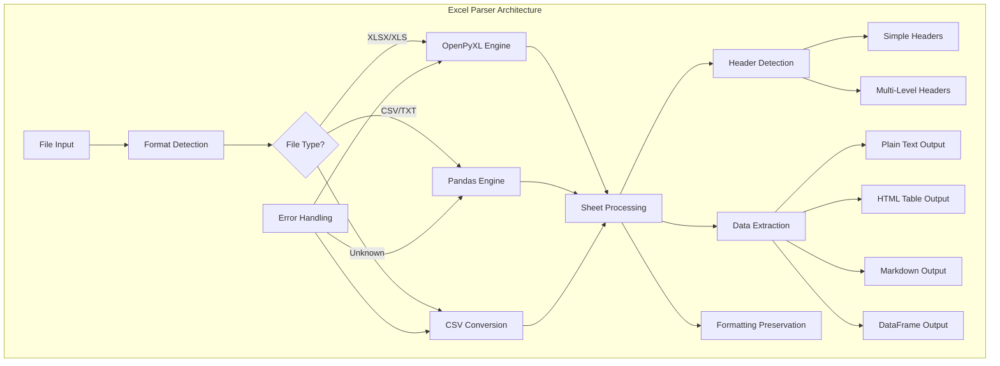
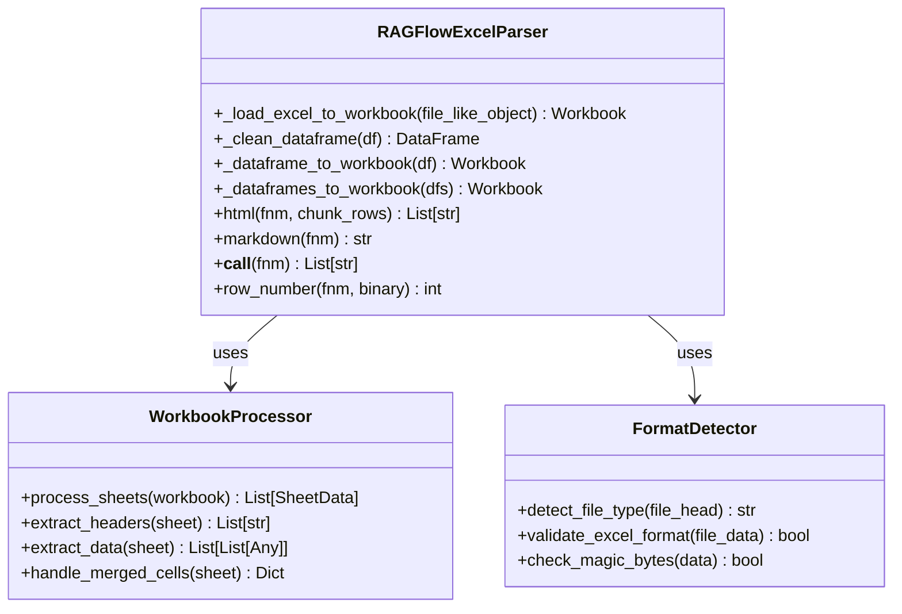
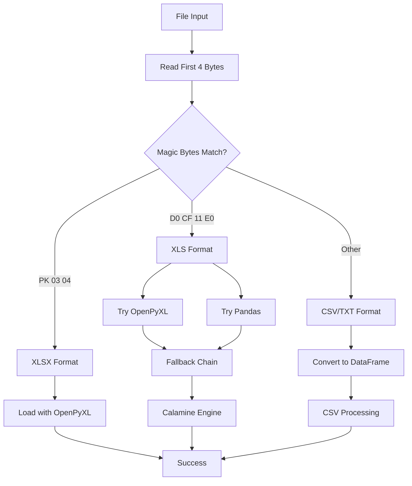
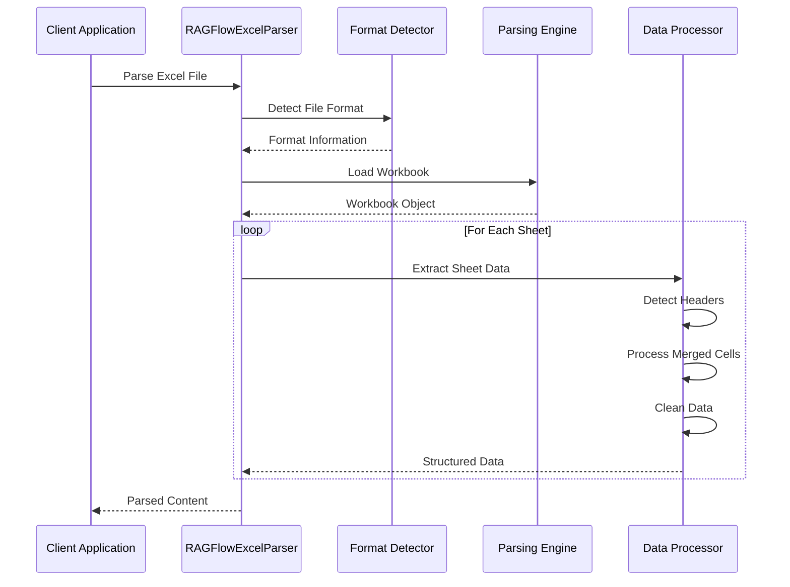
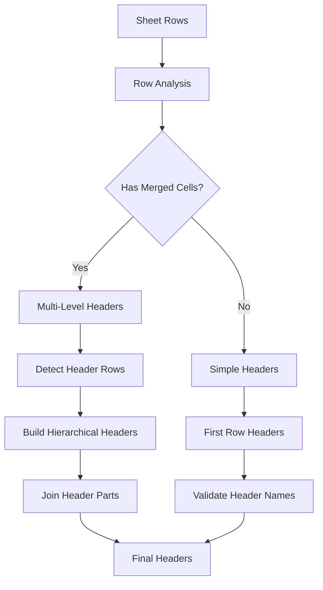
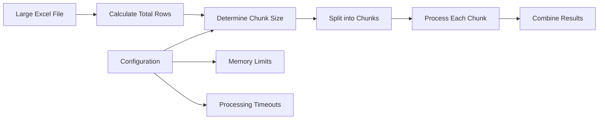
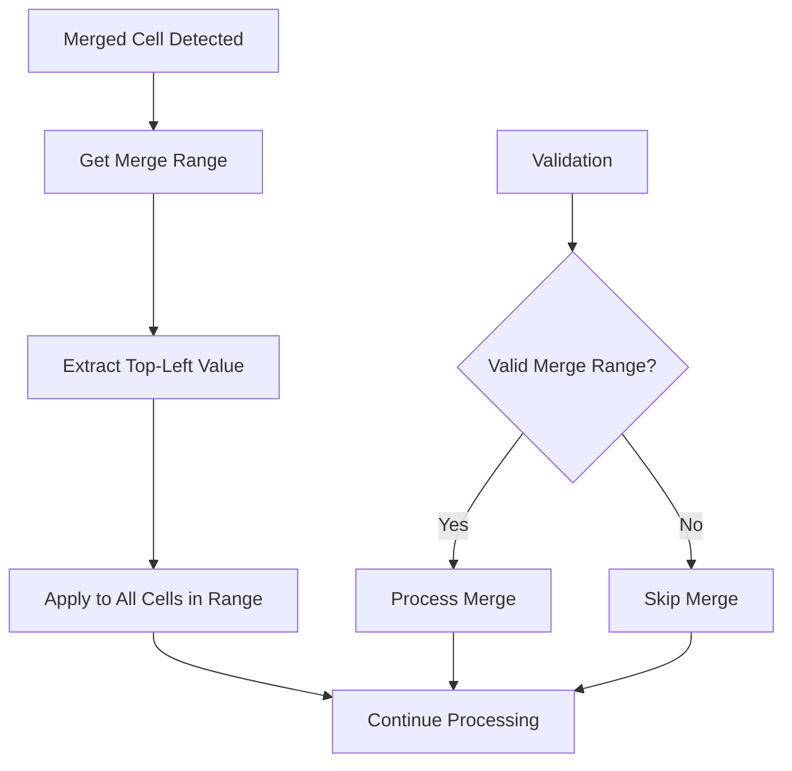
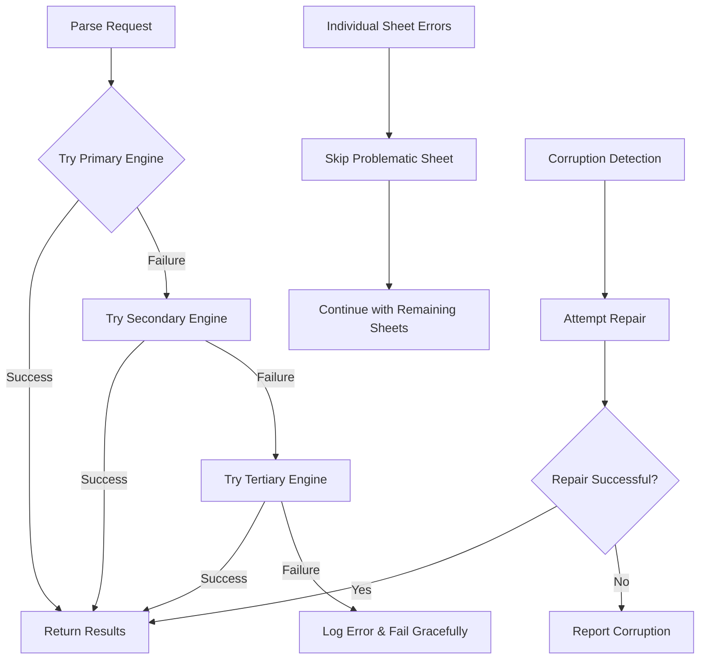
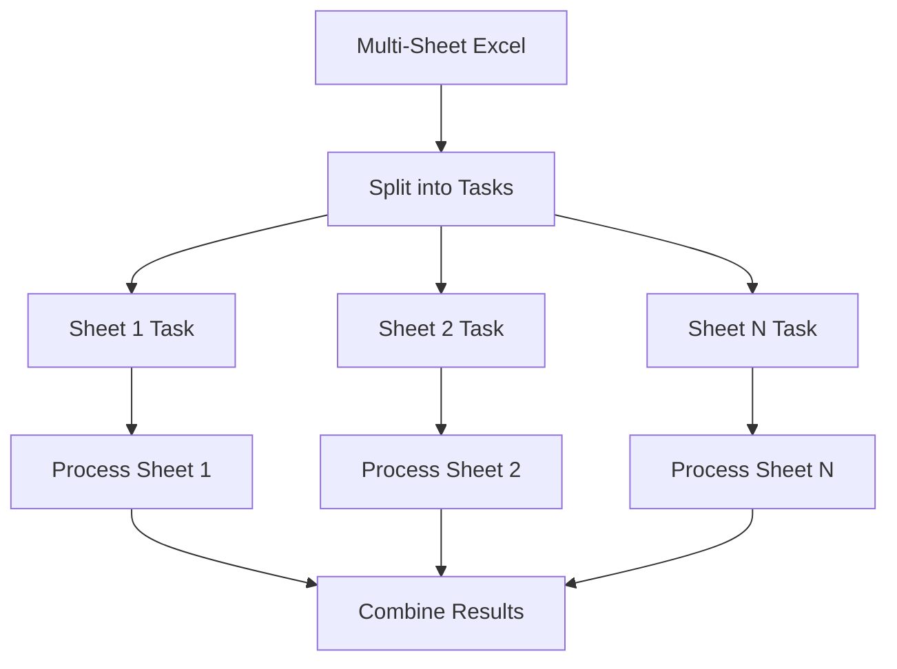

# Excel Document Parsing

<cite>
**Referenced Files in This Document**
- [excel_parser.py](file://deepdoc/parser/excel_parser.py)
- [table.py](file://rag/app/table.py)
- [qa.py](file://rag/app/qa.py)
- [excel-to-html.tsx](file://web/src/components/excel-to-html.tsx)
- [excel-to-html-form-field.tsx](file://web/src/components/excel-to-html-form-field.tsx)
- [chunk-method-dialog/index.tsx](file://web/src/components/chunk-method-dialog/index.tsx)
- [task_service.py](file://api/db/services/task_service.py)
- [validation_utils.py](file://api/utils/validation_utils.py)
</cite>

## Table of Contents
1. [Introduction](#introduction)
2. [Architecture Overview](#architecture-overview)
3. [Core Components](#core-components)
4. [File Format Detection and Compatibility](#file-format-detection-and-compatibility)
5. [Parsing Pipeline](#parsing-pipeline)
6. [Configuration Options](#configuration-options)
7. [Advanced Features](#advanced-features)
8. [Error Handling and Recovery](#error-handling-and-recovery)
9. [Performance Optimization](#performance-optimization)
10. [Common Issues and Solutions](#common-issues-and-solutions)
11. [Best Practices](#best-practices)
12. [Conclusion](#conclusion)

## Introduction

RAGFlow's Excel document parsing capability provides comprehensive support for extracting structured data from Microsoft Excel files, including modern XLSX format, legacy XLS format, and CSV files. The system employs a robust multi-engine approach that ensures maximum compatibility across different Excel versions and file types while preserving table structure, formatting, and complex data relationships.

The Excel parser is designed to handle various scenarios including large spreadsheets, complex table structures with merged cells, hierarchical headers, and mixed data types. It provides multiple output formats including plain text, HTML tables, and Markdown tables, making it suitable for different downstream applications in the RAG (Retrieval-Augmented Generation) pipeline.

## Architecture Overview

The Excel parsing architecture in RAGFlow follows a layered approach with multiple fallback engines and specialized processors for different use cases.

**Diagram sources**
- [excel_parser.py](file://deepdoc/parser/excel_parser.py#L30-L65)
- [table.py](file://rag/app/table.py#L35-L78)

## Core Components

### RAGFlowExcelParser Class

The main Excel parser class serves as the central orchestrator for all Excel processing operations. It implements a sophisticated fallback mechanism that tries multiple parsing engines in order of preference.

**Diagram sources**
- [excel_parser.py](file://deepdoc/parser/excel_parser.py#L28-L224)

**Section sources**
- [excel_parser.py](file://deepdoc/parser/excel_parser.py#L28-L224)

### Sheet Processing Engine

The sheet processing engine handles individual worksheet extraction with support for complex structures including merged cells, formulas, and formatting preservation.

**Section sources**
- [table.py](file://rag/app/table.py#L35-L78)

## File Format Detection and Compatibility

### Magic Byte Detection

RAGFlow implements robust file format detection using magic byte signatures to ensure accurate identification of Excel-compatible files.

**Diagram sources**
- [excel_parser.py](file://deepdoc/parser/excel_parser.py#L34-L49)

The magic byte detection recognizes:
- **XLSX files**: Start with `PK\x03\x04` (ZIP archive signature)
- **XLS files**: Start with `\xd0\xcf\x11\xe0` (OLE2 compound document)
- **CSV/Text files**: Fall back to CSV processing for unrecognized formats

**Section sources**
- [excel_parser.py](file://deepdoc/parser/excel_parser.py#L34-L49)

### Multi-Engine Fallback Strategy

RAGFlow employs a three-tier fallback strategy to maximize compatibility:

1. **Primary Engine**: OpenPyXL with `data_only=True` for pure data extraction
2. **Secondary Engine**: Pandas with automatic engine detection
3. **Tertiary Engine**: Calamine engine for specialized formats

**Section sources**
- [excel_parser.py](file://deepdoc/parser/excel_parser.py#L50-L65)

## Parsing Pipeline

### Data Extraction Workflow

The parsing pipeline processes Excel files through several stages to ensure comprehensive data capture:

**Diagram sources**
- [excel_parser.py](file://deepdoc/parser/excel_parser.py#L112-L198)
- [table.py](file://rag/app/table.py#L35-L78)

### Header Detection Algorithm

The system implements intelligent header detection that adapts to different table structures:

**Diagram sources**
- [table.py](file://rag/app/table.py#L80-L147)

**Section sources**
- [table.py](file://rag/app/table.py#L80-L230)

## Configuration Options

### HTML Generation Configuration

RAGFlow provides extensive configuration options for controlling Excel parsing behavior through the `html4excel` parameter:

| Configuration Option | Type | Default | Description |
|---------------------|------|---------|-------------|
| `html4excel` | Boolean | `false` | Enable HTML table generation from Excel files |
| `chunk_rows` | Integer | `256` | Number of rows per HTML table chunk |
| `parser_config` | Dictionary | `{}` | Additional parser-specific configuration |

**Section sources**
- [excel-to-html-form-field.tsx](file://web/src/components/excel-to-html-form-field.tsx#L12-L53)
- [excel-to-html.tsx](file://web/src/components/excel-to-html.tsx#L4-L20)

### Chunking Configuration

For large Excel files, RAGFlow implements intelligent chunking to optimize memory usage and processing performance:

**Diagram sources**
- [task_service.py](file://api/db/services/task_service.py#L379-L389)

**Section sources**
- [task_service.py](file://api/db/services/task_service.py#L379-L412)

## Advanced Features

### Merged Cell Handling

RAGFlow's Excel parser excels at handling merged cells, which are common in complex business reports and forms:

**Diagram sources**
- [table.py](file://rag/app/table.py#L214-L218)

**Section sources**
- [table.py](file://rag/app/table.py#L214-L230)

### Formula and Calculation Support

While primarily focused on data extraction, the parser supports formula evaluation through the `data_only=True` parameter in OpenPyXL, ensuring calculated values are captured rather than formula expressions.

### Data Type Preservation

The system maintains data type information during parsing, enabling downstream applications to make informed decisions about data interpretation and processing.

**Section sources**
- [excel_parser.py](file://deepdoc/parser/excel_parser.py#L51-L65)

## Error Handling and Recovery

### Robust Error Management

RAGFlow implements comprehensive error handling to ensure parsing success even with problematic Excel files:

**Diagram sources**
- [excel_parser.py](file://deepdoc/parser/excel_parser.py#L50-L65)
- [table.py](file://rag/app/table.py#L47-L52)

### Common Error Scenarios

| Error Type | Cause | Recovery Strategy |
|------------|-------|------------------|
| Corrupted File | Malformed Excel structure | Try CSV conversion fallback |
| Large File | Memory limitations | Implement chunking |
| Formula Errors | Unsupported formula types | Skip formula evaluation |
| Encoding Issues | Non-standard character encoding | Automatic codec detection |
| Sheet Access Errors | Protected or hidden sheets | Skip problematic sheets |

**Section sources**
- [excel_parser.py](file://deepdoc/parser/excel_parser.py#L178-L182)
- [table.py](file://rag/app/table.py#L47-L52)

## Performance Optimization

### Memory Management

RAGFlow optimizes memory usage through several strategies:

1. **Streaming Processing**: Process large files in chunks rather than loading entire files into memory
2. **Lazy Loading**: Load sheet data only when needed
3. **Garbage Collection**: Explicit cleanup of temporary objects
4. **Resource Pooling**: Reuse workbook objects where possible

### Parallel Processing

For multi-sheet Excel files, RAGFlow can process sheets in parallel to improve throughput:

**Section sources**
- [task_service.py](file://api/db/services/task_service.py#L379-L389)

## Common Issues and Solutions

### Issue: Excel Files Not Recognized

**Problem**: Files with unusual extensions or corrupted headers fail to parse.

**Solution**: RAGFlow automatically attempts CSV conversion for unrecognized formats, providing a fallback option.

### Issue: Large Spreadsheet Memory Issues

**Problem**: Processing very large Excel files causes memory exhaustion.

**Solution**: Implement chunking with configurable chunk sizes and streaming processing to handle files of any size.

### Issue: Merged Cell Data Loss

**Problem**: Merged cells cause data alignment issues.

**Solution**: The parser intelligently detects merged ranges and applies the top-left cell value to all merged cells.

### Issue: Formula Evaluation Problems

**Problem**: Calculated values are not extracted correctly.

**Solution**: Use OpenPyXL's `data_only=True` parameter to extract calculated results rather than formula expressions.

**Section sources**
- [excel_parser.py](file://deepdoc/parser/excel_parser.py#L34-L49)
- [excel_parser.py](file://deepdoc/parser/excel_parser.py#L51-L65)

## Best Practices

### File Preparation

1. **Standardize Formats**: Use consistent Excel formats across your document collection
2. **Minimize Merges**: Reduce complex merged cell usage for better parsing reliability
3. **Clean Data**: Remove unnecessary formatting and validation rules
4. **Optimize Structure**: Use clear header rows and consistent data layouts

### Configuration Tuning

1. **Enable HTML Generation**: For web-based RAG applications, enable HTML table generation
2. **Adjust Chunk Sizes**: Optimize chunk sizes based on your memory constraints
3. **Monitor Performance**: Track parsing times and adjust parameters accordingly
4. **Error Logging**: Implement comprehensive logging for troubleshooting

### Integration Guidelines

1. **Fallback Strategy**: Always implement fallback parsing for critical applications
2. **Error Handling**: Design robust error handling around Excel parsing operations
3. **Testing**: Test with representative samples of your target Excel files
4. **Monitoring**: Monitor parsing success rates and performance metrics

## Conclusion

RAGFlow's Excel document parsing capability represents a comprehensive solution for extracting structured data from Microsoft Excel files. Through its multi-engine architecture, intelligent error handling, and flexible configuration options, it provides reliable parsing across a wide range of Excel formats and complexities.

The system's ability to handle large files, complex table structures, and various Excel features makes it suitable for production RAG applications requiring robust document processing capabilities. By following the best practices outlined in this documentation, developers can maximize the effectiveness of Excel parsing in their RAG workflows while minimizing potential issues.

Future enhancements may include support for additional Excel features such as pivot tables, charts, and advanced formatting, expanding the system's capabilities for even more complex document processing scenarios.