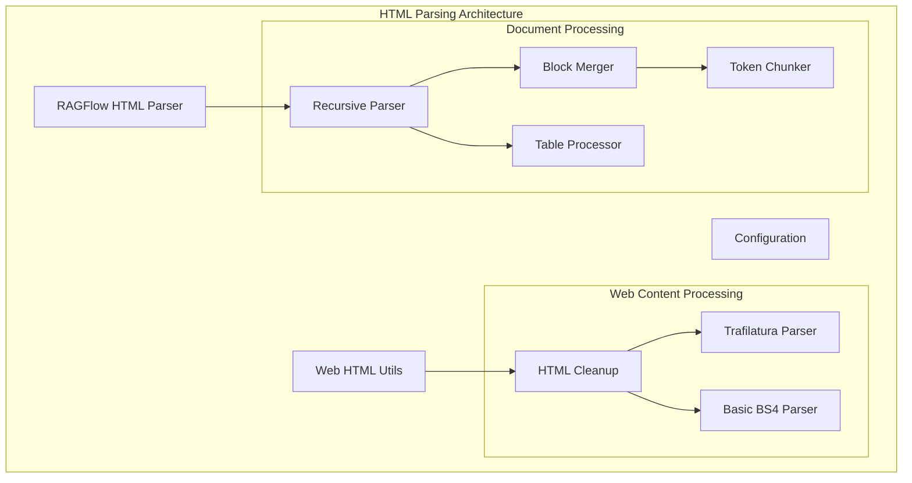
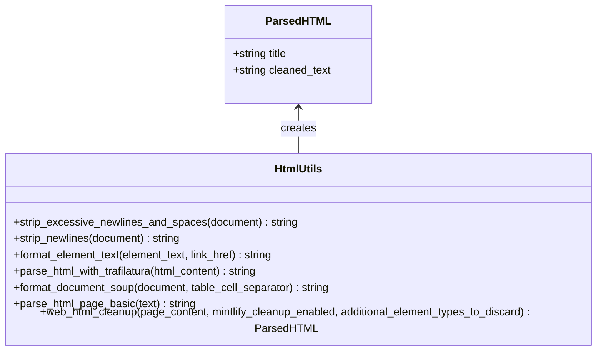
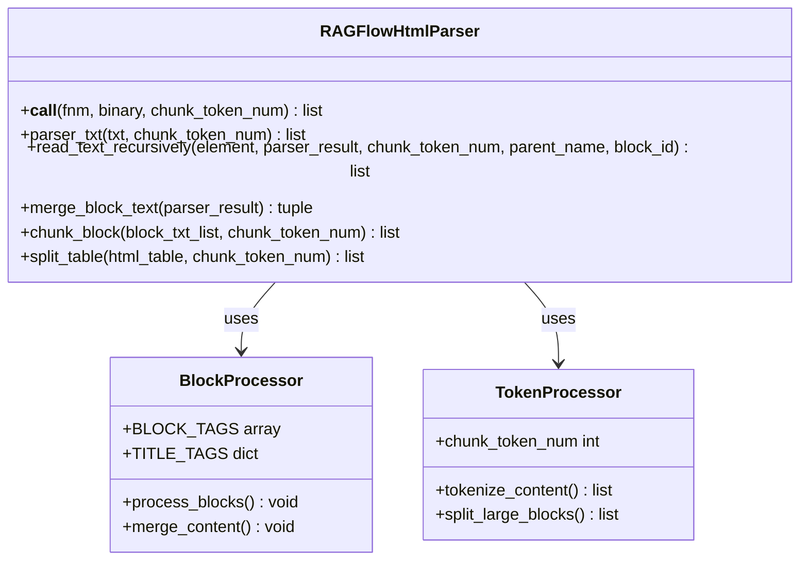
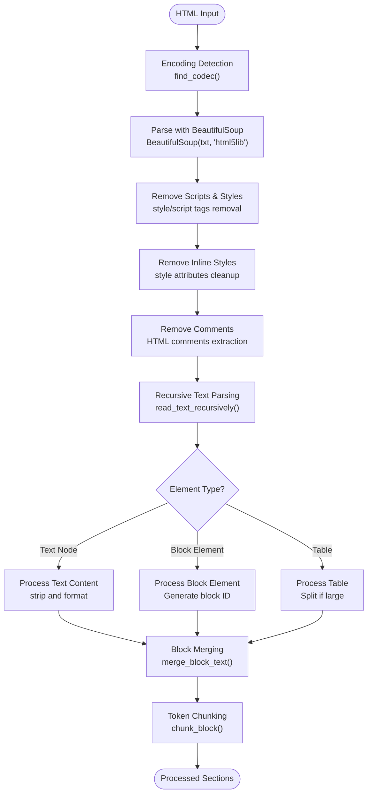
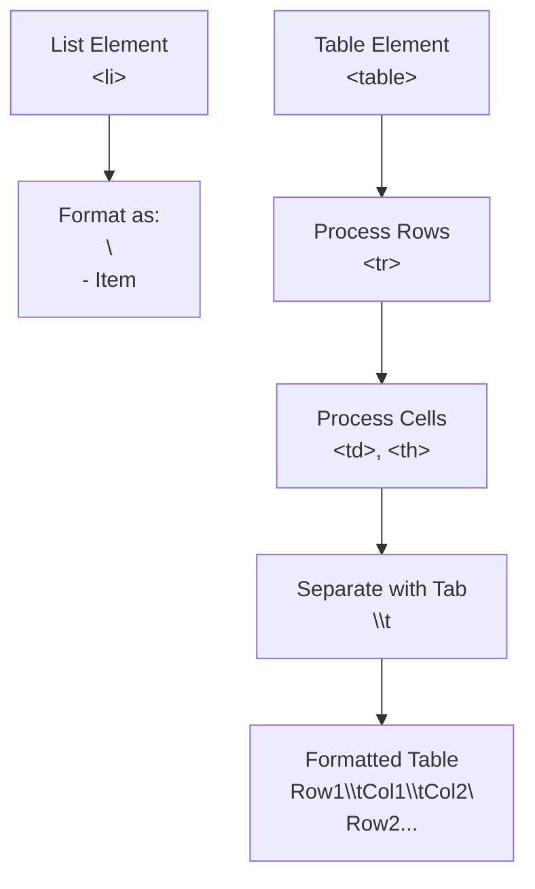
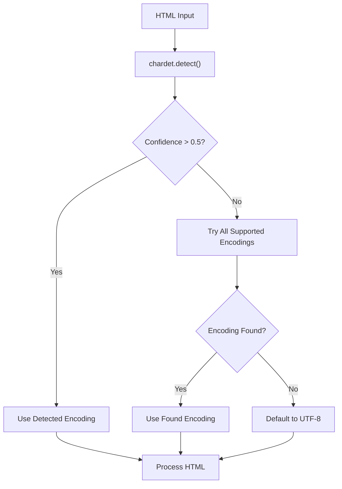
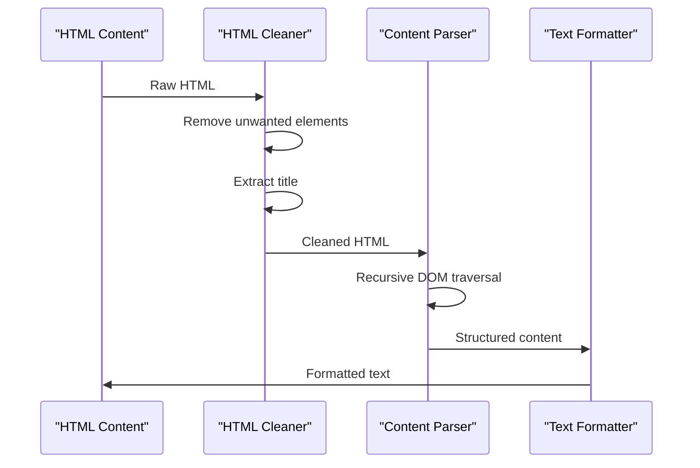
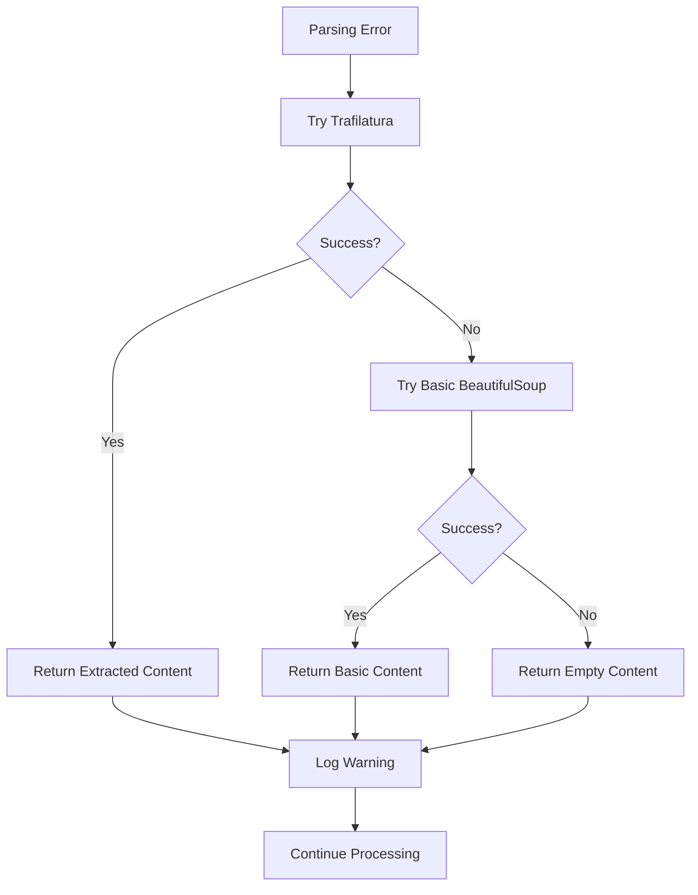

# HTML Document Parsing

<cite>
**Referenced Files in This Document**
- [html_utils.py](file://common/data_source/html_utils.py)
- [html_parser.py](file://deepdoc/parser/html_parser.py)
- [config.py](file://common/data_source/config.py)
- [__init__.py](file://deepdoc/parser/__init__.py)
- [email.py](file://rag/app/email.py)
- [naive.py](file://rag/app/naive.py)
- [document_app.py](file://api/apps/document_app.py)
- [invoke.py](file://agent/component/invoke.py)
</cite>

## Table of Contents
1. [Introduction](#introduction)
2. [Architecture Overview](#architecture-overview)
3. [Core Components](#core-components)
4. [HTML Parsing Pipeline](#html-parsing-pipeline)
5. [Text Extraction and Structure Preservation](#text-extraction-and-structure-preservation)
6. [Configuration Options](#configuration-options)
7. [Advanced Features](#advanced-features)
8. [Security and Error Handling](#security-and-error-handling)
9. [Performance Considerations](#performance-considerations)
10. [Troubleshooting Guide](#troubleshooting-guide)
11. [Best Practices](#best-practices)
12. [Conclusion](#conclusion)

## Introduction

RAGFlow's HTML document parsing capability provides sophisticated text extraction and structure preservation for web content and HTML documents. The system employs multiple parsing strategies to handle diverse HTML structures, from simple web pages to complex technical documentation, while maintaining document hierarchy and semantic meaning.

The HTML parsing architecture consists of two primary components: a lightweight utility-based parser for web content extraction and a comprehensive RAGFlow HTML parser for document processing. Both systems support advanced features like dynamic content handling, encoding detection, and security filtering.

## Architecture Overview

RAGFlow's HTML parsing architecture follows a modular design with clear separation of concerns between web scraping and document processing tasks.



**Diagram sources**
- [html_utils.py](file://common/data_source/html_utils.py#L167-L220)
- [html_parser.py](file://deepdoc/parser/html_parser.py#L38-L214)

**Section sources**
- [html_utils.py](file://common/data_source/html_utils.py#L1-L220)
- [html_parser.py](file://deepdoc/parser/html_parser.py#L1-L214)

## Core Components

### Web HTML Utilities

The web HTML utilities provide specialized functions for cleaning and extracting content from web pages, with built-in support for various cleanup strategies and content transformation options.



**Diagram sources**
- [html_utils.py](file://common/data_source/html_utils.py#L17-L21)

### RAGFlow HTML Parser

The RAGFlow HTML parser provides comprehensive document processing with recursive parsing, block merging, and intelligent chunking capabilities.



**Diagram sources**
- [html_parser.py](file://deepdoc/parser/html_parser.py#L38-L214)

**Section sources**
- [html_utils.py](file://common/data_source/html_utils.py#L17-L220)
- [html_parser.py](file://deepdoc/parser/html_parser.py#L38-L214)

## HTML Parsing Pipeline

The HTML parsing pipeline implements a sophisticated multi-stage process that handles various HTML complexities and ensures optimal text extraction quality.



**Diagram sources**
- [html_parser.py](file://deepdoc/parser/html_parser.py#L49-L76)

### Stage 1: Encoding Detection and Initial Parsing

The parsing process begins with automatic encoding detection using the `find_codec()` function, which employs multiple fallback mechanisms to ensure accurate character decoding.

### Stage 2: Content Sanitization

The system performs comprehensive content sanitization by removing:
- Script and style tags
- Inline CSS styles
- HTML comments
- Unwanted elements based on configuration

### Stage 3: Recursive Text Extraction

The recursive parsing algorithm traverses the HTML DOM tree, processing elements based on their type and structure. Special handling is provided for:
- Nested HTML content within text nodes
- Table structures requiring special formatting
- Link preservation and transformation

**Section sources**
- [html_parser.py](file://deepdoc/parser/html_parser.py#L49-L76)

## Text Extraction and Structure Preservation

### Heading and Section Handling

RAGFlow's HTML parser preserves document structure through intelligent heading and section processing:

| Element Type | Processing Method | Output Format |
|--------------|-------------------|---------------|
| `<h1>`-`<h6>` | Title prefix with markdown notation | `# Heading`, `## Subheading` |
| `<p>` | Paragraph separation | Newline before/after |
| `<div>` | Block separation | Newline when appropriate |
| `<br>` | Line break | Explicit newline |
| Lists | Hierarchical formatting | `- Item` with indentation |

### List and Table Processing

The parser implements sophisticated handling for complex structures:



**Diagram sources**
- [html_utils.py](file://common/data_source/html_utils.py#L142-L158)

### Link Transformation

The system provides flexible link handling based on configuration:

- **Strip Mode**: Removes all links entirely
- **Markdown Mode**: Converts HTML links to Markdown format `[text](url)`
- **Preserve Mode**: Maintains original HTML link structure

**Section sources**
- [html_utils.py](file://common/data_source/html_utils.py#L38-L49)
- [config.py](file://common/data_source/config.py#L231-L241)

## Configuration Options

### Global Configuration Settings

RAGFlow provides extensive configuration options for HTML parsing behavior:

| Configuration Variable | Purpose | Default Value | Environment Override |
|------------------------|---------|---------------|---------------------|
| `PARSE_WITH_TRAFILATURA` | Enable trafilatura parser | `False` | `PARSE_WITH_TRAFILATURA=true` |
| `HTML_BASED_CONNECTOR_TRANSFORM_LINKS_STRATEGY` | Link transformation mode | `"strip"` | `HTML_BASED_CONNECTOR_TRANSFORM_LINKS_STRATEGY=markdown` |
| `WEB_CONNECTOR_IGNORED_CLASSES` | CSS classes to discard | `"sidebar,footer"` | `WEB_CONNECTOR_IGNORED_CLASSES=header,sidebar` |
| `WEB_CONNECTOR_IGNORED_ELEMENTS` | HTML elements to discard | `nav,footer,meta,script,style,symbol,aside` | Custom element list |

### Advanced Configuration Options

#### Large HTML File Handling

For processing large HTML files, RAGFlow implements several optimization strategies:

- **Memory-efficient parsing**: Uses streaming approaches for large documents
- **Chunk token limits**: Configurable token counts for optimal chunk sizes
- **Fallback mechanisms**: Graceful degradation when memory constraints occur

#### Encoding Management

The system automatically detects and handles various encodings:



**Diagram sources**
- [html_parser.py](file://deepdoc/parser/html_parser.py#L24-L28)

**Section sources**
- [config.py](file://common/data_source/config.py#L231-L250)

## Advanced Features

### Dynamic Content Handling

RAGFlow's HTML parsing system addresses modern web challenges including JavaScript-rendered content and dynamic page structures:

#### Trafilatura Integration

When enabled, the system leverages trafilatura for advanced content extraction:

```python
# Configuration example
PARSE_WITH_TRAFILATURA = True

# Trafilatura configuration
config.set("DEFAULT", "include_links", "True")
config.set("DEFAULT", "include_tables", "True")
config.set("DEFAULT", "include_images", "True")
config.set("DEFAULT", "include_formatting", "True")
```

#### Fallback Mechanisms

The system implements robust fallback strategies:
- Automatic fallback from trafilatura to BeautifulSoup when parsing fails
- Graceful handling of malformed HTML
- Error recovery for corrupted content

### Complex Web Page Structures

The parser handles sophisticated web page architectures:



**Diagram sources**
- [html_utils.py](file://common/data_source/html_utils.py#L167-L220)

**Section sources**
- [html_utils.py](file://common/data_source/html_utils.py#L51-L64)

## Security and Error Handling

### Malformed HTML Handling

RAGFlow implements comprehensive error handling for malformed HTML content:

#### Validation Strategies

- **HTML parsing validation**: Attempts to parse content with multiple parsers
- **Graceful degradation**: Continues processing despite parsing errors
- **Content sanitization**: Removes potentially harmful content

#### Security Measures

The system includes several security safeguards:

- **XSS prevention**: Automatic removal of script tags and inline scripts
- **Content filtering**: Discarding of potentially malicious elements
- **Resource limitation**: Memory and processing time controls

### Error Recovery Mechanisms



**Diagram sources**
- [html_utils.py](file://common/data_source/html_utils.py#L205-L214)

**Section sources**
- [html_utils.py](file://common/data_source/html_utils.py#L205-L214)

## Performance Considerations

### Optimization Strategies

RAGFlow implements several performance optimization techniques:

#### Memory Management

- **Streaming processing**: Processes large files in chunks
- **Garbage collection**: Efficient cleanup of temporary objects
- **Resource pooling**: Reuse of parser instances

#### Processing Efficiency

- **Selective parsing**: Focuses on content-relevant elements
- **Lazy evaluation**: Defers expensive operations when possible
- **Parallel processing**: Utilizes multiple cores for large documents

### Scalability Features

The system scales effectively for various document sizes:

| Document Size | Processing Strategy | Memory Usage | Processing Time |
|---------------|-------------------|--------------|-----------------|
| Small (< 10KB) | Single-pass parsing | Low | Fast |
| Medium (10-100KB) | Optimized parsing | Moderate | Medium |
| Large (> 100KB) | Streaming + chunking | High | Slow |

## Troubleshooting Guide

### Common Issues and Solutions

#### Issue: Malformed HTML Parsing Failures

**Symptoms**: Empty or incomplete content extraction
**Solution**: Enable fallback parsing and increase error tolerance

```python
# Configuration adjustment
PARSE_WITH_TRAFILATURA = False  # Disable trafilatura
WEB_CONNECTOR_IGNORED_ELEMENTS = ""  # Remove element filtering
```

#### Issue: Encoding Problems

**Symptoms**: Garbled text or decoding errors
**Solution**: Implement explicit encoding detection

```python
# Manual encoding specification
encoding = find_codec(binary_content)
text = binary_content.decode(encoding, errors="ignore")
```

#### Issue: Large File Processing

**Symptoms**: Memory exhaustion or slow processing
**Solution**: Adjust chunk token limits and enable streaming

```python
# Configuration for large files
chunk_token_num = 256  # Reduce chunk size
PARSE_WITH_TRAFILATURA = True  # Enable advanced parsing
```

### Debugging Techniques

#### Logging Configuration

Enable detailed logging to diagnose parsing issues:

```python
import logging
logging.basicConfig(level=logging.DEBUG)
```

#### Content Inspection

Use the parsing pipeline to inspect intermediate results:

```python
# Example debugging approach
soup = BeautifulSoup(html_content, 'html5lib')
sections = HtmlParser.parser_txt(str(soup), chunk_token_num=128)
print(f"Generated {len(sections)} sections")
```

**Section sources**
- [html_utils.py](file://common/data_source/html_utils.py#L205-L214)

## Best Practices

### Implementation Guidelines

#### For Web Scraping Applications

1. **Configure appropriate filters**: Set `WEB_CONNECTOR_IGNORED_CLASSES` to remove navigation elements
2. **Enable link transformation**: Use markdown format for better readability
3. **Handle dynamic content**: Enable trafilatura for JavaScript-heavy sites

#### For Document Processing

1. **Optimize chunk sizes**: Balance between context preservation and processing efficiency
2. **Use encoding detection**: Always detect file encodings before processing
3. **Implement error handling**: Provide fallback mechanisms for parsing failures

#### For Production Deployment

1. **Monitor performance**: Track parsing times and memory usage
2. **Implement rate limiting**: Prevent resource exhaustion from large requests
3. **Use caching**: Store parsed results for frequently accessed documents

### Code Examples

#### Basic HTML Parsing

```python
from deepdoc.parser import HtmlParser

# Parse HTML file
sections = HtmlParser()(filename, binary=None, chunk_token_num=512)
```

#### Web Content Processing

```python
from common.data_source.html_utils import web_html_cleanup

# Process web page content
result = web_html_cleanup(page_content, mintlify_cleanup_enabled=True)
```

**Section sources**
- [naive.py](file://rag/app/naive.py#L822-L824)
- [email.py](file://rag/app/email.py#L95-L96)

## Conclusion

RAGFlow's HTML document parsing capability provides a comprehensive solution for extracting and processing text content from diverse HTML sources. The dual-parser architecture offers flexibility between lightweight web scraping and comprehensive document processing, while the extensive configuration options ensure adaptability to various use cases.

Key strengths of the system include:

- **Robust error handling** with multiple fallback mechanisms
- **Flexible configuration** supporting various parsing strategies
- **Security-first design** with comprehensive content sanitization
- **Performance optimization** for large-scale deployments
- **Structure preservation** maintaining document hierarchy and semantics

The HTML parsing system serves as a foundation for RAGFlow's broader document processing capabilities, enabling effective content extraction from web sources and HTML documents for downstream AI processing tasks.