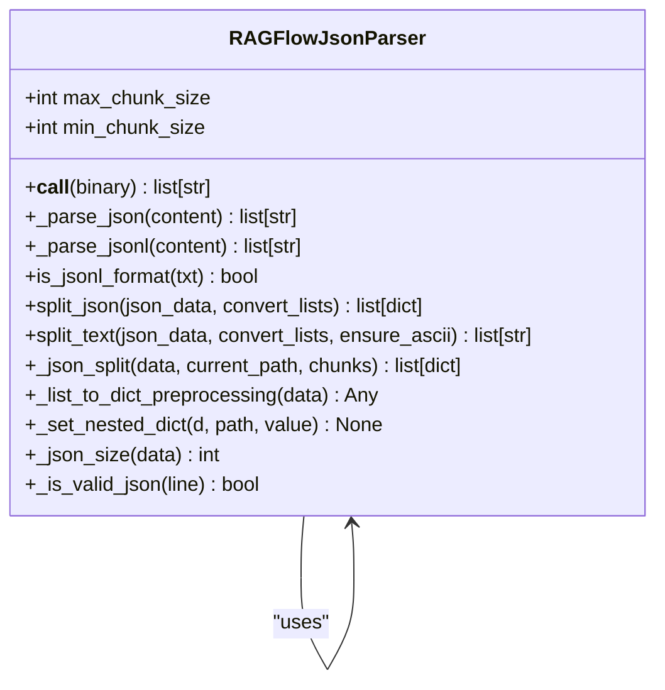
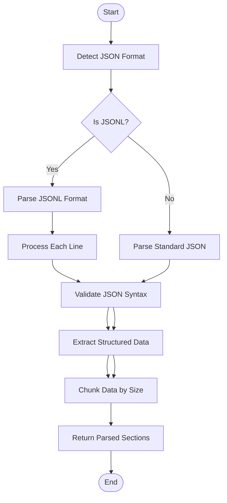
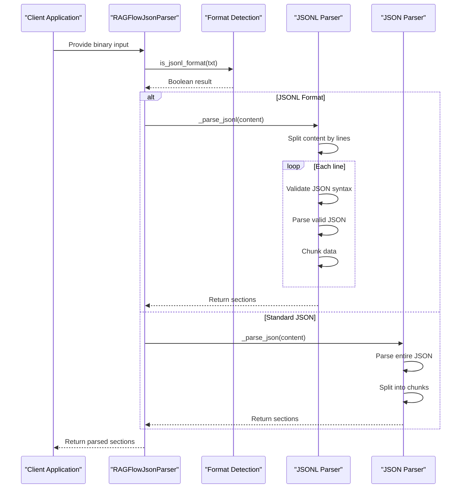
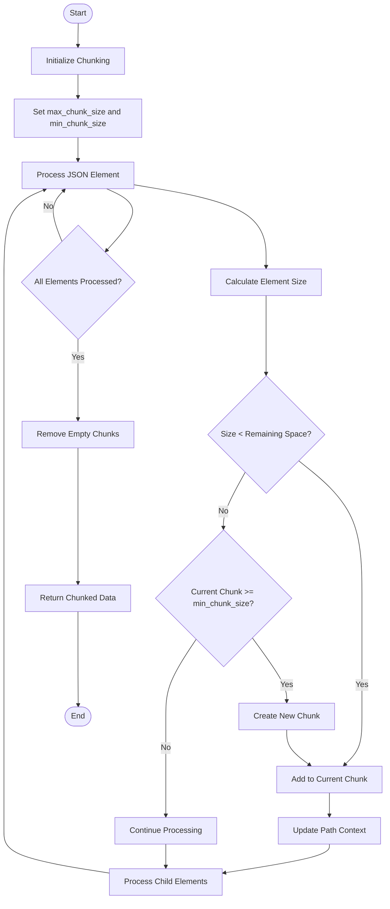
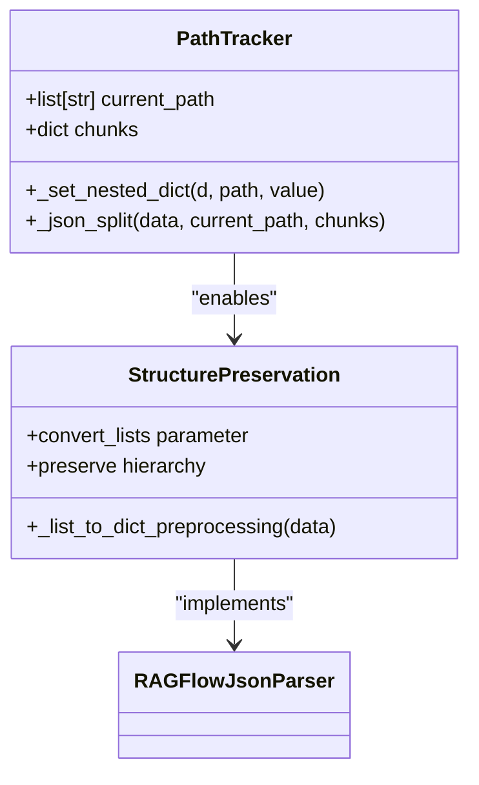
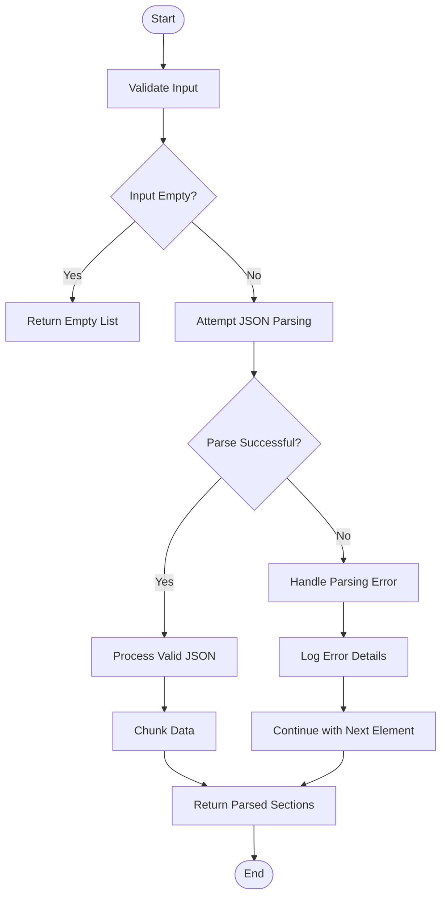
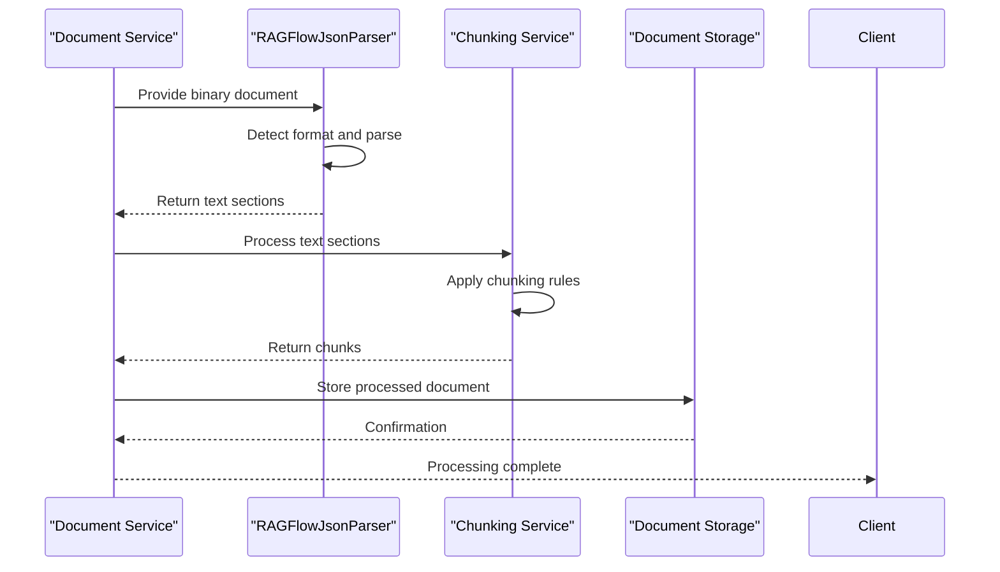
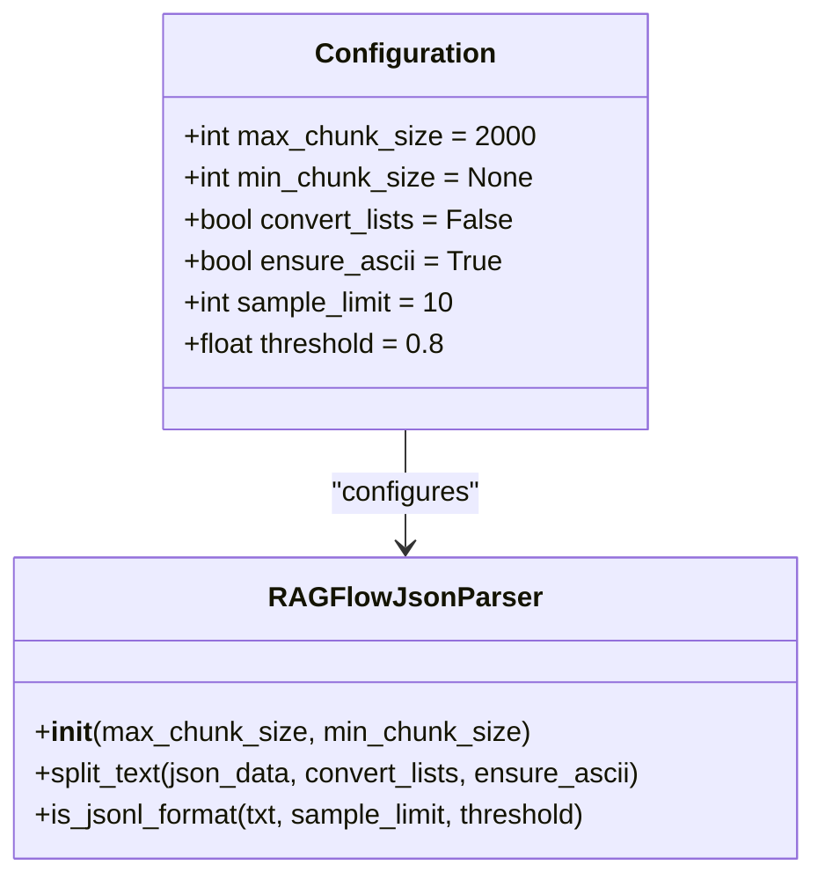

# JSON Document Parsing

<cite>
**Referenced Files in This Document**   
- [json_parser.py](file://deepdoc/parser/json_parser.py)
- [json_encode.py](file://api/utils/json_encode.py)
- [ragflow_server.py](file://api/ragflow_server.py)
</cite>

## Table of Contents
1. [Introduction](#introduction)
2. [JSON Parser Architecture](#json-parser-architecture)
3. [Core Parsing Implementation](#core-parsing-implementation)
4. [Handling Different JSON Formats](#handling-different-json-formats)
5. [Chunking Strategy and Configuration](#chunking-strategy-and-configuration)
6. [Data Structure Preservation](#data-structure-preservation)
7. [Error Handling and Validation](#error-handling-and-validation)
8. [Performance Considerations](#performance-considerations)
9. [Integration with Document Processing Pipeline](#integration-with-document-processing-pipeline)
10. [Configuration Options](#configuration-options)

## Introduction

RAGFlow's JSON document parsing capability provides a robust system for processing JSON and JSONL files, extracting structured data while preserving hierarchical relationships. The parser is designed to handle various data types, manage large files efficiently, and integrate seamlessly with the document processing pipeline. This documentation explains the implementation details, configuration options, and best practices for using the JSON parsing functionality.

The JSON parser in RAGFlow is specifically designed to handle both standard JSON files and JSON Lines (JSONL) format, automatically detecting the appropriate format and applying the correct parsing strategy. The system focuses on maintaining data integrity while optimizing for performance and memory usage.

**Section sources**
- [json_parser.py](file://deepdoc/parser/json_parser.py#L1-L50)

## JSON Parser Architecture

The JSON parsing architecture in RAGFlow is built around the `RAGFlowJsonParser` class, which implements a comprehensive parsing pipeline for JSON documents. The architecture follows a modular design that separates format detection, parsing, chunking, and output generation.



**Diagram sources **
- [json_parser.py](file://deepdoc/parser/json_parser.py#L27-L180)

**Section sources**
- [json_parser.py](file://deepdoc/parser/json_parser.py#L27-L180)

## Core Parsing Implementation

The core parsing implementation in RAGFlow's JSON parser focuses on efficiently processing JSON content while preserving the original structure and relationships. The parser uses a recursive approach to traverse JSON objects and arrays, maintaining the hierarchical context throughout the parsing process.

The parsing process begins with the `__call__` method, which serves as the entry point for processing binary input. This method first detects the character encoding of the input using the `find_codec` function from the `rag.nlp` module, then decodes the binary data into a UTF-8 string for processing.



**Diagram sources **
- [json_parser.py](file://deepdoc/parser/json_parser.py#L32-L41)

**Section sources**
- [json_parser.py](file://deepdoc/parser/json_parser.py#L32-L41)

## Handling Different JSON Formats

RAGFlow's JSON parser supports both standard JSON and JSON Lines (JSONL) formats, automatically detecting and processing each format appropriately. The format detection mechanism uses a combination of heuristics and validation to determine the correct parsing strategy.

For JSONL files, which contain multiple JSON objects separated by newlines, the parser processes each line individually, validating the JSON syntax before extraction. This approach allows for efficient processing of large JSONL files without loading the entire file into memory at once.



**Diagram sources **
- [json_parser.py](file://deepdoc/parser/json_parser.py#L37-L40)
- [json_parser.py](file://deepdoc/parser/json_parser.py#L139-L151)
- [json_parser.py](file://deepdoc/parser/json_parser.py#L129-L137)

**Section sources**
- [json_parser.py](file://deepdoc/parser/json_parser.py#L153-L171)
- [json_parser.py](file://deepdoc/parser/json_parser.py#L139-L151)
- [json_parser.py](file://deepdoc/parser/json_parser.py#L129-L137)

## Chunking Strategy and Configuration

The chunking strategy in RAGFlow's JSON parser is designed to balance data integrity with processing efficiency. The parser splits JSON content into manageable chunks based on configurable size limits while preserving the hierarchical structure of the data.

The chunking process uses a recursive algorithm that traverses the JSON structure, calculating the size of each element and determining whether it can fit within the current chunk or requires a new chunk to be created. This approach ensures that related data elements remain together in the same chunk when possible.



**Diagram sources **
- [json_parser.py](file://deepdoc/parser/json_parser.py#L66-L97)
- [json_parser.py](file://deepdoc/parser/json_parser.py#L98-L114)

**Section sources**
- [json_parser.py](file://deepdoc/parser/json_parser.py#L66-L97)
- [json_parser.py](file://deepdoc/parser/json_parser.py#L98-L114)

## Data Structure Preservation

RAGFlow's JSON parser places significant emphasis on preserving the original data structure and hierarchical relationships during the parsing process. This is achieved through several key mechanisms that maintain the context and relationships between data elements.

The parser uses a path-based approach to track the position of each data element within the JSON hierarchy. When processing nested objects and arrays, the parser maintains a path list that records the sequence of keys or indices leading to the current element. This path information is used to reconstruct the original structure when needed.



**Diagram sources **
- [json_parser.py](file://deepdoc/parser/json_parser.py#L48-L53)
- [json_parser.py](file://deepdoc/parser/json_parser.py#L54-L63)

**Section sources**
- [json_parser.py](file://deepdoc/parser/json_parser.py#L48-L63)

## Error Handling and Validation

The JSON parser in RAGFlow includes comprehensive error handling and validation mechanisms to ensure robust processing of potentially malformed JSON content. The system is designed to gracefully handle various error conditions while providing meaningful feedback about issues encountered during parsing.

For JSON syntax validation, the parser uses Python's built-in `json.loads()` function within try-except blocks to catch `JSONDecodeError` exceptions. This approach allows the parser to identify and skip invalid JSON content without terminating the entire parsing process.



**Diagram sources **
- [json_parser.py](file://deepdoc/parser/json_parser.py#L131-L136)
- [json_parser.py](file://deepdoc/parser/json_parser.py#L146-L150)
- [json_parser.py](file://deepdoc/parser/json_parser.py#L173-L178)

**Section sources**
- [json_parser.py](file://deepdoc/parser/json_parser.py#L131-L136)
- [json_parser.py](file://deepdoc/parser/json_parser.py#L146-L150)
- [json_parser.py](file://deepdoc/parser/json_parser.py#L173-L178)

## Performance Considerations

RAGFlow's JSON parser is optimized for performance when handling large JSON files and complex data structures. The implementation includes several performance-focused features that minimize memory usage and processing time while maintaining data integrity.

One key performance optimization is the streaming approach used for JSONL files, where each line is processed individually rather than loading the entire file into memory. This allows the parser to handle very large JSONL files efficiently, limited only by available disk space rather than RAM.

```mermaid
graph TD
subgraph "Performance Optimizations"
A[Streaming Processing] --> B[Memory Efficiency]
C[Recursive Chunking] --> D[Preserve Structure]
E[Path Tracking] --> F[Context Preservation]
G[Size Calculation] --> H[Optimal Chunking]
end
subgraph "Resource Management"
I[Memory Usage] --> J[Streaming for JSONL]
K[Processing Time] --> L[Efficient Recursion]
M[CPU Utilization] --> N[Minimal String Operations]
end
Performance Optimizations --> Resource Management
```

**Diagram sources **
- [json_parser.py](file://deepdoc/parser/json_parser.py#L34-L35)
- [json_parser.py](file://deepdoc/parser/json_parser.py#L140-L142)

**Section sources**
- [json_parser.py](file://deepdoc/parser/json_parser.py#L34-L35)
- [json_parser.py](file://deepdoc/parser/json_parser.py#L140-L142)

## Integration with Document Processing Pipeline

The JSON parser integrates seamlessly with RAGFlow's broader document processing pipeline, working in conjunction with other components to provide a comprehensive document analysis capability. The parser is designed as a modular component that can be easily incorporated into various processing workflows.

The integration follows a standardized interface pattern, where the parser accepts binary input and returns structured text sections that can be further processed by downstream components. This design allows for consistent handling of different document types within the same processing framework.



**Diagram sources **
- [json_parser.py](file://deepdoc/parser/json_parser.py#L32-L41)
- [ragflow_server.py](file://api/ragflow_server.py)

**Section sources**
- [json_parser.py](file://deepdoc/parser/json_parser.py#L32-L41)

## Configuration Options

RAGFlow's JSON parser provides several configuration options that allow users to customize the parsing behavior according to their specific requirements. These options control various aspects of the parsing process, including chunk size, list handling, and output formatting.

The primary configuration parameters include `max_chunk_size` and `min_chunk_size`, which determine the size limits for generated chunks. The `convert_lists` parameter controls whether JSON arrays should be converted to dictionary format with index-based keys, which can be useful for preserving structure in certain use cases.



**Diagram sources **
- [json_parser.py](file://deepdoc/parser/json_parser.py#L28-L31)
- [json_parser.py](file://deepdoc/parser/json_parser.py#L116-L127)
- [json_parser.py](file://deepdoc/parser/json_parser.py#L153-L171)

**Section sources**
- [json_parser.py](file://deepdoc/parser/json_parser.py#L28-L31)
- [json_parser.py](file://deepdoc/parser/json_parser.py#L116-L127)
- [json_parser.py](file://deepdoc/parser/json_parser.py#L153-L171)