# PDF Document Parsing

<cite>
**Referenced Files in This Document**
- [pdf_parser.py](file://deepdoc/parser/pdf_parser.py)
- [layout_recognizer.py](file://deepdoc/vision/layout_recognizer.py)
- [ocr.py](file://deepdoc/vision/ocr.py)
- [file_utils.py](file://api/utils/file_utils.py)
- [parser.py](file://rag/flow/parser/parser.py)
- [manual.py](file://rag/app/manual.py)
- [paper.py](file://rag/app/paper.py)
- [utils.py](file://deepdoc/parser/utils.py)
- [tcadp_parser.py](file://deepdoc/parser/tcadp_parser.py)
- [mineru_parser.py](file://deepdoc/parser/mineru_parser.py)
</cite>

## Table of Contents
1. [Introduction](#introduction)
2. [Architecture Overview](#architecture-overview)
3. [Core Components](#core-components)
4. [PDF Parser Implementation](#pdf-parser-implementation)
5. [Vision Components Integration](#vision-components-integration)
6. [Configuration Options](#configuration-options)
7. [Processing Pipeline](#processing-pipeline)
8. [Error Handling and Edge Cases](#error-handling-and-edge-cases)
9. [Performance Optimization](#performance-optimization)
10. [Troubleshooting Guide](#troubleshooting-guide)
11. [Best Practices](#best-practices)
12. [Conclusion](#conclusion)

## Introduction

RAGFlow's PDF document parsing capability represents a sophisticated multi-modal approach to extracting structured content from PDF documents. The system combines advanced computer vision techniques, natural language processing, and machine learning models to accurately parse complex documents containing text, tables, figures, and multi-column layouts.

The PDF parser architecture is designed to handle various document types and complexities, from simple text documents to highly structured academic papers and technical reports. It employs multiple parsing strategies and integrates seamlessly with vision components for layout recognition and OCR processing.

## Architecture Overview

The PDF parsing system follows a modular architecture with clear separation of concerns:

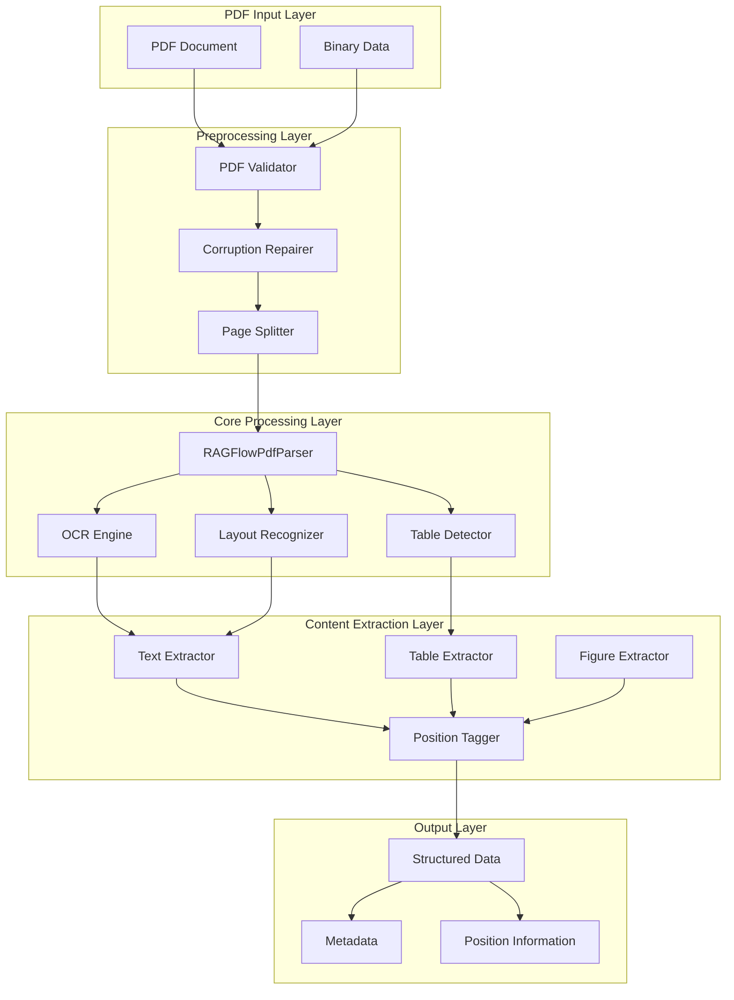

**Diagram sources**
- [pdf_parser.py](file://deepdoc/parser/pdf_parser.py#L52-L105)
- [layout_recognizer.py](file://deepdoc/vision/layout_recognizer.py#L33-L80)
- [ocr.py](file://deepdoc/vision/ocr.py#L536-L580)

## Core Components

### RAGFlowPdfParser Base Class

The foundation of the PDF parsing system is the `RAGFlowPdfParser` class, which provides core functionality for document processing:

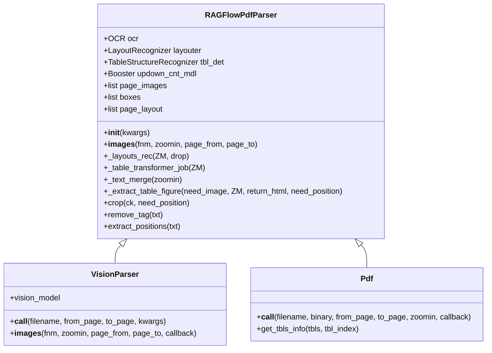

**Diagram sources**
- [pdf_parser.py](file://deepdoc/parser/pdf_parser.py#L52-L105)
- [pdf_parser.py](file://deepdoc/parser/pdf_parser.py#L1425-L1479)

### Vision Components

The system integrates multiple vision components for comprehensive document analysis:

| Component | Purpose | Technology | Output |
|-----------|---------|------------|--------|
| LayoutRecognizer | Document structure detection | ONNX/YOLOv10/Ascend | Layout regions with types |
| OCR | Text recognition | ONNX-based | Text with coordinates |
| TableStructureRecognizer | Table structure analysis | Custom ML model | Table cells and structure |
| TextDetector | Text region detection | DBNet-based | Text bounding boxes |
| TextRecognizer | Character recognition | CTC-based | Recognized text |

**Section sources**
- [layout_recognizer.py](file://deepdoc/vision/layout_recognizer.py#L33-L80)
- [ocr.py](file://deepdoc/vision/ocr.py#L133-L200)

## PDF Parser Implementation

### Multi-Strategy Parsing Approach

RAGFlow implements multiple PDF parsing strategies to handle different document types:

#### DeepDOC Parser (Default)
The primary parsing engine that combines layout recognition and OCR:

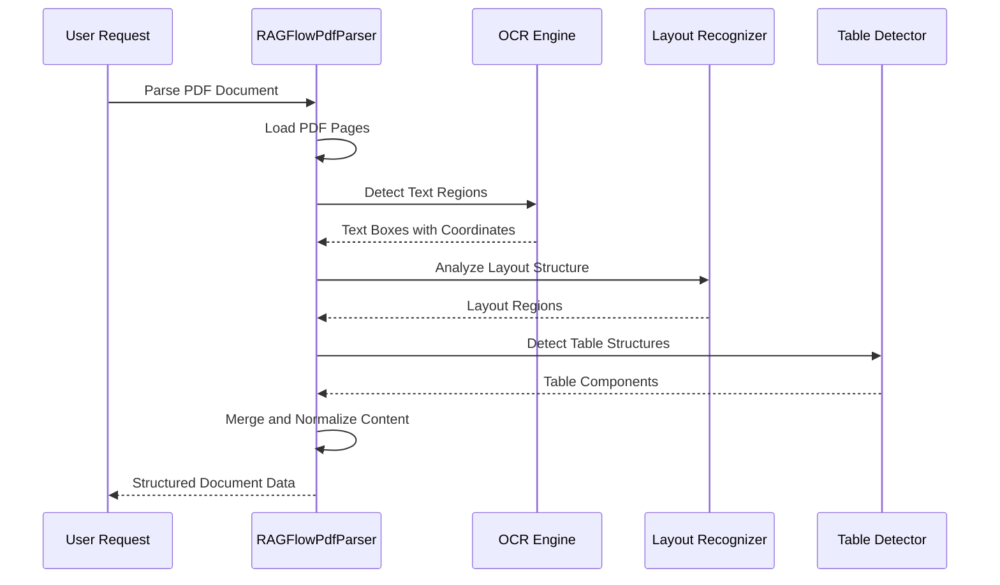

**Diagram sources**
- [pdf_parser.py](file://deepdoc/parser/pdf_parser.py#L1441-L1474)
- [ocr.py](file://deepdoc/vision/ocr.py#L663-L752)

#### Plain Text Parser
Simple text extraction without layout analysis:

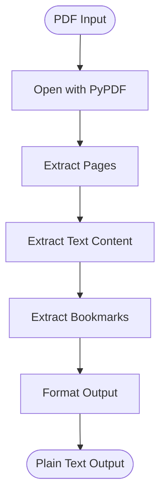

**Diagram sources**
- [pdf_parser.py](file://deepdoc/parser/pdf_parser.py#L1391-L1416)

#### Advanced Parsers
Specialized parsers for specific document types:

| Parser Type | Use Case | Features |
|-------------|----------|----------|
| Paper Parser | Academic papers | Title/author extraction, section detection |
| Manual Parser | Technical manuals | Hierarchical structure, bullet detection |
| Presentation Parser | Slides | Slide content assembly |
| QA Parser | Question-answer formats | Q&A pair extraction |

**Section sources**
- [paper.py](file://rag/app/paper.py#L28-L138)
- [manual.py](file://rag/app/manual.py#L30-L71)
- [presentation.py](file://rag/app/presentation.py#L58-L148)

### Text Extraction and Normalization

The parser implements sophisticated text extraction with multiple normalization steps:

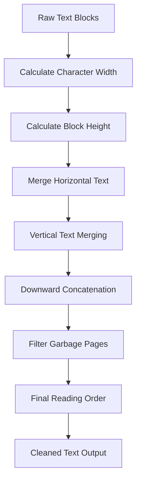

**Diagram sources**
- [pdf_parser.py](file://deepdoc/parser/pdf_parser.py#L441-L556)

**Section sources**
- [pdf_parser.py](file://deepdoc/parser/pdf_parser.py#L441-L583)

## Vision Components Integration

### Layout Recognition Pipeline

The layout recognition system identifies document regions and assigns semantic types:

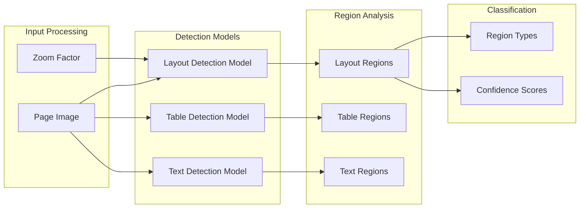

**Diagram sources**
- [layout_recognizer.py](file://deepdoc/vision/layout_recognizer.py#L33-L158)

### OCR Processing Chain

The OCR system processes detected text regions with multiple optimization steps:

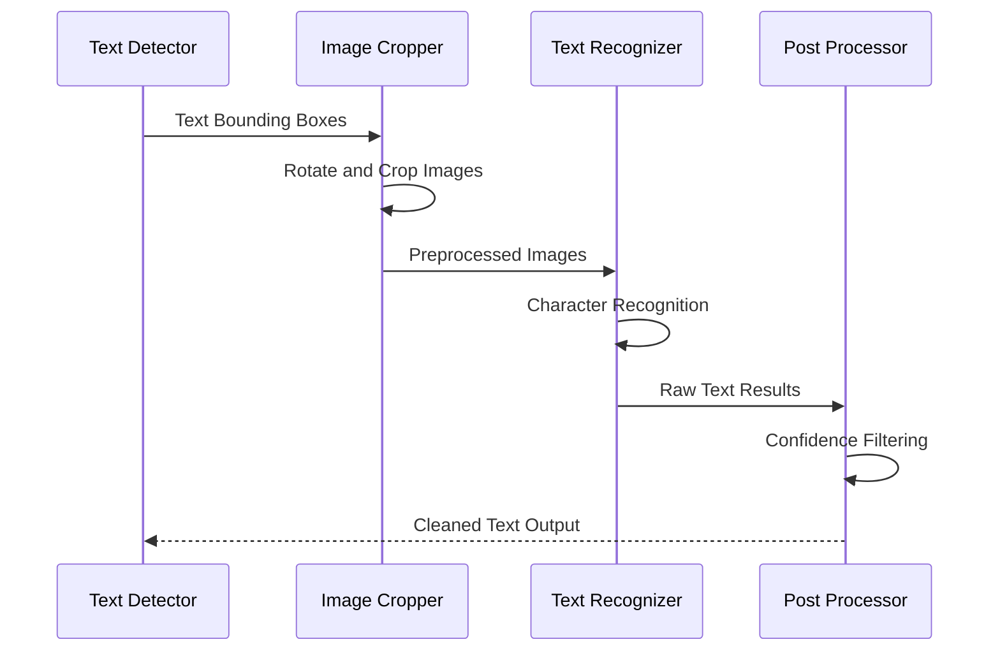

**Diagram sources**
- [ocr.py](file://deepdoc/vision/ocr.py#L663-L752)

**Section sources**
- [ocr.py](file://deepdoc/vision/ocr.py#L133-L752)

### Table Structure Recognition

Advanced table detection and structure analysis:

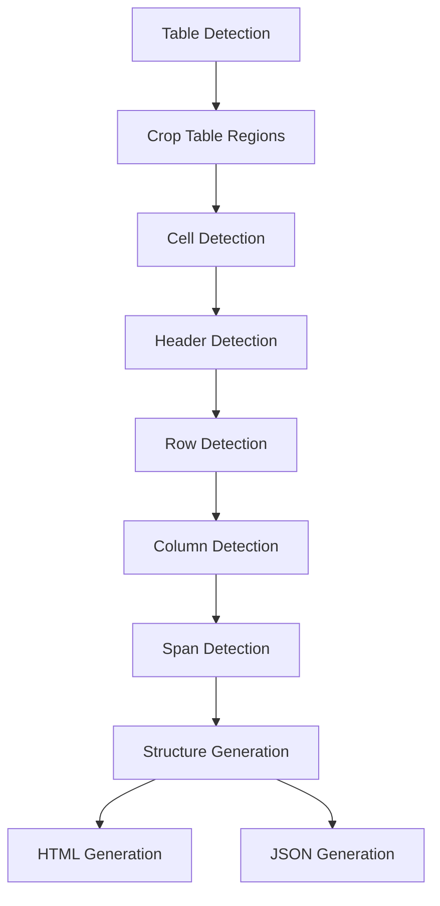

**Diagram sources**
- [pdf_parser.py](file://deepdoc/parser/pdf_parser.py#L196-L281)

**Section sources**
- [pdf_parser.py](file://deepdoc/parser/pdf_parser.py#L196-L281)

## Configuration Options

### Parser Selection and Configuration

RAGFlow supports multiple parsing strategies with extensive configuration options:

| Configuration Parameter | Description | Default Value | Options |
|------------------------|-------------|---------------|---------|
| `parse_method` | Parsing strategy | "DeepDOC" | "DeepDOC", "plain_text", "mineru", "tcadp parser" |
| `layout_recognize` | Layout recognition type | "DeepDOC" | "DeepDOC", "ONNX", "Ascend" |
| `task_page_size` | Pages per processing task | 12 | 1-1000 |
| `table_context_size` | Table context window | 0 | 0-100 |
| `image_context_size` | Image context window | 0 | 0-100 |
| `lang` | Language for VLM parsing | "en" | "en", "zh", "ja", "ko" |

### Advanced Configuration Parameters

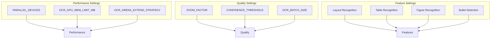

**Section sources**
- [parser.py](file://rag/flow/parser/parser.py#L175-L192)

### Environment Variables

Critical environment variables for PDF parsing:

| Variable | Purpose | Default | Impact |
|----------|---------|---------|--------|
| `LAYOUT_RECOGNIZER_TYPE` | Layout recognition backend | "onnx" | Performance, accuracy |
| `OCR_GPU_MEM_LIMIT_MB` | GPU memory allocation | 2048 | Memory usage, processing speed |
| `OCR_ARENA_EXTEND_STRATEGY` | Memory allocation strategy | "kNextPowerOfTwo" | Memory efficiency |
| `HF_ENDPOINT` | HuggingFace mirror endpoint | - | Model download reliability |

## Processing Pipeline

### Complete Document Processing Workflow

The PDF parsing pipeline implements a sophisticated multi-stage processing approach:

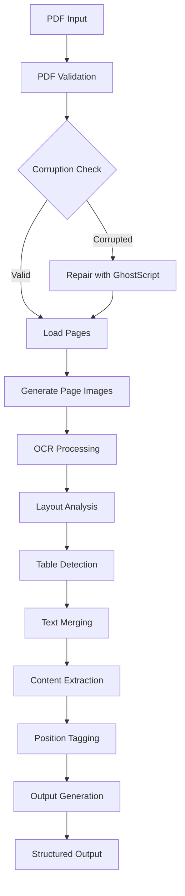

**Diagram sources**
- [pdf_parser.py](file://deepdoc/parser/pdf_parser.py#L1441-L1474)

### Stage-by-Stage Processing Details

#### 1. PDF Validation and Preparation
- File format verification
- Password protection handling
- Corruption detection and repair
- Memory optimization

#### 2. Image Generation and OCR
- High-resolution image conversion
- Text region detection
- Character recognition
- Confidence scoring

#### 3. Layout Analysis
- Document structure identification
- Region classification
- Semantic type assignment
- Boundary refinement

#### 4. Content Extraction
- Text content extraction
- Table structure analysis
- Figure and illustration detection
- Metadata extraction

#### 5. Post-Processing
- Content normalization
- Position tagging
- Structure validation
- Output formatting

**Section sources**
- [pdf_parser.py](file://deepdoc/parser/pdf_parser.py#L1041-L1474)

## Error Handling and Edge Cases

### Common PDF Issues and Solutions

#### Password-Protected Documents
The system attempts automatic password detection and handling:

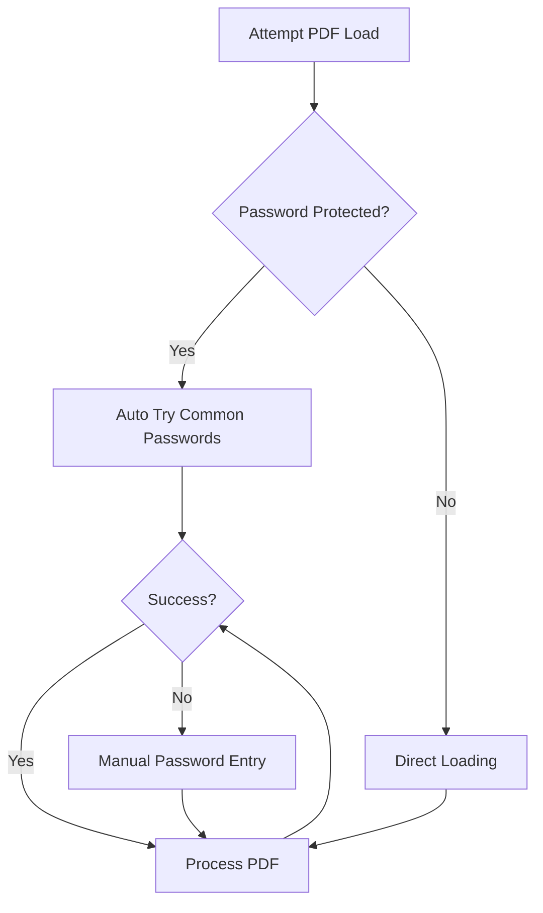

#### Corrupted PDF Files
Multi-layer corruption detection and repair:

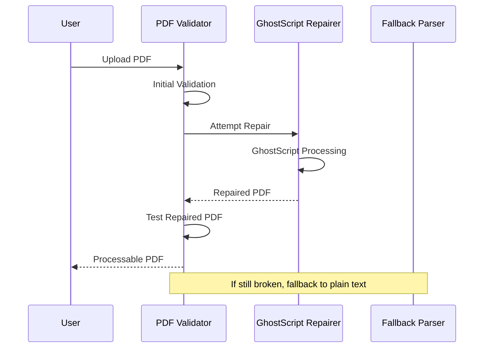

**Diagram sources**
- [file_utils.py](file://api/utils/file_utils.py#L149-L166)

#### Large File Handling
Memory-efficient processing for large documents:

| Strategy | Implementation | Benefits |
|----------|----------------|----------|
| Page-wise Processing | Process N pages at once | Memory control |
| Streaming Processing | Process without full loading | Reduced memory usage |
| Parallel Processing | Multi-device support | Faster processing |
| Lazy Loading | Load pages on demand | Improved responsiveness |

**Section sources**
- [file_utils.py](file://api/utils/file_utils.py#L149-L166)

### Error Recovery Mechanisms

The system implements comprehensive error recovery:

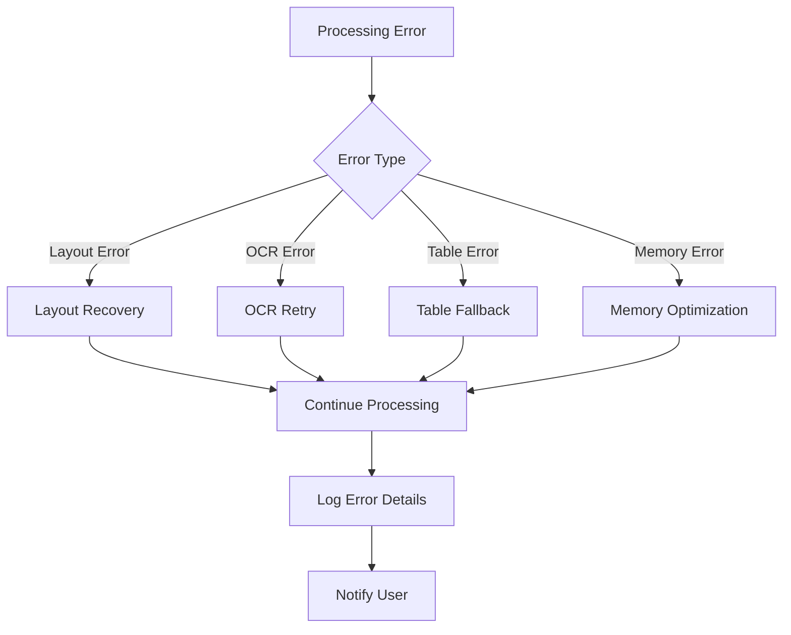

**Section sources**
- [pdf_parser.py](file://deepdoc/parser/pdf_parser.py#L1430-L1440)

## Performance Optimization

### Memory Management Strategies

#### Efficient Memory Usage
- Dynamic memory allocation based on document size
- Automatic garbage collection
- Memory pool management
- Streaming processing for large files

#### Processing Speed Optimization
- Parallel processing across multiple devices
- Batch processing for OCR operations
- Intelligent caching of frequently used models
- Optimized image preprocessing

### Scalability Considerations

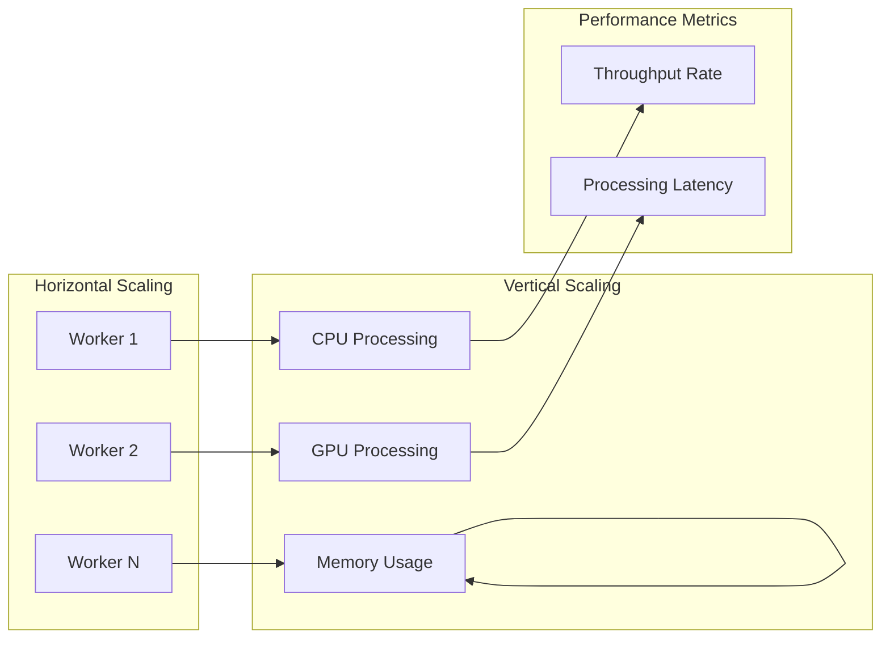

**Section sources**
- [ocr.py](file://deepdoc/vision/ocr.py#L71-L130)

## Troubleshooting Guide

### Common Issues and Solutions

#### Issue: Poor OCR Accuracy
**Symptoms:** Incorrect text recognition, missing content
**Solutions:**
- Increase zoom factor (default: 3x)
- Adjust confidence thresholds
- Enable parallel processing
- Verify image quality

#### Issue: Slow Processing Speed
**Symptoms:** Long processing times, timeout errors
**Solutions:**
- Reduce page size for tasks
- Enable parallel devices
- Optimize GPU memory settings
- Use simpler parsing methods

#### Issue: Table Structure Errors
**Symptoms:** Misaligned tables, missing cells
**Solutions:**
- Adjust table detection sensitivity
- Enable table structure recognition
- Manually verify table boundaries
- Use alternative parsing methods

#### Issue: Memory Exhaustion
**Symptoms:** Out of memory errors, system slowdown
**Solutions:**
- Reduce batch sizes
- Enable memory optimization
- Process smaller page ranges
- Close unnecessary applications

### Diagnostic Tools

The system provides comprehensive logging and monitoring:

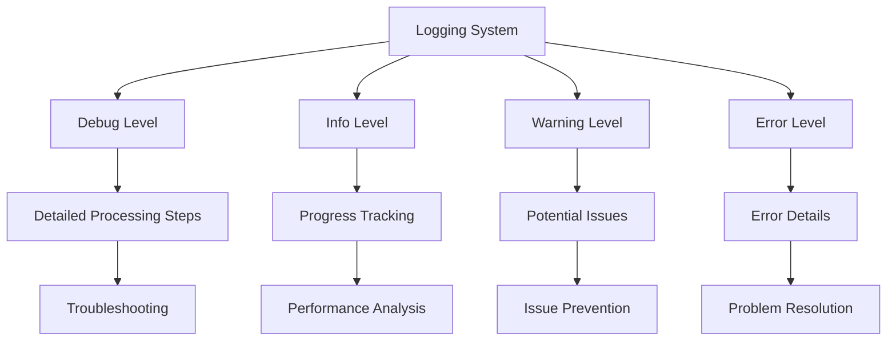

**Section sources**
- [pdf_parser.py](file://deepdoc/parser/pdf_parser.py#L1430-L1440)

## Best Practices

### Document Preparation Guidelines

#### Optimal PDF Structure
- Use vector graphics when possible
- Avoid excessive compression
- Maintain logical reading order
- Include proper metadata

#### Configuration Recommendations
- Use "DeepDOC" for most documents
- Enable layout recognition for complex documents
- Set appropriate page sizes for your hardware
- Monitor memory usage during processing

### Integration Patterns

#### Batch Processing
For processing multiple documents efficiently:
- Group similar document types
- Use parallel processing where available
- Implement progress tracking
- Handle failures gracefully

#### Real-time Processing
For interactive applications:
- Use minimal parsing methods
- Implement caching strategies
- Provide progress feedback
- Handle timeouts appropriately

### Monitoring and Maintenance

#### Performance Monitoring
- Track processing times per document type
- Monitor memory usage patterns
- Analyze error rates and patterns
- Optimize based on usage statistics

#### Model Updates
- Regularly update vision models
- Monitor model performance
- Implement gradual rollouts
- Maintain backward compatibility

## Conclusion

RAGFlow's PDF document parsing capability represents a comprehensive solution for extracting structured content from diverse document types. The system's modular architecture, advanced vision components, and robust error handling make it suitable for production environments handling complex document processing requirements.

Key strengths include:
- Multi-strategy parsing approaches
- Advanced layout recognition
- Robust error handling and recovery
- Performance optimization features
- Extensive configuration options

The system continues to evolve with improvements in AI models, processing efficiency, and feature coverage, making it a reliable choice for document processing applications in various domains.