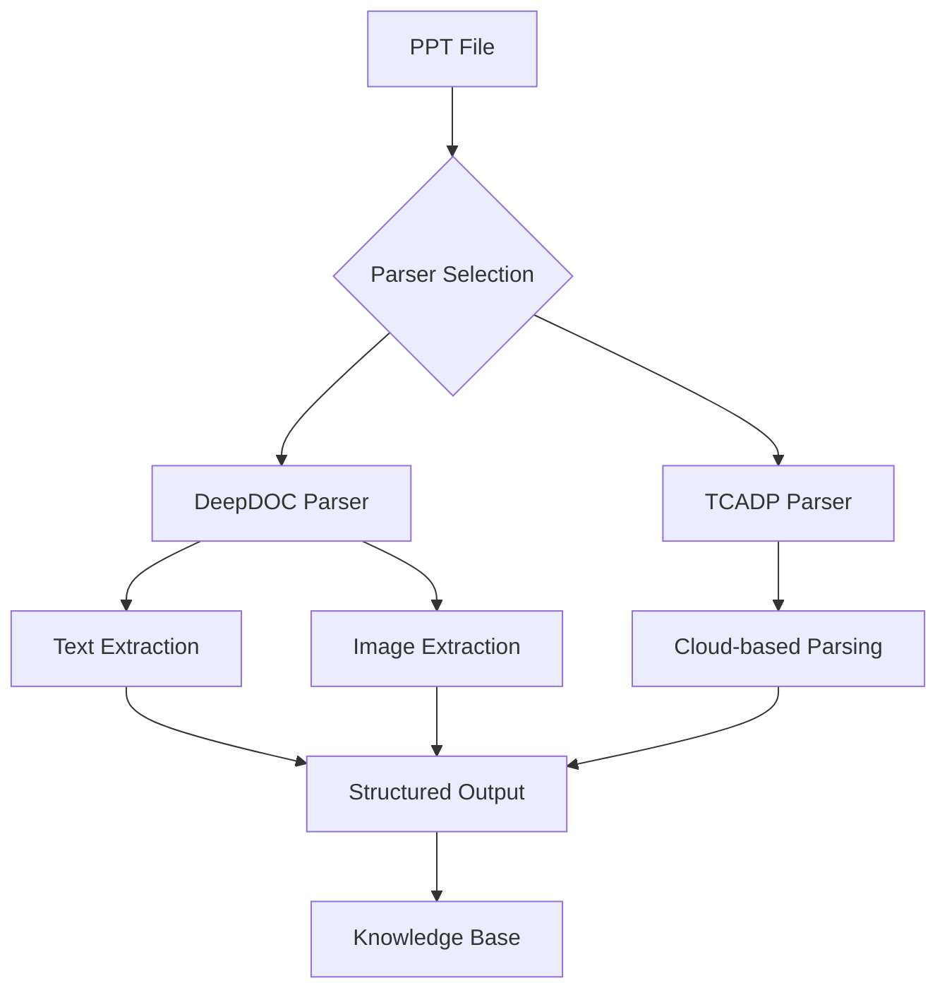
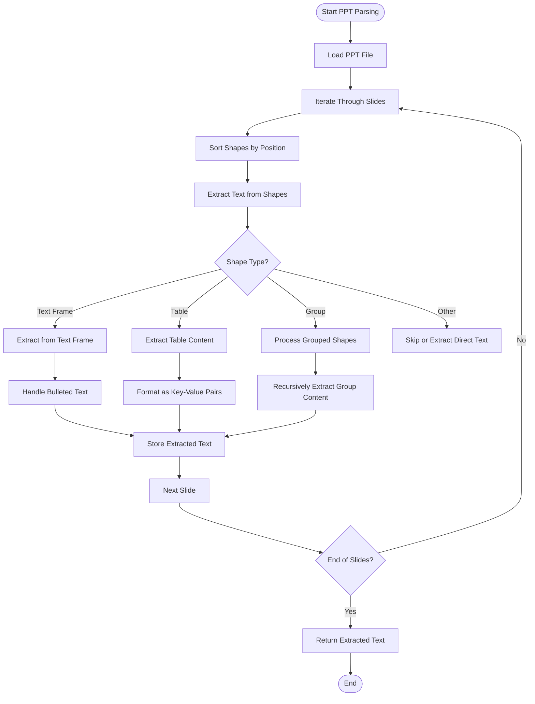
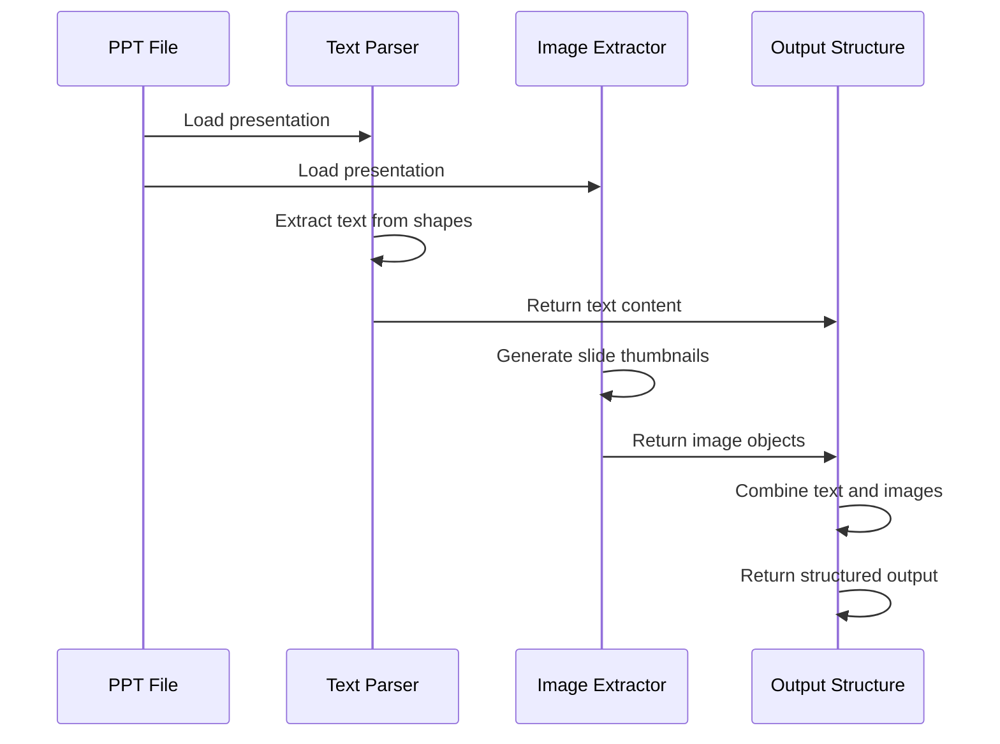
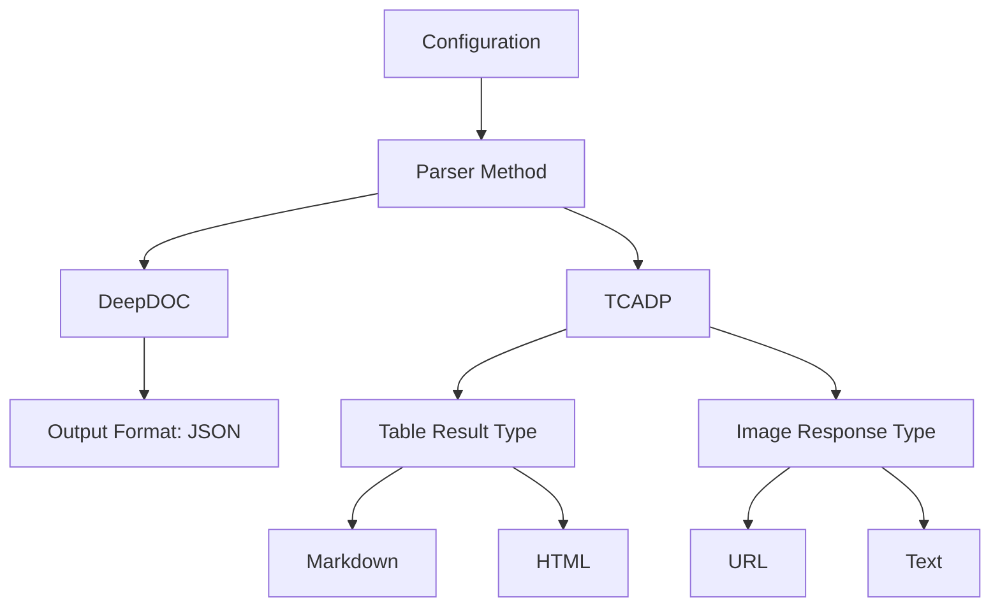
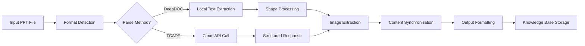
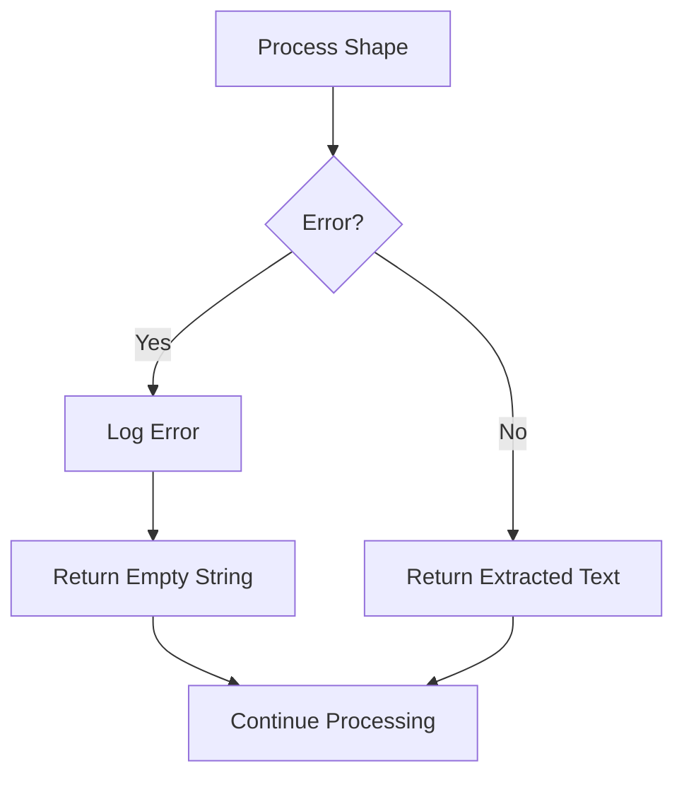

# PPT Document Parsing

<cite>
**Referenced Files in This Document**   
- [ppt_parser.py](file://deepdoc/parser/ppt_parser.py)
- [presentation.py](file://rag/app/presentation.py)
- [parser.py](file://rag/flow/parser/parser.py)
- [tcadp_parser.py](file://deepdoc/parser/tcadp_parser.py)
- [ppt-preview.tsx](file://web/src/components/document-preview/ppt-preview.tsx)
- [ppt-form-fields.tsx](file://web/src/pages/agent/form/parser-form/ppt-form-fields.tsx)
</cite>

## Table of Contents
1. [Introduction](#introduction)
2. [PPT Parsing Architecture](#ppt-parsing-architecture)
3. [Text Extraction Process](#text-extraction-process)
4. [Presentation Structure Preservation](#presentation-structure-preservation)
5. [Multimedia Element Handling](#multimedia-element-handling)
6. [Configuration Options](#configuration-options)
7. [Parsing Pipeline Implementation](#parsing-pipeline-implementation)
8. [Error Handling and Troubleshooting](#error-handling-and-troubleshooting)
9. [Conclusion](#conclusion)

## Introduction

RAGFlow's PPT document parsing capability provides robust extraction of content from PowerPoint presentations, enabling effective processing of presentation materials for retrieval-augmented generation applications. The system supports both .ppt and .pptx formats, extracting text content while preserving the original presentation structure and handling multimedia elements appropriately.

The PPT parsing functionality is designed to handle various PowerPoint features including text content, tables, images, and presentation layout. It offers multiple parsing methods and configuration options to accommodate different use cases and requirements. The architecture integrates with RAGFlow's document processing pipeline, ensuring seamless integration with the broader system.

**Section sources**
- [presentation.py](file://rag/app/presentation.py#L165-L169)

## PPT Parsing Architecture

The PPT parsing architecture in RAGFlow consists of multiple components working together to extract and process presentation content. The system provides two primary parsing methods: the default DeepDOC parser and the TCADP (Tencent Cloud AI Document Parser) parser.

**Diagram sources**
- [parser.py](file://rag/flow/parser/parser.py#L461-L534)
- [presentation.py](file://rag/app/presentation.py#L31-L57)

The architecture follows a modular design where the parsing process is initiated through the document processing pipeline. When a PPT file is detected, the system routes it to the appropriate parser based on the configured parsing method. The DeepDOC parser handles local processing using Python libraries, while the TCADP parser leverages Tencent Cloud's AI services for enhanced document analysis.

The parsing process begins with format detection, where the system identifies whether the file is a .ppt or .pptx format. This information is used to determine the appropriate parsing strategy and configuration parameters. The system then extracts both textual and visual content, preserving the relationship between slides and their content.

**Section sources**
- [parser.py](file://rag/flow/parser/parser.py#L461-L534)
- [presentation.py](file://rag/app/presentation.py#L31-L57)

## Text Extraction Process

The text extraction process in RAGFlow's PPT parser systematically extracts content from each slide while preserving formatting and structural information. The core implementation uses the python-pptx library to access the presentation structure and extract text content from various elements.

**Diagram sources**
- [ppt_parser.py](file://deepdoc/parser/ppt_parser.py#L77-L99)
- [ppt_parser.py](file://deepdoc/parser/ppt_parser.py#L33-L76)

The text extraction process begins by loading the PPT file using the Presentation class from the python-pptx library. The parser iterates through each slide in the presentation, processing shapes in a specific order based on their position on the slide. Shapes are sorted by their top and left coordinates to maintain the visual reading order.

For each shape, the parser first checks if it contains a text frame. If a text frame exists, the parser extracts text from each paragraph, preserving bullet point formatting by detecting bulleted text through XML attributes. The parser identifies bulleted text by checking for the presence of bullet characters, automatic numbering, or bullet blips in the paragraph properties.

The system handles various shape types differently:
- Text frames are processed to extract paragraph text with bullet formatting
- Tables are converted to structured text with key-value pairs for each row
- Grouped shapes are processed recursively to extract text from all contained elements
- Other shapes are checked for direct text content

Special attention is given to preserving the hierarchical structure of bulleted lists by indenting text based on the paragraph level. This ensures that the extracted text maintains the original presentation's logical structure and readability.

**Section sources**
- [ppt_parser.py](file://deepdoc/parser/ppt_parser.py#L26-L31)
- [ppt_parser.py](file://deepdoc/parser/ppt_parser.py#L53-L60)

## Presentation Structure Preservation

RAGFlow's PPT parser preserves the original presentation structure by maintaining the relationship between slides and their content while organizing extracted information in a hierarchical format. The system captures the sequential nature of presentations and maintains the spatial arrangement of content on each slide.

The parser preserves structure through several mechanisms:
1. Slide-level organization: Each slide's content is processed as a discrete unit, maintaining the presentation's sequential flow
2. Position-based sorting: Shapes are processed in reading order based on their top and left coordinates
3. Hierarchical text formatting: Bullet levels are preserved through indentation in the extracted text
4. Content grouping: Related elements are kept together in the output structure

The system uses a sorting algorithm that prioritizes vertical position (top coordinate) and then horizontal position (left coordinate) to ensure content is extracted in a logical reading order. This approach maintains the intended flow of information as designed by the presentation author.

For complex layouts with multiple columns or non-linear arrangements, the parser uses a grid-based approach by dividing the slide into horizontal bands (using top coordinate divided by 10) and then sorting within each band by left position. This effectively handles presentations with sidebars, multi-column layouts, or other non-standard arrangements.

The structure preservation extends to the output format, where each slide's content is returned as a separate text block, maintaining the discrete nature of individual slides. This allows downstream processes to treat each slide as a distinct content unit while still preserving the overall presentation sequence.

**Section sources**
- [ppt_parser.py](file://deepdoc/parser/ppt_parser.py#L89-L90)
- [presentation.py](file://rag/app/presentation.py#L56)

## Multimedia Element Handling

RAGFlow's PPT parser handles multimedia elements through a comprehensive approach that extracts both visual and textual content from presentations. The system captures images, tables, and other non-text elements while maintaining their relationship to the surrounding text content.

The multimedia handling process involves two main components: image extraction and table processing. For image extraction, the system uses Aspose.Slides to generate thumbnails of each slide, preserving the visual context of the presentation. These thumbnails are stored alongside the extracted text, allowing for multimodal analysis and retrieval.

**Diagram sources**
- [presentation.py](file://rag/app/presentation.py#L39-L56)

Table processing is handled by converting PowerPoint tables into structured text format. The parser extracts table content by creating key-value pairs from header rows and data rows, making tabular information accessible for text-based analysis. Each table row is converted to a semicolon-separated string with column headers as keys.

The system also handles embedded objects and charts by extracting them as images and preserving their position within the slide content. This ensures that visual data representations are not lost during the parsing process.

For multimedia elements, the parser maintains synchronization between text and visual content by ensuring that the number of extracted text blocks matches the number of extracted images. An assertion check verifies this alignment, preventing data mismatches that could affect downstream processing.

**Section sources**
- [presentation.py](file://rag/app/presentation.py#L39-L56)
- [ppt_parser.py](file://deepdoc/parser/ppt_parser.py#L53-L60)

## Configuration Options

RAGFlow provides several configuration options for PPT parsing, allowing users to customize the parsing behavior according to their specific requirements. These options are accessible through the system's configuration interface and can be set at the document or project level.

The primary configuration options include:

### Parser Selection
Users can choose between two parsing methods:
- **DeepDOC Parser**: Local parsing using Python libraries (default)
- **TCADP Parser**: Cloud-based parsing using Tencent Cloud AI services

### Output Format
The system supports JSON output format for PPT files, which structures the extracted content with text and image information for each slide.

### TCADP-Specific Options
When using the TCADP parser, additional configuration options are available:
- **Table Result Type**: Determines how tables are represented in the output
  - Markdown format (value: "0")
  - HTML format (value: "1")
- **Markdown Image Response Type**: Controls how images are referenced in the output
  - URL references (value: "0")
  - Text descriptions (value: "1")

**Diagram sources**
- [ppt-form-fields.tsx](file://web/src/pages/agent/form/parser-form/ppt-form-fields.tsx#L15-L23)
- [parser.py](file://rag/flow/parser/parser.py#L471-L472)

The configuration system validates that the selected parser method is appropriate for PPT files and ensures that required dependencies are available. For the TCADP parser, the system checks for proper API configuration before attempting to process documents.

These configuration options provide flexibility in handling different types of presentations and integration requirements, allowing users to optimize the parsing process for their specific use cases.

**Section sources**
- [ppt-form-fields.tsx](file://web/src/pages/agent/form/parser-form/ppt-form-fields.tsx#L25-L42)
- [parser.py](file://rag/flow/parser/parser.py#L467-L473)

## Parsing Pipeline Implementation

The PPT parsing pipeline in RAGFlow follows a structured sequence of operations that transforms raw presentation files into structured, searchable content. The implementation integrates with the broader document processing framework, ensuring consistent handling across different file types.

**Diagram sources**
- [parser.py](file://rag/flow/parser/parser.py#L461-L534)
- [presentation.py](file://rag/app/presentation.py#L31-L57)

The pipeline begins with format detection, where the system identifies the file as a PowerPoint presentation based on its extension (.ppt or .pptx). This triggers the PPT-specific processing workflow. The system then checks the configured parsing method and routes the file accordingly.

For the DeepDOC parser, the pipeline first extracts text content using the RAGFlowPptParser class, which processes each slide and its shapes to extract textual information. After text extraction is complete, the system uses Aspose.Slides to generate thumbnails of each slide, capturing the visual representation of the content.

The TCADP parser route sends the document to Tencent Cloud's AI Document Parser service, which returns structured content including text, tables, and layout information. This cloud-based approach provides enhanced parsing capabilities, particularly for complex layouts and embedded objects.

A critical step in the pipeline is content synchronization, where the system ensures that the number of extracted text blocks matches the number of generated images. This alignment is verified through an assertion check, preventing data inconsistencies that could affect downstream processing.

The final step formats the output as a list of tuples, each containing the extracted text and corresponding slide image. This structured format enables efficient indexing and retrieval in the knowledge base, supporting both text-based and multimodal search capabilities.

**Section sources**
- [parser.py](file://rag/flow/parser/parser.py#L461-L534)
- [presentation.py](file://rag/app/presentation.py#L31-L57)

## Error Handling and Troubleshooting

RAGFlow's PPT parsing system includes comprehensive error handling mechanisms to address common issues that may arise during document processing. The system is designed to gracefully handle corrupted files, compatibility problems, and missing dependencies.

The primary error handling strategies include:

### Exception Handling
The parser implements try-catch blocks around critical operations to prevent crashes and provide meaningful error messages. For shape processing, any exceptions are caught and logged, allowing the parser to continue processing remaining content.

**Diagram sources**
- [ppt_parser.py](file://deepdoc/parser/ppt_parser.py#L73-L75)

### Specific Error Cases
The system handles several specific error scenarios:
- **Runtime Errors in Image Extraction**: When generating slide thumbnails, runtime errors are caught and re-raised with additional context about the affected slide
- **Missing Dependencies**: The TCADP parser checks for required API configuration before processing
- **Shape Type Access Errors**: NotImplementedErrors when accessing shape types are handled gracefully

### Common Issues and Solutions
**Corrupted PPT Files**: The system attempts to load files using BytesIO for binary content, which can handle some forms of corruption. For severely corrupted files, the system logs the error and continues processing other documents.

**Compatibility Problems**: The parser supports both .ppt and .pptx formats by using appropriate libraries and conversion methods. For older .ppt files, the system may use file conversion services when available.

**Missing Fonts**: Since the parser extracts text content rather than rendering visual output, missing fonts do not affect text extraction. The system focuses on content rather than visual appearance.

**Large Presentations**: The system processes slides sequentially and can handle large presentations by processing one slide at a time, minimizing memory usage.

The error handling system prioritizes robustness and continuity, ensuring that issues with individual files or slides do not disrupt the overall processing pipeline. Detailed logging provides diagnostic information for troubleshooting, while user-facing messages maintain clarity about processing status.

**Section sources**
- [ppt_parser.py](file://deepdoc/parser/ppt_parser.py#L73-L75)
- [presentation.py](file://rag/app/presentation.py#L48-L50)

## Conclusion

RAGFlow's PPT document parsing capability provides a comprehensive solution for extracting and processing content from PowerPoint presentations. The system combines local parsing with cloud-based options, offering flexibility and robustness in handling various presentation formats and complexities.

The architecture effectively separates concerns between text extraction, image processing, and structure preservation, creating a modular system that can be extended and customized. The use of established libraries like python-pptx and Aspose.Slides ensures reliable parsing of presentation content, while the integration with Tencent Cloud's TCADP service provides advanced AI-powered document analysis capabilities.

Key strengths of the implementation include:
- Preservation of presentation structure and reading order
- Comprehensive handling of multimedia elements
- Flexible configuration options for different use cases
- Robust error handling and fault tolerance
- Seamless integration with the broader RAGFlow document processing pipeline

The system is well-suited for applications requiring analysis of presentation materials, such as knowledge management, content indexing, and information retrieval. By extracting both textual and visual content while maintaining their relationship, RAGFlow enables rich, multimodal analysis of presentation data.

Future enhancements could include support for additional PowerPoint features like animations, speaker notes, and embedded videos, further expanding the system's capabilities for comprehensive presentation analysis.

**Section sources**
- [presentation.py](file://rag/app/presentation.py#L165-L169)
- [parser.py](file://rag/flow/parser/parser.py#L461-L534)