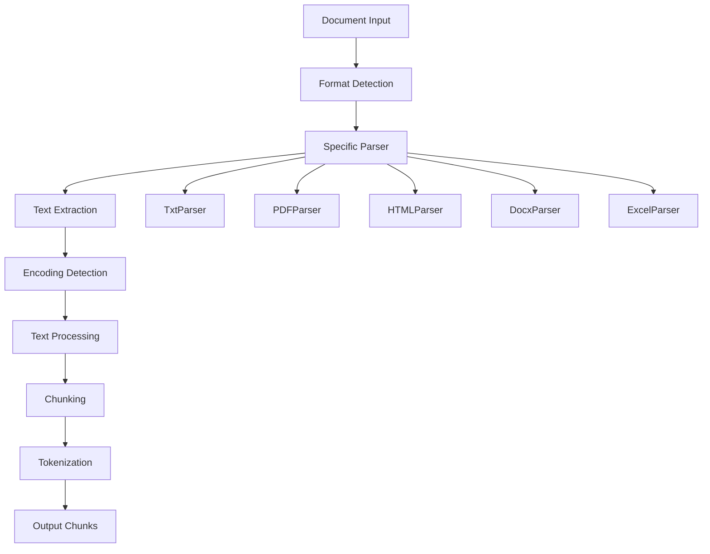
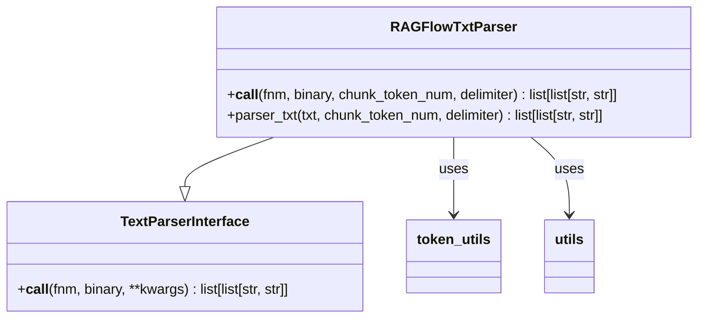
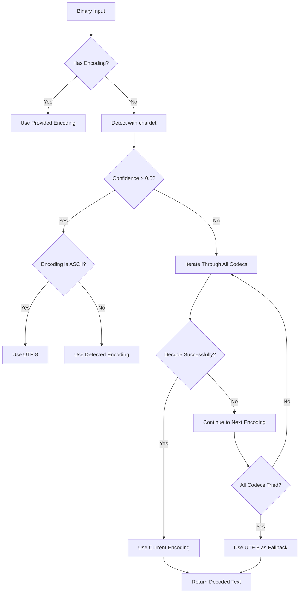
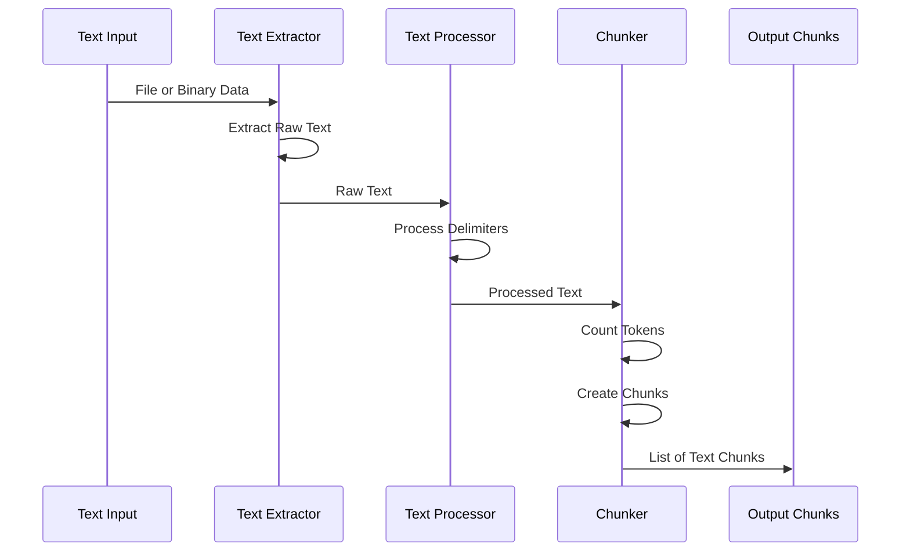
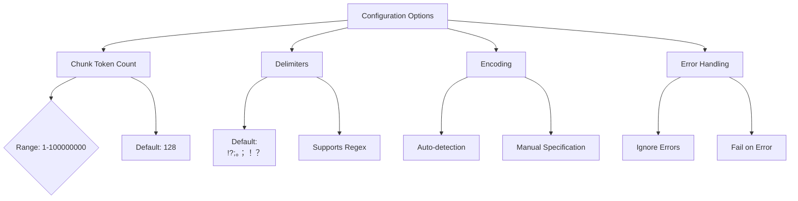
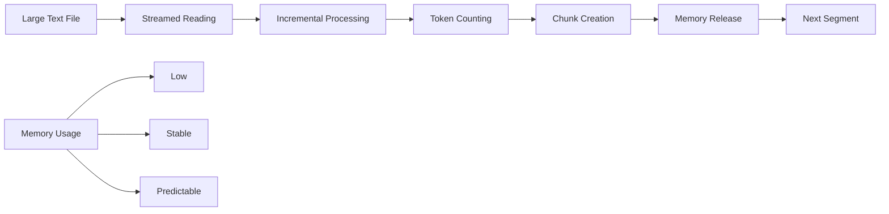
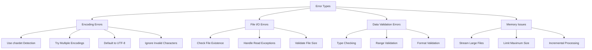

# Text Document Parsing

<cite>
**Referenced Files in This Document**   
- [txt_parser.py](file://deepdoc/parser/txt_parser.py)
- [utils.py](file://deepdoc/parser/utils.py)
- [__init__.py](file://rag/nlp/__init__.py)
- [token_utils.py](file://common/token_utils.py)
- [settings.py](file://rag/settings.py)
</cite>

## Table of Contents
1. [Introduction](#introduction)
2. [Text Parsing Architecture](#text-parsing-architecture)
3. [Core Text Parsing Components](#core-text-parsing-components)
4. [Encoding Detection and Handling](#encoding-detection-and-handling)
5. [Text Processing Pipeline](#text-processing-pipeline)
6. [Configuration Options](#configuration-options)
7. [Performance Considerations](#performance-considerations)
8. [Error Handling and Common Issues](#error-handling-and-common-issues)
9. [Conclusion](#conclusion)

## Introduction

RAGFlow's text document parsing capability provides a robust system for extracting and processing plain text content from various document formats. The parsing system is designed to handle different encodings, manage large text files, and preserve text integrity throughout the processing pipeline. This documentation explains the implementation details of the text parser, including how it handles special text formats, line endings, and character sets. The system is built to be accessible to beginners while providing sufficient technical depth for experienced developers.

**Section sources**
- [txt_parser.py](file://deepdoc/parser/txt_parser.py#L1-L65)
- [utils.py](file://deepdoc/parser/utils.py#L1-L33)

## Text Parsing Architecture

The text parsing architecture in RAGFlow is organized into a modular system that handles different document types through specialized parsers. The core architecture follows a consistent pattern across all document types, with specific implementations for text, PDF, HTML, and other formats. The system is designed to extract text content, process it according to configurable parameters, and prepare it for downstream processing in the RAG pipeline.

**Diagram sources **
- [txt_parser.py](file://deepdoc/parser/txt_parser.py#L23-L65)
- [__init__.py](file://deepdoc/parser/__init__.py#L17-L26)

## Core Text Parsing Components

The core text parsing components in RAGFlow are implemented in the `deepdoc.parser` module, with the `RAGFlowTxtParser` class serving as the primary text parser. This class handles the extraction and processing of plain text content from text files, with methods for parsing text according to configurable parameters.

The text parser follows a two-step process: first extracting the raw text content from the input file or binary data, and then processing this text into chunks according to the specified configuration. The parser uses token-based chunking to ensure that text segments are of appropriate size for downstream processing.

**Diagram sources **
- [txt_parser.py](file://deepdoc/parser/txt_parser.py#L23-L65)
- [token_utils.py](file://common/token_utils.py#L29-L35)

**Section sources**
- [txt_parser.py](file://deepdoc/parser/txt_parser.py#L23-L65)
- [token_utils.py](file://common/token_utils.py#L29-L35)

## Encoding Detection and Handling

RAGFlow implements a comprehensive encoding detection system to handle various text encodings in input documents. The system uses the `chardet` library to detect the encoding of binary input data, with a fallback mechanism that attempts to decode the data using a predefined list of common encodings.

The encoding detection process first uses `chardet` to analyze the first 1024 bytes of the input data. If the confidence level of the detected encoding is greater than 0.5, the system uses this encoding. For ASCII detection, the system defaults to UTF-8, as ASCII is a subset of UTF-8. If the initial detection fails or has low confidence, the system iterates through a comprehensive list of supported encodings, attempting to decode the data with each encoding until successful.

**Diagram sources **
- [__init__.py](file://rag/nlp/__init__.py#L54-L72)
- [utils.py](file://deepdoc/parser/utils.py#L20-L32)

**Section sources**
- [__init__.py](file://rag/nlp/__init__.py#L54-L72)
- [utils.py](file://deepdoc/parser/utils.py#L20-L32)

## Text Processing Pipeline

The text processing pipeline in RAGFlow follows a systematic approach to transform raw text input into processed chunks suitable for retrieval and generation tasks. The pipeline consists of several stages: text extraction, delimiter processing, chunking based on token count, and final formatting.

The pipeline begins with text extraction, where the system either reads text directly from a file or decodes binary data using the detected encoding. After extraction, the text is processed using configurable delimiters that define natural breaking points for chunking. The system supports both simple and complex delimiter patterns, including regular expressions and escaped characters.

The core of the processing pipeline is the token-based chunking mechanism, which ensures that each chunk contains approximately the specified number of tokens. The system uses the `tiktoken` library with the `cl100k_base` encoding to count tokens, providing consistency with popular language models. Chunks are created by accumulating text segments until the token count exceeds the threshold, at which point a new chunk is started.

**Diagram sources **
- [txt_parser.py](file://deepdoc/parser/txt_parser.py#L24-L65)
- [token_utils.py](file://common/token_utils.py#L29-L35)

**Section sources**
- [txt_parser.py](file://deepdoc/parser/txt_parser.py#L24-L65)
- [token_utils.py](file://common/token_utils.py#L29-L35)

## Configuration Options

RAGFlow provides several configuration options for text parsing, allowing users to customize the behavior according to their specific requirements. The primary configuration parameters include chunk token count, delimiters, and encoding settings.

The `chunk_token_num` parameter controls the target number of tokens per chunk, with a default value of 128. This parameter can be adjusted to create larger or smaller chunks depending on the use case and downstream processing requirements. The system validates this parameter to ensure it falls within an acceptable range.

The `delimiter` parameter defines the characters or patterns used to split text into natural segments before token-based chunking. The default delimiter pattern includes common sentence-ending characters in both English and Chinese: "\n!?;。；！？". Users can customize this pattern to match the specific characteristics of their text content.

**Diagram sources **
- [txt_parser.py](file://deepdoc/parser/txt_parser.py#L24-L26)
- [settings.py](file://rag/settings.py#L1-L16)

**Section sources**
- [txt_parser.py](file://deepdoc/parser/txt_parser.py#L24-L26)
- [settings.py](file://rag/settings.py#L1-L16)

## Performance Considerations

The text parsing system in RAGFlow is designed with performance in mind, particularly when handling large text files. The system implements several optimizations to ensure efficient processing while maintaining text integrity.

For large files, the system uses streaming text extraction rather than loading the entire file into memory at once. This approach minimizes memory usage and allows the system to process files larger than available RAM. The text is read line by line and accumulated incrementally, preventing memory overflow issues.

The token counting mechanism is optimized for performance by using the `tiktoken` library, which is implemented in Rust and provides fast tokenization. The system also caches the tokenizer instance to avoid the overhead of creating a new tokenizer for each parsing operation.

Memory usage is further optimized by processing text in chunks and releasing intermediate data as soon as it's no longer needed. The system uses generator patterns where appropriate to avoid creating large intermediate data structures.

**Diagram sources **
- [txt_parser.py](file://deepdoc/parser/txt_parser.py#L25-L26)
- [utils.py](file://deepdoc/parser/utils.py#L26-L31)

**Section sources**
- [txt_parser.py](file://deepdoc/parser/txt_parser.py#L25-L26)
- [utils.py](file://deepdoc/parser/utils.py#L26-L31)

## Error Handling and Common Issues

The text parsing system in RAGFlow includes comprehensive error handling to address common issues that may arise during text processing. The system is designed to be robust in the face of encoding problems, corrupted files, and other data quality issues.

For encoding problems, the system implements a multi-layered approach. First, it attempts to detect the encoding automatically using `chardet`. If this fails, it iterates through a comprehensive list of possible encodings. As a final fallback, it defaults to UTF-8, which can handle most text content. When decoding, the system uses the "ignore" error handler to skip invalid characters rather than failing completely.

For corrupted files or invalid input, the system includes type checking and validation at multiple points in the processing pipeline. The `parser_txt` method validates that its input is a string, raising a `TypeError` if this condition is not met. The system also handles file I/O exceptions gracefully, providing meaningful error messages to help diagnose issues.

Common issues such as extremely large files are addressed through configuration limits and streaming processing. The system can be configured to reject files above a certain size threshold, preventing performance degradation or memory exhaustion.

**Diagram sources **
- [__init__.py](file://rag/nlp/__init__.py#L54-L72)
- [txt_parser.py](file://deepdoc/parser/txt_parser.py#L30-L31)

**Section sources**
- [__init__.py](file://rag/nlp/__init__.py#L54-L72)
- [txt_parser.py](file://deepdoc/parser/txt_parser.py#L30-L31)

## Conclusion

RAGFlow's text document parsing capability provides a comprehensive and robust system for extracting and processing plain text content from various sources. The system is designed to handle different encodings, manage large text files, and preserve text integrity throughout the processing pipeline. With its modular architecture, configurable parameters, and comprehensive error handling, the text parser is suitable for a wide range of use cases, from simple text processing to complex document analysis workflows.

The implementation demonstrates careful attention to performance, memory usage, and reliability, making it well-suited for production environments. By providing both beginner-friendly defaults and advanced configuration options, RAGFlow strikes a balance between ease of use and technical flexibility, enabling users of all skill levels to effectively process text documents for retrieval-augmented generation tasks.