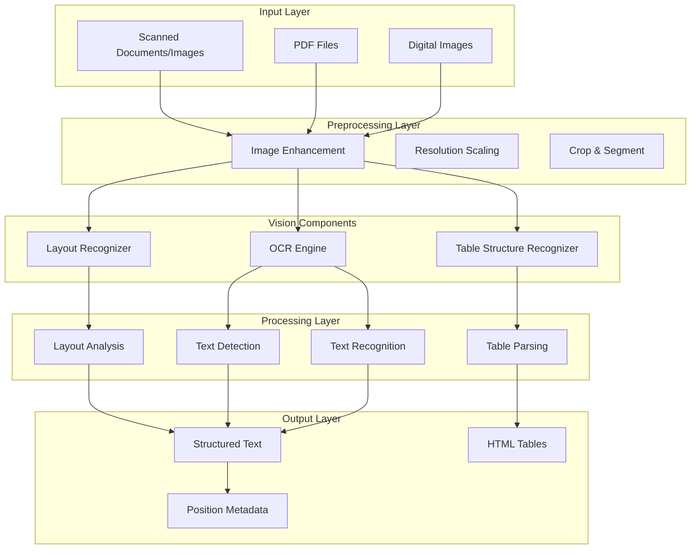
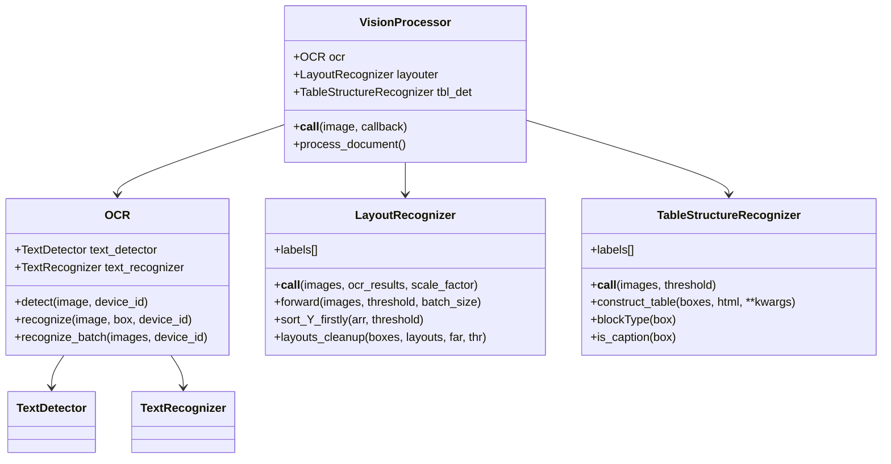
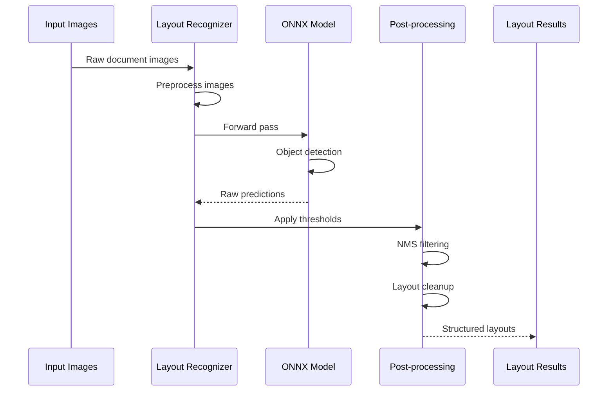
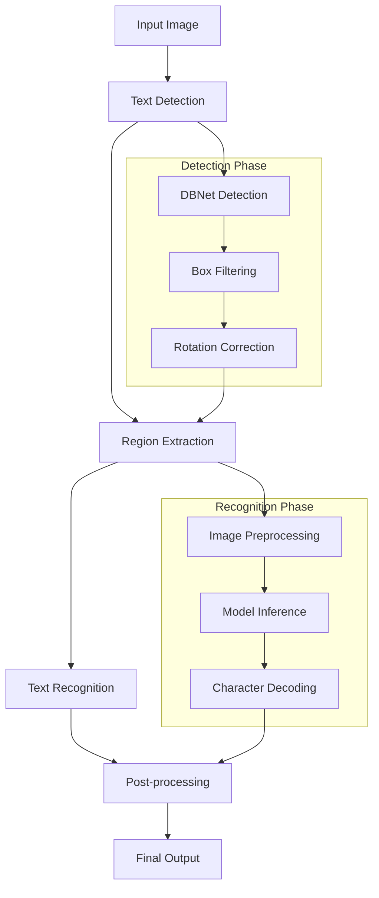
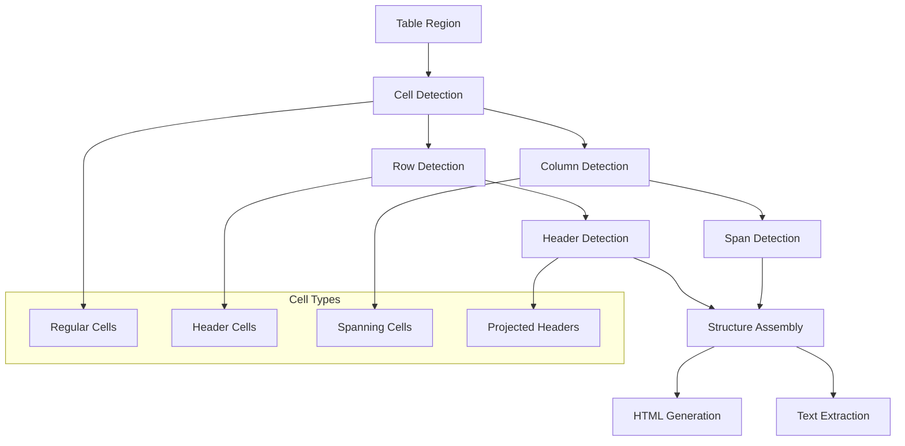
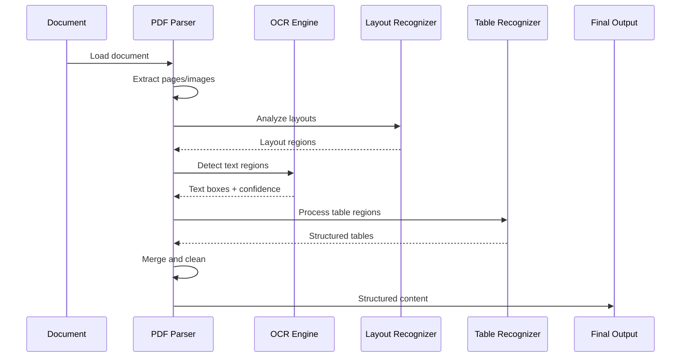
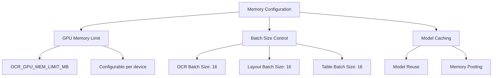

# Vision-Based Document Processing

<cite>
**Referenced Files in This Document**
- [deepdoc/vision/__init__.py](file://deepdoc/vision/__init__.py)
- [deepdoc/vision/layout_recognizer.py](file://deepdoc/vision/layout_recognizer.py)
- [deepdoc/vision/ocr.py](file://deepdoc/vision/ocr.py)
- [deepdoc/vision/table_structure_recognizer.py](file://deepdoc/vision/table_structure_recognizer.py)
- [deepdoc/vision/recognizer.py](file://deepdoc/vision/recognizer.py)
- [deepdoc/vision/operators.py](file://deepdoc/vision/operators.py)
- [deepdoc/vision/postprocess.py](file://deepdoc/vision/postprocess.py)
- [deepdoc/parser/pdf_parser.py](file://deepdoc/parser/pdf_parser.py)
- [common/settings.py](file://common/settings.py)
</cite>

## Table of Contents
1. [Introduction](#introduction)
2. [System Architecture](#system-architecture)
3. [Core Vision Components](#core-vision-components)
4. [Layout Recognition](#layout-recognition)
5. [OCR Engine](#ocr-engine)
6. [Table Structure Recognition](#table-structure-recognition)
7. [Integration Pipeline](#integration-pipeline)
8. [Configuration and Optimization](#configuration-and-optimization)
9. [Common Issues and Solutions](#common-issues-and-solutions)
10. [Performance Considerations](#performance-considerations)
11. [Advanced Features](#advanced-features)
12. [Conclusion](#conclusion)

## Introduction

RAGFlow's vision-based document processing system provides comprehensive capabilities for extracting and understanding information from scanned documents and images containing text. The system combines advanced computer vision techniques with machine learning models to accurately recognize layouts, extract text through OCR, and structure complex table data.

The vision processing pipeline handles various document types including PDFs, scanned images, and digital documents, transforming visual content into structured, searchable text that can be ingested by RAG systems. This capability is essential for processing real-world documents that aren't originally in digital text format.

## System Architecture

The vision processing system follows a modular architecture with specialized components working together to provide comprehensive document understanding:

**Diagram sources**
- [deepdoc/vision/__init__.py](file://deepdoc/vision/__init__.py#L20-L91)
- [deepdoc/parser/pdf_parser.py](file://deepdoc/parser/pdf_parser.py#L40-L105)

**Section sources**
- [deepdoc/vision/__init__.py](file://deepdoc/vision/__init__.py#L1-L91)
- [deepdoc/parser/pdf_parser.py](file://deepdoc/parser/pdf_parser.py#L40-L105)

## Core Vision Components

The vision processing system consists of three primary components that work together to provide comprehensive document understanding:

### Component Overview

**Diagram sources**
- [deepdoc/vision/ocr.py](file://deepdoc/vision/ocr.py#L536-L752)
- [deepdoc/vision/layout_recognizer.py](file://deepdoc/vision/layout_recognizer.py#L33-L458)
- [deepdoc/vision/table_structure_recognizer.py](file://deepdoc/vision/table_structure_recognizer.py#L30-L613)

**Section sources**
- [deepdoc/vision/__init__.py](file://deepdoc/vision/__init__.py#L22-L26)
- [deepdoc/vision/ocr.py](file://deepdoc/vision/ocr.py#L536-L752)
- [deepdoc/vision/layout_recognizer.py](file://deepdoc/vision/layout_recognizer.py#L33-L458)
- [deepdoc/vision/table_structure_recognizer.py](file://deepdoc/vision/table_structure_recognizer.py#L30-L613)

## Layout Recognition

Layout recognition is the foundation of document understanding, identifying different regions and their semantic meanings within a document page.

### Supported Layout Types

The layout recognizer identifies ten distinct document regions:

| Layout Type | Description | Use Case |
|-------------|-------------|----------|
| `_background_` | Page background | General page context |
| `Text` | Regular paragraph text | Main content extraction |
| `Title` | Document titles and headings | Content hierarchy |
| `Figure` | Images, charts, diagrams | Visual content processing |
| `Figure caption` | Figure descriptions | Caption association |
| `Table` | Tabular data regions | Table structure recognition |
| `Table caption` | Table descriptions | Table context |
| `Header` | Page headers | Navigation and structure |
| `Footer` | Page footers | Metadata and navigation |
| `Reference` | Citations and references | Bibliography processing |
| `Equation` | Mathematical formulas | Scientific content |

### Layout Recognition Process

**Diagram sources**
- [deepdoc/vision/layout_recognizer.py](file://deepdoc/vision/layout_recognizer.py#L63-L158)
- [deepdoc/vision/recognizer.py](file://deepdoc/vision/recognizer.py#L415-L437)

### Advanced Layout Features

The layout recognizer includes sophisticated features for handling complex documents:

- **Garbage Layout Filtering**: Automatically removes headers, footers, and reference sections based on content patterns
- **Overlap Detection**: Uses spatial overlap calculations to associate text with appropriate layout regions
- **Multi-scale Processing**: Handles documents with varying text sizes and layouts
- **YOLOv10 Integration**: Alternative layout recognition using YOLOv10 architecture for improved accuracy

**Section sources**
- [deepdoc/vision/layout_recognizer.py](file://deepdoc/vision/layout_recognizer.py#L33-L458)
- [deepdoc/vision/recognizer.py](file://deepdoc/vision/recognizer.py#L31-L443)

## OCR Engine

The OCR (Optical Character Recognition) engine provides robust text extraction capabilities with support for multiple languages and text formats.

### OCR Architecture

**Diagram sources**
- [deepdoc/vision/ocr.py](file://deepdoc/vision/ocr.py#L414-L535)
- [deepdoc/vision/ocr.py](file://deepdoc/vision/ocr.py#L363-L408)

### Text Detection Capabilities

The text detection system uses DBNet (Differentiable Binarization Network) for accurate text region localization:

- **Adaptive Thresholding**: Dynamic threshold adjustment based on image characteristics
- **Multi-scale Detection**: Handles text of varying sizes and orientations
- **Box Quality Filtering**: Removes small, low-confidence detections
- **Rotation Compensation**: Corrects for skewed text regions

### Text Recognition Features

The text recognition system supports multiple recognition models:

| Model Type | Strengths | Use Cases |
|------------|-----------|-----------|
| CTC (Connectionist Temporal Classification) | Robust to noise, fast inference | General text recognition |
| SAR (Show, Attend and Read) | Handles complex layouts | Mixed text and graphics |
| SVTR (Scene Text Recognition Transformer) | Transformer-based accuracy | High-quality text |
| ABINet | Attention-based accuracy | Handwritten and degraded text |

### Advanced OCR Features

- **Parallel Processing**: Multi-GPU support for batch processing
- **Memory Optimization**: Configurable GPU memory limits
- **Language Support**: Extensive character set coverage
- **Quality Control**: Confidence scoring and filtering

**Section sources**
- [deepdoc/vision/ocr.py](file://deepdoc/vision/ocr.py#L1-L752)
- [deepdoc/vision/postprocess.py](file://deepdoc/vision/postprocess.py#L41-L371)

## Table Structure Recognition

Table structure recognition transforms tabular content into structured data, enabling precise data extraction from complex tables.

### Table Structure Analysis

**Diagram sources**
- [deepdoc/vision/table_structure_recognizer.py](file://deepdoc/vision/table_structure_recognizer.py#L113-L274)

### Table Structure Types

The table recognizer identifies five primary cell types:

| Cell Type | Description | Recognition Method |
|-----------|-------------|-------------------|
| `table` | Regular data cells | Spatial clustering |
| `table column` | Column boundaries | Horizontal alignment |
| `table row` | Row boundaries | Vertical alignment |
| `table column header` | Column titles | Semantic analysis |
| `table projected row header` | Row identifiers | Cross-reference detection |
| `table spanning cell` | Multi-cell regions | Overlap calculation |

### Table Construction Process

The table construction algorithm follows these steps:

1. **Caption Detection**: Identifies table captions and descriptions
2. **Boundary Detection**: Locates row and column boundaries
3. **Cell Association**: Links text to appropriate table cells
4. **Span Calculation**: Handles merged and spanning cells
5. **Structure Assembly**: Builds hierarchical table structure
6. **Output Generation**: Creates HTML or text representation

**Section sources**
- [deepdoc/vision/table_structure_recognizer.py](file://deepdoc/vision/table_structure_recognizer.py#L30-L613)

## Integration Pipeline

The vision components integrate seamlessly within RAGFlow's document processing pipeline, providing coordinated processing of visual content.

### Processing Workflow

**Diagram sources**
- [deepdoc/parser/pdf_parser.py](file://deepdoc/parser/pdf_parser.py#L282-L442)

### Coordinate Systems and Positioning

The system maintains consistent coordinate systems across all vision components:

- **Pixel Coordinates**: Original image pixel positions
- **Normalized Coordinates**: Range [0,1] for model input
- **Page Coordinates**: Page-relative positioning
- **Absolute Coordinates**: Document-wide positioning

### Data Flow Integration

The vision processing integrates with RAGFlow's text parsing pipeline:

1. **Initial Processing**: Vision components extract visual content
2. **Coordinate Mapping**: Transform coordinates between components
3. **Content Merging**: Combine visual and textual information
4. **Quality Validation**: Ensure content accuracy and completeness
5. **Final Structuring**: Produce unified document representation

**Section sources**
- [deepdoc/parser/pdf_parser.py](file://deepdoc/parser/pdf_parser.py#L282-L442)
- [deepdoc/vision/recognizer.py](file://deepdoc/vision/recognizer.py#L113-L281)

## Configuration and Optimization

RAGFlow provides extensive configuration options for optimizing vision processing performance and accuracy.

### Environment Variables

Key configuration parameters for vision processing:

| Variable | Default | Description | Impact |
|----------|---------|-------------|---------|
| `LAYOUT_RECOGNIZER_TYPE` | `onnx` | Layout recognition backend | Accuracy vs. speed |
| `TABLE_STRUCTURE_RECOGNIZER_TYPE` | `onnx` | Table recognition backend | Processing time |
| `OCR_GPU_MEM_LIMIT_MB` | `2048` | GPU memory allocation | Memory usage |
| `OCR_ARENA_EXTEND_STRATEGY` | `kNextPowerOfTwo` | Memory allocation strategy | Performance |
| `PARALLEL_DEVICES` | `0` | Number of GPUs for parallel processing | Throughput |

### Performance Tuning Options

#### Accuracy vs. Speed Trade-offs

**High Accuracy Settings:**
- Lower confidence thresholds (`thr=0.2`)
- Slower but more thorough post-processing
- Extended NMS filtering
- Multi-pass refinement

**High Speed Settings:**
- Higher confidence thresholds (`thr=0.5`)
- Reduced batch sizes
- Simplified post-processing
- Single-pass processing

#### Memory Optimization

**Diagram sources**
- [deepdoc/vision/ocr.py](file://deepdoc/vision/ocr.py#L96-L128)
- [deepdoc/vision/recognizer.py](file://deepdoc/vision/recognizer.py#L415-L437)

### Hardware Acceleration

The system supports multiple hardware acceleration options:

- **CUDA Execution**: GPU acceleration for ONNX models
- **Ascend NPU**: Huawei Ascend processor support
- **CPU Fallback**: Automatic fallback when GPU unavailable
- **Multi-GPU Processing**: Parallel processing across multiple GPUs

**Section sources**
- [deepdoc/vision/ocr.py](file://deepdoc/vision/ocr.py#L96-L128)
- [deepdoc/vision/layout_recognizer.py](file://deepdoc/vision/layout_recognizer.py#L58-L62)
- [common/settings.py](file://common/settings.py#L296-L305)

## Common Issues and Solutions

### Low-Quality Scan Issues

**Problem**: Poor image quality affects recognition accuracy
**Solutions**:
- Enable automatic image enhancement
- Adjust detection thresholds for noisy images
- Use multi-stage processing for degraded content
- Implement quality scoring and filtering

### Complex Layout Challenges

**Problem**: Documents with mixed layouts confuse the system
**Solutions**:
- Fine-tune layout recognition thresholds
- Implement layout-specific processing pipelines
- Use contextual analysis for ambiguous regions
- Add manual review capabilities for complex cases

### Handwriting Recognition

**Problem**: Handwritten text recognition accuracy
**Solutions**:
- Use specialized handwriting recognition models
- Implement confidence-based filtering
- Provide manual correction interfaces
- Train custom models for specific handwriting styles

### Multi-Language Support

**Problem**: Mixed language content in documents
**Solutions**:
- Implement language detection and routing
- Use multilingual OCR models
- Configure language-specific processing parameters
- Provide fallback mechanisms for unknown languages

### Performance Bottlenecks

**Problem**: Slow processing on large documents
**Solutions**:
- Optimize batch sizes and memory allocation
- Implement progressive processing stages
- Use caching for repeated operations
- Distribute processing across multiple workers

**Section sources**
- [deepdoc/vision/ocr.py](file://deepdoc/vision/ocr.py#L105-L128)
- [deepdoc/vision/layout_recognizer.py](file://deepdoc/vision/layout_recognizer.py#L340-L457)

## Performance Considerations

### Processing Speed Optimization

The vision processing system implements several optimization strategies:

#### Batch Processing
- **Dynamic Batching**: Adjust batch sizes based on available memory
- **Priority Queuing**: Process high-priority documents first
- **Resource Pooling**: Share computational resources efficiently

#### Memory Management
- **Model Caching**: Reuse loaded models across requests
- **Memory Pooling**: Pre-allocate memory buffers
- **Garbage Collection**: Proactive cleanup of temporary objects

#### Parallel Processing
- **Multi-GPU Support**: Distribute processing across available GPUs
- **Pipeline Parallelism**: Overlap preprocessing and inference
- **Async Processing**: Non-blocking operation execution

### Accuracy Enhancement

#### Model Selection
- **Quality Models**: Use higher-quality models for critical documents
- **Speed Models**: Faster models for routine processing
- **Hybrid Approaches**: Combine multiple models for optimal results

#### Post-Processing
- **Confidence Scoring**: Filter low-confidence detections
- **Contextual Validation**: Use document context for corrections
- **Iterative Refinement**: Multiple passes for complex content

### Scalability Features

The system scales effectively with increasing document volumes:

- **Horizontal Scaling**: Add more processing nodes
- **Vertical Scaling**: Utilize more powerful hardware
- **Load Balancing**: Distribute work evenly across resources
- **Queue Management**: Handle peak processing loads gracefully

**Section sources**
- [deepdoc/vision/ocr.py](file://deepdoc/vision/ocr.py#L363-L408)
- [deepdoc/vision/recognizer.py](file://deepdoc/vision/recognizer.py#L415-L437)

## Advanced Features

### Custom Model Integration

RAGFlow supports custom vision models through standardized interfaces:

- **Model Format Support**: ONNX, TensorFlow, PyTorch
- **Custom Operators**: Extend processing pipeline capabilities
- **Plugin Architecture**: Modular component development
- **Version Management**: Track model versions and performance

### Quality Assurance

The system includes built-in quality assurance mechanisms:

- **Confidence Scoring**: Automatic quality assessment
- **Validation Rules**: Content validation and verification
- **Error Reporting**: Comprehensive error tracking and reporting
- **Performance Monitoring**: Real-time performance metrics

### Extensible Architecture

The vision processing architecture supports extensions:

- **Custom Preprocessing**: Add domain-specific image processing
- **Alternative Models**: Swap out components with compatible alternatives
- **Integration Hooks**: Add custom processing at any pipeline stage
- **Output Formats**: Support multiple output formats and structures

**Section sources**
- [deepdoc/vision/recognizer.py](file://deepdoc/vision/recognizer.py#L31-L443)
- [deepdoc/vision/operators.py](file://deepdoc/vision/operators.py#L1-L726)

## Conclusion

RAGFlow's vision-based document processing system provides a comprehensive solution for extracting and understanding information from visual documents. The modular architecture combines advanced computer vision techniques with machine learning models to deliver accurate, scalable document processing capabilities.

Key strengths of the system include:

- **Comprehensive Coverage**: Handles diverse document types and layouts
- **High Accuracy**: State-of-the-art recognition models and post-processing
- **Scalable Performance**: Optimized for both single documents and large-scale processing
- **Flexible Configuration**: Extensive customization options for different use cases
- **Robust Error Handling**: Graceful degradation and recovery from processing issues

The system's integration with RAGFlow's broader document processing pipeline ensures seamless conversion of visual content into structured, searchable text suitable for AI-powered applications. Whether processing simple text documents or complex multi-page reports with tables and images, the vision processing system provides reliable, high-quality results.

Future enhancements will continue to improve accuracy, expand language support, and optimize performance for emerging document formats and use cases.