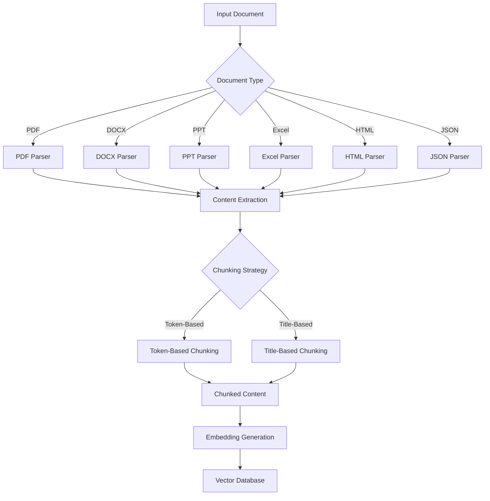
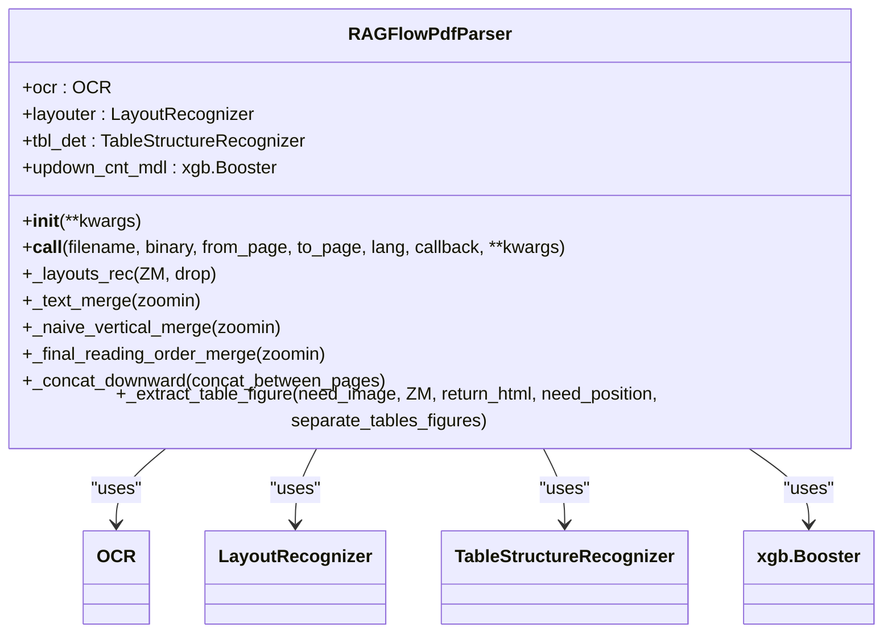

# Document Processing

<cite>
**Referenced Files in This Document**   
- [laws.py](file://rag/app/laws.py)
- [presentation.py](file://rag/app/presentation.py)
- [one.py](file://rag/app/one.py)
- [qa.py](file://rag/app/qa.py)
- [pdf_parser.py](file://deepdoc/parser/pdf_parser.py)
- [docx_parser.py](file://deepdoc/parser/docx_parser.py)
- [excel_parser.py](file://deepdoc/parser/excel_parser.py)
- [html_parser.py](file://deepdoc/parser/html_parser.py)
- [json_parser.py](file://deepdoc/parser/json_parser.py)
- [splitter.py](file://rag/flow/splitter/splitter.py)
- [tokenizer.py](file://rag/flow/tokenizer/tokenizer.py)
- [parser.py](file://rag/flow/parser/parser.py)
- [title_chunker.json](file://agent/templates/title_chunker.json)
- [toc_from_text_system.md](file://rag/prompts/toc_from_text_system.md)
</cite>

## Table of Contents
1. [Introduction](#introduction)
2. [Document Processing Architecture](#document-processing-architecture)
3. [Specialized Parsers for Various Formats](#specialized-parsers-for-various-formats)
4. [Template-Based Intelligent Chunking Strategies](#template-based-intelligent-chunking-strategies)
5. [Automated RAG Workflow Orchestration](#automated-rag-workflow-orchestration)
6. [Configuration Options and Parameters](#configuration-options-and-parameters)
7. [Common Issues and Solutions](#common-issues-and-solutions)
8. [Conclusion](#conclusion)

## Introduction

RAGFlow provides comprehensive document processing capabilities with deep understanding of various file formats. The system supports heterogeneous data sources including PDF, DOCX, PPT, Excel, HTML, and JSON files, enabling automated RAG workflow orchestration. This document details the implementation of specialized parsers, intelligent chunking strategies, and configuration options that make RAGFlow a powerful solution for document processing in retrieval-augmented generation systems.

The document processing feature is designed to be accessible to beginners while providing sufficient technical depth for experienced developers. It covers the entire pipeline from document ingestion to chunking and indexing, with concrete examples from the actual codebase showing how documents are processed through the system.

## Document Processing Architecture

RAGFlow's document processing architecture follows a modular pipeline approach that handles various document formats through specialized parsers and intelligent chunking strategies. The system is designed to extract meaningful content from diverse file types while preserving structural information and context.



**Diagram sources**
- [laws.py](file://rag/app/laws.py#L144-L183)
- [presentation.py](file://rag/app/presentation.py#L174-L248)
- [one.py](file://rag/app/one.py#L134-L166)
- [qa.py](file://rag/app/qa.py#L451-L471)

**Section sources**
- [laws.py](file://rag/app/laws.py#L144-L183)
- [presentation.py](file://rag/app/presentation.py#L174-L248)

## Specialized Parsers for Various Formats

RAGFlow implements specialized parsers for different document formats, each optimized to extract content while preserving the document's structure and semantics. The parsing system is designed to handle both text-based and structured documents, with specific strategies for each format.

### PDF Parser

The PDF parser uses advanced layout recognition techniques to extract content from PDF documents. It employs a combination of OCR (Optical Character Recognition) and layout analysis to accurately identify text blocks, tables, and figures. The parser supports multiple layout recognition methods, including DeepDOC and Plain Text approaches.



**Diagram sources**
- [pdf_parser.py](file://deepdoc/parser/pdf_parser.py#L52-L800)

**Section sources**
- [pdf_parser.py](file://deepdoc/parser/pdf_parser.py#L52-L800)

### DOCX Parser

The DOCX parser extracts content from Word documents while preserving paragraph structure and formatting. It handles both text content and tables, with specialized logic for table content extraction and formatting.

```python
class RAGFlowDocxParser:
    def __extract_table_content(self, tb):
        # Extract content from table
        df = []
        for row in tb.rows:
            df.append([c.text for c in row.cells])
        return self.__compose_table_content(pd.DataFrame(df))
    
    def __compose_table_content(self, df):
        # Compose table content with appropriate formatting
        # ...
        pass
    
    def __call__(self, fnm, from_page=0, to_page=100000000):
        # Parse DOCX file and return sections and tables
        # ...
        pass
```

**Section sources**
- [docx_parser.py](file://deepdoc/parser/docx_parser.py#L25-L140)

### Excel Parser

The Excel parser handles spreadsheet files (XLS, XLSX, CSV) with support for multiple output formats including HTML, Markdown, and JSON. It can convert tables to HTML format for better preservation of structure.

```python
class RAGFlowExcelParser:
    def html(self, fnm, chunk_rows=256):
        # Convert Excel to HTML format
        # ...
        pass
    
    def markdown(self, fnm):
        # Convert Excel to Markdown format
        # ...
        pass
    
    def __call__(self, fnm):
        # Parse Excel file and return structured content
        # ...
        pass
```

**Section sources**
- [excel_parser.py](file://deepdoc/parser/excel_parser.py#L28-L224)

### HTML Parser

The HTML parser extracts content from web pages and HTML documents, preserving the document structure while removing irrelevant elements like scripts and styles. It uses BeautifulSoup for HTML parsing and implements intelligent chunking based on document structure.

```python
class RAGFlowHtmlParser:
    def __call__(self, fnm, binary=None, chunk_token_num=512):
        # Parse HTML file and return sections
        # ...
        pass
    
    @classmethod
    def parser_txt(cls, txt, chunk_token_num):
        # Parse HTML text and return sections
        # ...
        pass
    
    @classmethod
    def read_text_recursively(cls, element, parser_result, chunk_token_num=512, parent_name=None, block_id=None):
        # Recursively read text from HTML elements
        # ...
        pass
```

**Section sources**
- [html_parser.py](file://deepdoc/parser/html_parser.py#L39-L214)

### JSON Parser

The JSON parser handles JSON and JSONL files, implementing intelligent splitting of large JSON objects into manageable chunks. It preserves the hierarchical structure of JSON data while ensuring chunks are of appropriate size.

```python
class RAGFlowJsonParser:
    def __init__(self, max_chunk_size: int = 2000, min_chunk_size: int | None = None):
        self.max_chunk_size = max_chunk_size * 2
        self.min_chunk_size = min_chunk_size if min_chunk_size is not None else max(max_chunk_size - 200, 50)
    
    def __call__(self, binary):
        # Parse JSON file and return sections
        # ...
        pass
    
    def _json_split(self, data, current_path: list[str] | None, chunks: list[dict] | None) -> list[dict]:
        # Split JSON into chunks while preserving structure
        # ...
        pass
```

**Section sources**
- [json_parser.py](file://deepdoc/parser/json_parser.py#L27-L180)

## Template-Based Intelligent Chunking Strategies

RAGFlow implements template-based intelligent chunking strategies that adapt to the document's structure and content. The system supports both token-based and title-based segmentation, allowing for flexible document processing based on the specific requirements.

### Token-Based Chunking

Token-based chunking divides documents into chunks of a specified token size, with options for overlapping between chunks to preserve context. This approach is suitable for documents without clear structural divisions.

```python
class SplitterParam(ProcessParamBase):
    def __init__(self):
        super().__init__()
        self.chunk_token_size = 512
        self.delimiters = ["\n"]
        self.overlapped_percent = 0
        self.children_delimiters = []
```

The splitter component uses these parameters to divide content into chunks:

```python
class Splitter(ProcessBase):
    async def _invoke(self, **kwargs):
        # ...
        cks = naive_merge(
            payload,
            self._param.chunk_token_size,
            deli,
            self._param.overlapped_percent,
        )
        # ...
```

**Section sources**
- [splitter.py](file://rag/flow/splitter/splitter.py#L29-L152)

### Title-Based Chunking

Title-based chunking uses the document's hierarchical structure to create meaningful chunks based on headings and sections. This approach preserves the document's logical organization and is ideal for documents with clear section divisions.

The title chunker template defines hierarchical levels using regular expressions to identify headings:

```json
{
    "hierarchy": 3,
    "levels": [
        ["^#[^#]"],
        ["^##[^#]"],
        ["^###[^#]"],
        ["^####[^#]"]
    ]
}
```

This configuration identifies headings at different levels (H1, H2, H3, H4) and creates chunks accordingly. The system can extract table of contents information from documents:

```markdown
You are a robust Table-of-Contents (TOC) extractor.

GOAL
Given a dictionary of chunks {"<chunk_ID>": chunk_text}, extract TOC-like headings and return a strict JSON array of objects:
[
  {"title": "", "chunk_id": ""},
  ...
]
```

**Section sources**
- [title_chunker.json](file://agent/templates/title_chunker.json#L105-L118)
- [toc_from_text_system.md](file://rag/prompts/toc_from_text_system.md#L1-L109)

## Automated RAG Workflow Orchestration

RAGFlow provides automated orchestration of the RAG workflow through configurable pipelines that connect parsing, chunking, and indexing components. The system uses a canvas-based approach to define document processing workflows.

### Ingestion Pipeline Components

The ingestion pipeline consists of several components that work together to process documents:

1. **File Component**: Handles input document ingestion
2. **Parser Component**: Processes documents based on type and configuration
3. **Splitter Component**: Divides content into chunks using specified strategy
4. **Tokenizer Component**: Generates embeddings and indexes chunks

```json
{
    "components": {
        "File": {
            "obj": {
                "component_name": "File",
                "params": {}
            },
            "downstream": ["Parser:HipSignsRhyme"]
        },
        "Parser:HipSignsRhyme": {
            "obj": {
                "component_name": "Parser",
                "params": {
                    "setups": {
                        "pdf": {
                            "output_format": "json",
                            "suffix": ["pdf"],
                            "parse_method": "DeepDOC"
                        },
                        "text&markdown": {
                            "output_format": "text",
                            "suffix": ["md", "markdown", "mdx", "txt"]
                        },
                        "word": {
                            "output_format": "json",
                            "suffix": ["doc", "docx"]
                        }
                    }
                }
            },
            "downstream": ["HierarchicalMerger:BusyPoetsSearch"]
        },
        "HierarchicalMerger:BusyPoetsSearch": {
            "obj": {
                "component_name": "HierarchicalMerger",
                "params": {
                    "hierarchy": 3,
                    "levels": [
                        ["^#[^#]"],
                        ["^##[^#]"],
                        ["^###[^#]"],
                        ["^####[^#]"]
                    ]
                }
            },
            "downstream": ["Tokenizer:NeatRadiosEnd"]
        }
    }
}
```

**Section sources**
- [title_chunker.json](file://agent/templates/title_chunker.json#L16-L294)

### Parser Configuration

The parser component supports configuration for different document types, allowing customization of parsing behavior:

```python
def _pdf(self, name, blob, from_page=0, to_page=100000000, **kwargs):
    conf = self._param.setups["pdf"]
    parser_config = kwargs.get("parser_config", {})
    layout_recognizer = parser_config.get("layout_recognize", "DeepDOC")
    
    if re.search(r"\.pdf$", name, re.IGNORECASE):
        name = layout_recognizer.strip().lower()
        parser = PARSERS.get(name, by_plaintext)
        raw_sections, tables, pdf_parser = parser(
            filename=name,
            binary=blob,
            from_page=from_page,
            to_page=to_page,
            lang=lang,
            callback=callback,
            pdf_cls=Pdf,
            layout_recognizer=layout_recognizer,
            **kwargs
        )
```

**Section sources**
- [laws.py](file://rag/app/laws.py#L144-L183)
- [presentation.py](file://rag/app/presentation.py#L195-L239)

## Configuration Options and Parameters

RAGFlow provides extensive configuration options for document processing, allowing fine-tuning of parsing and chunking behavior for different document types and use cases.

### Parsing Configuration

The parsing configuration includes options for different document types:

| Parameter | Description | Default Value | Document Types |
|---------|-----------|-------------|--------------|
| parse_method | Method for parsing documents | DeepDOC | PDF, PowerPoint |
| output_format | Output format for parsed content | json | All |
| lang | Language of the document | Chinese | PDF, Image |
| table_result_type | Format for table results | 1 | TCADP Parser |
| markdown_image_response_type | Image handling in Markdown | 1 | TCADP Parser |
| html4excel | Convert Excel to HTML | false | Spreadsheet |

**Section sources**
- [title_chunker.json](file://agent/templates/title_chunker.json#L50-L56)
- [web/src/components/excel-to-html-form-field.tsx](file://web/src/components/excel-to-html-form-field.tsx#L1-L53)

### Chunking Configuration

The chunking configuration allows customization of how documents are divided into chunks:

| Parameter | Description | Default Value |
|---------|-----------|-------------|
| chunk_token_size | Size of chunks in tokens | 512 |
| delimiters | Delimiters for chunking | ["\n"] |
| overlapped_percent | Percentage of overlap between chunks | 0 |
| children_delimiters | Delimiters for hierarchical chunking | [] |
| hierarchy | Number of hierarchical levels | 3 |

```python
class SplitterParam(ProcessParamBase):
    def __init__(self):
        super().__init__()
        self.chunk_token_size = 512
        self.delimiters = ["\n"]
        self.overlapped_percent = 0
        self.children_delimiters = []
```

**Section sources**
- [splitter.py](file://rag/flow/splitter/splitter.py#L29-L41)

### Tokenization Configuration

The tokenization configuration controls how chunks are processed for indexing:

| Parameter | Description | Default Value |
|---------|-----------|-------------|
| search_method | Methods for searching | ["full_text", "embedding"] |
| filename_embd_weight | Weight for filename in embedding | 0.1 |
| fields | Fields to include in indexing | ["text"] |

```python
class TokenizerParam(ProcessParamBase):
    def __init__(self):
        super().__init__()
        self.search_method = ["full_text", "embedding"]
        self.filename_embd_weight = 0.1
        self.fields = ["text"]
```

**Section sources**
- [tokenizer.py](file://rag/flow/tokenizer/tokenizer.py#L35-L48)

## Common Issues and Solutions

### Parsing Errors

Common parsing errors and their solutions:

1. **PDF Parsing Issues**
   - Issue: Text extraction fails for scanned PDFs
   - Solution: Enable OCR in parser configuration
   - Configuration: Set `layout_recognize` to "DeepDOC" for scanned documents

2. **Table Extraction Problems**
   - Issue: Tables are not properly extracted or formatted
   - Solution: Use appropriate table parsing method
   - Configuration: For complex tables, use TCADP parser with appropriate `table_result_type`

3. **Encoding Issues**
   - Issue: Special characters or non-ASCII text appears corrupted
   - Solution: Ensure proper encoding detection
   - Implementation: The system automatically detects encoding using `find_codec` function

4. **Large Document Processing**
   - Issue: Memory errors when processing large documents
   - Solution: Process documents in chunks or pages
   - Configuration: Use `from_page` and `to_page` parameters to process specific page ranges

### Chunking Issues

Common chunking issues and their solutions:

1. **Inappropriate Chunk Size**
   - Issue: Chunks are too large or too small
   - Solution: Adjust `chunk_token_size` parameter
   - Recommendation: 512-1024 tokens for optimal performance

2. **Context Loss at Boundaries**
   - Issue: Important context is split between chunks
   - Solution: Increase `overlapped_percent` parameter
   - Recommendation: 10-20% overlap for better context preservation

3. **Hierarchical Structure Loss**
   - Issue: Section hierarchy is not preserved in chunks
   - Solution: Use title-based chunking with appropriate regex patterns
   - Configuration: Define hierarchical levels in `levels` parameter

### Performance Optimization

1. **Parallel Processing**
   - Enable parallel processing for faster document processing
   - Configuration: Set `PARALLEL_DEVICES` in settings

2. **Batch Processing**
   - Process multiple documents in batches
   - Implementation: Use `EMBEDDING_BATCH_SIZE` parameter to control batch size

3. **Caching**
   - Enable caching for frequently accessed documents
   - Implementation: The system automatically caches parsed content

## Conclusion

RAGFlow's document processing feature provides a comprehensive solution for handling diverse document formats in retrieval-augmented generation systems. The architecture combines specialized parsers for different file types with intelligent chunking strategies that preserve document structure and context.

Key features include:
- Support for multiple document formats (PDF, DOCX, PPT, Excel, HTML, JSON)
- Advanced parsing techniques with layout recognition and OCR
- Flexible chunking strategies (token-based and title-based)
- Configurable workflows through template-based pipelines
- Comprehensive configuration options for fine-tuning processing behavior

The system is designed to be both accessible to beginners and powerful enough for experienced developers, with clear configuration options and extensible architecture. By following the best practices outlined in this document, users can effectively leverage RAGFlow's document processing capabilities to build robust RAG applications.