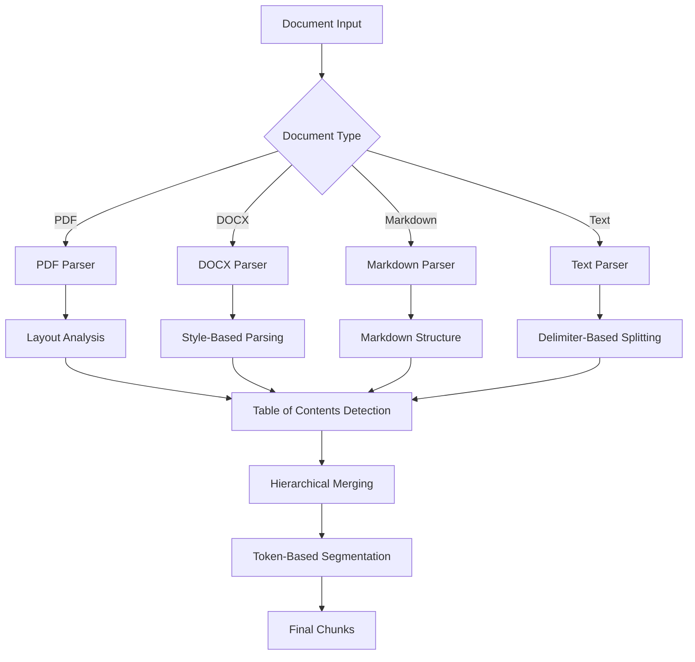
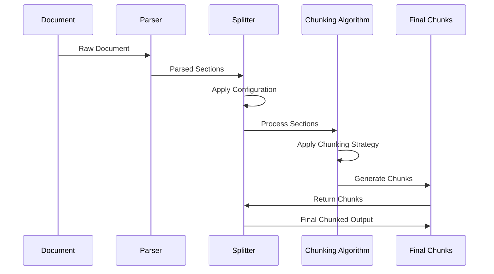
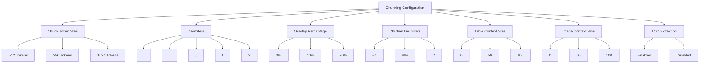
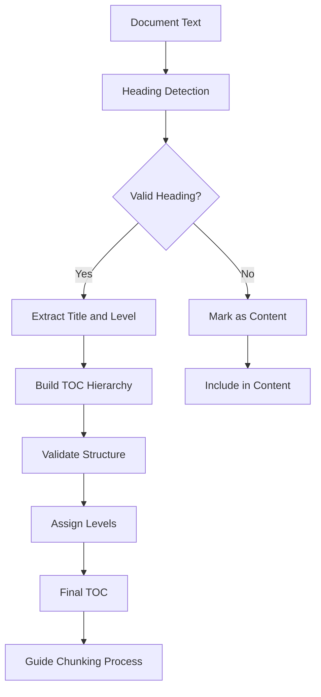
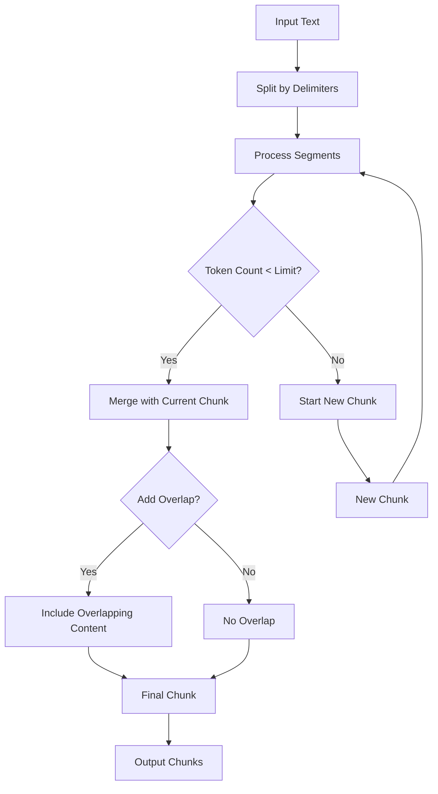
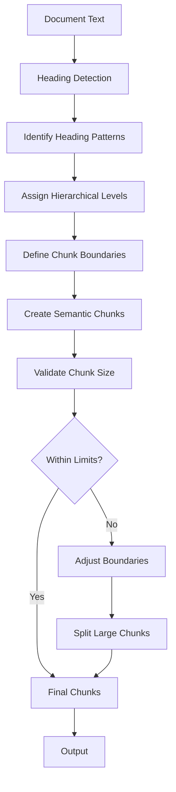
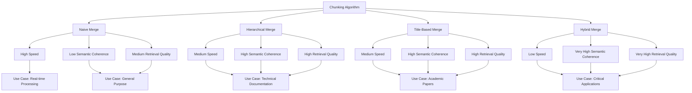
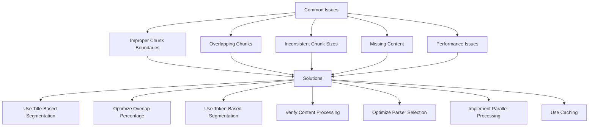

# Template-Based Chunking

<cite>
**Referenced Files in This Document**   
- [splitter.py](file://rag/flow/splitter/splitter.py)
- [schema.py](file://rag/flow/splitter/schema.py)
- [naive.py](file://rag/app/naive.py)
- [book.py](file://rag/app/book.py)
- [laws.py](file://rag/app/laws.py)
- [paper.py](file://rag/app/paper.py)
- [rag_tokenizer.py](file://rag/nlp/rag_tokenizer.py)
- [chunk_app.py](file://api/apps/chunk_app.py)
- [chunk.py](file://sdk/python/ragflow_sdk/modules/chunk.py)
- [toc_extraction.md](file://rag/prompts/toc_extraction.md)
- [toc_from_text_system.md](file://rag/prompts/toc_from_text_system.md)
- [assign_toc_levels.md](file://rag/prompts/assign_toc_levels.md)
- [chunk-method-dialog/index.tsx](file://web/src/components/chunk-method-dialog/index.tsx)
- [chunk-method-modal/index.tsx](file://web/src/components/chunk-method-modal/index.tsx)
</cite>

## Table of Contents
1. [Introduction](#introduction)
2. [Core Chunking Strategies](#core-chunking-strategies)
3. [Template-Based Chunking Implementation](#template-based-chunking-implementation)
4. [Configuration Options and Parameters](#configuration-options-and-parameters)
5. [Table of Contents Detection and Extraction](#table-of-contents-detection-and-extraction)
6. [Token-Based Segmentation](#token-based-segmentation)
7. [Title-Based Segmentation](#title-based-segmentation)
8. [Chunking Algorithms and Their Impact on Retrieval Quality](#chunking-algorithms-and-their-impact-on-retrieval-quality)
9. [Common Issues and Solutions](#common-issues-and-solutions)
10. [Conclusion](#conclusion)

## Introduction
Template-based chunking in RAGFlow is a sophisticated document processing technique that enables intelligent segmentation of documents into semantically meaningful chunks. This approach combines multiple chunking strategies including token-based segmentation, title-based segmentation, and table of contents (TOC) detection to create optimal document chunks for retrieval-augmented generation. The system is designed to handle various document types including PDFs, DOCX, markdown, and plain text files, applying different parsing strategies based on document characteristics and user configurations. This documentation provides a comprehensive overview of the template-based chunking feature, detailing the implementation of intelligent chunking strategies, configuration options, and their impact on retrieval quality.

**Section sources**
- [splitter.py](file://rag/flow/splitter/splitter.py#L1-L152)
- [naive.py](file://rag/app/naive.py#L604-L800)

## Core Chunking Strategies
RAGFlow implements several core chunking strategies that work together to create semantically meaningful document chunks. The primary strategies include token-based segmentation, title-based segmentation, and hierarchical merging based on document structure. These strategies are implemented across different parser types, each optimized for specific document formats and use cases.

The system uses a modular approach where different chunking strategies can be applied based on the document type and user requirements. For example, the "naive" parser applies simple text splitting based on delimiters and token counts, while the "book" parser implements more sophisticated hierarchical merging based on detected document structure. The "laws" and "paper" parsers are specialized for legal documents and academic papers respectively, applying domain-specific chunking rules.

**Diagram sources**
- [naive.py](file://rag/app/naive.py#L604-L800)
- [book.py](file://rag/app/book.py#L68-L183)
- [laws.py](file://rag/app/laws.py#L216-L226)

## Template-Based Chunking Implementation
The template-based chunking implementation in RAGFlow is centered around the Splitter component, which orchestrates the chunking process based on configurable parameters. The Splitter class in the `splitter.py` module serves as the core component for document chunking, accepting various parameters that control the chunking behavior.

The implementation follows a pipeline approach where documents are first parsed into sections, then processed through various chunking strategies, and finally merged into semantically coherent chunks. The Splitter component accepts parameters such as chunk token size, delimiters, and overlap percentage, which determine how the document is segmented. The system supports both simple and complex chunking scenarios, from basic token-based splitting to sophisticated hierarchical merging based on document structure.

The chunking process begins with document parsing, where the input document is converted into a structured format that preserves text content, formatting, and positional information. This structured representation is then processed through the chunking pipeline, where it is segmented according to the configured strategy. The final output consists of chunks that maintain semantic coherence while adhering to size constraints.

**Diagram sources**
- [splitter.py](file://rag/flow/splitter/splitter.py#L46-L152)
- [naive.py](file://rag/app/naive.py#L604-L800)

## Configuration Options and Parameters
RAGFlow provides a comprehensive set of configuration options for controlling the chunking process through the chunking forms in the user interface. These options allow users to fine-tune the chunking behavior to suit their specific requirements and document types.

The primary configuration parameters include:

- **Chunk Token Size**: Controls the maximum number of tokens in each chunk, with a default value of 512 tokens. This parameter directly affects the size of the generated chunks and should be set based on the downstream LLM's context window.
- **Delimiters**: Specifies the characters or patterns used to split text into smaller segments before merging into chunks. Common delimiters include newline characters, periods, and other punctuation marks.
- **Overlap Percentage**: Determines the amount of overlap between consecutive chunks, expressed as a percentage between 0 and 1. This helps maintain context across chunk boundaries.
- **Children Delimiters**: Special delimiters used to identify sub-sections within chunks, allowing for hierarchical chunking.
- **Table and Image Context Size**: Controls how much surrounding text is included with tables and images in the generated chunks.

These parameters are accessible through the chunking configuration interface, where users can select from predefined templates or customize settings for specific use cases. The system validates these parameters to ensure they meet requirements, such as positive integer values for token size and valid percentage ranges for overlap.

**Diagram sources**
- [splitter.py](file://rag/flow/splitter/splitter.py#L29-L41)
- [chunk-method-dialog/index.tsx](file://web/src/components/chunk-method-dialog/index.tsx#L99-L135)
- [chunk-method-modal/index.tsx](file://web/src/components/chunk-method-modal/index.tsx#L113-L115)

## Table of Contents Detection and Extraction
Table of Contents (TOC) detection and extraction is a critical component of RAGFlow's intelligent chunking system, enabling the creation of semantically meaningful chunks based on document structure. The system uses specialized prompts and algorithms to identify and extract TOC information from documents, which is then used to guide the chunking process.

The TOC extraction process is implemented through several components, including the `toc_extraction.md`, `toc_from_text_system.md`, and `assign_toc_levels.md` prompt files. These prompts define the rules and patterns for identifying headings and structural elements in documents. The system analyzes text for common heading patterns, numbering styles, and structural cues to identify potential TOC entries.

The TOC extraction algorithm works by first identifying potential headings in the document text based on various criteria such as position, formatting, and content. It then applies a series of rules to validate these headings and assign appropriate levels in the document hierarchy. The extracted TOC information is used to guide the chunking process, ensuring that chunks respect document structure and maintain semantic coherence.

The system handles various TOC formats and numbering styles, including:
- Numeric numbering (1, 1.1, 1.1.1)
- Roman numerals (I, II, III)
- Alphabetical numbering (A, B, C)
- Mixed formats (Chapter 1, Section 2.1)
- Custom patterns with special characters

**Diagram sources**
- [toc_extraction.md](file://rag/prompts/toc_extraction.md#L22-L53)
- [toc_from_text_system.md](file://rag/prompts/toc_from_text_system.md#L1-L109)
- [assign_toc_levels.md](file://rag/prompts/assign_toc_levels.md#L15-L53)

## Token-Based Segmentation
Token-based segmentation is a fundamental chunking strategy in RAGFlow that divides documents into chunks based on token count rather than character or word count. This approach ensures that chunks are of consistent size relative to the downstream language model's processing capabilities, as tokenization is the fundamental unit of text processing in modern LLMs.

The token-based segmentation implementation uses the `rag_tokenizer` module to tokenize text and count tokens accurately. The system supports both standard and fine-grained tokenization, allowing for precise control over chunk size. The `num_tokens_from_string` function is used to calculate the token count of text segments, which is then used to determine chunk boundaries.

The segmentation process works by first splitting the document text using specified delimiters, creating smaller text segments. These segments are then merged into chunks, with the merging process stopping when adding another segment would exceed the configured chunk token size. An overlap percentage can be specified to create overlapping chunks, which helps maintain context across chunk boundaries and improves retrieval quality.

The token-based segmentation algorithm handles various edge cases, such as:
- Preserving complete sentences and paragraphs when possible
- Avoiding splitting code blocks or tables
- Maintaining context around important content
- Handling special characters and formatting

**Diagram sources**
- [splitter.py](file://rag/flow/splitter/splitter.py#L84-L106)
- [rag_tokenizer.py](file://rag/nlp/rag_tokenizer.py#L21-L38)
- [naive.py](file://rag/app/naive.py#L846-L880)

## Title-Based Segmentation
Title-based segmentation is an advanced chunking strategy in RAGFlow that uses document headings and structural elements to create semantically meaningful chunks. This approach recognizes that documents often have a hierarchical structure defined by headings, and leverages this structure to create chunks that respect the document's organization.

The title-based segmentation implementation analyzes document text to identify headings and assign them to appropriate levels in the document hierarchy. The system uses pattern matching and machine learning techniques to detect headings based on various cues such as formatting, position, numbering, and content. Once headings are identified, they are used to define chunk boundaries, ensuring that each chunk represents a coherent section of the document.

The segmentation process begins with heading detection, where the system scans the document text for potential headings. Headings are identified based on patterns such as:
- Numbering schemes (1, 1.1, 1.1.1, I, II, A, B)
- Common heading words (Introduction, Method, Results, Conclusion)
- Formatting cues (font size, bold, underline)
- Position in the document (near the top of a page or section)

Once headings are detected, they are assigned to hierarchical levels based on their characteristics and context. The system then uses these headings to define chunk boundaries, creating chunks that correspond to document sections. This approach ensures that related content is kept together in the same chunk, improving the semantic coherence of the chunks and enhancing retrieval quality.

**Diagram sources**
- [paper.py](file://rag/app/paper.py#L213-L229)
- [book.py](file://rag/app/book.py#L158-L167)
- [laws.py](file://rag/app/laws.py#L218-L220)

## Chunking Algorithms and Their Impact on Retrieval Quality
The chunking algorithms implemented in RAGFlow have a significant impact on retrieval quality in RAG systems. The choice of chunking strategy, parameters, and configuration directly affects how well the system can retrieve relevant information for downstream tasks.

The primary chunking algorithms include:
- **Naive Merge**: A simple algorithm that merges text segments until the token limit is reached. This approach is fast but may create chunks with poor semantic coherence.
- **Hierarchical Merge**: A more sophisticated algorithm that respects document structure by merging content within the same hierarchical level. This creates semantically coherent chunks but may result in variable chunk sizes.
- **Title-Based Merge**: An algorithm that uses detected headings to define chunk boundaries, ensuring that each chunk represents a complete section of the document.
- **Hybrid Merge**: A combination of multiple strategies that applies different algorithms to different parts of the document based on content type and structure.

The impact of these algorithms on retrieval quality can be summarized as follows:

| Algorithm | Semantic Coherence | Chunk Size Consistency | Processing Speed | Retrieval Quality |
|---------|-------------------|----------------------|----------------|-----------------|
| Naive Merge | Low | High | High | Medium |
| Hierarchical Merge | High | Medium | Medium | High |
| Title-Based Merge | High | Low | Medium | High |
| Hybrid Merge | Very High | Medium | Low | Very High |

The system allows users to select the appropriate algorithm based on their specific requirements. For example, when processing technical documentation, the title-based merge algorithm may be preferred to ensure that each chunk represents a complete topic. For real-time applications, the naive merge algorithm may be chosen for its speed, even if it results in slightly lower retrieval quality.

**Diagram sources**
- [naive.py](file://rag/app/naive.py#L846-L880)
- [book.py](file://rag/app/book.py#L162-L167)
- [paper.py](file://rag/app/paper.py#L213-L229)

## Common Issues and Solutions
Despite the sophisticated chunking algorithms in RAGFlow, several common issues can arise during the chunking process. Understanding these issues and their solutions is crucial for optimizing retrieval quality and system performance.

### Improper Chunk Boundaries
One of the most common issues is improper chunk boundaries, where chunks are split in ways that disrupt semantic coherence. This can occur when:
- Chunks are split in the middle of sentences or paragraphs
- Code blocks or tables are split across multiple chunks
- Related content is separated into different chunks

**Solutions:**
- Use title-based segmentation to respect document structure
- Increase overlap percentage to maintain context
- Customize delimiters to avoid splitting at certain characters
- Use hierarchical merging for structured documents

### Overlapping Chunks
While overlap can help maintain context, excessive overlap can lead to redundancy and increased processing time.

**Solutions:**
- Optimize overlap percentage based on document type
- Use adaptive overlap that varies based on content type
- Implement deduplication for highly overlapping chunks

### Inconsistent Chunk Sizes
Inconsistent chunk sizes can affect processing efficiency and retrieval quality.

**Solutions:**
- Use token-based segmentation with appropriate token limits
- Implement post-processing to adjust chunk sizes
- Use hybrid approaches that combine multiple strategies

### Missing Content
Sometimes important content may be missed or not properly chunked.

**Solutions:**
- Verify that all document sections are processed
- Check for proper handling of special content types (tables, images, code)
- Ensure that TOC extraction is working correctly

### Performance Issues
Large documents or complex chunking strategies can lead to performance bottlenecks.

**Solutions:**
- Use appropriate parser types for document formats
- Optimize chunking parameters for speed vs. quality
- Implement parallel processing where possible
- Use caching for frequently processed documents

The system provides various configuration options to address these issues, allowing users to fine-tune the chunking process for their specific use cases. Monitoring and testing the chunking output is recommended to ensure optimal performance and retrieval quality.

**Diagram sources**
- [splitter.py](file://rag/flow/splitter/splitter.py#L84-L106)
- [naive.py](file://rag/app/naive.py#L846-L880)
- [book.py](file://rag/app/book.py#L162-L167)

## Conclusion
Template-based chunking in RAGFlow provides a powerful and flexible framework for creating semantically meaningful document chunks that optimize retrieval quality in RAG systems. By combining multiple chunking strategies including token-based segmentation, title-based segmentation, and table of contents detection, the system can adapt to various document types and use cases.

The implementation offers extensive configuration options that allow users to fine-tune the chunking process based on their specific requirements. From basic token limits to sophisticated hierarchical merging, the system provides the tools needed to create optimal chunks for downstream applications.

Understanding the trade-offs between different chunking algorithms and parameters is crucial for maximizing retrieval quality. While more sophisticated algorithms may require additional processing time, they often result in significantly better retrieval performance by preserving semantic coherence and respecting document structure.

By addressing common issues such as improper chunk boundaries and inconsistent chunk sizes, and applying the appropriate solutions, users can optimize their chunking strategy for their specific use case. The comprehensive documentation and configuration interface make it accessible for beginners while providing sufficient technical depth for experienced developers to fine-tune the system for optimal performance.