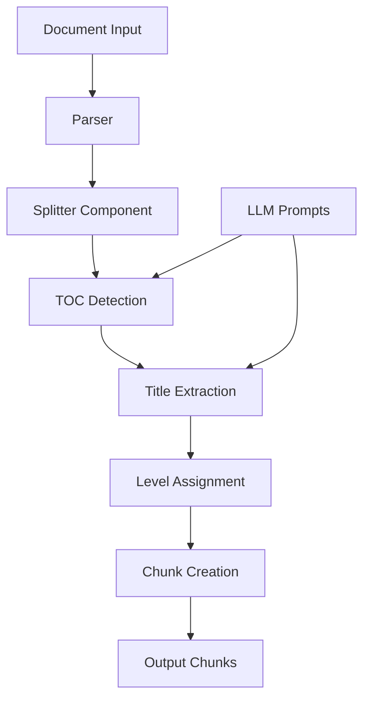
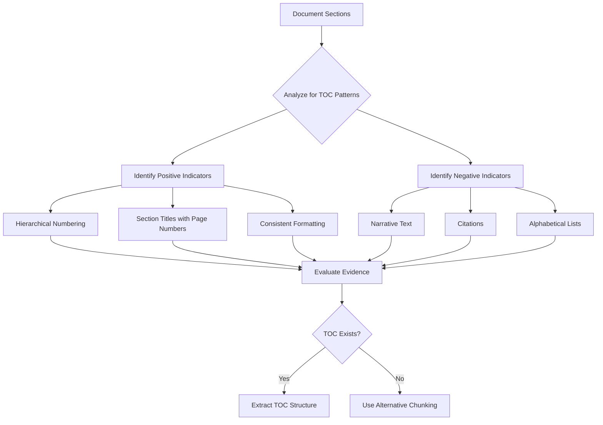
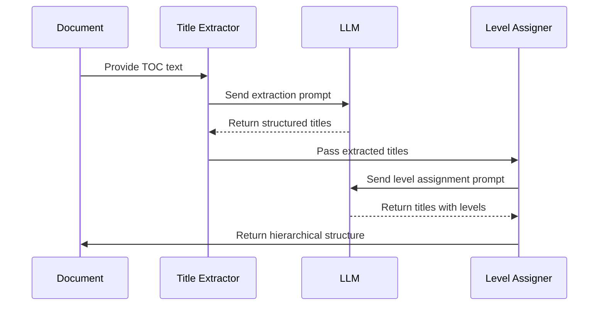
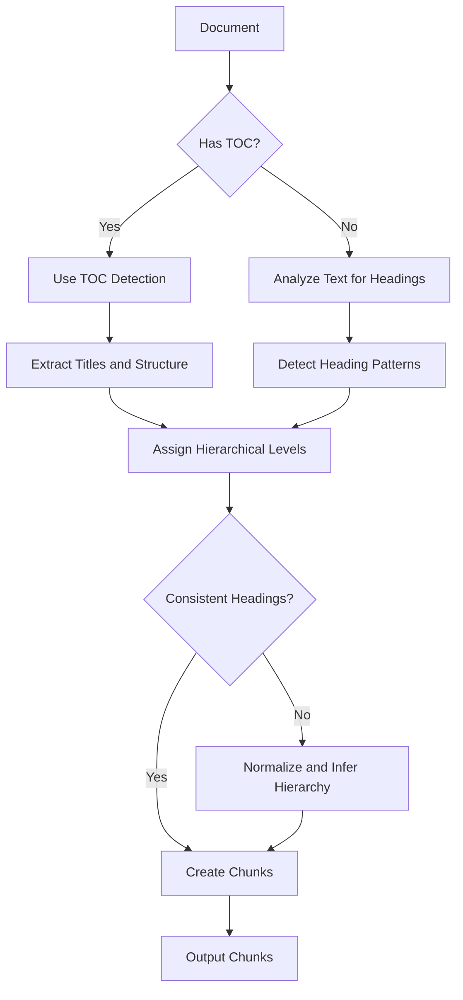

# Title-Based Chunking

<cite>
**Referenced Files in This Document**   
- [splitter.py](file://rag/flow/splitter/splitter.py)
- [schema.py](file://rag/flow/splitter/schema.py)
- [toc_detection.md](file://rag/prompts/toc_detection.md)
- [toc_extraction.md](file://rag/prompts/toc_extraction.md)
- [assign_toc_levels.md](file://rag/prompts/assign_toc_levels.md)
- [extractor.py](file://rag/flow/extractor/extractor.py)
- [generator.py](file://rag/prompts/generator.py)
- [toc_from_text_system.md](file://rag/prompts/toc_from_text_system.md)
- [toc_from_text_user.md](file://rag/prompts/toc_from_text_user.md)
</cite>

## Table of Contents
1. [Introduction](#introduction)
2. [Title-Based Chunking Overview](#title-based-chunking-overview)
3. [Core Components and Architecture](#core-components-and-architecture)
4. [Table of Contents Detection Process](#table-of-contents-detection-process)
5. [Title Extraction and Hierarchy Assignment](#title-extraction-and-hierarchy-assignment)
6. [Configuration Options and Impact](#configuration-options-and-impact)
7. [Handling Missing or Inconsistent Headings](#handling-missing-or-inconsistent-headings)
8. [Performance and Retrieval Quality](#performance-and-retrieval-quality)
9. [Conclusion](#conclusion)

## Introduction
Title-based chunking is a sophisticated document processing technique used in RAGFlow to create semantically meaningful document segments by leveraging the inherent structure of documents. This approach uses table of contents (TOC) detection and extraction to identify document hierarchy and create chunks that preserve the logical organization of content. The system employs specialized LLM prompts to analyze document structure, extract headings, and assign hierarchical levels to create a coherent chunking strategy that enhances retrieval quality in RAG applications.

## Title-Based Chunking Overview
Title-based chunking in RAGFlow transforms unstructured or semi-structured documents into organized, hierarchical chunks by detecting and utilizing document structure. Unlike simple text splitting methods, this approach identifies section headings and their hierarchical relationships to create chunks that maintain semantic coherence and context. The process begins with document parsing, followed by TOC detection, title extraction, and hierarchical level assignment. This method ensures that chunks are created around meaningful document sections rather than arbitrary text boundaries, significantly improving the relevance and context preservation of retrieved information.

The implementation follows a multi-stage pipeline where documents are first analyzed for structural elements, then processed through a series of LLM-powered steps to extract and validate the document's hierarchical organization. This approach is particularly effective for technical documents, research papers, manuals, and other content with clear sectioning, as it preserves the author's intended organization while creating optimally sized chunks for retrieval.

**Section sources**
- [splitter.py](file://rag/flow/splitter/splitter.py#L29-L152)
- [extractor.py](file://rag/flow/extractor/extractor.py#L28-L109)

## Core Components and Architecture
The title-based chunking system in RAGFlow consists of several interconnected components that work together to analyze document structure and create semantically meaningful chunks. At the core is the Splitter component, which orchestrates the chunking process, and the Extractor component, which handles TOC generation and analysis. These components work in conjunction with specialized LLM prompts that guide the structural analysis and hierarchy detection.

The architecture follows a pipeline pattern where documents flow through successive processing stages. The Splitter component receives parsed document content and applies chunking rules, while the Extractor component analyzes the document for structural elements and generates TOC information. The system leverages LLMs to interpret document structure, with specific prompts designed for different aspects of the analysis process. This modular design allows for flexible configuration and extension of the chunking capabilities.

**Diagram sources**
- [splitter.py](file://rag/flow/splitter/splitter.py#L46-L152)
- [extractor.py](file://rag/flow/extractor/extractor.py#L38-L109)

**Section sources**
- [splitter.py](file://rag/flow/splitter/splitter.py#L29-L152)
- [extractor.py](file://rag/flow/extractor/extractor.py#L28-L109)
- [schema.py](file://rag/flow/splitter/schema.py#L20-L39)

## Table of Contents Detection Process
The TOC detection process in RAGFlow is a critical first step in title-based chunking, responsible for identifying whether a document contains a table of contents and extracting its structure. The system uses a specialized LLM prompt (toc_detection.md) that analyzes text content for common TOC indicators such as section titles paired with page numbers, hierarchical numbering patterns, and formatting conventions. The prompt guides the LLM to evaluate both positive indicators (like hierarchical numbering and section titles) and negative indicators (like narrative text or citation formats) to make an accurate determination.

The detection algorithm processes the document in sections, typically focusing on the first few pages where TOCs are most likely to appear. It examines each section for TOC-like patterns and continues until it finds a consistent pattern or determines that no TOC exists. The output is a structured JSON response containing a reasoning field that explains the analysis and an exists field that indicates whether a TOC was detected. This binary decision then determines the subsequent processing path for the document.

**Diagram sources**
- [toc_detection.md](file://rag/prompts/toc_detection.md#L1-L30)
- [generator.py](file://rag/prompts/generator.py#L473-L480)

**Section sources**
- [toc_detection.md](file://rag/prompts/toc_detection.md#L1-L30)
- [generator.py](file://rag/prompts/generator.py#L473-L480)

## Title Extraction and Hierarchy Assignment
Once a TOC is detected, RAGFlow employs a two-step process to extract titles and assign hierarchical levels. The title extraction phase uses the toc_extraction.md prompt to parse the TOC content and convert it into a structured JSON format containing title and structure information. This prompt guides the LLM to identify hierarchical numbering (like "1.1" or "2.3.5") and extract clean title text without page numbers or formatting artifacts.

Following extraction, the system uses the assign_toc_levels.md prompt to analyze the hierarchical relationships between titles and assign depth levels. This process converts the structural numbering into explicit depth labels (1 for top-level, 2 for second-level, etc.) while preserving the original order of items. The LLM analyzes the semantic relationships between titles to maintain a coherent hierarchy, ensuring that peer sections share the same depth level. This standardized hierarchy enables consistent chunking across different documents regardless of their specific numbering schemes.

**Diagram sources**
- [toc_extraction.md](file://rag/prompts/toc_extraction.md#L1-L53)
- [assign_toc_levels.md](file://rag/prompts/assign_toc_levels.md#L1-L53)
- [generator.py](file://rag/prompts/generator.py#L483-L489)

**Section sources**
- [toc_extraction.md](file://rag/prompts/toc_extraction.md#L1-L53)
- [assign_toc_levels.md](file://rag/prompts/assign_toc_levels.md#L1-L53)
- [generator.py](file://rag/prompts/generator.py#L672-L681)

## Configuration Options and Impact
RAGFlow provides several configuration options that influence the title-based chunking process and its outcomes. The primary parameters include chunk token size, delimiters, and overlapped percentage, which control the size and boundaries of generated chunks. The chunk_token_size parameter determines the target size of each chunk in tokens, balancing between context preservation and retrieval efficiency. Delimiters specify the characters or patterns used to split text, with newline characters being the default.

Additional configuration options include children_delimiters, which allow for nested chunking based on specific patterns within sections. These settings directly impact chunk quality by influencing how closely chunks align with semantic boundaries. For example, configuring appropriate delimiters can prevent chunks from being split mid-sentence or mid-paragraph, while adjusting the chunk size can optimize for specific use cases like question answering or summarization.

The system also supports configuration of the LLM parameters used in TOC analysis, such as temperature and top_p, which affect the creativity and determinism of the structural analysis. Lower temperature values (like 0.0) are typically used for TOC tasks to ensure consistent and predictable outputs, while the top_p parameter helps control the diversity of possible interpretations.

**Section sources**
- [splitter.py](file://rag/flow/splitter/splitter.py#L32-L36)
- [splitter.py](file://rag/flow/splitter/splitter.py#L56-L70)

## Handling Missing or Inconsistent Headings
RAGFlow includes robust mechanisms for handling documents with missing or inconsistent headings, which are common in real-world scenarios. When a document lacks a formal TOC, the system employs alternative strategies to identify section boundaries using the toc_from_text_system.md and toc_from_text_user.md prompts. These prompts guide the LLM to detect heading-like patterns in the text content itself, even when no explicit TOC exists.

For documents with inconsistent heading formats, the system normalizes the detected titles and assigns hierarchical levels based on semantic analysis rather than relying solely on formatting cues. This approach allows the system to create a coherent hierarchy even when the original document uses irregular numbering or formatting. The system also includes filtering mechanisms to eliminate false positives, such as numeric sequences that represent data rather than section numbers.

When headings are completely absent, the system falls back to content-aware chunking strategies that use semantic analysis to identify natural breakpoints in the text. This hybrid approach ensures that documents are processed effectively regardless of their structural completeness, maintaining retrieval quality across a wide range of document types and qualities.

**Diagram sources**
- [toc_from_text_system.md](file://rag/prompts/toc_from_text_system.md#L1-L14)
- [generator.py](file://rag/prompts/generator.py#L684-L782)

**Section sources**
- [toc_from_text_system.md](file://rag/prompts/toc_from_text_system.md#L1-L14)
- [generator.py](file://rag/prompts/generator.py#L684-L782)

## Performance and Retrieval Quality
The title-based chunking approach in RAGFlow significantly enhances retrieval quality by creating semantically meaningful chunks that preserve document context and structure. By aligning chunk boundaries with natural section breaks, the system ensures that retrieved content contains complete ideas and concepts rather than fragmented text. This structural awareness improves the relevance of search results and reduces the need for post-processing to reconstruct context.

The use of LLM-powered TOC analysis introduces a computational overhead but provides substantial benefits in chunk quality. The system optimizes performance by limiting TOC analysis to document beginnings and using efficient filtering to reduce the amount of text processed by the LLM. The resulting hierarchical structure enables more sophisticated retrieval strategies, such as prioritizing chunks from relevant sections or using section context to improve answer generation.

In practice, this approach leads to higher precision in information retrieval, as queries are more likely to match against chunks that contain complete, context-rich content. The hierarchical organization also supports advanced features like section-aware summarization and navigation, enhancing the overall user experience in document exploration and analysis.

**Section sources**
- [generator.py](file://rag/prompts/generator.py#L733-L782)
- [splitter.py](file://rag/flow/splitter/splitter.py#L84-L106)

## Conclusion
Title-based chunking in RAGFlow represents a sophisticated approach to document processing that leverages both structural analysis and LLM-powered intelligence to create high-quality, semantically meaningful chunks. By detecting and utilizing document hierarchies through TOC detection, title extraction, and level assignment, the system preserves the logical organization of content while optimizing for retrieval performance. The implementation demonstrates a thoughtful balance between automated analysis and configurable parameters, allowing adaptation to various document types and use cases.

The use of specialized LLM prompts for different stages of the process ensures consistent and reliable structural analysis, while fallback mechanisms handle documents with missing or inconsistent headings. This comprehensive approach to chunking significantly enhances retrieval quality by maintaining context and coherence in the generated chunks, making it particularly valuable for applications requiring deep understanding of document structure and content relationships.