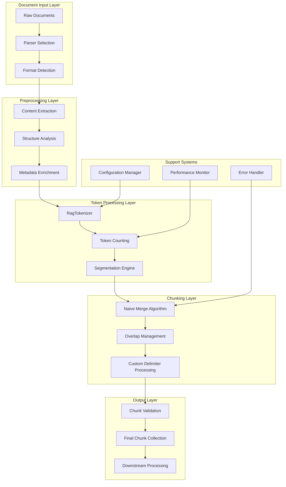
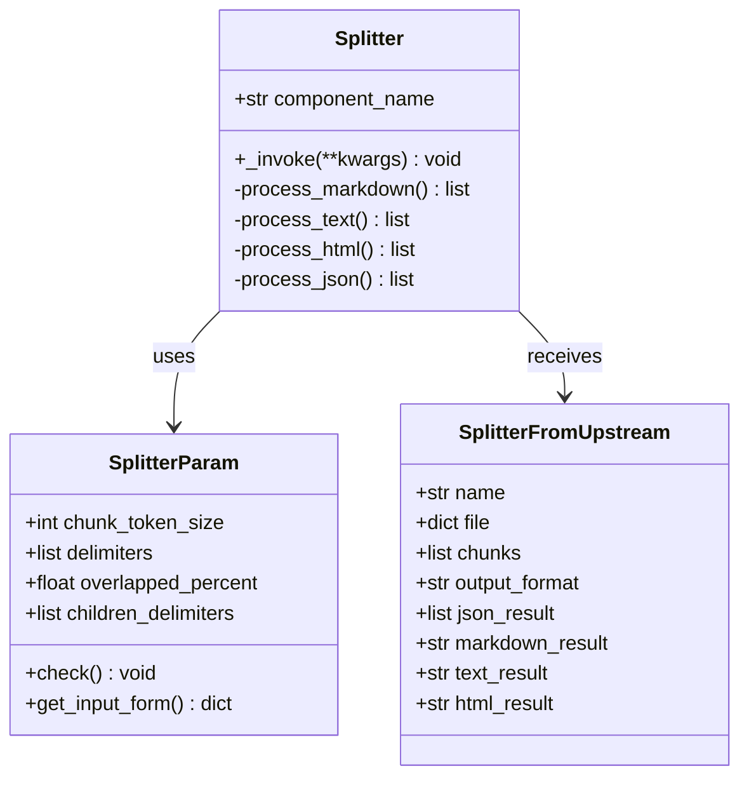
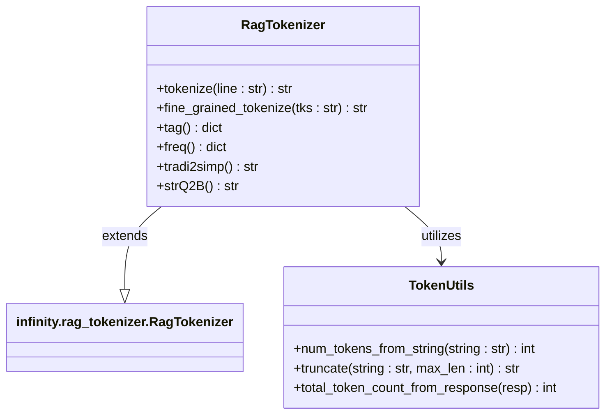
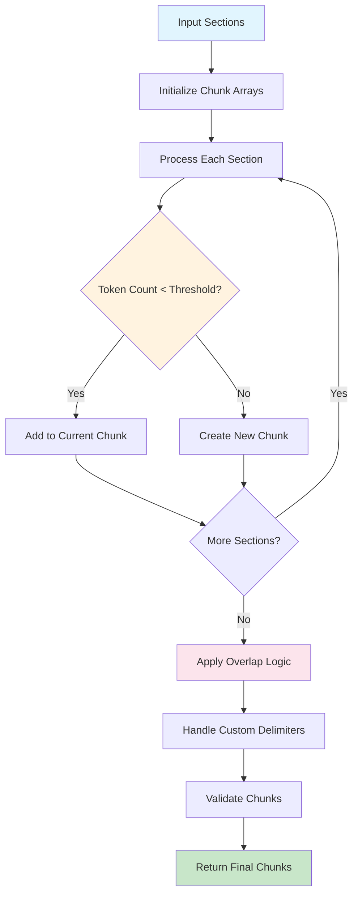
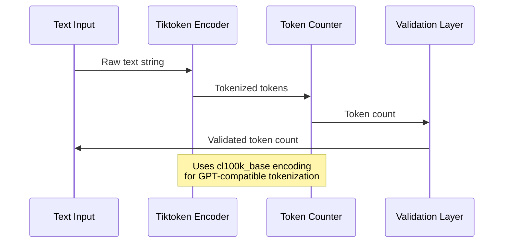
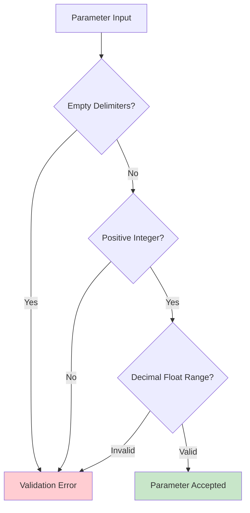
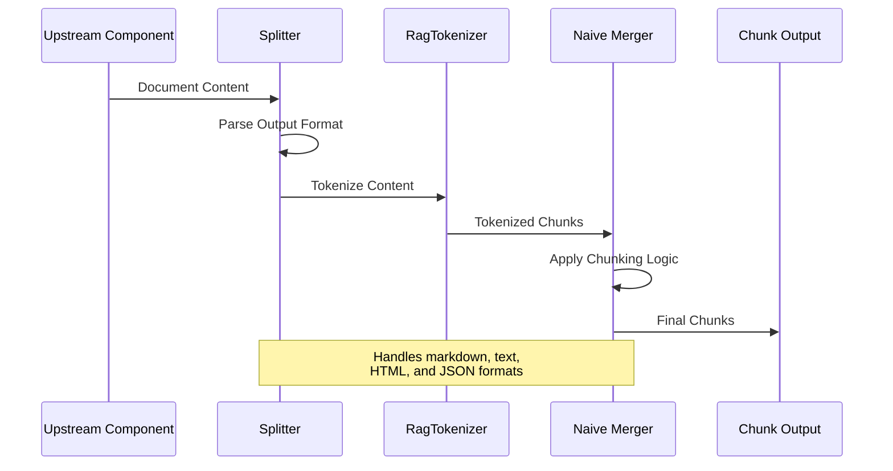
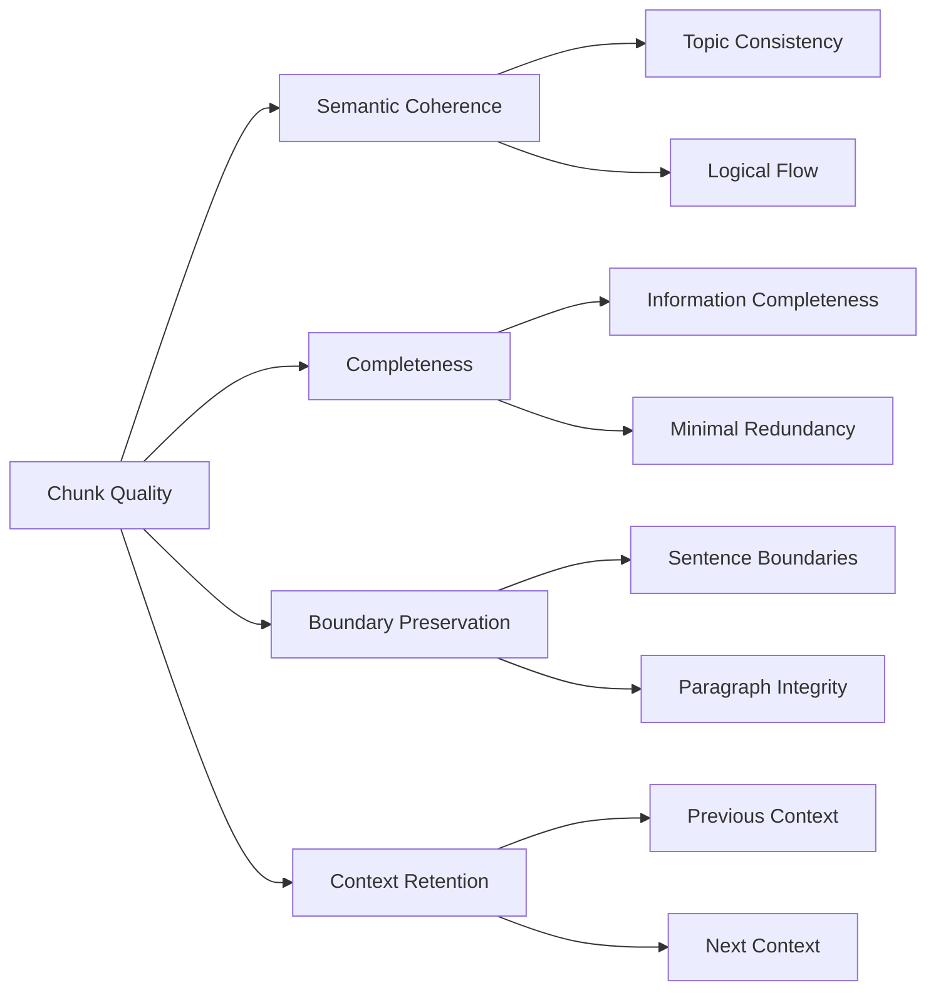
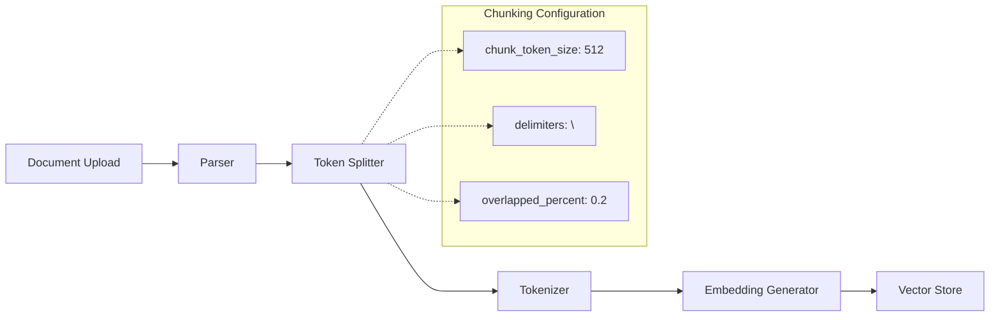

# Token-Based Chunking

<cite>
**Referenced Files in This Document**
- [splitter.py](file://rag/flow/splitter/splitter.py)
- [schema.py](file://rag/flow/splitter/schema.py)
- [rag_tokenizer.py](file://rag/nlp/rag_tokenizer.py)
- [token_utils.py](file://common/token_utils.py)
- [naive_merge.py](file://rag/nlp/__init__.py)
- [advanced_ingestion_pipeline.json](file://agent/templates/advanced_ingestion_pipeline.json)
- [chunk_summary.json](file://agent/templates/chunk_summary.json)
- [general_pdf_all.json](file://rag/flow/tests/dsl_examples/general_pdf_all.json)
- [test_token_utils.py](file://test/unit_test/common/test_token_utils.py)
- [naive.py](file://rag/app/naive.py)
</cite>

## Table of Contents
1. [Introduction](#introduction)
2. [System Architecture](#system-architecture)
3. [Core Components](#core-components)
4. [Token-Based Segmentation Algorithm](#token-based-segmentation-algorithm)
5. [Configuration Parameters](#configuration-parameters)
6. [Implementation Details](#implementation-details)
7. [Performance Analysis](#performance-analysis)
8. [Common Issues and Solutions](#common-issues-and-solutions)
9. [Practical Examples](#practical-examples)
10. [Best Practices](#best-practices)
11. [Troubleshooting Guide](#troubleshooting-guide)

## Introduction

RAGFlow's token-based chunking feature is a sophisticated text segmentation system designed to intelligently divide documents into optimal-sized chunks for Retrieval-Augmented Generation (RAG) applications. Unlike traditional character-based or sentence-boundary approaches, this system leverages token counting to ensure chunks maintain consistent semantic boundaries while respecting token limits imposed by language models.

The token-based chunking process serves as a critical preprocessing step in RAG pipelines, transforming raw document content into manageable, semantically coherent segments that optimize retrieval performance and maintain contextual integrity. This approach addresses fundamental challenges in information retrieval, such as maintaining semantic coherence across chunk boundaries and minimizing information loss during segmentation.

## System Architecture

The token-based chunking system in RAGFlow follows a modular architecture that integrates seamlessly with the broader document processing pipeline. The system consists of several interconnected components that work together to achieve optimal chunking results.



**Diagram sources**
- [splitter.py](file://rag/flow/splitter/splitter.py#L46-L152)
- [rag_tokenizer.py](file://rag/nlp/rag_tokenizer.py#L21-L42)
- [naive_merge.py](file://rag/nlp/__init__.py#L787-L843)

The architecture emphasizes modularity and extensibility, allowing for easy integration of new parsers, tokenizers, and chunking strategies while maintaining backward compatibility and performance optimization.

**Section sources**
- [splitter.py](file://rag/flow/splitter/splitter.py#L1-L152)
- [schema.py](file://rag/flow/splitter/schema.py#L1-L39)

## Core Components

### Splitter Component

The Splitter component serves as the primary orchestrator for token-based chunking operations. It manages the entire chunking pipeline, coordinating between input processing, token counting, and output generation.



**Diagram sources**
- [splitter.py](file://rag/flow/splitter/splitter.py#L29-L44)
- [schema.py](file://rag/flow/splitter/schema.py#L20-L39)

### RagTokenizer Integration

The RagTokenizer provides the foundational tokenization capabilities, interfacing with the underlying infinity.rag_tokenizer library while adding RAGFlow-specific optimizations and configurations.



**Diagram sources**
- [rag_tokenizer.py](file://rag/nlp/rag_tokenizer.py#L21-L42)
- [token_utils.py](file://common/token_utils.py#L29-L83)

**Section sources**
- [splitter.py](file://rag/flow/splitter/splitter.py#L29-L44)
- [rag_tokenizer.py](file://rag/nlp/rag_tokenizer.py#L21-L42)
- [token_utils.py](file://common/token_utils.py#L29-L83)

## Token-Based Segmentation Algorithm

The core segmentation algorithm in RAGFlow employs a sophisticated approach to token-based chunking that balances semantic coherence with technical constraints. The algorithm operates through several key phases, each designed to handle specific aspects of the chunking process.

### Naive Merge Algorithm

The naive_merge function serves as the primary chunking engine, implementing a greedy algorithm that builds chunks while respecting token limits and maintaining semantic boundaries.



**Diagram sources**
- [naive_merge.py](file://rag/nlp/__init__.py#L787-L843)

### Token Counting Mechanism

The token counting system utilizes the tiktoken library with the cl100k_base encoding, providing consistent and reliable tokenization across different languages and content types.



**Diagram sources**
- [token_utils.py](file://common/token_utils.py#L29-L35)

### Overlap Management

The overlap management system ensures that adjacent chunks maintain contextual continuity by sharing overlapping content from the previous chunk's end.

**Section sources**
- [naive_merge.py](file://rag/nlp/__init__.py#L787-L843)
- [token_utils.py](file://common/token_utils.py#L29-L35)

## Configuration Parameters

RAGFlow's token-based chunking system provides extensive configuration options to customize chunking behavior according to specific use cases and requirements.

### Core Parameters

| Parameter | Type | Default | Range | Description |
|-----------|------|---------|-------|-------------|
| `chunk_token_size` | int | 512 | 1-100000000 | Maximum tokens per chunk |
| `delimiters` | list | ["\n"] | Non-empty | Sentence/paragraph delimiters |
| `overlapped_percent` | float | 0 | [0, 1) | Percentage overlap between chunks |
| `children_delimiters` | list | [] | Optional | Custom delimiter patterns |

### Parameter Validation

The system implements comprehensive validation to ensure parameter consistency and prevent runtime errors.



**Diagram sources**
- [splitter.py](file://rag/flow/splitter/splitter.py#L37-L40)

### Advanced Configuration Options

The system supports advanced configuration through custom delimiter patterns and specialized processing modes for different document types.

**Section sources**
- [splitter.py](file://rag/flow/splitter/splitter.py#L29-L44)
- [advanced_ingestion_pipeline.json](file://agent/templates/advanced_ingestion_pipeline.json#L407-L419)

## Implementation Details

### Processing Pipeline

The token-based chunking implementation follows a multi-stage processing pipeline that handles different document formats and content types.



**Diagram sources**
- [splitter.py](file://rag/flow/splitter/splitter.py#L49-L151)

### Format-Specific Processing

Different document formats require specialized processing approaches to maintain content integrity and optimize chunk quality.

| Format | Processing Method | Key Considerations |
|--------|-------------------|-------------------|
| Markdown | Line-by-line processing | Preserve structure, handle headers |
| Text | Character-based splitting | Maintain readability, handle encoding |
| HTML | Tag-aware processing | Preserve markup, handle nested elements |
| JSON | Structured parsing | Maintain object integrity, handle arrays |

### Custom Delimiter Processing

The system supports custom delimiter patterns for specialized chunking requirements, enabling fine-grained control over chunk boundaries.

**Section sources**
- [splitter.py](file://rag/flow/splitter/splitter.py#L49-L151)
- [naive_merge.py](file://rag/nlp/__init__.py#L787-L843)

## Performance Analysis

### Tokenization Performance

The tokenization performance is crucial for overall system throughput, particularly when processing large documents or high-volume ingestion scenarios.

| Metric | Measurement | Optimization Strategy |
|--------|-------------|----------------------|
| Tokenization Speed | Tokens/second | Efficient encoding caching |
| Memory Usage | MB per document | Streaming processing |
| Accuracy | Consistency rate | Standardized encoding |
| Scalability | Concurrent documents | Parallel processing |

### Chunk Quality Metrics

The system evaluates chunk quality through multiple metrics that assess semantic coherence, completeness, and retrieval effectiveness.



### Performance Optimization Strategies

Several optimization strategies enhance the chunking system's performance while maintaining quality standards.

**Section sources**
- [token_utils.py](file://common/token_utils.py#L29-L83)
- [naive_merge.py](file://rag/nlp/__init__.py#L787-L843)

## Common Issues and Solutions

### Sentence Boundary Preservation

One of the primary challenges in token-based chunking is maintaining sentence boundaries while respecting token limits. The system addresses this through intelligent boundary detection and adaptive chunking strategies.

**Problem**: Sentences crossing chunk boundaries disrupt semantic flow and reduce retrieval effectiveness.

**Solution**: The naive_merge algorithm implements boundary-aware chunking that prioritizes sentence preservation while respecting token constraints.

### Encoding Issues

Different document formats and languages present encoding challenges that can affect tokenization accuracy.

**Problem**: Character encoding mismatches lead to incorrect token counts and malformed chunks.

**Solution**: The system implements robust encoding detection and conversion mechanisms, utilizing UTF-8 as the default encoding with fallback options.

### Memory Management

Large documents require careful memory management to prevent system overload and ensure consistent performance.

**Problem**: Memory consumption grows linearly with document size, potentially causing out-of-memory errors.

**Solution**: Streaming processing and chunk-by-chunk tokenization minimize memory footprint while maintaining processing efficiency.

### Overlap Configuration

Improper overlap configuration can lead to either excessive redundancy or insufficient context retention.

**Problem**: Too little overlap loses contextual information, while too much overlap creates redundancy.

**Solution**: The system provides configurable overlap percentages with recommended defaults based on document type and use case.

**Section sources**
- [naive_merge.py](file://rag/nlp/__init__.py#L787-L843)
- [token_utils.py](file://common/token_utils.py#L29-L83)

## Practical Examples

### Basic Token Chunking Configuration

Here's a typical configuration for general-purpose document processing:

```json
{
    "component_name": "Splitter",
    "params": {
        "chunk_token_size": 512,
        "delimiters": ["\n"],
        "overlapped_percent": 0.2
    }
}
```

### Advanced Configuration for Technical Documents

For technical documents requiring precise structure preservation:

```json
{
    "component_name": "Splitter",
    "params": {
        "chunk_token_size": 1024,
        "delimiters": ["\n", ".", "!", "?", ";"],
        "overlapped_percent": 0.15,
        "children_delimiters": ["```", "# ", "## ", "### "]
    }
}
```

### Pipeline Integration Example

The token chunker integrates seamlessly into RAGFlow's ingestion pipelines:



**Diagram sources**
- [advanced_ingestion_pipeline.json](file://agent/templates/advanced_ingestion_pipeline.json#L115-L122)

### Real-World Usage Scenarios

The token-based chunking system supports diverse use cases across different domains and document types.

**Academic Research**: Processing scholarly articles with strict semantic boundaries and citation preservation.

**Technical Documentation**: Handling code documentation and API references with structured content preservation.

**Legal Documents**: Managing legal texts requiring precise clause and section boundaries.

**Marketing Content**: Optimizing marketing materials for conversational AI applications.

**Section sources**
- [advanced_ingestion_pipeline.json](file://agent/templates/advanced_ingestion_pipeline.json#L407-L419)
- [chunk_summary.json](file://agent/templates/chunk_summary.json#L311-L323)

## Best Practices

### Optimal Token Size Selection

Choosing the appropriate token size depends on several factors including language model capabilities, document characteristics, and retrieval requirements.

| Document Type | Recommended Token Size | Rationale |
|---------------|----------------------|-----------|
| General Text | 512-1024 | Balanced semantic coherence |
| Technical Docs | 1024-2048 | Preserve code blocks and formulas |
| Legal Documents | 2048-4096 | Maintain clause integrity |
| Conversational | 256-512 | Optimize for dialogue flow |

### Delimiter Strategy

Effective delimiter selection significantly impacts chunk quality and retrieval performance.

**Recommended Delimiter Patterns**:
- `\n` for paragraph boundaries
- `.!?;` for sentence termination
- `# ` for markdown headers
- `===` for section separators

### Overlap Configuration Guidelines

Overlap configuration should balance context preservation with storage efficiency.

**Guidelines**:
- Use 10-20% overlap for most document types
- Increase to 25-30% for documents with strong sequential dependencies
- Reduce to 5-10% for independent sections or summaries

### Monitoring and Optimization

Continuous monitoring of chunk quality metrics enables iterative improvement of chunking configurations.

**Key Metrics to Track**:
- Average chunk size distribution
- Semantic coherence scores
- Retrieval performance metrics
- Processing time per document

## Troubleshooting Guide

### Common Configuration Errors

**Issue**: Invalid chunk_token_size value
**Symptoms**: AssertionError during pipeline initialization
**Solution**: Ensure chunk_token_size is between 1 and 100,000,000

**Issue**: Empty delimiters list
**Symptoms**: Processing failures or unexpected chunk boundaries
**Solution**: Provide at least one valid delimiter character

**Issue**: Negative overlap percentage
**Symptoms**: Runtime errors or negative overlap values
**Solution**: Set overlapped_percent between 0 and 1 (exclusive)

### Performance Issues

**Issue**: Slow processing speed
**Symptoms**: Long processing times for moderate document sizes
**Diagnostic Steps**:
1. Check available memory and CPU resources
2. Verify tokenization cache configuration
3. Review document format complexity

**Issue**: High memory usage
**Symptoms**: Out-of-memory errors during processing
**Solution**: Reduce chunk_token_size or implement streaming processing

### Quality Problems

**Issue**: Poor semantic coherence
**Symptoms**: Chunks with missing context or disjointed content
**Solution**: Adjust overlap percentage and review delimiter configuration

**Issue**: Excessive fragmentation
**Symptoms**: Too many small chunks with minimal content
**Solution**: Increase chunk_token_size or modify delimiter patterns

### Debugging Tools

The system provides several debugging and monitoring capabilities:

**Logging Configuration**: Enable detailed logging to track processing steps and identify bottlenecks.

**Metrics Collection**: Monitor key performance indicators to assess system health and identify optimization opportunities.

**Validation Checks**: Implement content validation to ensure chunk quality meets requirements.

**Section sources**
- [test_token_utils.py](file://test/unit_test/common/test_token_utils.py#L21-L138)
- [splitter.py](file://rag/flow/splitter/splitter.py#L37-L40)

## Conclusion

RAGFlow's token-based chunking feature represents a sophisticated approach to document segmentation that balances technical precision with practical usability. By leveraging token counting, intelligent boundary detection, and configurable parameters, the system provides a robust foundation for RAG applications across diverse domains and use cases.

The modular architecture ensures extensibility and maintainability, while comprehensive configuration options enable fine-tuning for specific requirements. Through careful attention to performance optimization, quality metrics, and user experience, the token-based chunking system delivers reliable, efficient, and effective document processing capabilities.

Future enhancements may include machine learning-based chunking strategies, enhanced overlap management algorithms, and expanded support for specialized document formats. The current implementation provides a solid foundation for these improvements while maintaining backward compatibility and system stability.