# Fused Re-Ranking

<cite>
**Referenced Files in This Document**
- [rerank_model.py](file://rag/llm/rerank_model.py)
- [search.py](file://rag/nlp/search.py)
- [query.py](file://rag/nlp/query.py)
- [rag_tokenizer.py](file://rag/nlp/rag_tokenizer.py)
- [doc_store_conn.py](file://rag/utils/doc_store_conn.py)
- [es_conn.py](file://rag/utils/es_conn.py)
- [ob_conn.py](file://rag/utils/ob_conn.py)
- [infinity_conn.py](file://rag/utils/infinity_conn.py)
- [opensearch_conn.py](file://rag/utils/opensearch_conn.py)
- [rerank.tsx](file://web/src/components/rerank.tsx)
- [similarity-slider/index.tsx](file://web/src/components/similarity-slider/index.tsx)
- [page-rank-form-field.tsx](file://web/src/components/page-rank-form-field.tsx)
- [settings.py](file://common/settings.py)
- [infinity_mapping.json](file://conf/infinity_mapping.json)
</cite>

## Table of Contents
1. [Introduction](#introduction)
2. [System Architecture](#system-architecture)
3. [Core Components](#core-components)
4. [Tokenizer Pipeline Integration](#tokenizer-pipeline-integration)
5. [Re-ranking Model Implementation](#re-ranking-model-implementation)
6. [Fusion Strategies](#fusion-strategies)
7. [Configuration Options](#configuration-options)
8. [Performance Optimization](#performance-optimization)
9. [Common Issues and Solutions](#common-issues-and-solutions)
10. [Best Practices](#best-practices)
11. [Troubleshooting Guide](#troubleshooting-guide)

## Introduction

The fused re-ranking feature in RAGFlow represents a sophisticated approach to improving answer quality by intelligently combining multiple retrieval results through advanced re-ranking algorithms. This system integrates seamlessly with the tokenizer pipeline and various re-ranking models to deliver superior search results that balance precision and recall.

The re-ranking architecture operates on the principle of multi-modal learning, where traditional vector similarity scores are combined with lexical token similarity and advanced machine learning models to produce optimized rankings. This approach addresses the limitations of single-retrieval strategies by leveraging complementary strengths across different search methodologies.

## System Architecture

The fused re-ranking system follows a layered architecture that separates concerns between retrieval, ranking, and fusion components:

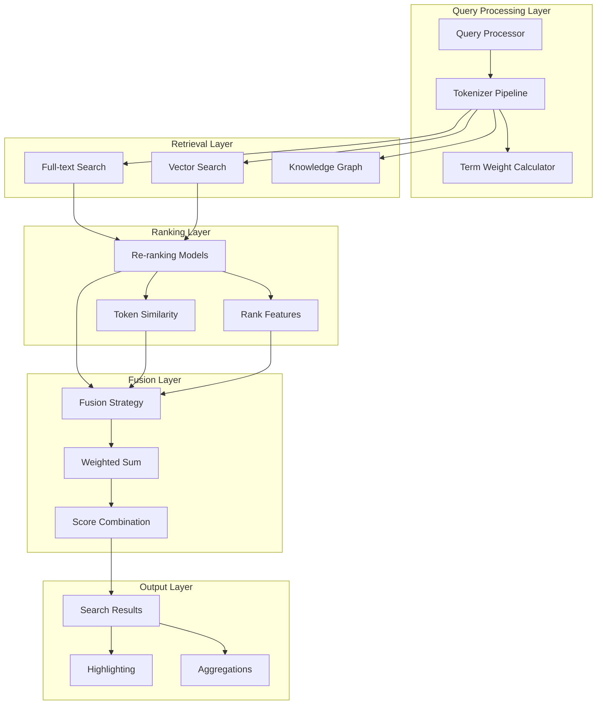

**Diagram sources**
- [search.py](file://rag/nlp/search.py#L36-L60)
- [query.py](file://rag/nlp/query.py#L26-L40)
- [rerank_model.py](file://rag/llm/rerank_model.py#L28-L40)

**Section sources**
- [search.py](file://rag/nlp/search.py#L36-L60)
- [query.py](file://rag/nlp/query.py#L26-L40)

## Core Components

### Search Dealer Component

The [`Dealer`](file://rag/nlp/search.py#L36-L60) class serves as the central orchestrator for the re-ranking system, managing the entire retrieval and ranking pipeline:

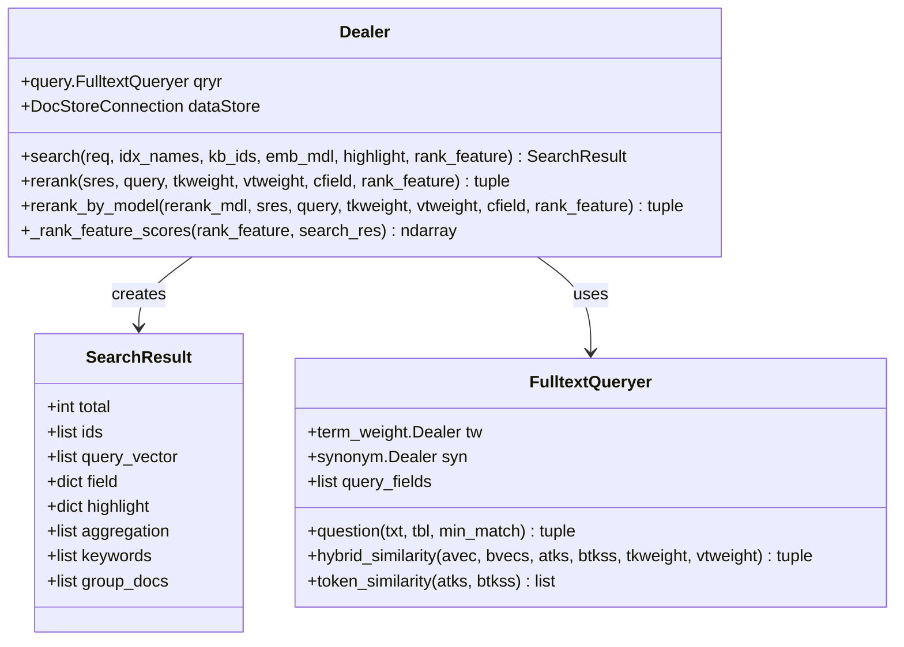

**Diagram sources**
- [search.py](file://rag/nlp/search.py#L36-L60)
- [search.py](file://rag/nlp/search.py#L42-L51)
- [query.py](file://rag/nlp/query.py#L26-L40)

### Fusion Expression System

The fusion mechanism utilizes [`FusionExpr`](file://rag/utils/doc_store_conn.py#L123-L128) to combine multiple retrieval strategies:

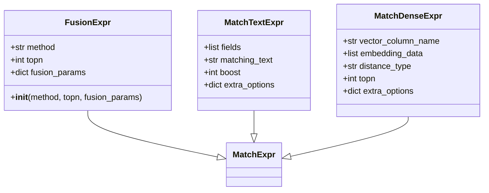

**Diagram sources**
- [doc_store_conn.py](file://rag/utils/doc_store_conn.py#L123-L128)
- [doc_store_conn.py](file://rag/utils/doc_store_conn.py#L85-L90)

**Section sources**
- [search.py](file://rag/nlp/search.py#L36-L60)
- [doc_store_conn.py](file://rag/utils/doc_store_conn.py#L123-L128)

## Tokenizer Pipeline Integration

The tokenizer pipeline plays a crucial role in preparing text for both retrieval and re-ranking processes. The [`RagTokenizer`](file://rag/nlp/rag_tokenizer.py#L21-L35) extends the base tokenizer with RAGFlow-specific optimizations:

### Tokenization Workflow

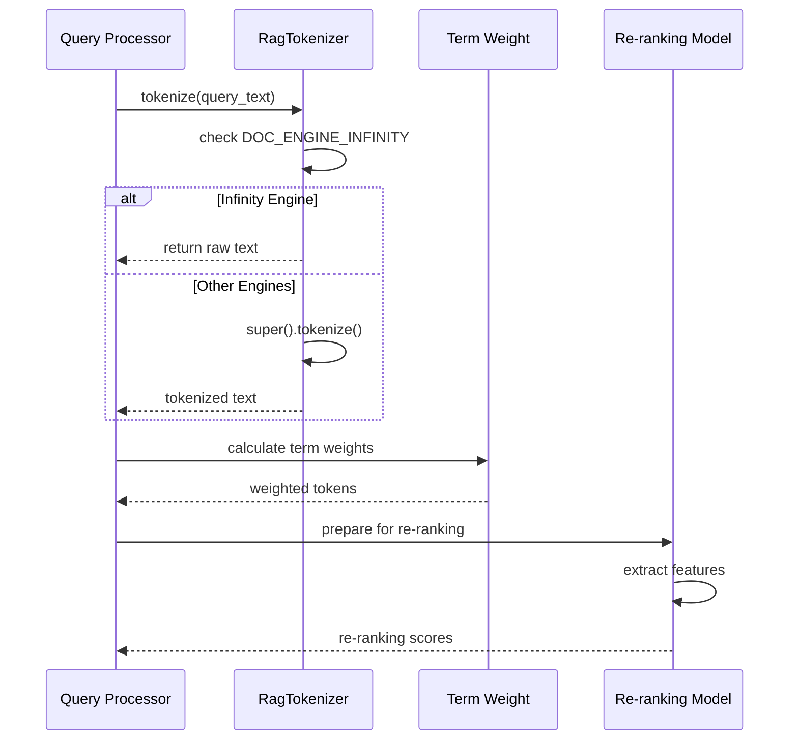

**Diagram sources**
- [rag_tokenizer.py](file://rag/nlp/rag_tokenizer.py#L21-L35)
- [query.py](file://rag/nlp/query.py#L85-L132)

### Feature Extraction Process

The system extracts multiple types of features from tokenized text:

| Feature Type | Description | Weight | Purpose |
|--------------|-------------|--------|---------|
| Content Tokens | Main content tokens | ×1 | Basic semantic matching |
| Title Tokens | Document title tokens | ×2 | Importance weighting |
| Question Tokens | Question-related tokens | ×6 | Query alignment |
| Important Keywords | Highlighted keywords | ×5 | Priority boosting |
| Synonyms | Expanded vocabulary | ×0.25 | Coverage expansion |

**Section sources**
- [rag_tokenizer.py](file://rag/nlp/rag_tokenizer.py#L21-L35)
- [query.py](file://rag/nlp/query.py#L85-L132)

## Re-ranking Model Implementation

RAGFlow supports multiple re-ranking model implementations, each optimized for different use cases and deployment scenarios:

### Model Architecture Overview

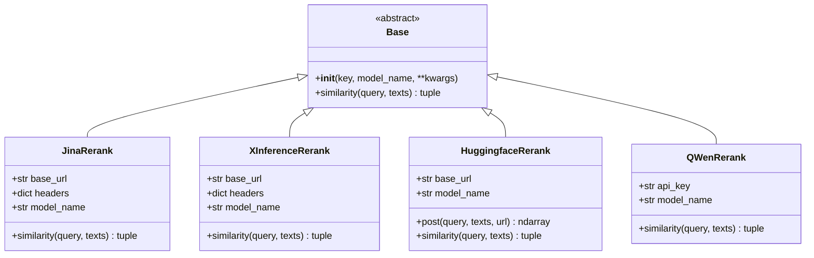

**Diagram sources**
- [rerank_model.py](file://rag/llm/rerank_model.py#L28-L40)
- [rerank_model.py](file://rag/llm/rerank_model.py#L40-L60)
- [rerank_model.py](file://rag/llm/rerank_model.py#L61-L91)

### Re-ranking Score Calculation

Each model implements a standardized [`similarity`](file://rag/llm/rerank_model.py#L48-L58) method that returns normalized scores:

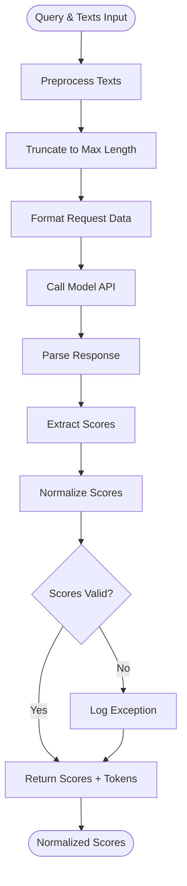

**Diagram sources**
- [rerank_model.py](file://rag/llm/rerank_model.py#L48-L58)
- [rerank_model.py](file://rag/llm/rerank_model.py#L104-L134)

### Scoring Algorithm Details

The re-ranking system employs several scoring mechanisms:

#### Hybrid Similarity Calculation

The [`hybrid_similarity`](file://rag/nlp/query.py#L220-L228) method combines multiple similarity measures:

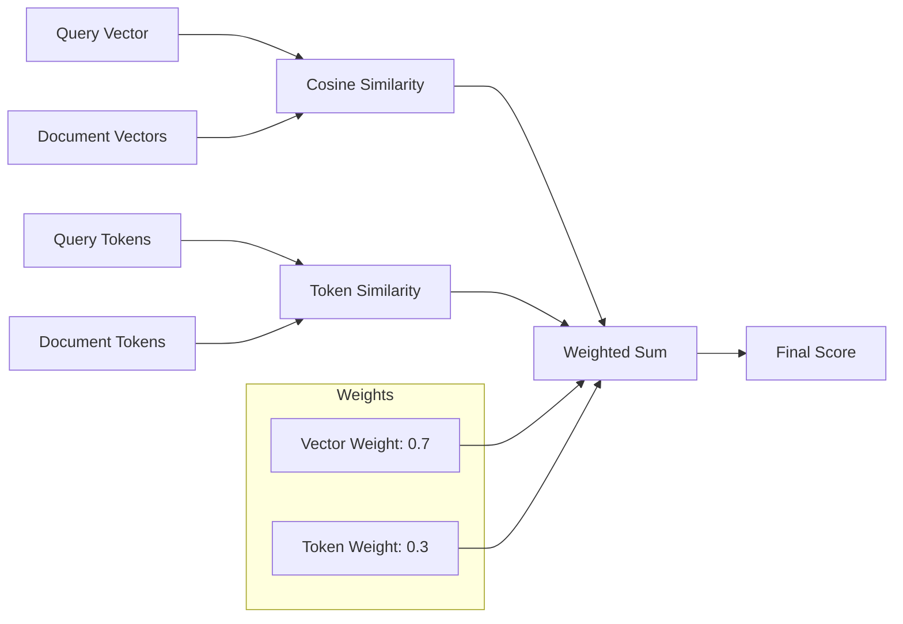

**Diagram sources**
- [query.py](file://rag/nlp/query.py#L220-L228)

#### Rank Feature Scoring

The system incorporates additional ranking features through [`_rank_feature_scores`](file://rag/nlp/search.py#L264-L289):

| Feature | Description | Calculation Method |
|---------|-------------|-------------------|
| PageRank | Document importance score | Linear scaling (0-100) → (0-1) |
| Tag Features | Metadata-based relevance | Cosine similarity with query features |
| Combined Score | Final ranking | `(tag_features × 10) + pagerank` |

**Section sources**
- [rerank_model.py](file://rag/llm/rerank_model.py#L48-L58)
- [query.py](file://rag/nlp/query.py#L220-L228)
- [search.py](file://rag/nlp/search.py#L264-L289)

## Fusion Strategies

RAGFlow implements sophisticated fusion strategies to combine multiple retrieval results effectively:

### Weighted Sum Fusion

The primary fusion method uses a weighted combination of scores:

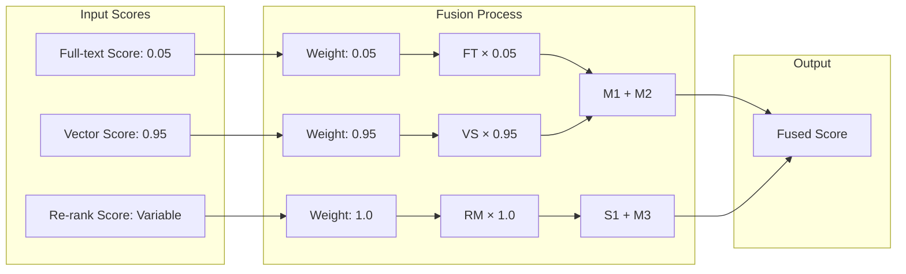

**Diagram sources**
- [search.py](file://rag/nlp/search.py#L126-L127)
- [es_conn.py](file://rag/utils/es_conn.py#L174-L181)

### Configuration-Based Weights

Different document engines handle fusion weights differently:

| Engine | Vector Weight | Text Weight | Fusion Method |
|--------|---------------|-------------|---------------|
| Elasticsearch | 0.5 | 0.5 | Equal weighting |
| OceanBase | 0.5 | 0.5 | Equal weighting |
| OpenSearch | 0.5 | 0.5 | Equal weighting |
| Infinity | 0.95 | 0.05 | Dominant vector |

**Section sources**
- [es_conn.py](file://rag/utils/es_conn.py#L174-L181)
- [ob_conn.py](file://rag/utils/ob_conn.py#L732-L740)
- [search.py](file://rag/nlp/search.py#L126-L127)

## Configuration Options

### Re-ranking Model Configuration

The system provides extensive configuration options for re-ranking:

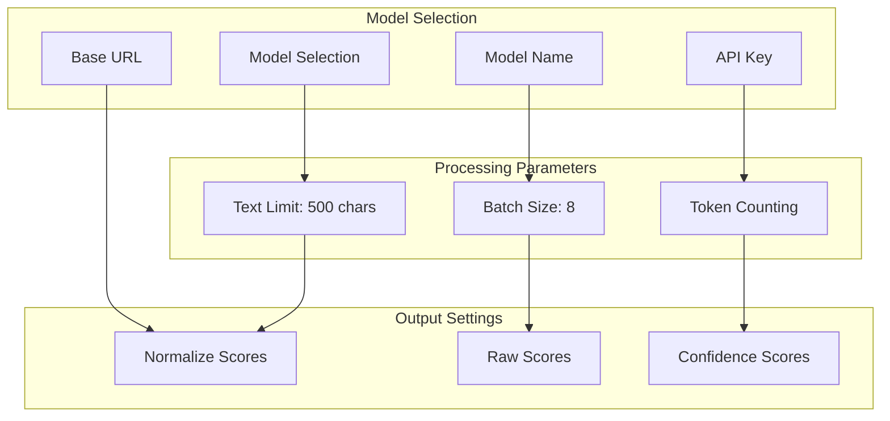

**Diagram sources**
- [rerank_model.py](file://rag/llm/rerank_model.py#L104-L134)

### Top-K Configuration

The [`top_k`](file://web/src/components/rerank.tsx#L60-L65) parameter controls the number of candidates processed:

| Parameter | Range | Default | Purpose |
|-----------|-------|---------|---------|
| top_k | 1-2048 | 1024 | Candidate pool size |
| vector_similarity_weight | 0.0-1.0 | 0.3 | Balance between retrieval types |
| similarity_threshold | 0.0-1.0 | 0.2 | Minimum similarity cutoff |

**Section sources**
- [rerank.tsx](file://web/src/components/rerank.tsx#L60-L65)
- [similarity-slider/index.tsx](file://web/src/components/similarity-slider/index.tsx#L65-L85)

## Performance Optimization

### Computational Efficiency

The re-ranking system implements several optimization strategies:

#### Batch Processing

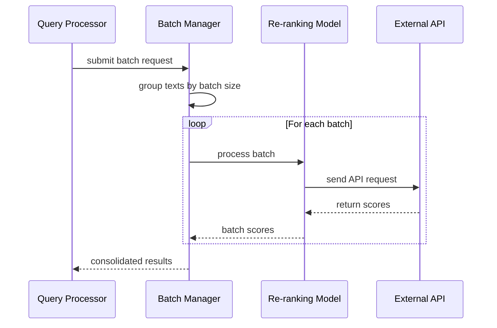

**Diagram sources**
- [rerank_model.py](file://rag/llm/rerank_model.py#L390-L408)

#### Token Counting Optimization

The system tracks token usage efficiently:

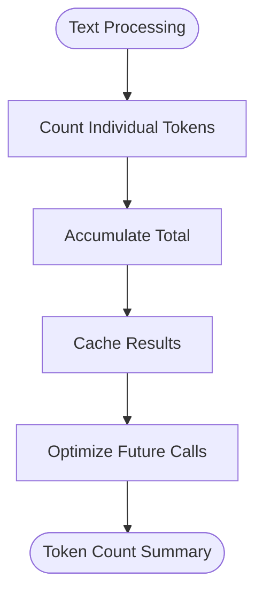

**Diagram sources**
- [rerank_model.py](file://rag/llm/rerank_model.py#L113-L116)

### Memory Management

The system employs memory-efficient patterns:

- **Lazy Loading**: Results loaded on-demand
- **Streaming**: Large batches processed incrementally  
- **Caching**: Frequently accessed scores cached
- **Garbage Collection**: Automatic cleanup of temporary objects

**Section sources**
- [rerank_model.py](file://rag/llm/rerank_model.py#L390-L408)

## Common Issues and Solutions

### Ranking Accuracy Problems

#### Issue: Poor Re-ranking Performance
**Symptoms**: Re-ranked results worse than initial retrieval
**Causes**: 
- Incorrect model configuration
- Suboptimal weight settings
- Insufficient training data

**Solutions**:
1. Verify model selection matches use case
2. Adjust weight parameters (tkweight, vtweight)
3. Increase top_k for better candidate coverage
4. Enable confidence scoring for filtering

#### Issue: Inconsistent Rankings
**Symptoms**: Same query produces different results
**Causes**:
- Model randomness
- Network latency variations
- Token truncation differences

**Solutions**:
1. Implement deterministic tokenization
2. Add caching for identical queries
3. Standardize preprocessing steps
4. Use ensemble methods for stability

### Computational Overhead

#### Issue: Slow Re-ranking Performance
**Symptoms**: High latency in response times
**Causes**:
- Large batch sizes
- Network delays
- Model inference bottlenecks

**Solutions**:
1. Reduce batch size (8-16)
2. Implement local model deployment
3. Add asynchronous processing
4. Use model quantization

#### Issue: High Resource Consumption
**Symptoms**: Excessive memory/CPU usage
**Causes**:
- Unbounded result sets
- Inefficient data structures
- Memory leaks

**Solutions**:
1. Implement result limiting
2. Use streaming processing
3. Monitor memory usage
4. Optimize data structures

**Section sources**
- [rerank_model.py](file://rag/llm/rerank_model.py#L104-L134)

## Best Practices

### Model Selection Guidelines

Choose the appropriate re-ranking model based on your requirements:

| Use Case | Recommended Model | Strengths | Considerations |
|----------|------------------|-----------|---------------|
| Production Systems | JinaRerank | Reliability, performance | API costs |
| Research/Development | HuggingfaceRerank | Flexibility, customization | Setup complexity |
| Chinese Content | QWenRerank | Native language support | Regional availability |
| Local Deployment | LocalAI | Privacy, cost | Hardware requirements |

### Configuration Recommendations

#### For High-Quality Results
```yaml
vector_similarity_weight: 0.2
top_k: 2048
rerank_model: "jina-reranker-v2-base-multilingual"
```

#### For Speed Optimization
```yaml
vector_similarity_weight: 0.8
top_k: 512
rerank_model: ""  # Disable re-ranking
```

#### For Balanced Performance
```yaml
vector_similarity_weight: 0.3
top_k: 1024
rerank_model: "BAAI/bge-reranker-v2-m3"
```

### Monitoring and Maintenance

#### Key Metrics to Track
- **Response Latency**: Average time per query
- **Token Usage**: Cost optimization
- **Ranking Quality**: Precision/recall metrics
- **Error Rates**: Model reliability

#### Regular Maintenance Tasks
1. Monitor model performance trends
2. Update model configurations based on usage
3. Review and optimize weight parameters
4. Audit token consumption patterns

## Troubleshooting Guide

### Debugging Re-ranking Issues

#### Step 1: Verify Model Connectivity
```bash
# Test API connectivity
curl -X POST "https://api.jina.ai/v1/rerank" \
  -H "Content-Type: application/json" \
  -H "Authorization: Bearer YOUR_API_KEY" \
  -d '{"model": "jina-reranker-v2-base-multilingual", "query": "test", "documents": ["sample text"], "top_n": 1}'
```

#### Step 2: Check Tokenization
```python
# Verify tokenization consistency
from rag.nlp.rag_tokenizer import tokenize
print(tokenize("your query text"))
```

#### Step 3: Validate Fusion Weights
```python
# Check weight calculations
weights = "0.05,0.95"
vector_weight = float(weights.split(",")[1])
print(f"Vector weight: {vector_weight}")
```

### Common Error Messages

| Error | Cause | Solution |
|-------|-------|----------|
| "Model not found" | Invalid model name | Check model registry |
| "API key invalid" | Authentication failure | Verify credentials |
| "Rate limit exceeded" | Too many requests | Implement throttling |
| "Timeout error" | Network issues | Increase timeout, check connectivity |

### Performance Tuning

#### Memory Optimization
1. Reduce batch size for memory-constrained environments
2. Implement result caching for frequently accessed queries
3. Use streaming for large result sets

#### Network Optimization
1. Deploy models locally when possible
2. Implement connection pooling
3. Use compression for API responses
4. Configure retry mechanisms with exponential backoff

**Section sources**
- [rerank_model.py](file://rag/llm/rerank_model.py#L48-L58)
- [search.py](file://rag/nlp/search.py#L126-L127)