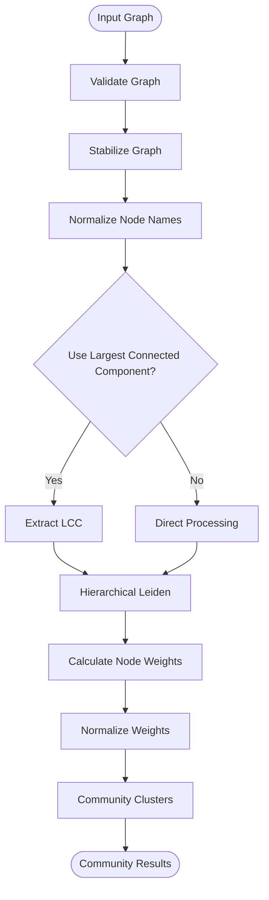

# Community Reports

<cite>
**Referenced Files in This Document**
- [community_reports_extractor.py](file://graphrag/general/community_reports_extractor.py)
- [community_report_prompt.py](file://graphrag/general/community_report_prompt.py)
- [leiden.py](file://graphrag/general/leiden.py)
- [extractor.py](file://graphrag/general/extractor.py)
- [index.py](file://graphrag/general/index.py)
- [utils.py](file://graphrag/utils.py)
- [search.py](file://graphrag/search.py)
</cite>

## Table of Contents
1. [Introduction](#introduction)
2. [System Architecture](#system-architecture)
3. [Community Detection Pipeline](#community-detection-pipeline)
4. [Community Report Generation](#community-report-generation)
5. [Configuration Options](#configuration-options)
6. [Output Formats](#output-formats)
7. [Common Issues and Solutions](#common-issues-and-solutions)
8. [Usage Patterns](#usage-patterns)
9. [Technical Implementation Details](#technical-implementation-details)
10. [Performance Considerations](#performance-considerations)

## Introduction

The community reports feature in RAGFlow's knowledge graph integration provides automated detection of tightly connected groups of entities within knowledge graphs and generates structured natural language summaries for each detected community. This feature leverages the Leiden algorithm for community detection and combines it with Large Language Model (LLM) capabilities to produce comprehensive reports that highlight key insights, relationships, and potential impacts within identified communities.

The system automatically identifies clusters of related entities based on their connectivity patterns, generates detailed reports for each community, and provides structured outputs that can be used for knowledge discovery, decision-making support, and strategic analysis.

## System Architecture

The community reports feature consists of several interconnected components that work together to detect communities and generate reports:


**Diagram sources**
- [community_reports_extractor.py](file://graphrag/general/community_reports_extractor.py#L38-L180)
- [leiden.py](file://graphrag/general/leiden.py#L72-L149)
- [index.py](file://graphrag/general/index.py#L507-L585)

## Community Detection Pipeline

### Leiden Algorithm Implementation

The community detection process begins with the Leiden algorithm, which is a hierarchical clustering method that identifies communities in networks by optimizing modularity.



**Diagram sources**
- [leiden.py](file://graphrag/general/leiden.py#L72-L149)

### Graph Stabilization and Preparation

The system ensures consistent results by stabilizing the graph structure:

- **Node Sorting**: Nodes are sorted alphabetically to ensure consistent ordering
- **Edge Normalization**: Undirected edges are normalized to maintain consistent directionality
- **Node Name Standardization**: Node names are normalized to uppercase with HTML escaping
- **Largest Connected Component**: Optionally extracts the largest connected component to focus on the main graph structure

**Section sources**
- [leiden.py](file://graphrag/general/leiden.py#L17-L68)

### Community Resolution Parameters

The Leiden algorithm supports several configuration parameters for fine-tuning community detection:

| Parameter | Type | Default | Description |
|-----------|------|---------|-------------|
| `max_cluster_size` | int | 12 | Maximum size of individual communities |
| `use_lcc` | bool | True | Whether to use only the largest connected component |
| `seed` | int | 0xDEADBEEF | Random seed for reproducible results |
| `levels` | list | None | Specific levels to process (None = all levels) |

**Section sources**
- [leiden.py](file://graphrag/general/leiden.py#L96-L117)

## Community Report Generation

### Report Structure and Content

Each community report follows a standardized structure designed to provide comprehensive insights:


**Diagram sources**
- [community_report_prompt.py](file://graphrag/general/community_report_prompt.py#L24-L40)

### Natural Language Generation Process

The report generation process involves several key steps:

1. **Entity and Relationship Extraction**: Extract entities and relationships within each community
2. **Prompt Construction**: Build structured prompts with entity and relationship data
3. **LLM Processing**: Send prompts to language models for natural language generation
4. **Output Validation**: Validate and parse JSON responses
5. **Formatting**: Convert structured data to readable Markdown format


**Diagram sources**
- [community_reports_extractor.py](file://graphrag/general/community_reports_extractor.py#L66-L142)

**Section sources**
- [community_reports_extractor.py](file://graphrag/general/community_reports_extractor.py#L66-L142)

### Impact Severity Rating System

Each community receives an impact severity rating between 0-10, representing the potential importance or influence of the community:

- **0-2**: Low impact - minor or isolated communities
- **3-5**: Moderate impact - moderately connected communities
- **6-8**: High impact - well-connected influential communities  
- **9-10**: Critical impact - highly influential or potentially disruptive communities

The rating is accompanied by a brief explanation that provides context for the assessment.

**Section sources**
- [community_report_prompt.py](file://graphrag/general/community_report_prompt.py#L19-L21)

## Configuration Options

### Community Reports Extractor Configuration

The `CommunityReportsExtractor` class accepts several configuration parameters:

| Parameter | Type | Default | Description |
|-----------|------|---------|-------------|
| `llm_invoker` | CompletionLLM | Required | Language model interface |
| `max_report_length` | int | 1500 | Maximum length for generated reports |

### Environment Variables

Several environment variables control the behavior of the community detection and reporting system:

| Variable | Default | Description |
|----------|---------|-------------|
| `ENABLE_TIMEOUT_ASSERTION` | Not set | Enable timeout assertions for debugging |
| `MAX_CONCURRENT_CHATS` | 10 | Maximum concurrent LLM requests |
| `GRAPHRAG_MAX_ERRORS` | 3 | Maximum errors before aborting |

**Section sources**
- [community_reports_extractor.py](file://graphrag/general/community_reports_extractor.py#L45-L54)

### Graph Processing Configuration

The underlying graph processing includes several configurable parameters:

| Parameter | Type | Default | Description |
|-----------|------|---------|-------------|
| `max_cluster_size` | int | 12 | Maximum community size |
| `use_lcc` | bool | True | Use largest connected component |
| `seed` | int | 0xDEADBEEF | Random seed for reproducibility |

**Section sources**
- [leiden.py](file://graphrag/general/leiden.py#L96-L117)

## Output Formats

### Structured JSON Output

The system produces structured JSON output that includes all report components:

```json
{
  "title": "Community Title",
  "summary": "Executive summary of the community",
  "rating": 7.5,
  "rating_explanation": "Moderate impact due to key influencer connections",
  "findings": [
    {
      "summary": "Key Insight 1",
      "explanation": "Detailed explanation with supporting evidence"
    },
    {
      "summary": "Key Insight 2", 
      "explanation": "Additional detailed explanation"
    }
  ],
  "weight": 0.85,
  "entities": ["entity1", "entity2", "entity3"]
}
```

### Human-Readable Markdown Output

The system also generates human-readable Markdown reports:

```markdown
# Community Title

Executive summary of the community...

## Key Insight 1

Detailed explanation with supporting evidence...

## Key Insight 2

Additional detailed explanation...
```

**Section sources**
- [community_reports_extractor.py](file://graphrag/general/community_reports_extractor.py#L161-L179)

## Common Issues and Solutions

### Community Fragmentation

**Issue**: Communities are split into smaller fragments due to weak connections

**Solutions**:
- Adjust `max_cluster_size` parameter to allow larger communities
- Disable `use_lcc` to process disconnected components
- Increase the random seed variation for different clusterings

### Redundant Reporting

**Issue**: Similar communities are reported multiple times

**Solutions**:
- Implement community merging based on overlap thresholds
- Use entity similarity metrics to identify duplicates
- Apply post-processing filtering to remove redundant reports

### Performance Issues

**Issue**: Slow processing for large graphs

**Solutions**:
- Reduce `max_cluster_size` to limit community complexity
- Process communities in batches
- Implement parallel processing with appropriate concurrency limits
- Use caching mechanisms for repeated operations

### Quality Control

**Issue**: Poor quality or irrelevant reports

**Solutions**:
- Validate LLM outputs against expected schemas
- Implement confidence scoring for reports
- Add post-processing quality checks
- Use multiple LLMs for cross-validation

**Section sources**
- [community_reports_extractor.py](file://graphrag/general/community_reports_extractor.py#L127-L134)

## Usage Patterns

### Basic Community Report Generation

```python
# Initialize the extractor
extractor = CommunityReportsExtractor(llm_bundle)

# Generate community reports
result = await extractor(graph, callback=progress_callback, task_id=task_id)

# Access results
structured_reports = result.structured_output
text_reports = result.output
```

### Batch Processing

For processing multiple graphs or large datasets:

```python
async def process_multiple_graphs(graphs, callback):
    extractor = CommunityReportsExtractor(llm_bundle)
    
    results = []
    for i, graph in enumerate(graphs):
        result = await extractor(graph, 
                               callback=lambda msg: callback(f"Graph {i}: {msg}"),
                               task_id=f"graph_{i}")
        results.append(result)
    
    return results
```

### Integration with Knowledge Graph Pipeline

The community reports feature integrates seamlessly with the broader knowledge graph processing pipeline:


**Diagram sources**
- [index.py](file://graphrag/general/index.py#L507-L585)

**Section sources**
- [index.py](file://graphrag/general/index.py#L507-L585)

## Technical Implementation Details

### Asynchronous Processing Architecture

The system uses Trio for asynchronous processing, enabling efficient handling of multiple community reports:

- **Parallel Processing**: Communities are processed concurrently using Trio's nursery pattern
- **Timeout Management**: Built-in timeout protection prevents hanging operations
- **Cancellation Support**: Graceful task cancellation with proper cleanup
- **Resource Management**: Automatic cleanup of resources and connections

**Section sources**
- [community_reports_extractor.py](file://graphrag/general/community_reports_extractor.py#L144-L154)

### Error Handling and Recovery

The system implements comprehensive error handling:

- **LLM Timeout Protection**: Configurable timeouts prevent hanging LLM calls
- **JSON Parsing Validation**: Robust JSON parsing with error recovery
- **Task Cancellation**: Proper handling of user-initiated cancellations
- **Retry Mechanisms**: Automatic retry for transient failures

**Section sources**
- [community_reports_extractor.py](file://graphrag/general/community_reports_extractor.py#L112-L114)

### Token Management

The system carefully manages token usage to optimize costs and performance:

- **Token Counting**: Accurate tracking of input and output tokens
- **Content Truncation**: Intelligent truncation of long inputs
- **Rate Limiting**: Built-in rate limiting for LLM calls
- **Caching**: Response caching reduces redundant LLM calls

**Section sources**
- [community_reports_extractor.py](file://graphrag/general/community_reports_extractor.py#L115-L116)

## Performance Considerations

### Scalability Factors

Several factors affect the performance of community detection and reporting:

- **Graph Size**: Larger graphs require more computational resources
- **Community Density**: Highly connected graphs may require more sophisticated algorithms
- **Concurrent Processing**: Parallel processing improves throughput but increases resource usage
- **LLM Costs**: Report generation is primarily limited by LLM token usage

### Optimization Strategies

To optimize performance:

- **Batch Processing**: Process multiple communities together when possible
- **Caching**: Cache intermediate results and LLM responses
- **Resource Limits**: Implement appropriate concurrency limits
- **Monitoring**: Track performance metrics and adjust parameters accordingly

### Memory Management

The system implements careful memory management:

- **Streaming Processing**: Process large graphs in chunks
- **Garbage Collection**: Proper cleanup of temporary objects
- **Resource Pooling**: Reuse expensive resources like LLM connections
- **Memory Monitoring**: Track memory usage and implement safeguards

**Section sources**
- [community_reports_extractor.py](file://graphrag/general/community_reports_extractor.py#L66-L75)