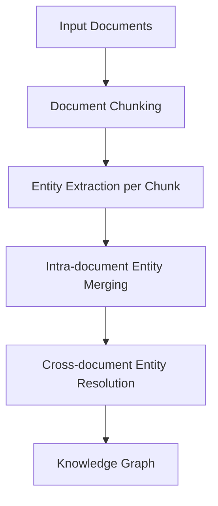
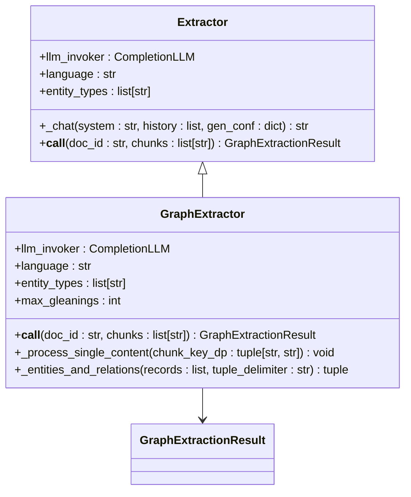
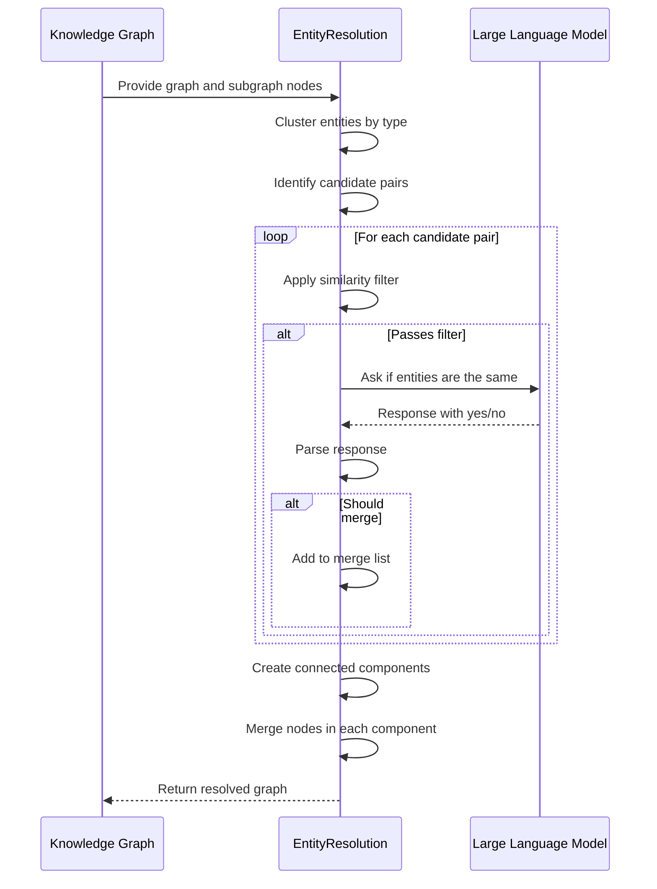
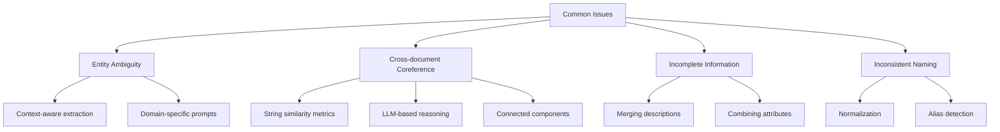
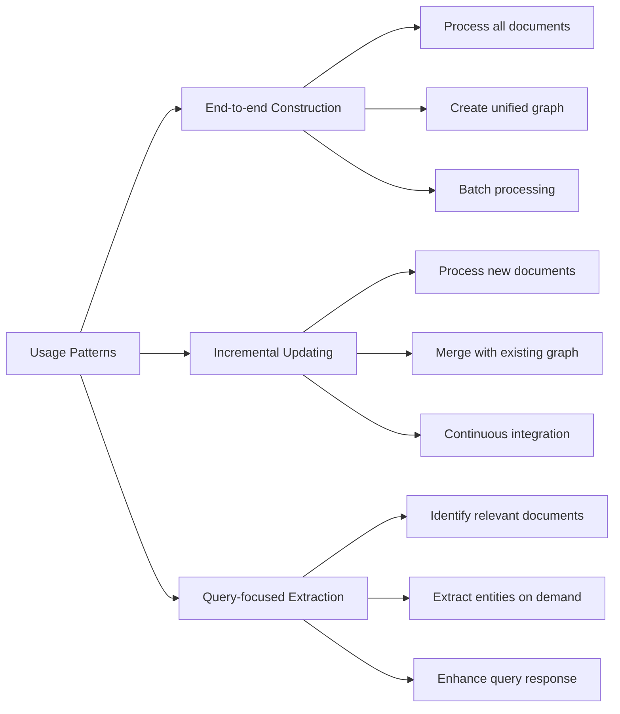

# Entity Extraction

<cite>
**Referenced Files in This Document**   
- [graph_extractor.py](file://graphrag/general/graph_extractor.py)
- [entity_resolution.py](file://graphrag/entity_resolution.py)
- [extractor.py](file://graphrag/general/extractor.py)
- [entity_resolution_prompt.py](file://graphrag/entity_resolution_prompt.py)
- [utils.py](file://graphrag/utils.py)
- [search.py](file://graphrag/search.py)
- [knowledge-graph.tsx](file://web/src/pages/dataset/dataset-setting/configuration/knowledge-graph.tsx)
- [entity-types-item.tsx](file://web/src/components/entity-types-item.tsx)
- [construct_knowledge_graph.md](file://docs/guides/dataset/construct_knowledge_graph.md)
- [knowledgebase_service.py](file://api/db/services/knowledgebase_service.py)
</cite>

## Table of Contents
1. [Introduction](#introduction)
2. [Entity Extraction Pipeline](#entity-extraction-pipeline)
3. [Graph Extractor Component](#graph-extractor-component)
4. [Entity Resolution Process](#entity-resolution-process)
5. [Configuration Options](#configuration-options)
6. [Common Issues and Solutions](#common-issues-and-solutions)
7. [Usage Patterns](#usage-patterns)
8. [Conclusion](#conclusion)

## Introduction

The entity extraction feature in RAGFlow's knowledge graph integration provides a comprehensive system for identifying, linking, and resolving entities from text documents. This system transforms unstructured text into structured knowledge graphs by extracting named entities, establishing relationships between them, and resolving entity duplicates across documents. The implementation follows a multi-stage pipeline that combines rule-based processing with large language model (LLM) inference to achieve high accuracy in entity recognition and disambiguation.

The core functionality revolves around two main components: the graph extractor for initial entity and relationship extraction, and the entity resolution system for merging duplicate entities across documents. These components work together to create a coherent knowledge graph from potentially fragmented information across multiple documents, addressing challenges like entity ambiguity, cross-document coreference, and inconsistent naming.

**Section sources**
- [construct_knowledge_graph.md](file://docs/guides/dataset/construct_knowledge_graph.md#L63-L94)

## Entity Extraction Pipeline

The entity extraction pipeline in RAGFlow follows a systematic process to transform raw text into a structured knowledge graph. The pipeline begins with document preprocessing, where input documents are chunked into manageable segments for processing. Each chunk is then processed by the graph extractor component, which identifies entities and their relationships using a combination of pattern matching and LLM inference.

The extraction process follows a multi-step approach with iterative refinement. Initially, the system extracts entities and relationships from each text chunk independently. The graph extractor uses prompt engineering to guide the LLM in identifying entities of specified types (such as organization, person, geo, event, and category) and their relationships. After initial extraction, the system performs entity merging within each document to consolidate duplicate references to the same entity.

The final stage involves cross-document entity resolution, where entities identified across different documents are compared and merged when they represent the same real-world entity. This process uses both string similarity metrics and domain knowledge to determine whether different entity mentions should be resolved to the same node in the knowledge graph. The result is a unified knowledge graph that integrates information from all processed documents while eliminating redundancy.



**Diagram sources **
- [graph_extractor.py](file://graphrag/general/graph_extractor.py#L110-L150)
- [entity_resolution.py](file://graphrag/entity_resolution.py#L69-L157)

## Graph Extractor Component

The GraphExtractor class serves as the primary component for extracting entities and relationships from text. This component is implemented in both general and light variants, with the general version providing more sophisticated extraction capabilities. The extractor operates by processing text chunks through a series of LLM calls, using carefully designed prompts to guide the extraction process.

The extraction process begins with an initial prompt that instructs the LLM to identify entities and their relationships in the input text. The system then performs iterative "gleaning" to ensure comprehensive extraction, making additional LLM calls to find entities and relationships that may have been missed in previous iterations. This iterative approach continues until the LLM indicates no more entities can be found or until a maximum number of gleanings is reached.

The extractor identifies two main types of information: nodes (entities) and edges (relationships). For each entity, it extracts the entity name, type, and description based on the information present in the text. For relationships, it identifies pairs of related entities along with a description of their relationship. The extracted information is formatted using specific delimiters to enable reliable parsing of the LLM output.



**Diagram sources **
- [graph_extractor.py](file://graphrag/general/graph_extractor.py#L34-L150)
- [extractor.py](file://graphrag/general/extractor.py#L51-L200)

**Section sources**
- [graph_extractor.py](file://graphrag/general/graph_extractor.py#L34-L150)
- [extractor.py](file://graphrag/general/extractor.py#L51-L200)

## Entity Resolution Process

The entity resolution process in RAGFlow addresses the challenge of identifying when different entity mentions in the text refer to the same real-world entity. This is particularly important when processing multiple documents that may refer to the same entities using different names or variations. The EntityResolution class implements a sophisticated approach to this problem, combining string similarity metrics with LLM-based reasoning.

The resolution process begins by clustering entities by their type, as entities of different types cannot be the same. Within each type cluster, the system identifies candidate pairs of entities that might represent the same real-world entity. The similarity assessment uses different strategies depending on the language of the entity names. For English entities, it uses edit distance with a threshold based on the length of the names. For non-English entities, it uses set intersection of characters with a high similarity threshold.

For candidate pairs that pass the initial similarity filter, the system employs an LLM to make the final determination. The LLM is presented with a carefully crafted prompt that asks whether two entities are the same, providing domain-specific guidance on what factors to consider. The LLM's response is parsed to determine whether the entities should be merged. This hybrid approach combines the efficiency of rule-based filtering with the nuanced understanding of LLMs to achieve high accuracy in entity resolution.



**Diagram sources **
- [entity_resolution.py](file://graphrag/entity_resolution.py#L69-L157)
- [entity_resolution_prompt.py](file://graphrag/entity_resolution_prompt.py#L17-L74)

**Section sources**
- [entity_resolution.py](file://graphrag/entity_resolution.py#L47-L257)
- [entity_resolution_prompt.py](file://graphrag/entity_resolution_prompt.py#L17-L74)

## Configuration Options

RAGFlow provides several configuration options to customize the entity extraction process according to specific use cases and requirements. These options can be set through the user interface or API and control various aspects of the extraction and resolution process.

The primary configuration option is the entity types list, which specifies the types of entities to extract from the text. By default, the system looks for organizations, persons, geographical locations, events, and categories, but users can customize this list to focus on domain-specific entity types. This allows the system to be adapted to different domains, such as medical literature (where entity types might include diseases, treatments, and symptoms) or financial documents (where entity types might include companies, financial instruments, and economic indicators).

Additional configuration options include extraction thresholds and resolution parameters. The max_gleanings parameter controls how many times the system will iterate to find additional entities, with higher values potentially finding more entities but at the cost of increased processing time and LLM usage. The entity resolution process includes configurable delimiters for formatting the LLM prompts and responses, allowing adaptation to different LLM output formats.

```mermaid
flowchart TD
A[Configuration Options] --> B[Entity Types]
A --> C[Max Gleanings]
A --> D[Resolution Thresholds]
A --> E[Delimiters]
B --> F[organization]
B --> G[person]
B --> H[geo]
B --> I[event]
B --> J[category]
B --> K[Custom Types]
C --> L[Default: 2]
C --> M[Higher: More thorough]
C --> N[Lower: Faster]
D --> O[String similarity]
D --> P[Domain knowledge]
E --> Q[Tuple delimiter: <|>]
E --> R[Record delimiter: ##]
E --> S[Completion delimiter: <|COMPLETE|>]
```

**Diagram sources **
- [knowledge-graph.tsx](file://web/src/pages/dataset/dataset-setting/configuration/knowledge-graph.tsx#L1-L15)
- [entity-types-item.tsx](file://web/src/components/entity-types-item.tsx#L5-L11)

**Section sources**
- [knowledge-graph.tsx](file://web/src/pages/dataset/dataset-setting/configuration/knowledge-graph.tsx#L1-L15)
- [entity-types-item.tsx](file://web/src/components/entity-types-item.tsx#L1-L33)

## Common Issues and Solutions

The entity extraction system in RAGFlow addresses several common challenges in natural language processing and knowledge graph construction. One of the primary challenges is entity ambiguity, where the same name refers to different entities (e.g., "Apple" as a fruit vs. "Apple" as a company). The system mitigates this through context-aware extraction, where the LLM considers the surrounding text when identifying and describing entities.

Cross-document coreference is another significant challenge, where different documents refer to the same entity using different names or variations (e.g., "New York City," "NYC," and "The Big Apple"). The entity resolution component specifically addresses this issue by comparing entity names and descriptions across documents and using both string similarity and semantic understanding to determine when different mentions refer to the same entity.

The system also handles the challenge of incomplete or inconsistent information across documents. When merging entities, the system combines descriptions and attributes from all references, creating a more comprehensive representation of the entity. This is particularly valuable when different documents provide complementary information about the same entity. The resolution process also handles cases where one document provides detailed information about an entity while another only mentions it in passing.



**Diagram sources **
- [entity_resolution.py](file://graphrag/entity_resolution.py#L241-L255)
- [utils.py](file://graphrag/utils.py#L195-L225)

**Section sources**
- [entity_resolution.py](file://graphrag/entity_resolution.py#L231-L255)
- [utils.py](file://graphrag/utils.py#L195-L225)

## Usage Patterns

The entity extraction components in RAGFlow can be used in various patterns depending on the specific requirements of the application. The most common pattern is the end-to-end knowledge graph construction, where the system processes a collection of documents to create a comprehensive knowledge graph that integrates information across all documents.

Another usage pattern is incremental knowledge graph updating, where new documents are processed and their extracted entities and relationships are merged with an existing knowledge graph. This pattern is useful for applications that need to continuously incorporate new information while maintaining a coherent knowledge base. The entity resolution component plays a crucial role in this pattern, ensuring that new entity mentions are properly linked to existing entities when appropriate.

The components can also be used in a query-focused pattern, where entity extraction is performed on demand for specific documents or text passages related to a user query. This pattern is more resource-efficient when only a subset of the knowledge base is relevant to the current task. In this mode, the system can extract entities from the most relevant documents and use them to enhance the response to the user's query.



**Diagram sources **
- [knowledgebase_service.py](file://api/db/services/knowledgebase_service.py#L85-L117)
- [search.py](file://graphrag/search.py#L142-L200)

**Section sources**
- [knowledgebase_service.py](file://api/db/services/knowledgebase_service.py#L85-L117)
- [search.py](file://graphrag/search.py#L142-L200)

## Conclusion

The entity extraction feature in RAGFlow's knowledge graph integration provides a robust and flexible system for transforming unstructured text into structured knowledge. By combining rule-based processing with large language model inference, the system achieves high accuracy in identifying entities and their relationships while effectively resolving duplicates across documents.

The modular design of the extraction pipeline allows for customization and extension to meet specific use case requirements. The configuration options enable users to tailor the system to their domain, while the sophisticated entity resolution process ensures the creation of a coherent and non-redundant knowledge graph. The system effectively addresses common challenges in natural language processing, including entity ambiguity, cross-document coreference, and inconsistent naming.

For developers and users, the entity extraction system provides a powerful tool for knowledge discovery and information retrieval. Whether used for end-to-end knowledge graph construction, incremental updating, or query-focused extraction, the system enhances the ability to extract insights from large collections of documents. As the system continues to evolve, further improvements in accuracy, efficiency, and usability can be expected, making it an increasingly valuable component of the RAGFlow platform.