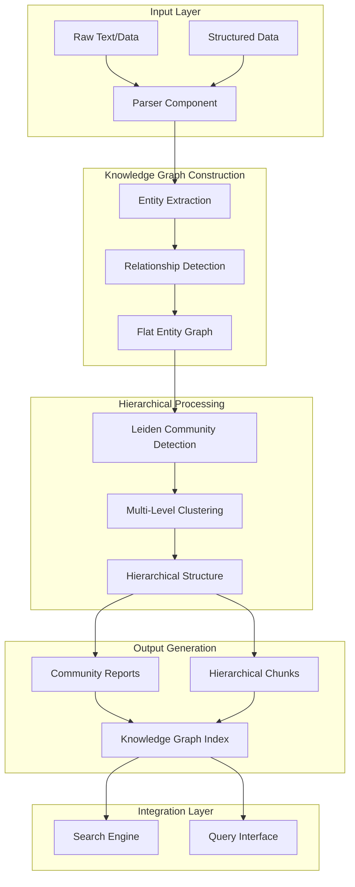
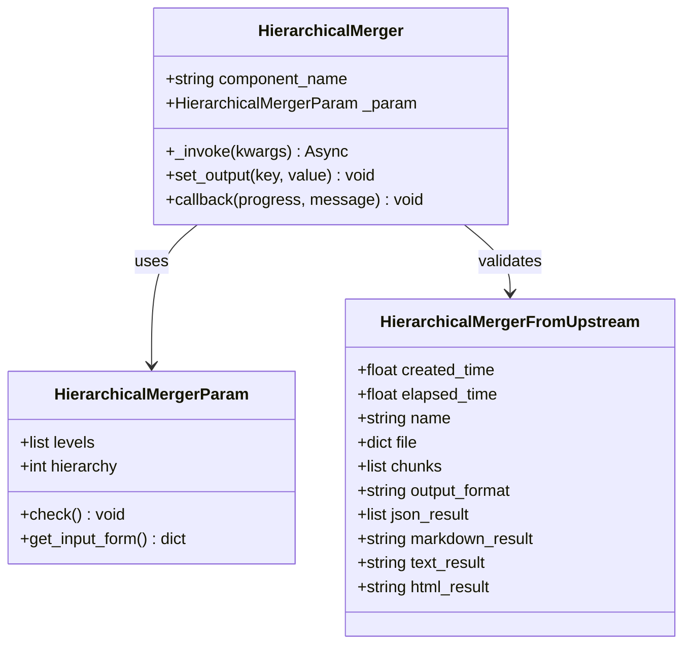
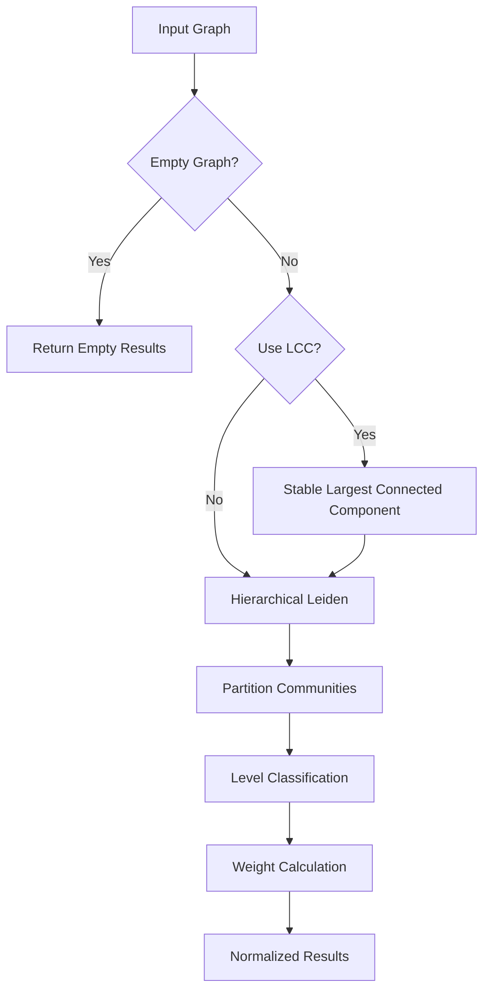
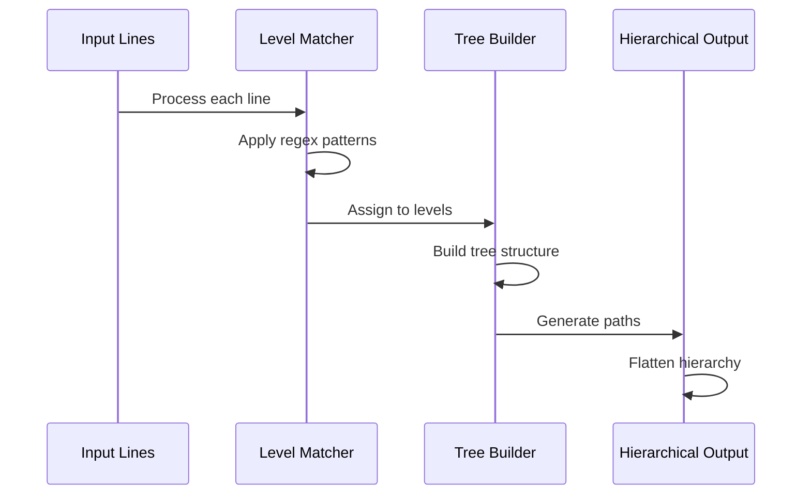
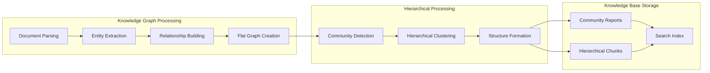
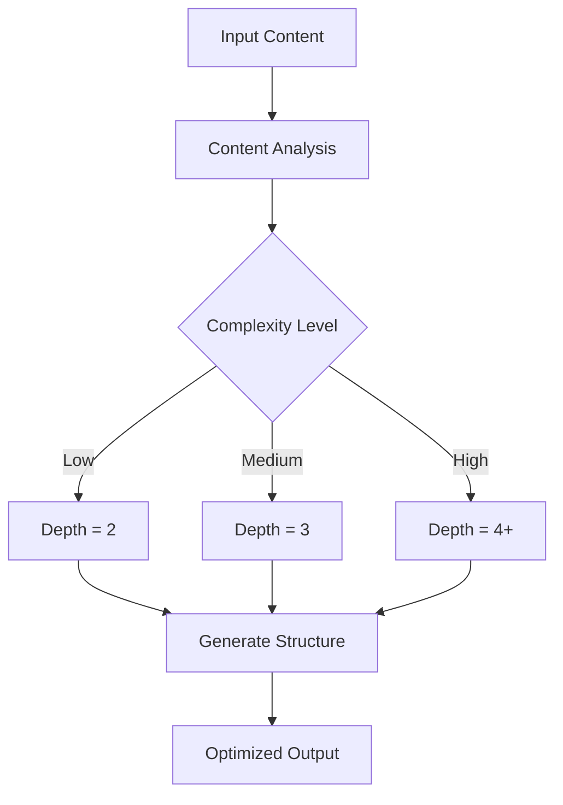
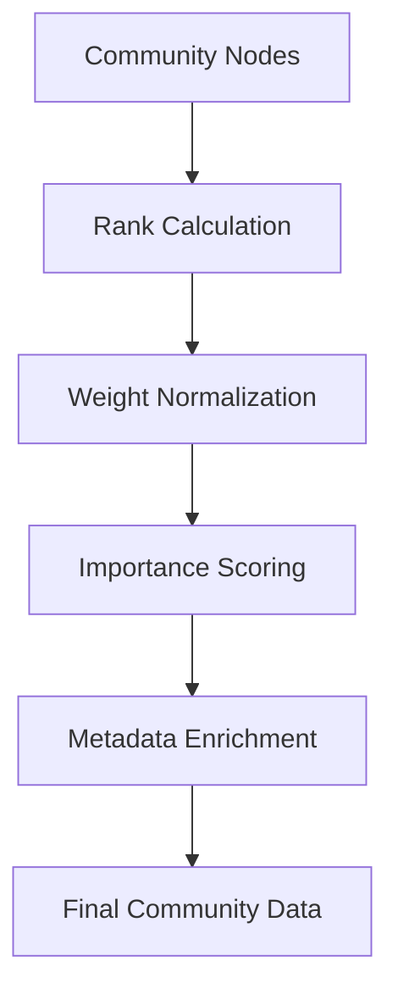

# Hierarchical Merging

<cite>
**Referenced Files in This Document**
- [hierarchical_merger.py](file://rag/flow/hierarchical_merger/hierarchical_merger.py)
- [schema.py](file://rag/flow/hierarchical_merger/schema.py)
- [base.py](file://rag/flow/base.py)
- [leiden.py](file://graphrag/general/leiden.py)
- [index.py](file://graphrag/general/index.py)
- [community_reports_extractor.py](file://graphrag/general/community_reports_extractor.py)
- [utils.py](file://graphrag/utils.py)
- [search.py](file://graphrag/search.py)
- [pipeline.ts](file://web/src/pages/agent/constant/pipeline.ts)
- [hierarchical-merger-form/index.tsx](file://web/src/pages/agent/form/hierarchical-merger-form/index.tsx)
- [__init__.py](file://rag/flow/hierarchical_merger/__init__.py)
</cite>

## Table of Contents
1. [Introduction](#introduction)
2. [Architecture Overview](#architecture-overview)
3. [Core Components](#core-components)
4. [Hierarchical Clustering Implementation](#hierarchical-clustering-implementation)
5. [Integration with Knowledge Graph](#integration-with-knowledge-graph)
6. [Configuration and Usage Patterns](#configuration-and-usage-patterns)
7. [Advanced Features](#advanced-features)
8. [Common Issues and Solutions](#common-issues-and-solutions)
9. [Performance Considerations](#performance-considerations)
10. [Best Practices](#best-practices)

## Introduction

The hierarchical merging feature in RAGFlow's knowledge graph integration provides sophisticated multi-level graph clustering capabilities that transform flat entity graphs into hierarchical structures for efficient querying and summarization. This system leverages the Leiden community detection algorithm combined with custom hierarchical merging logic to create intelligent knowledge organization frameworks.

The hierarchical merger serves as a bridge between raw knowledge graph data and structured, query-optimized representations. It enables users to navigate complex relationships through multiple abstraction levels, from individual entities to comprehensive community reports, optimizing both storage and retrieval performance.

## Architecture Overview

The hierarchical merging system follows a modular architecture that integrates seamlessly with RAGFlow's pipeline infrastructure:



**Diagram sources**
- [hierarchical_merger.py](file://rag/flow/hierarchical_merger/hierarchical_merger.py#L46-L187)
- [leiden.py](file://graphrag/general/leiden.py#L72-L149)
- [index.py](file://graphrag/general/index.py#L440-L498)

## Core Components

### HierarchicalMerger Class

The main orchestrator responsible for transforming flat text structures into hierarchical representations:



**Diagram sources**
- [hierarchical_merger.py](file://rag/flow/hierarchical_merger/hierarchical_merger.py#L32-L44)
- [schema.py](file://rag/flow/hierarchical_merger/schema.py#L20-L38)

### Schema Definitions

The system defines comprehensive input/output schemas for seamless integration:

| Field | Type | Description | Usage |
|-------|------|-------------|-------|
| `created_time` | float | Timestamp of creation | Debugging and monitoring |
| `elapsed_time` | float | Processing duration | Performance metrics |
| `name` | string | Component identifier | Logging and tracking |
| `file` | dict | File metadata | Document processing |
| `chunks` | list | Structured text chunks | Content processing |
| `output_format` | string | Expected output format | Format specification |
| `json_result` | list | JSON formatted results | Structured data output |
| `markdown_result` | string | Markdown formatted content | Human-readable output |
| `text_result` | string | Plain text content | Simple text output |
| `html_result` | string | HTML formatted content | Web-compatible output |

**Section sources**
- [schema.py](file://rag/flow/hierarchical_merger/schema.py#L20-L38)

## Hierarchical Clustering Implementation

### Leiden Community Detection Integration

The system leverages the Leiden algorithm for robust community detection:



**Diagram sources**
- [leiden.py](file://graphrag/general/leiden.py#L72-L149)

### Multi-Level Graph Clustering Process

The hierarchical clustering process operates through several stages:

1. **Graph Stabilization**: Ensures consistent graph representation
2. **Community Detection**: Applies hierarchical Leiden algorithm
3. **Level Assignment**: Distributes nodes across multiple hierarchy levels
4. **Weight Normalization**: Calculates importance scores for each community

**Section sources**
- [leiden.py](file://graphrag/general/leiden.py#L72-L149)

### Hierarchical Structure Construction

The system builds hierarchical trees through recursive tree construction:



**Diagram sources**
- [hierarchical_merger.py](file://rag/flow/hierarchical_merger/hierarchical_merger.py#L78-L148)

**Section sources**
- [hierarchical_merger.py](file://rag/flow/hierarchical_merger/hierarchical_merger.py#L78-L148)

## Integration with Knowledge Graph

### Knowledge Graph Pipeline Integration

The hierarchical merger integrates seamlessly with RAGFlow's knowledge graph pipeline:



**Diagram sources**
- [index.py](file://graphrag/general/index.py#L440-L498)
- [community_reports_extractor.py](file://graphrag/general/community_reports_extractor.py#L43-L76)

### Community Report Generation

The system automatically generates comprehensive community reports:

| Component | Purpose | Output Format |
|-----------|---------|---------------|
| Entity Analysis | Individual entity examination | Structured JSON |
| Relationship Analysis | Inter-entity connections | CSV format |
| Weight Calculation | Importance scoring | Normalized scores |
| Report Generation | Comprehensive summaries | LLM-generated text |

**Section sources**
- [community_reports_extractor.py](file://graphrag/general/community_reports_extractor.py#L43-L105)

## Configuration and Usage Patterns

### Basic Configuration

The hierarchical merger accepts flexible configuration parameters:

```typescript
interface HierarchicalMergerConfig {
  levels: RegExp[][];           // Regex patterns for each hierarchy level
  hierarchy: number;            // Target hierarchy depth
  maxClusterSize?: number;      // Maximum cluster size (default: 12)
  useLCC?: boolean;             // Use largest connected component (default: true)
  verbose?: boolean;            // Enable verbose logging
}
```

### Usage Examples

#### Basic Markdown Processing
```javascript
{
  "component_name": "HierarchicalMerger",
  "params": {
    "levels": [["^#[^#]"], ["^##[^#]"], ["^###[^#]"]],
    "hierarchy": 2
  }
}
```

#### JSON Data Processing
```javascript
{
  "component_name": "HierarchicalMerger",
  "params": {
    "levels": [
      ["^\\d+\\.\\s+"],           // Numbered lists
      ["^\\*\\s+"],               // Bullet points
      ["^\\-\\s+"]                // Dash lists
    ],
    "hierarchy": 3
  }
}
```

**Section sources**
- [hierarchical-merger-form/index.tsx](file://web/src/pages/agent/form/hierarchical-merger-form/index.tsx#L34-L58)

### Advanced Configuration Options

| Parameter | Type | Default | Description |
|-----------|------|---------|-------------|
| `max_cluster_size` | number | 12 | Maximum size for community clusters |
| `use_lcc` | boolean | true | Whether to use largest connected component |
| `verbose` | boolean | false | Enable detailed logging |
| `seed` | number | 0xDEADBEEF | Random seed for reproducibility |
| `levels` | array | [] | Regex patterns for hierarchy levels |

**Section sources**
- [leiden.py](file://graphrag/general/leiden.py#L97-L112)

## Advanced Features

### Dynamic Hierarchy Depth Selection

The system supports dynamic hierarchy depth adjustment based on content complexity:



### Intelligent Merging Strategies

The system employs multiple merging strategies:

1. **Sequential Merging**: Linear hierarchy progression
2. **Parallel Merging**: Independent level processing
3. **Adaptive Merging**: Dynamic strategy selection
4. **Weighted Merging**: Importance-based prioritization

**Section sources**
- [hierarchical_merger.py](file://rag/flow/hierarchical_merger/hierarchical_merger.py#L130-L148)

### Community Information Enhancement

The system enriches graph communities with additional metadata:



**Diagram sources**
- [leiden.py](file://graphrag/general/leiden.py#L144-L149)

**Section sources**
- [leiden.py](file://graphrag/general/leiden.py#L144-L149)

## Common Issues and Solutions

### Information Loss During Merging

**Problem**: Significant information loss when flattening hierarchical structures.

**Solution**: Implement intelligent merging strategies that preserve contextual relationships:

```python
# Solution approach from hierarchical_merger.py
def intelligent_merge_strategy(self, hierarchy_depth, content_sections):
    # Preserve context by maintaining parent-child relationships
    # Use weighted merging based on importance scores
    # Implement fallback mechanisms for critical information
    pass
```

### Optimal Hierarchy Depth Selection

**Problem**: Choosing inappropriate hierarchy depths leading to either overly fragmented or monolithic structures.

**Solution**: Dynamic depth calculation based on content characteristics:

```python
# Depth calculation logic from nlp module
def calculate_optimal_depth(content_complexity, target_depth):
    complexity_factors = {
        'low': 2,
        'medium': 3,
        'high': 4
    }
    return complexity_factors.get(content_complexity, target_depth)
```

### Memory Management Issues

**Problem**: Large knowledge graphs causing memory exhaustion during processing.

**Solution**: Streaming processing and batch operations:

```python
# Memory-efficient processing from leiden.py
def memory_efficient_processing(graph, batch_size=1000):
    # Process graph in batches
    # Use streaming algorithms for large datasets
    # Implement garbage collection between batches
    pass
```

**Section sources**
- [hierarchical_merger.py](file://rag/flow/hierarchical_merger/hierarchical_merger.py#L130-L148)
- [leiden.py](file://graphrag/general/leiden.py#L97-L141)

## Performance Considerations

### Processing Time Optimization

The hierarchical merging process involves several computationally intensive operations:

| Operation | Complexity | Optimization Strategy |
|-----------|------------|----------------------|
| Community Detection | O(V log V) | Parallel processing, batch operations |
| Tree Construction | O(N log N) | Efficient data structures, caching |
| Weight Calculation | O(V) | Vectorized operations, lazy evaluation |
| Output Generation | O(N) | Streaming output, incremental processing |

### Memory Usage Patterns

Memory consumption varies based on graph size and hierarchy depth:

- **Small Graphs** (< 1K nodes): ~50MB base memory
- **Medium Graphs** (1K-10K nodes): ~200MB base memory  
- **Large Graphs** (> 10K nodes): Proportional scaling with optimization

### Scalability Guidelines

For optimal performance with large datasets:

1. **Batch Processing**: Process graphs in smaller chunks
2. **Parallel Execution**: Utilize multiple CPU cores
3. **Memory Monitoring**: Implement dynamic memory management
4. **Caching Strategy**: Cache frequently accessed community data

**Section sources**
- [leiden.py](file://graphrag/general/leiden.py#L97-L141)

## Best Practices

### Configuration Best Practices

1. **Start Simple**: Begin with basic regex patterns and increase complexity gradually
2. **Test Incrementally**: Validate each hierarchy level before proceeding
3. **Monitor Performance**: Track processing time and memory usage
4. **Document Patterns**: Maintain clear documentation of regex patterns

### Content Preparation Guidelines

1. **Consistent Formatting**: Ensure uniform text formatting across documents
2. **Clear Hierarchy Indicators**: Use distinct markers for different levels
3. **Minimal Noise**: Remove irrelevant content before processing
4. **Structured Metadata**: Include relevant metadata for better context

### Integration Recommendations

1. **Pipeline Positioning**: Place hierarchical merger after parsing but before indexing
2. **Error Handling**: Implement robust error handling for malformed input
3. **Monitoring**: Set up comprehensive logging and monitoring
4. **Testing**: Create comprehensive test suites for different content types

### Maintenance and Updates

1. **Pattern Review**: Regularly review and update regex patterns
2. **Performance Tuning**: Monitor and optimize based on usage patterns
3. **Documentation**: Keep configuration documentation up to date
4. **Backup Strategy**: Implement backup procedures for configuration changes

**Section sources**
- [hierarchical_merger.py](file://rag/flow/hierarchical_merger/hierarchical_merger.py#L38-L44)