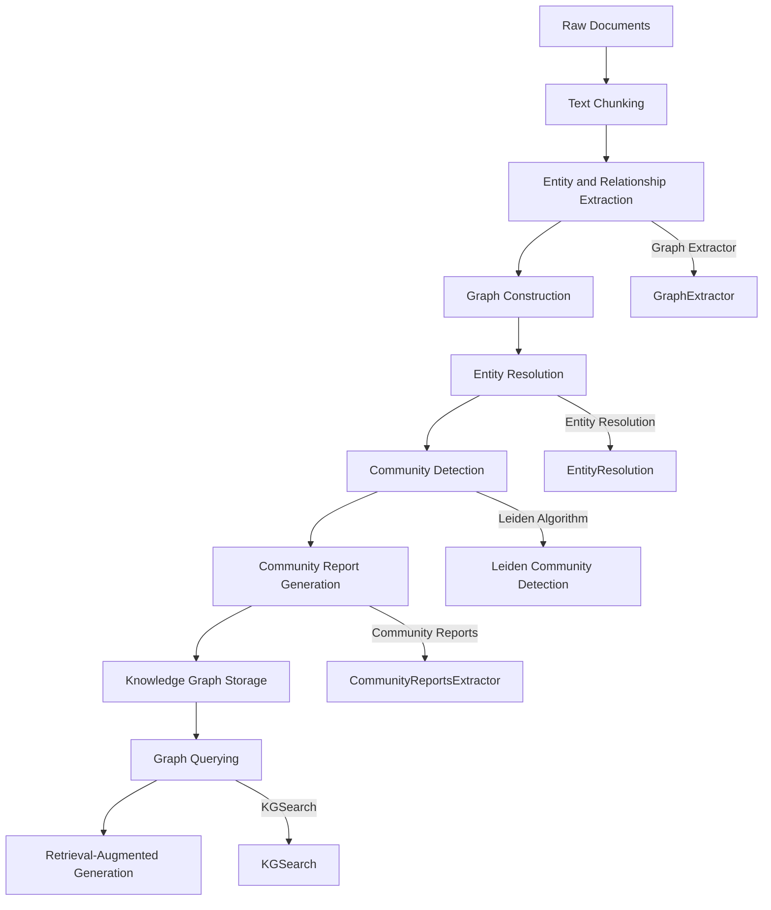
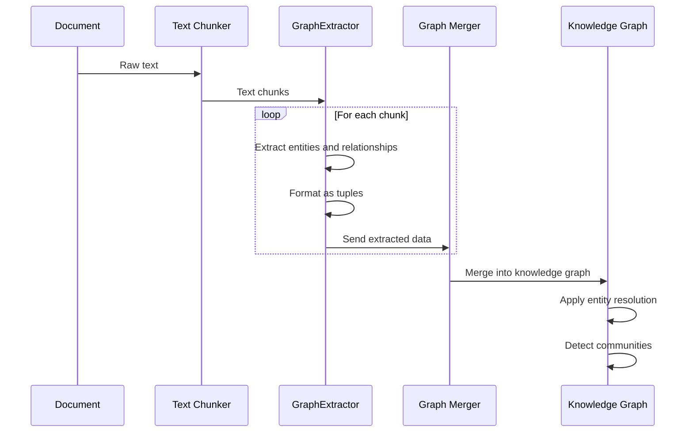
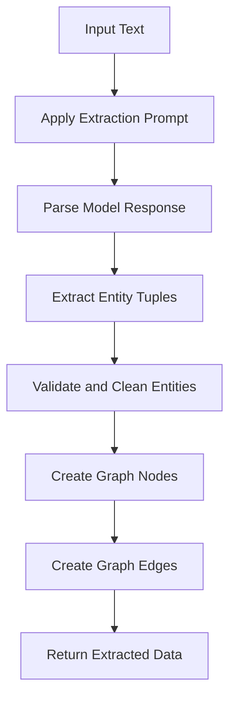
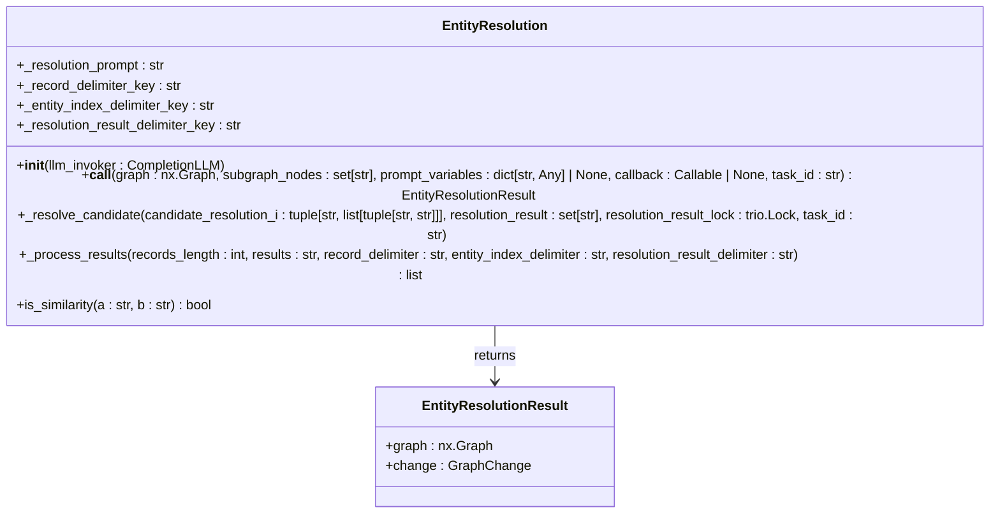
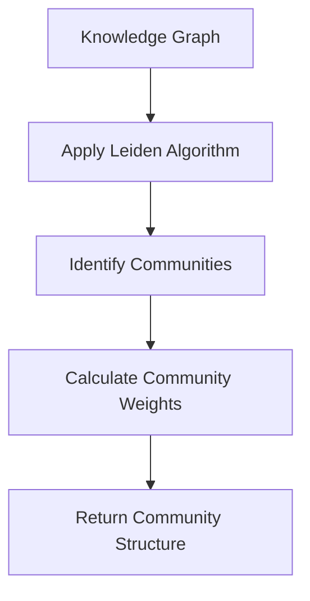
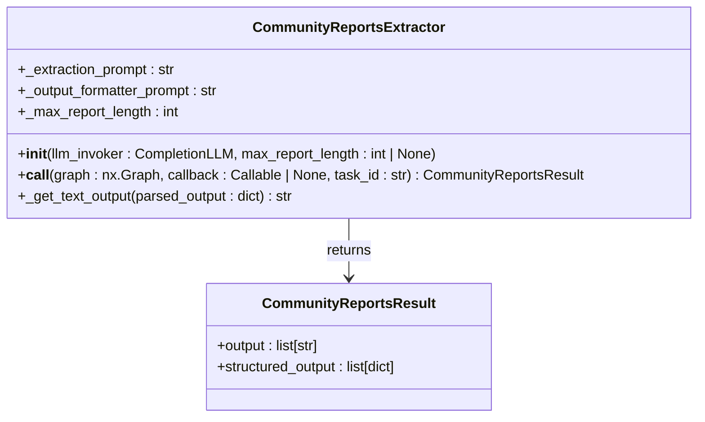
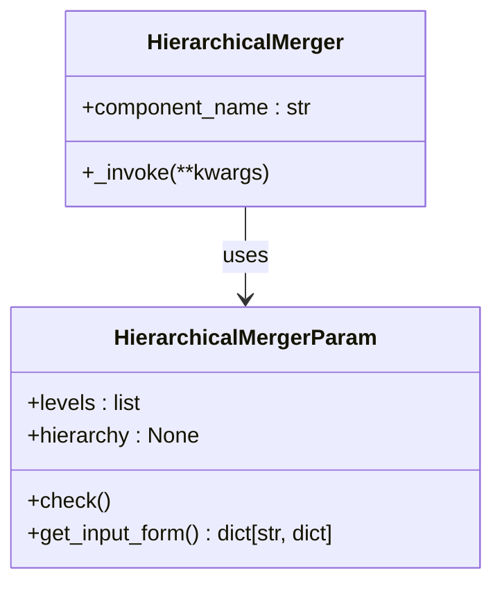
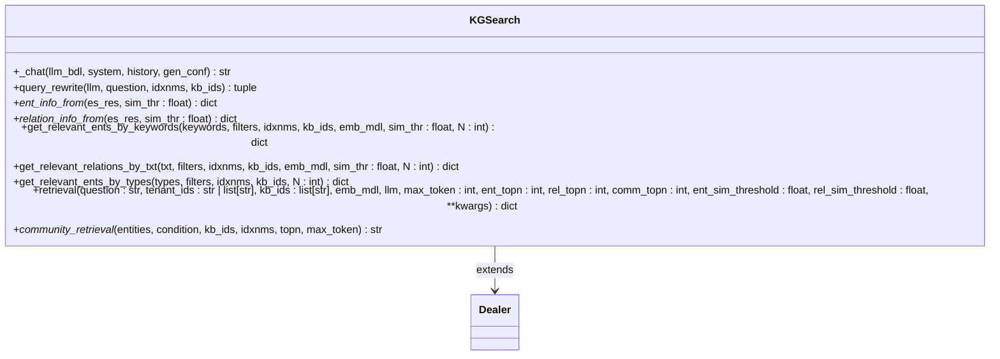

# Knowledge Graph Integration

<cite>
**Referenced Files in This Document**   
- [graph_extractor.py](file://graphrag/general/graph_extractor.py)
- [extractor.py](file://graphrag/general/extractor.py)
- [community_reports_extractor.py](file://graphrag/general/community_reports_extractor.py)
- [community_report_prompt.py](file://graphrag/general/community_report_prompt.py)
- [entity_resolution.py](file://graphrag/entity_resolution.py)
- [entity_resolution_prompt.py](file://graphrag/entity_resolution_prompt.py)
- [search.py](file://graphrag/search.py)
- [utils.py](file://graphrag/utils.py)
- [leiden.py](file://graphrag/general/leiden.py)
- [hierarchical_merger.py](file://rag/flow/hierarchical_merger/hierarchical_merger.py)
- [index.py](file://graphrag/general/index.py)
- [knowledge-graph.tsx](file://web/src/pages/dataset/dataset-setting/configuration/knowledge-graph.tsx)
- [pipeline.py](file://rag/flow/pipeline.py)
</cite>

## Table of Contents
1. [Introduction](#introduction)
2. [Knowledge Graph Architecture](#knowledge-graph-architecture)
3. [Graph Construction Process](#graph-construction-process)
4. [Entity Extraction and Resolution](#entity-extraction-and-resolution)
5. [Community Detection and Reporting](#community-detection-and-reporting)
6. [Hierarchical Merger Component](#hierarchical-merger-component)
7. [Knowledge Graph Querying](#knowledge-graph-querying)
8. [Configuration Options](#configuration-options)
9. [Common Issues and Solutions](#common-issues-and-solutions)
10. [Conclusion](#conclusion)

## Introduction

RAGFlow's knowledge graph integration feature provides a sophisticated framework for extracting, organizing, and querying structured information from unstructured text. This system transforms raw documents into a rich knowledge graph that captures entities, relationships, and community structures, enabling more effective retrieval-augmented generation (RAG). The knowledge graph architecture combines entity extraction, relationship identification, entity resolution, community detection, and hierarchical organization to create a comprehensive representation of the information contained in documents.

The implementation draws inspiration from Microsoft's GraphRAG and LightRAG frameworks, adapting their approaches to entity extraction, community detection, and graph-based retrieval. The system is designed to handle complex document collections by identifying key entities, resolving entity variations, detecting meaningful communities of related entities, and generating comprehensive community reports that summarize the key insights within each community.

This documentation provides a detailed explanation of the knowledge graph integration feature, covering the implementation of graph-based RAG capabilities including community reports, entity extraction, and hierarchical merging of information. It documents the interfaces and usage patterns of the graph extractor and hierarchical merger components, including their domain models and invocation relationships. The document also includes information about configuration options, return values, and solutions to common issues like graph consistency and query performance.

**Section sources**
- [graph_extractor.py](file://graphrag/general/graph_extractor.py#L1-L151)
- [community_reports_extractor.py](file://graphrag/general/community_reports_extractor.py#L1-L180)
- [entity_resolution.py](file://graphrag/entity_resolution.py#L1-L257)

## Knowledge Graph Architecture

The knowledge graph system in RAGFlow follows a multi-stage processing pipeline that transforms raw text into a structured knowledge graph. The architecture consists of several interconnected components that handle different aspects of knowledge graph construction and querying.

**Diagram sources**
- [graph_extractor.py](file://graphrag/general/graph_extractor.py#L34-L151)
- [entity_resolution.py](file://graphrag/entity_resolution.py#L47-L257)
- [leiden.py](file://graphrag/general/leiden.py#L72-L141)
- [community_reports_extractor.py](file://graphrag/general/community_reports_extractor.py#L38-L159)
- [search.py](file://graphrag/search.py#L35-L340)

The core architecture follows a pipeline approach where documents are processed through sequential stages:

1. **Text Processing**: Documents are first chunked into manageable segments for processing.
2. **Entity and Relationship Extraction**: The GraphExtractor component identifies entities and relationships within each text chunk.
3. **Graph Construction**: Extracted entities and relationships are merged into a unified knowledge graph.
4. **Entity Resolution**: The EntityResolution component identifies and merges duplicate entities across different chunks.
5. **Community Detection**: The Leiden algorithm detects communities of closely related entities within the graph.
6. **Community Report Generation**: The CommunityReportsExtractor generates comprehensive reports summarizing each detected community.
7. **Storage**: The constructed knowledge graph and community reports are stored in the document store.
8. **Querying**: The KGSearch component enables querying the knowledge graph for retrieval-augmented generation.

Each component in this architecture is designed to be modular and can be configured independently, allowing users to customize the knowledge graph construction process according to their specific requirements.

**Section sources**
- [graph_extractor.py](file://graphrag/general/graph_extractor.py#L34-L151)
- [entity_resolution.py](file://graphrag/entity_resolution.py#L47-L257)
- [leiden.py](file://graphrag/general/leiden.py#L72-L141)
- [community_reports_extractor.py](file://graphrag/general/community_reports_extractor.py#L38-L159)
- [search.py](file://graphrag/search.py#L35-L340)

## Graph Construction Process

The graph construction process in RAGFlow follows a systematic approach to transform raw text into a structured knowledge graph. This process begins with the GraphExtractor component, which is responsible for identifying entities and relationships within text chunks.

**Diagram sources**
- [graph_extractor.py](file://graphrag/general/graph_extractor.py#L100-L151)
- [utils.py](file://graphrag/utils.py#L195-L225)
- [index.py](file://graphrag/general/index.py#L460-L498)

The GraphExtractor class (defined in `graph_extractor.py`) implements the entity and relationship extraction process. It uses a language model to analyze text chunks and extract structured information in the form of entity-relationship tuples. The extraction process follows these steps:

1. The input text is processed through a prompt that guides the language model to identify entities and relationships.
2. The model output is parsed to extract entity-relationship tuples in a standardized format.
3. Each tuple is processed to create nodes (entities) and edges (relationships) in the graph.
4. The extracted entities and relationships are merged into the growing knowledge graph.

The extraction process supports multiple rounds of "gleaning" to maximize entity coverage. After the initial extraction, the system prompts the language model to continue extracting additional entities and relationships from the same text chunk. This iterative approach helps ensure comprehensive coverage of the information contained in each chunk.

The graph construction process also handles the merging of subgraphs from different documents into a global knowledge graph. When a new document is processed, its extracted subgraph is merged with the existing global graph using the `graph_merge` function in `utils.py`. This function intelligently combines nodes and edges, preserving information from both graphs while avoiding duplication.

**Section sources**
- [graph_extractor.py](file://graphrag/general/graph_extractor.py#L100-L151)
- [utils.py](file://graphrag/utils.py#L195-L225)
- [index.py](file://graphrag/general/index.py#L460-L498)

## Entity Extraction and Resolution

The entity extraction and resolution components form a critical part of RAGFlow's knowledge graph system, ensuring that entities are accurately identified and consistently represented across the graph.

### Entity Extraction

The entity extraction process is implemented in the `extract_all` function within `extractor.py`. This function processes text chunks to identify entities and their relationships:

**Diagram sources**
- [extractor.py](file://graphrag/general/extractor.py#L153-L180)
- [utils.py](file://graphrag/utils.py#L232-L251)

The extraction process uses a structured prompt to guide the language model in identifying entities and relationships. The prompt specifies the expected format for the output, which includes entity names, types, descriptions, and relationships between entities. The model response is then parsed to extract this structured information.

Key aspects of the entity extraction process include:

- **Entity Types**: The system can be configured to extract specific types of entities (e.g., persons, organizations, locations).
- **Relationship Extraction**: In addition to entities, the system extracts relationships between entities, including the nature of the relationship and its description.
- **Source Tracking**: Each extracted entity and relationship is associated with its source document and text chunk, enabling provenance tracking.

### Entity Resolution

Entity resolution is the process of identifying and merging duplicate representations of the same entity across different text chunks. This is implemented in the `EntityResolution` class in `entity_resolution.py`:

**Diagram sources**
- [entity_resolution.py](file://graphrag/entity_resolution.py#L47-L257)
- [utils.py](file://graphrag/utils.py#L40-L46)

The entity resolution process works as follows:

1. **Candidate Identification**: The system identifies pairs of entities that might represent the same real-world entity based on their names and types.
2. **Similarity Assessment**: For each candidate pair, the system uses a language model to determine whether they represent the same entity.
3. **Merging**: When two entities are determined to be the same, they are merged into a single entity in the graph, with their descriptions and relationships combined.

The resolution process uses several techniques to improve accuracy:

- **String Similarity**: Basic string similarity measures are used as a preliminary filter.
- **Domain Knowledge**: The system leverages domain-specific knowledge to understand entity variations (e.g., "New York" and "NYC").
- **Contextual Analysis**: The language model considers the context in which entities appear to make more informed decisions.

The entity resolution process is crucial for maintaining graph consistency and preventing fragmentation of information about the same entity across multiple nodes.

**Section sources**
- [extractor.py](file://graphrag/general/extractor.py#L153-L180)
- [entity_resolution.py](file://graphrag/entity_resolution.py#L47-L257)
- [utils.py](file://graphrag/utils.py#L232-L251)

## Community Detection and Reporting

The community detection and reporting capabilities in RAGFlow enable the system to identify meaningful clusters of related entities and generate comprehensive summaries of these communities.

### Community Detection

Community detection is implemented using the Leiden algorithm, which is accessed through the `run` function in `leiden.py`. The algorithm identifies communities of closely related entities within the knowledge graph:

**Diagram sources**
- [leiden.py](file://graphrag/general/leiden.py#L95-L141)
- [community_reports_extractor.py](file://graphrag/general/community_reports_extractor.py#L61-L62)

The community detection process works as follows:

1. The Leiden algorithm analyzes the graph structure to identify densely connected subgraphs (communities).
2. Each community is assigned a weight based on the importance of its constituent entities (using metrics like degree and PageRank).
3. The community structure is returned as a dictionary mapping community levels to sets of nodes.

The Leiden algorithm is particularly well-suited for this application because it can identify hierarchical community structures and is efficient for large graphs. The algorithm parameters can be configured to control the granularity of community detection.

### Community Report Generation

Once communities are identified, the CommunityReportsExtractor generates comprehensive reports for each community. This process is implemented in the `CommunityReportsExtractor` class in `community_reports_extractor.py`:

**Diagram sources**
- [community_reports_extractor.py](file://graphrag/general/community_reports_extractor.py#L38-L159)
- [community_report_prompt.py](file://graphrag/general/community_report_prompt.py#L8-L158)

The community report generation process follows these steps:

1. For each community, the system extracts the entities and relationships within that community.
2. This information is formatted into a structured input for the language model.
3. The language model generates a comprehensive report following the template defined in `COMMUNITY_REPORT_PROMPT`.

The community report prompt (defined in `community_report_prompt.py`) specifies a detailed structure for the reports, including:

- **Title**: A concise name for the community that captures its key entities.
- **Summary**: An executive summary of the community's overall structure and significance.
- **Impact Severity Rating**: A score from 0-10 representing the importance of the community.
- **Rating Explanation**: A brief explanation of the impact rating.
- **Detailed Findings**: 5-10 key insights about the community, each with a summary and explanatory text.

The reports are designed to provide decision-makers with a comprehensive understanding of the information associated with each community and its potential impact. The grounding rules ensure that all claims in the report are supported by data from the knowledge graph, with proper references to the source entities and relationships.

The community reporting feature transforms the raw graph structure into human-readable insights, making it easier to understand the key themes and relationships within the knowledge base.

**Section sources**
- [leiden.py](file://graphrag/general/leiden.py#L95-L141)
- [community_reports_extractor.py](file://graphrag/general/community_reports_extractor.py#L38-L159)
- [community_report_prompt.py](file://graphrag/general/community_report_prompt.py#L8-L158)

## Hierarchical Merger Component

The HierarchicalMerger component in RAGFlow provides a mechanism for organizing content in a hierarchical structure, preserving the document's original organization while enabling more effective chunking for retrieval.

**Diagram sources**
- [hierarchical_merger.py](file://rag/flow/hierarchical_merger/hierarchical_merger.py#L32-L47)
- [hierarchical_merger.py](file://rag/flow/hierarchical_merger/hierarchical_merger.py#L46-L187)

The HierarchicalMerger is implemented in `hierarchical_merger.py` and works by analyzing the structure of the input text to identify hierarchical levels. The component uses regular expressions to detect section headings at different levels (e.g., "# ", "## ", "### ") and organizes the content accordingly.

Key features of the HierarchicalMerger include:

- **Configurable Levels**: Users can define regular expressions to identify different hierarchical levels in their documents.
- **Flexible Input**: The component can process input in various formats, including markdown, plain text, HTML, or pre-chunked content.
- **Hierarchical Organization**: Content is organized into a tree structure that preserves the document's original hierarchy.
- **Configurable Depth**: Users can specify how many levels of hierarchy to preserve in the final chunks.

The merging process works as follows:

1. The input content is analyzed to identify hierarchical markers (e.g., section headings).
2. A tree structure is built representing the document's hierarchy.
3. The tree is traversed to create chunks that preserve the hierarchical context.
4. For each chunk, the system includes not only the immediate content but also the relevant higher-level context.

This approach ensures that when a chunk is retrieved during a query, it includes the necessary context from higher levels of the hierarchy, improving the quality of the generated responses. For example, a paragraph about a specific feature would be chunked with its section and subsection headings, providing important context about its relationship to the broader topic.

The HierarchicalMerger is particularly useful for technical documentation, research papers, and other structured content where the hierarchical organization carries important semantic meaning.

**Section sources**
- [hierarchical_merger.py](file://rag/flow/hierarchical_merger/hierarchical_merger.py#L32-L187)

## Knowledge Graph Querying

The knowledge graph querying system in RAGFlow enables sophisticated retrieval of information from the constructed knowledge graph. This is implemented in the `KGSearch` class in `search.py`.

**Diagram sources**
- [search.py](file://graphrag/search.py#L35-L340)

The querying process follows a multi-stage approach to retrieve relevant information from the knowledge graph:

1. **Query Rewriting**: The system first analyzes the input question to identify key entities and answer types using the `query_rewrite` method.
2. **Entity Retrieval**: Relevant entities are retrieved based on keywords, types, or semantic similarity.
3. **Relationship Retrieval**: Relevant relationships are retrieved based on the query text.
4. **Community Retrieval**: Community reports related to the query are retrieved.
5. **Result Compilation**: The retrieved information is compiled into a structured format for use in retrieval-augmented generation.

The `retrieval` method is the main entry point for knowledge graph queries. It takes a question and returns a structured result containing:

- **Entities**: The most relevant entities mentioned in the query or related to it.
- **Relationships**: The most relevant relationships between entities.
- **Community Reports**: Summaries of communities that contain entities relevant to the query.

The retrieval process uses a scoring mechanism that combines similarity scores with PageRank values to rank results. This ensures that not only are the most relevant entities retrieved, but also the most important ones within the knowledge graph.

The system also handles N-hop relationships, where entities are connected through intermediate entities. This allows the system to retrieve indirect relationships that might be relevant to the query.

**Section sources**
- [search.py](file://graphrag/search.py#L35-L340)

## Configuration Options

RAGFlow provides several configuration options for customizing the knowledge graph construction and querying process. These options can be set through the web interface or API.

### Graph Construction Configuration

The knowledge graph construction process can be configured with the following options:

| Configuration Option | Description | Default Value | Location |
|----------------------|-------------|---------------|----------|
| entity_types | List of entity types to extract | ["PERSON", "ORGANIZATION", "LOCATION"] | [knowledge-graph.tsx](file://web/src/pages/dataset/dataset-setting/configuration/knowledge-graph.tsx#L9) |
| max_token | Maximum token count for processing | 8192 * 2 | [knowledge-graph.tsx](file://web/src/pages/dataset/dataset-setting/configuration/knowledge-graph.tsx#L10) |
| delimiter | Delimiter for text segmentation | "\n" | [knowledge-graph.tsx](file://web/src/pages/dataset/dataset-setting/configuration/knowledge-graph.tsx#L11) |
| use_graphrag | Whether to enable knowledge graph integration | true | [index.tsx](file://web/src/pages/dataset/dataset-setting/index.tsx#L80) |
| method | Graph construction method (Light or General) | Light | [index.tsx](file://web/src/pages/dataset/dataset-setting/index.tsx#L82) |

### Entity Resolution Configuration

Entity resolution can be customized with the following parameters:

- **Record Delimiter**: The delimiter used to separate records in the resolution prompt.
- **Entity Index Delimiter**: The delimiter used to identify entity indices in the resolution output.
- **Resolution Result Delimiter**: The delimiter used to separate resolution results.

These parameters are defined in `entity_resolution.py` and can be overridden through the prompt variables.

### Community Detection Configuration

The community detection process can be configured with the following parameters:

- **max_cluster_size**: The maximum size of clusters during community detection.
- **use_lcc**: Whether to use the largest connected component for community detection.
- **levels**: The hierarchical levels to consider during community detection.

These parameters are passed to the Leiden algorithm through the `args` parameter in the `run` function.

### Hierarchical Merger Configuration

The HierarchicalMerger can be configured with the following parameters:

| Parameter | Description | Example |
|---------|-------------|---------|
| levels | List of regular expressions for each hierarchical level | [["^#[^#]"], ["^##[^#]"], ["^###[^#]"]] |
| hierarchy | Number of hierarchy levels to preserve | 2 |

These parameters are defined in the `HierarchicalMergerParam` class and can be set through the pipeline configuration.

**Section sources**
- [knowledge-graph.tsx](file://web/src/pages/dataset/dataset-setting/configuration/knowledge-graph.tsx#L1-L15)
- [index.tsx](file://web/src/pages/dataset/dataset-setting/index.tsx#L70-L83)
- [hierarchical_merger.py](file://rag/flow/hierarchical_merger/hierarchical_merger.py#L32-L41)

## Common Issues and Solutions

This section addresses common issues that may arise when using the knowledge graph integration feature in RAGFlow and provides solutions for each.

### Graph Consistency Issues

**Issue**: Duplicate entities or relationships in the knowledge graph.

**Solution**: Ensure that entity resolution is properly configured and running. The EntityResolution component should identify and merge duplicate entities. Check that the similarity thresholds are appropriately set for your use case.

**Issue**: Inconsistent entity names (e.g., "New York" vs "NYC").

**Solution**: The entity resolution process uses the `is_similarity` method to identify similar entity names. You may need to adjust the similarity thresholds or add domain-specific rules to handle common variations.

### Query Performance Issues

**Issue**: Slow query response times.

**Solution**: 
1. Ensure that the knowledge graph is properly indexed in the document store.
2. Consider reducing the number of entities and relationships retrieved by adjusting the `ent_topn`, `rel_topn`, and `comm_topn` parameters.
3. Optimize the similarity thresholds to reduce the number of candidates processed.

### Entity Extraction Issues

**Issue**: Low entity extraction recall (missing entities).

**Solution**: 
1. Increase the `max_gleanings` parameter to allow more rounds of entity extraction.
2. Review and refine the entity types configuration to ensure they match the entities in your documents.
3. Consider using a more capable language model for entity extraction.

**Issue**: High entity extraction precision (too many false positives).

**Solution**: 
1. Adjust the extraction prompt to be more specific about the types of entities to extract.
2. Implement additional post-processing filters to remove low-confidence extractions.
3. Use domain-specific knowledge to validate extracted entities.

### Community Detection Issues

**Issue**: Communities are too large or too small.

**Solution**: Adjust the `max_cluster_size` parameter in the Leiden algorithm configuration. Smaller values will produce more, smaller communities, while larger values will produce fewer, larger communities.

**Issue**: Community reports are not comprehensive.

**Solution**: 
1. Ensure that the community contains sufficient entities and relationships.
2. Review the community report prompt to ensure it is asking for the right level of detail.
3. Consider increasing the maximum report length.

### Hierarchical Merger Issues

**Issue**: Chunks do not preserve the document hierarchy.

**Solution**: Verify that the regular expressions in the `levels` parameter correctly match the hierarchical markers in your documents. Test the expressions with sample content to ensure they work as expected.

**Issue**: Chunks are too large or too small.

**Solution**: Adjust the `hierarchy` parameter to control how many levels of the hierarchy are included in each chunk. A higher value will include more context but create larger chunks.

By addressing these common issues, users can optimize the knowledge graph integration feature for their specific use cases and achieve better results from their retrieval-augmented generation applications.

**Section sources**
- [entity_resolution.py](file://graphrag/entity_resolution.py#L241-L256)
- [search.py](file://graphrag/search.py#L148-L153)
- [leiden.py](file://graphrag/general/leiden.py#L97-L98)
- [hierarchical_merger.py](file://rag/flow/hierarchical_merger/hierarchical_merger.py#L35-L36)

## Conclusion

RAGFlow's knowledge graph integration feature provides a comprehensive framework for transforming unstructured text into structured knowledge that can be effectively used for retrieval-augmented generation. The system combines advanced techniques for entity extraction, relationship identification, entity resolution, community detection, and hierarchical organization to create a rich representation of the information contained in documents.

The architecture is modular and configurable, allowing users to customize the knowledge graph construction process according to their specific requirements. The GraphExtractor component identifies entities and relationships within text chunks, while the EntityResolution component ensures consistency by merging duplicate entities. The Leiden algorithm detects communities of related entities, and the CommunityReportsExtractor generates comprehensive summaries of these communities.

The HierarchicalMerger component preserves the document's original organization, ensuring that chunks include the necessary context from higher levels of the hierarchy. The KGSearch component enables sophisticated querying of the knowledge graph, retrieving relevant entities, relationships, and community reports for use in generation.

Configuration options allow users to fine-tune the behavior of each component, from entity types to extract to the granularity of community detection. The system addresses common issues like graph consistency and query performance through careful design and optimization.

By leveraging these capabilities, users can create more effective retrieval-augmented generation applications that provide deeper insights and more comprehensive answers to complex queries. The knowledge graph integration feature transforms RAGFlow from a simple retrieval system into a powerful knowledge management platform capable of uncovering and presenting the hidden relationships and insights within large document collections.

**Section sources**
- [graph_extractor.py](file://graphrag/general/graph_extractor.py#L34-L151)
- [entity_resolution.py](file://graphrag/entity_resolution.py#L47-L257)
- [leiden.py](file://graphrag/general/leiden.py#L95-L141)
- [community_reports_extractor.py](file://graphrag/general/community_reports_extractor.py#L38-L159)
- [search.py](file://graphrag/search.py#L35-L340)
- [hierarchical_merger.py](file://rag/flow/hierarchical_merger/hierarchical_merger.py#L46-L187)