# Hybrid Retrieval

<cite>
**Referenced Files in This Document**
- [naive.py](file://rag/app/naive.py)
- [one.py](file://rag/app/one.py)
- [search.py](file://rag/nlp/search.py)
- [query.py](file://rag/nlp/query.py)
- [doc_store_conn.py](file://rag/utils/doc_store_conn.py)
- [ob_conn.py](file://rag/utils/ob_conn.py)
- [es_conn.py](file://rag/utils/es_conn.py)
- [infinity_conn.py](file://rag/utils/infinity_conn.py)
- [opensearch_conn.py](file://rag/utils/opensearch_conn.py)
- [connection_utils.py](file://common/connection_utils.py)
- [service_conf.yaml](file://conf/service_conf.yaml)
- [settings.py](file://common/settings.py)
- [constants.py](file://common/constants.py)
</cite>

## Table of Contents
1. [Introduction](#introduction)
2. [System Architecture](#system-architecture)
3. [Score Fusion Techniques](#score-fusion-techniques)
4. [Parallel Execution Framework](#parallel-execution-framework)
5. [Domain Model and Query Analysis](#domain-model-and-query-analysis)
6. [Configuration and Parameters](#configuration-and-parameters)
7. [Performance Optimization](#performance-optimization)
8. [Common Issues and Solutions](#common-issues-and-solutions)
9. [Tuning Guidelines](#tuning-guidelines)
10. [Conclusion](#conclusion)

## Introduction

RAGFlow implements a sophisticated hybrid retrieval system that combines keyword-based and vector-based search methods to achieve superior retrieval performance. The system employs multiple score fusion techniques including reciprocal rank fusion, weighted sum, and learning-to-rank algorithms to intelligently combine results from multiple recall methods. This approach addresses the limitations of individual search strategies by leveraging the complementary strengths of both lexical and semantic matching.

The hybrid retrieval system orchestrates parallel execution of keyword and vector searches through specialized applications (Naive and One), normalizes diverse scoring mechanisms, and provides adaptive weighting strategies based on query characteristics. The system supports multiple document engines (Elasticsearch, OpenSearch, Infinity, OceanBase) with unified interfaces for seamless operation across different infrastructure configurations.

## System Architecture

The hybrid retrieval system in RAGFlow follows a layered architecture that separates concerns between query analysis, search orchestration, and result fusion:

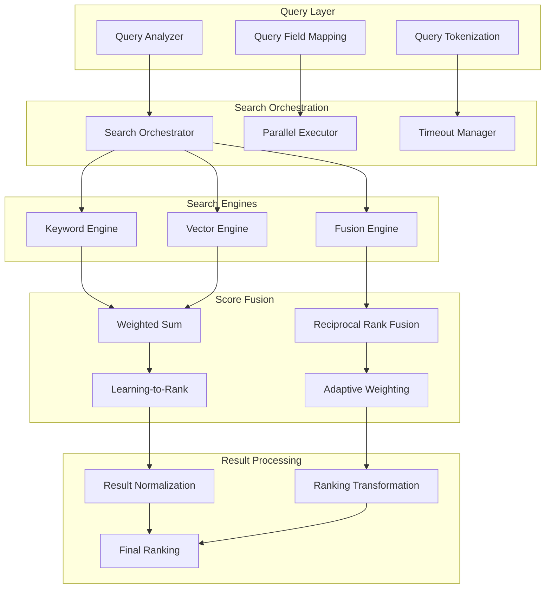

**Diagram sources**
- [search.py](file://rag/nlp/search.py#L360-L420)
- [query.py](file://rag/nlp/query.py#L26-L40)

The architecture consists of four main layers:

1. **Query Layer**: Handles query preprocessing, tokenization, and field mapping
2. **Search Orchestration**: Manages parallel execution and timeout handling
3. **Search Engines**: Implements keyword and vector search capabilities
4. **Score Fusion**: Applies various fusion algorithms to combine results

**Section sources**
- [search.py](file://rag/nlp/search.py#L360-L420)
- [query.py](file://rag/nlp/query.py#L26-L40)

## Score Fusion Techniques

RAGFlow implements multiple score fusion techniques to combine results from different search methods effectively:

### Weighted Sum Fusion

The weighted sum approach linearly combines scores from different search methods using configurable weights:

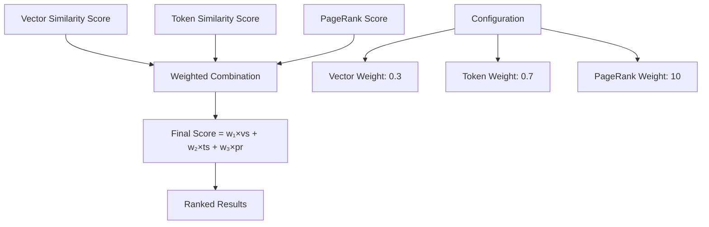

**Diagram sources**
- [search.py](file://rag/nlp/search.py#L291-L328)
- [ob_conn.py](file://rag/utils/ob_conn.py#L979-L980)

The weighted sum fusion formula used in RAGFlow is:

```
Final Score = (1 - vector_weight) × token_similarity + 
              vector_weight × vector_similarity + 
              pagerank_score × pagerank_weight
```

### Reciprocal Rank Fusion (RRF)

RRF combines rankings from multiple search methods by considering the rank position of each result:

```
RRF Score = Σᵢ (1 / (k + rankᵢ))
```

Where k is a constant (typically 60) and rankᵢ is the position of document i in search method i.

### Learning-to-Rank Algorithms

Advanced learning-to-rank models can be integrated for sophisticated result ranking:

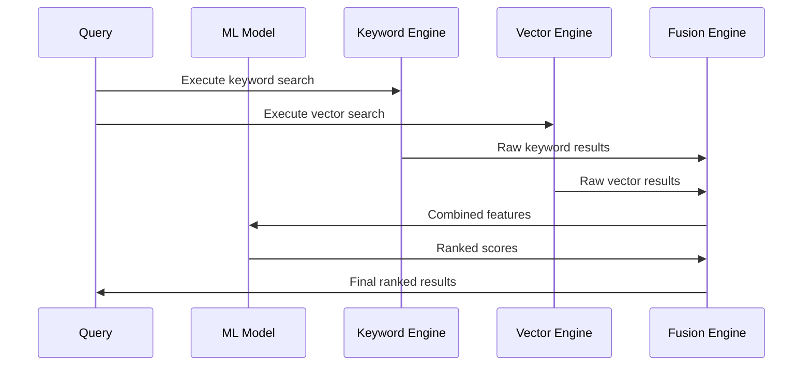

**Diagram sources**
- [search.py](file://rag/nlp/search.py#L330-L351)

**Section sources**
- [search.py](file://rag/nlp/search.py#L291-L351)
- [ob_conn.py](file://rag/utils/ob_conn.py#L979-L1000)

## Parallel Execution Framework

RAGFlow orchestrates parallel execution of keyword and vector searches through specialized applications:

### Naive Application

The Naive application focuses on straightforward text processing and basic retrieval:

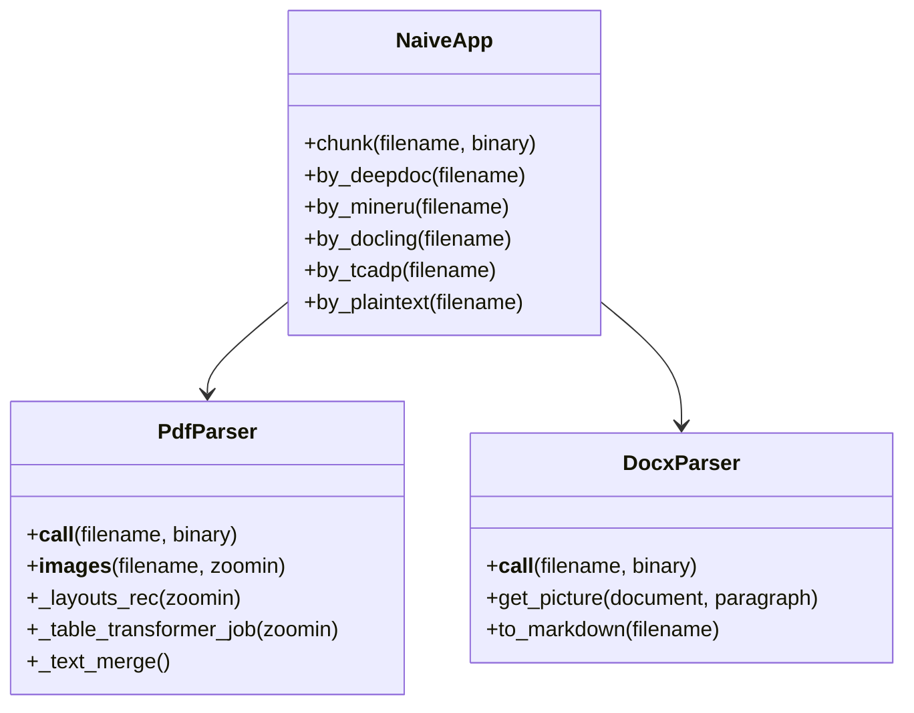

**Diagram sources**
- [naive.py](file://rag/app/naive.py#L43-L141)

### One Application

The One application maintains document structure integrity while performing retrieval:

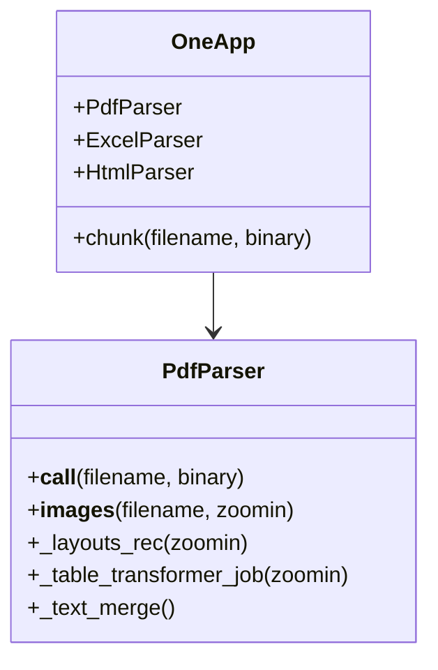

**Diagram sources**
- [one.py](file://rag/app/one.py#L28-L62)

### Parallel Execution Control

The system manages parallel execution with timeout handling:

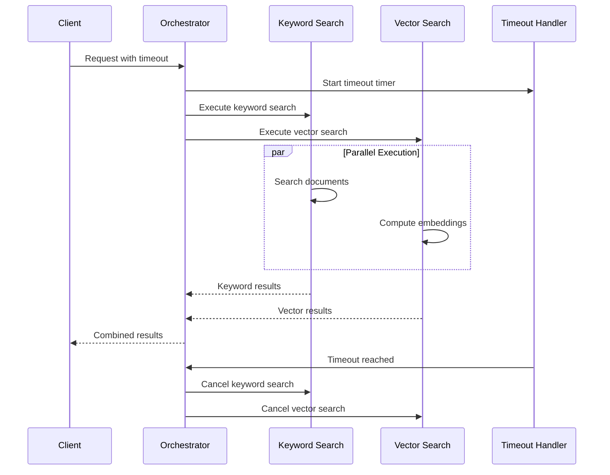

**Diagram sources**
- [connection_utils.py](file://common/connection_utils.py#L69-L99)

**Section sources**
- [naive.py](file://rag/app/naive.py#L43-L141)
- [one.py](file://rag/app/one.py#L28-L62)
- [connection_utils.py](file://common/connection_utils.py#L69-L99)

## Domain Model and Query Analysis

The query analysis system determines the optimal combination strategy based on query characteristics:

### Query Type Classification

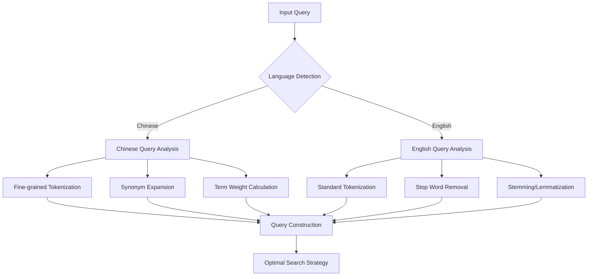

**Diagram sources**
- [query.py](file://rag/nlp/query.py#L85-L132)

### Adaptive Weighting Strategy

The system adapts fusion weights based on query characteristics:

| Query Type | Vector Weight | Token Weight | Reasoning |
|------------|---------------|--------------|-----------|
| Short Questions | 0.8 | 0.2 | Vector search better for brevity |
| Long Queries | 0.4 | 0.6 | Keyword search handles complexity |
| Technical Terms | 0.6 | 0.4 | Both methods complement technical content |
| General Questions | 0.5 | 0.5 | Balanced approach preferred |

### Query Routing Logic

```mermaid
flowchart TD
A[Query Input] --> B[Language Detection]
B --> C{Query Length}
C --> |Short (< 5 tokens)| D[High Vector Weight]
C --> |Medium (5-15 tokens)| E[Balanced Weights]
C --> |Long (> 15 tokens)| F[High Token Weight]
D --> G[Execute Hybrid Search]
E --> G
F --> G
G --> H[Apply Fusion Algorithm]
H --> I[Return Results]
J[Fallback Strategy] --> K{Timeout Occurred?}
K --> |Yes| L[Return Partial Results]
K --> |No| M[Wait for Completion]
```

**Diagram sources**
- [search.py](file://rag/nlp/search.py#L134-L144)

**Section sources**
- [query.py](file://rag/nlp/query.py#L85-L218)
- [search.py](file://rag/nlp/search.py#L134-L144)

## Configuration and Parameters

RAGFlow provides extensive configuration options for hybrid retrieval:

### Fusion Expression Configuration

The FusionExpr class defines the fusion parameters:

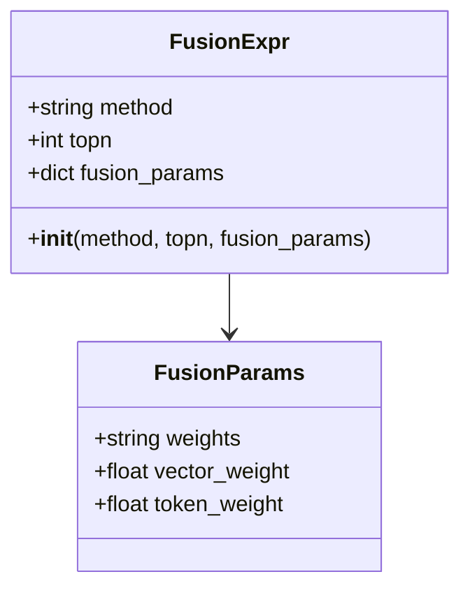

**Diagram sources**
- [doc_store_conn.py](file://rag/utils/doc_store_conn.py#L123-L128)

### Environment Variables

Key configuration parameters:

| Variable | Default | Description |
|----------|---------|-------------|
| `DOC_ENGINE` | `elasticsearch` | Document engine selection |
| `VECTOR_SIMILARITY_WEIGHT` | `0.3` | Default vector search weight |
| `SIMILARITY_THRESHOLD` | `0.2` | Minimum similarity threshold |
| `RERANK_LIMIT` | `64` | Maximum reranking candidates |
| `ENABLE_TIMEOUT_ASSERTION` | `false` | Enable timeout assertions |

### Database-Specific Configuration

Different document engines handle fusion differently:

#### OceanBase Fusion SQL
```sql
score_expr = f"(relevance * {1 - vector_similarity_weight} + {vector_search_score_expr} * {vector_similarity_weight} + {pagerank_score_expr})"
```

#### Elasticsearch Configuration
```python
fusionExpr = FusionExpr("weighted_sum", topk, {"weights": "0.05,0.95"})
```

**Section sources**
- [doc_store_conn.py](file://rag/utils/doc_store_conn.py#L123-L128)
- [ob_conn.py](file://rag/utils/ob_conn.py#L732-L881)
- [es_conn.py](file://rag/utils/es_conn.py#L183-L196)

## Performance Optimization

### Computational Overhead Management

The system implements several strategies to minimize computational overhead:

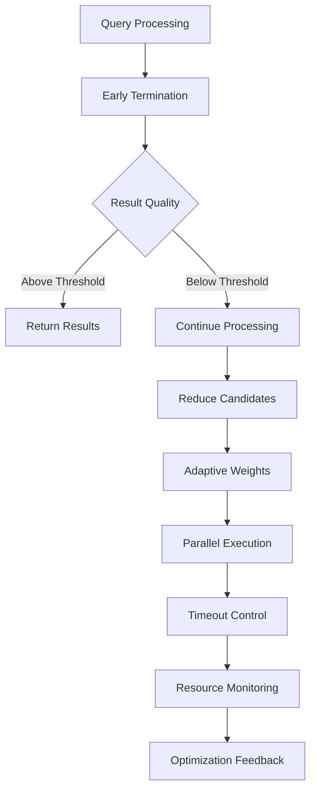

### Result Set Alignment

The system ensures consistent result ordering across different search methods:

1. **Normalization**: Scores are normalized to common ranges
2. **Alignment**: Results are aligned by document identifiers
3. **Validation**: Consistency checks are performed

### Memory Management

Efficient memory usage through:

- **Batch Processing**: Large result sets are processed in batches
- **Streaming**: Results are streamed rather than loaded entirely
- **Caching**: Frequently accessed results are cached

**Section sources**
- [search.py](file://rag/nlp/search.py#L380-L420)
- [ob_conn.py](file://rag/utils/ob_conn.py#L974-L1027)

## Common Issues and Solutions

### Conflicting Relevance Signals

**Issue**: Different search methods return conflicting relevance rankings.

**Solution**: Implement adaptive weighting that adjusts based on query characteristics and historical performance.

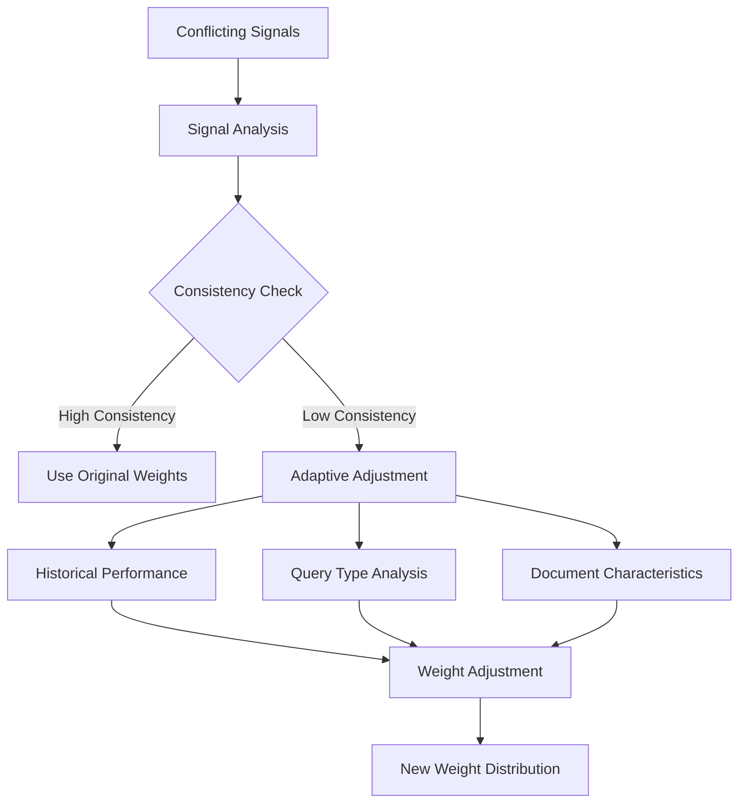

### Timeout Management

**Issue**: Searches take too long, causing timeouts.

**Solution**: Multi-stage timeout handling with fallback strategies:

1. **Initial Timeout**: Quick results within 1-2 seconds
2. **Extended Timeout**: More comprehensive results within 5-10 seconds
3. **Complete Timeout**: Exhaustive search with partial results

### Resource Contention

**Issue**: Parallel searches consume excessive resources.

**Solution**: Dynamic resource allocation based on system load:

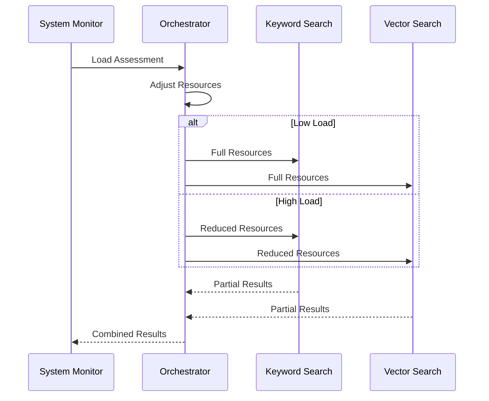

**Section sources**
- [connection_utils.py](file://common/connection_utils.py#L69-L99)
- [search.py](file://rag/nlp/search.py#L134-L144)

## Tuning Guidelines

### Query-Specific Tuning

#### Short Queries (< 5 tokens)
- **Vector Weight**: 0.8
- **Token Weight**: 0.2
- **Reason**: Vector search performs better for short, focused queries

#### Long Queries (> 15 tokens)
- **Vector Weight**: 0.2
- **Token Weight**: 0.8
- **Reason**: Keyword search handles complex, multi-concept queries better

#### Technical Content
- **Vector Weight**: 0.6
- **Token Weight**: 0.4
- **Focus**: Both methods complement technical terminology

### Data Type Optimization

| Data Type | Recommended Strategy | Weights |
|-----------|---------------------|---------|
| Scientific Papers | High Vector Weight | 0.7:0.3 |
| Legal Documents | High Token Weight | 0.3:0.7 |
| Technical Manuals | Balanced | 0.5:0.5 |
| Conversational Text | Balanced | 0.5:0.5 |

### Performance Tuning

#### Batch Size Optimization
- **Small Documents**: Larger batch sizes (32-64)
- **Large Documents**: Smaller batch sizes (8-16)
- **Memory-Constrained**: Minimal batch sizes (4-8)

#### Timeout Configuration
- **Interactive Queries**: 2-5 seconds
- **Batch Processing**: 30-60 seconds
- **Real-time Applications**: 1-2 seconds

### Quality vs. Speed Trade-offs

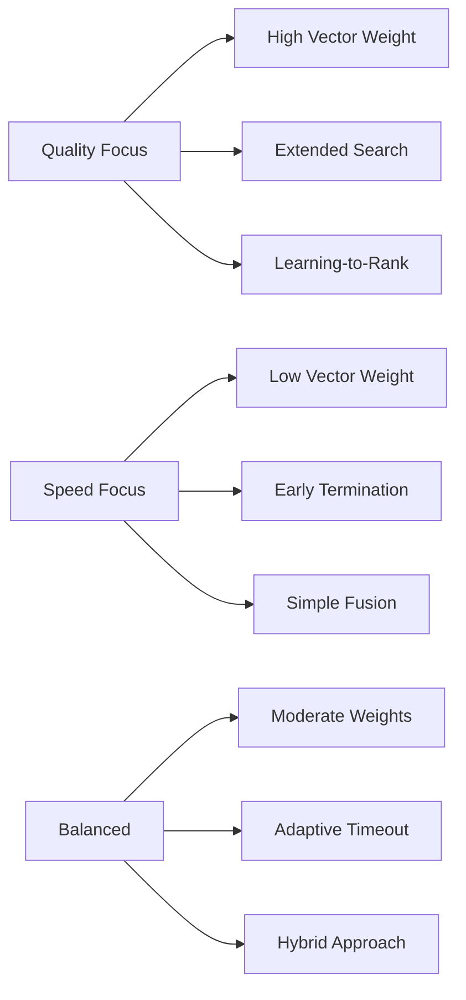

**Section sources**
- [search.py](file://rag/nlp/search.py#L360-L420)
- [query.py](file://rag/nlp/query.py#L220-L228)

## Conclusion

RAGFlow's hybrid retrieval system represents a sophisticated approach to combining multiple search methodologies for optimal retrieval performance. The system's strength lies in its adaptive nature, intelligent query analysis, and flexible configuration options that allow fine-tuning for specific use cases and data types.

Key advantages of the hybrid approach include:

1. **Complementary Strengths**: Keyword search handles exact matches while vector search captures semantic similarity
2. **Adaptive Strategies**: Automatic adjustment based on query characteristics and system conditions
3. **Scalable Architecture**: Support for multiple document engines with unified interfaces
4. **Robust Error Handling**: Comprehensive timeout management and fallback strategies
5. **Performance Optimization**: Efficient resource utilization and result processing

The system's modular design enables easy extension with new fusion algorithms, search methods, and document engines. Future enhancements could include machine learning-based weight optimization, real-time performance monitoring, and advanced result diversification techniques.

For optimal deployment, administrators should carefully consider their specific use cases, data characteristics, and performance requirements when configuring the hybrid retrieval system. Regular monitoring and tuning based on actual usage patterns will ensure sustained optimal performance.