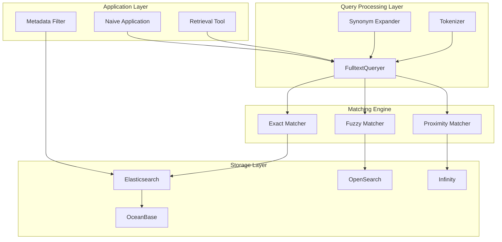
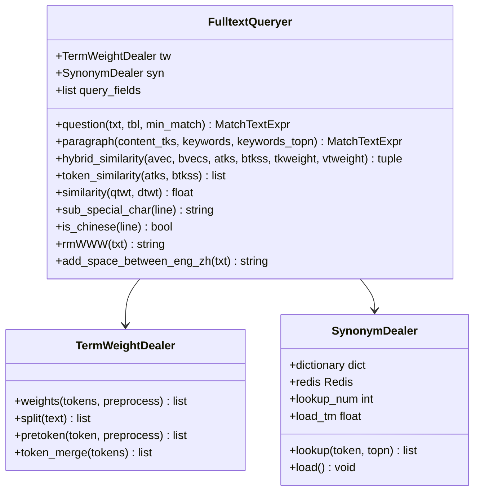
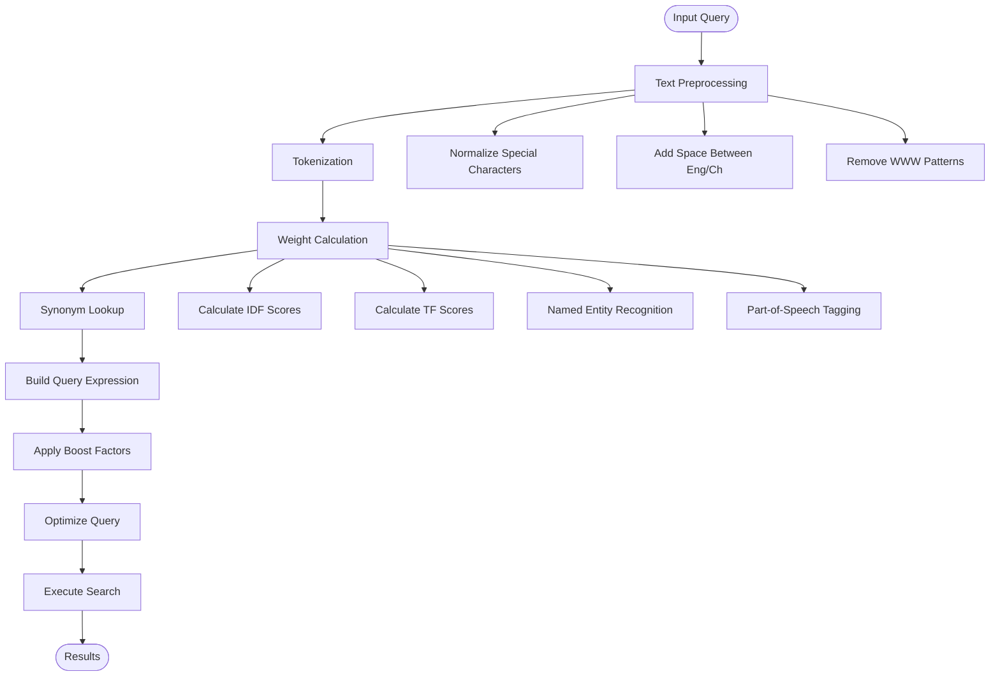
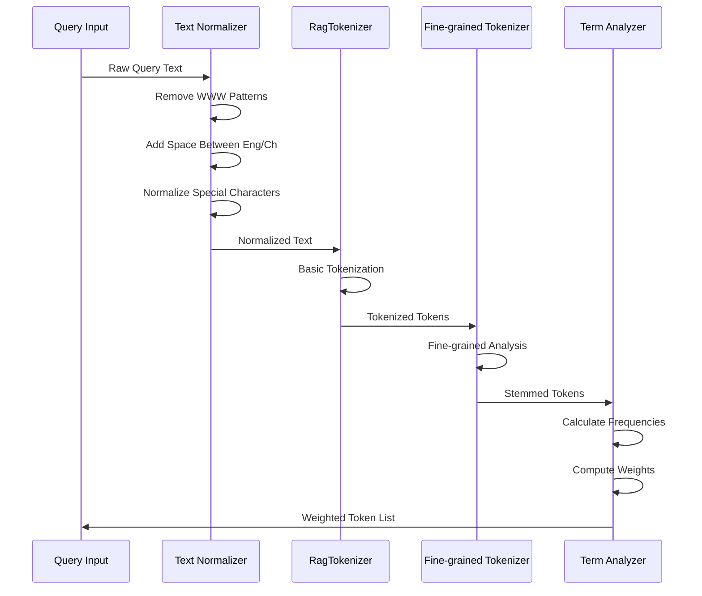
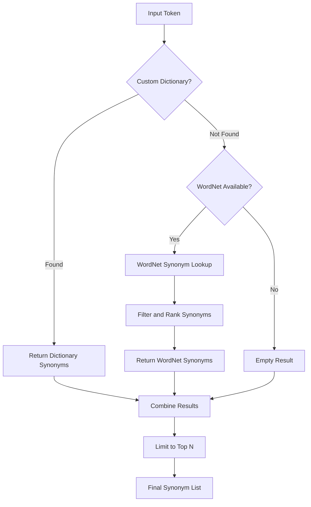
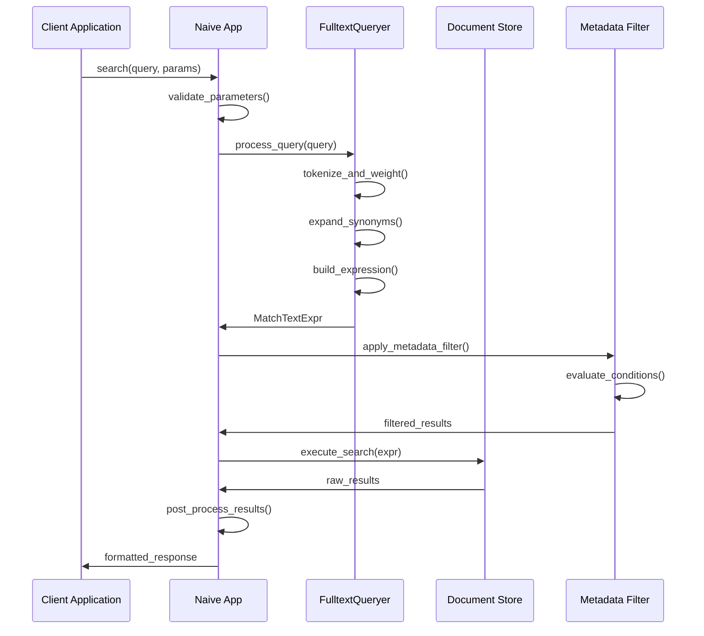
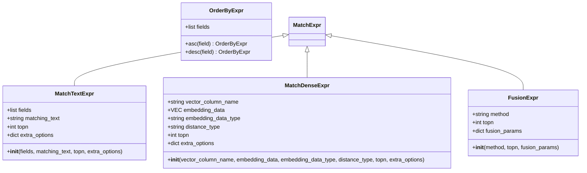
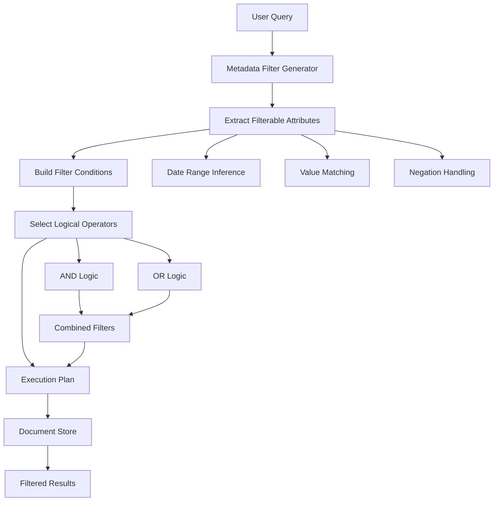
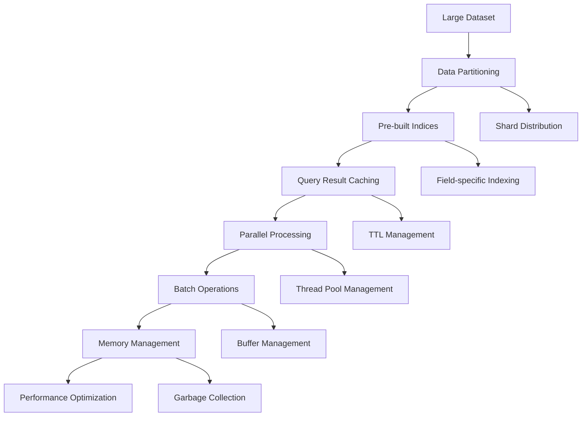
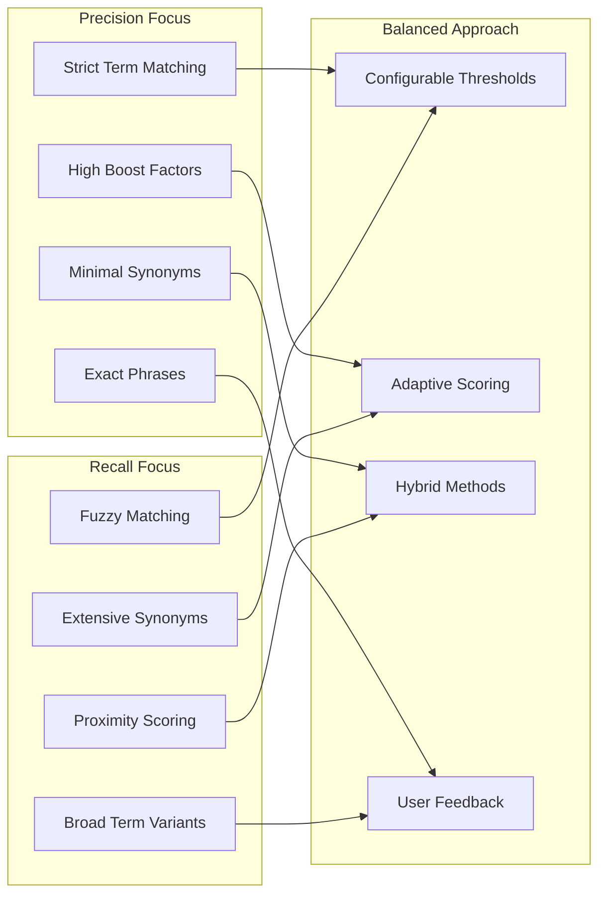

# Keyword Search

<cite>
**Referenced Files in This Document**
- [rag/nlp/query.py](file://rag/nlp/query.py)
- [rag/nlp/synonym.py](file://rag/nlp/synonym.py)
- [rag/nlp/rag_tokenizer.py](file://rag/nlp/rag_tokenizer.py)
- [rag/app/naive.py](file://rag/app/naive.py)
- [rag/utils/infinity_conn.py](file://rag/utils/infinity_conn.py)
- [rag/utils/es_conn.py](file://rag/utils/es_conn.py)
- [rag/utils/opensearch_conn.py](file://rag/utils/opensearch_conn.py)
- [rag/utils/doc_store_conn.py](file://rag/utils/doc_store_conn.py)
- [agent/tools/retrieval.py](file://agent/tools/retrieval.py)
- [web/src/components/metadata-filter/index.tsx](file://web/src/components/metadata-filter/index.tsx)
- [rag/prompts/meta_filter.md](file://rag/prompts/meta_filter.md)
- [rag/utils/ob_conn.py](file://rag/utils/ob_conn.py)
</cite>

## Table of Contents
1. [Introduction](#introduction)
2. [Architecture Overview](#architecture-overview)
3. [Core Components](#core-components)
4. [Exact and Fuzzy Matching Algorithms](#exact-and-fuzzy-matching-algorithms)
5. [Tokenization and Stemming](#tokenization-and-stemming)
6. [Synonym Expansion](#synonym-expansion)
7. [Naive Retrieval Application](#naive-retrieval-application)
8. [Configuration Parameters](#configuration-parameters)
9. [Domain Model for Keyword-Based Retrieval](#domain-model-for-keyword-based-retrieval)
10. [Metadata Filtering Enhancement](#metadata-filtering-enhancement)
11. [Performance Optimization](#performance-optimization)
12. [Precision vs Recall Trade-offs](#precision-vs-recall-trade-offs)
13. [When to Use Keyword Search](#when-to-use-keyword-search)
14. [Troubleshooting Guide](#troubleshooting-guide)
15. [Conclusion](#conclusion)

## Introduction

RAGFlow's keyword search recall method provides a robust foundation for retrieving relevant documents through precise and flexible matching mechanisms. The system implements sophisticated algorithms for exact and fuzzy keyword matching, incorporating advanced tokenization, stemming, and synonym expansion techniques. This comprehensive approach ensures optimal retrieval performance across diverse query types and dataset characteristics.

The keyword search system serves as a critical component in RAGFlow's multi-modal retrieval architecture, complementing vector-based similarity search with traditional text matching capabilities. It enables users to leverage both semantic understanding and precise keyword matching for comprehensive information retrieval.

## Architecture Overview

The keyword search architecture in RAGFlow follows a layered design that separates concerns between query processing, matching algorithms, and database interactions. The system integrates seamlessly with various document stores and retrieval engines.



**Diagram sources**
- [rag/nlp/query.py](file://rag/nlp/query.py#L26-L40)
- [rag/utils/es_conn.py](file://rag/utils/es_conn.py#L190-L200)
- [rag/utils/infinity_conn.py](file://rag/utils/infinity_conn.py#L400-L430)

## Core Components

### FulltextQueryer Class

The `FulltextQueryer` serves as the central orchestrator for keyword search operations, implementing sophisticated query processing algorithms that handle both exact and fuzzy matching scenarios.



**Diagram sources**
- [rag/nlp/query.py](file://rag/nlp/query.py#L26-L40)
- [rag/nlp/synonym.py](file://rag/nlp/synonym.py#L26-L48)

**Section sources**
- [rag/nlp/query.py](file://rag/nlp/query.py#L26-L280)
- [rag/nlp/synonym.py](file://rag/nlp/synonym.py#L26-L102)

### Tokenizer Integration

The system utilizes a specialized tokenizer that adapts its behavior based on the underlying document engine, providing consistent tokenization across different storage backends.

**Section sources**
- [rag/nlp/rag_tokenizer.py](file://rag/nlp/rag_tokenizer.py#L21-L43)

## Exact and Fuzzy Matching Algorithms

### Exact Matching Implementation

The exact matching algorithm focuses on precise term matching with configurable tolerance levels. The system employs sophisticated preprocessing techniques to normalize input text and optimize matching performance.



**Diagram sources**
- [rag/nlp/query.py](file://rag/nlp/query.py#L85-L132)

### Fuzzy Matching with Proximity Scoring

The fuzzy matching system implements proximity-based scoring that considers word order and spatial relationships between terms. This approach enhances recall for queries with minor variations or typographical errors.

**Section sources**
- [rag/nlp/query.py](file://rag/nlp/query.py#L134-L218)

## Tokenization and Stemming

### Advanced Tokenization Pipeline

The tokenization process incorporates multiple stages to handle diverse linguistic patterns and improve matching accuracy across different languages and domains.



**Diagram sources**
- [rag/nlp/rag_tokenizer.py](file://rag/nlp/rag_tokenizer.py#L21-L43)
- [rag/nlp/query.py](file://rag/nlp/query.py#L141-L190)

### Stemming and Morphological Analysis

The stemming process applies morphological analysis to reduce words to their base forms while preserving semantic meaning and enabling broader matching coverage.

**Section sources**
- [rag/nlp/rag_tokenizer.py](file://rag/nlp/rag_tokenizer.py#L29-L33)

## Synonym Expansion

### Multi-Level Synonym Resolution

The synonym expansion system operates on multiple levels, combining custom dictionaries with external resources to provide comprehensive synonym coverage.



**Diagram sources**
- [rag/nlp/synonym.py](file://rag/nlp/synonym.py#L71-L96)

### Dynamic Synonym Loading

The system supports real-time synonym updates through Redis integration, enabling dynamic expansion of synonym dictionaries without system restarts.

**Section sources**
- [rag/nlp/synonym.py](file://rag/nlp/synonym.py#L49-L70)

## Naive Retrieval Application

### Architecture and Workflow

The naive retrieval application provides a streamlined interface for keyword-based document retrieval, integrating seamlessly with the broader RAGFlow ecosystem.



**Diagram sources**
- [rag/app/naive.py](file://rag/app/naive.py#L605-L700)
- [agent/tools/retrieval.py](file://agent/tools/retrieval.py#L32-L68)

### Parameter Configuration

The naive retrieval application supports extensive configuration options for fine-tuning search behavior and performance characteristics.

**Section sources**
- [rag/app/naive.py](file://rag/app/naive.py#L605-L700)
- [agent/tools/retrieval.py](file://agent/tools/retrieval.py#L32-L68)

## Configuration Parameters

### Minimum Match Requirements

The system implements configurable minimum match thresholds that balance precision and recall based on query characteristics and user preferences.

| Parameter | Type | Default | Description |
|-----------|------|---------|-------------|
| `minimum_should_match` | float | 0.6 | Percentage of query terms that must match |
| `keywords_topn` | int | 30 | Maximum number of keywords to process |
| `synonym_topn` | int | 8 | Maximum synonyms per term |
| `boost_factor` | float | 1.0 | Overall query boost multiplier |

### Boost Factors and Scoring

The scoring system applies multiple boost factors to optimize retrieval quality for different term types and contexts.

| Boost Factor | Purpose | Typical Value |
|--------------|---------|---------------|
| Term Frequency | Rare terms receive higher boost | 1.0-5.0 |
| Synonym Expansion | Expanded terms receive reduced boost | 0.2 |
| Phrase Matching | Exact phrases receive higher boost | 2.0 |
| Field Weighting | Different fields have varying importance | 1.0-30.0 |

### Proximity Scoring Configuration

Proximity scoring considers word order and spatial relationships between query terms to improve relevance ranking.

**Section sources**
- [rag/nlp/query.py](file://rag/nlp/query.py#L113-L126)
- [rag/utils/infinity_conn.py](file://rag/utils/infinity_conn.py#L414-L418)

## Domain Model for Keyword-Based Retrieval

### Query Expression Model

The system defines a comprehensive query expression model that supports multiple matching strategies and scoring mechanisms.



**Diagram sources**
- [rag/utils/doc_store_conn.py](file://rag/utils/doc_store_conn.py#L59-L128)

### Field Weighting Schema

The domain model supports sophisticated field weighting that prioritizes different document components based on their relevance to the query.

**Section sources**
- [rag/utils/doc_store_conn.py](file://rag/utils/doc_store_conn.py#L59-L128)

## Metadata Filtering Enhancement

### Advanced Filtering Capabilities

The metadata filtering system provides powerful capabilities for refining search results based on document attributes and contextual information.



**Diagram sources**
- [rag/prompts/meta_filter.md](file://rag/prompts/meta_filter.md#L1-L67)
- [web/src/components/metadata-filter/index.tsx](file://web/src/components/metadata-filter/index.tsx#L1-L50)

### Operator Support Matrix

The system supports a comprehensive set of operators for precise metadata filtering.

| Operator Category | Operators | Description |
|------------------|-----------|-------------|
| Equality | `=`, `≠` | Exact value matching |
| Containment | `contains`, `not contains` | Substring matching |
| Ordering | `>`, `<`, `≥`, `≤` | Numeric/date comparisons |
| Pattern | `start with`, `end with` | String pattern matching |
| Existence | `empty`, `not empty` | Presence/absence checking |
| Enumeration | `in`, `not in` | Value set membership |

**Section sources**
- [rag/prompts/meta_filter.md](file://rag/prompts/meta_filter.md#L20-L35)
- [web/src/components/metadata-filter/index.tsx](file://web/src/components/metadata-filter/index.tsx#L15-L30)

## Performance Optimization

### Large Dataset Handling

The keyword search system implements several optimization strategies for handling large-scale datasets efficiently.



### Special Character Handling

The system implements comprehensive special character handling to ensure reliable matching across diverse text formats.

**Section sources**
- [rag/nlp/query.py](file://rag/nlp/query.py#L40-L43)
- [rag/utils/es_conn.py](file://rag/utils/es_conn.py#L194-L197)

## Precision vs Recall Trade-offs

### Balancing Strategies

The keyword search system provides multiple mechanisms for balancing precision and recall based on specific use case requirements.



### Adaptive Threshold Configuration

The system supports adaptive threshold configuration that adjusts based on query characteristics and historical performance data.

**Section sources**
- [rag/nlp/query.py](file://rag/nlp/query.py#L278-L279)

## When to Use Keyword Search

### Query Characteristic Analysis

Different query types benefit from different search approaches, and the system provides guidance for optimal selection.

| Query Type | Recommended Method | Rationale |
|------------|-------------------|-----------|
| Exact Terms | Keyword Search | Precise matching required |
| Technical Terms | Hybrid Approach | Balance precision and recall |
| Natural Language | Vector + Keyword | Semantic understanding needed |
| Short Queries | Keyword Heavy | Limited context for vectors |
| Long Queries | Balanced Approach | Mixed precision/recall needs |

### Decision Framework

```mermaid
flowchart TD
Query[User Query] --> Length{Query Length}
Length --> |Short (< 5 words)| KeywordOnly[Keyword Search Only]
Length --> |Medium (5-15 words)| Hybrid[Hybrid Approach]
Length --> |Long (> 15 words)| VectorPlus[Vector + Keyword]
KeywordOnly --> ExactMatch[Focus on Exact Terms]
Hybrid --> Balanced[Balance Precision/Recall]
VectorPlus --> Semantic[Emphasize Semantics]
ExactMatch --> Results1[High Precision Results]
Balanced --> Results2[Optimal Results]
Semantic --> Results3[Comprehensive Results]
```

**Section sources**
- [agent/tools/retrieval.py](file://agent/tools/retrieval.py#L54-L56)

## Troubleshooting Guide

### Common Issues and Solutions

#### Special Character Problems

**Issue**: Special characters causing search failures or unexpected results
**Solution**: The system automatically escapes special characters using the `sub_special_char` method, which handles common Elasticsearch/OpenSearch reserved characters.

**Section sources**
- [rag/nlp/query.py](file://rag/nlp/query.py#L40-L43)

#### Performance Degradation

**Issue**: Slow query performance with large datasets
**Solution**: Implement proper indexing strategies, consider query result caching, and optimize field weights for frequently searched content.

#### Synonym Expansion Issues

**Issue**: Missing or incorrect synonym expansions
**Solution**: Verify custom synonym dictionary configuration and ensure WordNet resources are properly installed for English language support.

**Section sources**
- [rag/nlp/synonym.py](file://rag/nlp/synonym.py#L71-L96)

#### Metadata Filter Conflicts

**Issue**: Metadata filters not applying correctly
**Solution**: Check filter syntax and ensure metadata field names match exactly with indexed field names.

**Section sources**
- [rag/utils/ob_conn.py](file://rag/utils/ob_conn.py#L238-L264)

## Conclusion

RAGFlow's keyword search recall method provides a comprehensive and flexible foundation for document retrieval that balances precision and recall across diverse use cases. The system's sophisticated algorithms for exact and fuzzy matching, combined with advanced tokenization, stemming, and synonym expansion capabilities, enable highly effective information retrieval.

The modular architecture supports seamless integration with various document stores while maintaining consistent performance characteristics across different deployment environments. The extensive configuration options allow fine-tuning for specific domain requirements, ensuring optimal results for both development and production scenarios.

Key strengths of the system include its ability to handle complex queries with multiple matching strategies, robust metadata filtering capabilities, and efficient performance optimization for large-scale deployments. The combination of traditional keyword matching with modern semantic understanding creates a powerful retrieval system that serves a wide range of applications and user needs.

Future enhancements may include machine learning-based query understanding, improved multilingual support, and advanced ranking algorithms that incorporate user feedback and contextual information for even better retrieval performance.