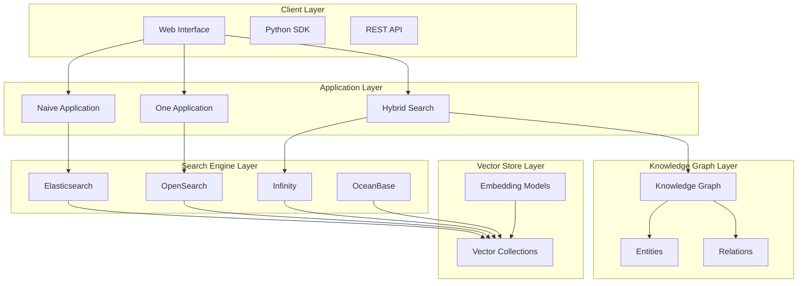
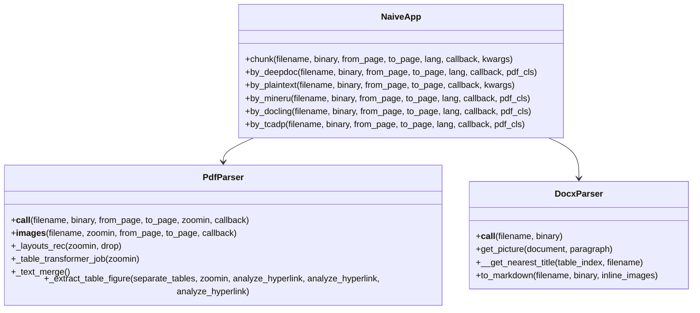
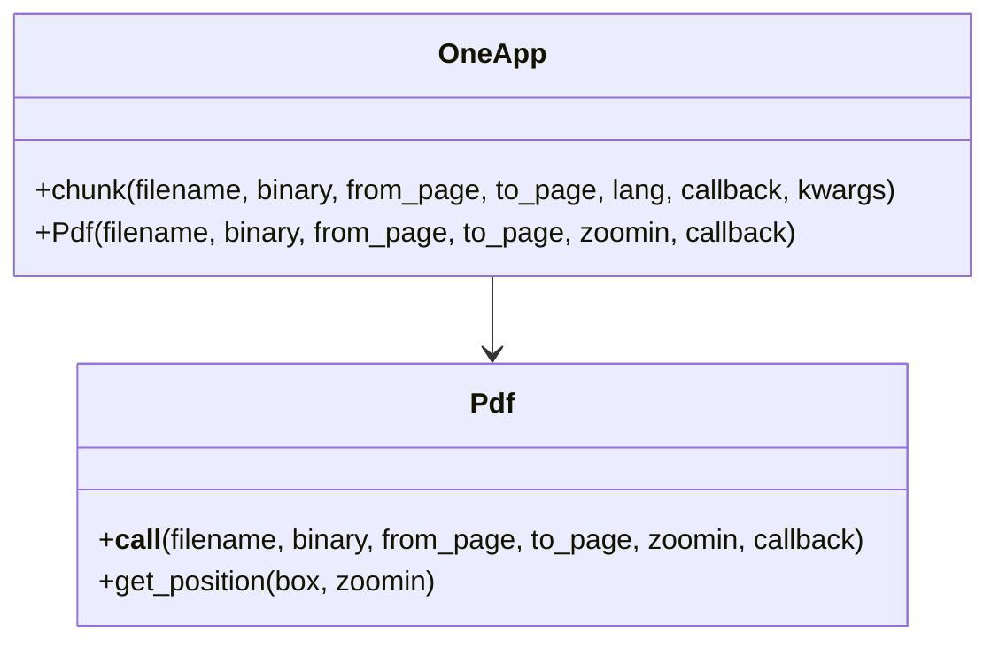
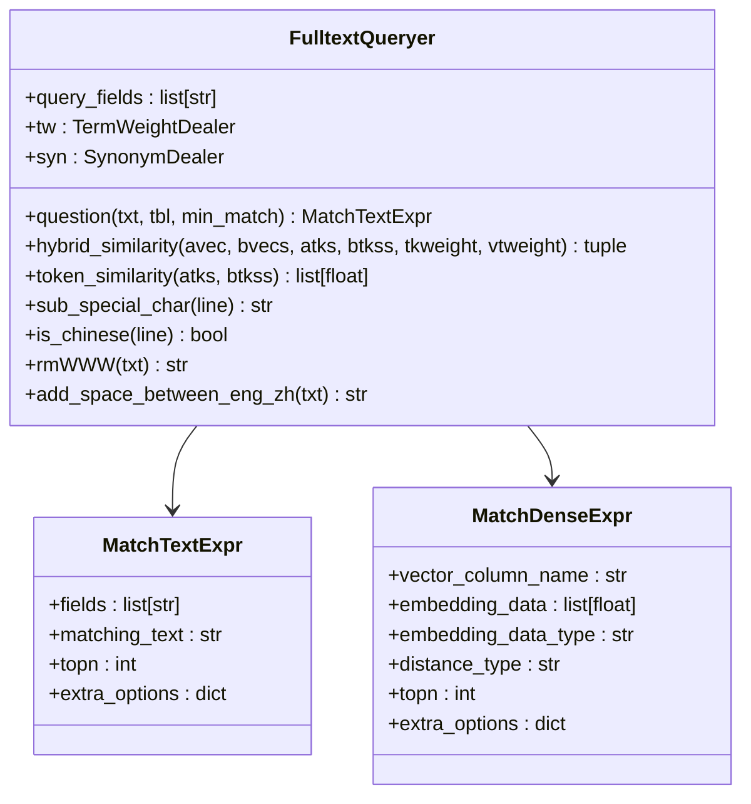
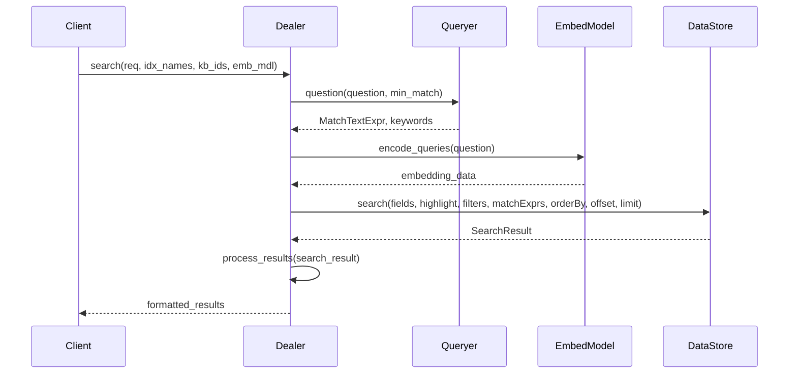
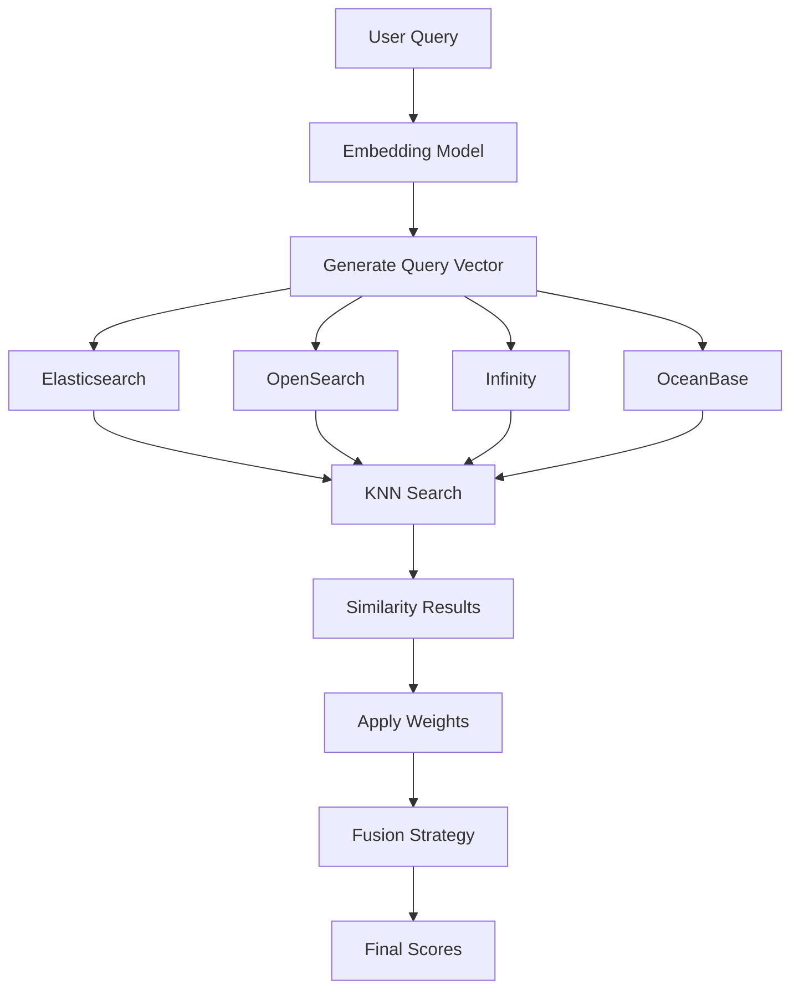
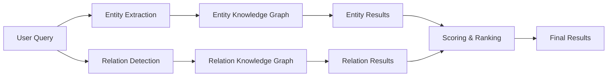

# Multiple Recall Methods

<cite>
**Referenced Files in This Document**
- [naive.py](file://rag/app/naive.py)
- [one.py](file://rag/app/one.py)
- [search.py](file://rag/nlp/search.py)
- [query.py](file://rag/nlp/query.py)
- [doc_store_conn.py](file://rag/utils/doc_store_conn.py)
- [es_conn.py](file://rag/utils/es_conn.py)
- [ob_conn.py](file://rag/utils/ob_conn.py)
- [infinity_conn.py](file://rag/utils/infinity_conn.py)
- [opensearch_conn.py](file://rag/utils/opensearch_conn.py)
- [embedding_model.py](file://rag/llm/embedding_model.py)
- [kb_app.py](file://api/apps/kb_app.py)
- [search.py](file://graphrag/search.py)
- [utils.py](file://graphrag/utils.py)
- [similarity-slider/index.tsx](file://web/src/components/similarity-slider/index.tsx)
</cite>

## Table of Contents
1. [Introduction](#introduction)
2. [Architecture Overview](#architecture-overview)
3. [Core Recall Applications](#core-recall-applications)
4. [Search Engine Implementation](#search-engine-implementation)
5. [Hybrid Retrieval Strategies](#hybrid-retrieval-strategies)
6. [Knowledge Graph Integration](#knowledge-graph-integration)
7. [Configuration and Parameters](#configuration-and-parameters)
8. [Performance Optimization](#performance-optimization)
9. [Common Issues and Solutions](#common-issues-and-solutions)
10. [Best Practices](#best-practices)

## Introduction

RAGFlow implements a sophisticated multiple recall methods system that combines various retrieval strategies to provide accurate and efficient document search capabilities. The system supports three primary recall applications: Naive, One, and Hybrid approaches, each designed for different use cases and performance requirements.

The recall system operates on multiple levels:
- **Keyword-based retrieval** using Elasticsearch and OpenSearch
- **Vector similarity search** using dense embeddings
- **Hybrid approaches** combining both methods with configurable weights
- **Knowledge graph integration** for entity and relationship-based retrieval

## Architecture Overview

The RAGFlow recall system follows a layered architecture that separates concerns between different retrieval strategies while providing unified interfaces for consumption.

**Diagram sources**
- [search.py](file://rag/nlp/search.py#L36-L50)
- [doc_store_conn.py](file://rag/utils/doc_store_conn.py#L59-L87)

## Core Recall Applications

### Naive Application

The Naive application provides straightforward text-based retrieval using keyword matching with configurable parameters.

**Diagram sources**
- [naive.py](file://rag/app/naive.py#L43-L141)
- [naive.py](file://rag/app/naive.py#L28-L62)

**Section sources**
- [naive.py](file://rag/app/naive.py#L64-L141)

### One Application

The One application creates single-chunk-per-file retrieval, maintaining original text order and structure.

**Diagram sources**
- [one.py](file://rag/app/one.py#L28-L62)
- [one.py](file://rag/app/one.py#L64-L157)

**Section sources**
- [one.py](file://rag/app/one.py#L64-L157)

## Search Engine Implementation

### FulltextQueryer Class

The FulltextQueryer handles keyword-based search with advanced query processing capabilities.

**Diagram sources**
- [query.py](file://rag/nlp/query.py#L26-L38)
- [doc_store_conn.py](file://rag/utils/doc_store_conn.py#L59-L87)

**Section sources**
- [query.py](file://rag/nlp/query.py#L26-L233)

### Dealer Class

The Dealer orchestrates search operations across different engines with unified interfaces.

**Diagram sources**
- [search.py](file://rag/nlp/search.py#L36-L50)
- [search.py](file://rag/nlp/search.py#L73-L169)

**Section sources**
- [search.py](file://rag/nlp/search.py#L36-L169)

## Hybrid Retrieval Strategies

### Vector Similarity Search

The system supports multiple vector similarity implementations across different storage backends.

**Diagram sources**
- [search.py](file://rag/nlp/search.py#L53-L60)
- [es_conn.py](file://rag/utils/es_conn.py#L183-L226)
- [ob_conn.py](file://rag/utils/ob_conn.py#L731-L895)

### Hybrid Similarity Calculation

The hybrid approach combines keyword and vector similarity scores with configurable weights.

**Section sources**
- [search.py](file://rag/nlp/search.py#L220-L228)
- [search.py](file://rag/nlp/search.py#L322-L328)

### Reranking Capabilities

The system supports model-based reranking for improved retrieval quality.

**Section sources**
- [search.py](file://rag/nlp/search.py#L330-L351)

## Knowledge Graph Integration

### Entity and Relation Retrieval

The knowledge graph provides semantic-aware retrieval through entities and relationships.

**Diagram sources**
- [search.py](file://graphrag/search.py#L142-L291)

**Section sources**
- [search.py](file://graphrag/search.py#L85-L300)
- [utils.py](file://graphrag/utils.py#L304-L336)

## Configuration and Parameters

### Core Parameters

| Parameter | Type | Default | Description |
|-----------|------|---------|-------------|
| `similarity_threshold` | float | 0.2 | Minimum similarity score for inclusion |
| `vector_similarity_weight` | float | 0.3 | Weight for vector similarity in hybrid scoring |
| `keywords_similarity_weight` | float | 0.7 | Weight for keyword similarity in hybrid scoring |
| `top` | int | 1024 | Maximum number of results to retrieve |
| `page_size` | int | 128 | Number of results per page |
| `rerank_mdl` | Model | None | Reranking model for improved results |

### Advanced Configuration Options

| Parameter | Type | Default | Description |
|-----------|------|---------|-------------|
| `rank_feature` | dict | {PAGERANK_FLD: 10} | Ranking features for scoring |
| `highlight` | bool/list | False | Enable result highlighting |
| `aggs` | bool | True | Enable result aggregations |
| `doc_ids` | list | None | Specific document IDs to search |

**Section sources**
- [search.py](file://rag/nlp/search.py#L369-L374)
- [similarity-slider/index.tsx](file://web/src/components/similarity-slider/index.tsx#L18-L93)

## Performance Optimization

### Caching Strategies

The system implements multiple caching layers to improve performance:

1. **Embedding Cache**: Stores computed embeddings to avoid recomputation
2. **Query Cache**: Caches frequently accessed search results
3. **Model Cache**: Maintains pre-loaded embedding models

### Batch Processing

Vector operations are optimized through batch processing:

**Section sources**
- [embedding_model.py](file://rag/llm/embedding_model.py#L42-L809)
- [kb_app.py](file://api/apps/kb_app.py#L885-L926)

### Index Optimization

Different storage backends provide specialized optimization:

- **Elasticsearch**: Optimized for full-text search with BM25 scoring
- **OpenSearch**: Enhanced with KNN vector search capabilities
- **Infinity**: Native vector database with optimized similarity calculations
- **OceanBase**: Distributed vector storage with ACID guarantees

**Section sources**
- [es_conn.py](file://rag/utils/es_conn.py#L173-L226)
- [ob_conn.py](file://rag/utils/ob_conn.py#L731-L895)
- [infinity_conn.py](file://rag/utils/infinity_conn.py#L431-L455)

## Common Issues and Solutions

### Recall Accuracy Problems

**Issue**: Low recall accuracy despite high similarity scores
**Solution**: Adjust similarity thresholds and experiment with different embedding models

**Issue**: Poor handling of domain-specific terminology
**Solution**: Configure custom synonyms and expand the vocabulary

**Issue**: Inconsistent results across different retrieval methods
**Solution**: Standardize preprocessing and normalization steps

### Performance Issues

**Issue**: Slow response times for vector similarity searches
**Solution**: Optimize batch sizes and implement result caching

**Issue**: Memory consumption during large-scale retrievals
**Solution**: Implement pagination and streaming for large result sets

**Issue**: High computational costs for embedding generation
**Solution**: Use model quantization and optimize batch processing

### Configuration Challenges

**Issue**: Difficulty finding optimal parameter combinations
**Solution**: Use the built-in retrieval testing interface to experiment with different settings

**Issue**: Incompatible vector spaces between embedding models
**Solution**: Use the embedding model validation tool to ensure compatibility

**Section sources**
- [kb_app.py](file://api/apps/kb_app.py#L885-L926)

## Best Practices

### Retrieval Method Selection

1. **Use Naive for**: Simple keyword-based searches, exact matches, and basic document retrieval
2. **Use One for**: Complete document context preservation, legal documents, and formal texts
3. **Use Hybrid for**: General-purpose retrieval with balanced keyword and semantic search
4. **Use Knowledge Graph for**: Semantic understanding, entity-centric queries, and relationship discovery

### Parameter Tuning Guidelines

1. **Start with defaults** and adjust based on specific use case requirements
2. **Monitor recall-precision trade-offs** when tuning similarity thresholds
3. **Experiment with weight distributions** to balance keyword and vector contributions
4. **Consider reranking models** for critical applications requiring high precision

### Monitoring and Maintenance

1. **Regular evaluation** of retrieval performance using test datasets
2. **Continuous monitoring** of embedding model effectiveness
3. **Periodic review** of synonym dictionaries and vocabulary updates
4. **Performance profiling** to identify bottlenecks in production systems

### Integration Patterns

1. **Progressive enhancement**: Start with keyword search and enhance with vector search
2. **Fallback strategies**: Implement alternative retrieval methods for degraded performance
3. **Circuit breaker patterns**: Fail gracefully when external services become unavailable
4. **A/B testing**: Compare different retrieval configurations in production environments