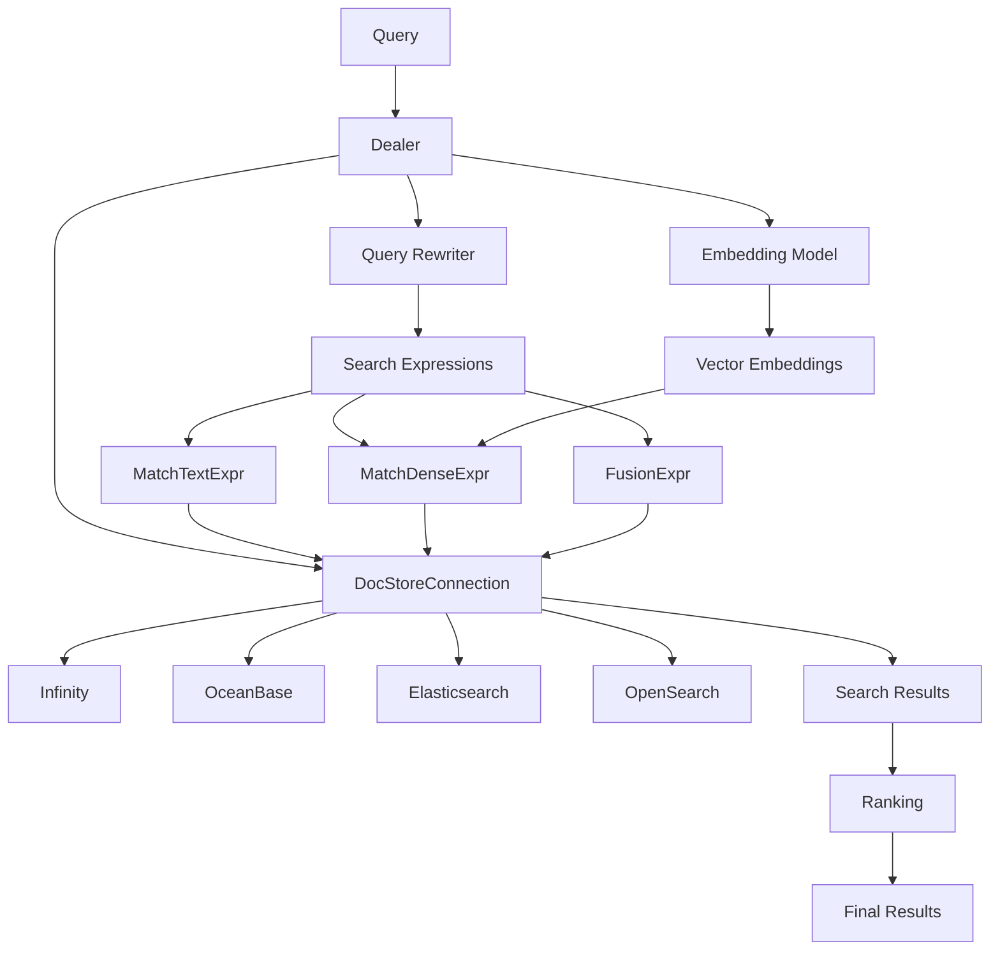
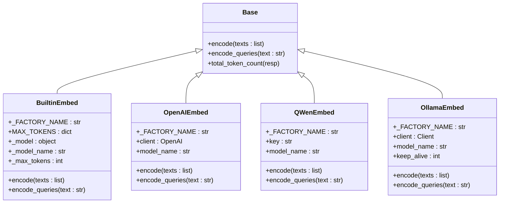
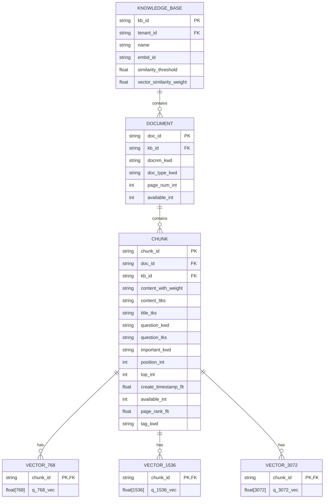
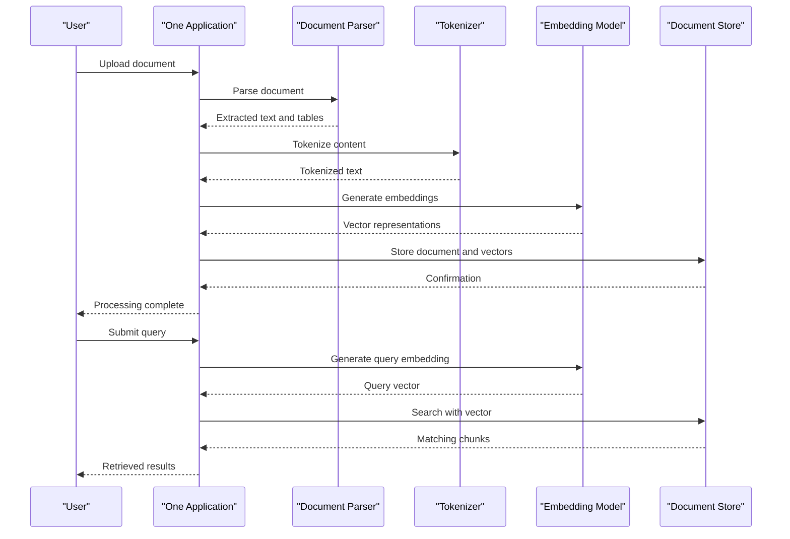

# Vector Similarity Search

<cite>
**Referenced Files in This Document**   
- [rag/utils/doc_store_conn.py](file://rag/utils/doc_store_conn.py)
- [rag/nlp/search.py](file://rag/nlp/search.py)
- [rag/utils/ob_conn.py](file://rag/utils/ob_conn.py)
- [rag/utils/infinity_conn.py](file://rag/utils/infinity_conn.py)
- [rag/llm/embedding_model.py](file://rag/llm/embedding_model.py)
- [rag/app/one.py](file://rag/app/one.py)
- [rag/svr/task_executor.py](file://rag/svr/task_executor.py)
- [api/apps/kb_app.py](file://api/apps/kb_app.py)
- [conf/os_mapping.json](file://conf/os_mapping.json)
- [docs/guides/dataset/run_retrieval_test.md](file://docs/guides/dataset/run_retrieval_test.md)
- [agent/tools/retrieval.py](file://agent/tools/retrieval.py)
</cite>

## Table of Contents
1. [Introduction](#introduction)
2. [Vector Search Architecture](#vector-search-architecture)
3. [Embedding Generation and Vector Representation](#embedding-generation-and-vector-representation)
4. [One Retrieval Application](#one-retrieval-application)
5. [Search Configuration and Parameters](#search-configuration-and-parameters)
6. [Domain Model for Vector-Based Retrieval](#domain-model-for-vector-based-retrieval)
7. [Common Issues and Solutions](#common-issues-and-solutions)
8. [Performance Optimization](#performance-optimization)
9. [Conclusion](#conclusion)

## Introduction
Vector similarity search is a core component of RAGFlow's retrieval system, enabling efficient and accurate document retrieval through embedding-based techniques. This document provides a comprehensive analysis of the vector similarity search implementation, covering the architecture, embedding generation, search configuration, and optimization strategies. The system supports multiple distance metrics, hybrid scoring, and integration with the extractor module for creating vector representations.

## Vector Search Architecture

The vector search architecture in RAGFlow is built around a modular design that supports multiple document store backends and search strategies. The core components include the document store connection, search service, and various expression types for different search modalities.



**Diagram sources**
- [rag/nlp/search.py](file://rag/nlp/search.py#L36-L51)
- [rag/utils/doc_store_conn.py](file://rag/utils/doc_store_conn.py#L144-L272)

**Section sources**
- [rag/nlp/search.py](file://rag/nlp/search.py#L36-L51)
- [rag/utils/doc_store_conn.py](file://rag/utils/doc_store_conn.py#L144-L272)

## Embedding Generation and Vector Representation

### Embedding Model Implementation
RAGFlow supports multiple embedding models through a factory pattern implementation. The system provides built-in support for various embedding providers including OpenAI, Azure, Qwen, Zhipu, Ollama, and others. Each model implementation follows a common interface with encode and encode_queries methods.



**Diagram sources**
- [rag/llm/embedding_model.py](file://rag/llm/embedding_model.py#L37-L800)

**Section sources**
- [rag/llm/embedding_model.py](file://rag/llm/embedding_model.py#L37-L800)

### Vector Representation and Storage
The system uses dense vector representations for document chunks, with vector dimensions ranging from 768 to 10240 based on the embedding model used. Vectors are stored in specialized vector columns with appropriate indexing for efficient similarity search.



**Diagram sources**
- [conf/os_mapping.json](file://conf/os_mapping.json#L169-L268)
- [rag/utils/ob_conn.py](file://rag/utils/ob_conn.py#L633-L639)
- [rag/utils/infinity_conn.py](file://rag/utils/infinity_conn.py#L273-L278)

**Section sources**
- [conf/os_mapping.json](file://conf/os_mapping.json#L169-L268)
- [rag/utils/ob_conn.py](file://rag/utils/ob_conn.py#L633-L639)
- [rag/utils/infinity_conn.py](file://rag/utils/infinity_conn.py#L273-L278)

### Cosine Similarity Implementation
The system implements cosine similarity for vector comparison, with a robust implementation that handles edge cases and numerical stability.

```python
def _cos_sim(a, b, eps=1e-12):
    a = _to_1d(a)
    b = _to_1d(b)
    na = np.linalg.norm(a)
    nb = np.linalg.norm(b)
    if na < eps or nb < eps:
        return 0.0
    return float(np.dot(a, b) / (na * nb))
```

**Section sources**
- [api/apps/kb_app.py](file://api/apps/kb_app.py#L794-L801)

## One Retrieval Application

The One retrieval application serves as a simplified interface for document processing and retrieval, supporting various file formats including PDF, DOCX, Excel, and plain text.



**Diagram sources**
- [rag/app/one.py](file://rag/app/one.py#L64-L157)

**Section sources**
- [rag/app/one.py](file://rag/app/one.py#L64-L157)

## Search Configuration and Parameters

### Vector Search Parameters
The system provides configurable parameters for vector search, allowing fine-tuning of retrieval behavior:

| Parameter | Default Value | Description |
|---------|-------------|-------------|
| similarity_threshold | 0.2 | Minimum similarity score for retrieved chunks |
| vector_similarity_weight | 0.3 | Weight of vector similarity in hybrid scoring |
| top_k | 1024 | Maximum number of chunks to retrieve before ranking |
| top_n | 8 | Number of top chunks to return in final results |
| rerank_model | None | Optional reranking model for improved relevance |

**Section sources**
- [docs/guides/dataset/run_retrieval_test.md](file://docs/guides/dataset/run_retrieval_test.md#L28-L34)
- [agent/tools/retrieval.py](file://agent/tools/retrieval.py#L54-L58)

### Hybrid Scoring Mechanism
The system implements a hybrid scoring approach that combines multiple similarity measures:

```python
def retrieval(
    self,
    question,
    embd_mdl,
    tenant_ids,
    kb_ids,
    page,
    page_size,
    similarity_threshold=0.2,
    vector_similarity_weight=0.3,
    top=1024,
    doc_ids=None,
    aggs=True,
    rerank_mdl=None,
    highlight=False,
    rank_feature: dict | None = {PAGERANK_FLD: 10},
):
    # Hybrid scoring logic
    if rerank_mdl and sres.total > 0:
        sim, tsim, vsim = self.rerank_by_model(
            rerank_mdl,
            sres,
            question,
            1 - vector_similarity_weight,
            vector_similarity_weight,
            rank_feature=rank_feature,
        )
    else:
        if settings.DOC_ENGINE_INFINITY:
            sim = [sres.field[id].get("_score", 0.0) for id in sres.ids]
            sim = [s if s is not None else 0.0 for s in sim]
            tsim = sim
            vsim = sim
        else:
            sim, tsim, vsim = self.rerank(
                sres,
                question,
                1 - vector_similarity_weight,
                vector_similarity_weight,
                rank_feature=rank_feature,
            )
```

**Section sources**
- [rag/nlp/search.py](file://rag/nlp/search.py#L359-L419)

## Domain Model for Vector-Based Retrieval

### Index Types and Performance Characteristics
RAGFlow supports multiple index types for vector search, each with different performance characteristics:

| Index Type | Distance Metric | Algorithm | Performance Characteristics |
|-----------|----------------|----------|-------------------------------|
| HNSW | Cosine | Hierarchical Navigable Small World | High recall, moderate build time, memory intensive |
| IVF | Cosine | Inverted File Index | Fast search, requires clustering, good for large datasets |
| Flat | Cosine | Brute force | Exact search, slow for large datasets, high memory usage |

The system uses HNSW as the default index type, configured with parameters optimized for the specific use case:

```python
inf_table.create_index(
    "q_vec_idx",
    IndexInfo(
        vector_name,
        IndexType.Hnsw,
        {
            "M": "16",
            "ef_construction": "50",
            "metric": "cosine",
            "encode": "lvq",
        },
    ),
    ConflictType.Ignore,
)
```

**Section sources**
- [rag/utils/infinity_conn.py](file://rag/utils/infinity_conn.py#L280-L292)

### Vector Search Expressions
The system uses a flexible expression model for vector search, allowing complex queries with multiple conditions:

```python
class MatchDenseExpr(ABC):
    def __init__(
        self,
        vector_column_name: str,
        embedding_data: VEC,
        embedding_data_type: str,
        distance_type: str,
        topn: int = DEFAULT_MATCH_VECTOR_TOPN,
        extra_options: dict = dict(),
    ):
        self.vector_column_name = vector_column_name
        self.embedding_data = embedding_data
        self.embedding_data_type = embedding_data_type
        self.distance_type = distance_type
        self.topn = topn
        self.extra_options = extra_options
```

**Section sources**
- [rag/utils/doc_store_conn.py](file://rag/utils/doc_store_conn.py#L73-L88)

## Common Issues and Solutions

### Curse of Dimensionality
High-dimensional vector spaces can lead to the "curse of dimensionality" where distance metrics become less meaningful. RAGFlow addresses this through:

1. **Dimensionality reduction**: Using embedding models with appropriate dimensionality for the use case
2. **Index optimization**: Configuring HNSW parameters to balance recall and performance
3. **Similarity thresholding**: Filtering results below a minimum similarity threshold

### Cold Start Problems
When new documents are added to the knowledge base, there may be insufficient data for effective retrieval. Solutions include:

1. **Hybrid search**: Combining vector search with keyword-based search
2. **Document expansion**: Using the extractor module to generate additional metadata
3. **Active learning**: Identifying and prioritizing important documents for embedding

### Embedding Model Consistency
Maintaining consistency when switching embedding models is critical for retrieval quality. The system provides tools to validate model compatibility:

```python
def sample_random_chunks_with_vectors(
    docStoreConn,
    tenant_id: str,
    kb_id: str,
    n: int = 5,
    base_fields=("docnm_kwd","doc_id","content_with_weight","page_num_int","position_int","top_int"),
):
    # Implementation for testing embedding model compatibility
    pass
```

**Section sources**
- [api/apps/kb_app.py](file://api/apps/kb_app.py#L803-L856)

## Performance Optimization

### Index Tuning
The system provides several strategies for optimizing vector search performance:

1. **HNSW parameter tuning**:
   - M: Number of connections per node (higher = better recall, slower search)
   - ef_construction: Size of dynamic list during construction (higher = better quality, slower build)
   - ef_search: Size of dynamic list during search (higher = better recall, slower search)

2. **Batch processing**: Processing multiple documents in parallel to improve throughput

3. **Caching**: Caching frequently accessed vectors and search results

### Hardware Acceleration
The system can leverage hardware acceleration for improved performance:

1. **GPU acceleration**: Using GPU-enabled embedding models when available
2. **Vector database optimizations**: Leveraging specialized vector database features
3. **Distributed processing**: Scaling across multiple nodes for large datasets

### Reindexing Strategies
Regular reindexing helps maintain search quality and performance:

1. **Incremental updates**: Updating indexes as new documents are added
2. **Periodic full reindexing**: Rebuilding indexes periodically to optimize structure
3. **Embedding quality monitoring**: Tracking embedding quality metrics to identify when reindexing is needed

## Conclusion
RAGFlow's vector similarity search system provides a robust and flexible foundation for document retrieval. The architecture supports multiple embedding models, hybrid scoring, and advanced indexing techniques. By understanding the configuration options and optimization strategies, users can achieve high-quality retrieval results tailored to their specific use cases. The integration with the extractor module enables rich metadata generation, further enhancing retrieval accuracy and relevance.