# Search & Retrieval

<cite>
**Referenced Files in This Document**
- [graphrag/search.py](file://graphrag/search.py)
- [rag/nlp/search.py](file://rag/nlp/search.py)
- [rag/nlp/query.py](file://rag/nlp/query.py)
- [rag/utils/doc_store_conn.py](file://rag/utils/doc_store_conn.py)
- [graphrag/general/graph_extractor.py](file://graphrag/general/graph_extractor.py)
- [graphrag/general/mind_map_extractor.py](file://graphrag/general/mind_map_extractor.py)
- [graphrag/general/community_reports_extractor.py](file://graphrag/general/community_reports_extractor.py)
- [rag/llm/rerank_model.py](file://rag/llm/rerank_model.py)
- [graphrag/general/entity_embedding.py](file://graphrag/general/entity_embedding.py)
- [web/src/components/similarity-slider/index.tsx](file://web/src/components/similarity-slider/index.tsx)
- [api/apps/sdk/session.py](file://api/apps/sdk/session.py)
- [api/apps/chunk_app.py](file://api/apps/chunk_app.py)
</cite>

## Table of Contents
1. [Introduction](#introduction)
2. [System Architecture Overview](#system-architecture-overview)
3. [Core Search Components](#core-search-components)
4. [Multiple Recall Methods](#multiple-recall-methods)
5. [Fused Re-Ranking System](#fused-re-ranking-system)
6. [Knowledge Graph Integration](#knowledge-graph-integration)
7. [Graph-Based RAG Capabilities](#graph-based-rag-capabilities)
8. [Search Configuration and Parameters](#search-configuration-and-parameters)
9. [Performance Optimization](#performance-optimization)
10. [Common Issues and Solutions](#common-issues-and-solutions)
11. [Implementation Examples](#implementation-examples)
12. [Best Practices](#best-practices)

## Introduction

RAGFlow's search and retrieval system represents a sophisticated hybrid approach that combines traditional vector similarity search with advanced knowledge graph technologies and machine learning-powered re-ranking. This comprehensive system enables precise information retrieval across diverse data sources while maintaining high performance and accuracy.

The system operates on multiple recall methods simultaneously, including dense vector search, sparse keyword matching, and knowledge graph traversal. These methods are intelligently fused through a re-ranking mechanism that prioritizes the most relevant content based on semantic similarity, contextual relevance, and graph-based relationships.

## System Architecture Overview

The search and retrieval system follows a layered architecture that separates concerns between indexing, search, and ranking components:

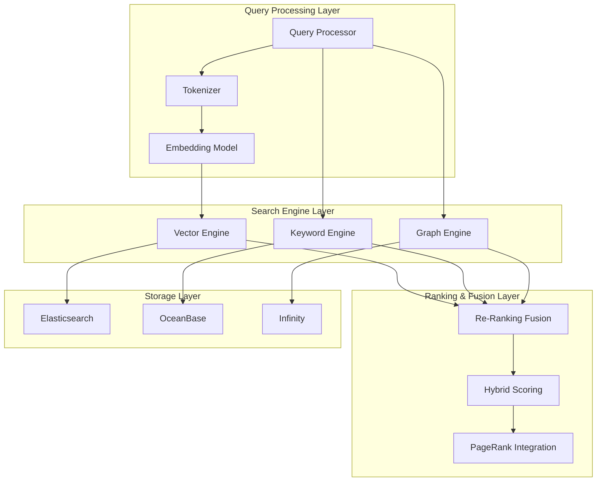

**Diagram sources**
- [rag/nlp/search.py](file://rag/nlp/search.py#L36-L40)
- [graphrag/search.py](file://graphrag/search.py#L35-L40)

The architecture supports multiple backend storage systems including Elasticsearch, OceanBase, and Infinity, providing flexibility in deployment scenarios while maintaining consistent search interfaces.

**Section sources**
- [rag/nlp/search.py](file://rag/nlp/search.py#L36-L40)
- [graphrag/search.py](file://graphrag/search.py#L35-L40)

## Core Search Components

### Dealer Class - Central Search Orchestrator

The `Dealer` class serves as the central orchestrator for all search operations, providing a unified interface for different retrieval methods:

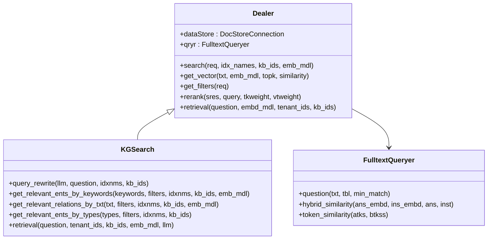

**Diagram sources**
- [rag/nlp/search.py](file://rag/nlp/search.py#L36-L40)
- [graphrag/search.py](file://graphrag/search.py#L35-L40)
- [rag/nlp/query.py](file://rag/nlp/query.py#L26-L30)

### Search Result Structure

The system uses a standardized result structure that captures various aspects of search performance:

| Field | Type | Description |
|-------|------|-------------|
| total | int | Total number of matching documents |
| ids | list[str] | Unique identifiers of matched chunks |
| query_vector | list[float] | Vector representation of the query |
| field | dict | Complete metadata for each result |
| highlight | dict | Highlighted text segments |
| aggregation | dict/list | Statistical aggregations |
| keywords | list[str] | Extracted keywords from query |

**Section sources**
- [rag/nlp/search.py](file://rag/nlp/search.py#L41-L51)

## Multiple Recall Methods

### Dense Vector Search

Vector search forms the backbone of modern semantic retrieval, enabling the system to find semantically similar content regardless of exact keyword matches:

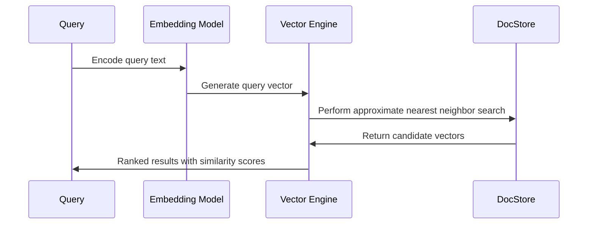

**Diagram sources**
- [rag/nlp/search.py](file://rag/nlp/search.py#L52-L60)

The vector search process involves:
- **Query Encoding**: Converting text queries into high-dimensional vector representations
- **Approximate Nearest Neighbor**: Using efficient algorithms to find similar vectors
- **Similarity Thresholding**: Filtering results based on configurable similarity thresholds
- **Top-K Selection**: Limiting results to the most relevant candidates

### Sparse Keyword Matching

Traditional keyword-based search ensures coverage of exact term matches and provides complementary signals to vector search:

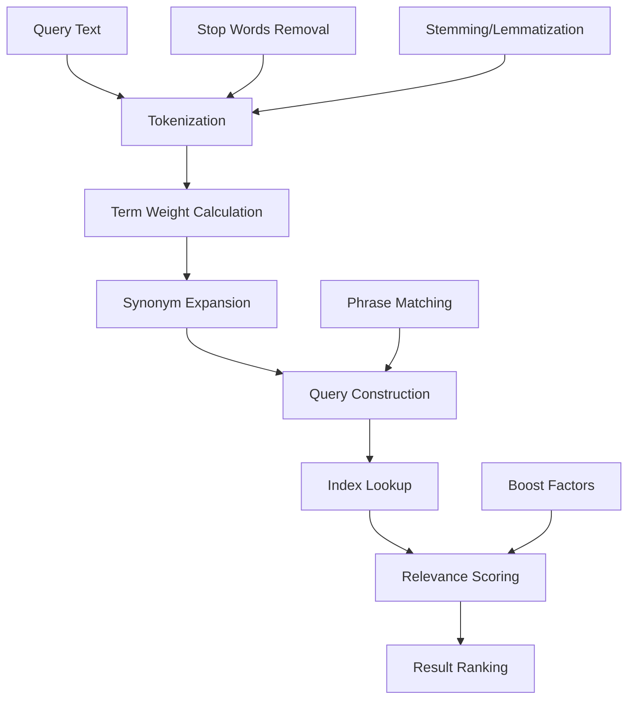

**Diagram sources**
- [rag/nlp/query.py](file://rag/nlp/query.py#L85-L132)

### Knowledge Graph Traversal

The knowledge graph component enables retrieval based on semantic relationships and entity connections:

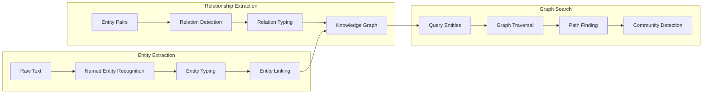

**Diagram sources**
- [graphrag/general/graph_extractor.py](file://graphrag/general/graph_extractor.py#L100-L151)

**Section sources**
- [rag/nlp/search.py](file://rag/nlp/search.py#L120-L145)
- [rag/nlp/query.py](file://rag/nlp/query.py#L85-L132)
- [graphrag/search.py](file://graphrag/search.py#L108-L140)

## Fused Re-Ranking System

### Hybrid Similarity Computation

The system computes multiple similarity scores simultaneously and combines them through intelligent weighting:

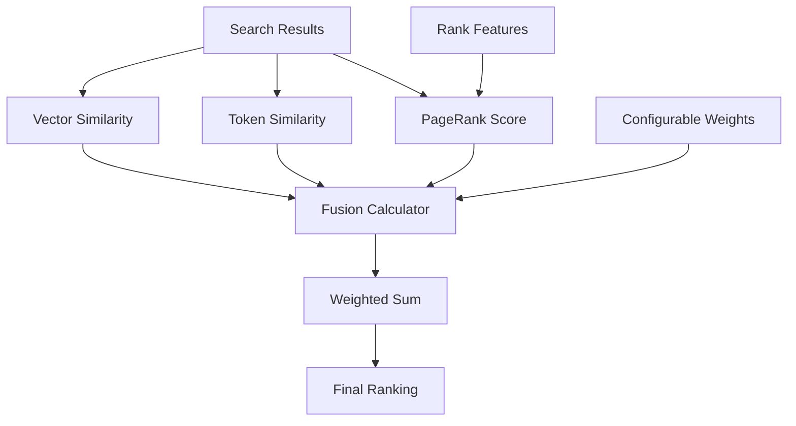

**Diagram sources**
- [rag/nlp/search.py](file://rag/nlp/search.py#L322-L328)

### Re-Ranking Models

The system supports multiple re-ranking models to improve result quality:

| Model | Provider | Use Case | Performance |
|-------|----------|----------|-------------|
| Jina Rerank | Jina AI | Multilingual documents | High accuracy |
| Cohere | Cohere | Enterprise applications | Balanced performance |
| Baidu Yiyan | Baidu | Chinese content | Optimized for Asian languages |
| LocalAI | Self-hosted | Privacy-sensitive deployments | Configurable |

### Fusion Strategies

The system employs several fusion strategies to combine different retrieval signals:

1. **Weighted Sum Fusion**: Linear combination of scores with configurable weights
2. **Reciprocal Rank Fusion**: Combines rankings from different methods
3. **Late Fusion**: Applies re-ranking after initial retrieval
4. **Early Fusion**: Combines signals at the query level

**Section sources**
- [rag/nlp/search.py](file://rag/nlp/search.py#L330-L351)
- [rag/llm/rerank_model.py](file://rag/llm/rerank_model.py#L40-L505)

## Knowledge Graph Integration

### Entity and Relation Extraction

The knowledge graph system extracts entities and relationships from documents to create a structured representation:

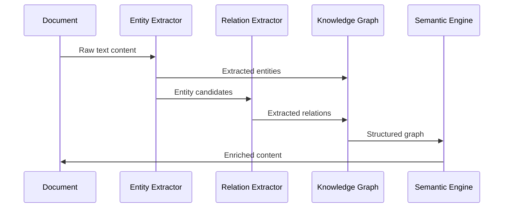

**Diagram sources**
- [graphrag/general/graph_extractor.py](file://graphrag/general/graph_extractor.py#L100-L151)

### Community Detection and Reports

The system automatically generates community reports that summarize clusters of related entities:

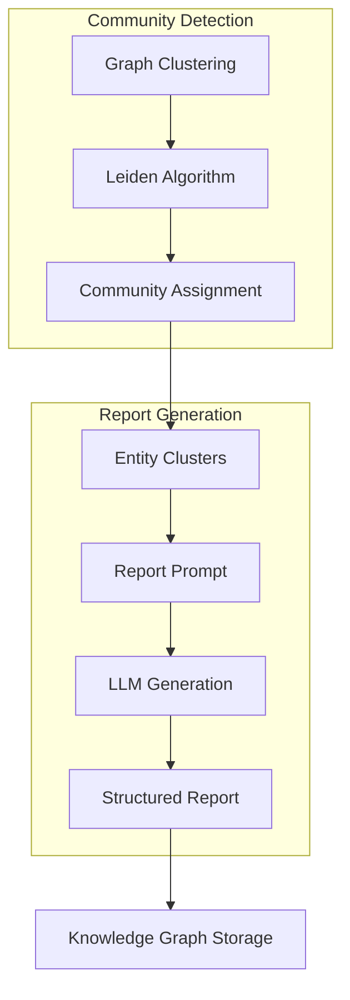

**Diagram sources**
- [graphrag/general/community_reports_extractor.py](file://graphrag/general/community_reports_extractor.py#L65-L155)

### Graph-Based Retrieval

The knowledge graph enables sophisticated retrieval strategies:

1. **Entity-Centric Search**: Find documents containing specific entities
2. **Relation-Based Discovery**: Explore connections between entities
3. **Path Traversal**: Follow relationships to discover related content
4. **Community Exploration**: Browse clusters of related topics

**Section sources**
- [graphrag/search.py](file://graphrag/search.py#L108-L140)
- [graphrag/general/community_reports_extractor.py](file://graphrag/general/community_reports_extractor.py#L38-L180)

## Graph-Based RAG Capabilities

### Mind Map Generation

The system can generate hierarchical mind maps from extracted knowledge:

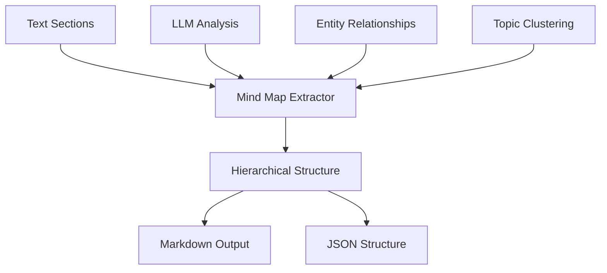

**Diagram sources**
- [graphrag/general/mind_map_extractor.py](file://graphrag/general/mind_map_extractor.py#L81-L180)

### Community Reports

Automatically generated reports provide summaries of entity communities:

| Component | Description | Output Format |
|-----------|-------------|---------------|
| Entity Summary | List of entities in community | CSV/JSON |
| Relationship Analysis | Key relationships and patterns | Markdown |
| Evidence Collection | Supporting evidence for claims | Structured text |
| Rating System | Quality assessment of community | Numeric score |

### Entity Resolution

The system resolves entity mentions to canonical entities:

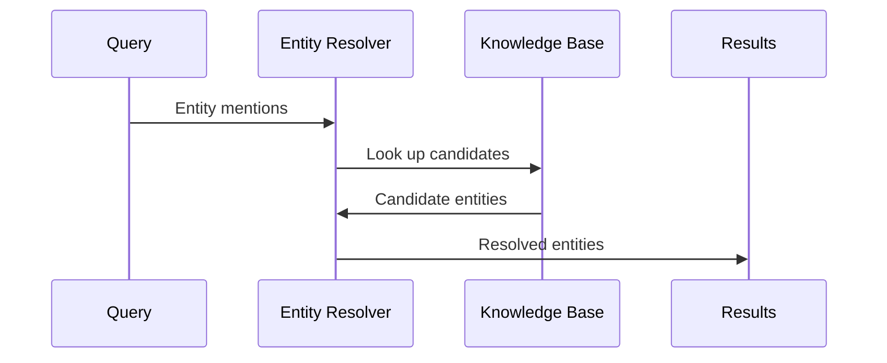

**Diagram sources**
- [graphrag/entity_resolution.py](file://graphrag/entity_resolution.py)

**Section sources**
- [graphrag/general/mind_map_extractor.py](file://graphrag/general/mind_map_extractor.py#L39-L180)
- [graphrag/general/community_reports_extractor.py](file://graphrag/general/community_reports_extractor.py#L30-L180)

## Search Configuration and Parameters

### Core Configuration Options

The system provides extensive configuration options for fine-tuning search behavior:

| Parameter | Type | Default | Description |
|-----------|------|---------|-------------|
| similarity_threshold | float | 0.2 | Minimum similarity score for results |
| vector_similarity_weight | float | 0.3 | Weight for vector search vs. keyword search |
| top_k | int | 1024 | Maximum number of results to retrieve |
| ent_topn | int | 6 | Number of entities to return |
| rel_topn | int | 6 | Number of relations to return |
| max_token | int | 8196 | Maximum tokens for knowledge graph results |

### Advanced Parameters

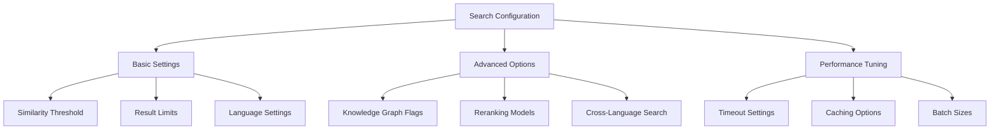

**Diagram sources**
- [web/src/components/similarity-slider/index.tsx](file://web/src/components/similarity-slider/index.tsx#L18-L50)

### Parameter Impact Analysis

Different parameter combinations affect search performance in distinct ways:

1. **High Similarity Threshold**: More precise but potentially fewer results
2. **High Vector Weight**: Emphasizes semantic similarity over keyword matching
3. **Large Top-K**: Improves recall but increases processing time
4. **Knowledge Graph Enabled**: Enhances contextual understanding but adds latency

**Section sources**
- [api/apps/sdk/session.py](file://api/apps/sdk/session.py#L953-L981)
- [web/src/components/similarity-slider/index.tsx](file://web/src/components/similarity-slider/index.tsx#L18-L93)

## Performance Optimization

### Indexing Strategies

The system employs multiple indexing strategies for optimal performance:

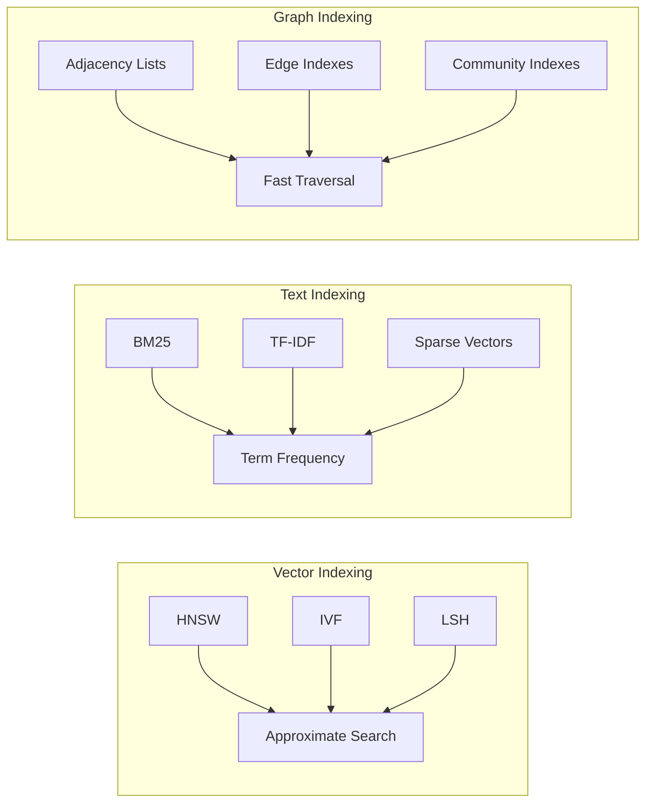

### Caching Mechanisms

The system implements multi-level caching to improve response times:

1. **Query Result Caching**: Stores frequently accessed results
2. **Embedding Caching**: Reuses computed embeddings
3. **Graph Structure Caching**: Maintains pre-computed graph metrics
4. **LLM Response Caching**: Caches expensive language model calls

### Parallel Processing

Search operations leverage parallel processing for improved throughput:

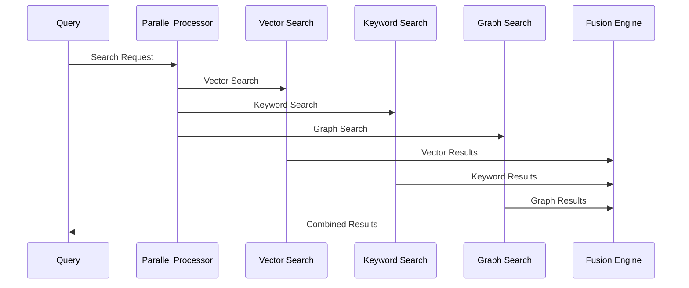

**Section sources**
- [rag/nlp/search.py](file://rag/nlp/search.py#L380-L382)

## Common Issues and Solutions

### Retrieval Accuracy Problems

**Issue**: Low precision in search results
**Causes**: 
- Insufficient training data for embedding models
- Poor query formulation
- Suboptimal similarity thresholds

**Solutions**:
1. Adjust similarity thresholds based on domain characteristics
2. Implement query expansion techniques
3. Use reranking models to improve result quality
4. Fine-tune embedding models on domain-specific data

### Performance Bottlenecks

**Issue**: Slow search response times
**Causes**:
- Large result sets
- Complex graph traversals
- Inefficient indexing

**Solutions**:
1. Implement result limiting and pagination
2. Use approximate algorithms for large-scale graphs
3. Optimize index structures for common query patterns
4. Add caching for frequently accessed results

### Memory Management

**Issue**: High memory consumption during search
**Causes**:
- Large embedding matrices
- Complex graph structures
- Inefficient data structures

**Solutions**:
1. Use quantized embeddings for reduced memory footprint
2. Implement streaming processing for large datasets
3. Optimize graph storage formats
4. Add garbage collection for temporary objects

### Knowledge Graph Issues

**Issue**: Poor knowledge graph performance
**Causes**:
- Incomplete entity extraction
- Weak relationship detection
- Insufficient graph structure

**Solutions**:
1. Improve entity extraction accuracy
2. Enhance relationship extraction models
3. Implement graph pruning for noise reduction
4. Add graph normalization techniques

**Section sources**
- [rag/nlp/search.py](file://rag/nlp/search.py#L134-L145)

## Implementation Examples

### Basic Vector Search

```python
# Example: Basic vector search implementation
def basic_vector_search(query, embedding_model, knowledge_base):
    # Generate query embedding
    query_vector = embedding_model.encode(query)
    
    # Perform vector search
    results = doc_store.search(
        fields=["content", "metadata"],
        match_exprs=[MatchDenseExpr(
            vector_column_name="embedding_vector",
            embedding_data=query_vector,
            embedding_data_type="float",
            distance_type="cosine",
            topn=10
        )],
        filters={"kb_id": knowledge_base.id}
    )
    
    return results
```

### Knowledge Graph Enhanced Search

```python
# Example: Knowledge graph enhanced search
def kg_enhanced_search(query, embedding_model, llm_model, knowledge_base):
    # Extract entities and relations
    kg_search = KGSearch(doc_store_connection)
    
    # Get graph-based results
    graph_results = kg_search.retrieval(
        question=query,
        tenant_ids=[knowledge_base.tenant_id],
        kb_ids=[knowledge_base.id],
        emb_mdl=embedding_model,
        llm=llm_model,
        max_token=4096
    )
    
    # Combine with traditional search
    traditional_results = dealer.search(
        req={"question": query, "kb_ids": [knowledge_base.id]},
        idx_names=[index_name(knowledge_base.tenant_id)],
        kb_ids=[knowledge_base.id],
        emb_mdl=embedding_model
    )
    
    return combine_results(graph_results, traditional_results)
```

### Fused Re-ranking Implementation

```python
# Example: Fused re-ranking
def fused_re_ranking(results, query, rerank_model):
    # Extract content for re-ranking
    content_list = [result["content"] for result in results]
    
    # Get reranking scores
    rerank_scores, _ = rerank_model.similarity(query, content_list)
    
    # Combine with original scores
    for i, result in enumerate(results):
        result["final_score"] = (
            result["vector_similarity"] * 0.7 +
            rerank_scores[i] * 0.3
        )
    
    return sorted(results, key=lambda x: x["final_score"], reverse=True)
```

**Section sources**
- [rag/nlp/search.py](file://rag/nlp/search.py#L52-L60)
- [graphrag/search.py](file://graphrag/search.py#L142-L339)

## Best Practices

### Query Optimization

1. **Use Specific Queries**: More specific queries yield better results
2. **Implement Query Expansion**: Automatically expand queries with synonyms
3. **Balance Precision and Recall**: Adjust thresholds based on use case
4. **Monitor Query Patterns**: Analyze frequently used queries for optimization

### Configuration Management

1. **Environment-Specific Settings**: Different configurations for dev/prod
2. **A/B Testing**: Compare different parameter combinations
3. **Monitoring and Alerting**: Track search performance metrics
4. **Documentation**: Maintain configuration documentation

### Performance Monitoring

1. **Response Time Tracking**: Monitor average and percentile response times
2. **Accuracy Metrics**: Track precision, recall, and F1 scores
3. **Resource Utilization**: Monitor CPU, memory, and storage usage
4. **Error Rate Analysis**: Track and investigate failures

### Scalability Considerations

1. **Horizontal Scaling**: Distribute load across multiple instances
2. **Index Partitioning**: Split large indexes for better performance
3. **Caching Strategies**: Implement appropriate caching levels
4. **Batch Processing**: Use batch operations for bulk updates

### Security and Privacy

1. **Access Control**: Implement proper authentication and authorization
2. **Data Encryption**: Encrypt sensitive data at rest and in transit
3. **Audit Logging**: Log all search activities for compliance
4. **Privacy Protection**: Implement data anonymization where needed

The RAGFlow search and retrieval system provides a comprehensive foundation for building sophisticated information retrieval applications. By leveraging multiple recall methods, intelligent fusion, and knowledge graph technologies, it delivers both accuracy and performance at scale.