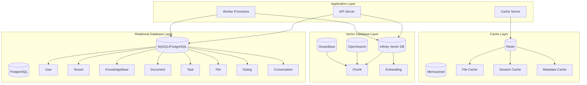
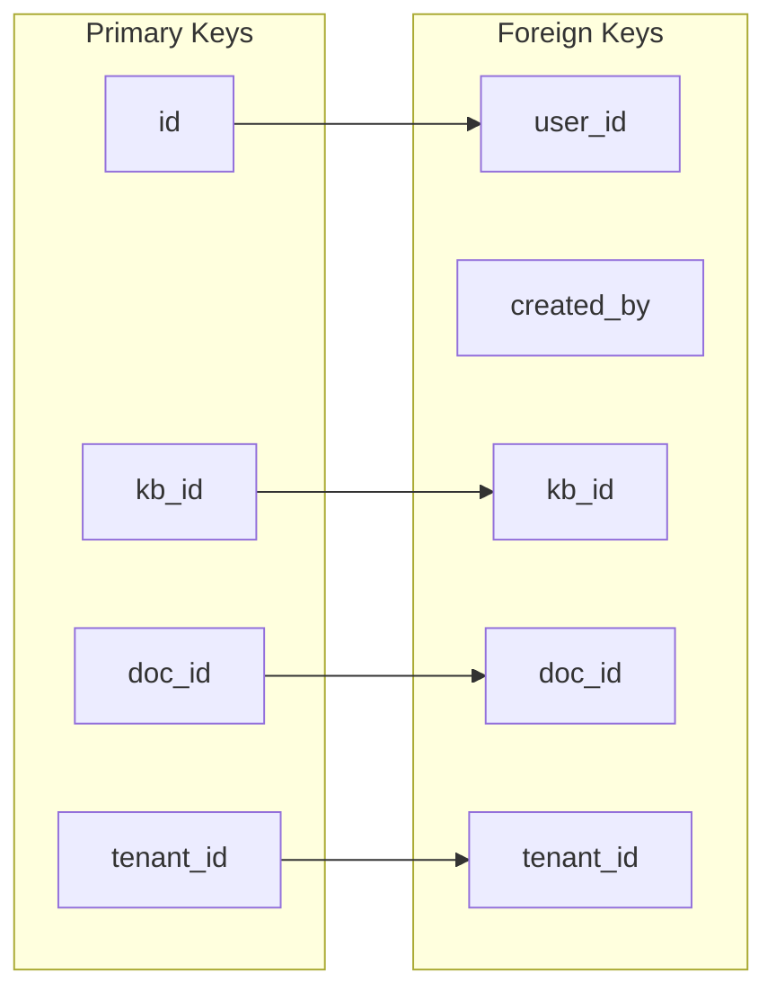
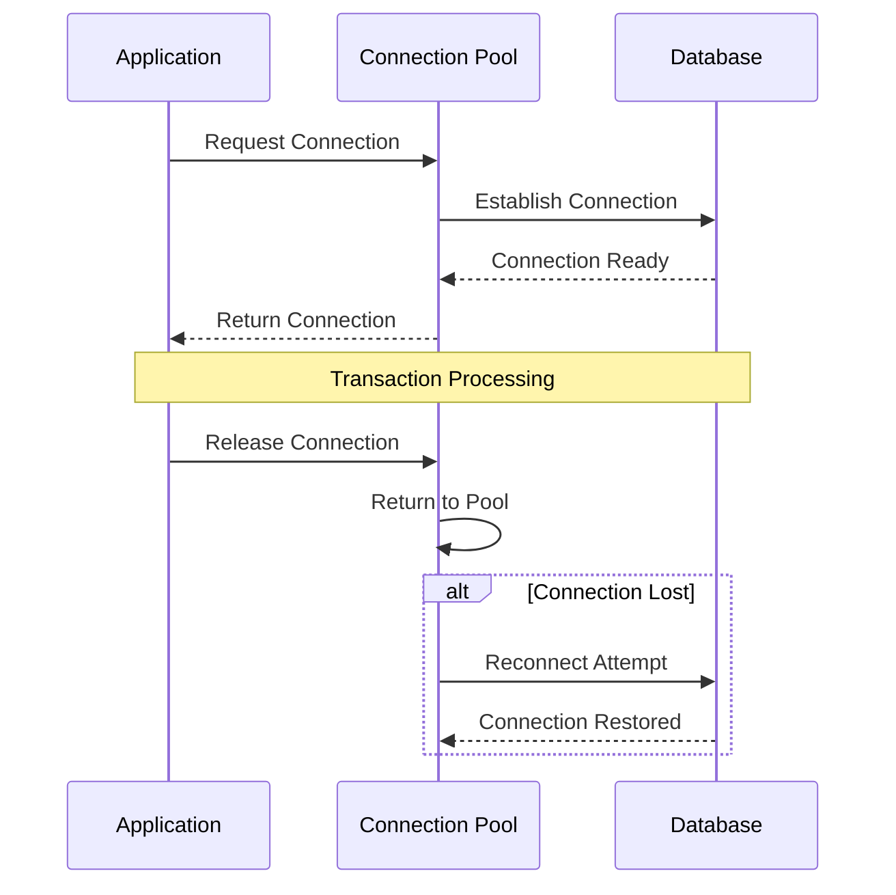
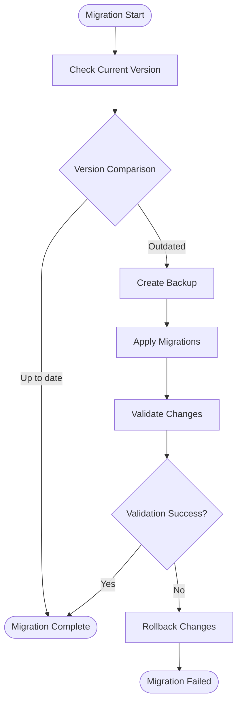

# Data Models & Database Schema

<cite>
**Referenced Files in This Document**
- [api/db/db_models.py](file://api/db/db_models.py)
- [api/db/init_data.py](file://api/db/init_data.py)
- [api/db/db_utils.py](file://api/db/db_utils.py)
- [api/db/services/common_service.py](file://api/db/services/common_service.py)
- [api/db/services/document_service.py](file://api/db/services/document_service.py)
- [rag/utils/infinity_conn.py](file://rag/utils/infinity_conn.py)
- [rag/utils/doc_store_conn.py](file://rag/utils/doc_store_conn.py)
- [rag/utils/ob_conn.py](file://rag/utils/ob_conn.py)
- [rag/svr/cache_file_svr.py](file://rag/svr/cache_file_svr.py)
- [rag/utils/redis_conn.py](file://rag/utils/redis_conn.py)
- [api/db/runtime_config.py](file://api/db/runtime_config.py)
</cite>

## Table of Contents
1. [Introduction](#introduction)
2. [Database Architecture Overview](#database-architecture-overview)
3. [Core Data Models](#core-data-models)
4. [Entity Relationships](#entity-relationships)
5. [Database Schema Design](#database-schema-design)
6. [Data Validation and Business Rules](#data-validation-and-business-rules)
7. [Performance Optimization](#performance-optimization)
8. [Data Lifecycle Management](#data-lifecycle-management)
9. [Security and Access Control](#security-and-access-control)
10. [Migration and Version Management](#migration-and-version-management)
11. [Sample Data and Use Cases](#sample-data-and-use-cases)
12. [Troubleshooting Guide](#troubleshooting-guide)

## Introduction

RAGFlow implements a sophisticated multi-layered database architecture designed to handle large-scale document processing, knowledge base management, and AI-powered search capabilities. The system employs a hybrid approach combining traditional relational databases with modern vector databases to support both structured data storage and semantic search operations.

The database schema is built around several core entities: Documents, KnowledgeBases, Users, Tasks, Chunks, and Embeddings. These entities form a comprehensive ecosystem that supports document ingestion, processing, storage, retrieval, and management workflows.

## Database Architecture Overview

RAGFlow's database architecture consists of multiple interconnected components designed for scalability, performance, and reliability:



**Diagram sources**
- [api/db/db_models.py](file://api/db/db_models.py#L546-L548)
- [rag/utils/infinity_conn.py](file://rag/utils/infinity_conn.py#L1-L50)
- [rag/utils/redis_conn.py](file://rag/utils/redis_conn.py#L85-L101)

**Section sources**
- [api/db/db_models.py](file://api/db/db_models.py#L388-L404)
- [rag/utils/infinity_conn.py](file://rag/utils/infinity_conn.py#L197-L224)

## Core Data Models

### User Model

The User model represents individual users in the system with comprehensive authentication and profile management capabilities.

| Field | Type | Constraints | Description |
|-------|------|-------------|-------------|
| id | CharField(32) | Primary Key | Unique user identifier |
| access_token | CharField(255) | Indexed | Authentication token |
| nickname | CharField(100) | Not Null, Indexed | User display name |
| password | CharField(255) | Indexed | Hashed password |
| email | CharField(255) | Not Null, Indexed | User email address |
| avatar | TextField | Nullable | Base64 encoded avatar |
| language | CharField(32) | Default: "English/Chinese" | User interface language |
| color_schema | CharField(32) | Default: "Bright/Dark" | UI theme preference |
| timezone | CharField(64) | Default: "UTC+8" | User timezone |
| last_login_time | DateTimeField | Indexed | Last login timestamp |
| is_authenticated | CharField(1) | Default: "1" | Authentication status |
| is_active | CharField(1) | Default: "1" | Account activation status |
| is_anonymous | CharField(1) | Default: "0" | Anonymous user flag |
| login_channel | CharField | Nullable, Indexed | Login source channel |
| status | CharField(1) | Default: "1", Indexed | User status (0: inactive, 1: active) |
| is_superuser | BooleanField | Default: False, Indexed | Superuser privilege |

### Tenant Model

The Tenant model manages multi-tenancy support, allowing organizations to isolate their data and configurations.

| Field | Type | Constraints | Description |
|-------|------|-------------|-------------|
| id | CharField(32) | Primary Key | Tenant unique identifier |
| name | CharField(100) | Nullable, Indexed | Tenant display name |
| public_key | CharField(255) | Nullable, Indexed | Tenant public key |
| llm_id | CharField(128) | Not Null, Indexed | Default LLM model ID |
| embd_id | CharField(128) | Not Null, Indexed | Default embedding model ID |
| asr_id | CharField(128) | Not Null, Indexed | Default ASR model ID |
| img2txt_id | CharField(128) | Not Null, Indexed | Default image-to-text model ID |
| rerank_id | CharField(128) | Not Null, Indexed | Default reranking model ID |
| tts_id | CharField(256) | Nullable, Indexed | Default TTS model ID |
| parser_ids | CharField(256) | Not Null, Indexed | Available document parsers |
| credit | IntegerField | Default: 512, Indexed | Tenant credit balance |
| status | CharField(1) | Default: "1", Indexed | Tenant status (0: inactive, 1: active) |

### KnowledgeBase Model

The KnowledgeBase model represents collections of documents organized into searchable knowledge bases.

| Field | Type | Constraints | Description |
|-------|------|-------------|-------------|
| id | CharField(32) | Primary Key | Knowledge base identifier |
| avatar | TextField | Nullable | Base64 encoded avatar image |
| tenant_id | CharField(32) | Not Null, Indexed | Associated tenant ID |
| name | CharField(128) | Not Null, Indexed | Knowledge base name |
| language | CharField(32) | Default: "English/Chinese" | Content language |
| description | TextField | Nullable | Knowledge base description |
| embd_id | CharField(128) | Not Null, Indexed | Embedding model ID |
| permission | CharField(16) | Default: "me", Indexed | Access permission level |
| created_by | CharField(32) | Not Null, Indexed | Creator user ID |
| doc_num | IntegerField | Default: 0, Indexed | Document count |
| token_num | IntegerField | Default: 0, Indexed | Total token count |
| chunk_num | IntegerField | Default: 0, Indexed | Chunk count |
| similarity_threshold | FloatField | Default: 0.2, Indexed | Similarity threshold |
| vector_similarity_weight | FloatField | Default: 0.3, Indexed | Vector similarity weight |
| parser_id | CharField(32) | Not Null, Default: "naive", Indexed | Default parser ID |
| pipeline_id | CharField(32) | Nullable, Indexed | Pipeline configuration ID |
| parser_config | JSONField | Not Null, Default: {} | Parser configuration |
| pagerank | IntegerField | Default: 0 | PageRank score |
| graphrag_task_id | CharField(32) | Nullable, Indexed | GraphRAG task ID |
| graphrag_task_finish_at | DateTimeField | Nullable | GraphRAG completion time |
| raptor_task_id | CharField(32) | Nullable, Indexed | RAPTOR task ID |
| raptor_task_finish_at | DateTimeField | Nullable | RAPTOR completion time |
| mindmap_task_id | CharField(32) | Nullable, Indexed | MindMap task ID |
| mindmap_task_finish_at | DateTimeField | Nullable | MindMap completion time |
| status | CharField(1) | Default: "1", Indexed | Status (0: inactive, 1: active) |

### Document Model

The Document model tracks individual documents within knowledge bases, including processing status and metadata.

| Field | Type | Constraints | Description |
|-------|------|-------------|-------------|
| id | CharField(32) | Primary Key | Document identifier |
| thumbnail | TextField | Nullable | Base64 encoded thumbnail |
| kb_id | CharField(256) | Not Null, Indexed | Knowledge base ID |
| parser_id | CharField(32) | Not Null, Indexed | Parser identifier |
| pipeline_id | CharField(32) | Nullable, Indexed | Pipeline ID |
| parser_config | JSONField | Not Null, Default: {} | Parser configuration |
| source_type | CharField(128) | Not Null, Default: "local", Indexed | Source type |
| type | CharField(32) | Not Null, Indexed | File type |
| created_by | CharField(32) | Not Null, Indexed | Creator user ID |
| name | CharField(255) | Nullable, Indexed | Document name |
| location | CharField(255) | Nullable, Indexed | Storage location |
| size | IntegerField | Default: 0, Indexed | File size |
| token_num | IntegerField | Default: 0, Indexed | Token count |
| chunk_num | IntegerField | Default: 0, Indexed | Chunk count |
| progress | FloatField | Default: 0, Indexed | Processing progress |
| progress_msg | TextField | Nullable, Default: "" | Progress message |
| process_begin_at | DateTimeField | Nullable, Indexed | Processing start time |
| process_duration | FloatField | Default: 0 | Processing duration |
| meta_fields | JSONField | Nullable, Default: {} | Metadata fields |
| suffix | CharField(32) | Not Null, Default: "", Indexed | File extension |
| run | CharField(1) | Nullable, Default: "0", Indexed | Processing status |
| status | CharField(1) | Nullable, Default: "1", Indexed | Status (0: inactive, 1: active) |

### Task Model

The Task model manages asynchronous processing tasks for document processing and knowledge base operations.

| Field | Type | Constraints | Description |
|-------|------|-------------|-------------|
| id | CharField(32) | Primary Key | Task identifier |
| doc_id | CharField(32) | Not Null, Indexed | Associated document ID |
| from_page | IntegerField | Default: 0 | Starting page |
| to_page | IntegerField | Default: 100000000 | Ending page |
| task_type | CharField(32) | Not Null, Default: "" | Task type |
| priority | IntegerField | Default: 0 | Task priority |
| begin_at | DateTimeField | Nullable, Indexed | Task start time |
| process_duration | FloatField | Default: 0 | Processing duration |
| progress | FloatField | Default: 0, Indexed | Task progress |
| progress_msg | TextField | Nullable, Default: "" | Progress message |
| retry_count | IntegerField | Default: 0 | Retry attempts |
| digest | TextField | Nullable, Default: "" | Task digest |
| chunk_ids | LongTextField | Nullable, Default: "" | Associated chunk IDs |

**Section sources**
- [api/db/db_models.py](file://api/db/db_models.py#L598-L1297)

## Entity Relationships

The RAGFlow database schema implements a comprehensive entity relationship model that supports complex document processing workflows:

```mermaid
erDiagram
USER {
char id PK
varchar access_token UK
varchar nickname
varchar password
varchar email UK
text avatar
varchar language
varchar color_schema
varchar timezone
datetime last_login_time
varchar is_authenticated
varchar is_active
varchar is_anonymous
varchar login_channel
varchar status
boolean is_superuser
}
TENANT {
char id PK
varchar name
varchar public_key
varchar llm_id
varchar embd_id
varchar asr_id
varchar img2txt_id
varchar rerank_id
varchar tts_id
varchar parser_ids
integer credit
varchar status
}
USER_TENANT {
char id PK
char user_id FK
char tenant_id FK
varchar role
char invited_by FK
varchar status
}
KNOWLEDGEBASE {
char id PK
text avatar
char tenant_id FK
varchar name
varchar language
text description
varchar embd_id
varchar permission
char created_by FK
integer doc_num
integer token_num
integer chunk_num
float similarity_threshold
float vector_similarity_weight
varchar parser_id
varchar pipeline_id
json parser_config
integer pagerank
varchar graphrag_task_id
datetime graphrag_task_finish_at
varchar raptor_task_id
datetime raptor_task_finish_at
varchar mindmap_task_id
datetime mindmap_task_finish_at
varchar status
}
DOCUMENT {
char id PK
text thumbnail
char kb_id FK
varchar parser_id
varchar pipeline_id
json parser_config
varchar source_type
varchar type
char created_by FK
varchar name
varchar location
integer size
integer token_num
integer chunk_num
float progress
text progress_msg
datetime process_begin_at
float process_duration
json meta_fields
varchar suffix
varchar run
varchar status
}
TASK {
char id PK
char doc_id FK
integer from_page
integer to_page
varchar task_type
integer priority
datetime begin_at
float process_duration
float progress
text progress_msg
integer retry_count
text digest
longtext chunk_ids
}
FILE {
char id PK
char parent_id FK
char tenant_id FK
char created_by FK
varchar name
varchar location
integer size
varchar type
varchar source_type
}
CHUNK {
char id PK
char doc_id FK
varchar content
json meta_data
float similarity
varchar vector_field
integer position
integer page_num
integer top
integer left
integer width
integer height
varchar doc_name
varchar doc_id
varchar kb_id
varchar tenant_id
varchar available
}
USER --> TENANT : "belongs to"
USER_TENANT --> USER : "belongs to"
USER_TENANT --> TENANT : "belongs to"
KNOWLEDGEBASE --> TENANT : "belongs to"
KNOWLEDGEBASE --> USER : "created by"
DOCUMENT --> KNOWLEDGEBASE : "belongs to"
DOCUMENT --> USER : "created by"
TASK --> DOCUMENT : "belongs to"
FILE --> TENANT : "belongs to"
FILE --> USER : "created by"
CHUNK --> DOCUMENT : "belongs to"
```

**Diagram sources**
- [api/db/db_models.py](file://api/db/db_models.py#L598-L1297)

### Relationship Details

1. **User-Tenant Relationship**: Many-to-many relationship managed through UserTenant junction table
2. **KnowledgeBase-Document Relationship**: One-to-many relationship with cascading deletes
3. **Document-Task Relationship**: One-to-many relationship for processing tasks
4. **Document-Chunk Relationship**: One-to-many relationship for document segmentation
5. **Tenant-LLM Relationship**: One-to-many relationship for model configurations
6. **File-Document Relationship**: Many-to-one relationship through File2Document junction

**Section sources**
- [api/db/db_models.py](file://api/db/db_models.py#L645-L1297)

## Database Schema Design

### Indexing Strategy

RAGFlow implements a comprehensive indexing strategy to optimize query performance across different access patterns:

| Index Type | Fields | Purpose | Performance Impact |
|------------|--------|---------|-------------------|
| Primary Key | id | Unique record identification | O(1) lookup |
| Composite Index | (kb_id, create_time) | Knowledge base document queries | O(log n) |
| Composite Index | (tenant_id, created_by) | Multi-tenancy isolation | O(log n) |
| Full-text Index | name, description | Text search operations | O(log n) |
| Range Index | create_time, update_time | Time-based queries | O(log n) |
| Vector Index | embedding vectors | Semantic search | O(log n) |
| Hash Index | access_token | Authentication lookups | O(1) |

### Foreign Key Constraints

The schema implements comprehensive referential integrity through foreign key constraints:



**Diagram sources**
- [api/db/db_models.py](file://api/db/db_models.py#L598-L1297)

### Data Types and Constraints

The schema uses optimized data types for different data characteristics:

- **UUID-based IDs**: Using CharField(32) for consistent UUID representation
- **Timestamp fields**: BigIntegerField for high precision time tracking
- **JSON fields**: JSONField for flexible metadata storage
- **Long text fields**: LongTextField for large content storage
- **Boolean fields**: CharField(1) with "0"/"1" encoding for space efficiency

**Section sources**
- [api/db/db_models.py](file://api/db/db_models.py#L134-L235)

## Data Validation and Business Rules

### Validation Rules Implementation

RAGFlow implements comprehensive data validation at multiple levels:

#### Field-Level Validation
- **Length constraints**: CharField length limits prevent data corruption
- **Null constraints**: Not null fields ensure data completeness
- **Default values**: Appropriate defaults prevent NULL values
- **Type validation**: Proper field types enforce data consistency

#### Business Logic Validation
- **Document processing**: Progress tracking ensures proper workflow execution
- **Tenant isolation**: Multi-tenancy enforced through tenant_id constraints
- **Permission management**: Role-based access control through UserTenant table
- **Resource limits**: Credit-based usage controls prevent abuse

#### Cross-Entity Validation
- **Referential integrity**: Foreign key constraints maintain data consistency
- **Cascade operations**: Proper cascade deletion prevents orphaned records
- **Unique constraints**: Composite keys prevent duplicate entries
- **Status validation**: Status fields ensure proper state transitions

### Business Rules

1. **Document Processing Workflow**: Documents progress through defined states (pending → processing → completed → failed)
2. **Knowledge Base Limits**: Each KB has configurable limits on documents, tokens, and chunks
3. **Tenant Quotas**: Tenants have credit-based quotas for API usage
4. **User Permissions**: Fine-grained permission system for resource access
5. **Data Retention**: Automatic cleanup of old tasks and temporary data

**Section sources**
- [api/db/services/common_service.py](file://api/db/services/common_service.py#L25-L35)
- [api/db/services/document_service.py](file://api/db/services/document_service.py#L112-L121)

## Performance Optimization

### Database Performance Strategies

#### Connection Pooling
RAGFlow implements robust connection pooling with retry mechanisms:



**Diagram sources**
- [api/db/db_models.py](file://api/db/db_models.py#L242-L375)

#### Batch Operations
- **Bulk inserts**: Batch size optimization reduces transaction overhead
- **Atomic transactions**: Group related operations for consistency
- **Lazy loading**: Eager loading strategies for frequently accessed data

#### Query Optimization
- **Indexed queries**: Strategic indexing for common query patterns
- **Query caching**: Redis-based query result caching
- **Pagination**: Efficient pagination for large datasets

### Vector Database Optimization

#### Indexing Strategy
- **IVF indices**: Inverted file indices for approximate nearest neighbor search
- **HNSW indices**: Hierarchical navigable small world graphs
- **Quantization**: Vector compression for memory efficiency

#### Search Optimization
- **Parallel processing**: Concurrent vector similarity calculations
- **Early termination**: Stop search when sufficient results found
- **Result ranking**: Multi-stage ranking for relevance scoring

**Section sources**
- [rag/utils/infinity_conn.py](file://rag/utils/infinity_conn.py#L453-L582)
- [rag/utils/redis_conn.py](file://rag/utils/redis_conn.py#L85-L234)

## Data Lifecycle Management

### Data Retention Policies

RAGFlow implements comprehensive data lifecycle management:

#### Temporary Data Cleanup
- **Processing logs**: Automatically cleaned up after successful completion
- **Temporary files**: Removed after document processing completion
- **Cache data**: TTL-based expiration for cached results

#### Archive Procedures
- **Old versions**: Automatic archiving of outdated document versions
- **Historical data**: Periodic archiving of historical processing data
- **Audit trails**: Structured audit trail retention

#### Data Migration
- **Schema migrations**: Automated schema evolution procedures
- **Data transformations**: Backward-compatible data format changes
- **Version compatibility**: Graceful degradation for older clients

### Backup and Recovery

#### Backup Strategies
- **Incremental backups**: Daily incremental backups with weekly full backups
- **Cross-region replication**: Geographic distribution for disaster recovery
- **Point-in-time recovery**: Transaction log-based recovery capabilities

#### Recovery Procedures
- **Automated failover**: Automatic database failover mechanisms
- **Data consistency checks**: Integrity verification after recovery
- **Rollback procedures**: Safe rollback of failed deployments

**Section sources**
- [api/db/db_utils.py](file://api/db/db_utils.py#L26-L52)
- [api/db/runtime_config.py](file://api/db/runtime_config.py#L20-L55)

## Security and Access Control

### Authentication and Authorization

#### User Authentication
- **Token-based authentication**: JWT-based access tokens with expiration
- **Multi-factor authentication**: Optional MFA support for sensitive operations
- **Session management**: Secure session handling with automatic logout

#### Access Control
- **Role-based access control**: Fine-grained permissions per role
- **Resource-level permissions**: Document and knowledge base level access control
- **Tenant isolation**: Complete tenant data separation

### Data Protection

#### Encryption
- **At-rest encryption**: AES-256 encryption for stored data
- **In-transit encryption**: TLS 1.3 for all network communications
- **Key management**: Hardware security module integration

#### Privacy Controls
- **Data anonymization**: Automatic anonymization of sensitive data
- **Access logging**: Comprehensive audit logging for all operations
- **Privacy by design**: GDPR-compliant data handling practices

### Security Monitoring

#### Threat Detection
- **Anomaly detection**: Machine learning-based anomaly detection
- **Security events**: Real-time security event monitoring
- **Incident response**: Automated incident response procedures

**Section sources**
- [api/db/services/common_service.py](file://api/db/services/common_service.py#L1-L347)

## Migration and Version Management

### Database Migration System

RAGFlow implements a robust migration system for schema evolution:

#### Migration Architecture


**Diagram sources**
- [api/db/db_models.py](file://api/db/db_models.py#L1116-L1297)

#### Migration Features
- **Automatic migrations**: Schema changes applied automatically
- **Rollback support**: Ability to rollback failed migrations
- **Dry-run mode**: Preview migration effects before execution
- **Version tracking**: Detailed version history and tracking

### Version Compatibility

#### Backward Compatibility
- **API versioning**: Versioned API endpoints for backward compatibility
- **Data format evolution**: Gradual data format evolution procedures
- **Graceful degradation**: Older clients work with newer servers

#### Upgrade Procedures
- **Zero-downtime upgrades**: Rolling upgrade procedures
- **Feature flags**: Gradual feature rollout capabilities
- **Testing procedures**: Comprehensive testing before production deployment

**Section sources**
- [api/db/db_models.py](file://api/db/db_models.py#L1116-L1297)

## Sample Data and Use Cases

### Typical Data Patterns

#### Document Processing Workflow
```json
{
  "user": {
    "id": "user_001",
    "email": "user@example.com",
    "tenant_id": "tenant_001"
  },
  "tenant": {
    "id": "tenant_001",
    "name": "Example Corp",
    "llm_id": "gpt-4",
    "embd_id": "text-embedding-ada-002"
  },
  "knowledge_base": {
    "id": "kb_001",
    "name": "Customer Support Docs",
    "tenant_id": "tenant_001",
    "created_by": "user_001"
  },
  "document": {
    "id": "doc_001",
    "kb_id": "kb_001",
    "name": "FAQ.pdf",
    "type": "pdf",
    "size": 1048576,
    "status": "1"
  },
  "task": {
    "id": "task_001",
    "doc_id": "doc_001",
    "task_type": "parse",
    "progress": 0.75,
    "status": "1"
  }
}
```

#### Knowledge Base Structure
```json
{
  "knowledge_base": {
    "id": "kb_002",
    "name": "Technical Documentation",
    "language": "English",
    "similarity_threshold": 0.3,
    "vector_similarity_weight": 0.4,
    "parser_config": {
      "pages": [[1, 100]],
      "table_context_size": 2,
      "image_context_size": 1
    }
  },
  "documents": [
    {
      "id": "doc_002",
      "name": "API Reference.pdf",
      "type": "pdf",
      "token_num": 15000,
      "chunk_num": 150
    },
    {
      "id": "doc_003",
      "name": "Installation Guide.docx",
      "type": "docx",
      "token_num": 8000,
      "chunk_num": 80
    }
  ]
}
```

### Common Use Cases

#### Enterprise Knowledge Management
- **Multi-tenant isolation**: Separate environments for different departments
- **Access control**: Role-based document access and editing permissions
- **Version control**: Track document versions and changes over time

#### Document Processing Pipeline
- **Batch processing**: Handle large volumes of documents efficiently
- **Progress tracking**: Monitor processing status and completion rates
- **Error handling**: Robust error recovery and retry mechanisms

#### Search and Retrieval
- **Hybrid search**: Combine vector and keyword search for best results
- **Re-ranking**: Advanced re-ranking algorithms for result quality
- **Context awareness**: Maintain conversation context across sessions

**Section sources**
- [api/db/init_data.py](file://api/db/init_data.py#L41-L75)
- [api/db/services/document_service.py](file://api/db/services/document_service.py#L45-L77)

## Troubleshooting Guide

### Common Issues and Solutions

#### Database Connection Issues
- **Problem**: Connection timeouts or failures
- **Solution**: Check connection pool configuration and database health
- **Prevention**: Implement connection retry logic and health checks

#### Performance Degradation
- **Problem**: Slow query performance
- **Solution**: Review indexing strategy and query optimization
- **Prevention**: Regular performance monitoring and index maintenance

#### Data Consistency Issues
- **Problem**: Inconsistent data across tables
- **Solution**: Verify foreign key constraints and transaction boundaries
- **Prevention**: Implement proper transaction handling and validation

#### Migration Failures
- **Problem**: Schema migration failures
- **Solution**: Check migration logs and rollback failed changes
- **Prevention**: Test migrations in staging environment first

### Monitoring and Diagnostics

#### Health Checks
- **Database connectivity**: Regular connectivity tests
- **Query performance**: Monitor slow queries and timeouts
- **Resource utilization**: Track CPU, memory, and disk usage

#### Logging and Alerting
- **Error logging**: Comprehensive error logging with stack traces
- **Performance metrics**: Key performance indicators monitoring
- **Alert systems**: Proactive alerting for critical issues

**Section sources**
- [api/db/db_models.py](file://api/db/db_models.py#L242-L375)
- [rag/utils/redis_conn.py](file://rag/utils/redis_conn.py#L103-L110)