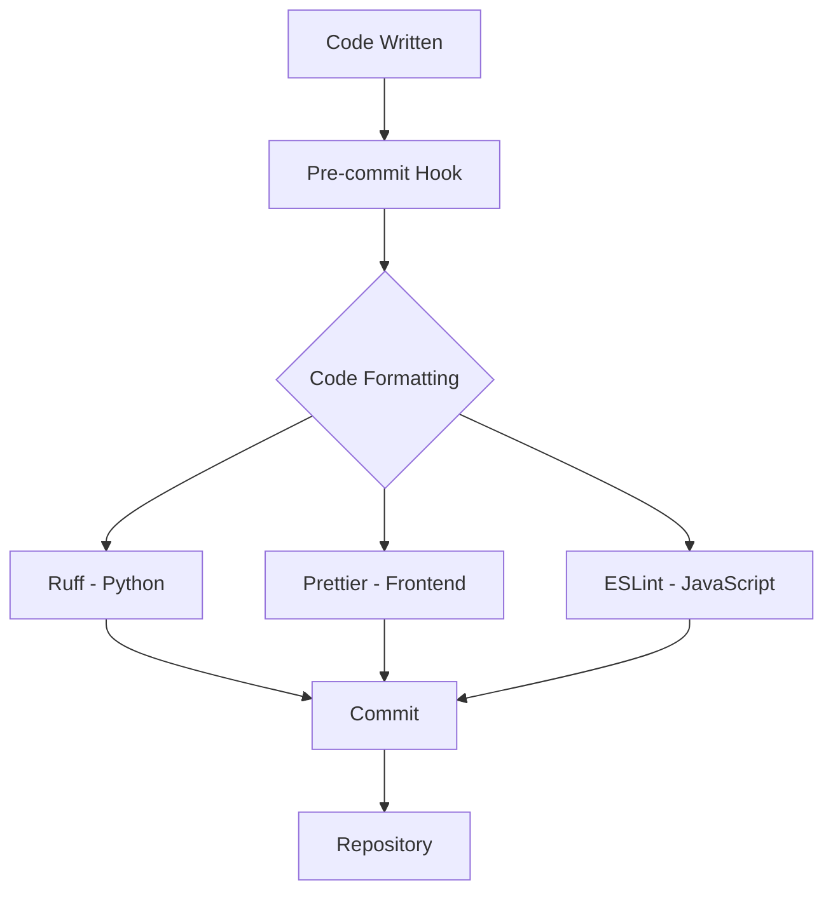
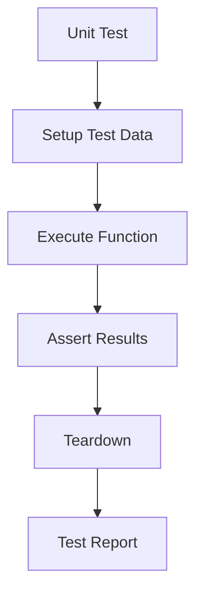
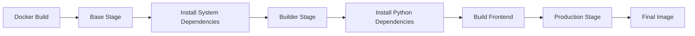
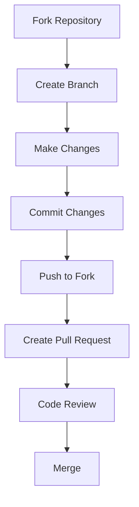

# Development Guide

<cite>
**Referenced Files in This Document**   
- [README.md](file://README.md)
- [pyproject.toml](file://pyproject.toml)
- [docker-compose.yml](file://docker/docker-compose.yml)
- [entrypoint.sh](file://docker/entrypoint.sh)
- [launch_backend_service.sh](file://docker/launch_backend_service.sh)
- [package.json](file://web/package.json)
- [contributing.md](file://docs/contribution/contributing.md)
- [launch_ragflow_from_source.md](file://docs/develop/launch_ragflow_from_source.md)
- [test_string_utils.py](file://test/unit_test/common/test_string_utils.py)
- [.pre-commit-config.yaml](file://.pre-commit-config.yaml)
- [Dockerfile](file://Dockerfile)
</cite>

## Table of Contents
1. [Introduction](#introduction)
2. [Development Environment Setup](#development-environment-setup)
3. [Development Workflow](#development-workflow)
4. [Coding Standards](#coding-standards)
5. [Testing Practices](#testing-practices)
6. [Build and Compilation](#build-and-compilation)
7. [Common Development Tasks](#common-development-tasks)
8. [Contribution Process](#contribution-process)
9. [Debugging and Optimization](#debugging-and-optimization)
10. [Documentation Generation](#documentation-generation)
11. [CI/CD Pipeline](#cicd-pipeline)

## Introduction

This development guide provides comprehensive information for contributing to RAGFlow, an open-source Retrieval-Augmented Generation (RAG) engine that combines deep document understanding with Agent capabilities. The guide covers the complete development lifecycle, from environment setup to contribution processes, ensuring developers can effectively contribute to the project.

RAGFlow offers a streamlined RAG workflow adaptable to enterprises of any scale, powered by a converged context engine and pre-built agent templates. This guide will help developers understand the architecture, setup their development environment, and follow best practices for contributing to the project.

**Section sources**
- [README.md](file://README.md#L73-L75)

## Development Environment Setup

### Prerequisites

Before setting up the development environment, ensure your system meets the following requirements:

- CPU: 4 cores or more
- RAM: 16 GB or more
- Disk: 50 GB or more
- Docker: Version 24.0.0 or higher
- Docker Compose: Version v2.26.1 or higher
- Python: Version 3.10 to 3.12

For developers who intend to use the code executor (sandbox) feature, gVisor must also be installed.

**Section sources**
- [README.md](file://README.md#L146-L150)

### Code Checkout

To begin development, clone the RAGFlow repository from GitHub:

```bash
git clone https://github.com/infiniflow/ragflow.git
cd ragflow/
```

This will create a local copy of the repository that you can use for development and contribution.

**Section sources**
- [README.md](file://README.md#L181-L183)

### Dependency Installation

RAGFlow uses `uv` as the Python package manager. Install the required dependencies using the following commands:

```bash
# Install uv and pre-commit
pipx install uv pre-commit

# Install Python dependencies
uv sync --python 3.10
uv run download_deps.py
pre-commit install
```

For the frontend, navigate to the web directory and install npm dependencies:

```bash
cd web
npm install
```

The project uses a comprehensive set of Python dependencies specified in pyproject.toml, including key packages for RAG functionality, document processing, and AI integration.

**Section sources**
- [README.md](file://README.md#L310-L320)
- [pyproject.toml](file://pyproject.toml#L1-L158)
- [package.json](file://web/package.json#L1-L122)

## Development Workflow

### Backend Service Launch

To launch the backend service for development, follow these steps:

1. Start the dependent services using Docker Compose:
```bash
docker compose -f docker/docker-compose-base.yml up -d
```

2. Add the following line to `/etc/hosts` to resolve all hosts specified in docker/.env to `127.0.0.1`:
```bash
127.0.0.1       es01 infinity mysql minio redis sandbox-executor-manager
```

3. Launch the backend service:
```bash
source .venv/bin/activate
export PYTHONPATH=$(pwd)
bash docker/launch_backend_service.sh
```

**Section sources**
- [README.md](file://README.md#L323-L354)

### Frontend Service Launch

After launching the backend service, start the frontend development server:

```bash
cd web
npm run dev
```

This will start the frontend service in development mode, allowing for hot reloading and real-time updates during development.

**Section sources**
- [README.md](file://README.md#L359-L365)

### Service Termination

When development is complete, stop the RAGFlow services:

```bash
pkill -f "ragflow_server.py|task_executor.py"
```

This command will terminate both the frontend and backend processes.

**Section sources**
- [README.md](file://README.md#L374-L375)

## Coding Standards

### Code Formatting

RAGFlow enforces consistent code formatting through pre-commit hooks and linters. The project uses the following tools:

- **Ruff**: For Python code linting and formatting
- **Prettier**: For JavaScript/TypeScript and other frontend code formatting
- **ESLint**: For JavaScript/TypeScript linting

The pre-commit configuration ensures that code is automatically formatted and checked before each commit.



**Diagram sources**
- [.pre-commit-config.yaml](file://.pre-commit-config.yaml#L1-L20)

### Python Coding Standards

The Python codebase follows PEP 8 guidelines with some project-specific configurations. Key aspects include:

- Line length limit of 200 characters
- Use of type hints for function parameters and return values
- Comprehensive docstrings for modules, classes, and functions
- Exception handling with specific exception types

The project uses `beartype` for runtime type checking and `pydantic` for data validation.

**Section sources**
- [pyproject.toml](file://pyproject.toml#L189-L196)

## Testing Practices

### Unit Testing

RAGFlow uses pytest for unit testing. The test suite is organized by functionality, with unit tests located in the test/unit_test directory. To run unit tests:

```bash
pytest test/unit_test/
```

The project includes comprehensive unit tests for core functionality, including string utilities, file processing, and data operations.



**Diagram sources**
- [test_string_utils.py](file://test/unit_test/common/test_string_utils.py#L1-L360)

### Integration Testing

Integration tests verify the interaction between different components of the system. These tests are located in the test/testcases directory and can be run with:

```bash
pytest test/testcases/
```

The integration tests cover API endpoints, database interactions, and service communications.

**Section sources**
- [test_string_utils.py](file://test/unit_test/common/test_string_utils.py#L17-L18)

### Test Coverage

The project maintains high test coverage to ensure code quality and prevent regressions. Test coverage is measured using pytest-cov, and the goal is to maintain coverage above 80% for all modules.

## Build and Compilation

### Backend Build Process

The backend build process is managed through Docker and uv. The Dockerfile defines a multi-stage build process:

1. **Base stage**: Sets up the environment and installs system dependencies
2. **Builder stage**: Installs Python dependencies and builds the frontend
3. **Production stage**: Creates the final image with only necessary files



**Diagram sources**
- [Dockerfile](file://Dockerfile#L1-L201)

### Frontend Build Process

The frontend build process uses npm and umi. The build process compiles React components, processes assets, and generates optimized static files:

```bash
cd web
npm run build
```

This generates production-ready files in the web/dist directory.

**Section sources**
- [package.json](file://web/package.json#L5)

## Common Development Tasks

### Adding New Features

When adding new features to RAGFlow, follow these steps:

1. Create a new branch from the main branch
2. Implement the feature with comprehensive tests
3. Ensure the code follows coding standards
4. Document the feature in the appropriate documentation files
5. Submit a pull request for review

### Fixing Bugs

To fix bugs in RAGFlow:

1. Identify the issue and reproduce it
2. Create a test case that fails due to the bug
3. Implement the fix
4. Ensure the test passes and no other tests are broken
5. Submit a pull request with a clear description of the issue and fix

### Writing Tests

When writing tests for RAGFlow:

1. Use descriptive test names that explain what is being tested
2. Follow the arrange-act-assert pattern
3. Test both normal and edge cases
4. Use pytest markers to categorize tests by priority
5. Ensure tests are independent and can run in any order

## Contribution Process

### Pull Request Workflow

The contribution process follows a standard GitHub workflow:

1. Fork the repository
2. Create a feature branch
3. Make changes and commit with descriptive messages
4. Push changes to your fork
5. Create a pull request to the main repository



**Diagram sources**
- [contributing.md](file://docs/contribution/contributing.md#L32-L41)

### Code Review Guidelines

Pull requests are reviewed based on the following criteria:

- Code quality and adherence to coding standards
- Test coverage and quality of tests
- Documentation updates
- Performance implications
- Security considerations

All pull requests must pass CI tests before merging.

**Section sources**
- [contributing.md](file://docs/contribution/contributing.md#L56-L57)

### Release Procedures

The release process follows semantic versioning. Releases are tagged in the repository and published to Docker Hub. The release notes document all changes, including new features, bug fixes, and breaking changes.

## Debugging and Optimization

### Debugging Techniques

RAGFlow provides several debugging options:

- **Debugpy**: For Python debugging
- **Browser Developer Tools**: For frontend debugging
- **Logging**: Comprehensive logging throughout the codebase
- **Error Tracking**: Integration with monitoring tools

Enable debugging by setting appropriate environment variables and using the debug build configuration.

### Performance Profiling

To profile performance:

1. Use Python's cProfile for backend performance analysis
2. Use browser performance tools for frontend analysis
3. Monitor database query performance
4. Analyze API response times

The project includes performance monitoring for key operations like document processing and retrieval.

### Optimization Strategies

Key optimization strategies include:

- Caching frequently accessed data
- Optimizing database queries
- Minimizing network requests
- Using efficient algorithms for text processing
- Implementing proper indexing for search operations

## Documentation Generation

### Documentation Structure

The documentation is organized in the docs directory with the following structure:

- **contribution**: Contribution guidelines
- **develop**: Development guides
- **guides**: User guides for various features
- **references**: API references and technical specifications

### Documentation Tools

The documentation uses Docusaurus for static site generation. Documentation is written in Markdown with frontmatter for metadata.

To generate documentation locally:

```bash
cd docs
npm install
npm start
```

This starts a development server for viewing and editing documentation.

**Section sources**
- [contributing.md](file://docs/contribution/contributing.md#L1-L57)

## CI/CD Pipeline

### Automated Testing Infrastructure

The CI/CD pipeline includes:

- **Unit tests**: Run on every push
- **Integration tests**: Run on every push
- **Code quality checks**: Linting and formatting
- **Security scanning**: Dependency vulnerability checks
- **Build verification**: Docker image building

The pipeline runs on GitHub Actions and ensures code quality before merging.

### Continuous Integration

The CI process automatically runs when a pull request is created or updated. It includes:

1. Code formatting check
2. Static analysis
3. Unit and integration tests
4. Security scanning
5. Build verification

Only pull requests that pass all CI checks can be merged.

### Continuous Deployment

The CD process automatically deploys releases to Docker Hub. The process includes:

1. Building Docker images
2. Running final verification tests
3. Publishing images to Docker Hub
4. Updating documentation
5. Creating release notes

The deployment process is triggered by git tags following semantic versioning.

**Section sources**
- [Dockerfile](file://Dockerfile#L1-L201)
- [docker-compose.yml](file://docker/docker-compose.yml#L1-L135)