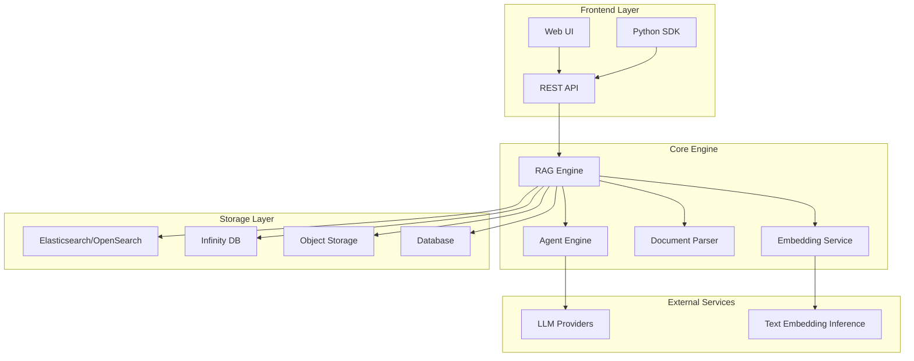

# RAGFlow FAQ

<cite>
**Referenced Files in This Document**
- [README.md](file://README.md)
- [docs/faq.mdx](file://docs/faq.mdx)
- [docs/quickstart.mdx](file://docs/quickstart.mdx)
- [docs/configurations.md](file://docs/configurations.md)
- [docker/docker-compose.yml](file://docker/docker-compose.yml)
- [docker/service_conf.yaml.template](file://docker/service_conf.yaml.template)
- [sdk/python/ragflow_sdk/ragflow.py](file://sdk/python/ragflow_sdk/ragflow.py)
- [api/apps/api_app.py](file://api/apps/api_app.py)
- [agent/templates/customer_service.json](file://agent/templates/customer_service.json)
- [docs/guides/agent/best_practices/accelerate_agent_question_answering.md](file://docs/guides/agent/best_practices/accelerate_agent_question_answering.md)
</cite>

## Table of Contents
1. [Introduction](#introduction)
2. [Installation and Setup](#installation-and-setup)
3. [Configuration](#configuration)
4. [Usage and Features](#usage-and-features)
5. [Performance and Optimization](#performance-and-optimization)
6. [Troubleshooting](#troubleshooting)
7. [Integration and API](#integration-and-api)
8. [Community and Support](#community-and-support)
9. [Best Practices](#best-practices)
10. [Common Misconceptions](#common-misconceptions)

## Introduction

### What is RAGFlow?

RAGFlow is a leading open-source Retrieval-Augmented Generation (RAG) engine that combines cutting-edge RAG technology with Agent capabilities to create a superior context layer for Large Language Models (LLMs). It offers a streamlined RAG workflow adaptable to enterprises of any scale, powered by a converged context engine and pre-built agent templates.

### Key Features

RAGFlow stands out with several unique features:

- **Fine-grained document parsing**: Advanced document processing with flexibility for human intervention
- **Traceable answers with reduced hallucinations**: Transparent citations and references for trustworthy responses
- **Deep document understanding**: Sophisticated knowledge extraction from unstructured data with complex formats
- **Template-based chunking**: Intelligent and explainable text segmentation with multiple template options
- **Compatibility with heterogeneous data sources**: Support for Word, slides, Excel, PDF, images, and more
- **Automated RAG workflow**: Streamlined orchestration for both personal and enterprise use

### System Architecture

RAGFlow's architecture consists of several key components:



**Section sources**
- [README.md](file://README.md#L73-L75)
- [docs/faq.mdx](file://docs/faq.mdx#L20-L26)

## Installation and Setup

### Prerequisites

Before installing RAGFlow, ensure your system meets the following requirements:

| Component | Minimum Requirement | Recommended |
|-----------|-------------------|-------------|
| CPU | 4 cores | 8+ cores |
| RAM | 16 GB | 32+ GB |
| Disk Space | 50 GB | 100+ GB |
| Docker | 24.0.0+ | Latest |
| Docker Compose | v2.26.1+ | Latest |

### Installation Methods

#### Method 1: Docker Compose (Recommended)

1. **Prepare your system**:
   ```bash
   # Check vm.max_map_count
   sysctl vm.max_map_count
   
   # Set to at least 262144
   sudo sysctl -w vm.max_map_count=262144
   
   # Make permanent
   echo "vm.max_map_count=262144" | sudo tee -a /etc/sysctl.conf
   ```

2. **Clone and start**:
   ```bash
   git clone https://github.com/infiniflow/ragflow.git
   cd ragflow/docker
   git checkout -f v0.22.1
   docker compose -f docker-compose.yml up -d
   ```

#### Method 2: Build from Source

For development environments:

```bash
# Install dependencies
pipx install uv pre-commit

# Clone and setup
git clone https://github.com/infiniflow/ragflow.git
cd ragflow/
uv sync --python 3.10
uv run download_deps.py
pre-commit install

# Start dependencies
docker compose -f docker/docker-compose-base.yml up -d

# Launch backend
source .venv/bin/activate
export PYTHONPATH=$(pwd)
bash docker/launch_backend_service.sh

# Launch frontend
cd web
npm install
npm run dev
```

### Architecture Support

RAGFlow officially supports:
- **x86 CPU and NVIDIA GPU** platforms
- ARM64 platforms (experimental, requires custom Docker image)

**Section sources**
- [README.md](file://README.md#L144-L151)
- [docs/quickstart.mdx](file://docs/quickstart.mdx#L26-L36)
- [docs/quickstart.mdx](file://docs/quickstart.mdx#L184-L191)

## Configuration

### Environment Variables

Key configuration parameters in `.env` file:

| Variable | Description | Default |
|----------|-------------|---------|
| `RAGFLOW_IMAGE` | Docker image tag | `infiniflow/ragflow:v0.22.1` |
| `SVR_HTTP_PORT` | API server port | `9380` |
| `MYSQL_PASSWORD` | MySQL password | `infini_rag_flow` |
| `MINIO_PASSWORD` | MinIO password | `infini_rag_flow` |
| `MEM_LIMIT` | Memory limit | `8073741824` |
| `DOC_ENGINE` | Document engine | `elasticsearch` |

### Service Configuration

The `service_conf.yaml.template` file contains backend service configurations:

```yaml
ragflow:
  host: 0.0.0.0
  http_port: 9380

mysql:
  name: rag_flow
  user: root
  password: infini_rag_flow
  host: mysql
  port: 3306

minio:
  user: rag_flow
  password: infini_rag_flow
  host: minio:9000
```

### Port Configuration

To change the default HTTP serving port (80), modify `docker-compose.yml`:
```yaml
ports:
  - 8080:80  # Change 8080 to your desired port
```

### Document Engine Options

RAGFlow supports multiple document engines:

- **Elasticsearch** (default): Full-text search with vector similarity
- **Infinity**: AI-native database with hybrid search capabilities
- **OpenSearch**: Alternative search engine option

Switching to Infinity:
```bash
# Stop containers
docker compose -f docker/docker-compose.yml down -v

# Set DOC_ENGINE to infinity in .env
echo "DOC_ENGINE=infinity" >> docker/.env

# Restart
docker compose -f docker-compose.yml up -d
```

**Section sources**
- [docs/configurations.md](file://docs/configurations.md#L12-L27)
- [docker/service_conf.yaml.template](file://docker/service_conf.yaml.template#L1-L154)
- [docs/faq.mdx](file://docs/faq.mdx#L272-L290)

## Usage and Features

### Basic Workflow

1. **Create Dataset**: Upload and parse documents into knowledge bases
2. **Configure Chunking**: Choose embedding models and chunking methods
3. **Intervene with Parsing**: Review and modify chunk results
4. **Create Chat Assistant**: Set up AI conversations based on your datasets

### Supported File Formats

RAGFlow handles various file types:
- **Documents**: PDF, DOC, DOCX, TXT, MD, MDX
- **Spreadsheets**: CSV, XLSX, XLS
- **Presentations**: PPT, PPTX
- **Images**: JPEG, JPG, PNG, TIF, GIF
- **Structured Data**: JSON, XML, HTML

### LLM Integration

RAGFlow supports multiple LLM providers:

| Provider | Models | API Compatibility |
|----------|--------|------------------|
| OpenAI | GPT-4, GPT-3.5 | Native |
| Tongyi-Qianwen | Qwen系列 | Native |
| DeepSeek | DeepSeek系列 | Native |
| Moonshot | Moonshot系列 | Native |
| VolcEngine | 华为云模型 | Native |
| ZHIPU-AI | 智谱AI模型 | Native |

### Agent Capabilities

RAGFlow includes built-in agent templates for common use cases:

- **Customer Service**: Automated customer support workflows
- **Technical Documentation QA**: Technical document analysis
- **Market Research**: Business intelligence and research
- **SEO Blog Generation**: Content creation assistance
- **Code Analysis**: Programming assistance and code review

### Multi-turn Conversations

Enable multi-turn optimization in chat configuration:
1. Go to **Chat** page
2. Edit desired assistant
3. Enable **Multi-turn optimization** in Prompt engine tab

**Section sources**
- [docs/quickstart.mdx](file://docs/quickstart.mdx#L268-L270)
- [agent/templates/customer_service.json](file://agent/templates/customer_service.json#L166-L195)

## Performance and Optimization

### Performance Factors

Several factors affect RAGFlow performance:

1. **Document Complexity**: PDFs with complex layouts require more processing
2. **Embedding Model**: Larger models provide better quality but slower processing
3. **Hardware Resources**: CPU/GPU availability impacts parsing speed
4. **Memory Allocation**: Insufficient RAM can cause parsing failures
5. **Network Connectivity**: External model access speed affects response time

### Optimization Strategies

#### For Document Parsing

```bash
# Increase batch size for better throughput
export DOC_BULK_SIZE=32
export EMBEDDING_BATCH_SIZE=16

# Allocate more memory
export MEM_LIMIT=16106127360  # 15GB
```

#### For Chat Performance

1. **Disable Rerank Model**: Leave rerank field empty for faster retrieval
2. **Use Smaller Models**: Choose lighter LLM models for speed
3. **Reduce TopN**: Lower the number of retrieved chunks
4. **Enable Streaming**: Faster response delivery

#### Hardware Recommendations

| Use Case | CPU | RAM | Storage | GPU |
|----------|-----|-----|---------|-----|
| Small Documents | 4 cores | 16GB | 50GB SSD | Optional |
| Medium Documents | 8 cores | 32GB | 100GB SSD | RTX 3060+ |
| Large Documents | 16+ cores | 64GB+ | 500GB+ SSD | RTX 4080+ |

### MinerU Integration

RAGFlow supports MinerU for enhanced PDF parsing:

```bash
# Enable MinerU
export USE_MINERU=true

# Configure backend
export MINERU_BACKEND="pipeline"  # or vlm-transformers, vlm-vllm-engine, vlm-http-client
```

**Section sources**
- [docs/guides/agent/best_practices/accelerate_agent_question_answering.md](file://docs/guides/agent/best_practices/accelerate_agent_question_answering.md#L32-L39)
- [docs/faq.mdx](file://docs/faq.mdx#L478-L584)

## Troubleshooting

### Common Issues and Solutions

#### Network Anomaly Error

**Problem**: Browser shows "network anomaly" when accessing RAGFlow
**Solution**: 
```bash
# Check server status
docker logs -f docker-ragflow-cpu-1

# Look for successful startup message:
# * Running on all addresses (0.0.0.0)
```

#### Document Parsing Stalls

**Issue**: Parsing gets stuck below 1%
**Solution**:
1. Check server logs: `docker logs -f docker-ragflow-cpu-1`
2. Verify task_executor.py process exists
3. Test HuggingFace connectivity

**Issue**: Parsing stalls near completion
**Solution**: 
1. Increase memory allocation in `.env`: `MEM_LIMIT=16106127360`
2. Restart with: 
   ```bash
   docker compose stop
   docker compose up -d
   ```

#### Elasticsearch Connection Issues

**Problem**: `Can't connect to ES cluster` error
**Solutions**:
1. Verify `vm.max_map_count` ≥ 262144
2. Check Elasticsearch container status: `docker ps`
3. Ensure proper port mapping (9200:9200)

#### HuggingFace Access Problems

**Problem**: `FileNotFoundError` for HuggingFace models
**Solution**:
```bash
# Use mirror site
export HF_ENDPOINT=https://hf-mirror.com

# Or manually download models to local directory
mkdir -p ~/deepdoc
# Download from huggingface.co/InfiniFlow/deepdoc
# Add volume mount in docker-compose.yml
```

#### Memory Issues

**Problem**: Out of memory errors during parsing
**Solutions**:
1. Reduce batch sizes: `DOC_BULK_SIZE=8`, `EMBEDDING_BATCH_SIZE=4`
2. Increase swap space
3. Use smaller embedding models

### Health Monitoring

Monitor system health using:
```bash
# Check all container statuses
docker ps

# View logs
tail -f ragflow/docker/ragflow-logs/*.log

# Health check endpoints
curl http://localhost:9380/api/v1/health
```

### Error Codes Reference

| Error Code | Description | Solution |
|------------|-------------|----------|
| 400 | Bad request | Check API parameters |
| 401 | Unauthorized | Verify API key |
| 404 | Not found | Dataset/document not found |
| 500 | Internal server error | Check server logs |
| 502 | Gateway error | Network connectivity issue |
| 503 | Service unavailable | Container restart needed |

**Section sources**
- [docs/faq.mdx](file://docs/faq.mdx#L148-L382)
- [docs/faq.mdx](file://docs/faq.mdx#L277-L330)

## Integration and API

### API Key Management

Generate API keys for programmatic access:

```bash
# Create new API token
curl -X POST \
  -H "Authorization: Bearer YOUR_API_KEY" \
  -H "Content-Type: application/json" \
  -d '{"dialog_id": "your_dialog_id"}' \
  http://localhost:9380/api/v1/new_token
```

### Python SDK Usage

Basic SDK operations:

```python
from ragflow_sdk import RAGFlow

# Initialize client
ragflow = RAGFlow(api_key="your_api_key", base_url="http://localhost:9380")

# Create dataset
dataset = ragflow.create_dataset(
    name="My Knowledge Base",
    embedding_model="Qwen/Qwen3-Embedding-0.6B"
)

# Create chat assistant
chat = ragflow.create_chat(
    name="My Assistant",
    dataset_ids=[dataset.id],
    llm=Chat.LLM(model_name="gpt-4")
)
```

### HTTP API Examples

#### Dataset Management
```bash
# List datasets
curl -H "Authorization: Bearer YOUR_KEY" \
  http://localhost:9380/api/v1/datasets?page=1&page_size=10

# Upload file
curl -X POST \
  -H "Authorization: Bearer YOUR_KEY" \
  -F "file=@document.pdf" \
  http://localhost:9380/api/v1/datasets/YOUR_DATASET_ID/files
```

#### Chat Operations
```bash
# Send message
curl -X POST \
  -H "Authorization: Bearer YOUR_KEY" \
  -H "Content-Type: application/json" \
  -d '{"message": "What is RAGFlow?", "session_id": "SESSION_ID"}' \
  http://localhost:9380/api/v1/chats/YOUR_CHAT_ID/conversation
```

### Integration Patterns

#### Web Application Integration
1. Deploy RAGFlow as backend service
2. Create API tokens for frontend applications
3. Implement streaming responses for better UX
4. Handle rate limiting and authentication

#### Microservices Architecture
1. Use RAGFlow as knowledge service
2. Implement caching for frequently accessed data
3. Design for horizontal scaling
4. Monitor API usage and performance

**Section sources**
- [sdk/python/ragflow_sdk/ragflow.py](file://sdk/python/ragflow_sdk/ragflow.py#L26-L50)
- [api/apps/api_app.py](file://api/apps/api_app.py#L26-L54)

## Community and Support

### Official Channels

- **GitHub Repository**: Primary development and issue tracking
- **Discord Community**: Real-time discussions and support
- **Twitter**: Updates and announcements (@infiniflowai)
- **Documentation**: Comprehensive guides and references

### Getting Help

#### Before Asking Questions

1. **Check Documentation**: Review FAQ and guides
2. **Search Issues**: Look for similar problems in GitHub
3. **Verify Requirements**: Ensure system meets prerequisites
4. **Check Logs**: Review error messages and logs

#### Reporting Issues

When reporting bugs or requesting features:

1. **Provide System Info**: OS, Docker version, RAGFlow version
2. **Include Logs**: Relevant error messages and stack traces
3. **Describe Steps**: Clear reproduction steps
4. **Environment Details**: Hardware specs, memory usage, etc.

### Contributing

RAGFlow welcomes community contributions:

1. **Code Contributions**: Follow coding standards and testing
2. **Documentation**: Improve guides and examples
3. **Bug Reports**: Help identify and fix issues
4. **Feature Requests**: Share use cases and requirements

### Commercial Support

For enterprise deployments:
- **Professional Services**: Custom implementation and training
- **Enterprise Edition**: Additional features and SLA
- **Consulting**: Architecture and optimization guidance

**Section sources**
- [README.md](file://README.md#L387-L396)

## Best Practices

### Security Best Practices

1. **API Key Management**:
   - Use environment variables for API keys
   - Rotate keys regularly
   - Implement proper access controls

2. **Network Security**:
   - Use HTTPS in production
   - Implement firewall rules
   - Monitor network traffic

3. **Data Protection**:
   - Encrypt sensitive data
   - Backup critical information
   - Implement data retention policies

### Performance Best Practices

1. **Resource Allocation**:
   - Monitor memory usage during parsing
   - Optimize batch sizes for your hardware
   - Use GPU acceleration when available

2. **Scaling Considerations**:
   - Implement load balancing for high traffic
   - Use caching for frequently accessed data
   - Monitor system metrics

3. **Maintenance**:
   - Regular updates and patches
   - Log rotation and cleanup
   - Performance monitoring

### Development Best Practices

1. **Testing**:
   - Test with representative data
   - Validate parsing accuracy
   - Performance testing under load

2. **Deployment**:
   - Use environment-specific configurations
   - Implement blue-green deployments
   - Monitor health checks

3. **Monitoring**:
   - Set up alerting for errors
   - Track performance metrics
   - Monitor resource utilization

**Section sources**
- [docs/configurations.md](file://docs/configurations.md#L141-L241)

## Common Misconceptions

### RAG vs Traditional Chatbots

**Misconception**: RAGFlow is just another chatbot
**Reality**: RAGFlow provides grounded, fact-based responses with transparent citations, unlike traditional chatbots that may generate hallucinated content.

### Performance Expectations

**Misconception**: RAGFlow is fast out of the box
**Reality**: Initial parsing can be slow due to document preprocessing, but subsequent operations are faster. Performance varies based on document complexity and hardware resources.

### Integration Complexity

**Misconception**: RAGFlow requires extensive technical expertise
**Reality**: RAGFlow provides intuitive web interface and comprehensive SDKs for easy integration. Basic usage requires minimal technical knowledge.

### Cost Considerations

**Misconception**: RAGFlow is free and unlimited
**Reality**: While open-source, production deployments require infrastructure costs. Enterprise features and commercial support may incur additional fees.

### Data Privacy

**Misconception**: RAGFlow stores all uploaded data indefinitely
**Reality**: RAGFlow provides data control features and supports local deployment for privacy-sensitive use cases.

### Feature Comparison

**Misconception**: RAGFlow is just another RAG implementation
**Reality**: RAGFlow combines RAG with agent capabilities, provides fine-grained document parsing, and offers traceable, hallucination-reduced responses.

**Section sources**
- [docs/faq.mdx](file://docs/faq.mdx#L20-L26)
- [docs/faq.mdx](file://docs/faq.mdx#L77-L87)