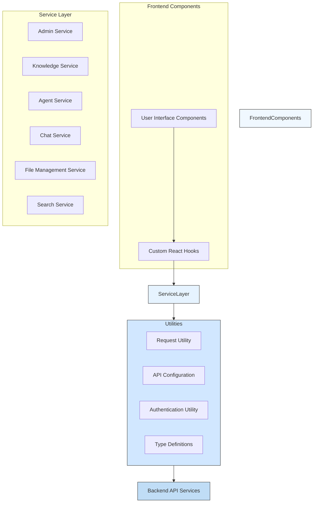
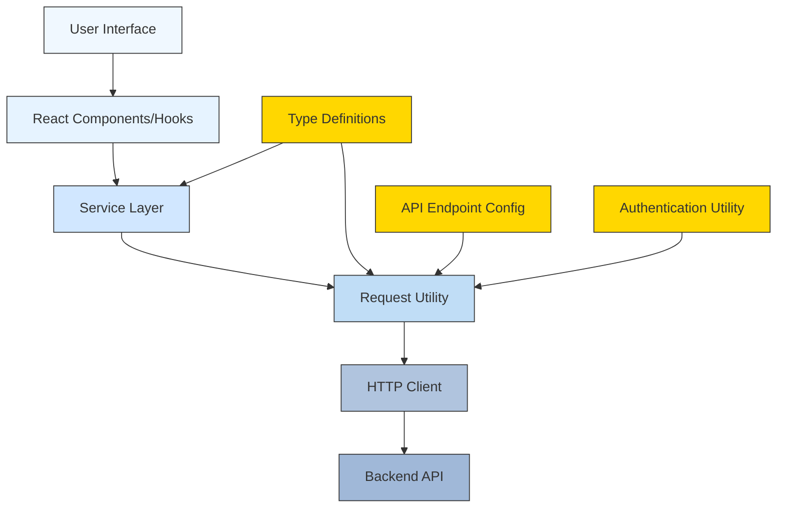
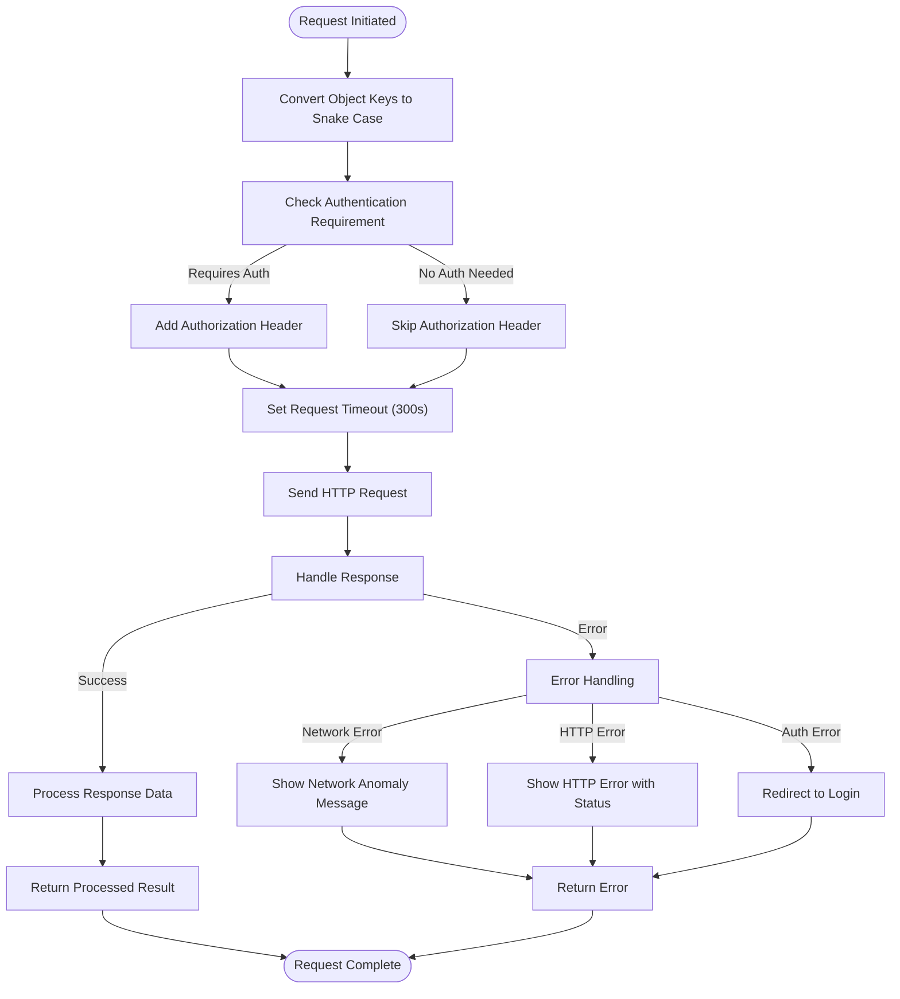
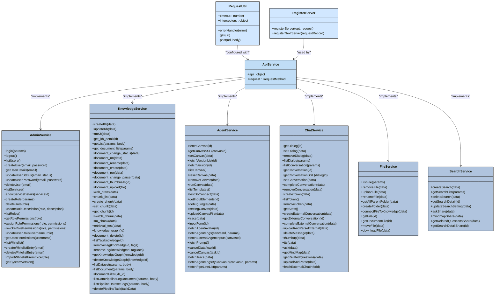
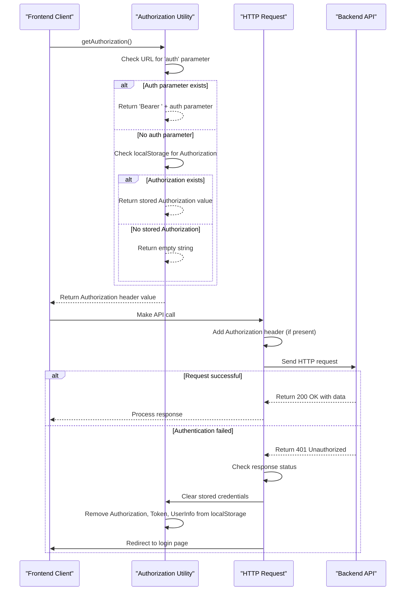
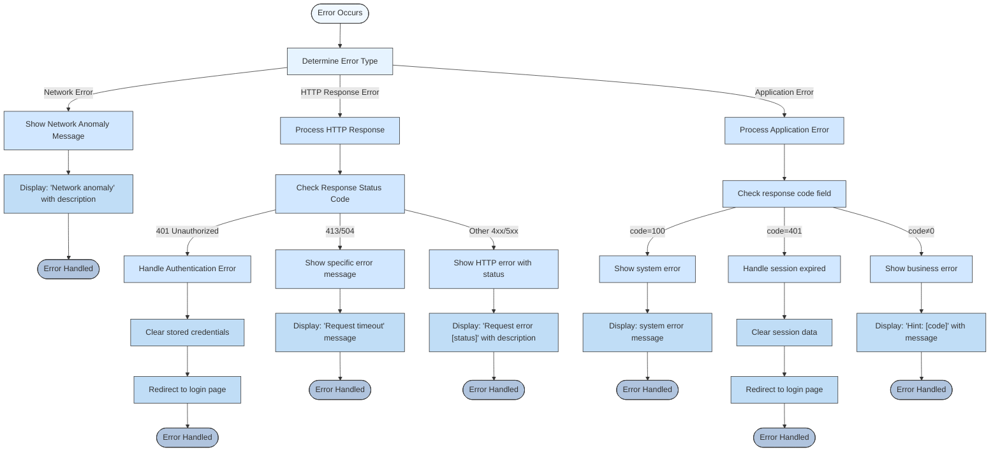
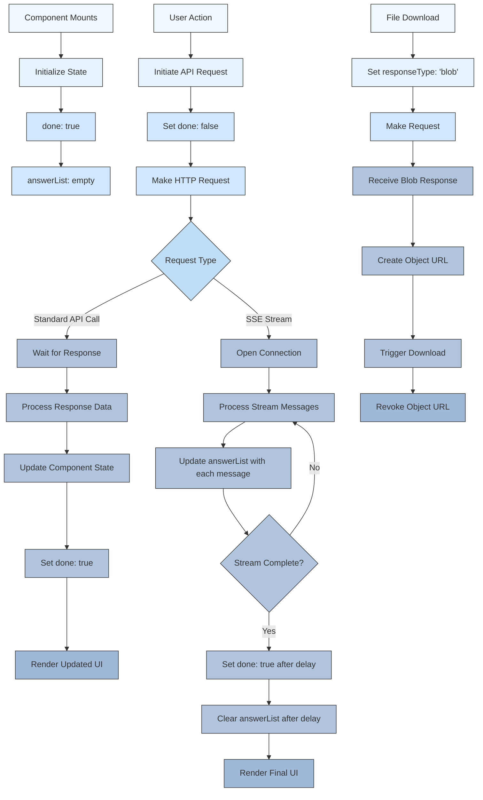
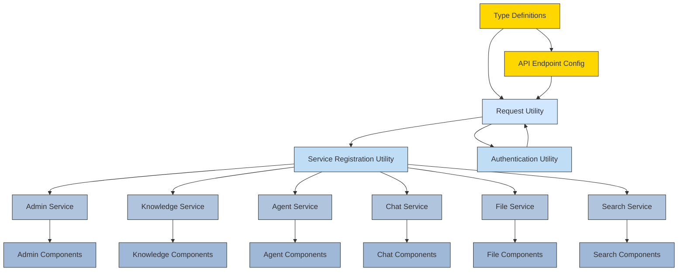

# API Integration

<cite>
**Referenced Files in This Document**   
- [request.ts](file://web/src/utils/request.ts)
- [next-request.ts](file://web/src/utils/next-request.ts)
- [register-server.ts](file://web/src/utils/register-server.ts)
- [api.ts](file://web/src/utils/api.ts)
- [authorization-util.ts](file://web/src/utils/authorization-util.ts)
- [admin-service.ts](file://web/src/services/admin-service.ts)
- [knowledge-service.ts](file://web/src/services/knowledge-service.ts)
- [agent-service.ts](file://web/src/services/agent-service.ts)
- [next-chat-service.ts](file://web/src/services/next-chat-service.ts)
- [file-manager-service.ts](file://web/src/services/file-manager-service.ts)
- [search-service.ts](file://web/src/services/search-service.ts)
- [use-send-message.ts](file://web/src/hooks/use-send-message.ts)
- [logic-hooks.ts](file://web/src/hooks/logic-hooks.ts)
</cite>

## Table of Contents
1. [Introduction](#introduction)
2. [Project Structure](#project-structure)
3. [Core Components](#core-components)
4. [Architecture Overview](#architecture-overview)
5. [Detailed Component Analysis](#detailed-component-analysis)
6. [Dependency Analysis](#dependency-analysis)
7. [Performance Considerations](#performance-considerations)
8. [Troubleshooting Guide](#troubleshooting-guide)
9. [Conclusion](#conclusion)

## Introduction
This document provides comprehensive documentation for RAGFlow's frontend API integration patterns. It details how the frontend communicates with backend API services using HTTP requests, covering the service layer implementation, request utility configuration, interface definitions, and integration examples for key features. The documentation also addresses real-time communication patterns, error handling strategies, loading states, data caching mechanisms, and the process for adding new API endpoints while maintaining type safety.

## Project Structure
The RAGFlow frontend API integration is organized into several key directories within the web/src folder:
- **services/**: Contains service layer implementations for different API domains (admin, knowledge, agent, chat, file management, search)
- **utils/**: Houses utility functions including request configuration, API endpoint definitions, and authentication utilities
- **interfaces/**: Defines TypeScript types for API request and response payloads
- **hooks/**: Contains custom React hooks for managing API interactions, particularly for real-time communication

The architecture follows a modular approach where each service corresponds to a specific domain of functionality, with shared utilities for request handling and type definitions.



**Diagram sources**
- [web/src/services](file://web/src/services)
- [web/src/utils](file://web/src/utils)
- [web/src/interfaces](file://web/src/interfaces)
- [web/src/hooks](file://web/src/hooks)

**Section sources**
- [web/src](file://web/src)

## Core Components
The RAGFlow frontend API integration consists of several core components that work together to provide a robust and type-safe interface between the frontend and backend services. These components include the request utility, service layer implementations, API endpoint definitions, authentication handling, and real-time communication mechanisms.

The system is designed with type safety as a primary concern, using TypeScript interfaces to define request and response payloads throughout the application. This ensures that API interactions are predictable and less prone to runtime errors.

**Section sources**
- [web/src/utils/request.ts](file://web/src/utils/request.ts)
- [web/src/services](file://web/src/services)
- [web/src/interfaces](file://web/src/interfaces)

## Architecture Overview
The API integration architecture in RAGFlow follows a layered approach with clear separation of concerns. At the foundation is the request utility that configures HTTP requests with appropriate headers, timeouts, and interceptors. Above this layer, service modules provide typed methods for each API endpoint, organized by functional domain. The top layer consists of React components and hooks that consume these services to implement user interface functionality.

The architecture emphasizes reusability and maintainability through the use of utility functions for service registration and consistent error handling patterns across all API interactions.



**Diagram sources**
- [web/src/utils/request.ts](file://web/src/utils/request.ts)
- [web/src/services](file://web/src/services)
- [web/src/utils/api.ts](file://web/src/utils/api.ts)
- [web/src/utils/authorization-util.ts](file://web/src/utils/authorization-util.ts)

## Detailed Component Analysis

### Request Utility Implementation
The request utility in RAGFlow provides a centralized configuration for HTTP requests using the umi-request library (a wrapper around fetch). It configures default settings such as timeout (300,000ms) and implements request/response interceptors for consistent handling of API interactions.

The utility automatically converts object keys to snake_case format in both request data and parameters, ensuring compatibility with the backend API's expected format. It also handles authentication by automatically adding the Authorization header to requests, unless explicitly skipped.



**Diagram sources**
- [web/src/utils/request.ts](file://web/src/utils/request.ts)
- [web/src/utils/next-request.ts](file://web/src/utils/next-request.ts)

**Section sources**
- [web/src/utils/request.ts](file://web/src/utils/request.ts)
- [web/src/utils/next-request.ts](file://web/src/utils/next-request.ts)

### Service Layer Implementation
The service layer in RAGFlow provides typed methods for each API endpoint, organized into domain-specific services. Each service uses the register-server utility to create a consistent interface for API calls, with methods corresponding to specific endpoints.

The architecture supports two service registration patterns:
1. Using `registerServer` for traditional API endpoints with standard HTTP methods
2. Using `registerNextServer` for more complex scenarios with flexible configuration options

Each service exports both the registered service object and additional helper methods for specific use cases that don't fit the standard pattern.



**Diagram sources**
- [web/src/utils/register-server.ts](file://web/src/utils/register-server.ts)
- [web/src/services/admin-service.ts](file://web/src/services/admin-service.ts)
- [web/src/services/knowledge-service.ts](file://web/src/services/knowledge-service.ts)
- [web/src/services/agent-service.ts](file://web/src/services/agent-service.ts)
- [web/src/services/next-chat-service.ts](file://web/src/services/next-chat-service.ts)
- [web/src/services/file-manager-service.ts](file://web/src/services/file-manager-service.ts)
- [web/src/services/search-service.ts](file://web/src/services/search-service.ts)

**Section sources**
- [web/src/utils/register-server.ts](file://web/src/utils/register-server.ts)
- [web/src/services](file://web/src/services)

### Authentication Handling
Authentication in RAGFlow is handled through a combination of localStorage storage and request interceptors. The system uses bearer tokens stored in localStorage with specific keys for authorization, token, and user information.

The authorization utility provides methods to get, set, and remove authentication data, with a specific function to retrieve the authorization header value that checks both URL parameters and localStorage. When authentication fails (401 status), the system automatically redirects users to the login page after clearing stored credentials.



**Diagram sources**
- [web/src/utils/authorization-util.ts](file://web/src/utils/authorization-util.ts)
- [web/src/utils/request.ts](file://web/src/utils/request.ts)

**Section sources**
- [web/src/utils/authorization-util.ts](file://web/src/utils/authorization-util.ts)

### Interface Definitions
The interface definitions in RAGFlow provide TypeScript types for API request and response payloads, ensuring type safety throughout the application. These definitions are organized into two main directories:
- **interfaces/database/**: Contains type definitions for data models used in the application
- **interfaces/request/**: Contains type definitions for API request and response payloads

The type system includes response wrappers with standard fields (code, message, data) and specific interfaces for each domain's data structures, such as knowledge bases, documents, chunks, and chat conversations.

```mermaid
classDiagram
class ResponseType {
+code : number
+message : string
+data : D
}
class IKnowledge {
+avatar : any
+chunk_num : number
+create_date : string
+create_time : number
+created_by : string
+description : string
+doc_num : number
+id : string
+name : string
+parser_config : ParserConfig
+parser_id : string
+pipeline_id : string
+pipeline_name : string
+pipeline_avatar : string
+permission : string
+similarity_threshold : number
+status : string
+tenant_id : string
+token_num : number
+update_date : string
+update_time : number
+vector_similarity_weight : number
+embd_id : string
+nickname : string
+operator_permission : number
+size : number
+raptor_task_finish_at : string
+raptor_task_id : string
+mindmap_task_finish_at : string
+mindmap_task_id : string
+graphrag_task_finish_at : string
+graphrag_task_id : string
+connectors : IConnector[]
}
class IKnowledgeFile {
+chunk_num : number
+create_date : string
+create_time : number
+created_by : string
+id : string
+kb_id : string
+location : string
+name : string
+parser_id : string
+process_begin_at : any
+process_duration : number
+progress : number
+progress_msg : string
+run : RunningStatus
+size : number
+source_type : string
+status : string
+thumbnail : any
+token_num : number
+type : string
+update_date : string
+update_time : number
+parser_config : IKnowledgeFileParserConfig
}
class IChunk {
+available_int : number
+chunk_id : string
+content_with_weight : string
+doc_id : string
+doc_name : string
+image_id : string
+important_kwd : string[]
+question_kwd : string[]
+tag_kwd : string[]
+positions : number[][]
+tag_feas : Record<string, number>
}
class ITestingResult {
+chunks : ITestingChunk[]
+documents : ITestingDocument[]
+total : number
+labels : Record<string, number>
}
class ITestingChunk {
+chunk_id : string
+content_ltks : string
+content_with_weight : string
+doc_id : string
+doc_name : string
+img_id : string
+image_id : string
+important_kwd : any[]
+kb_id : string
+similarity : number
+term_similarity : number
+vector : number[]
+vector_similarity : number
+highlight : string
+positions : number[][]
+docnm_kwd : string
+doc_type_kwd : string
}
class ITestingDocument {
+count : number
+doc_id : string
+doc_name : string
}
class IConnector {
+id : string
+name : string
+status : RunningStatus
+source : DataSourceKey
+auto_parse : '0' | '1'
}
class ParserConfig {
+from_page : number
+to_page : number
+auto_keywords : number
+auto_questions : number
+chunk_token_num : number
+delimiter : string
+html4excel : boolean
+layout_recognize : boolean
+raptor : Raptor
+tag_kb_ids : string[]
+topn_tags : number
+graphrag : { use_graphrag : boolean }
}
class Raptor {
+use_raptor : boolean
}
class IKnowledgeFileParserConfig {
+chunk_token_num : number
+layout_recognize : boolean
+pages : number[][]
+task_page_size : number
}
ResponseType <|-- IKnowledgeResult
ResponseType <|-- ITestingResult
IKnowledge --> ParserConfig
IKnowledge --> IConnector
IKnowledgeFile --> IKnowledgeFileParserConfig
ITestingResult --> ITestingChunk
ITestingResult --> ITestingDocument
style ResponseType fill : #d1e7ff,stroke : #333
style IKnowledge fill : #b0c4de,stroke : #333
style IKnowledgeFile fill : #b0c4de,stroke : #333
style IChunk fill : #b0c4de,stroke : #333
style ITestingResult fill : #b0c4de,stroke : #333
style ITestingChunk fill : #b0c4de,stroke : #333
style ITestingDocument fill : #b0c4de,stroke : #333
style IConnector fill : #b0c4de,stroke : #333
style ParserConfig fill : #b0c4de,stroke : #333
style Raptor fill : #b0c4de,stroke : #333
style IKnowledgeFileParserConfig fill : #b0c4de,stroke : #333
```

**Diagram sources**
- [web/src/interfaces/database/knowledge.ts](file://web/src/interfaces/database/knowledge.ts)
- [web/src/interfaces/request/knowledge.ts](file://web/src/interfaces/request/knowledge.ts)

**Section sources**
- [web/src/interfaces](file://web/src/interfaces)

### Real-time Communication Patterns
RAGFlow implements real-time communication patterns using Server-Sent Events (SSE) for streaming responses from the backend, particularly for chat conversations and agent execution. The system uses custom React hooks to manage the SSE connections and process the streaming data.

The implementation handles connection lifecycle events, message parsing, and error recovery, providing a seamless experience for users interacting with AI agents and chat assistants. The hooks also support manual interruption of ongoing processes through abort controllers.

```mermaid
sequenceDiagram
participant Client as "Frontend Client"
participant Hook as "useSendMessageBySSE Hook"
participant Fetch as "Fetch API"
participant Backend as "Backend API"
Client->>Hook : Initialize hook with API endpoint
Hook->>Hook : Create AbortController for connection management
Hook->>Hook : Initialize state variables (answerList, done)
Client->>Hook : Call send() with message data
Hook->>Fetch : Initiate POST request to API endpoint
Fetch->>Backend : Send HTTP POST with message data
Backend-->>Fetch : Open SSE connection with 200 OK
Fetch->>Hook : Process response stream through TextDecoderStream
Hook->>Hook : Pipe stream through EventSourceParserStream
Hook->>Hook : Get reader from parsed stream
loop For each message in stream
Hook->>Hook : Read next message from stream
alt Message received
Hook->>Hook : Parse message data as JSON
alt Parse successful
Hook->>Hook : Check message code
alt Code indicates error
Hook->>Client : Display error message
else Code indicates normal data
Hook->>Hook : Add message to answerList
Hook->>Client : Update UI with new message
end
else Parse failed
Hook->>Hook : Log warning, continue
end
else Stream completed
Hook->>Hook : Reset answerList after delay
Hook->>Hook : Set done state to true
break Connection closed
end
end
Client->>Hook : Call stopOutputMessage()
Hook->>Hook : Abort current connection
Hook->>Fetch : AbortController triggers fetch abort
Fetch->>Backend : Connection terminated
Backend->>Backend : Clean up resources
Note over Hook,Backend : Connection remains open until complete or aborted
```

**Diagram sources**
- [web/src/hooks/use-send-message.ts](file://web/src/hooks/use-send-message.ts)
- [web/src/hooks/logic-hooks.ts](file://web/src/hooks/logic-hooks.ts)

**Section sources**
- [web/src/hooks/use-send-message.ts](file://web/src/hooks/use-send-message.ts)
- [web/src/hooks/logic-hooks.ts](file://web/src/hooks/logic-hooks.ts)

### Error Handling Strategies
The error handling strategy in RAGFlow's API integration is comprehensive and user-friendly, providing appropriate feedback for different types of errors while maintaining application stability. The system handles network errors, HTTP errors, and application-specific errors with tailored responses.

For network errors (e.g., "Failed to fetch"), the system displays a general network anomaly message. For HTTP errors, it shows the specific status code and error description. Application errors (non-zero code in response) are displayed with a hint message and the specific error description. Authentication errors (401) trigger automatic logout and redirection to the login page.



**Diagram sources**
- [web/src/utils/request.ts](file://web/src/utils/request.ts)
- [web/src/utils/next-request.ts](file://web/src/utils/next-request.ts)
- [web/src/services/admin-service.ts](file://web/src/services/admin-service.ts)

**Section sources**
- [web/src/utils/request.ts](file://web/src/utils/request.ts)

### Loading States and Data Caching
RAGFlow manages loading states through component state management, with specific flags to indicate when API requests are in progress. For real-time interactions like chat conversations, the system uses a "done" flag to track whether a response stream is active.

Data caching is primarily handled at the component level through React state, with some data also stored in localStorage for persistence across sessions. The system does not implement a comprehensive caching layer but relies on React's re-rendering mechanisms to maintain UI state.

For file downloads and document previews, the system handles binary data (blobs) appropriately, setting the responseType to 'blob' in the request configuration to ensure proper handling of file content.



**Diagram sources**
- [web/src/utils/request.ts](file://web/src/utils/request.ts)
- [web/src/hooks/use-send-message.ts](file://web/src/hooks/use-send-message.ts)
- [web/src/services/file-manager-service.ts](file://web/src/services/file-manager-service.ts)

**Section sources**
- [web/src/utils/request.ts](file://web/src/utils/request.ts)
- [web/src/hooks/use-send-message.ts](file://web/src/hooks/use-send-message.ts)

## Dependency Analysis
The API integration components in RAGFlow have a clear dependency hierarchy, with lower-level utilities providing foundational functionality for higher-level services. The dependency graph shows how components build upon each other to create a cohesive API integration system.

The core dependencies flow from utility functions to service implementations, with type definitions providing the contract for data exchange between components. This layered approach ensures that changes to lower-level components can be managed systematically without affecting the entire system.



**Diagram sources**
- [web/src/interfaces](file://web/src/interfaces)
- [web/src/utils/api.ts](file://web/src/utils/api.ts)
- [web/src/utils/request.ts](file://web/src/utils/request.ts)
- [web/src/utils/register-server.ts](file://web/src/utils/register-server.ts)
- [web/src/utils/authorization-util.ts](file://web/src/utils/authorization-util.ts)
- [web/src/services](file://web/src/services)

**Section sources**
- [web/src](file://web/src)

## Performance Considerations
The API integration in RAGFlow is designed with performance considerations in mind, particularly for handling large responses and streaming data. The system uses a generous timeout of 300 seconds (5 minutes) for requests, accommodating long-running operations such as document processing and AI inference.

For real-time communication, the implementation uses Server-Sent Events (SSE) to stream responses incrementally, providing immediate feedback to users rather than making them wait for complete responses. This is particularly important for chat interactions and agent execution where users expect to see responses as they are generated.

The request utility automatically converts object keys to snake_case format, which could be optimized by performing this conversion only when necessary rather than on every request. Additionally, the error handling system displays user-friendly messages for different error types, helping users understand issues without exposing technical details.

The system could benefit from implementing client-side caching for frequently accessed data to reduce redundant API calls, although this would need to be balanced against the need for up-to-date information in a collaborative environment.

**Section sources**
- [web/src/utils/request.ts](file://web/src/utils/request.ts)
- [web/src/hooks/use-send-message.ts](file://web/src/hooks/use-send-message.ts)

## Troubleshooting Guide
When troubleshooting API integration issues in RAGFlow, consider the following common problems and solutions:

1. **Authentication failures (401 errors)**: Ensure the user is properly logged in and the authorization token is present in localStorage. Clear the browser cache and try logging in again if the issue persists.

2. **Network connectivity issues**: Verify that the backend server is running and accessible. Check the browser's developer tools network tab to see if requests are being sent and received.

3. **CORS errors**: Ensure the backend server is configured to allow requests from the frontend origin. This is typically configured in the backend server settings.

4. **SSE connection failures**: For real-time features like chat, ensure the backend supports SSE and that the connection endpoint is correct. Check that the server is not blocking long-lived connections.

5. **Type errors**: When adding new API endpoints, ensure that TypeScript interfaces are properly defined for request and response payloads to maintain type safety.

6. **File upload/download issues**: Verify that the request configuration includes the appropriate headers and responseType settings for binary data.

When adding new API endpoints, follow these steps to maintain consistency:
1. Define the endpoint URL in api.ts
2. Create TypeScript interfaces for request and response payloads in the appropriate interfaces directory
3. Implement the service method using the register-server utility
4. Test the integration thoroughly, including error handling scenarios

**Section sources**
- [web/src/utils/request.ts](file://web/src/utils/request.ts)
- [web/src/utils/authorization-util.ts](file://web/src/utils/authorization-util.ts)
- [web/src/utils/api.ts](file://web/src/utils/api.ts)
- [web/src/utils/register-server.ts](file://web/src/utils/register-server.ts)

## Conclusion
RAGFlow's frontend API integration provides a robust, type-safe interface between the user interface and backend services. The architecture follows best practices with a clear separation of concerns, consistent error handling, and support for both standard API calls and real-time streaming through Server-Sent Events.

The system emphasizes type safety through comprehensive TypeScript interfaces, reducing runtime errors and improving developer experience. The modular service layer makes it easy to extend functionality while maintaining consistency across different domains.

Key strengths of the implementation include:
- Comprehensive error handling with user-friendly messages
- Support for real-time communication patterns
- Consistent authentication handling
- Type safety throughout the API integration layer
- Modular service architecture for easy maintenance

Areas for potential improvement include implementing client-side caching for frequently accessed data and optimizing the key conversion process in the request utility. Overall, the API integration provides a solid foundation for the RAGFlow application's frontend-backend communication.