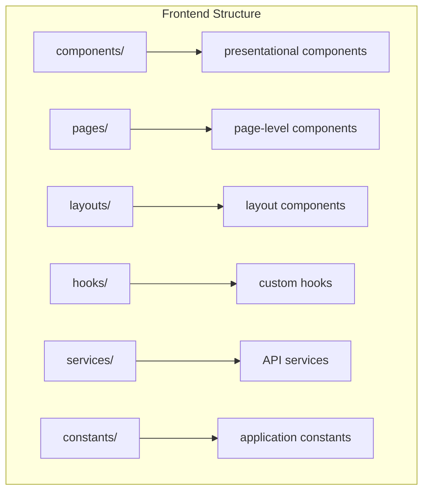
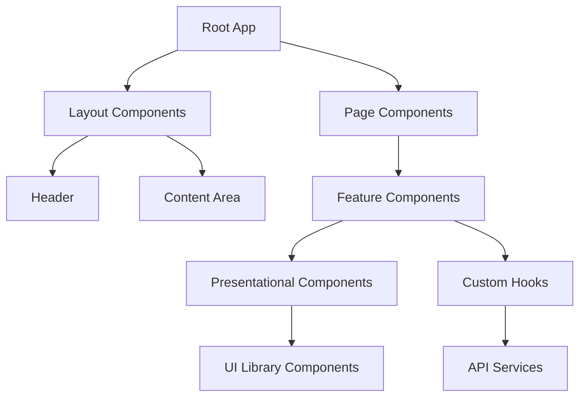
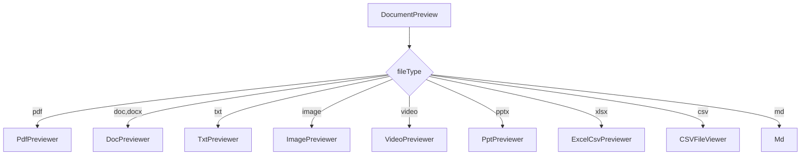
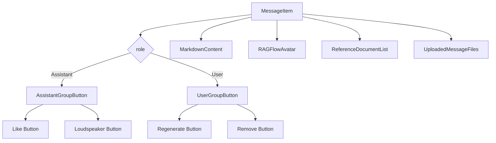
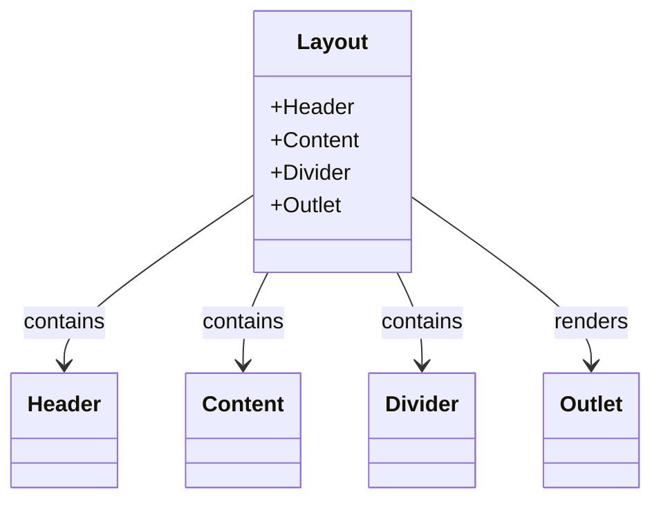
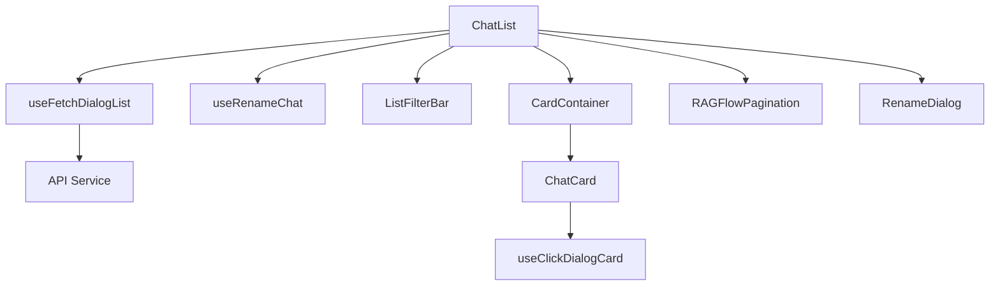
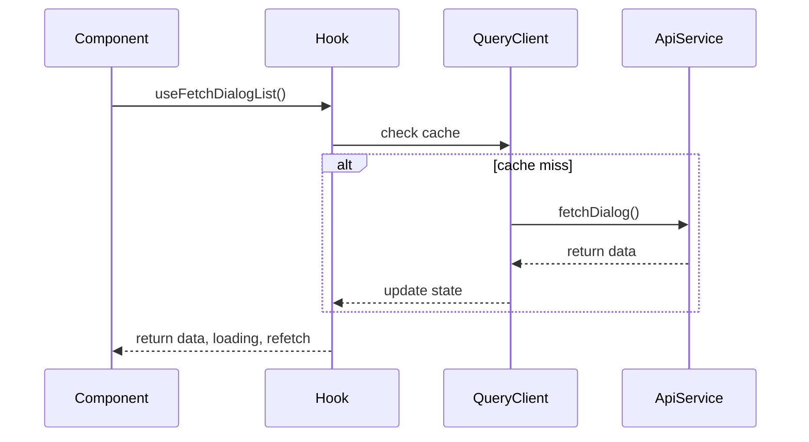
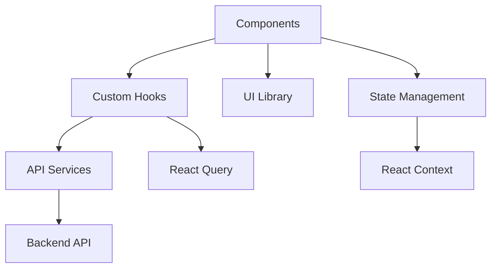

# Component Architecture

<cite>
**Referenced Files in This Document**   
- [app.tsx](file://web/src/app.tsx)
- [routes.ts](file://web/src/routes.ts)
- [index.tsx](file://web/src/layouts/index.tsx)
- [document-preview/index.tsx](file://web/src/components/document-preview/index.tsx)
- [message-item/index.tsx](file://web/src/components/message-item/index.tsx)
- [floating-chat-widget.tsx](file://web/src/components/floating-chat-widget.tsx)
- [common-hooks.tsx](file://web/src/hooks/common-hooks.tsx)
- [use-chat-request.ts](file://web/src/hooks/use-chat-request.ts)
- [next-chats/index.tsx](file://web/src/pages/next-chats/index.tsx)
- [prompt-editor/index.tsx](file://web/src/components/prompt-editor/index.tsx)
</cite>

## Table of Contents
1. [Introduction](#introduction)
2. [Project Structure](#project-structure)
3. [Core Components](#core-components)
4. [Architecture Overview](#architecture-overview)
5. [Detailed Component Analysis](#detailed-component-analysis)
6. [Dependency Analysis](#dependency-analysis)
7. [Performance Considerations](#performance-considerations)
8. [Troubleshooting Guide](#troubleshooting-guide)
9. [Conclusion](#conclusion)

## Introduction
This document provides a comprehensive analysis of RAGFlow's frontend component architecture, focusing on the React component hierarchy and organization patterns. The documentation covers the structure of presentational components in the components/ directory, page-level components in the pages/ directory, and layout components in the layouts/ directory. It details the composition patterns used to build complex UIs from smaller, reusable components, with examples from key features like the agent canvas, document preview, and chat interface.

## Project Structure
The RAGFlow frontend follows a well-organized directory structure that separates concerns and promotes reusability. The main directories include components/, pages/, layouts/, hooks/, services/, and constants/. This structure enables a clear separation between UI components, business logic, and data management.

**Diagram sources**
- [app.tsx](file://web/src/app.tsx)
- [routes.ts](file://web/src/routes.ts)

**Section sources**
- [app.tsx](file://web/src/app.tsx)
- [routes.ts](file://web/src/routes.ts)

## Core Components
The RAGFlow frontend architecture is built around reusable, composable components that follow React best practices. The component hierarchy is organized to promote reusability and maintainability, with presentational components separated from container components. The architecture leverages React's composition model to build complex UIs from smaller, focused components.

**Section sources**
- [app.tsx](file://web/src/app.tsx)
- [routes.ts](file://web/src/routes.ts)

## Architecture Overview
The RAGFlow frontend follows a component-based architecture that emphasizes reusability, separation of concerns, and maintainability. The application is structured around three main component types: presentational components, container components, and layout components. This architecture enables a clear separation between UI rendering and business logic.

**Diagram sources**
- [app.tsx](file://web/src/app.tsx)
- [index.tsx](file://web/src/layouts/index.tsx)

## Detailed Component Analysis

### Presentational Components
Presentational components in RAGFlow are designed to be reusable, stateless, and focused on UI rendering. These components receive data and callbacks through props and are responsible for displaying information and handling user interactions.

#### Document Preview Component
The document preview component demonstrates RAGFlow's approach to building flexible, reusable UI components. It supports multiple file types and uses conditional rendering to display the appropriate viewer based on the file type.

**Diagram sources**
- [document-preview/index.tsx](file://web/src/components/document-preview/index.tsx)

**Section sources**
- [document-preview/index.tsx](file://web/src/components/document-preview/index.tsx)

#### Message Item Component
The message item component illustrates RAGFlow's approach to building complex UI elements from smaller, reusable parts. It composes multiple sub-components to create a cohesive message display with support for different message types, references, and actions.

**Diagram sources**
- [message-item/index.tsx](file://web/src/components/message-item/index.tsx)

**Section sources**
- [message-item/index.tsx](file://web/src/components/message-item/index.tsx)

### Layout Components
Layout components in RAGFlow provide the structural framework for the application's UI. They handle routing, navigation, and the overall page structure, while delegating content rendering to page-level components.

#### Application Layout
The main application layout component sets up the global UI structure, including the header, content area, and theme provider. It uses Ant Design components to create a consistent, responsive layout.

**Diagram sources**
- [index.tsx](file://web/src/layouts/index.tsx)

**Section sources**
- [index.tsx](file://web/src/layouts/index.tsx)

### Page Components
Page components in RAGFlow represent the top-level views that users interact with. They are responsible for orchestrating the UI by composing presentational components and connecting them to data sources through custom hooks.

#### Chat List Page
The chat list page demonstrates RAGFlow's approach to building feature-rich UIs by combining multiple components and hooks. It uses data fetching hooks to retrieve chat data and composes various UI components to create a complete user experience.

**Diagram sources**
- [next-chats/index.tsx](file://web/src/pages/next-chats/index.tsx)

**Section sources**
- [next-chats/index.tsx](file://web/src/pages/next-chats/index.tsx)

### Custom Hooks
Custom hooks in RAGFlow encapsulate reusable logic and state management patterns. They provide a clean interface for components to interact with data sources and manage complex state transitions.

#### Chat Request Hooks
The chat request hooks demonstrate RAGFlow's approach to data fetching and state management. They use React Query to handle API calls, caching, and state synchronization, providing a consistent interface for components to interact with the backend.

**Diagram sources**
- [use-chat-request.ts](file://web/src/hooks/use-chat-request.ts)

**Section sources**
- [use-chat-request.ts](file://web/src/hooks/use-chat-request.ts)

## Dependency Analysis
The RAGFlow frontend architecture demonstrates a well-structured dependency graph with clear separation between components, hooks, and services. The dependency analysis reveals a modular architecture where components depend on hooks for state management, and hooks depend on services for data access.

**Diagram sources**
- [app.tsx](file://web/src/app.tsx)
- [use-chat-request.ts](file://web/src/hooks/use-chat-request.ts)

**Section sources**
- [app.tsx](file://web/src/app.tsx)
- [use-chat-request.ts](file://web/src/hooks/use-chat-request.ts)

## Performance Considerations
RAGFlow's frontend architecture incorporates several performance optimization techniques to ensure a responsive user experience. These include memoization of components, efficient data fetching strategies, and code splitting for improved load times.

The use of React.memo() for presentational components prevents unnecessary re-renders when props haven't changed. React Query is used for efficient data fetching with built-in caching, deduplication, and background refetching. The application also implements code splitting at the route level to reduce initial bundle size.

**Section sources**
- [document-preview/index.tsx](file://web/src/components/document-preview/index.tsx)
- [message-item/index.tsx](file://web/src/components/message-item/index.tsx)

## Troubleshooting Guide
When troubleshooting issues in the RAGFlow frontend, consider the following common patterns:

1. **Component rendering issues**: Check if props are being passed correctly and if memoization is interfering with expected updates.
2. **Data fetching problems**: Verify that query keys are unique and that dependencies are properly specified in hooks.
3. **State management issues**: Ensure that state updates are performed correctly and that components are re-rendering when expected.
4. **Performance bottlenecks**: Use React DevTools to identify unnecessary re-renders and optimize with memoization where appropriate.

**Section sources**
- [common-hooks.tsx](file://web/src/hooks/common-hooks.tsx)
- [use-chat-request.ts](file://web/src/hooks/use-chat-request.ts)

## Conclusion
RAGFlow's frontend component architecture demonstrates a well-structured, maintainable approach to building complex React applications. The architecture emphasizes reusability, separation of concerns, and performance optimization through the use of presentational components, custom hooks, and efficient data fetching patterns. By following React best practices and leveraging modern tooling like React Query, the architecture provides a solid foundation for building scalable, maintainable UIs.