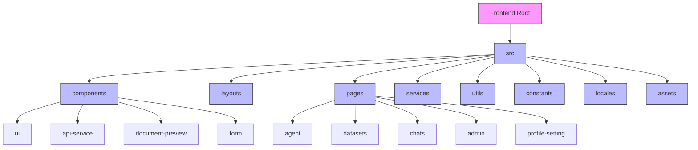
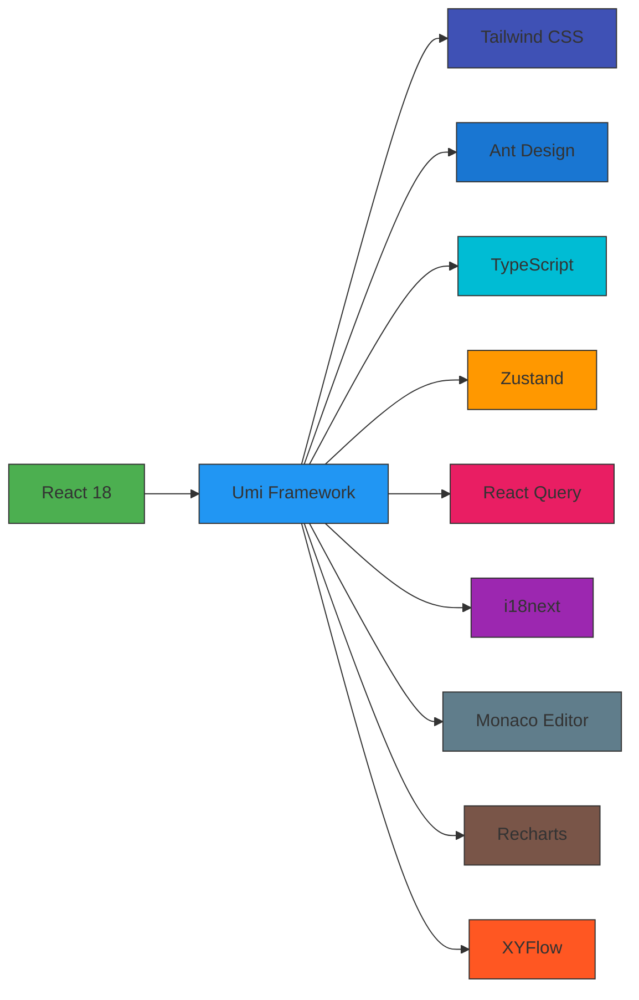
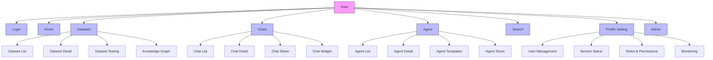
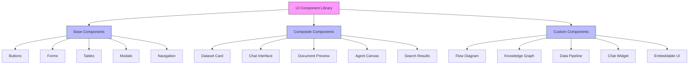
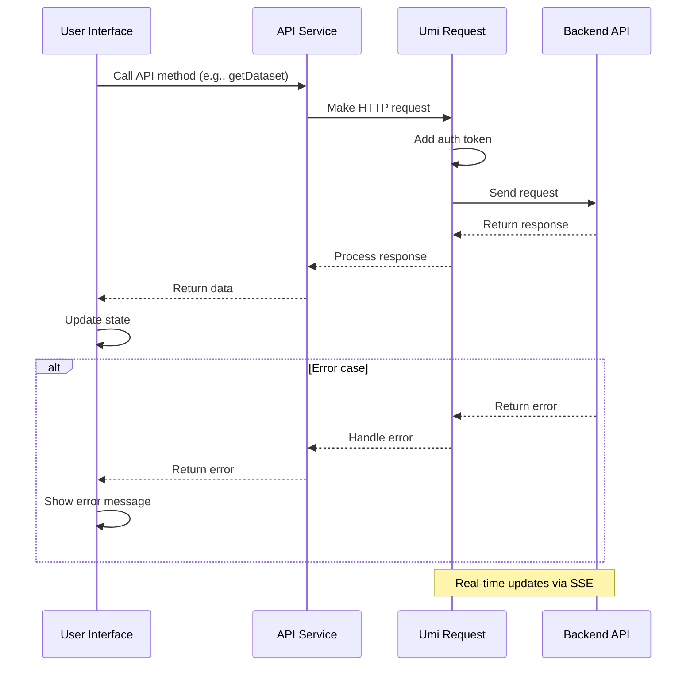
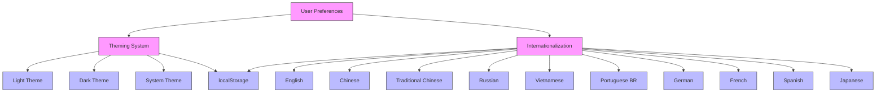

# Frontend Architecture

<cite>
**Referenced Files in This Document**   
- [package.json](file://web/package.json)
- [.umirc.ts](file://web/.umirc.ts)
- [app.tsx](file://web/src/app.tsx)
- [routes.ts](file://web/src/routes.ts)
- [api.ts](file://web/src/utils/api.ts)
- [common.ts](file://web/src/constants/common.ts)
- [config.ts](file://web/src/locales/config.ts)
- [next.tsx](file://web/src/layouts/next.tsx)
</cite>

## Table of Contents
1. [Introduction](#introduction)
2. [Project Structure](#project-structure)
3. [Technology Stack](#technology-stack)
4. [Routing System](#routing-system)
5. [State Management](#state-management)
6. [UI Component Library](#ui-component-library)
7. [API Integration](#api-integration)
8. [Theming and Internationalization](#theming-and-internationalization)
9. [Cross-Cutting Concerns](#cross-cutting-concerns)
10. [Development Workflow](#development-workflow)

## Introduction
RAGFlow's frontend architecture is built on React with the Umi framework, providing a robust foundation for the application's user interface. The architecture follows modern web development practices with a focus on scalability, maintainability, and user experience. The frontend serves as the primary interface for users to interact with RAGFlow's AI-powered document processing and knowledge management capabilities, offering a comprehensive suite of tools for data ingestion, analysis, and retrieval.

The application is structured around key functional areas including datasets, agents, chat interfaces, and search capabilities, with a clean separation between UI components, business logic, and data management. The architecture leverages modern React patterns and state management techniques to ensure optimal performance and responsiveness.

**Section sources**
- [package.json](file://web/package.json)
- [app.tsx](file://web/src/app.tsx)

## Project Structure
The frontend project follows a well-organized directory structure that promotes maintainability and scalability. The main components are organized in the `src` directory with a clear separation of concerns:

- `components/`: Reusable UI components and custom hooks
- `layouts/`: Application layout components that wrap pages
- `pages/`: Route-based page components organized by feature
- `services/`: API service implementations
- `utils/`: Utility functions and helpers
- `constants/`: Application constants and configuration
- `locales/`: Internationalization resources
- `hooks/`: Custom React hooks

The structure follows a feature-based organization within the pages directory, with dedicated folders for major application areas such as agents, datasets, chat interfaces, and administration. This organization enables efficient code navigation and maintenance.



**Diagram sources**
- [package.json](file://web/package.json)
- [app.tsx](file://web/src/app.tsx)

**Section sources**
- [package.json](file://web/package.json)
- [app.tsx](file://web/src/app.tsx)

## Technology Stack
RAGFlow's frontend leverages a modern technology stack built around React and the Umi framework. The core technologies include:

- **React 18**: The foundation of the UI layer, providing component-based architecture
- **Umi 4**: A pluggable enterprise-level React application framework that provides routing, build optimization, and development server capabilities
- **TypeScript**: For type safety and improved developer experience
- **Ant Design 5**: The primary UI component library providing a comprehensive set of accessible components
- **Tailwind CSS**: Utility-first CSS framework for custom styling
- **Zustand**: State management library for global application state
- **React Query**: Data fetching and caching for API interactions
- **i18next**: Internationalization framework for multi-language support

The build system is configured through Umi's configuration file (.umirc.ts), which sets up routing, aliases, proxy configurations for API calls, and integration with Tailwind CSS. The development environment supports hot module replacement and source maps for efficient debugging.



**Diagram sources**
- [package.json](file://web/package.json)
- [.umirc.ts](file://web/.umirc.ts)

**Section sources**
- [package.json](file://web/package.json)
- [.umirc.ts](file://web/.umirc.ts)

## Routing System
The routing system in RAGFlow is implemented using Umi's convention-based routing, which automatically generates routes based on the file structure in the `pages` directory. The application defines a comprehensive set of routes for all major features and sub-features, organized in the `routes.ts` file.

The routing configuration includes nested routes, layout components, and route wrappers for authentication and authorization. Key route categories include:

- Authentication routes (`/login`, `/logout`)
- Main application areas (`/datasets`, `/chats`, `/agent`)
- Administration interface (`/admin`)
- User profile and settings (`/profile-setting`)
- Shared resources and embedding (`/share`, `/widget`)

Route wrappers are used to implement authentication checks, ensuring that users must be logged in to access protected areas of the application. The routing system also supports dynamic routes with parameters, such as `/dataset/:id` for accessing specific datasets.



**Diagram sources**
- [routes.ts](file://web/src/routes.ts)
- [app.tsx](file://web/src/app.tsx)

**Section sources**
- [routes.ts](file://web/src/routes.ts)
- [app.tsx](file://web/src/app.tsx)

## State Management
RAGFlow employs a comprehensive state management strategy that combines multiple approaches to handle different types of application state. The primary state management libraries used are:

- **Zustand**: For global application state such as user authentication, theme preferences, and UI state
- **React Query**: For server state management, handling API data fetching, caching, and synchronization
- **React Context**: For component tree-specific state that needs to be shared across multiple components
- **React Hooks**: For local component state using useState, useReducer, and custom hooks

The application uses React Query extensively for managing API data, providing features like automatic caching, background refetching, and pagination. This approach ensures that data is kept fresh and reduces unnecessary API calls. Global UI state such as theme preferences and user language settings are managed with Zustand, providing a simple and efficient solution for cross-component state sharing.

```mermaid
classDiagram
class AppState {
+theme : string
+language : string
+user : User
+sidebarCollapsed : boolean
+notifications : Notification[]
}
class QueryState {
+data : any
+isLoading : boolean
+error : Error
+isSuccess : boolean
+refetch() : void
}
class UserContext {
+user : User
+login(credentials) : Promise~void~
+logout() : void
+updateProfile(data) : Promise~void~
}
class ThemeContext {
+theme : string
+toggleTheme() : void
+setTheme(theme : string) : void
}
AppState --> QueryState : "uses"
AppState --> UserContext : "provides"
AppState --> ThemeContext : "provides"
UserContext --> QueryState : "uses"
ThemeContext --> QueryState : "uses"
note right of AppState
Global application state
managed with Zustand
end note
note right of QueryState
Server state managed
with React Query
end note
note right of UserContext
Authentication state
using React Context
end note
note right of ThemeContext
Theme preferences
using React Context
end note
```

**Diagram sources**
- [app.tsx](file://web/src/app.tsx)
- [api.ts](file://web/src/utils/api.ts)

**Section sources**
- [app.tsx](file://web/src/app.tsx)
- [api.ts](file://web/src/utils/api.ts)

## UI Component Library
The UI component library in RAGFlow is built on Ant Design 5, extended with custom components and styling to create a cohesive design system. The architecture follows a layered approach with three main component categories:

1. **Base Components**: Direct usage of Ant Design components with minimal customization
2. **Composite Components**: Higher-level components built by combining multiple base components
3. **Custom Components**: Unique components specific to RAGFlow's functionality

The design system implements responsive design principles, ensuring usability across different screen sizes and devices. Accessibility is prioritized with proper ARIA attributes, keyboard navigation support, and semantic HTML structure. The component library includes specialized components for document preview, chat interfaces, data visualization, and workflow design.



**Diagram sources**
- [components/ui](file://web/src/components/ui)
- [components](file://web/src/components)

**Section sources**
- [components](file://web/src/components)
- [app.tsx](file://web/src/app.tsx)

## API Integration
RAGFlow's frontend integrates with backend services through a well-defined API layer that abstracts HTTP requests and response handling. The API integration is structured around several key principles:

- **Centralized API Definitions**: All API endpoints are defined in a single `api.ts` file with typed parameters
- **Request Abstraction**: Umi's request utility is used to handle HTTP requests with interceptors for authentication and error handling
- **Type Safety**: TypeScript interfaces define request and response payloads
- **Error Handling**: Comprehensive error handling with user-friendly messages and retry mechanisms

The API layer supports both RESTful endpoints and Server-Sent Events (SSE) for real-time updates, particularly in chat and agent execution scenarios. Authentication is handled through JWT tokens stored in localStorage, with automatic token refresh mechanisms.



**Diagram sources**
- [api.ts](file://web/src/utils/api.ts)
- [services](file://web/src/services)

**Section sources**
- [api.ts](file://web/src/utils/api.ts)
- [services](file://web/src/services)

## Theming and Internationalization
RAGFlow implements comprehensive theming and internationalization support to accommodate diverse user preferences and global accessibility. The theming system provides multiple options including light, dark, and system themes, with the ability to persist user preferences.

The internationalization system supports multiple languages including English, Chinese (both simplified and traditional), Russian, Vietnamese, Portuguese (BR), German, and French. Language detection is performed based on user preferences and browser settings, with the ability to manually switch languages through the user interface.



**Diagram sources**
- [app.tsx](file://web/src/app.tsx)
- [common.ts](file://web/src/constants/common.ts)
- [config.ts](file://web/src/locales/config.ts)

**Section sources**
- [app.tsx](file://web/src/app.tsx)
- [common.ts](file://web/src/constants/common.ts)
- [config.ts](file://web/src/locales/config.ts)

## Cross-Cutting Concerns
RAGFlow addresses several cross-cutting concerns to ensure a high-quality user experience and maintainable codebase:

- **Accessibility**: The application follows WCAG 2.1 guidelines with proper semantic HTML, ARIA attributes, keyboard navigation, and screen reader support
- **Responsive Design**: The UI adapts to different screen sizes and devices, with mobile-friendly interfaces for key workflows
- **Performance Optimization**: Techniques such as code splitting, lazy loading, and efficient state management minimize load times and improve responsiveness
- **Error Boundary**: React error boundaries protect against UI crashes and provide graceful error recovery
- **Security**: Input sanitization, XSS protection, and secure authentication practices are implemented throughout the application

The architecture also includes comprehensive logging and monitoring capabilities, with support for user activity tracking and system health checks.

**Section sources**
- [app.tsx](file://web/src/app.tsx)
- [components](file://web/src/components)
- [utils](file://web/src/utils)

## Development Workflow
The development workflow for RAGFlow's frontend is designed to support efficient development, testing, and deployment. Key aspects include:

- **Development Server**: Umi's development server with hot module replacement and source maps
- **Code Quality**: ESLint for code linting, Prettier for code formatting, and Husky for pre-commit hooks
- **Testing**: Jest for unit testing with coverage reporting
- **Storybook**: Component documentation and visual testing
- **Build Process**: Optimized production builds with code splitting and minification

The workflow supports rapid iteration with immediate feedback through the development server, while maintaining code quality through automated checks and testing.

**Section sources**
- [package.json](file://web/package.json)
- [.umirc.ts](file://web/.umirc.ts)
- [.eslintrc.js](file://web/.eslintrc.js)
- [.prettierrc](file://web/.prettierrc)