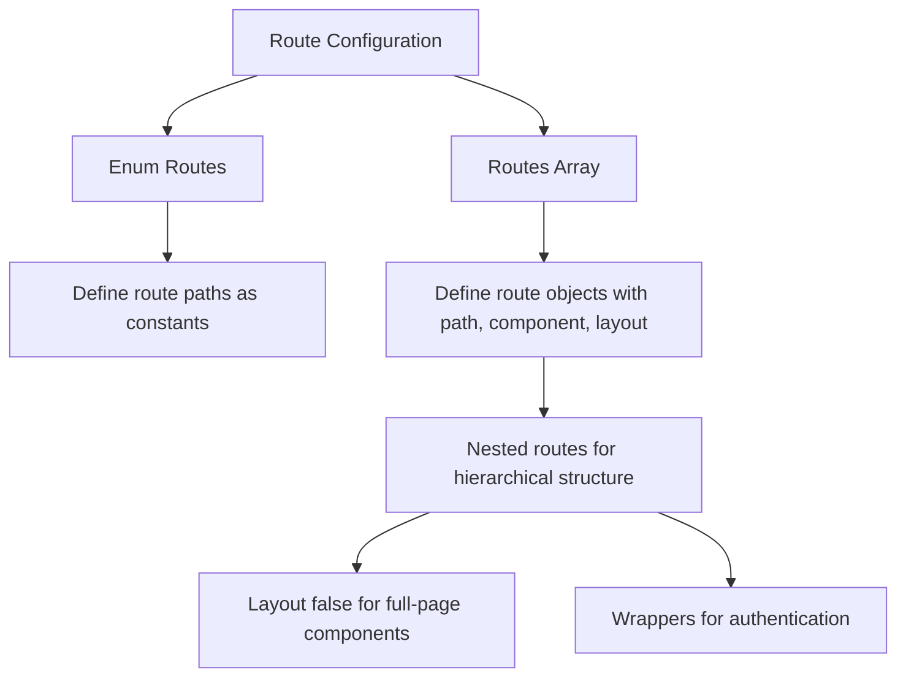
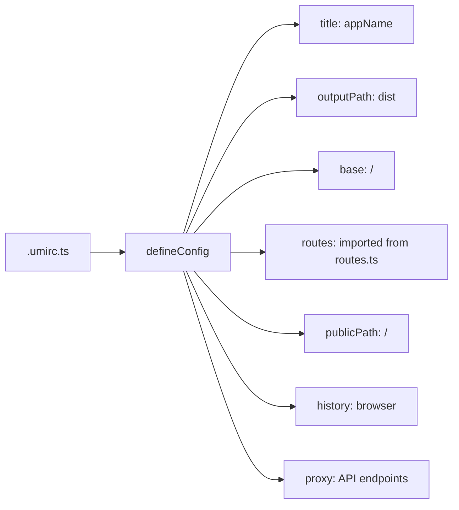
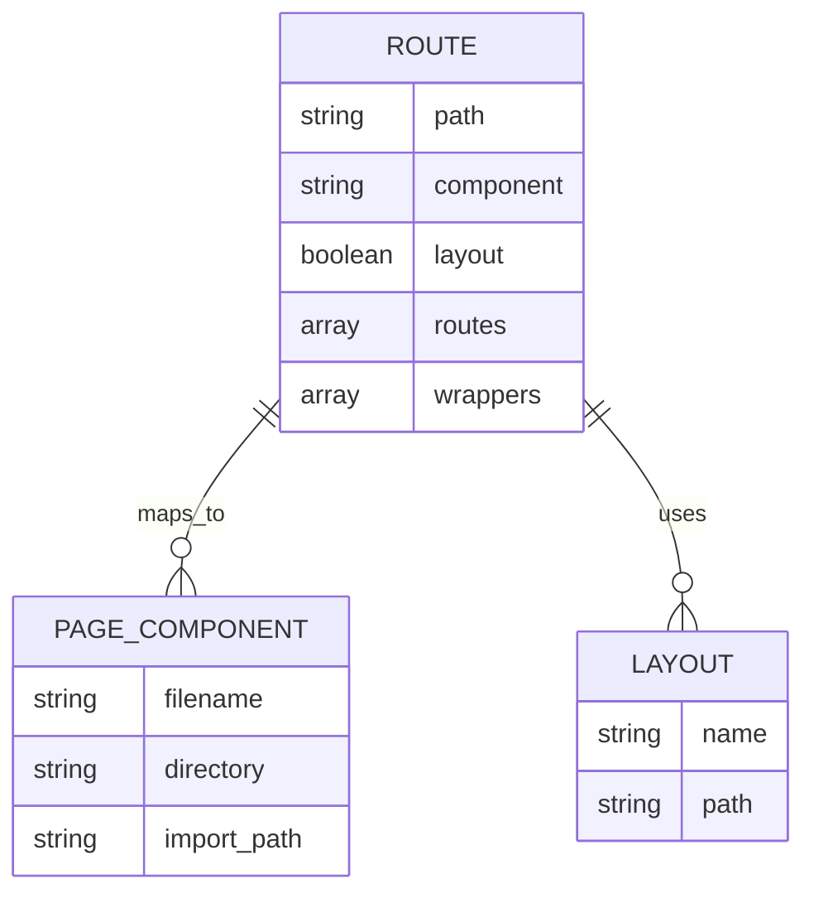
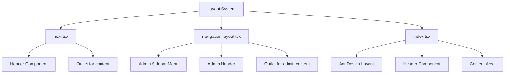
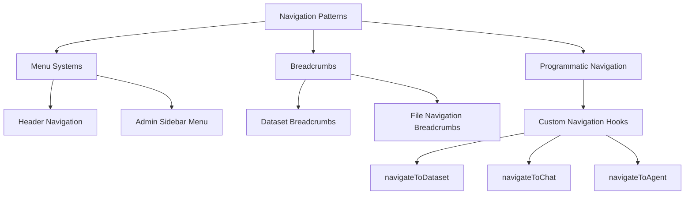
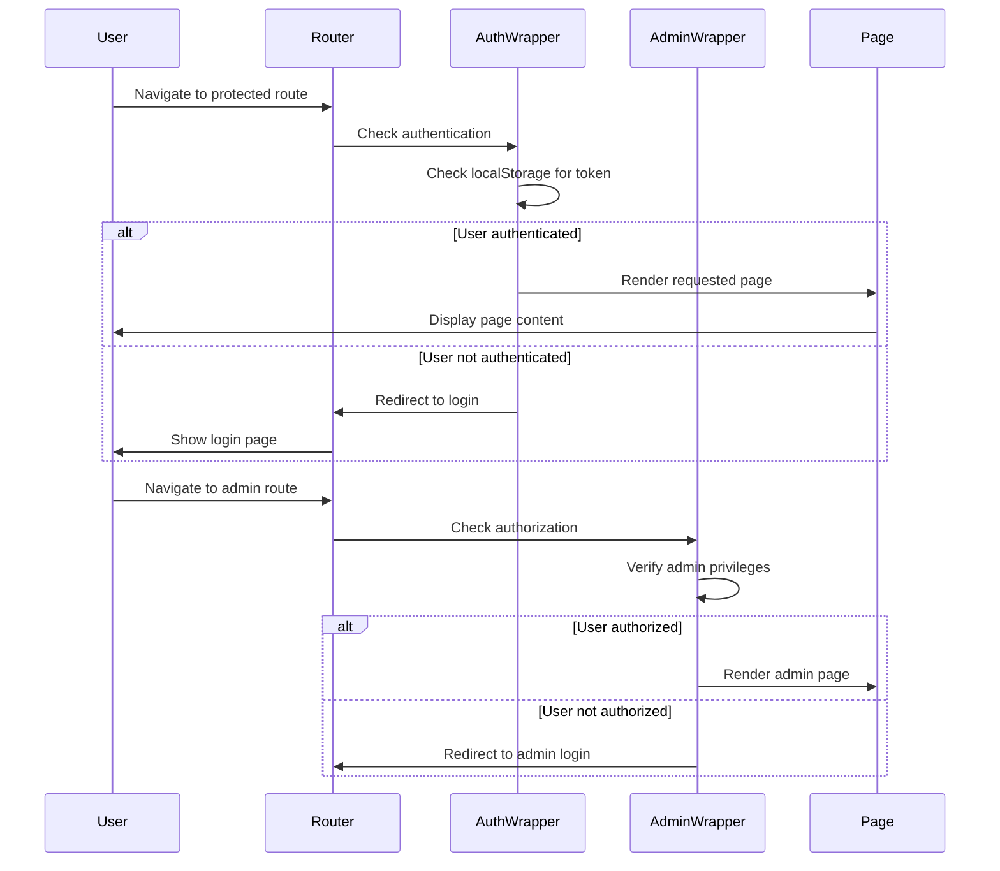
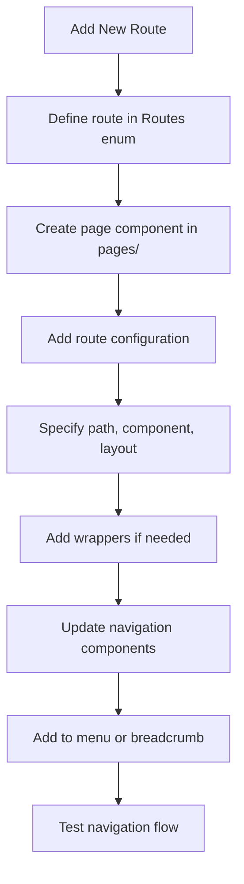

# Routing and Navigation

<cite>
**Referenced Files in This Document**   
- [routes.ts](file://web/src/routes.ts)
- [.umirc.ts](file://web/.umirc.ts)
- [next.tsx](file://web/src/layouts/next.tsx)
- [index.tsx](file://web/src/layouts/index.tsx)
- [auth.tsx](file://web/src/wrappers/auth.tsx)
- [navigate-hooks.ts](file://web/src/hooks/logic-hooks/navigate-hooks.ts)
- [navigation-layout.tsx](file://web/src/pages/admin/layouts/navigation-layout.tsx)
- [dataset/index.tsx](file://web/src/pages/dataset/index.tsx)
- [next-chats/index.tsx](file://web/src/pages/next-chats/index.tsx)
- [file-breadcrumb.tsx](file://web/src/pages/files/file-breadcrumb.tsx)
</cite>

## Table of Contents
1. [Introduction](#introduction)
2. [Route Configuration](#route-configuration)
3. [Umi Framework Integration](#umi-framework-integration)
4. [Route Structure and Page Mapping](#route-structure-and-page-mapping)
5. [Layout System](#layout-system)
6. [Navigation Patterns](#navigation-patterns)
7. [Route Guards and Authentication](#route-guards-and-authentication)
8. [Dynamic Routing and URL Parameters](#dynamic-routing-and-url-parameters)
9. [Adding New Routes](#adding-new-routes)
10. [Conclusion](#conclusion)

## Introduction
RAGFlow's frontend routing and navigation system is built on the Umi framework, providing a structured approach to managing application navigation. The system handles routing configuration, layout management, authentication checks, and navigation patterns across various application sections including agent editor, document management, chat interface, and admin panel. This documentation details the implementation and usage patterns for maintaining consistency across the application.

## Route Configuration
The routing configuration in RAGFlow is defined in the `routes.ts` file, which exports both an enum of route paths and an array of route configurations. The system uses a hierarchical structure with nested routes to organize the application's navigation.

The `Routes` enum defines all available route paths as constants, making it easy to reference routes throughout the application without hardcoding strings. This approach ensures consistency and simplifies maintenance when routes need to be modified.



**Diagram sources**
- [routes.ts](file://web/src/routes.ts#L3-L59)

**Section sources**
- [routes.ts](file://web/src/routes.ts#L3-L401)

## Umi Framework Integration
The Umi framework configuration in `.umirc.ts` integrates the routing system by importing and using the routes defined in `routes.ts`. The configuration sets up key application parameters including title, output path, base URL, and history mode.

The configuration uses browser history mode for clean URLs without hash fragments. It also sets up proxy configurations for API requests, redirecting requests to the appropriate backend services. The integration with Umi enables features like code splitting, lazy loading, and efficient bundling of the application.



**Diagram sources**
- [.umirc.ts](file://web/.umirc.ts#L8-L75)

**Section sources**
- [.umirc.ts](file://web/.umirc.ts#L1-L76)

## Route Structure and Page Mapping
The route structure in RAGFlow follows a logical organization that maps directly to the page components in the `pages/` directory. Each route path corresponds to a specific component file, with a naming convention that uses the `@/pages` alias for clean imports.

The system uses nested routes to create hierarchical navigation, particularly evident in sections like datasets and admin panel. For example, the dataset section has multiple sub-routes for different views (overview, settings, testing) that share a common layout but display different content.



**Diagram sources**
- [routes.ts](file://web/src/routes.ts#L61-L401)
- [pages/](file://web/src/pages/)

**Section sources**
- [routes.ts](file://web/src/routes.ts#L61-L401)

## Layout System
The layout system in RAGFlow provides consistent navigation elements across different sections of the application through components in the `layouts/` directory. The system uses multiple layout components for different application contexts.

The main layout (`next.tsx`) provides a consistent header and content area for the primary application interface, while the admin panel uses a separate navigation layout (`navigation-layout.tsx`) with a sidebar menu for administrative functions. Layouts use the `Outlet` component from Umi to render child routes, enabling nested content rendering.



**Diagram sources**
- [next.tsx](file://web/src/layouts/next.tsx#L1-L12)
- [navigation-layout.tsx](file://web/src/pages/admin/layouts/navigation-layout.tsx#L1-L143)
- [index.tsx](file://web/src/layouts/index.tsx#L1-L38)

**Section sources**
- [next.tsx](file://web/src/layouts/next.tsx#L1-L12)
- [navigation-layout.tsx](file://web/src/pages/admin/layouts/navigation-layout.tsx#L1-L143)

## Navigation Patterns
RAGFlow implements several navigation patterns throughout the application, including menu systems, breadcrumbs, and programmatic navigation. These patterns provide users with intuitive ways to move through the application and understand their current location.

The application uses breadcrumbs in contexts like dataset management and file navigation to show the hierarchical path to the current page. Menu systems are implemented in the header and admin sidebar to provide primary navigation options. Programmatic navigation is handled through custom hooks that encapsulate navigation logic.



**Diagram sources**
- [dataset/index.tsx](file://web/src/pages/dataset/index.tsx#L1-L49)
- [file-breadcrumb.tsx](file://web/src/pages/files/file-breadcrumb.tsx#L1-L36)
- [navigate-hooks.ts](file://web/src/hooks/logic-hooks/navigate-hooks.ts#L1-L201)

**Section sources**
- [dataset/index.tsx](file://web/src/pages/dataset/index.tsx#L1-L49)
- [file-breadcrumb.tsx](file://web/src/pages/files/file-breadcrumb.tsx#L1-L36)

## Route Guards and Authentication
The routing system implements authentication checks through route guards and wrappers to protect private routes. The `auth.tsx` wrapper component checks the user's authentication status and redirects to the login page if not authenticated.

For the admin panel, a specialized `authorized` wrapper ensures that only authenticated users can access administrative functions. The authentication system uses JWT tokens stored in localStorage, with the `useAuth` hook providing a React-friendly interface to check authentication status.



**Diagram sources**
- [auth.tsx](file://web/src/wrappers/auth.tsx#L1-L15)
- [authorized.tsx](file://web/src/pages/admin/wrappers/authorized.tsx#L1-L9)
- [auth-hooks.ts](file://web/src/hooks/auth-hooks.ts#L1-L54)

**Section sources**
- [auth.tsx](file://web/src/wrappers/auth.tsx#L1-L15)
- [authorized.tsx](file://web/src/pages/admin/wrappers/authorized.tsx#L1-L9)

## Dynamic Routing and URL Parameters
RAGFlow's routing system supports dynamic routing with URL parameters for content that varies by identifier. Routes use the `:id` pattern to capture dynamic segments, allowing the application to display different content based on the URL parameter.

The system also handles query parameters for filtering, sorting, and other state management needs. Custom hooks like `useNavigatePage` provide functions for navigating to routes with dynamic parameters, abstracting the URL construction logic.

```mermaid
flowchart LR
A[Dynamic Routing] --> B[Route Parameters]
B --> C[:id in route path]
B --> D[Capture dynamic segments]
A --> E[Query Parameters]
E --> F[?key=value format]
E --> G[Handle filtering and state]
A --> H[Navigation Hooks]
H --> I[useNavigatePage]
I --> J[navigateToChat(id)]
I --> K[navigateToDataset(id)]
I --> L[navigateToAgent(id)]
```

**Diagram sources**
- [routes.ts](file://web/src/routes.ts#L137-L180)
- [navigate-hooks.ts](file://web/src/hooks/logic-hooks/navigate-hooks.ts#L65-L85)

**Section sources**
- [routes.ts](file://web/src/routes.ts#L137-L180)
- [navigate-hooks.ts](file://web/src/hooks/logic-hooks/navigate-hooks.ts#L65-L85)

## Adding New Routes
To add new routes to the application while maintaining consistency with existing navigation patterns, developers should follow a standardized process. First, define the route path in the `Routes` enum in `routes.ts`. Then, create the corresponding page component in the appropriate directory under `pages/`.

Next, add the route configuration to the routes array, specifying the path, component, layout, and any required wrappers. For routes that require authentication, include the appropriate wrapper. Finally, update any navigation components (menus, breadcrumbs) to include links to the new route.



**Section sources**
- [routes.ts](file://web/src/routes.ts#L3-L401)
- [pages/](file://web/src/pages/)

## Conclusion
RAGFlow's frontend routing and navigation system provides a robust foundation for managing application navigation. By leveraging the Umi framework and implementing consistent patterns across the application, the system enables intuitive user experiences while maintaining code organization and maintainability. The combination of route configuration, layout management, authentication checks, and navigation patterns creates a cohesive navigation experience across all application sections.