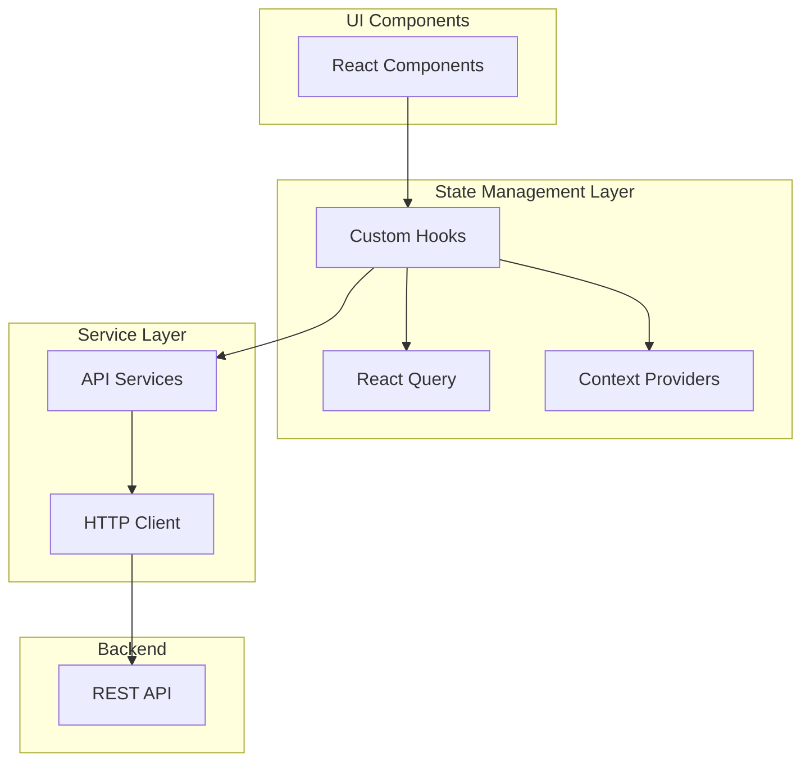
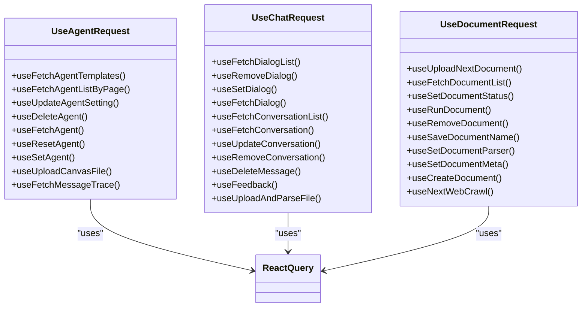
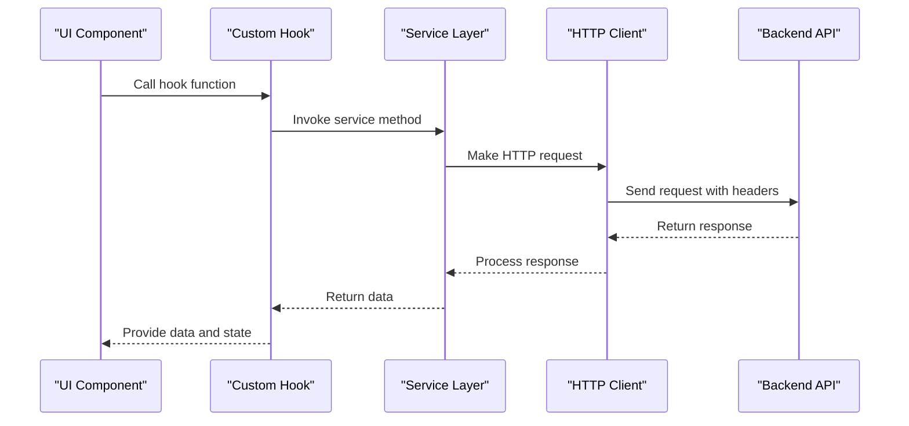
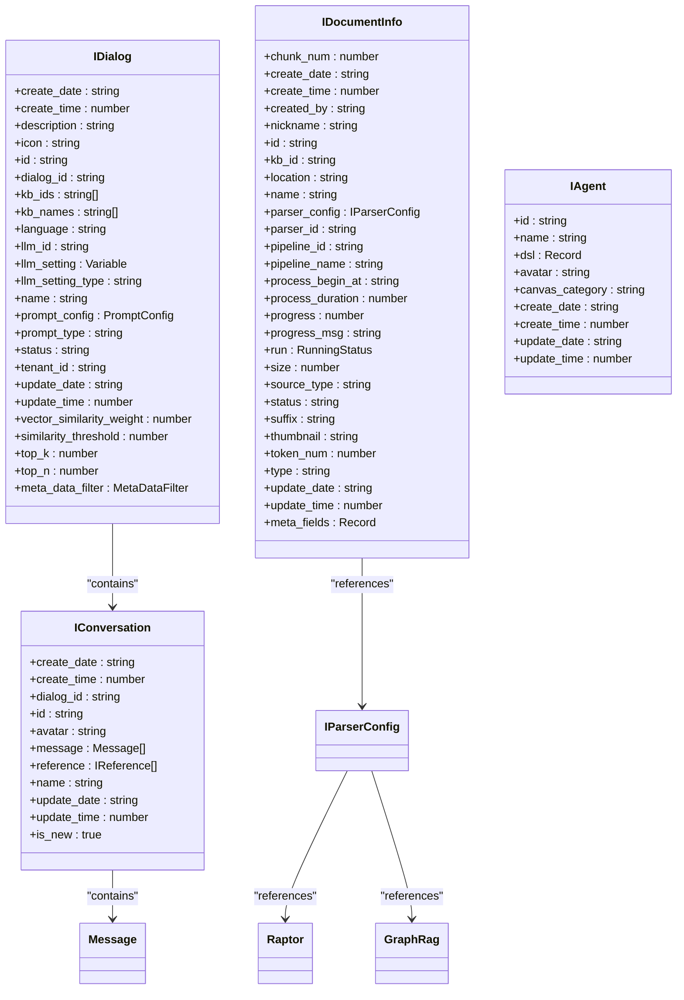
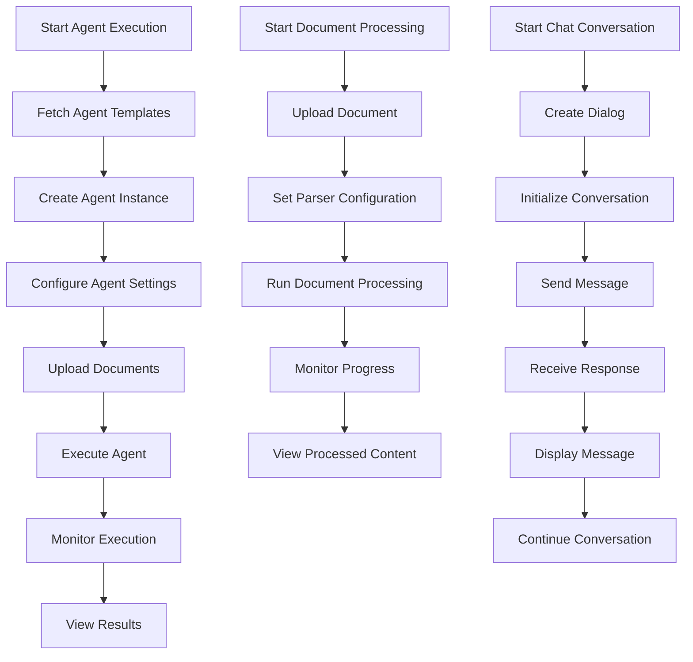
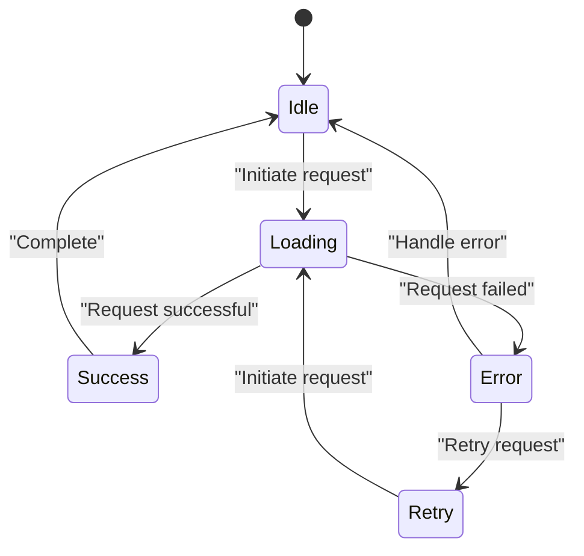
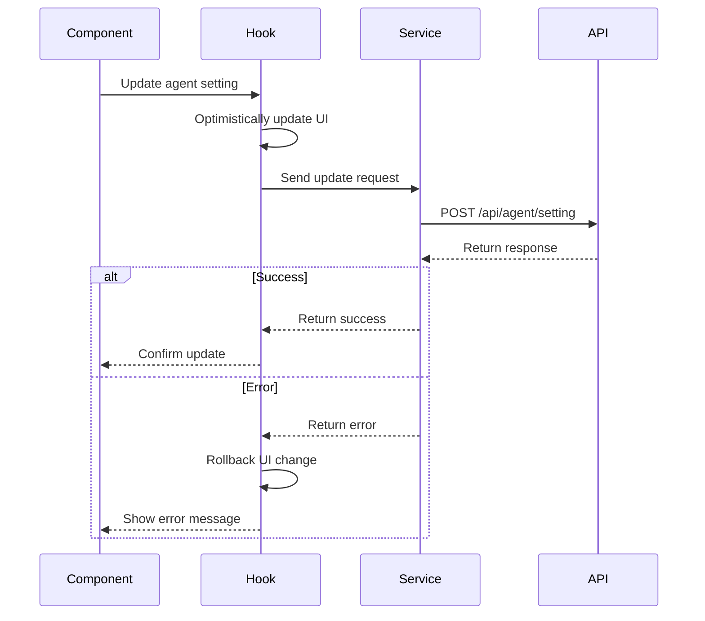

# State Management

<cite>
**Referenced Files in This Document**   
- [use-agent-request.ts](file://web/src/hooks/use-agent-request.ts)
- [use-chat-request.ts](file://web/src/hooks/use-chat-request.ts)
- [use-document-request.ts](file://web/src/hooks/use-document-request.ts)
- [common-hooks.tsx](file://web/src/hooks/common-hooks.tsx)
- [logic-hooks.ts](file://web/src/hooks/logic-hooks.ts)
- [next-chat-service.ts](file://web/src/services/next-chat-service.ts)
- [knowledge-service.ts](file://web/src/services/knowledge-service.ts)
- [agent-service.ts](file://web/src/services/agent-service.ts)
- [chat.ts](file://web/src/interfaces/database/chat.ts)
- [document.ts](file://web/src/interfaces/database/document.ts)
- [agent.ts](file://web/src/interfaces/database/agent.ts)
- [request/chat.ts](file://web/src/interfaces/request/chat.ts)
- [request/document.ts](file://web/src/interfaces/request/document.ts)
- [request/agent.ts](file://web/src/interfaces/request/agent.ts)
</cite>

## Table of Contents
1. [Introduction](#introduction)
2. [State Management Architecture](#state-management-architecture)
3. [Custom Hooks for Business Logic](#custom-hooks-for-business-logic)
4. [Service Layer Implementation](#service-layer-implementation)
5. [Interface Definitions](#interface-definitions)
6. [Key Workflow State Management](#key-workflow-state-management)
7. [Data Synchronization and Loading States](#data-synchronization-and-loading-states)
8. [Error Handling and Optimistic Updates](#error-handling-and-optimistic-updates)
9. [Conclusion](#conclusion)

## Introduction
RAGFlow's frontend state management system employs a comprehensive approach combining React hooks for local component state with custom hooks that encapsulate business logic and API interactions. The system is designed to manage complex workflows including agent execution, document processing, and chat conversations. This documentation details the patterns used for state management, focusing on the custom hooks in the hooks/ directory, the service layer in services/, and the interface definitions in interfaces/ that provide TypeScript types for API requests and responses.

**Section sources**
- [use-agent-request.ts](file://web/src/hooks/use-agent-request.ts#L1-L789)
- [use-chat-request.ts](file://web/src/hooks/use-chat-request.ts#L1-L610)
- [use-document-request.ts](file://web/src/hooks/use-document-request.ts#L1-L548)

## State Management Architecture
RAGFlow's state management architecture follows a layered approach that separates concerns between UI state, business logic, and data fetching. The system primarily relies on React Query for data fetching and caching, combined with custom hooks that encapsulate specific business workflows. Local component state is managed using React's useState and useReducer hooks, while global application state is handled through context providers and shared custom hooks.

The architecture follows the principle of separating data fetching logic from component rendering, allowing components to focus on presentation while custom hooks handle the complexity of API interactions, error handling, and response processing. This separation enables better code reuse and testability across the application.

**Diagram sources**
- [use-agent-request.ts](file://web/src/hooks/use-agent-request.ts#L1-L789)
- [use-chat-request.ts](file://web/src/hooks/use-chat-request.ts#L1-L610)
- [use-document-request.ts](file://web/src/hooks/use-document-request.ts#L1-L548)
- [next-chat-service.ts](file://web/src/services/next-chat-service.ts#L1-L144)
- [knowledge-service.ts](file://web/src/services/knowledge-service.ts#L1-L274)

**Section sources**
- [use-agent-request.ts](file://web/src/hooks/use-agent-request.ts#L1-L789)
- [use-chat-request.ts](file://web/src/hooks/use-chat-request.ts#L1-L610)
- [use-document-request.ts](file://web/src/hooks/use-document-request.ts#L1-L548)
- [next-chat-service.ts](file://web/src/services/next-chat-service.ts#L1-L144)

## Custom Hooks for Business Logic
RAGFlow implements a comprehensive set of custom hooks in the hooks/ directory that encapsulate business logic and API interactions. These hooks provide a clean interface for components to interact with backend services, abstracting away the complexity of API calls, error handling, and response processing.

The primary custom hooks include use-agent-request, use-chat-request, and use-document-request, each designed to handle specific domain concerns. These hooks leverage React Query's useQuery and useMutation hooks to manage data fetching, caching, and mutations, providing features like automatic refetching, loading states, and error handling out of the box.

**Diagram sources**
- [use-agent-request.ts](file://web/src/hooks/use-agent-request.ts#L1-L789)
- [use-chat-request.ts](file://web/src/hooks/use-chat-request.ts#L1-L610)
- [use-document-request.ts](file://web/src/hooks/use-document-request.ts#L1-L548)

**Section sources**
- [use-agent-request.ts](file://web/src/hooks/use-agent-request.ts#L1-L789)
- [use-chat-request.ts](file://web/src/hooks/use-chat-request.ts#L1-L610)
- [use-document-request.ts](file://web/src/hooks/use-document-request.ts#L1-L548)

## Service Layer Implementation
The service layer in RAGFlow's frontend is implemented in the services/ directory and handles HTTP requests to the backend API. Each service module abstracts API endpoints and provides methods for request formatting, error handling, and response processing. The services use a consistent pattern of defining methods with URLs and HTTP methods, which are then registered with a server registration utility.

The service layer acts as an adapter between the custom hooks and the actual API endpoints, providing a clean interface for data operations. This abstraction allows the custom hooks to remain focused on business logic while the service layer handles the technical details of HTTP communication, authentication, and request/response transformation.

**Diagram sources**
- [next-chat-service.ts](file://web/src/services/next-chat-service.ts#L1-L144)
- [knowledge-service.ts](file://web/src/services/knowledge-service.ts#L1-L274)
- [agent-service.ts](file://web/src/services/agent-service.ts#L1-L147)

**Section sources**
- [next-chat-service.ts](file://web/src/services/next-chat-service.ts#L1-L144)
- [knowledge-service.ts](file://web/src/services/knowledge-service.ts#L1-L274)
- [agent-service.ts](file://web/src/services/agent-service.ts#L1-L147)

## Interface Definitions
The interface definitions in the interfaces/ directory provide TypeScript types for API requests and responses, ensuring type safety throughout the application. These interfaces are organized by domain and include both database models and request/response schemas.

The interface structure follows a clear pattern with database interfaces defining the shape of data returned from the API, and request interfaces defining the expected structure of data sent to the API. This separation allows for precise type checking and better documentation of the API contract.

**Diagram sources**
- [chat.ts](file://web/src/interfaces/database/chat.ts#L1-L206)
- [document.ts](file://web/src/interfaces/database/document.ts#L1-L59)
- [agent.ts](file://web/src/interfaces/database/agent.ts)

**Section sources**
- [chat.ts](file://web/src/interfaces/database/chat.ts#L1-L206)
- [document.ts](file://web/src/interfaces/database/document.ts#L1-L59)
- [request/chat.ts](file://web/src/interfaces/request/chat.ts)
- [request/document.ts](file://web/src/interfaces/request/document.ts)
- [request/agent.ts](file://web/src/interfaces/request/agent.ts)

## Key Workflow State Management
RAGFlow implements specific state management patterns for key workflows such as agent execution, document processing, and chat conversations. Each workflow has dedicated custom hooks that encapsulate the entire lifecycle, from initialization to completion.

For agent execution, the use-agent-request hook provides methods to manage agent creation, configuration, execution, and monitoring. Document processing is handled by use-document-request, which manages document upload, parsing, status updates, and metadata management. Chat conversations are managed by use-chat-request, which handles conversation creation, message sending, and real-time updates.

**Diagram sources**
- [use-agent-request.ts](file://web/src/hooks/use-agent-request.ts#L1-L789)
- [use-document-request.ts](file://web/src/hooks/use-document-request.ts#L1-L548)
- [use-chat-request.ts](file://web/src/hooks/use-chat-request.ts#L1-L610)

**Section sources**
- [use-agent-request.ts](file://web/src/hooks/use-agent-request.ts#L1-L789)
- [use-document-request.ts](file://web/src/hooks/use-document-request.ts#L1-L548)
- [use-chat-request.ts](file://web/src/hooks/use-chat-request.ts#L1-L610)

## Data Synchronization and Loading States
RAGFlow's state management system includes robust mechanisms for data synchronization between components and comprehensive loading state management. The system uses React Query's caching and refetching capabilities to ensure data consistency across the application.

Loading states are managed through the isLoading properties returned by useQuery and useMutation hooks, providing a consistent way to handle pending operations. The system also implements optimistic updates for certain operations, immediately updating the UI while the request is processed in the background.

**Diagram sources**
- [use-agent-request.ts](file://web/src/hooks/use-agent-request.ts#L1-L789)
- [use-chat-request.ts](file://web/src/hooks/use-chat-request.ts#L1-L610)
- [use-document-request.ts](file://web/src/hooks/use-document-request.ts#L1-L548)

**Section sources**
- [use-agent-request.ts](file://web/src/hooks/use-agent-request.ts#L1-L789)
- [use-chat-request.ts](file://web/src/hooks/use-chat-request.ts#L1-L610)
- [use-document-request.ts](file://web/src/hooks/use-document-request.ts#L1-L548)

## Error Handling and Optimistic Updates
The state management system in RAGFlow implements comprehensive error handling and optimistic update patterns. Error handling is centralized in the custom hooks, which catch and process API errors, display appropriate user feedback, and provide error details for debugging.

Optimistic updates are used for operations where immediate UI feedback is important, such as updating agent settings or document metadata. The system temporarily updates the UI state and then reconciles with the server response, rolling back the change if the request fails.

**Diagram sources**
- [use-agent-request.ts](file://web/src/hooks/use-agent-request.ts#L1-L789)
- [use-chat-request.ts](file://web/src/hooks/use-chat-request.ts#L1-L610)
- [use-document-request.ts](file://web/src/hooks/use-document-request.ts#L1-L548)

**Section sources**
- [use-agent-request.ts](file://web/src/hooks/use-agent-request.ts#L1-L789)
- [use-chat-request.ts](file://web/src/hooks/use-chat-request.ts#L1-L610)
- [use-document-request.ts](file://web/src/hooks/use-document-request.ts#L1-L548)

## Conclusion
RAGFlow's frontend state management system provides a robust and scalable architecture for handling complex AI workflows. By combining React hooks for local state with custom hooks that encapsulate business logic, the system achieves a clean separation of concerns while maintaining type safety through comprehensive interface definitions.

The service layer abstracts API interactions, providing a consistent interface for data operations, while the custom hooks manage the complexity of specific workflows like agent execution, document processing, and chat conversations. This architecture enables efficient data synchronization, comprehensive loading state management, and robust error handling, creating a responsive and reliable user experience.

The system's design allows for easy extension and maintenance, with clear patterns for adding new features and workflows. By following these established patterns, developers can quickly implement new functionality while maintaining consistency across the application.

**Section sources**
- [use-agent-request.ts](file://web/src/hooks/use-agent-request.ts#L1-L789)
- [use-chat-request.ts](file://web/src/hooks/use-chat-request.ts#L1-L610)
- [use-document-request.ts](file://web/src/hooks/use-document-request.ts#L1-L548)
- [next-chat-service.ts](file://web/src/services/next-chat-service.ts#L1-L144)
- [knowledge-service.ts](file://web/src/services/knowledge-service.ts#L1-L274)
- [agent-service.ts](file://web/src/services/agent-service.ts#L1-L147)