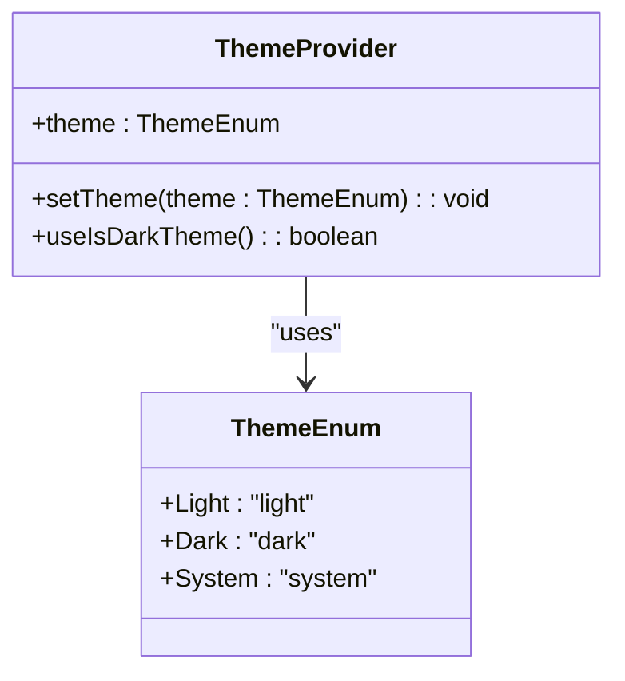
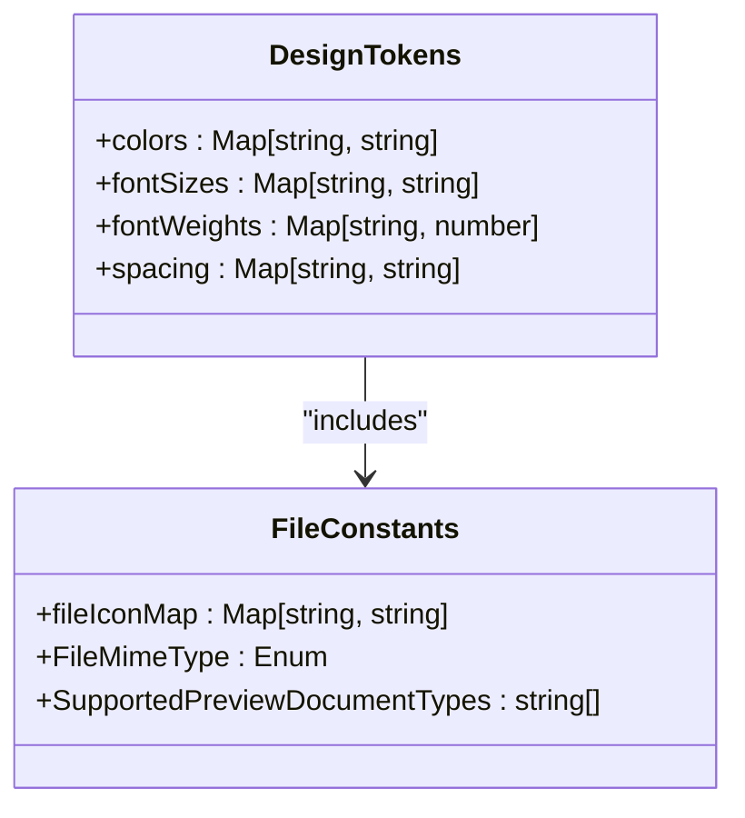
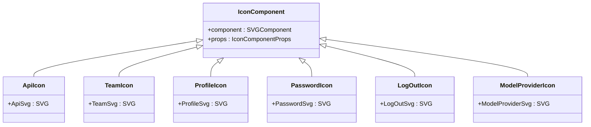
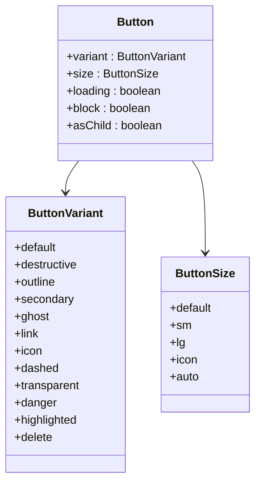

# UI Design System

<cite>
**Referenced Files in This Document**   
- [button.tsx](file://web/src/components/ui/button.tsx)
- [card.tsx](file://web/src/components/ui/card.tsx)
- [dialog.tsx](file://web/src/components/ui/dialog.tsx)
- [form.tsx](file://web/src/components/ui/form.tsx)
- [table.tsx](file://web/src/components/ui/table.tsx)
- [variable.less](file://web/src/less/variable.less)
- [mixins.less](file://web/src/less/mixins.less)
- [index.less](file://web/src/less/index.less)
- [common.ts](file://web/src/constants/common.ts)
- [next-icon.tsx](file://web/src/assets/icon/next-icon.tsx)
- [svg-icon.tsx](file://web/src/components/svg-icon.tsx)
</cite>

## Table of Contents
1. [Introduction](#introduction)
2. [Design System Overview](#design-system-overview)
3. [Theme Configuration](#theme-configuration)
4. [LESS Variables and Mixins](#less-variables-and-mixins)
5. [Design Tokens and Constants](#design-tokens-and-constants)
6. [Icon System and Asset Management](#icon-system-and-asset-management)
7. [Core UI Components](#core-ui-components)
8. [Accessibility and Responsive Design](#accessibility-and-responsive-design)
9. [Component Development Guidelines](#component-development-guidelines)
10. [Conclusion](#conclusion)

## Introduction

RAGFlow's UI design system provides a consistent, accessible, and scalable foundation for building user interfaces across the application. Built on Ant Design components extended with custom styling and new components, the design system ensures visual harmony and functional consistency throughout the platform. This documentation details the implementation of the design system, covering theme configuration, design tokens, icon management, and key UI components.

## Design System Overview

The RAGFlow UI design system is implemented in the `web/src` directory, with components organized in a structured hierarchy. The system leverages Ant Design as a base framework, extending it with custom components and styling to create a cohesive visual language. The design system follows modern React practices with TypeScript, using component composition and utility functions to ensure reusability and maintainability.

The core of the design system resides in the `components/ui` directory, which contains primitive components that serve as building blocks for the application's user interface. These components are designed to be composable, accessible, and theme-aware, ensuring consistent behavior and appearance across different contexts.

**Section sources**
- [web/src/components/ui](file://web/src/components/ui)

## Theme Configuration

The theme system in RAGFlow enables dynamic switching between light and dark modes, providing users with a customizable visual experience. The theme configuration is managed through React context and CSS variables, allowing for seamless theme transitions without requiring page reloads.

The theme provider component (`theme-provider.tsx`) manages the current theme state and applies the appropriate CSS classes to the application root. This implementation uses the `useIsDarkTheme` hook to determine the current theme preference, which can be set to "light", "dark", or "system" (following the user's operating system preference).

The theme system defines a comprehensive set of color variables for text, backgrounds, borders, and interactive elements, ensuring visual consistency across components. These variables are applied through CSS classes and inline styles, with appropriate contrast ratios to meet accessibility standards.



**Diagram sources**
- [common.ts](file://web/src/constants/common.ts#L163-L167)

## LESS Variables and Mixins

The RAGFlow design system uses LESS for CSS preprocessing, providing a powerful way to manage styles and create reusable patterns. The LESS configuration is organized in three main files within the `less` directory: `variable.less`, `mixins.less`, and `index.less`.

The `variable.less` file defines a comprehensive set of design tokens that control the visual appearance of the application. These include color variables, font weights, and font sizes that establish the foundation of the design system's visual language.

```less
@fontWeight600: 600;
@fontWeight700: 700;

@grayBackground: rgba(247, 248, 250, 0.1);
@gray2: rgba(29, 25, 41, 1);
@gray3: rgba(52, 48, 62, 1);
@gray8: rgba(165, 163, 169, 1);
@gray11: rgba(232, 232, 234, 1);
@purple: rgba(127, 86, 217, 1);
@selectedBackgroundColor: rgba(239, 248, 255, 1);
@blurBackground: rgba(22, 119, 255, 0.5);
@blurBackgroundHover: rgba(22, 119, 255, 0.2);

@fontSize12: 12px;
@fontSize14: 14px;
@fontSize16: 16px;
@fontSize18: 18px;
```

The `mixins.less` file contains reusable style patterns that can be applied across components. These mixins encapsulate common styling patterns, promoting consistency and reducing code duplication. Key mixins include:

- `.tableCell()`: Standard styling for table cells with padding and borders
- `.chunkText()`: Styling for text chunks with special formatting for emphasis
- `.pointerCursor()`: Applies pointer cursor for interactive elements
- `.clearCardBody()`: Removes padding and margins from Ant Design card bodies
- `.textEllipsis()`: Truncates text with an ellipsis for overflow
- `.multipleLineEllipsis(@line)`: Truncates text after a specified number of lines
- `.linkText()`: Styling for link-like text elements
- `.commonNode()`: Shadow, radius, and layout styling for common nodes

The `index.less` file serves as the entry point for the LESS styles, importing both the variables and mixins files to make them available throughout the application.

**Section sources**
- [variable.less](file://web/src/less/variable.less)
- [mixins.less](file://web/src/less/mixins.less)
- [index.less](file://web/src/less/index.less)

## Design Tokens and Constants

The design system defines a comprehensive set of design tokens and constants in the `constants` directory, particularly in the `common.ts` file. These tokens establish the foundational visual properties for the application, including colors, typography, spacing, and other visual attributes.

The color system includes semantic color variables that describe their purpose rather than their visual appearance, allowing for easier theme switching and maintenance. The system defines grays, purple accents, and background colors that create a cohesive visual hierarchy.

Typography is standardized with a set of font sizes (12px, 14px, 16px, and 18px) and font weights (600 and 700) that ensure consistent text hierarchy across the application. These values are used in conjunction with Ant Design's typography system to create a harmonious text experience.

The constants file also includes utility mappings for file types, MIME types, and supported preview formats, which are used throughout the application to determine how to handle and display different file types.



**Diagram sources**
- [common.ts](file://web/src/constants/common.ts)

## Icon System and Asset Management

RAGFlow implements a comprehensive icon system that combines custom SVG icons with Ant Design's icon library. The icon system is managed through the `assets/icon` directory and supporting components that handle icon rendering and theme adaptation.

The `next-icon.tsx` file defines a collection of custom SVG icons used throughout the application, including icons for API, team, profile, password, logout, model providers, prompts, Wikipedia, keywords, GitHub, and weather services. These icons are implemented as React components that use the current color via `currentColor`, allowing them to inherit the text color of their container.



**Diagram sources**
- [next-icon.tsx](file://web/src/assets/icon/next-icon.tsx)

The `svg-icon.tsx` component provides a flexible system for loading and displaying SVG icons from the assets directory. It uses Webpack's `require.context` to dynamically import SVG files, allowing for easy addition of new icons without manual imports. The component supports theme-specific icons, with different versions for light and dark themes.

The icon system also includes specialized components for LLM (Large Language Model) providers and home icons, which automatically adapt to the current theme. The `LlmIcon` component, for example, can display different icon variants based on the theme, ensuring optimal visibility in both light and dark modes.

**Section sources**
- [next-icon.tsx](file://web/src/assets/icon/next-icon.tsx)
- [svg-icon.tsx](file://web/src/components/svg-icon.tsx)

## Core UI Components

The RAGFlow design system provides a comprehensive set of UI components that extend Ant Design's capabilities while maintaining consistency with the overall design language. These components are organized in the `components/ui` directory and follow a consistent pattern of implementation.

### Button Component

The button component is one of the most frequently used elements in the design system, providing multiple variants for different use cases. Implemented in `button.tsx`, the button uses `class-variance-authority` (cva) to define its variants and sizes, ensuring consistent styling across the application.

The button supports the following variants:
- **default**: Primary action with solid background
- **destructive**: For actions that delete or remove data
- **outline**: Secondary action with border and transparent background
- **secondary**: Alternative primary action
- **ghost**: Minimal styling for tertiary actions
- **link**: Text-only button styled like a hyperlink
- **icon**: Circular button for icon-only actions
- **dashed**: Button with dashed border for specific actions
- **transparent**: Transparent button with border
- **danger**: Red outline for high-risk actions
- **highlighted**: Button with accent border for emphasis
- **delete**: Special styling for delete actions

The button also supports different sizes (default, small, large, icon, and auto) and additional features like loading states and block display.



**Diagram sources**
- [button.tsx](file://web/src/components/ui/button.tsx)

### Card Component

The card component provides a container for grouping related content with a consistent visual treatment. Implemented in `card.tsx`, the card consists of several sub-components that can be used together or independently:

- **Card**: The main container with border, shadow, and background
- **CardHeader**: Top section for titles and descriptions
- **CardTitle**: Main heading for the card
- **CardDescription**: Supporting text below the title
- **CardContent**: Main content area
- **CardFooter**: Bottom section for actions or additional information

The card component uses consistent spacing and typography to create a clear hierarchy, with the header providing context and the content area focusing on the primary information.

**Section sources**
- [card.tsx](file://web/src/components/ui/card.tsx)

### Dialog Component

The dialog component provides a modal interface for displaying content that requires user attention. Implemented in `dialog.tsx`, the dialog uses Radix UI's primitives for accessible modal behavior, ensuring proper focus management and keyboard navigation.

Key features of the dialog component include:
- Animated entrance and exit transitions
- Backdrop overlay with blur effect
- Close button with accessible label
- Header, body, and footer sections
- Responsive sizing with maximum width constraints
- Proper z-index management for stacking

The dialog supports various content types and can be customized with different header styles and footer action layouts.

**Section sources**
- [dialog.tsx](file://web/src/components/ui/dialog.tsx)

### Form Component

The form component system provides a structured approach to building accessible forms with consistent styling and validation. Implemented in `form.tsx`, the form system uses React Hook Form for state management and validation, integrating with the design system's components.

The form system includes the following components:
- **Form**: Form provider that manages form state
- **FormField**: Wrapper for form fields that connects to React Hook Form
- **FormItem**: Container for form fields with consistent spacing
- **FormLabel**: Accessible label with optional required indicator and tooltip
- **FormControl**: Wrapper for form controls that connects to form state
- **FormDescription**: Supporting text for form fields
- **FormMessage**: Error message display with proper ARIA attributes

The form system ensures proper accessibility by automatically generating IDs and managing ARIA attributes, while providing a clean API for developers to build forms.

**Section sources**
- [form.tsx](file://web/src/components/ui/form.tsx)

### Table Component

The table component provides a styled table interface for displaying tabular data. Implemented in `table.tsx`, the table uses a wrapper div to control overflow and scrolling behavior, with consistent styling for all table elements.

Key features of the table component include:
- Responsive scrolling for wide tables
- Sticky header for large datasets
- Consistent cell padding and alignment
- Hover effects for row interaction
- Selected state styling
- Caption support for table descriptions

The table system breaks down into several sub-components (Table, TableHeader, TableBody, TableFooter, TableRow, TableHead, TableCell, and TableCaption) that can be composed to create complex table layouts.

**Section sources**
- [table.tsx](file://web/src/components/ui/table.tsx)

## Accessibility and Responsive Design

The RAGFlow design system prioritizes accessibility and responsive design to ensure the application is usable by all users across different devices and contexts.

### Accessibility Features

The design system implements several accessibility features:
- Proper ARIA attributes for interactive elements
- Keyboard navigation support for all components
- Focus management for modals and dialogs
- Semantic HTML structure
- Sufficient color contrast ratios
- Screen reader support with appropriate labels and descriptions
- Reduced motion preferences respected in animations

Components like the form system include built-in accessibility features such as automatic ID generation, proper label association, and error message handling that meets WCAG standards.

### Responsive Design Patterns

The design system uses a mobile-first approach with responsive breakpoints to adapt to different screen sizes:
- Fluid layouts that adapt to container width
- Flexible grid systems for complex layouts
- Responsive typography that scales appropriately
- Touch-friendly tap targets for mobile devices
- Hidden elements on smaller screens when appropriate
- Stacked layouts for narrow viewports

The system uses CSS custom properties and media queries to create smooth transitions between different screen sizes, ensuring a consistent user experience across devices.

**Section sources**
- [button.tsx](file://web/src/components/ui/button.tsx)
- [card.tsx](file://web/src/components/ui/card.tsx)
- [dialog.tsx](file://web/src/components/ui/dialog.tsx)
- [form.tsx](file://web/src/components/ui/form.tsx)
- [table.tsx](file://web/src/components/ui/table.tsx)

## Component Development Guidelines

When creating new components that adhere to the RAGFlow design system, follow these guidelines to ensure consistency and maintainability.

### Component Structure

New components should follow the established pattern:
- Use TypeScript for type safety
- Implement using React function components
- Use hooks for state and side effects
- Follow the naming convention: `ComponentName.tsx`
- Include JSDoc comments for public APIs
- Use descriptive prop names with appropriate types

### Styling Approach

When styling components:
- Use the existing design tokens and constants
- Leverage the LESS variables and mixins where appropriate
- Use `cn()` utility for conditional class composition
- Avoid inline styles when CSS classes can be used
- Ensure theme compatibility for both light and dark modes
- Maintain consistent spacing using the established scale

### Accessibility Requirements

All components must meet the following accessibility requirements:
- Support keyboard navigation
- Include proper ARIA attributes
- Have sufficient color contrast
- Provide focus indicators
- Support screen readers
- Include appropriate labels and descriptions
- Handle reduced motion preferences

### Customization Guidelines

When customizing existing components for specific use cases:
- Extend rather than modify core components
- Use composition to combine components
- Create new variants rather than adding conditional logic
- Document any customizations in the component file
- Ensure customizations don't break accessibility

### Testing Requirements

All new components should include:
- Visual regression tests
- Accessibility tests
- Responsive behavior tests
- Interaction tests
- Cross-browser compatibility tests

**Section sources**
- [button.tsx](file://web/src/components/ui/button.tsx)
- [card.tsx](file://web/src/components/ui/card.tsx)
- [dialog.tsx](file://web/src/components/ui/dialog.tsx)
- [form.tsx](file://web/src/components/ui/form.tsx)
- [table.tsx](file://web/src/components/ui/table.tsx)

## Conclusion

The RAGFlow UI design system provides a robust foundation for building consistent, accessible, and maintainable user interfaces. By extending Ant Design components with custom styling and new components, the system creates a cohesive visual language that enhances user experience across the application.

The design system's implementation of theme configuration, LESS variables, design tokens, and comprehensive UI components ensures visual consistency while allowing for flexibility and customization. The focus on accessibility and responsive design makes the application usable by a wide range of users across different devices and contexts.

By following the component development guidelines, developers can create new features that integrate seamlessly with the existing design system, maintaining consistency and quality throughout the application. The modular architecture and well-documented components make it easy to understand, extend, and maintain the UI over time.